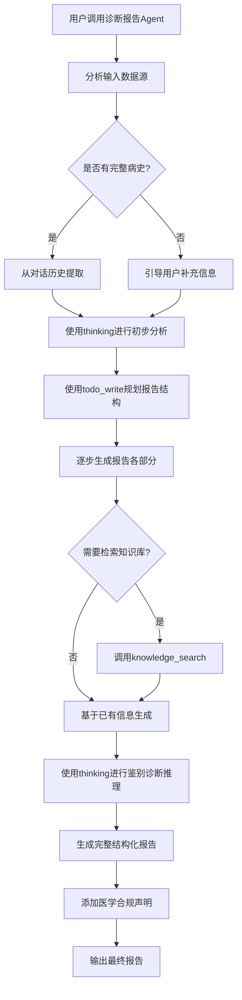

## 用户需求

用户希望为WiseDx医学RAG框架添加医学诊断报告生成agent功能。

## 产品概述

在现有智能问诊助手的基础上，新增一个独立的医学诊断报告生成Agent，能够基于多种数据源（病史采集结果、患者自述、医学文档等）智能生成全面的综合诊断报告。该Agent独立运行，由用户主动调用，不与现有问诊助手自动关联。

## 核心功能

1. **多源数据整合**

- 支持读取问诊助手采集的病史数据
- 支持用户直接输入病史信息
- 可引用知识库中的医学文档和检查结果

2. **智能知识检索**

- 根据患者症状和病史，自动判断是否需要检索临床指南
- 调用知识图谱查询相关疾病关系
- 检索循证医学证据支持诊断建议

3. **结构化报告生成**

- 患者基本信息总结
- 主诉与现病史分析
- 初步诊断建议
- 鉴别诊断分析
- 检查建议（实验室、影像学等）
- 治疗方案建议
- 注意事项与随访建议

4. **医学推理能力**

- 使用thinking工具进行临床思维推理
- 使用todo_write工具规划报告生成步骤
- 基于知识库内容提供循证医学依据

5. **合规声明**

- 明确标注"本报告仅供医学参考，不能替代医生专业诊断"
- 建议用户就医咨询专业医生

## 技术栈

基于现有WiseDx技术栈：

- **后端框架**：Go + Gin
- **Agent引擎**：ReACT架构（已实现）
- **工具系统**：内置工具注册机制
- **知识检索**：RAG + 知识图谱
- **数据库**：PostgreSQL（通过GORM）

## 实现方案

### 1. 整体架构设计

采用与现有内置Agent相同的实现模式，在 `internal/types/custom_agent.go` 中扩展新的医学诊断报告生成Agent。

**核心设计思路**：

- 复用现有Agent引擎和工具注册机制
- 新增专门的system prompt指导报告生成流程
- 配置特定的工具集以支持医学推理和知识检索
- 遵循医疗合规要求，添加免责声明

### 2. System Prompt设计策略

设计专业的医学诊断报告生成提示词，包含：

- **角色定位**：定义为医学诊断报告生成助手，强调辅助性质
- **工作流程**：

1. 收集和分析患者信息（从对话历史或用户输入）
2. 使用thinking工具进行临床推理
3. 根据需要调用knowledge_search检索临床指南
4. 使用todo_write规划报告结构
5. 逐步生成报告的7个核心部分

- **报告结构模板**：明确每个部分的格式要求
- **医学合规**：强制要求在报告开头和结尾添加免责声明

### 3. 工具配置

配置允许使用的工具列表：

- **thinking**：用于医学临床推理，分析症状、体征关联
- **todo_write**：规划报告生成步骤，跟踪进度
- **knowledge_search**：检索临床指南、诊疗规范
- **grep_chunks**：快速查找特定疾病、药物信息
- **query_knowledge_graph**：查询疾病关系、并发症等
- **get_document_info**：获取医学文档元数据
- **list_knowledge_chunks**：查看完整医学文档内容

**不使用的工具**：

- show_options（报告生成不需要用户交互选择）
- data_analysis/data_schema（报告生成不涉及数据分析）
- web_search（避免不可控的网络信息，仅使用知识库）

### 4. 关键配置参数

```
Config: CustomAgentConfig{
    AgentMode: AgentModeSmartReasoning,  // 使用ReAct模式
    Temperature: 0.3,  // 较低温度保证准确性
    MaxIterations: 30,  // 充足的推理步骤
    KBSelectionMode: "all",  // 可访问所有知识库
    RetrieveKBOnlyWhenMentioned: false,  // 自动检索知识库
    AllowedTools: [...],  // 上述工具列表
    WebSearchEnabled: false,  // 不启用网络搜索
    ReflectionEnabled: true,  // 启用反思提升质量
    MultiTurnEnabled: true,  // 支持多轮交互
    HistoryTurns: 20,  // 更多历史记录以获取完整病史
}
```

### 5. 执行流程



### 6. 目录结构修改

本次实现仅需修改一个文件：

```
internal/types/custom_agent.go  [MODIFY]
  - 新增常量定义：BuiltinMedicalDiagnosisReportID
  - 新增工厂函数：GetBuiltinMedicalDiagnosisReportAgent
  - 更新 BuiltinAgentRegistry 注册表
  - 更新 builtinAgentIDsOrdered 显示顺序
  - 实现详细的system prompt和配置
```

### 7. 实现细节

#### 7.1 性能考虑

- **温度设置**：使用0.3的较低温度，保证医学术语准确性，避免幻觉
- **Token优化**：限制单次检索结果数量（EmbeddingTopK: 10, RerankTopK: 5）
- **迭代次数**：最大30次迭代足以生成完整报告，避免过度推理

#### 7.2 日志记录

- 复用现有logger机制，记录关键步骤
- 记录知识库检索命中情况
- 记录thinking推理过程便于调试

#### 7.3 安全性

- **数据隔离**：通过TenantID确保多租户数据隔离
- **权限控制**：依赖现有的API Key和用户认证机制
- **合规性**：强制添加免责声明，避免医疗责任风险

#### 7.4 向后兼容

- 不修改现有Agent（特别是builtin-medical-consultant）
- 新增的Agent ID不与现有ID冲突
- 保持现有API接口不变

### 8. 报告输出格式

生成Markdown格式的结构化报告：

```markdown
# 医学诊断报告

**免责声明**：本报告由AI系统生成，仅供医学参考，不能替代专业医生的临床诊断和治疗建议。请及时就医咨询专业医生。

## 一、患者基本信息
- 姓名：...
- 年龄：...
- 性别：...

## 二、主诉与现病史
...

## 三、初步诊断建议
...

## 四、鉴别诊断
...

## 五、检查建议
...

## 六、治疗方案建议
...

## 七、注意事项与随访建议
...

---
**再次提醒**：本报告仅为辅助参考，具体诊疗方案请遵医嘱。
```

## 技术债务控制

1. **复用现有模式**：完全遵循现有内置Agent的实现模式，不引入新的架构模式
2. **最小化修改**：仅修改一个文件，影响范围可控
3. **无破坏性变更**：不修改现有Agent，不影响现有功能
4. **可扩展性**：预留future扩展空间（如支持导出PDF格式）