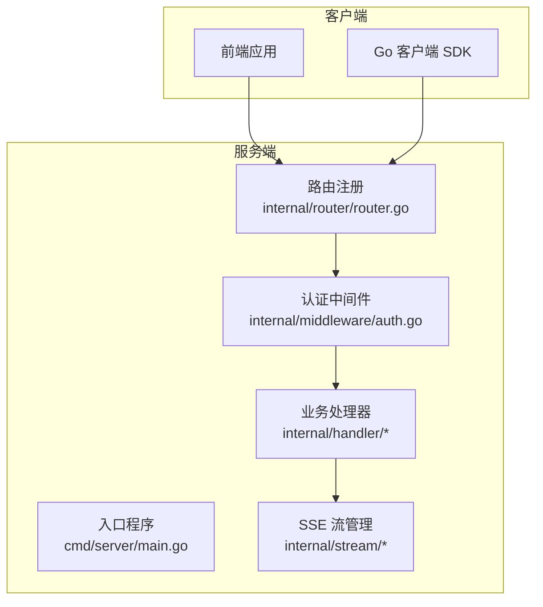
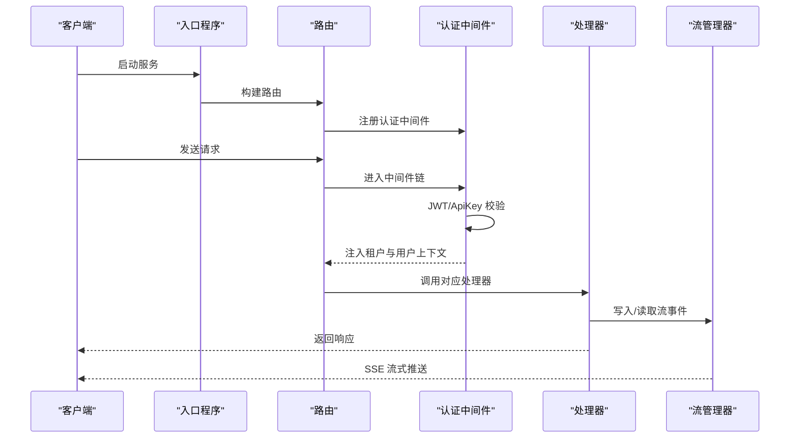
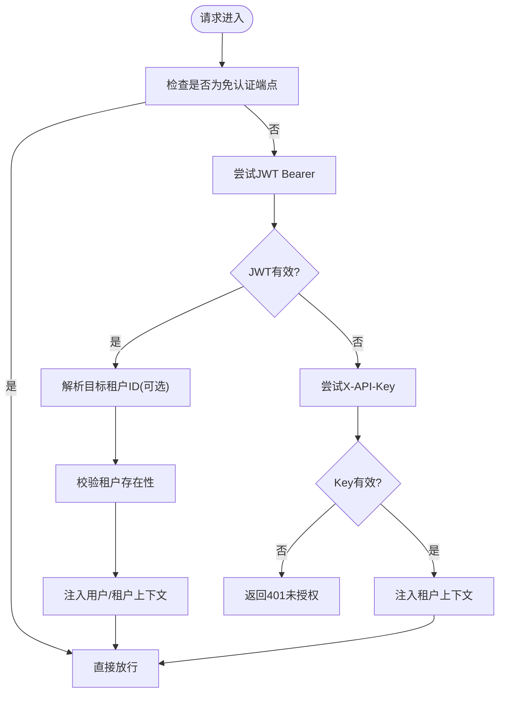
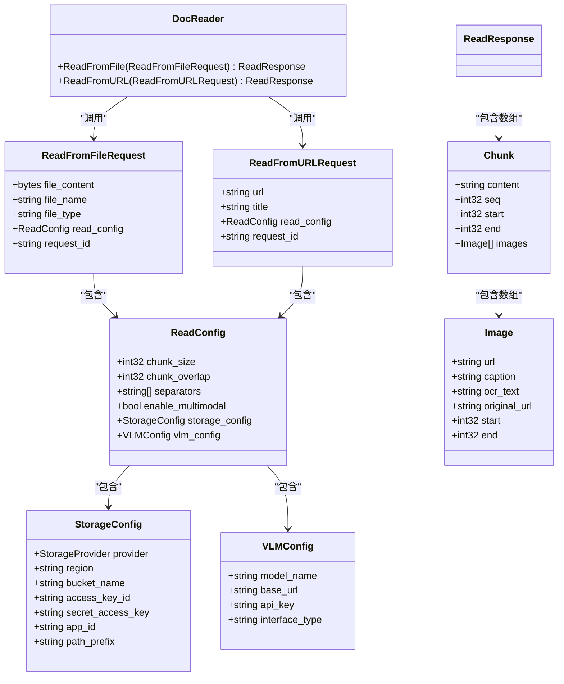
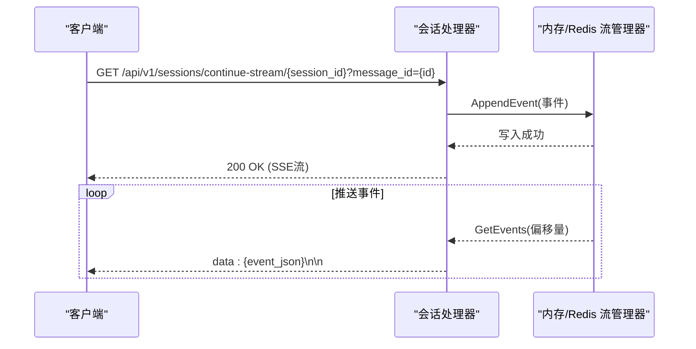
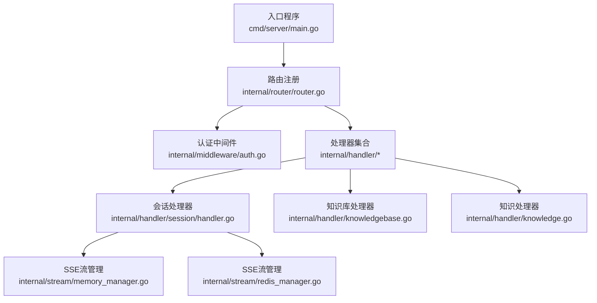

# API接口文档

<cite>
**本文档引用的文件**
- [cmd/server/main.go](file://cmd/server/main.go)
- [internal/router/router.go](file://internal/router/router.go)
- [docs/swagger.yaml](file://docs/swagger.yaml)
- [docs/swagger.json](file://docs/swagger.json)
- [internal/middleware/auth.go](file://internal/middleware/auth.go)
- [internal/handler/auth.go](file://internal/handler/auth.go)
- [internal/handler/knowledgebase.go](file://internal/handler/knowledgebase.go)
- [internal/handler/knowledge.go](file://internal/handler/knowledge.go)
- [internal/handler/session/handler.go](file://internal/handler/session/handler.go)
- [internal/handler/session/stream.go](file://internal/handler/session/stream.go)
- [client/client.go](file://client/client.go)
- [client/message.go](file://client/message.go)
- [docreader/proto/docreader.proto](file://docreader/proto/docreader.proto)
- [internal/stream/memory_manager.go](file://internal/stream/memory_manager.go)
- [internal/stream/redis_manager.go](file://internal/stream/redis_manager.go)
</cite>

## 目录
1. [简介](#简介)
2. [项目结构](#项目结构)
3. [核心组件](#核心组件)
4. [架构总览](#架构总览)
5. [详细组件分析](#详细组件分析)
6. [依赖关系分析](#依赖关系分析)
7. [性能考虑](#性能考虑)
8. [故障排除指南](#故障排除指南)
9. [结论](#结论)
10. [附录](#附录)

## 简介
本文件为 WiseDx（原 WeKnora）项目的完整 API 接口文档，覆盖 RESTful API、认证与授权机制、gRPC 接口定义、WebSocket 实时通信以及错误处理策略。文档基于代码仓库的实际实现，提供端点清单、请求/响应格式、使用示例与最佳实践。

## 项目结构
WiseDx 采用 Go Gin 框架构建 REST API，通过 swag 注解生成 OpenAPI 文档；内部使用依赖注入容器装配路由与处理器；认证中间件支持 JWT 与租户 API Key 双重认证；实时通信通过 Server-Sent Events（SSE）实现；另有独立的 gRPC 服务用于文档解析。

图表来源
- [cmd/server/main.go](file://cmd/server/main.go#L1-L193)
- [internal/router/router.go](file://internal/router/router.go#L54-L118)
- [internal/middleware/auth.go](file://internal/middleware/auth.go#L59-L196)

章节来源
- [cmd/server/main.go](file://cmd/server/main.go#L1-L193)
- [internal/router/router.go](file://internal/router/router.go#L54-L118)

## 核心组件
- 入口与配置：初始化环境变量、构建依赖注入容器、启动 HTTP 服务器、注册路由与中间件。
- 路由系统：按模块分组注册 REST 端点，统一挂载认证中间件与追踪中间件。
- 认证与授权：支持 Bearer JWT 令牌与 X-API-Key 租户密钥；支持跨租户访问控制。
- 业务处理器：实现各资源的 CRUD 与业务逻辑，如知识库、知识、会话、消息等。
- 实时通信：基于 SSE 的流式响应，支持继续接收活跃流。
- gRPC 服务：文档读取服务，支持从文件与 URL 读取并返回分块与图片信息。

章节来源
- [cmd/server/main.go](file://cmd/server/main.go#L88-L192)
- [internal/router/router.go](file://internal/router/router.go#L54-L118)
- [internal/middleware/auth.go](file://internal/middleware/auth.go#L59-L196)

## 架构总览
WiseDx 的 API 架构遵循分层设计：入口负责初始化与容器装配；路由层负责 URL 映射与中间件链；认证中间件负责鉴权与上下文注入；处理器层负责业务逻辑；流管理器负责 SSE 事件存储与推送。

图表来源
- [cmd/server/main.go](file://cmd/server/main.go#L124-L188)
- [internal/router/router.go](file://internal/router/router.go#L90-L115)
- [internal/middleware/auth.go](file://internal/middleware/auth.go#L59-L196)
- [internal/handler/session/stream.go](file://internal/handler/session/stream.go#L31-L120)

## 详细组件分析

### 认证与授权机制
- 支持两种认证方式：
  - Bearer JWT 令牌：标准 OAuth2 Bearer 方案，支持刷新与校验。
  - X-API-Key：租户级 API Key，用于服务间调用或兼容场景。
- 跨租户访问：当用户具备跨租户权限且携带目标租户头时，可切换到目标租户上下文。
- 无需认证的端点：健康检查、注册、登录、刷新令牌。

图表来源
- [internal/middleware/auth.go](file://internal/middleware/auth.go#L18-L196)

章节来源
- [internal/middleware/auth.go](file://internal/middleware/auth.go#L18-L196)
- [internal/handler/auth.go](file://internal/handler/auth.go#L42-L104)

### RESTful API 端点清单与规范

- 基础路径：/api/v1
- 认证要求：除免认证端点外，默认需 Bearer 或 X-API-Key
- 响应格式：统一为 { "success": true/false, "data": ..., "message": "...", "code": "..." } 结构，错误时包含错误码与详情
- 请求头：
  - Authorization: Bearer {token}
  - X-API-Key: {sk-开头的租户密钥}
  - X-Tenant-ID: 目标租户ID（跨租户访问时）
  - Content-Type: application/json
  - Accept: application/json

章节来源
- [docs/swagger.json](file://docs/swagger.json#L1-L800)
- [docs/swagger.yaml](file://docs/swagger.yaml#L1-L800)

#### 认证相关端点
- 登录
  - 方法：POST
  - 路径：/api/v1/auth/login
  - 请求体：LoginRequest
  - 响应体：LoginResponse
  - 示例：
    - 请求：{"email":"user@example.com","password":"your_password"}
    - 成功响应：{"success":true,"token":"...","refresh_token":"...","user":{...},"tenant":{...}}
- 刷新令牌
  - 方法：POST
  - 路径：/api/v1/auth/refresh
  - 请求体：{"refreshToken":"..."}
  - 响应体：{"success":true,"access_token":"...","refresh_token":"..."}
- 注销
  - 方法：POST
  - 路径：/api/v1/auth/logout
  - 请求头：Authorization: Bearer {token}
  - 响应体：{"success":true,"message":"Logout successful"}
- 当前用户
  - 方法：GET
  - 路径：/api/v1/auth/me
  - 请求头：Authorization: Bearer {token}
  - 响应体：{"success":true,"data":{"user":{...},"tenant":{...}}}
- 修改密码
  - 方法：POST
  - 路径：/api/v1/auth/change-password
  - 请求体：{"old_password":"...","new_password":"..."}
  - 响应体：{"success":true,"message":"Password changed successfully"}

章节来源
- [docs/swagger.json](file://docs/swagger.json#L14-L305)
- [internal/handler/auth.go](file://internal/handler/auth.go#L106-L348)

#### 知识库管理
- 创建知识库
  - 方法：POST
  - 路径：/api/v1/knowledge-bases
  - 请求体：KnowledgeBase
  - 响应体：{"success":true,"data":{...}}
- 获取知识库列表
  - 方法：GET
  - 路径：/api/v1/knowledge-bases
  - 响应体：{"success":true,"data":[{...}]}
- 获取知识库详情
  - 方法：GET
  - 路径：/api/v1/knowledge-bases/{id}
  - 响应体：{"success":true,"data":{...}}
- 更新知识库
  - 方法：PUT
  - 路径：/api/v1/knowledge-bases/{id}
  - 请求体：{"name":"...","description":"...","config":{...}}
  - 响应体：{"success":true,"data":{...}}
- 删除知识库
  - 方法：DELETE
  - 路径：/api/v1/knowledge-bases/{id}
  - 响应体：{"success":true,"message":"Knowledge base deleted successfully"}
- 混合搜索
  - 方法：GET
  - 路径：/api/v1/knowledge-bases/{id}/hybrid-search
  - 查询参数：q、embedding_top_k、rerank_top_k 等
  - 响应体：{"success":true,"data":[{...}]}
- 复制知识库
  - 方法：POST
  - 路径：/api/v1/knowledge-bases/copy
  - 请求体：{"source_id":"...","target_id":"...","task_id":""}
  - 响应体：{"success":true,"data":{"task_id":"...","source_id":"...","target_id":"...","message":"..."}}
- 获取复制进度
  - 方法：GET
  - 路径：/api/v1/knowledge-bases/copy/progress/{task_id}
  - 响应体：{"success":true,"data":{...}}

章节来源
- [docs/swagger.json](file://docs/swagger.json#L306-L800)
- [internal/handler/knowledgebase.go](file://internal/handler/knowledgebase.go#L39-L469)

#### 知识管理
- 从文件创建知识
  - 方法：POST
  - 路径：/api/v1/knowledge-bases/{id}/knowledge/file
  - 表单字段：file、fileName、metadata、enable_multimodel、tag_id
  - 响应体：{"success":true,"data":{...}}
- 从URL创建知识
  - 方法：POST
  - 路径：/api/v1/knowledge-bases/{id}/knowledge/url
  - 请求体：{"url":"...","enable_multimodel":true,"title":"...","tag_id":"..."}
  - 响应体：{"success":true,"data":{...}}
- 手工创建知识
  - 方法：POST
  - 路径：/api/v1/knowledge-bases/{id}/knowledge/manual
  - 请求体：{"title":"...","content":"...","status":"..."}
  - 响应体：{"success":true,"data":{...}}
- 获取知识详情
  - 方法：GET
  - 路径：/api/v1/knowledge/{id}
  - 响应体：{"success":true,"data":{...}}
- 获取知识列表
  - 方法：GET
  - 路径：/api/v1/knowledge-bases/{id}/knowledge
  - 查询参数：page、page_size、tag_id、keyword、file_type
  - 响应体：{"success":true,"data":[{...}],"total":1,"page":1,"page_size":10}
- 删除知识
  - 方法：DELETE
  - 路径：/api/v1/knowledge/{id}
  - 响应体：{"success":true,"message":"Deleted successfully"}
- 批量获取知识
  - 方法：GET
  - 路径：/api/v1/knowledge/batch
  - 查询参数：ids
  - 响应体：{"success":true,"data":[{...}]}
- 更新知识
  - 方法：PUT
  - 路径：/api/v1/knowledge/{id}
  - 请求体：Knowledge
  - 响应体：{"success":true,"message":"Knowledge chunk updated successfully"}
- 更新手工知识
  - 方法：PUT
  - 路径：/api/v1/knowledge/manual/{id}
  - 请求体：ManualKnowledgePayload
  - 响应体：{"success":true,"data":{...}}
- 批量更新知识标签
  - 方法：PUT
  - 路径：/api/v1/knowledge/tags
  - 请求体：{"updates":{"knowledge_id":"tag_id"}}
  - 响应体：{"success":true}
- 下载知识文件
  - 方法：GET
  - 路径：/api/v1/knowledge/{id}/download
  - 响应体：二进制文件流
- 更新图像信息
  - 方法：PUT
  - 路径：/api/v1/knowledge/image/{id}/{chunk_id}
  - 请求体：{"image_info":"..."}
  - 响应体：{"success":true,"message":"Knowledge chunk image updated successfully"}

章节来源
- [docs/swagger.json](file://docs/swagger.json#L800-L1600)
- [internal/handler/knowledge.go](file://internal/handler/knowledge.go#L86-L795)

#### 分块管理
- 获取分块列表
  - 方法：GET
  - 路径：/api/v1/chunks/{knowledge_id}
  - 查询参数：page、page_size
  - 响应体：{"success":true,"data":[{...}]}
- 通过ID获取分块
  - 方法：GET
  - 路径：/api/v1/chunks/by-id/{id}
  - 响应体：{"success":true,"data":{...}}
- 删除分块
  - 方法：DELETE
  - 路径：/api/v1/chunks/{knowledge_id}/{id}
  - 响应体：{"success":true}
- 删除知识下所有分块
  - 方法：DELETE
  - 路径：/api/v1/chunks/{knowledge_id}
  - 响应体：{"success":true}
- 更新分块
  - 方法：PUT
  - 路径：/api/v1/chunks/{knowledge_id}/{id}
  - 请求体：UpdateChunkRequest
  - 响应体：{"success":true,"data":{...}}
- 删除生成的问题
  - 方法：DELETE
  - 路径：/api/v1/chunks/by-id/{id}/questions
  - 请求体：{"question_id":"..."}
  - 响应体：{"success":true}

章节来源
- [docs/swagger.json](file://docs/swagger.json#L1600-L2400)
- [internal/router/router.go](file://internal/router/router.go#L120-L138)

#### 会话与消息
- 创建会话
  - 方法：POST
  - 路径：/api/v1/sessions
  - 请求体：CreateSessionRequest
  - 响应体：{"success":true,"data":{...}}
- 获取会话详情
  - 方法：GET
  - 路径：/api/v1/sessions/{id}
  - 响应体：{"success":true,"data":{...}}
- 获取会话列表
  - 方法：GET
  - 路径：/api/v1/sessions
  - 查询参数：page、page_size
  - 响应体：{"success":true,"data":[{...}],"total":1,"page":1,"page_size":10}
- 更新会话
  - 方法：PUT
  - 路径：/api/v1/sessions/{id}
  - 请求体：Session
  - 响应体：{"success":true,"data":{...}}
- 删除会话
  - 方法：DELETE
  - 路径：/api/v1/sessions/{id}
  - 响应体：{"success":true,"message":"Session deleted successfully"}
- 生成标题
  - 方法：POST
  - 路径：/api/v1/sessions/{session_id}/generate_title
  - 请求体：{}
  - 响应体：{"success":true,"data":{"title":"..."}}
- 停止会话
  - 方法：POST
  - 路径：/api/v1/sessions/{session_id}/stop
  - 请求体：{"message_id":"..."}
  - 响应体：{"success":true,"message":"..."}
- 继续接收活跃流
  - 方法：GET
  - 路径：/api/v1/sessions/continue-stream/{session_id}
  - 查询参数：message_id
  - 响应体：SSE 流
- 加载历史消息
  - 方法：GET
  - 路径：/api/v1/messages/{session_id}/load
  - 查询参数：limit、before_time
  - 响应体：{"success":true,"data":[{...}]}
- 删除消息
  - 方法：DELETE
  - 路径：/api/v1/messages/{session_id}/{id}
  - 响应体：{"success":true,"message":"..."}
- 知识问答
  - 方法：POST
  - 路径：/api/v1/knowledge-chat/{session_id}
  - 请求体：{"query":"...","knowledge_base_id":"..."}
  - 响应体：SSE 流
- Agent 问答
  - 方法：POST
  - 路径：/api/v1/agent-chat/{session_id}
  - 请求体：{"query":"...","agent_id":"..."}
  - 响应体：SSE 流
- 知识检索（无会话）
  - 方法：POST
  - 路径：/api/v1/knowledge-search
  - 请求体：{"query":"...","knowledge_base_id":"..."}
  - 响应体：{"success":true,"data":[{...}]}

章节来源
- [docs/swagger.json](file://docs/swagger.json#L2400-L4000)
- [internal/handler/session/handler.go](file://internal/handler/session/handler.go#L44-L299)
- [internal/handler/session/stream.go](file://internal/handler/session/stream.go#L18-L120)
- [internal/router/router.go](file://internal/router/router.go#L258-L292)

#### 初始化与系统
- 获取当前配置
  - 方法：GET
  - 路径：/api/v1/initialization/config/{kbId}
  - 响应体：{"success":true,"data":{...}}
- 初始化知识库
  - 方法：POST
  - 路径：/api/v1/initialization/initialize/{kbId}
  - 请求体：{"model_id":"..."}
  - 响应体：{"success":true,"message":"..."}
- 更新配置
  - 方法：PUT
  - 路径：/api/v1/initialization/config/{kbId}
  - 请求体：{"model_id":"..."}
  - 响应体：{"success":true,"message":"..."}
- Ollama 状态检查
  - 方法：GET
  - 路径：/api/v1/initialization/ollama/status
  - 响应体：{"success":true,"data":{"status":"..."}}
- Ollama 模型列表
  - 方法：GET
  - 路径：/api/v1/initialization/ollama/models
  - 响应体：{"success":true,"data":[{"name":"..."}]}
- 检查 Ollama 模型
  - 方法：POST
  - 路径：/api/v1/initialization/ollama/models/check
  - 请求体：{"models":["..."]}
  - 响应体：{"success":true,"data":{"result":"..."}}
- 下载 Ollama 模型
  - 方法：POST
  - 路径：/api/v1/initialization/ollama/models/download
  - 请求体：{"model":"..."}
  - 响应体：{"success":true,"data":{"task_id":"..."}}
- 下载进度
  - 方法：GET
  - 路径：/api/v1/initialization/ollama/download/progress/{taskId}
  - 响应体：{"success":true,"data":{"progress":0.0}}
- 下载任务列表
  - 方法：GET
  - 路径：/api/v1/initialization/ollama/download/tasks
  - 响应体：{"success":true,"data":[{"task_id":"...","status":"..."}]}
- 远程模型检查
  - 方法：POST
  - 路径：/api/v1/initialization/remote/check
  - 请求体：{"provider":"...","model":"..."}
  - 响应体：{"success":true,"data":{"available":true}}
- 嵌入模型测试
  - 方法：POST
  - 路径：/api/v1/initialization/embedding/test
  - 请求体：{"text":"...","model_id":"..."}
  - 响应体：{"success":true,"data":{"vector":[...]}}
- 重排序模型检查
  - 方法：POST
  - 路径：/api/v1/initialization/rerank/check
  - 请求体：{"query":"...","documents":[{"text":"..."}]}
  - 响应体：{"success":true,"data":{"scores":[...]}}
- 多模态功能测试
  - 方法：POST
  - 路径：/api/v1/initialization/multimodal/test
  - 请求体：{"prompt":"...","image_url":"..."}
  - 响应体：{"success":true,"data":{"result":"..."}}
- 文本关系抽取
  - 方法：POST
  - 路径：/api/v1/initialization/extract/text-relation
  - 请求体：{"text":"..."}
  - 响应体：{"success":true,"data":{"relations":[...]}}
- Fabri 标签抽取
  - 方法：POST
  - 路径：/api/v1/initialization/extract/fabri-tag
  - 请求体：{"text":"..."}
  - 响应体：{"success":true,"data":{"tags":[...]}}
- Fabri 文本抽取
  - 方法：POST
  - 路径：/api/v1/initialization/extract/fabri-text
  - 请求体：{"text":"..."}
  - 响应体：{"success":true,"data":{"text":"..."}}

章节来源
- [docs/swagger.json](file://docs/swagger.json#L4000-L5185)
- [internal/router/router.go](file://internal/router/router.go#L355-L378)

#### 其他端点
- 系统信息
  - 方法：GET
  - 路径：/api/v1/system/info
  - 响应体：{"success":true,"data":{...}}
- MinIO 桶列表
  - 方法：GET
  - 路径：/api/v1/system/minio/buckets
  - 响应体：{"success":true,"data":[{"name":"..."}]}

章节来源
- [docs/swagger.json](file://docs/swagger.json#L5185-L6000)
- [internal/router/router.go](file://internal/router/router.go#L380-L387)

### gRPC 接口定义
文档读取服务（DocReader）提供从文件与 URL 读取文档的能力，并返回分块与图片信息。

图表来源
- [docreader/proto/docreader.proto](file://docreader/proto/docreader.proto#L1-L89)

章节来源
- [docreader/proto/docreader.proto](file://docreader/proto/docreader.proto#L1-L89)

### WebSocket 实时通信
WiseDx 通过 Server-Sent Events（SSE）实现流式通信，支持继续接收活跃流与事件追加。

图表来源
- [internal/handler/session/stream.go](file://internal/handler/session/stream.go#L31-L120)
- [internal/stream/memory_manager.go](file://internal/stream/memory_manager.go#L62-L115)
- [internal/stream/redis_manager.go](file://internal/stream/redis_manager.go#L56-L128)

章节来源
- [internal/handler/session/stream.go](file://internal/handler/session/stream.go#L31-L120)
- [internal/stream/memory_manager.go](file://internal/stream/memory_manager.go#L1-L119)
- [internal/stream/redis_manager.go](file://internal/stream/redis_manager.go#L1-L137)

### 客户端集成指南与SDK使用示例
- Go 客户端 SDK 提供基础 HTTP 客户端封装，自动设置 Content-Type、X-API-Key 与 X-Request-ID。
- 常用操作：
  - 创建客户端：NewClient(baseURL, WithTimeout(30*time.Second), WithToken("sk-..."))
  - 加载会话消息：LoadMessages(ctx, sessionID, limit, beforeTime)
  - 删除消息：DeleteMessage(ctx, sessionID, messageID)

章节来源
- [client/client.go](file://client/client.go#L1-L105)
- [client/message.go](file://client/message.go#L62-L119)

## 依赖关系分析

图表来源
- [cmd/server/main.go](file://cmd/server/main.go#L124-L188)
- [internal/router/router.go](file://internal/router/router.go#L54-L118)
- [internal/middleware/auth.go](file://internal/middleware/auth.go#L59-L196)
- [internal/handler/session/handler.go](file://internal/handler/session/handler.go#L25-L42)

章节来源
- [internal/router/router.go](file://internal/router/router.go#L54-L118)
- [internal/middleware/auth.go](file://internal/middleware/auth.go#L59-L196)

## 性能考虑
- SSE 流管理：
  - 内存实现适合单实例部署，事件保存在内存中，断电丢失。
  - Redis 实现适合分布式部署，事件持久化并带 TTL，支持横向扩展。
- 并发与锁：
  - 内存流管理器使用读写锁保护事件列表，避免竞态条件。
  - Redis 流管理器使用列表结构与原子操作，保证事件追加一致性。
- 超时与重试：
  - 客户端默认超时 30 秒；gRPC 服务建议配置合理的超时与重试策略。
- 日志与追踪：
  - 中间件链包含请求 ID、日志、恢复与追踪，便于性能分析与问题定位。

## 故障排除指南
- 401 未授权
  - 检查 Authorization 头是否为 Bearer {token}，或 X-API-Key 是否正确。
  - 跨租户访问需携带 X-Tenant-ID 并确保用户具备跨租户权限。
- 403 禁止访问
  - 用户无权限访问目标资源或租户。
- 404 资源不存在
  - 确认 ID 是否正确，资源是否已被删除。
- 409 冲突
  - 如重复知识创建，返回冲突并包含现有资源信息。
- 5xx 服务器错误
  - 查看服务端日志与追踪信息，确认数据库、缓存与外部服务可用性。

章节来源
- [internal/middleware/auth.go](file://internal/middleware/auth.go#L193-L196)
- [internal/handler/knowledge.go](file://internal/handler/knowledge.go#L67-L84)

## 结论
WiseDx 提供了完善的 REST API 与实时通信能力，结合 JWT 与租户 API Key 的双重认证机制，满足多租户场景下的安全与权限控制需求。gRPC 文档读取服务与 SSE 实时流进一步增强了系统的扩展性与用户体验。建议在生产环境中优先采用 Redis 流管理器以获得更好的可扩展性与可靠性。

## 附录
- 版本管理与向后兼容
  - API 基于 /api/v1 命名空间，遵循语义化版本管理，变更通过新增端点或扩展字段保持兼容。
- 错误码参考
  - 参考 Swagger 定义中的 ErrorCode 枚举，涵盖 4xx/5xx 场景与租户相关错误。