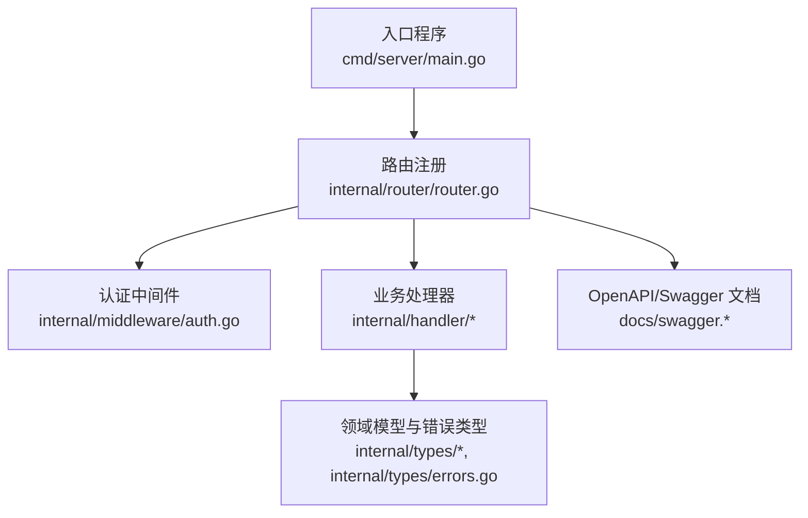
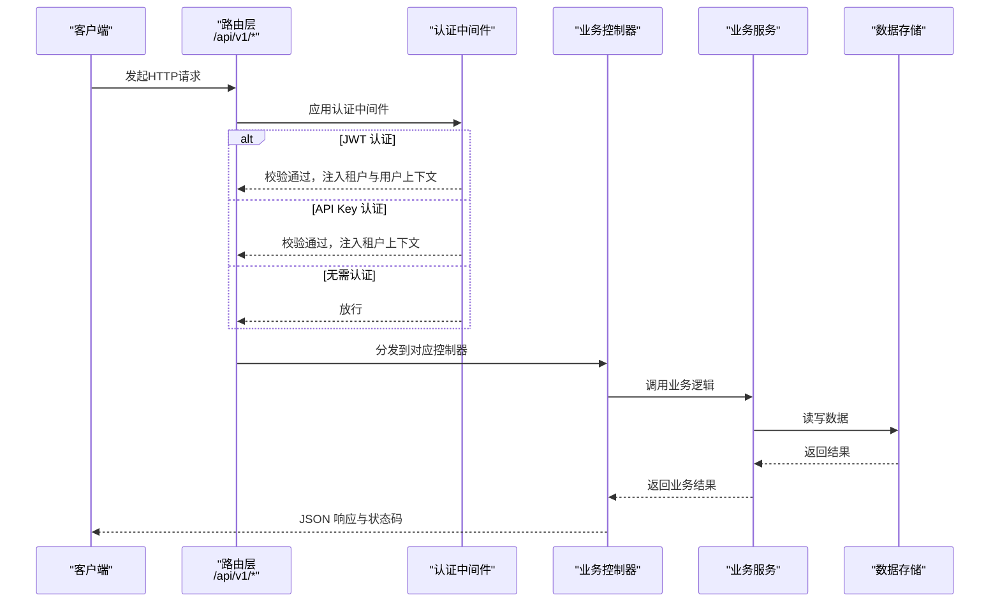
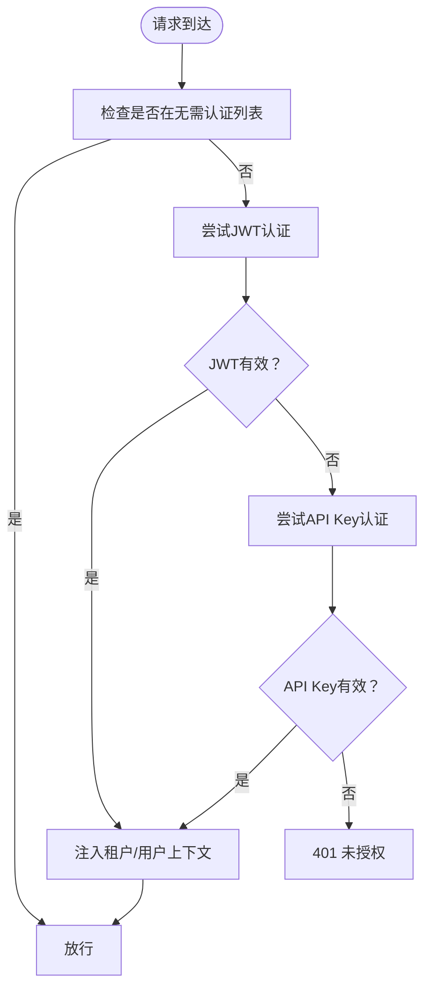
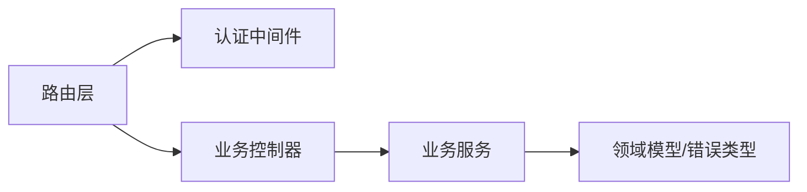

# RESTful API接口

<cite>
**本文引用的文件**
- [cmd/server/main.go](file://cmd/server/main.go)
- [internal/router/router.go](file://internal/router/router.go)
- [docs/swagger.yaml](file://docs/swagger.yaml)
- [docs/swagger.json](file://docs/swagger.json)
- [internal/middleware/auth.go](file://internal/middleware/auth.go)
- [internal/handler/auth.go](file://internal/handler/auth.go)
- [internal/handler/knowledgebase.go](file://internal/handler/knowledgebase.go)
- [internal/handler/knowledge.go](file://internal/handler/knowledge.go)
- [internal/handler/chunk.go](file://internal/handler/chunk.go)
- [internal/handler/session/handler.go](file://internal/handler/session/handler.go)
- [internal/handler/message.go](file://internal/handler/message.go)
- [internal/handler/model.go](file://internal/handler/model.go)
- [internal/handler/tenant.go](file://internal/handler/tenant.go)
- [internal/types/errors.go](file://internal/types/errors.go)
</cite>

## 目录
1. [简介](#简介)
2. [项目结构](#项目结构)
3. [核心组件](#核心组件)
4. [架构总览](#架构总览)
5. [详细组件分析](#详细组件分析)
6. [依赖分析](#依赖分析)
7. [性能考虑](#性能考虑)
8. [故障排查指南](#故障排查指南)
9. [结论](#结论)
10. [附录](#附录)

## 简介
本文件为 WiseDx（WeKnora）系统的 RESTful API 接口权威文档，覆盖所有 HTTP 端点的完整规范，包括请求方法、URL 路径、请求参数、请求体格式、响应结构与状态码；并说明认证机制（JWT 令牌与租户 API Key）、权限控制与安全策略；提供参数校验规则、错误处理与异常场景；介绍分页、过滤、排序等通用查询参数的使用方法；记录 API 版本控制策略与向后兼容性保障。

## 项目结构
WiseDx 的服务端基于 Go 语言与 Gin 框架构建，入口程序负责加载环境变量、初始化容器与路由，路由层统一挂载各业务模块的控制器，中间件层实现认证、CORS、日志、错误处理与追踪。

图表来源
- [cmd/server/main.go](file://cmd/server/main.go#L1-L193)
- [internal/router/router.go](file://internal/router/router.go#L1-L442)
- [internal/middleware/auth.go](file://internal/middleware/auth.go#L1-L200)
- [docs/swagger.yaml](file://docs/swagger.yaml#L1-L800)

章节来源
- [cmd/server/main.go](file://cmd/server/main.go#L1-L193)
- [internal/router/router.go](file://internal/router/router.go#L1-L442)

## 核心组件
- 入口与启动
  - 加载环境变量、设置日志、选择 Gin 模式、构建依赖注入容器、启动 HTTP 服务器并优雅关闭。
- 路由与中间件
  - 全局中间件：CORS、请求 ID、日志、恢复、错误处理；认证中间件；OpenTelemetry 追踪。
  - API 基础路径：/api/v1；健康检查：/health。
- 认证与权限
  - 支持两种认证方式：Authorization: Bearer <JWT> 与 X-API-Key（租户级 API Key）。
  - 支持跨租户访问（需配置启用且用户具备相应权限）。
- 业务模块
  - 认证、租户、知识库、知识、分块、会话、消息、模型、评估、系统、MCP 服务、网络搜索、自定义 Agent 等。

章节来源
- [cmd/server/main.go](file://cmd/server/main.go#L47-L193)
- [internal/router/router.go](file://internal/router/router.go#L53-L118)
- [internal/middleware/auth.go](file://internal/middleware/auth.go#L59-L196)

## 架构总览
下图展示请求在系统中的流转：客户端 → 路由 → 中间件 → 控制器 → 服务层 → 数据存储；同时标注了认证与安全策略。

图表来源
- [internal/router/router.go](file://internal/router/router.go#L95-L115)
- [internal/middleware/auth.go](file://internal/middleware/auth.go#L59-L196)

## 详细组件分析

### 认证与安全
- 基础路径与安全定义
  - BasePath: /api/v1
  - 安全定义：Bearer（Authorization 头）与 ApiKeyAuth（X-API-Key 头）
- 认证流程
  - JWT：Authorization: Bearer <token>，成功后将租户与用户信息注入上下文。
  - API Key：X-API-Key: sk-...，用于租户级调用，校验通过后注入租户上下文。
  - 跨租户访问：通过 X-Tenant-ID 指定目标租户，需用户具备跨租户访问权限。
- 无需认证的端点
  - /health、/api/v1/auth/register、/api/v1/auth/login、/api/v1/auth/refresh

图表来源
- [internal/middleware/auth.go](file://internal/middleware/auth.go#L18-L39)
- [internal/middleware/auth.go](file://internal/middleware/auth.go#L59-L196)

章节来源
- [internal/middleware/auth.go](file://internal/middleware/auth.go#L18-L39)
- [internal/middleware/auth.go](file://internal/middleware/auth.go#L59-L196)
- [cmd/server/main.go](file://cmd/server/main.go#L12-L22)

### 认证模块（Auth）
- 端点概览
  - POST /api/v1/auth/register：注册新用户
  - POST /api/v1/auth/login：登录获取令牌
  - POST /api/v1/auth/refresh：刷新访问令牌
  - GET /api/v1/auth/validate：验证访问令牌
  - POST /api/v1/auth/logout：登出撤销令牌
  - GET /api/v1/auth/me：获取当前用户信息
  - POST /api/v1/auth/change-password：修改密码
- 请求与响应要点
  - 登录：请求体包含邮箱与密码；成功返回令牌、刷新令牌与用户信息。
  - 刷新：请求体包含 refreshToken。
  - 修改密码：请求体包含 old_password 与 new_password。
- 状态码
  - 成功：200；创建：201；未授权：401；参数错误：400；禁止：403。
- 安全与权限
  - 除注册、登录、刷新外，其余端点均需 Bearer 认证。

章节来源
- [internal/handler/auth.go](file://internal/handler/auth.go#L42-L200)
- [docs/swagger.json](file://docs/swagger.json#L15-L305)

### 租户管理（Tenant）
- 端点概览
  - GET /api/v1/tenants/all：列出所有租户（需跨租户权限）
  - GET /api/v1/tenants/search：搜索租户（需跨租户权限）
  - POST /api/v1/tenants：创建租户
  - GET /api/v1/tenants/{id}：获取租户详情
  - PUT /api/v1/tenants/{id}：更新租户
  - DELETE /api/v1/tenants/{id}：删除租户
  - GET /api/v1/tenants/kv/{key}：获取租户级 KV 配置
  - PUT /api/v1/tenants/kv/{key}：更新租户级 KV 配置
- 权限与安全
  - 跨租户访问需启用配置且用户具备相应权限。
  - 除创建租户外，多数端点需 Bearer 或 ApiKey 认证。

章节来源
- [internal/handler/tenant.go](file://internal/handler/tenant.go#L43-L200)
- [docs/swagger.json](file://docs/swagger.json#L1-L800)

### 知识库（Knowledge Base）
- 端点概览
  - POST /api/v1/knowledge-bases：创建知识库
  - GET /api/v1/knowledge-bases：获取知识库列表
  - GET /api/v1/knowledge-bases/{id}：获取知识库详情
  - PUT /api/v1/knowledge-bases/{id}：更新知识库
  - DELETE /api/v1/knowledge-bases/{id}：删除知识库
  - GET /api/v1/knowledge-bases/{id}/hybrid-search：混合搜索
  - POST /api/v1/knowledge-bases/copy：拷贝知识库
  - GET /api/v1/knowledge-bases/copy/progress/{task_id}：获取拷贝进度
- 权限与安全
  - 需 Bearer 或 ApiKey 认证；操作需满足租户所有权校验。

章节来源
- [internal/handler/knowledgebase.go](file://internal/handler/knowledgebase.go#L39-L200)
- [docs/swagger.json](file://docs/swagger.json#L1-L800)

### 知识管理（Knowledge）
- 端点概览
  - POST /api/v1/knowledge-bases/{id}/knowledge/file：从文件创建知识
  - POST /api/v1/knowledge-bases/{id}/knowledge/url：从 URL 创建知识
  - POST /api/v1/knowledge-bases/{id}/knowledge/manual：手工录入 Markdown
  - GET /api/v1/knowledge-bases/{id}/knowledge：获取知识列表
  - GET /api/v1/knowledge/{id}：获取知识详情
  - DELETE /api/v1/knowledge/{id}：删除知识
  - PUT /api/v1/knowledge/{id}：更新知识
  - PUT /api/v1/knowledge/manual/{id}：更新手工录入知识
  - GET /api/v1/knowledge/{id}/download：下载知识文件
  - PUT /api/v1/knowledge/image/{id}/{chunk_id}：更新图像分块信息
  - PUT /api/v1/knowledge/tags：批量更新知识标签
  - GET /api/v1/knowledge/search：搜索知识
  - GET /api/v1/knowledge/batch：批量获取知识
- 权限与安全
  - 需 Bearer 或 ApiKey 认证；涉及文件上传时支持元数据与多模态开关。

章节来源
- [internal/handler/knowledge.go](file://internal/handler/knowledge.go#L86-L200)
- [docs/swagger.json](file://docs/swagger.json#L1-L800)

### 分块管理（Chunk）
- 端点概览
  - GET /api/v1/chunks/{knowledge_id}：获取知识分块列表（支持分页）
  - GET /api/v1/chunks/by-id/{id}：仅按分块ID获取分块详情
  - DELETE /api/v1/chunks/{knowledge_id}：删除知识下所有分块
  - DELETE /api/v1/chunks/{knowledge_id}/{id}：删除指定分块
  - PUT /api/v1/chunks/{knowledge_id}/{id}：更新分块
  - DELETE /api/v1/chunks/by-id/{id}/questions：删除生成的问题
- 权限与安全
  - 需 Bearer 或 ApiKey 认证；更新/删除需校验租户所有权。

章节来源
- [internal/handler/chunk.go](file://internal/handler/chunk.go#L25-L200)
- [docs/swagger.json](file://docs/swagger.json#L306-L425)

### 会话与消息（Session & Message）
- 会话（Session）
  - POST /api/v1/sessions：创建会话
  - GET /api/v1/sessions/{id}：获取会话详情
  - GET /api/v1/sessions：获取当前租户会话列表（分页）
  - PUT /api/v1/sessions/{id}：更新会话
  - DELETE /api/v1/sessions/{id}：删除会话
  - POST /api/v1/sessions/{session_id}/generate_title：生成标题
  - POST /api/v1/sessions/{session_id}/stop：停止会话
  - GET /api/v1/sessions/continue-stream/{session_id}：继续接收活跃流
- 消息（Message）
  - GET /api/v1/messages/{session_id}/load：加载消息历史（支持 limit 与 before_time）
  - DELETE /api/v1/messages/{session_id}/{id}：删除消息
- 权限与安全
  - 需 Bearer 或 ApiKey 认证；分页查询支持默认值与上限约束。

章节来源
- [internal/handler/session/handler.go](file://internal/handler/session/handler.go#L44-L200)
- [internal/handler/message.go](file://internal/handler/message.go#L33-L159)
- [docs/swagger.json](file://docs/swagger.json#L1-L800)

### 模型管理（Model）
- 端点概览
  - GET /api/v1/models/providers：获取模型厂商列表
  - POST /api/v1/models：创建模型
  - GET /api/v1/models：获取当前租户模型列表
  - GET /api/v1/models/{id}：获取模型详情
  - PUT /api/v1/models/{id}：更新模型
  - DELETE /api/v1/models/{id}：删除模型
- 权限与安全
  - 需 Bearer 或 ApiKey 认证；内置模型敏感字段会被隐藏。

章节来源
- [internal/handler/model.go](file://internal/handler/model.go#L72-L200)
- [docs/swagger.json](file://docs/swagger.json#L1-L800)

### 评估、系统、MCP、网络搜索、自定义 Agent
- 评估（Evaluation）
  - POST /api/v1/evaluation/：提交评估任务
  - GET /api/v1/evaluation/?task_id=...：获取评估结果
- 系统（System）
  - GET /api/v1/system/info：获取系统信息
  - GET /api/v1/system/minio/buckets：列举 MinIO 桶
- MCP 服务（MCP Service）
  - POST /api/v1/mcp-services：创建
  - GET /api/v1/mcp-services：列表
  - GET /api/v1/mcp-services/{id}：详情
  - PUT /api/v1/mcp-services/{id}：更新
  - DELETE /api/v1/mcp-services/{id}：删除
  - POST /api/v1/mcp-services/{id}/test：测试连接
  - GET /api/v1/mcp-services/{id}/tools：获取工具
  - GET /api/v1/mcp-services/{id}/resources：获取资源
- 网络搜索（Web Search）
  - GET /api/v1/web-search/providers：获取可用提供商
- 自定义 Agent
  - GET /api/v1/agents/placeholders：占位符定义
  - POST /api/v1/agents：创建
  - GET /api/v1/agents：列表（含内置）
  - GET /api/v1/agents/{id}：详情
  - PUT /api/v1/agents/{id}：更新
  - DELETE /api/v1/agents/{id}：删除
  - POST /api/v1/agents/{id}/copy：复制

章节来源
- [internal/router/router.go](file://internal/router/router.go#L336-L441)
- [docs/swagger.json](file://docs/swagger.json#L1-L800)

### 初始化与配置（Initialization）
- 端点概览
  - GET /api/v1/initialization/config/{kbId}：获取当前配置
  - POST /api/v1/initialization/initialize/{kbId}：按知识库初始化
  - PUT /api/v1/initialization/config/{kbId}：更新知识库配置（简化版）
  - GET /api/v1/initialization/ollama/status：检查 Ollama 状态
  - GET /api/v1/initialization/ollama/models：列举模型
  - POST /api/v1/initialization/ollama/models/check：校验模型
  - POST /api/v1/initialization/ollama/models/download：下载模型
  - GET /api/v1/initialization/ollama/download/progress/{taskId}：下载进度
  - GET /api/v1/initialization/ollama/download/tasks：下载任务列表
  - POST /api/v1/initialization/remote/check：检查远程模型
  - POST /api/v1/initialization/embedding/test：嵌入模型测试
  - POST /api/v1/initialization/rerank/check：重排序模型检查
  - POST /api/v1/initialization/multimodal/test：多模态功能测试
  - POST /api/v1/initialization/extract/text-relation：抽取文本关系
  - POST /api/v1/initialization/extract/fabri-tag：抽取标签
  - POST /api/v1/initialization/extract/fabri-text：抽取文本

章节来源
- [internal/router/router.go](file://internal/router/router.go#L355-L378)
- [docs/swagger.json](file://docs/swagger.json#L1-L800)

## 依赖分析
- 路由到控制器的依赖关系
  - 路由层通过依赖注入容器装配各 Handler，并在 /api/v1 下注册分组路由。
  - 认证中间件依赖 TenantService 与 UserService，确保租户与用户上下文正确注入。
- 错误类型与响应
  - 业务错误通过 AppError 结构返回，包含 code、message、details 等字段。
  - 重复知识等特定错误类型返回 409 冲突状态码。

图表来源
- [internal/router/router.go](file://internal/router/router.go#L21-L51)
- [internal/middleware/auth.go](file://internal/middleware/auth.go#L59-L196)
- [internal/types/errors.go](file://internal/types/errors.go#L1-L47)

章节来源
- [internal/router/router.go](file://internal/router/router.go#L21-L51)
- [internal/types/errors.go](file://internal/types/errors.go#L1-L47)

## 性能考虑
- 分页与查询
  - 多数列表接口支持 page/page_size 查询参数，默认值与最大值在控制器内设定，避免超大分页导致性能问题。
- 流式输出
  - 会话继续流式输出端点支持持续推送，适合长耗时任务的实时反馈。
- 并发与资源
  - 服务端通过依赖注入与容器管理生命周期，结合优雅关闭策略降低资源泄漏风险。

## 故障排查指南
- 401 未授权
  - 检查 Authorization 头是否为 Bearer <token>，或 X-API-Key 是否正确。
  - 若使用跨租户访问，请确认用户具备跨租户权限且 X-Tenant-ID 指定合法租户。
- 403 禁止
  - 当前用户无权访问目标租户或资源。
- 404 未找到
  - 资源 ID 不存在或已被删除。
- 409 冲突
  - 例如重复知识文件/URL，返回现有对象以便合并或去重。
- 413 请求实体过大
  - 文件上传超过限制，检查 MAX_FILE_SIZE_MB 配置。
- 5xx 服务器错误
  - 查看服务端日志定位具体错误堆栈。

章节来源
- [internal/handler/knowledge.go](file://internal/handler/knowledge.go#L67-L84)
- [internal/middleware/auth.go](file://internal/middleware/auth.go#L193-L196)
- [docs/swagger.json](file://docs/swagger.json#L1-L800)

## 结论
WiseDx 的 RESTful API 采用清晰的模块化设计与严格的中间件体系，提供完善的认证与权限控制、丰富的业务能力与一致的错误响应格式。通过 OpenAPI 文档与 Swagger 可快速生成 SDK 与联调接口。建议在生产环境中启用 CORS 白名单与速率限制，并定期审查认证策略与权限配置。

## 附录

### 通用查询参数
- 分页
  - page：页码，默认 1，最小 1
  - page_size：每页数量，默认 10，最小 1，最大 100
- 时间筛选（消息加载）
  - before_time：RFC3339Nano 时间戳，返回该时间之前的记录
  - limit：返回数量，默认 20

章节来源
- [internal/handler/chunk.go](file://internal/handler/chunk.go#L119-L135)
- [internal/handler/message.go](file://internal/handler/message.go#L57-L99)

### 错误响应结构
- 字段
  - code：错误码
  - message：错误描述
  - details：可选的详细信息
- 示例参考
  - 登录失败：401，包含错误信息
  - 参数校验失败：400，包含 details
  - 令牌无效：401，提示令牌无效

章节来源
- [docs/swagger.yaml](file://docs/swagger.yaml#L3-L54)
- [docs/swagger.json](file://docs/swagger.json#L1-L800)