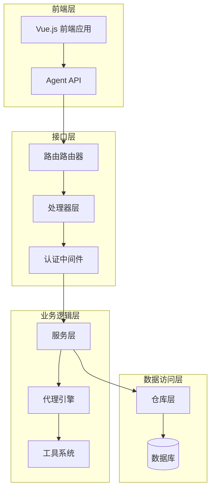
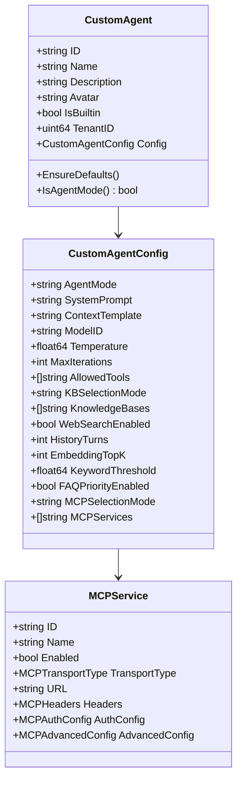
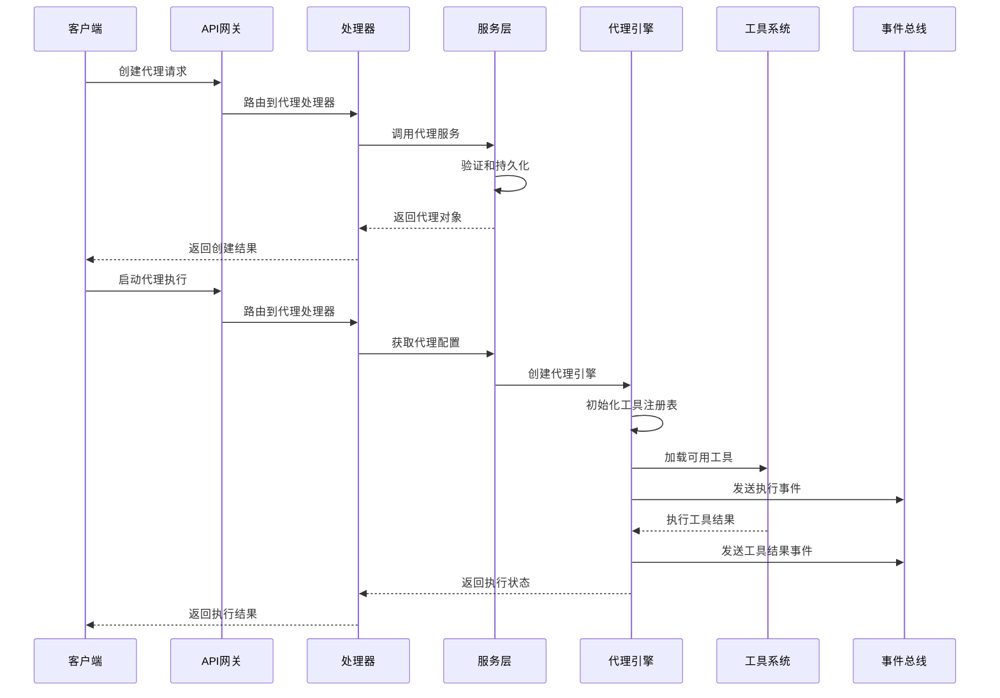
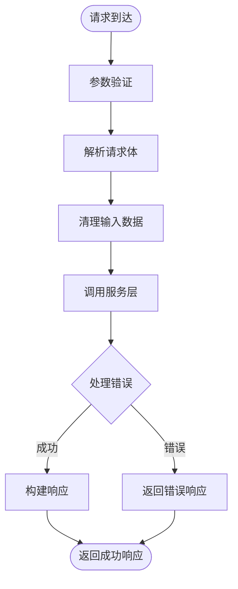
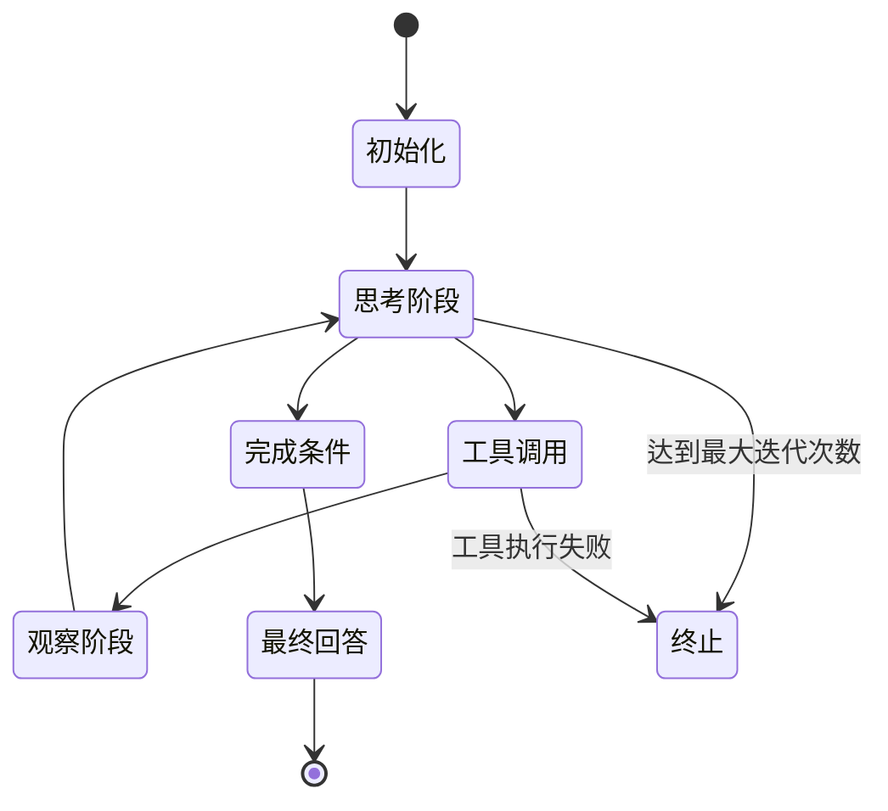
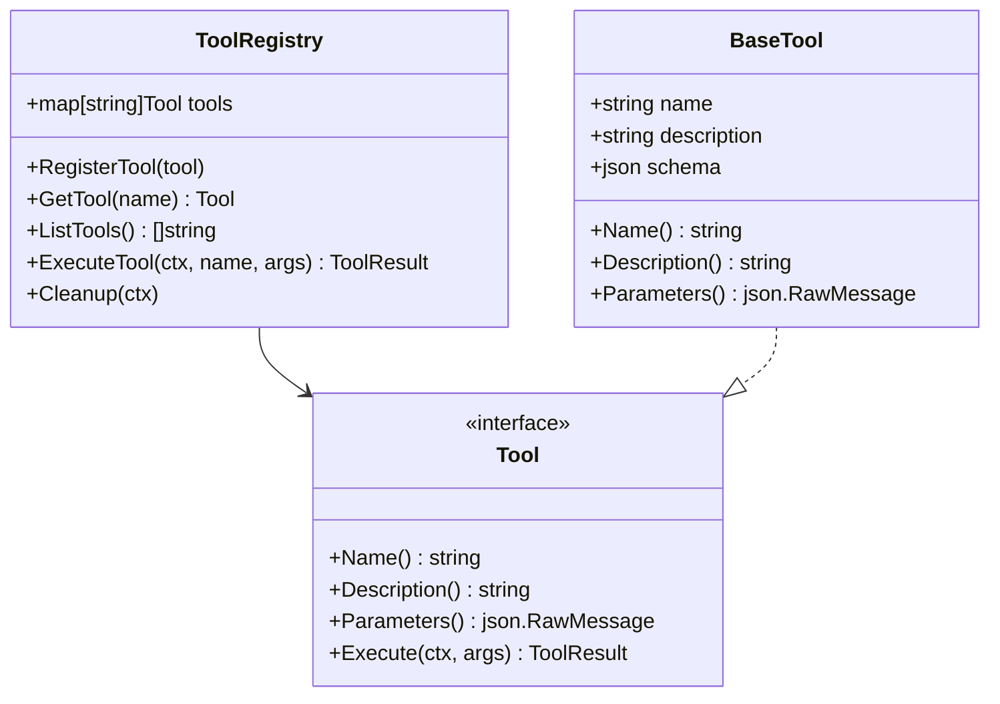
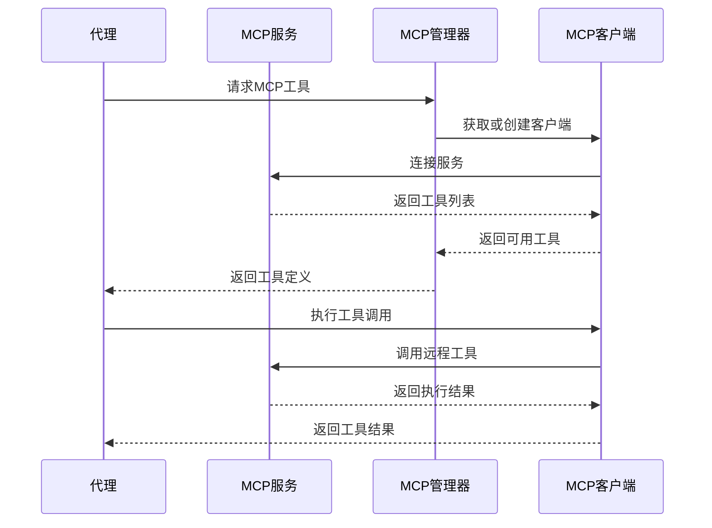
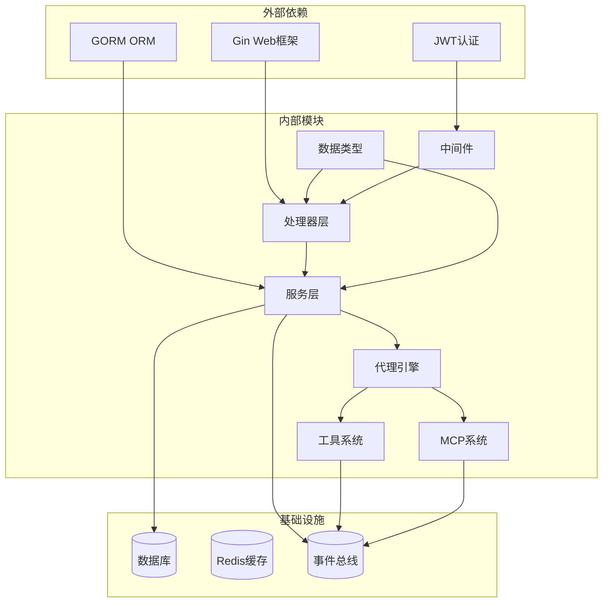

# 代理定制API

<cite>
**本文档引用的文件**
- [internal/handler/custom_agent.go](file://internal/handler/custom_agent.go)
- [internal/router/router.go](file://internal/router/router.go)
- [internal/application/service/custom_agent.go](file://internal/application/service/custom_agent.go)
- [internal/types/custom_agent.go](file://internal/types/custom_agent.go)
- [internal/agent/engine.go](file://internal/agent/engine.go)
- [internal/agent/tools/registry.go](file://internal/agent/tools/registry.go)
- [internal/handler/mcp_service.go](file://internal/handler/mcp_service.go)
- [internal/application/service/mcp_service.go](file://internal/application/service/mcp_service.go)
- [internal/types/mcp.go](file://internal/types/mcp.go)
- [internal/middleware/auth.go](file://internal/middleware/auth.go)
- [frontend/src/api/agent/index.ts](file://frontend/src/api/agent/index.ts)
- [frontend/src/views/agent/AgentEditorModal.vue](file://frontend/src/views/agent/AgentEditorModal.vue)
- [frontend/src/views/settings/AgentSettings.vue](file://frontend/src/views/settings/AgentSettings.vue)
</cite>

## 目录
1. [简介](#简介)
2. [项目结构](#项目结构)
3. [核心组件](#核心组件)
4. [架构概览](#架构概览)
5. [详细组件分析](#详细组件分析)
6. [依赖关系分析](#依赖关系分析)
7. [性能考虑](#性能考虑)
8. [故障排除指南](#故障排除指南)
9. [结论](#结论)

## 简介

WiseDx的代理定制API为智能代理提供了完整的生命周期管理能力，包括创建、配置、部署、监控等全栈功能。该系统支持两种代理模式：快速问答模式（RAG）和智能推理模式（ReAct），并提供了丰富的工具系统和MCP（Model Context Protocol）集成能力。

系统采用分层架构设计，通过HTTP API提供RESTful接口，支持JWT和API Key双重认证机制。代理配置采用JSON Schema定义，支持参数化设置和行为控制。系统内置了多种预置代理，包括医疗问诊助手、诊断报告生成器等专业应用场景。

## 项目结构

WiseDx代理定制API采用典型的三层架构模式：

**图表来源**
- [internal/router/router.go](file://internal/router/router.go#L422-L441)
- [internal/handler/custom_agent.go](file://internal/handler/custom_agent.go#L1-L372)

**章节来源**
- [internal/router/router.go](file://internal/router/router.go#L422-L441)
- [internal/handler/custom_agent.go](file://internal/handler/custom_agent.go#L1-L372)

## 核心组件

### 代理生命周期管理

系统提供完整的代理生命周期管理接口：

| 操作 | 方法 | 路径 | 描述 |
|------|------|------|------|
| 创建代理 | POST | `/api/v1/agents` | 创建新的自定义代理 |
| 获取代理列表 | GET | `/api/v1/agents` | 获取当前租户的所有代理 |
| 获取代理详情 | GET | `/api/v1/agents/:id` | 根据ID获取代理详情 |
| 更新代理 | PUT | `/api/v1/agents/:id` | 更新代理配置 |
| 删除代理 | DELETE | `/api/v1/agents/:id` | 删除指定代理 |
| 复制代理 | POST | `/api/v1/agents/:id/copy` | 复制指定代理 |

### 代理配置系统

代理配置采用嵌套结构，支持多种配置维度：

**图表来源**
- [internal/types/custom_agent.go](file://internal/types/custom_agent.go#L40-L164)
- [internal/types/mcp.go](file://internal/types/mcp.go#L22-L38)

**章节来源**
- [internal/types/custom_agent.go](file://internal/types/custom_agent.go#L40-L164)
- [internal/types/mcp.go](file://internal/types/mcp.go#L22-L38)

## 架构概览

代理系统采用事件驱动架构，通过事件总线实现模块解耦：

**图表来源**
- [internal/handler/custom_agent.go](file://internal/handler/custom_agent.go#L55-L97)
- [internal/agent/engine.go](file://internal/agent/engine.go#L77-L155)

**章节来源**
- [internal/handler/custom_agent.go](file://internal/handler/custom_agent.go#L55-L97)
- [internal/agent/engine.go](file://internal/agent/engine.go#L77-L155)

## 详细组件分析

### 代理处理器层

代理处理器负责HTTP请求的接收和响应处理：

**图表来源**
- [internal/handler/custom_agent.go](file://internal/handler/custom_agent.go#L60-L66)

**章节来源**
- [internal/handler/custom_agent.go](file://internal/handler/custom_agent.go#L55-L97)

### 代理服务层

服务层实现业务逻辑和数据验证：

| 方法 | 功能 | 错误处理 |
|------|------|----------|
| CreateAgent | 创建新代理 | 名称必填、租户ID验证 |
| GetAgentByID | 获取代理详情 | 代理不存在、内置代理合并 |
| ListAgents | 获取代理列表 | 租户隔离、内置代理合并 |
| UpdateAgent | 更新代理 | 权限检查、内置代理保护 |
| DeleteAgent | 删除代理 | 内置代理保护、租户验证 |
| CopyAgent | 复制代理 | 数据完整性保证 |

**章节来源**
- [internal/application/service/custom_agent.go](file://internal/application/service/custom_agent.go#L36-L83)

### 代理引擎

代理引擎是ReAct推理的核心执行单元：

**图表来源**
- [internal/agent/engine.go](file://internal/agent/engine.go#L159-L521)

**章节来源**
- [internal/agent/engine.go](file://internal/agent/engine.go#L159-L521)

### 工具注册系统

工具系统提供灵活的扩展机制：

**图表来源**
- [internal/agent/tools/registry.go](file://internal/agent/tools/registry.go#L12-L58)

**章节来源**
- [internal/agent/tools/registry.go](file://internal/agent/tools/registry.go#L12-L58)

### MCP服务集成

MCP（Model Context Protocol）提供外部工具和服务集成：

**图表来源**
- [internal/application/service/mcp_service.go](file://internal/application/service/mcp_service.go#L323-L350)

**章节来源**
- [internal/application/service/mcp_service.go](file://internal/application/service/mcp_service.go#L323-L350)

## 依赖关系分析

系统采用清晰的依赖层次结构：

**图表来源**
- [internal/router/router.go](file://internal/router/router.go#L422-L441)
- [internal/middleware/auth.go](file://internal/middleware/auth.go#L59-L196)

**章节来源**
- [internal/router/router.go](file://internal/router/router.go#L422-L441)
- [internal/middleware/auth.go](file://internal/middleware/auth.go#L59-L196)

## 性能考虑

### 缓存策略

系统实现了多层次缓存机制：

- **工具缓存**: 工具注册表缓存，避免重复初始化
- **代理配置缓存**: 内置代理配置缓存，减少数据库查询
- **MCP连接池**: 复用MCP客户端连接，降低连接开销

### 并发控制

- **请求限流**: 基于令牌桶算法的请求频率控制
- **并发安全**: 工具执行的互斥锁保护
- **资源池**: 代理引擎的资源池管理

### 监控指标

系统提供完整的性能监控：

- **执行时间**: 代理执行各阶段耗时统计
- **工具调用**: 工具执行成功率和耗时
- **内存使用**: 工具和代理的内存占用监控
- **错误率**: 各组件的错误统计和告警

## 故障排除指南

### 常见错误类型

| 错误类型 | HTTP状态码 | 描述 | 解决方案 |
|----------|------------|------|----------|
| 参数错误 | 400 | 请求参数无效 | 检查请求格式和必填字段 |
| 未授权 | 401 | 认证失败 | 验证JWT或API Key |
| 禁止访问 | 403 | 权限不足 | 检查用户权限和租户访问 |
| 资源不存在 | 404 | 代理或工具不存在 | 确认ID有效性 |
| 服务器错误 | 500 | 系统内部错误 | 查看日志和监控指标 |

### 调试方法

1. **启用调试日志**: 设置日志级别为DEBUG
2. **检查事件流**: 监听事件总线查看执行状态
3. **验证配置**: 确认代理配置的完整性和有效性
4. **测试工具**: 单独测试工具的可用性和参数

### 性能优化建议

- **合理配置**: 根据使用场景调整代理参数
- **资源限制**: 设置合理的超时和重试机制
- **监控告警**: 建立完善的监控和告警体系
- **定期维护**: 清理无用的代理和工具配置

**章节来源**
- [internal/middleware/auth.go](file://internal/middleware/auth.go#L19-L39)

## 结论

WiseDx的代理定制API提供了一个功能完整、架构清晰的智能代理管理平台。系统支持多种代理模式和工具集成，具有良好的扩展性和可维护性。

通过分层架构设计和事件驱动机制，系统实现了模块间的松耦合，便于功能扩展和性能优化。内置的监控和日志系统为运维提供了有力支撑。

未来可以在以下方面进一步完善：
- 增加更多预置代理模板
- 优化工具加载和执行性能
- 扩展MCP协议支持
- 增强安全沙箱机制
- 完善自动化部署和扩缩容能力