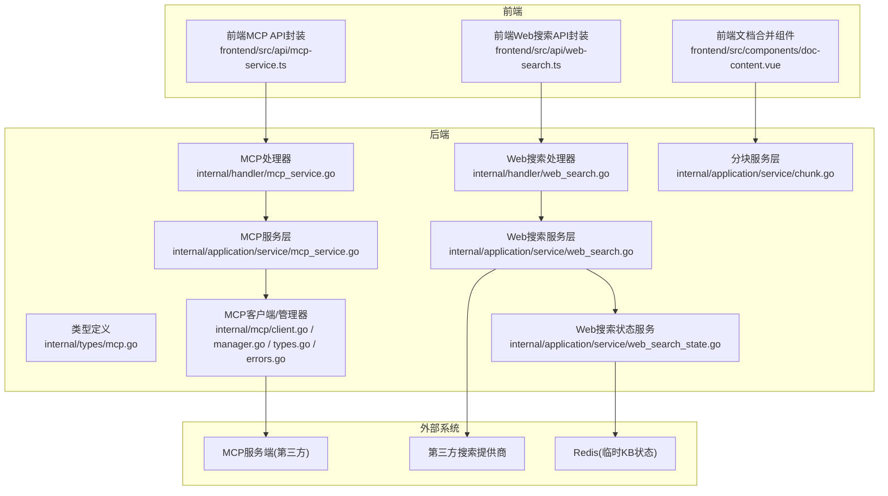
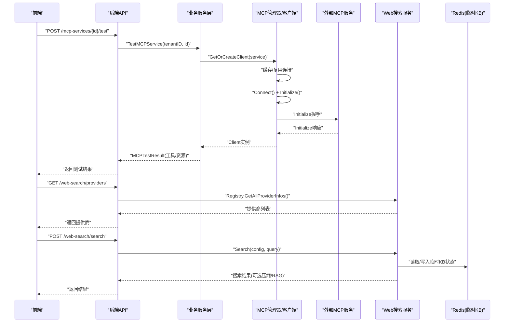
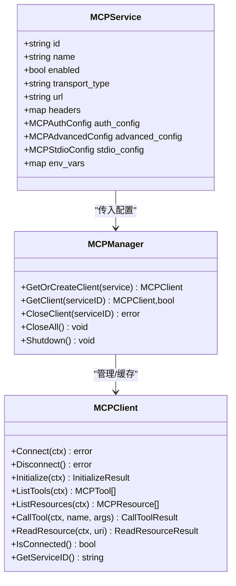
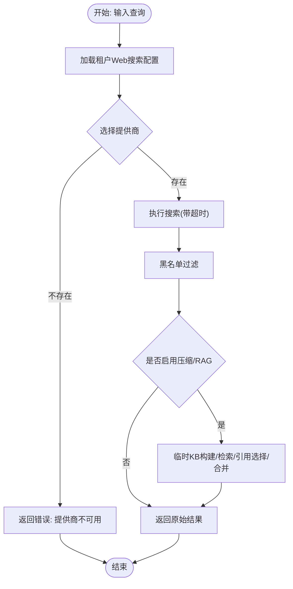
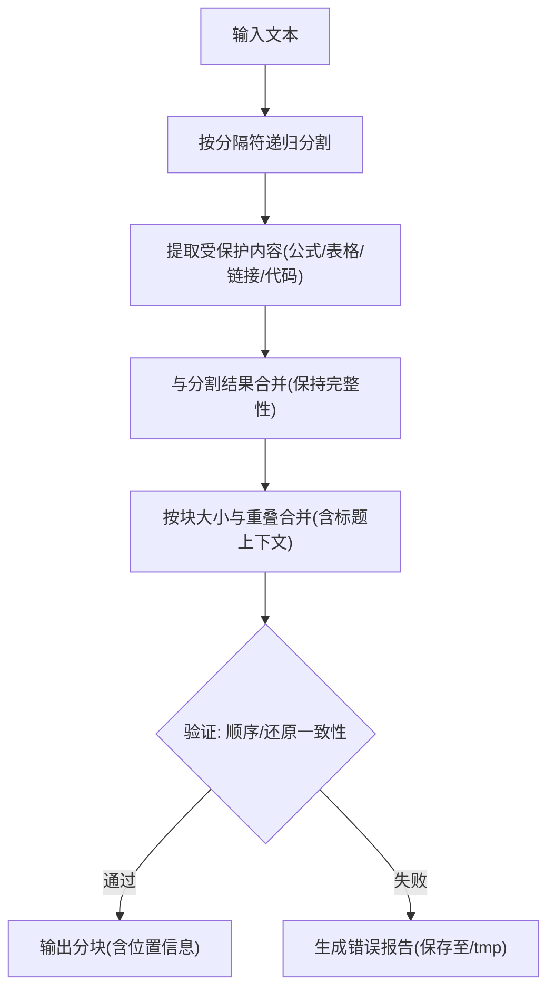
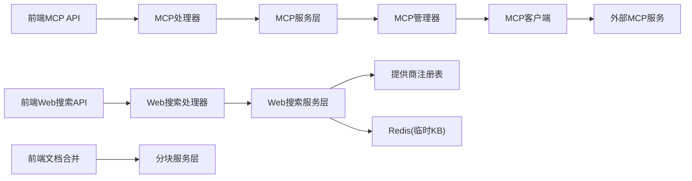

# 外部集成API

<cite>
**本文引用的文件**
- [internal/mcp/client.go](file://internal/mcp/client.go)
- [internal/mcp/manager.go](file://internal/mcp/manager.go)
- [internal/mcp/types.go](file://internal/mcp/types.go)
- [internal/mcp/errors.go](file://internal/mcp/errors.go)
- [internal/types/mcp.go](file://internal/types/mcp.go)
- [internal/handler/mcp_service.go](file://internal/handler/mcp_service.go)
- [frontend/src/api/mcp-service.ts](file://frontend/src/api/mcp-service.ts)
- [internal/application/service/mcp_service.go](file://internal/application/service/mcp_service.go)
- [internal/handler/web_search.go](file://internal/handler/web_search.go)
- [frontend/src/api/web-search.ts](file://frontend/src/api/web-search.ts)
- [internal/application/service/web_search.go](file://internal/application/service/web_search.go)
- [internal/application/service/web_search_state.go](file://internal/application/service/web_search_state.go)
- [internal/application/service/chunk.go](file://internal/application/service/chunk.go)
- [docreader/splitter/splitter.py](file://docreader/splitter/splitter.py)
- [frontend/src/components/doc-content.vue](file://frontend/src/components/doc-content.vue)
- [internal/errors/errors.go](file://internal/errors/errors.go)
- [internal/errors/session.go](file://internal/errors/session.go)
- [client/client.go](file://client/client.go)
- [docs/MCP功能使用说明.md](file://docs/MCP功能使用说明.md)
</cite>

## 目录
1. [简介](#简介)
2. [项目结构](#项目结构)
3. [核心组件](#核心组件)
4. [架构总览](#架构总览)
5. [详细组件分析](#详细组件分析)
6. [依赖关系分析](#依赖关系分析)
7. [性能考量](#性能考量)
8. [故障排除指南](#故障排除指南)
9. [结论](#结论)
10. [附录](#附录)

## 简介
本文件面向WiseDx的外部集成API，重点覆盖以下能力：
- MCP协议服务：服务发现、连接、消息传递与状态同步
- 第三方Web搜索：集成配置、查询参数映射与结果处理
- 文档分块：算法参数、性能优化与结果验证
- 错误处理、超时控制与重试策略
- 数据格式转换、协议适配与安全传输

目标是帮助开发者与运维人员快速理解并正确使用这些外部集成能力。

## 项目结构
围绕外部集成API的关键目录与文件如下：
- MCP协议客户端与管理器：internal/mcp/*
- 类型定义：internal/types/mcp.go
- 处理器与服务层：internal/handler/mcp_service.go, internal/application/service/mcp_service.go
- Web搜索：internal/handler/web_search.go, internal/application/service/web_search.go, frontend/src/api/web-search.ts
- 文档分块：docreader/splitter/splitter.py, frontend/src/components/doc-content.vue, internal/application/service/chunk.go
- 错误码与通用错误模型：internal/errors/errors.go, internal/errors/session.go
- 客户端SDK示例：client/client.go
- 前端MCP API封装：frontend/src/api/mcp-service.ts
- MCP使用说明文档：docs/MCP功能使用说明.md

图表来源
- [internal/handler/mcp_service.go](file://internal/handler/mcp_service.go#L1-L422)
- [internal/application/service/mcp_service.go](file://internal/application/service/mcp_service.go#L1-L265)
- [internal/mcp/client.go](file://internal/mcp/client.go#L1-L373)
- [internal/mcp/manager.go](file://internal/mcp/manager.go#L1-L226)
- [internal/types/mcp.go](file://internal/types/mcp.go#L1-L227)
- [internal/handler/web_search.go](file://internal/handler/web_search.go#L1-L44)
- [internal/application/service/web_search.go](file://internal/application/service/web_search.go#L1-L372)
- [internal/application/service/web_search_state.go](file://internal/application/service/web_search_state.go#L1-L137)
- [frontend/src/api/mcp-service.ts](file://frontend/src/api/mcp-service.ts#L1-L104)
- [frontend/src/api/web-search.ts](file://frontend/src/api/web-search.ts#L1-L40)
- [frontend/src/components/doc-content.vue](file://frontend/src/components/doc-content.vue#L79-L119)

章节来源
- [internal/mcp/client.go](file://internal/mcp/client.go#L1-L373)
- [internal/mcp/manager.go](file://internal/mcp/manager.go#L1-L226)
- [internal/types/mcp.go](file://internal/types/mcp.go#L1-L227)
- [internal/handler/mcp_service.go](file://internal/handler/mcp_service.go#L1-L422)
- [internal/application/service/mcp_service.go](file://internal/application/service/mcp_service.go#L1-L265)
- [internal/handler/web_search.go](file://internal/handler/web_search.go#L1-L44)
- [internal/application/service/web_search.go](file://internal/application/service/web_search.go#L1-L372)
- [internal/application/service/web_search_state.go](file://internal/application/service/web_search_state.go#L1-L137)
- [frontend/src/api/mcp-service.ts](file://frontend/src/api/mcp-service.ts#L1-L104)
- [frontend/src/api/web-search.ts](file://frontend/src/api/web-search.ts#L1-L40)
- [frontend/src/components/doc-content.vue](file://frontend/src/components/doc-content.vue#L79-L119)

## 核心组件
- MCP协议客户端与管理器：负责连接、初始化握手、工具与资源列举、工具调用、资源读取、连接生命周期管理与异常处理。
- MCP服务层与处理器：提供REST接口，支持创建、更新、删除、测试MCP服务，以及获取工具与资源列表。
- Web搜索服务：封装第三方搜索提供商，支持黑名单过滤、压缩与RAG增强、临时知识库管理。
- 文档分块：Python分词器，支持保护模式、重叠合并、标题上下文保留与结果恢复校验。
- 错误码与通用错误模型：统一错误码体系与HTTP语义映射，便于前端与日志统一处理。

章节来源
- [internal/mcp/client.go](file://internal/mcp/client.go#L1-L373)
- [internal/mcp/manager.go](file://internal/mcp/manager.go#L1-L226)
- [internal/mcp/types.go](file://internal/mcp/types.go#L1-L67)
- [internal/mcp/errors.go](file://internal/mcp/errors.go#L1-L33)
- [internal/handler/mcp_service.go](file://internal/handler/mcp_service.go#L1-L422)
- [internal/application/service/mcp_service.go](file://internal/application/service/mcp_service.go#L1-L265)
- [internal/handler/web_search.go](file://internal/handler/web_search.go#L1-L44)
- [internal/application/service/web_search.go](file://internal/application/service/web_search.go#L1-L372)
- [docreader/splitter/splitter.py](file://docreader/splitter/splitter.py#L1-L585)
- [internal/errors/errors.go](file://internal/errors/errors.go#L1-L48)

## 架构总览
下图展示了MCP与Web搜索两大外部集成的端到端交互路径，包括鉴权、超时、重试与状态持久化。

图表来源
- [internal/handler/mcp_service.go](file://internal/handler/mcp_service.go#L306-L349)
- [internal/application/service/mcp_service.go](file://internal/application/service/mcp_service.go#L247-L265)
- [internal/mcp/manager.go](file://internal/mcp/manager.go#L37-L96)
- [internal/mcp/client.go](file://internal/mcp/client.go#L157-L225)
- [internal/handler/web_search.go](file://internal/handler/web_search.go#L23-L44)
- [internal/application/service/web_search.go](file://internal/application/service/web_search.go#L245-L286)
- [internal/application/service/web_search_state.go](file://internal/application/service/web_search_state.go#L34-L81)

## 详细组件分析

### MCP协议服务集成
- 发现与连接
  - 通过处理器暴露REST接口，支持创建、更新、删除、测试与查询工具/资源。
  - 服务层对传输类型进行校验，禁用stdio以规避安全风险；默认高级配置包含超时、重试次数与延迟。
  - 管理器按服务ID缓存连接，SSE/HTTP Streamable复用连接；Stdio被禁用。
- 初始化与消息传递
  - 客户端发起Initialize握手，设置协议版本与客户端信息；随后可列举工具与资源，调用工具或读取资源。
  - 对SSE连接丢失场景进行检测与断开处理，避免无效会话导致持续错误。
- 状态同步与安全
  - 列表视图对敏感信息进行掩码显示；删除服务时关闭对应客户端连接。
  - 前端提供MCP服务配置模型与测试结果结构，便于UI层展示与交互。

图表来源
- [internal/types/mcp.go](file://internal/types/mcp.go#L22-L87)
- [internal/mcp/client.go](file://internal/mcp/client.go#L19-L47)
- [internal/mcp/manager.go](file://internal/mcp/manager.go#L13-L35)

章节来源
- [internal/handler/mcp_service.go](file://internal/handler/mcp_service.go#L26-L349)
- [internal/application/service/mcp_service.go](file://internal/application/service/mcp_service.go#L32-L245)
- [internal/mcp/client.go](file://internal/mcp/client.go#L62-L135)
- [internal/mcp/manager.go](file://internal/mcp/manager.go#L37-L96)
- [internal/mcp/types.go](file://internal/mcp/types.go#L1-L67)
- [internal/mcp/errors.go](file://internal/mcp/errors.go#L1-L33)
- [internal/types/mcp.go](file://internal/types/mcp.go#L12-L87)
- [frontend/src/api/mcp-service.ts](file://frontend/src/api/mcp-service.ts#L1-L104)
- [docs/MCP功能使用说明.md](file://docs/MCP功能使用说明.md#L13-L30)

### 第三方Web搜索集成
- 配置与参数映射
  - 提供商列表通过注册表统一管理；前端KV API用于获取/更新租户级Web搜索配置（提供商、API Key、最大结果数、是否包含日期、压缩方法、黑名单、嵌入模型、重排模型、片段数量等）。
  - 处理器返回提供商信息；服务层执行超时控制、黑名单过滤与可选压缩/RAG增强。
- 结果处理
  - 支持基于正则与通配符的黑名单规则；RAG压缩通过临时知识库进行检索与引用选择，最终按源URL合并引用内容。
  - 临时KB状态通过Redis键空间存储与清理，确保会话结束后资源回收。

图表来源
- [frontend/src/api/web-search.ts](file://frontend/src/api/web-search.ts#L13-L40)
- [internal/handler/web_search.go](file://internal/handler/web_search.go#L23-L44)
- [internal/application/service/web_search.go](file://internal/application/service/web_search.go#L245-L372)
- [internal/application/service/web_search_state.go](file://internal/application/service/web_search_state.go#L34-L136)

章节来源
- [frontend/src/api/web-search.ts](file://frontend/src/api/web-search.ts#L1-L40)
- [internal/handler/web_search.go](file://internal/handler/web_search.go#L1-L44)
- [internal/application/service/web_search.go](file://internal/application/service/web_search.go#L1-L372)
- [internal/application/service/web_search_state.go](file://internal/application/service/web_search_state.go#L1-L137)

### 文档分块算法
- 参数配置
  - 分块大小与重叠长度、分隔符序列、受保护正则（公式、图片、链接、表格、代码块）、长度函数等均可配置。
  - Python分词器支持标题上下文跟踪与智能合并，保证跨块重叠与上下文完整性。
- 性能优化
  - 递归分割与受保护内容隔离，避免破坏公式/表格等结构；合并阶段维护头部上下文并按需回退以满足重叠约束。
- 结果验证
  - 提供恢复校验与错误报告生成，便于定位分块顺序与还原差异问题。

图表来源
- [docreader/splitter/splitter.py](file://docreader/splitter/splitter.py#L116-L297)
- [docreader/splitter/splitter.py](file://docreader/splitter/splitter.py#L409-L556)

章节来源
- [docreader/splitter/splitter.py](file://docreader/splitter/splitter.py#L1-L585)
- [frontend/src/components/doc-content.vue](file://frontend/src/components/doc-content.vue#L79-L119)
- [internal/application/service/chunk.go](file://internal/application/service/chunk.go#L1-L441)

## 依赖关系分析
- MCP
  - 处理器依赖服务层；服务层依赖管理器与客户端；客户端依赖外部mcp-go库与HTTP传输层。
  - 类型定义贯穿于处理器、服务层与前端API封装，确保前后端契约一致。
- Web搜索
  - 处理器依赖服务层；服务层依赖注册表与Redis状态服务；前端通过KV API与后端交互。
- 文档分块
  - 前端组件与后端服务层协同，后端服务层依赖检索引擎与嵌入模型。

图表来源
- [internal/handler/mcp_service.go](file://internal/handler/mcp_service.go#L1-L422)
- [internal/application/service/mcp_service.go](file://internal/application/service/mcp_service.go#L1-L265)
- [internal/mcp/manager.go](file://internal/mcp/manager.go#L1-L226)
- [internal/mcp/client.go](file://internal/mcp/client.go#L1-L373)
- [internal/handler/web_search.go](file://internal/handler/web_search.go#L1-L44)
- [internal/application/service/web_search.go](file://internal/application/service/web_search.go#L1-L372)
- [internal/application/service/web_search_state.go](file://internal/application/service/web_search_state.go#L1-L137)
- [frontend/src/api/mcp-service.ts](file://frontend/src/api/mcp-service.ts#L1-L104)
- [frontend/src/api/web-search.ts](file://frontend/src/api/web-search.ts#L1-L40)
- [frontend/src/components/doc-content.vue](file://frontend/src/components/doc-content.vue#L79-L119)

章节来源
- [internal/mcp/manager.go](file://internal/mcp/manager.go#L1-L226)
- [internal/mcp/client.go](file://internal/mcp/client.go#L1-L373)
- [internal/application/service/web_search.go](file://internal/application/service/web_search.go#L1-L372)
- [internal/application/service/web_search_state.go](file://internal/application/service/web_search_state.go#L1-L137)

## 性能考量
- MCP
  - SSE/HTTP Streamable连接复用，减少握手与连接开销；初始化超时上限控制在60秒内，避免长时间阻塞。
  - 连接空闲清理周期为5分钟，及时释放断连客户端。
- Web搜索
  - 默认全局超时与提供商级超时控制；黑名单过滤在内存中完成，复杂度与结果规模线性相关。
  - RAG压缩引入临时知识库与混合检索，建议合理设置片段数量与阈值以平衡质量与性能。
- 文档分块
  - 受保护内容正则预编译，分割函数按优先级选择；合并阶段通过头部上下文与重叠回退保证质量。
  - 建议根据文档类型调整分隔符与受保护模式，以提升分块边界合理性。

[本节为通用指导，不直接分析具体文件]

## 故障排除指南
- MCP连接与初始化
  - 若出现“未连接/已连接/不支持传输类型/初始化失败”等错误，检查传输类型、URL、鉴权头与超时配置；SSE场景关注会话ID有效性并在异常时断开重连。
  - 前端测试接口返回成功/失败与工具/资源清单，便于快速定位问题。
- Web搜索
  - 提供商不可用：确认提供商ID是否在注册表中；检查租户配置KV是否存在。
  - 黑名单规则无效：检查正则/通配符语法；非法规则会被忽略并记录警告。
  - 临时KB状态异常：Redis键缺失或反序列化失败时会清理并返回空状态，确认Redis可用性与键命名规范。
- 文档分块
  - 分块顺序错误或还原失败：查看/tmp下的错误报告，定位首处差异与分块内容；调整分隔符与受保护模式。
- 通用错误码
  - 统一错误码体系涵盖请求参数、鉴权、资源不存在、超时、内部错误等；结合HTTP状态码与错误详情定位问题。

章节来源
- [internal/mcp/errors.go](file://internal/mcp/errors.go#L1-L33)
- [internal/errors/errors.go](file://internal/errors/errors.go#L1-L48)
- [internal/errors/session.go](file://internal/errors/session.go#L1-L16)
- [internal/application/service/web_search_state.go](file://internal/application/service/web_search_state.go#L83-L136)
- [docreader/splitter/splitter.py](file://docreader/splitter/splitter.py#L409-L556)

## 结论
WiseDx的外部集成API围绕MCP协议与第三方Web搜索提供了完整的发现、连接、消息传递与状态管理能力，并通过文档分块算法与RAG增强提升了检索质量。通过统一的错误码体系、超时与重试策略以及安全的传输选择，系统在易用性与稳定性之间取得了良好平衡。建议在生产环境中优先采用SSE/HTTP Streamable传输，合理配置超时与重试参数，并利用前端测试与状态服务进行问题诊断与资源回收。

[本节为总结性内容，不直接分析具体文件]

## 附录
- 前端MCP服务配置与测试结果结构参考：frontend/src/api/mcp-service.ts
- 前端Web搜索配置与KV API参考：frontend/src/api/web-search.ts
- MCP使用说明与常用操作流程：docs/MCP功能使用说明.md
- 客户端SDK示例（HTTP请求封装与响应解析）：client/client.go

章节来源
- [frontend/src/api/mcp-service.ts](file://frontend/src/api/mcp-service.ts#L1-L104)
- [frontend/src/api/web-search.ts](file://frontend/src/api/web-search.ts#L1-L40)
- [docs/MCP功能使用说明.md](file://docs/MCP功能使用说明.md#L13-L30)
- [client/client.go](file://client/client.go#L56-L104)