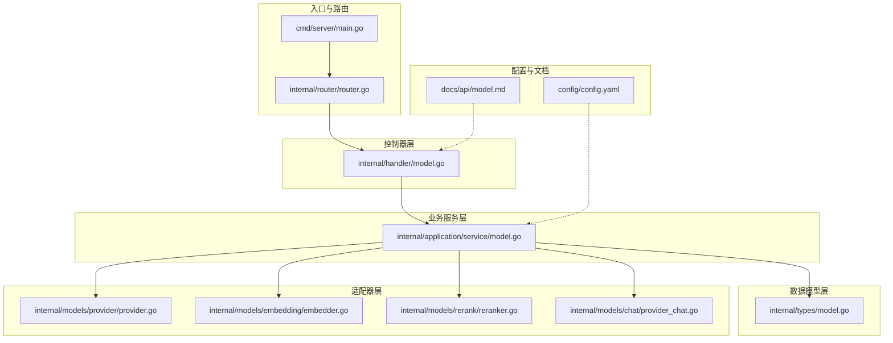
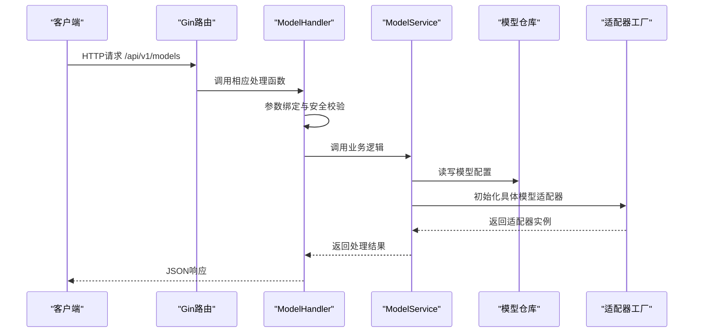
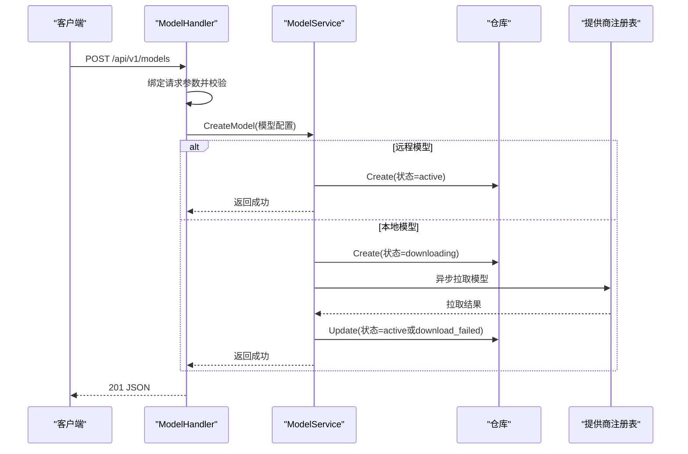
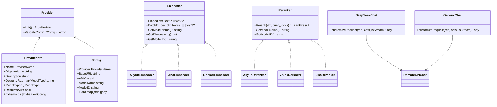
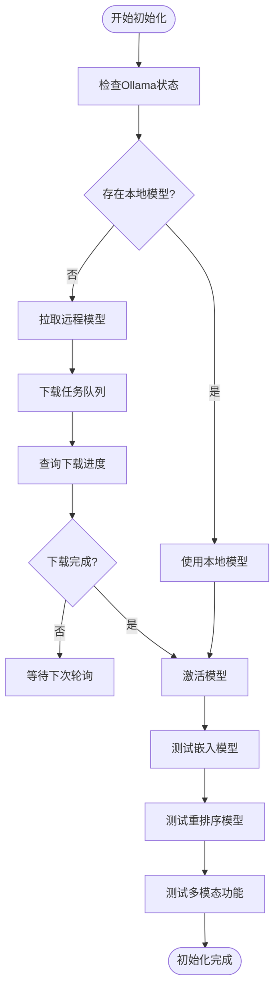
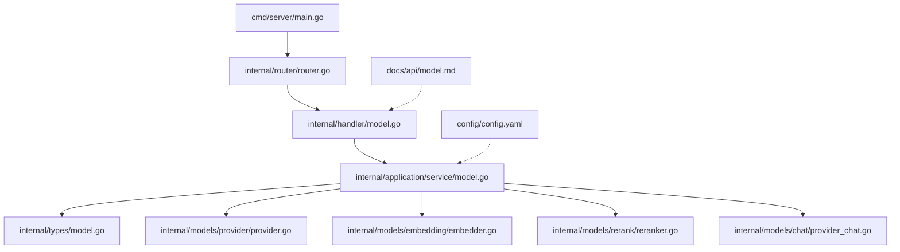

# 模型管理API

<cite>
**本文档引用的文件**
- [cmd/server/main.go](file://cmd/server/main.go)
- [internal/router/router.go](file://internal/router/router.go)
- [internal/handler/model.go](file://internal/handler/model.go)
- [internal/application/service/model.go](file://internal/application/service/model.go)
- [internal/types/model.go](file://internal/types/model.go)
- [internal/models/provider/provider.go](file://internal/models/provider/provider.go)
- [internal/models/embedding/embedder.go](file://internal/models/embedding/embedder.go)
- [internal/models/rerank/reranker.go](file://internal/models/rerank/reranker.go)
- [internal/models/chat/provider_chat.go](file://internal/models/chat/provider_chat.go)
- [docs/api/model.md](file://docs/api/model.md)
- [config/config.yaml](file://config/config.yaml)
- [internal/handler/initialization.go](file://internal/handler/initialization.go)
</cite>

## 目录
1. [简介](#简介)
2. [项目结构](#项目结构)
3. [核心组件](#核心组件)
4. [架构概览](#架构概览)
5. [详细组件分析](#详细组件分析)
6. [依赖分析](#依赖分析)
7. [性能考虑](#性能考虑)
8. [故障排除指南](#故障排除指南)
9. [结论](#结论)
10. [附录](#附录)

## 简介
本文件为WiseDx平台的模型管理API提供完整的技术文档。WiseDx支持多种AI模型类型（对话LLM、嵌入向量、重排序、视觉语言模型），并通过统一的适配器模式对接多家模型提供商（OpenAI、阿里云、智谱、Google Gemini等）。该文档涵盖模型配置与管理接口、提供商集成方式、API密钥管理、模型参数配置、性能监控、模型切换与版本管理、负载均衡与故障转移、模型测试与基准评估、缓存策略与预热机制、以及资源优化配置。

## 项目结构
WiseDx采用分层架构设计，核心模块包括：
- 入口与路由：cmd/server/main.go负责启动HTTP服务，internal/router/router.go注册REST路由
- 控制器层：internal/handler/model.go处理模型管理相关HTTP请求
- 业务服务层：internal/application/service/model.go实现模型生命周期管理与初始化
- 数据模型层：internal/types/model.go定义模型类型、状态、来源与参数结构
- 适配器层：internal/models/provider/provider.go提供统一的提供商注册与检测机制；embedding/rerank/chat子包实现具体模型适配
- 配置与文档：config/config.yaml提供系统配置，docs/api/model.md提供API使用说明

**图表来源**
- [cmd/server/main.go](file://cmd/server/main.go#L88-L192)
- [internal/router/router.go](file://internal/router/router.go#L53-L118)
- [internal/handler/model.go](file://internal/handler/model.go#L16-L30)
- [internal/application/service/model.go](file://internal/application/service/model.go#L19-L33)
- [internal/types/model.go](file://internal/types/model.go#L12-L95)
- [internal/models/provider/provider.go](file://internal/models/provider/provider.go#L121-L129)
- [internal/models/embedding/embedder.go](file://internal/models/embedding/embedder.go#L40-L50)
- [internal/models/rerank/reranker.go](file://internal/models/rerank/reranker.go#L80-L87)
- [internal/models/chat/provider_chat.go](file://internal/models/chat/provider_chat.go#L11-L15)
- [config/config.yaml](file://config/config.yaml#L1-L50)
- [docs/api/model.md](file://docs/api/model.md#L1-L50)

**章节来源**
- [cmd/server/main.go](file://cmd/server/main.go#L88-L192)
- [internal/router/router.go](file://internal/router/router.go#L53-L118)

## 核心组件
- 模型类型与状态
  - ModelType：支持Embedding、Rerank、KnowledgeQA（对话）、VLLM（视觉语言）
  - ModelStatus：active（可用）、downloading（下载中）、download_failed（下载失败）
  - ModelSource：local（本地Ollama）、remote（远程API）、以及多家提供商标识
- 模型参数
  - ModelParameters：包含base_url、api_key、provider、embedding_parameters等
  - EmbeddingParameters：dimension、truncate_prompt_tokens
- 提供商注册与检测
  - Provider接口与注册表，支持按模型类型筛选提供商
  - DetectProvider根据BaseURL自动识别提供商
- 适配器工厂
  - NewEmbedder：根据Source与Provider路由到具体嵌入模型实现
  - NewReranker：根据Provider路由到具体重排序模型实现
  - NewDeepSeekChat/GenericChat：针对特定提供商的聊天适配器

**章节来源**
- [internal/types/model.go](file://internal/types/model.go#L12-L95)
- [internal/models/provider/provider.go](file://internal/models/provider/provider.go#L121-L278)
- [internal/models/embedding/embedder.go](file://internal/models/embedding/embedder.go#L52-L144)
- [internal/models/rerank/reranker.go](file://internal/models/rerank/reranker.go#L89-L108)
- [internal/models/chat/provider_chat.go](file://internal/models/chat/provider_chat.go#L11-L83)

## 架构概览
模型管理API遵循典型的三层架构：HTTP路由层（Gin）、控制器层（Handler）、业务服务层（Service）。控制器负责参数绑定与安全校验，业务服务负责模型生命周期管理与初始化，适配器层负责与具体提供商交互。

**图表来源**
- [internal/router/router.go](file://internal/router/router.go#L316-L334)
- [internal/handler/model.go](file://internal/handler/model.go#L84-L134)
- [internal/application/service/model.go](file://internal/application/service/model.go#L35-L95)
- [internal/models/embedding/embedder.go](file://internal/models/embedding/embedder.go#L52-L144)
- [internal/models/rerank/reranker.go](file://internal/models/rerank/reranker.go#L89-L108)

## 详细组件分析

### 模型管理API接口
- 获取模型厂商列表
  - 方法：GET /api/v1/models/providers
  - 查询参数：model_type（chat、embedding、rerank、vllm）
  - 响应：包含提供商标识、显示名称、默认URL、支持的模型类型
- 创建模型
  - 方法：POST /api/v1/models
  - 请求体：name、type、source、description、parameters
  - 行为：远程模型立即激活；本地模型进入下载状态并异步拉取
- 获取模型列表
  - 方法：GET /api/v1/models
  - 响应：当前租户的所有模型，内置模型敏感信息会被隐藏
- 获取模型详情
  - 方法：GET /api/v1/models/:id
  - 响应：模型详情，内置模型敏感信息会被隐藏
- 更新模型
  - 方法：PUT /api/v1/models/:id
  - 限制：内置模型不可更新
- 删除模型
  - 方法：DELETE /api/v1/models/:id
  - 限制：内置模型不可删除

**图表来源**
- [internal/handler/model.go](file://internal/handler/model.go#L84-L134)
- [internal/application/service/model.go](file://internal/application/service/model.go#L35-L95)

**章节来源**
- [internal/handler/model.go](file://internal/handler/model.go#L72-L134)
- [internal/handler/model.go](file://internal/handler/model.go#L136-L185)
- [internal/handler/model.go](file://internal/handler/model.go#L187-L232)
- [internal/handler/model.go](file://internal/handler/model.go#L244-L317)
- [internal/handler/model.go](file://internal/handler/model.go#L319-L360)
- [docs/api/model.md](file://docs/api/model.md#L42-L94)
- [docs/api/model.md](file://docs/api/model.md#L96-L294)
- [docs/api/model.md](file://docs/api/model.md#L296-L398)
- [docs/api/model.md](file://docs/api/model.md#L400-L447)
- [docs/api/model.md](file://docs/api/model.md#L449-L466)

### 提供商集成与适配器模式
- 提供商注册
  - Provider接口：Info()返回元数据；ValidateConfig()校验配置
  - 注册表：Register(Get/List/ListByModelType/DetectProvider)
- 嵌入模型适配器
  - NewEmbedder根据Source与Provider路由到具体实现（如Aliyun、Jina、OpenAI兼容）
  - 特殊处理：阿里云多模态模型与文本模型的端点差异
- 重排序模型适配器
  - NewReranker根据Provider路由到具体实现（Aliyun、Zhipu、Jina、OpenAI）
- 聊天模型适配器
  - DeepSeekChat：移除tool_choice参数
  - GenericChat：通过ChatTemplateKwargs传递thinking参数

**图表来源**
- [internal/models/provider/provider.go](file://internal/models/provider/provider.go#L131-L137)
- [internal/models/provider/provider.go](file://internal/models/provider/provider.go#L84-L93)
- [internal/models/provider/provider.go](file://internal/models/provider/provider.go#L121-L129)
- [internal/models/embedding/embedder.go](file://internal/models/embedding/embedder.go#L13-L31)
- [internal/models/rerank/reranker.go](file://internal/models/rerank/reranker.go#L12-L22)
- [internal/models/chat/provider_chat.go](file://internal/models/chat/provider_chat.go#L11-L15)
- [internal/models/chat/provider_chat.go](file://internal/models/chat/provider_chat.go#L46-L50)

**章节来源**
- [internal/models/provider/provider.go](file://internal/models/provider/provider.go#L121-L278)
- [internal/models/embedding/embedder.go](file://internal/models/embedding/embedder.go#L52-L144)
- [internal/models/rerank/reranker.go](file://internal/models/rerank/reranker.go#L89-L108)
- [internal/models/chat/provider_chat.go](file://internal/models/chat/provider_chat.go#L11-L83)

### 模型初始化与测试接口
- Ollama状态检查与模型下载
  - GET /api/v1/initialization/ollama/status
  - GET /api/v1/initialization/ollama/models
  - POST /api/v1/initialization/ollama/models/check
  - POST /api/v1/initialization/ollama/models/download
  - GET /api/v1/initialization/ollama/download/progress/:taskId
  - GET /api/v1/initialization/ollama/download/tasks
- 远程模型检查与测试
  - POST /api/v1/initialization/remote/check
  - POST /api/v1/initialization/embedding/test
  - POST /api/v1/initialization/rerank/check
  - POST /api/v1/initialization/multimodal/test

**图表来源**
- [internal/router/router.go](file://internal/router/router.go#L355-L378)
- [internal/handler/initialization.go](file://internal/handler/initialization.go#L34-L87)

**章节来源**
- [internal/router/router.go](file://internal/router/router.go#L355-L378)
- [internal/handler/initialization.go](file://internal/handler/initialization.go#L34-L87)

### 模型参数配置与密钥管理
- 模型参数结构
  - base_url：远程API基础URL
  - api_key：API密钥
  - provider：服务商标识（如openai、aliyun、zhipu等）
  - embedding_parameters：嵌入模型维度与提示截断参数
  - extra_config：提供商特定的额外配置
- 内置模型敏感信息隐藏
  - 对于内置模型，响应中会清空APIKey与BaseURL字段
- 多模态与视觉模型
  - VLM模型通过provider与接口类型区分（如ollama或openai兼容）

**章节来源**
- [internal/types/model.go](file://internal/types/model.go#L57-L95)
- [internal/handler/model.go](file://internal/handler/model.go#L32-L60)
- [docs/api/model.md](file://docs/api/model.md#L468-L502)

### 性能监控与指标
- 系统配置中的对话与检索相关阈值
  - max_rounds、keyword_threshold、embedding_top_k、vector_threshold、rerank_threshold、rerank_top_k
  - enable_rewrite、enable_query_expansion、enable_rerank
- 建议的监控指标
  - 模型调用延迟、错误率、吞吐量
  - 下载任务进度与失败重试
  - 嵌入与重排序的响应时间分布

**章节来源**
- [config/config.yaml](file://config/config.yaml#L6-L30)

### 高级功能：模型切换、版本管理、负载均衡与故障转移
- 模型切换
  - 通过更新模型参数（如base_url、api_key、provider）实现无缝切换
  - 内置模型不可更新，需创建新模型实例
- 版本管理
  - 通过不同模型ID区分版本；服务层不再维护默认标记
- 负载均衡与故障转移
  - 建议在网关层或上游代理实现多提供商轮询与健康检查
  - 适配器层支持自动检测提供商，便于动态路由

**章节来源**
- [internal/application/service/model.go](file://internal/application/service/model.go#L166-L197)
- [internal/models/provider/provider.go](file://internal/models/provider/provider.go#L205-L249)

### 模型测试、基准评估与性能对比
- 模型测试接口
  - 嵌入测试：POST /api/v1/initialization/embedding/test
  - 重排序测试：POST /api/v1/initialization/rerank/check
  - 多模态测试：POST /api/v1/initialization/multimodal/test
- 基准评估
  - 评估服务通过EvaluationService管理任务，支持内存存储与并发访问
  - 评估结果可用于模型性能对比与选择

**章节来源**
- [internal/router/router.go](file://internal/router/router.go#L369-L378)
- [internal/handler/initialization.go](file://internal/handler/initialization.go#L137-L200)

### 缓存策略、预热机制与资源优化
- 嵌入模型池化
  - EmbedderPooler接口支持批量嵌入与池化，减少重复初始化开销
- 预热机制
  - 通过初始化阶段的测试接口预热模型，降低首次调用延迟
- 资源优化
  - 本地模型采用异步下载与状态跟踪，避免阻塞主线程
  - 远程模型通过提供商适配器统一接口，便于资源复用与共享

**章节来源**
- [internal/models/embedding/embedder.go](file://internal/models/embedding/embedder.go#L33-L35)
- [internal/application/service/model.go](file://internal/application/service/model.go#L74-L94)

## 依赖分析
模型管理API的依赖关系如下：

**图表来源**
- [cmd/server/main.go](file://cmd/server/main.go#L124-L126)
- [internal/router/router.go](file://internal/router/router.go#L316-L334)
- [internal/handler/model.go](file://internal/handler/model.go#L16-L30)
- [internal/application/service/model.go](file://internal/application/service/model.go#L19-L33)
- [internal/types/model.go](file://internal/types/model.go#L12-L95)
- [internal/models/provider/provider.go](file://internal/models/provider/provider.go#L121-L129)
- [internal/models/embedding/embedder.go](file://internal/models/embedding/embedder.go#L40-L50)
- [internal/models/rerank/reranker.go](file://internal/models/rerank/reranker.go#L80-L87)
- [internal/models/chat/provider_chat.go](file://internal/models/chat/provider_chat.go#L11-L15)
- [config/config.yaml](file://config/config.yaml#L1-L50)
- [docs/api/model.md](file://docs/api/model.md#L1-L50)

**章节来源**
- [cmd/server/main.go](file://cmd/server/main.go#L124-L126)
- [internal/router/router.go](file://internal/router/router.go#L316-L334)

## 性能考虑
- 模型初始化
  - 本地模型采用异步下载，避免阻塞请求处理
  - 远程模型直接激活，减少状态检查开销
- 嵌入与重排序
  - 通过池化接口批量处理，降低多次初始化成本
  - 提供商适配器统一接口，便于缓存与复用
- 监控与告警
  - 建议结合系统配置中的阈值参数，建立调用延迟与错误率监控

## 故障排除指南
- 模型状态异常
  - downloading：等待下载完成或检查网络与凭据
  - download_failed：检查base_url与api_key，重新创建模型
- 内置模型操作受限
  - 内置模型不可更新或删除，需创建新模型实例
- 提供商识别问题
  - 通过provider字段显式指定或检查base_url格式
- 测试与评估
  - 使用初始化测试接口验证模型连通性与性能
  - 评估服务支持并发访问，注意任务ID管理与结果获取

**章节来源**
- [internal/application/service/model.go](file://internal/application/service/model.go#L98-L144)
- [internal/handler/model.go](file://internal/handler/model.go#L166-L197)
- [internal/models/provider/provider.go](file://internal/models/provider/provider.go#L205-L249)
- [internal/router/router.go](file://internal/router/router.go#L369-L378)

## 结论
WiseDx的模型管理API通过统一的数据模型、适配器模式与提供商注册机制，实现了对多类型、多来源AI模型的集中管理与高效使用。配合完善的初始化测试、性能监控与资源优化策略，能够满足生产环境对稳定性、可扩展性与可维护性的要求。建议在实际部署中结合网关层实现负载均衡与故障转移，并持续优化模型参数与缓存策略以提升整体性能。

## 附录
- API使用示例与参数说明详见docs/api/model.md
- 系统配置项参见config/config.yaml