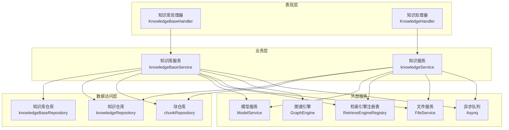
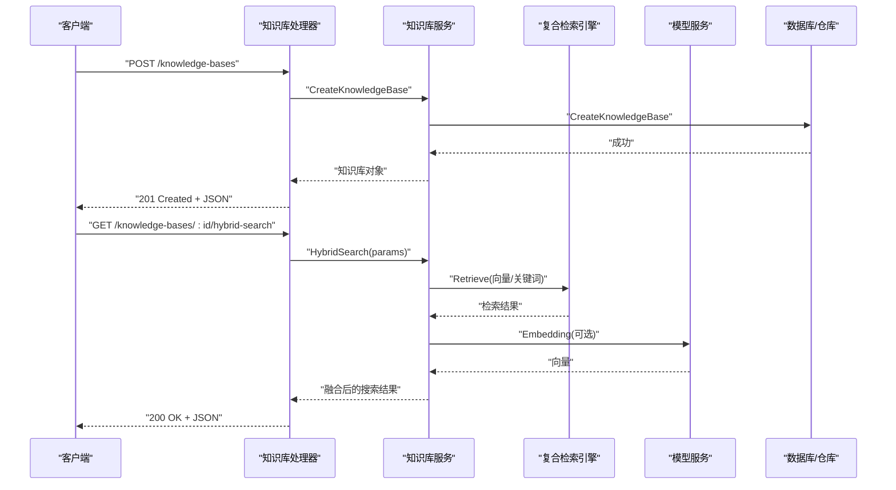
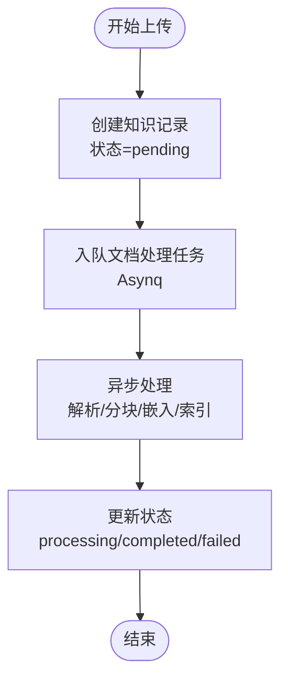
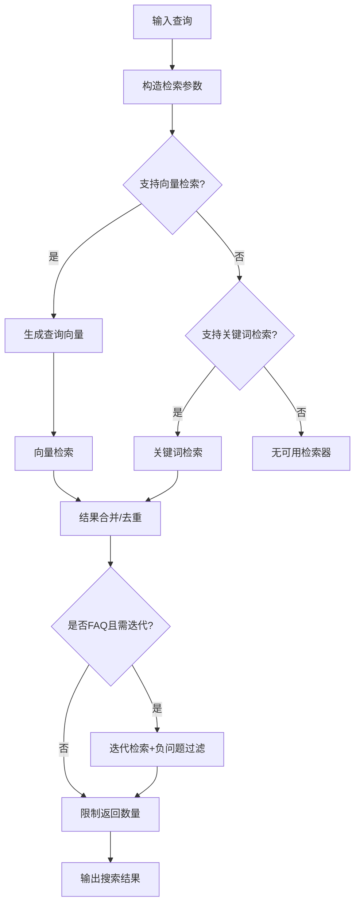
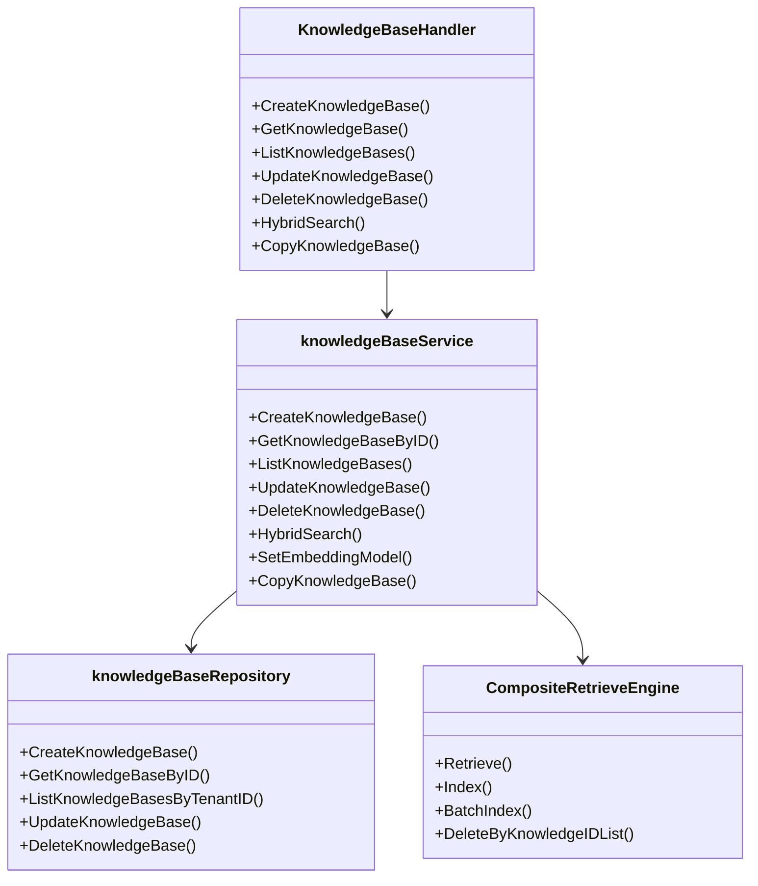

# 知识库管理API

<cite>
**本文档引用的文件**
- [knowledge-base.md](file://docs/api/knowledge-base.md)
- [knowledgebase.go](file://internal/handler/knowledgebase.go)
- [knowledgebase.go](file://internal/application/service/knowledgebase.go)
- [knowledgebase.go](file://internal/types/knowledgebase.go)
- [knowledgebase.go](file://internal/application/repository/knowledgebase.go)
- [composite.go](file://internal/application/service/retriever/composite.go)
- [search.go](file://internal/types/search.go)
- [knowledge.go](file://internal/types/knowledge.go)
- [knowledge.go](file://internal/application/service/knowledge.go)
- [faq.go](file://client/faq.go)
- [index.ts](file://frontend/src/api/knowledge-base/index.ts)
</cite>

## 目录
1. [简介](#简介)
2. [项目结构](#项目结构)
3. [核心组件](#核心组件)
4. [架构总览](#架构总览)
5. [详细组件分析](#详细组件分析)
6. [依赖关系分析](#依赖关系分析)
7. [性能考虑](#性能考虑)
8. [故障排除指南](#故障排除指南)
9. [结论](#结论)
10. [附录](#附录)

## 简介
本文件为WiseDx知识库管理API的权威技术文档，覆盖知识库的完整CRUD操作、配置参数、权限控制、文档上传与处理流程、混合检索策略、向量数据库连接、批量操作与导入导出、权限继承、状态监控与性能指标查询，以及知识库与文档处理系统的集成与数据流转。

## 项目结构
WiseDx采用分层架构，知识库管理API主要由以下层次组成：
- 表现层（HTTP处理器）：负责接收请求、参数校验、调用服务层并返回响应
- 业务层（服务实现）：封装领域逻辑，协调仓库、模型服务、检索引擎、文件服务等
- 数据访问层（仓库）：与数据库交互，提供知识库、知识、块等实体的持久化能力
- 检索引擎层：支持复合检索引擎，统一调度多种向量/关键词检索后端
- 前端与客户端：提供UI与SDK，支撑知识库管理与搜索体验

图表来源
- [knowledgebase.go](file://internal/handler/knowledgebase.go#L1-L536)
- [knowledgebase.go](file://internal/application/service/knowledgebase.go#L1-L800)
- [knowledgebase.go](file://internal/application/repository/knowledgebase.go#L1-L83)

章节来源
- [knowledgebase.go](file://internal/handler/knowledgebase.go#L1-L536)
- [knowledgebase.go](file://internal/application/service/knowledgebase.go#L1-L800)
- [knowledgebase.go](file://internal/application/repository/knowledgebase.go#L1-L83)

## 核心组件
- 知识库处理器（KnowledgeBaseHandler）：提供创建、查询、更新、删除、复制、混合检索等HTTP接口
- 知识库服务（knowledgeBaseService）：实现业务规则，协调检索引擎、模型服务、文件服务等
- 知识库仓库（knowledgeBaseRepository）：数据库访问，提供CRUD与列表查询
- 复合检索引擎（CompositeRetrieveEngine）：统一调度多种检索后端，支持并发与融合
- 搜索参数与结果（SearchParams/SearchResult）：定义混合检索的输入输出结构
- 知识实体（Knowledge）：文档/FAQ等知识条目的元数据与状态

章节来源
- [knowledgebase.go](file://internal/handler/knowledgebase.go#L1-L536)
- [knowledgebase.go](file://internal/application/service/knowledgebase.go#L1-L800)
- [knowledgebase.go](file://internal/application/repository/knowledgebase.go#L1-L83)
- [composite.go](file://internal/application/service/retriever/composite.go#L1-L336)
- [search.go](file://internal/types/search.go#L1-L180)
- [knowledge.go](file://internal/types/knowledge.go#L1-L285)

## 架构总览
知识库管理API通过HTTP处理器接收请求，调用服务层完成业务处理，并通过仓库层与外部服务（模型、检索、文件、图谱、异步队列）协作，最终返回标准化响应。

图表来源
- [knowledgebase.go](file://internal/handler/knowledgebase.go#L92-L90)
- [knowledgebase.go](file://internal/application/service/knowledgebase.go#L486-L748)
- [composite.go](file://internal/application/service/retriever/composite.go#L32-L62)

## 详细组件分析

### 知识库CRUD接口
- 创建知识库
  - 端点：POST /knowledge-bases
  - 请求体：包含名称、描述、分块配置、图像处理配置、嵌入模型ID、摘要模型ID、重排序模型ID、VLM配置、存储配置等
  - 响应：返回创建的知识库对象
- 查询知识库列表
  - 端点：GET /knowledge-bases
  - 响应：返回当前租户下的知识库列表，包含知识/块计数、处理状态等派生字段
- 查询单个知识库详情
  - 端点：GET /knowledge-bases/:id
  - 权限：仅租户拥有者可访问
- 更新知识库
  - 端点：PUT /knowledge-bases/:id
  - 请求体：name、description、config（包含chunking_config、image_processing_config、faq_config等）
- 删除知识库
  - 端点：DELETE /knowledge-bases/:id
  - 行为：标记删除并异步清理向量、块、文件、图谱数据

章节来源
- [knowledge-base.md](file://docs/api/knowledge-base.md#L15-L317)
- [knowledgebase.go](file://internal/handler/knowledgebase.go#L92-L330)
- [knowledgebase.go](file://internal/application/service/knowledgebase.go#L70-L269)
- [knowledgebase.go](file://internal/application/repository/knowledgebase.go#L24-L83)

### 知识库配置参数
- 分块配置（ChunkingConfig）
  - chunk_size：每块大小
  - chunk_overlap：块间重叠
  - separators：分隔符数组
  - enable_multimodal：兼容字段（新版本以VLMConfig为准）
- 图像处理配置（ImageProcessingConfig）
  - model_id：图像处理模型ID
- VLM配置（VLMConfig）
  - enabled：是否启用
  - model_id：视觉语言模型ID
  - 兼容老版本字段：model_name/base_url/api_key/interface_type
- 存储配置（StorageConfig）
  - secret_id/secret_key/region/bucket_name/app_id/path_prefix/provider
- FAQ配置（FAQConfig）
  - index_mode：问题索引模式（question_only/question_answer）
  - question_index_mode：问题索引方式（combined/separate）
- 问答生成配置（QuestionGenerationConfig）
  - enabled：是否启用
  - question_count：每个chunk生成的问题数量

章节来源
- [knowledgebase.go](file://internal/types/knowledgebase.go#L86-L348)

### 权限设置与租户隔离
- 租户上下文：服务层从上下文中读取TenantID进行权限校验
- 访问控制：处理器在更新/删除/查询时验证知识库所属租户ID
- 租户可见性：列表查询默认过滤临时知识库（is_temporary=false）

章节来源
- [knowledgebase.go](file://internal/handler/knowledgebase.go#L139-L177)
- [knowledgebase.go](file://internal/application/repository/knowledgebase.go#L62-L72)

### 文档上传与处理流程
- 支持文件上传、URL导入、文本段落导入
- 异步处理：创建知识记录后，将文档处理任务入队至Asynq
- 多模态支持：根据知识库配置决定是否启用多模态处理
- 问答生成：可按配置为每个chunk生成问题并单独索引
- 进度与状态：知识项包含解析状态（pending/processing/completed/failed）与摘要状态

图表来源
- [knowledge.go](file://internal/application/service/knowledge.go#L293-L329)
- [knowledge.go](file://internal/types/knowledge.go#L19-L46)

章节来源
- [knowledge.go](file://internal/application/service/knowledge.go#L293-L658)
- [knowledge.go](file://internal/types/knowledge.go#L54-L110)

### 混合检索与向量数据库连接
- 检索策略
  - 向量检索：基于嵌入模型生成查询向量，按阈值与TopK筛选
  - 关键词检索：对非FAQ类型知识库执行关键词匹配
  - 结果融合：FAQ使用原始分数，文档使用RRF（Reciprocal Rank Fusion）融合
- 复合检索引擎
  - 支持并发检索多个后端
  - 统一索引/删除/复制等操作
- 检索参数
  - query_text：查询文本
  - vector_threshold/keyword_threshold：阈值
  - match_count：返回数量
  - disable_keywords_match/disable_vector_match：开关
  - knowledge_ids/tag_ids/only_recommended：过滤条件

图表来源
- [knowledgebase.go](file://internal/application/service/knowledgebase.go#L486-L748)
- [composite.go](file://internal/application/service/retriever/composite.go#L32-L62)
- [search.go](file://internal/types/search.go#L96-L107)

章节来源
- [knowledge-base.md](file://docs/api/knowledge-base.md#L319-L371)
- [knowledgebase.go](file://internal/application/service/knowledgebase.go#L486-L748)
- [search.go](file://internal/types/search.go#L46-L107)

### 批量操作、导入导出与权限继承
- 批量知识库复制
  - 端点：POST /knowledge-bases/copy
  - 行为：异步任务克隆源知识库到目标知识库，前端可通过进度接口查询
- FAQ导入与进度
  - 客户端类型：FAQBatchUpsertPayload、FAQImportProgress
  - 前端API：getFAQImportProgress/updateFAQImportResultDisplayStatus
- 权限继承
  - 知识库复制时保留租户ID与配置，目标知识库属于同一租户

章节来源
- [knowledgebase.go](file://internal/handler/knowledgebase.go#L332-L434)
- [faq.go](file://client/faq.go#L39-L421)
- [index.ts](file://frontend/src/api/knowledge-base/index.ts#L226-L274)

### 状态监控与性能指标
- 知识库状态
  - 知识计数/块计数：按租户聚合统计
  - 处理中状态：检测待处理/处理中的知识项
- 性能指标
  - 检索耗时、向量维度、存储估算等通过复合检索引擎与追踪埋点记录
- FAQ导入结果展示控制
  - 可通过接口控制最后导入结果的显示状态

章节来源
- [knowledgebase.go](file://internal/application/service/knowledgebase.go#L116-L170)
- [composite.go](file://internal/application/service/retriever/composite.go#L317-L336)
- [index.ts](file://frontend/src/api/knowledge-base/index.ts#L262-L266)

## 依赖关系分析
- 处理器依赖服务接口，服务依赖仓库接口与外部服务接口
- 复合检索引擎通过注册表动态选择具体检索实现
- 知识库服务在删除时触发异步清理任务

图表来源
- [knowledgebase.go](file://internal/handler/knowledgebase.go#L19-L37)
- [knowledgebase.go](file://internal/application/service/knowledgebase.go#L23-L58)
- [knowledgebase.go](file://internal/application/repository/knowledgebase.go#L14-L22)
- [composite.go](file://internal/application/service/retriever/composite.go#L26-L30)

章节来源
- [knowledgebase.go](file://internal/handler/knowledgebase.go#L19-L37)
- [knowledgebase.go](file://internal/application/service/knowledgebase.go#L23-L58)
- [knowledgebase.go](file://internal/application/repository/knowledgebase.go#L14-L22)
- [composite.go](file://internal/application/service/retriever/composite.go#L26-L30)

## 性能考虑
- 并发检索：复合检索引擎对不同检索器并发执行，提升吞吐
- 结果融合：FAQ场景保持向量分数，文档场景使用RRF融合，兼顾召回与精度
- 存储估算：提供批量索引的存储大小估算，辅助容量规划
- 异步处理：删除与复制等重操作通过异步队列执行，避免阻塞主线程

## 故障排除指南
- 参数校验失败：检查请求体字段是否符合要求（如name、config、chunking_config等）
- 权限不足：确认租户ID与知识库归属一致，或未提供有效认证头
- 检索无结果：调整阈值、增加match_count，或检查向量/关键词检索器是否启用
- 删除异常：确认知识库存在且未被其他任务占用，查看异步任务日志

章节来源
- [knowledgebase.go](file://internal/handler/knowledgebase.go#L116-L120)
- [knowledgebase.go](file://internal/handler/knowledgebase.go#L165-L174)
- [knowledgebase.go](file://internal/application/service/knowledgebase.go#L486-L518)

## 结论
WiseDx知识库管理API提供了完整的知识库生命周期管理能力，涵盖配置灵活、权限清晰、检索高效、异步处理可靠。通过复合检索引擎与多模态支持，满足文档与FAQ等多种知识形态的检索需求；通过异步任务与状态监控，保障大规模知识库的稳定运行。

## 附录
- API端点与示例请参考：[知识库管理 API](file://docs/api/knowledge-base.md#L1-L371)
- 混合检索参数与响应结构：[搜索参数与结果](file://internal/types/search.go#L96-L107)