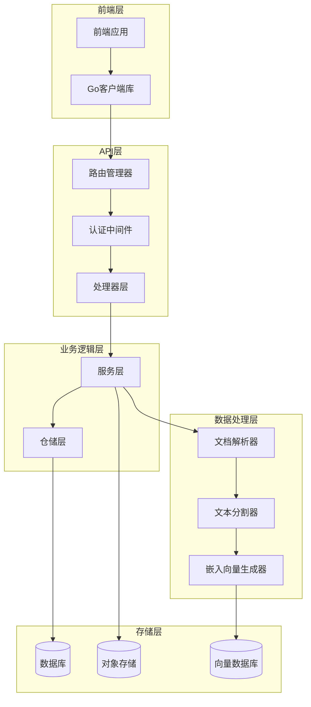
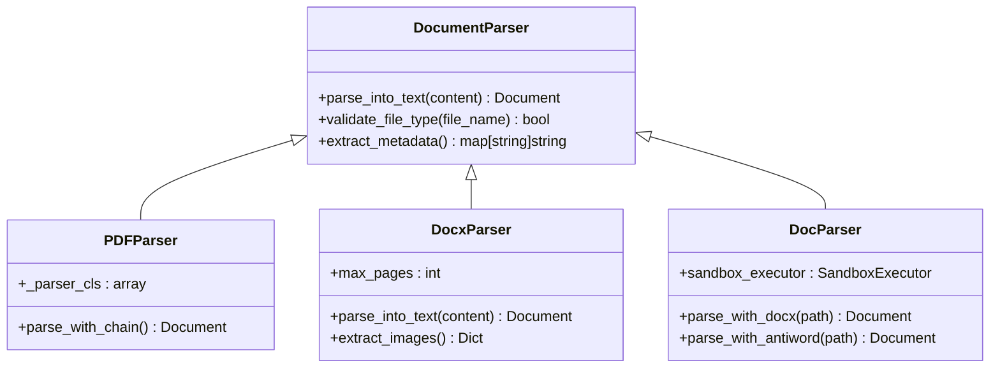
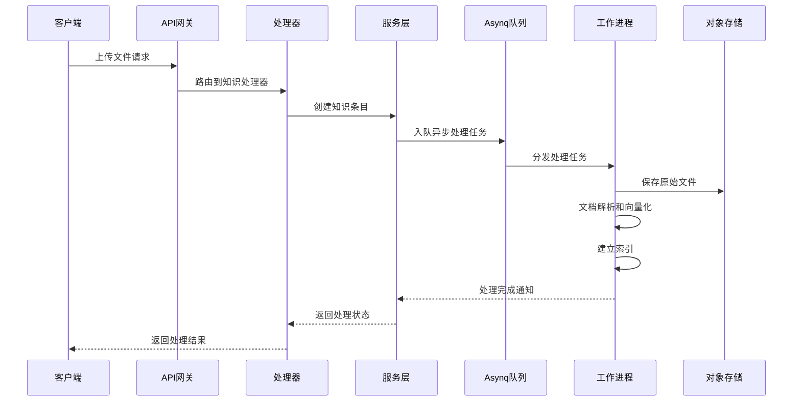
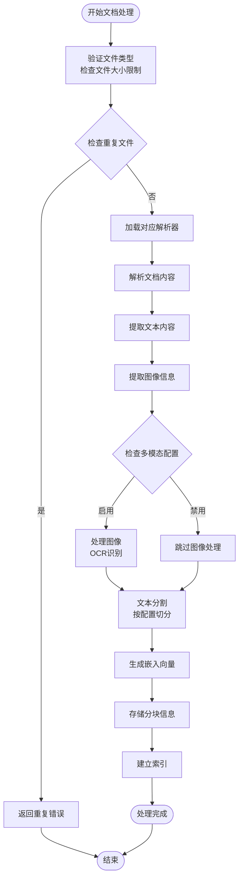
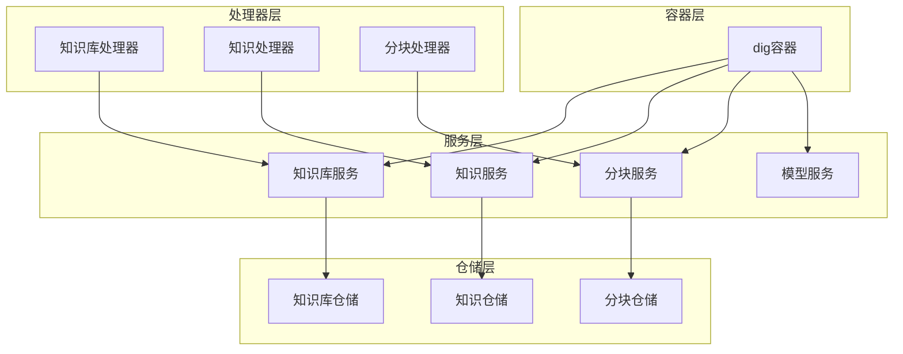

# 知识文档API

<cite>
**本文档引用的文件**
- [internal/handler/knowledge.go](file://internal/handler/knowledge.go)
- [internal/handler/knowledgebase.go](file://internal/handler/knowledgebase.go)
- [client/knowledge.go](file://client/knowledge.go)
- [client/knowledgebase.go](file://client/knowledgebase.go)
- [internal/types/knowledge.go](file://internal/types/knowledge.go)
- [internal/types/knowledgebase.go](file://internal/types/knowledgebase.go)
- [internal/application/service/knowledge.go](file://internal/application/service/knowledge.go)
- [internal/application/service/knowledgebase.go](file://internal/application/service/knowledgebase.go)
- [internal/router/router.go](file://internal/router/router.go)
- [docreader/parser/pdf_parser.py](file://docreader/parser/pdf_parser.py)
- [docreader/parser/docx_parser.py](file://docreader/parser/docx_parser.py)
- [docreader/parser/doc_parser.py](file://docreader/parser/doc_parser.py)
- [internal/models/embedding/embedder.go](file://internal/models/embedding/embedder.go)
- [internal/router/router.go](file://internal/router/router.go)
</cite>

## 目录
1. [简介](#简介)
2. [项目结构](#项目结构)
3. [核心组件](#核心组件)
4. [架构概览](#架构概览)
5. [详细组件分析](#详细组件分析)
6. [依赖关系分析](#依赖关系分析)
7. [性能考虑](#性能考虑)
8. [故障排除指南](#故障排除指南)
9. [结论](#结论)

## 简介

WiseDx知识文档API是一个完整的文档处理和检索系统，提供了从文档上传、解析、索引到查询的全流程能力。该系统支持多种文档格式，包括PDF、Word、Excel、图片等，并提供了智能的文本分割、嵌入向量生成、知识库管理和权限控制功能。

系统采用微服务架构设计，通过Gin框架提供RESTful API接口，结合Asynq异步任务队列实现批量处理和断点续传功能。前端通过Go客户端库与后端API进行交互，支持完整的知识文档生命周期管理。

## 项目结构

WiseDx项目采用清晰的分层架构，主要包含以下核心模块：



**图表来源**
- [internal/router/router.go](file://internal/router/router.go#L140-L177)
- [client/knowledge.go](file://client/knowledge.go#L84-L189)
- [client/knowledgebase.go](file://client/knowledgebase.go#L170-L256)

**章节来源**
- [internal/router/router.go](file://internal/router/router.go#L1-L200)
- [client/knowledge.go](file://client/knowledge.go#L1-L386)
- [client/knowledgebase.go](file://client/knowledgebase.go#L1-L328)

## 核心组件

### 知识管理组件

知识管理组件负责处理文档的完整生命周期，包括创建、查询、更新、删除等操作。系统支持三种主要的知识创建方式：

1. **文件上传创建**：支持本地文件上传，自动检测文件类型并进行解析
2. **URL创建**：从指定URL抓取内容并创建知识条目
3. **手工创建**：支持Markdown格式的手工录入

### 知识库管理组件

知识库管理组件提供知识库的创建、配置、查询和删除功能。每个知识库可以独立配置：
- 文档分割策略（chunk size、overlap、separators）
- 图像处理配置
- 嵌入模型配置
- FAQ配置
- 存储配置

### 文档解析组件

系统内置多种文档解析器，支持不同格式的文档处理：



**图表来源**
- [docreader/parser/pdf_parser.py](file://docreader/parser/pdf_parser.py#L6-L17)
- [docreader/parser/docx_parser.py](file://docreader/parser/docx_parser.py#L52-L77)
- [docreader/parser/doc_parser.py](file://docreader/parser/doc_parser.py#L95-L101)

**章节来源**
- [internal/handler/knowledge.go](file://internal/handler/knowledge.go#L86-L270)
- [internal/handler/knowledgebase.go](file://internal/handler/knowledgebase.go#L92-L137)

## 架构概览

WiseDx采用事件驱动的异步架构，通过Asynq任务队列实现批量处理和断点续传功能：



**图表来源**
- [internal/handler/knowledgebase.go](file://internal/handler/knowledgebase.go#L358-L434)
- [internal/application/service/knowledge.go](file://internal/application/service/knowledge.go#L143-L200)

系统支持以下文档格式：

| 格式类型 | 文件扩展名 | 支持特性 | 解析器 |
|---------|-----------|----------|--------|
| PDF文档 | .pdf | 文本提取、图像OCR、链式解析 | PDFParser |
| Word文档 | .doc, .docx | 文本提取、表格处理、图像链接 | DocParser, DocxParser |
| Excel表格 | .xls, .xlsx | 表格内容提取、单元格处理 | ExcelParser |
| 图片文件 | .jpg, .jpeg, .png, .bmp | 图像识别、OCR文字 | ImageParser |
| 文本文件 | .txt, .md, .csv | 直接解析、标记处理 | TextParser, MarkdownParser |

**章节来源**
- [internal/handler/knowledge.go](file://internal/handler/knowledge.go#L196-L200)
- [docreader/parser/pdf_parser.py](file://docreader/parser/pdf_parser.py#L6-L17)

## 详细组件分析

### 知识文档API接口

#### 文件上传接口

**POST /api/v1/knowledge-bases/{id}/knowledge/file**

功能：从本地文件创建知识条目

请求参数：
- `file` (formData): 上传的文件
- `fileName` (formData): 自定义文件名
- `metadata` (formData): 元数据JSON
- `enable_multimodel` (formData): 启用多模态处理
- `tag_id` (formData): 分类标签ID

响应：创建的知识条目信息

#### URL创建接口

**POST /api/v1/knowledge-bases/{id}/knowledge/url**

功能：从指定URL抓取内容创建知识条目

请求体：
```json
{
  "url": "string",
  "enable_multimodel": boolean,
  "title": "string",
  "tag_id": "string"
}
```

响应：创建的知识条目信息

#### 手工创建接口

**POST /api/v1/knowledge-bases/{id}/knowledge/manual**

功能：手工录入Markdown格式的知识内容

请求体：
```json
{
  "title": "string",
  "content": "string",
  "status": "string",
  "tag_id": "string"
}
```

响应：创建的知识条目信息

#### 知识查询接口

**GET /api/v1/knowledge/{id}**

功能：根据ID获取知识条目详情

响应：知识详情信息

**GET /api/v1/knowledge-bases/{id}/knowledge**

功能：获取知识库下的知识列表

查询参数：
- `page`: 页码
- `page_size`: 每页数量
- `tag_id`: 标签ID筛选
- `keyword`: 关键词搜索
- `file_type`: 文件类型筛选

响应：知识列表和分页信息

#### 知识管理接口

**PUT /api/v1/knowledge/{id}**

功能：更新知识条目信息

**DELETE /api/v1/knowledge/{id}**

功能：删除知识条目

**GET /api/v1/knowledge/{id}/download**

功能：下载知识条目关联的原始文件

**PUT /api/v1/knowledge/manual/{id}**

功能：更新手工知识内容

**GET /api/v1/knowledge/batch**

功能：批量获取知识条目

**PUT /api/v1/knowledge/tags**

功能：批量更新知识标签

**PUT /api/v1/knowledge/image/{id}/{chunk_id}**

功能：更新知识分块的图像信息

#### 知识库管理接口

**POST /api/v1/knowledge-bases**

功能：创建新的知识库

**GET /api/v1/knowledge-bases/{id}**

功能：获取知识库详情

**GET /api/v1/knowledge-bases**

功能：获取当前租户的所有知识库

**PUT /api/v1/knowledge-bases/{id}**

功能：更新知识库信息

**DELETE /api/v1/knowledge-bases/{id}**

功能：删除知识库

**GET /api/v1/knowledge-bases/{id}/hybrid-search**

功能：在知识库中执行向量和关键词混合搜索

**POST /api/v1/knowledge-bases/copy**

功能：复制知识库（异步任务）

**GET /api/v1/knowledge-bases/copy/progress/{task_id}**

功能：获取知识库复制任务的进度

**章节来源**
- [internal/handler/knowledge.go](file://internal/handler/knowledge.go#L86-L842)
- [internal/handler/knowledgebase.go](file://internal/handler/knowledgebase.go#L39-L536)

### 文档解析处理流程

系统采用多阶段的文档处理流程：



**图表来源**
- [internal/application/service/knowledge.go](file://internal/application/service/knowledge.go#L143-L200)
- [docreader/parser/docx_parser.py](file://docreader/parser/docx_parser.py#L79-L107)

### 知识库配置管理

知识库配置包含多个关键组件：

#### 文档分割配置
- `chunk_size`: 每个分块的字符数
- `chunk_overlap`: 分块之间的重叠字符数
- `separators`: 分割符列表（如换行符、段落符等）

#### 图像处理配置
- `model_id`: 多模态模型ID
- 最大图像尺寸限制
- 并发处理任务数

#### 嵌入模型配置
- `embedding_model_id`: 嵌入模型ID
- 向量维度
- 批处理大小

**章节来源**
- [internal/types/knowledgebase.go](file://internal/types/knowledgebase.go#L96-L106)
- [internal/types/knowledgebase.go](file://internal/types/knowledgebase.go#L141-L145)
- [internal/types/knowledgebase.go](file://internal/types/knowledgebase.go#L181-L195)

### 权限控制和元数据管理

系统实现了多层次的权限控制机制：

#### 租户权限控制
- 每个知识库绑定到特定租户
- 用户只能访问自己租户的知识库
- 租户隔离确保数据安全

#### 知识标签管理
- 支持多级标签分类
- 标签可批量更新
- 标签统计和计数

#### 元数据管理
- 支持自定义元数据字段
- 元数据JSON格式存储
- 元数据查询和过滤

**章节来源**
- [internal/handler/knowledge.go](file://internal/handler/knowledge.go#L33-L65)
- [internal/types/knowledge.go](file://internal/types/knowledge.go#L54-L110)

## 依赖关系分析

系统采用依赖注入模式，通过dig容器管理组件依赖关系：



**图表来源**
- [internal/router/router.go](file://internal/router/router.go#L21-L51)

**章节来源**
- [internal/router/router.go](file://internal/router/router.go#L1-L200)

## 性能考虑

### 异步处理优化

系统通过Asynq实现异步任务处理，提高并发性能：

- **批量处理**：支持多文件同时处理
- **断点续传**：任务失败自动重试
- **进度监控**：实时跟踪处理进度
- **资源管理**：合理控制并发数量

### 缓存策略

- **Redis缓存**：存储任务进度和临时数据
- **文件缓存**：避免重复解析相同文件
- **向量缓存**：减少重复的嵌入计算

### 数据库优化

- **索引优化**：为常用查询字段建立索引
- **分页查询**：大数据量场景使用分页
- **连接池**：数据库连接复用

## 故障排除指南

### 常见错误类型

#### 文件处理错误
- **文件类型不支持**：检查文件扩展名
- **文件过大**：调整MAX_FILE_SIZE配置
- **重复文件**：系统自动检测重复文件

#### 知识库配置错误
- **多模态配置不完整**：检查COS和VLM配置
- **嵌入模型不可用**：验证模型ID和API密钥
- **存储配置错误**：确认存储凭证正确性

#### 权限错误
- **租户权限不足**：检查用户所属租户
- **知识库访问权限**：验证知识库所有权

**章节来源**
- [internal/application/service/knowledge.go](file://internal/application/service/knowledge.go#L39-L53)
- [internal/handler/knowledge.go](file://internal/handler/knowledge.go#L166-L194)

## 结论

WiseDx知识文档API提供了一个完整、高效、可扩展的文档处理解决方案。系统支持多种文档格式，具备强大的解析和检索能力，同时提供了完善的权限控制和元数据管理功能。

通过异步处理和分布式架构设计，系统能够处理大规模文档集合，满足企业级应用的需求。灵活的配置选项和插件化的架构使得系统易于扩展和定制，适应不同的业务场景。

未来发展方向包括：
- 更多文档格式的支持
- 智能内容理解和摘要生成
- 多语言处理能力增强
- 实时协作和版本管理功能