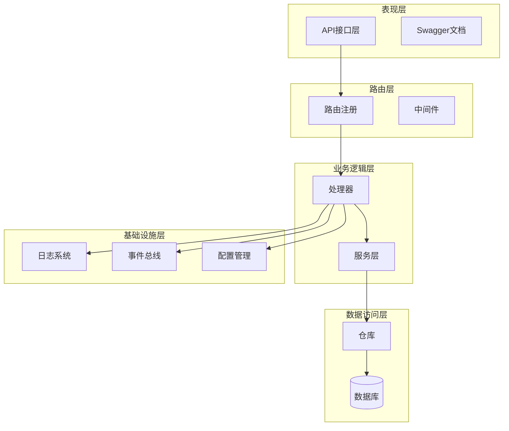
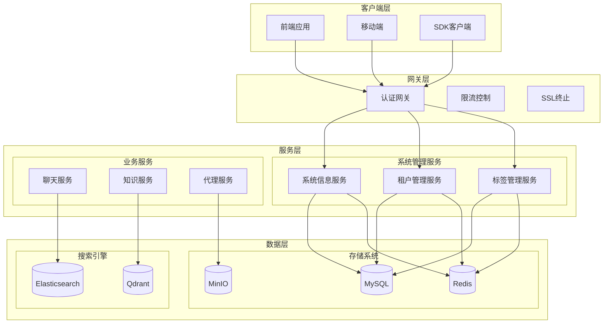
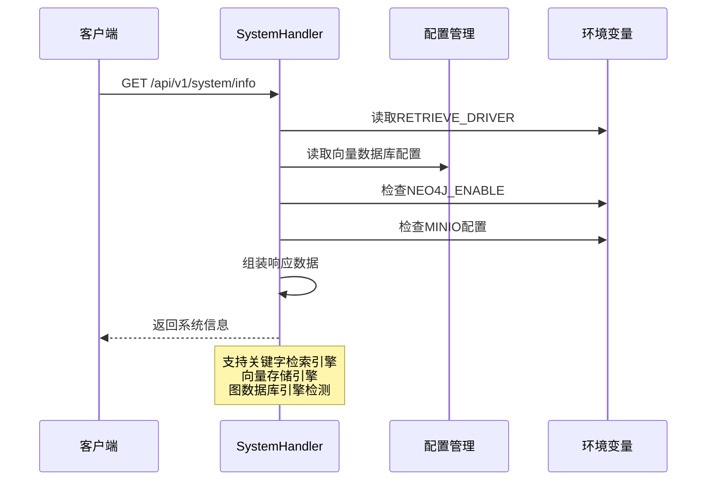
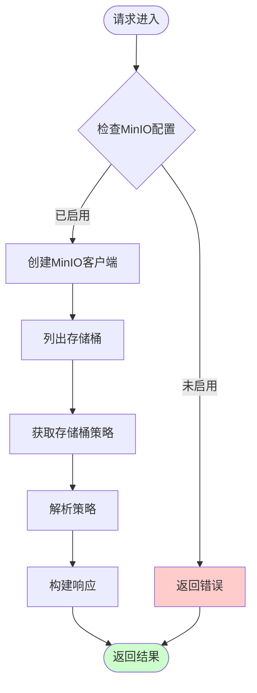
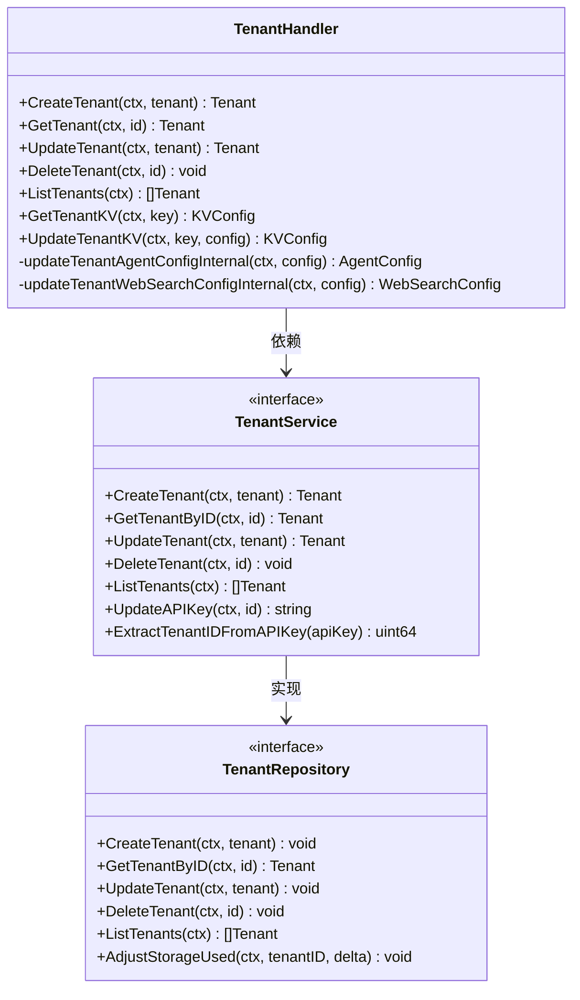
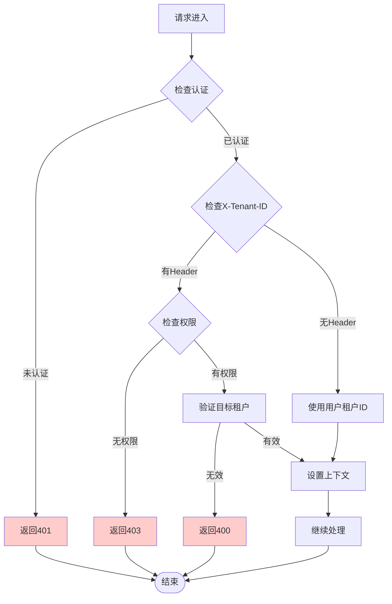
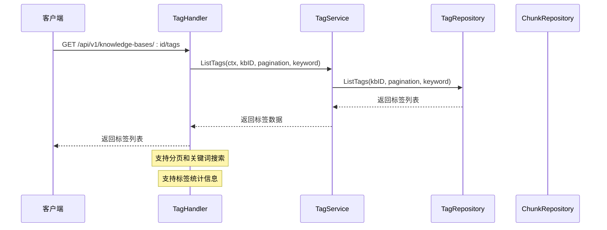
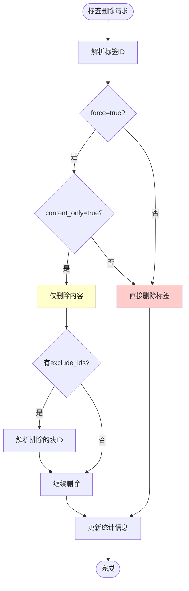
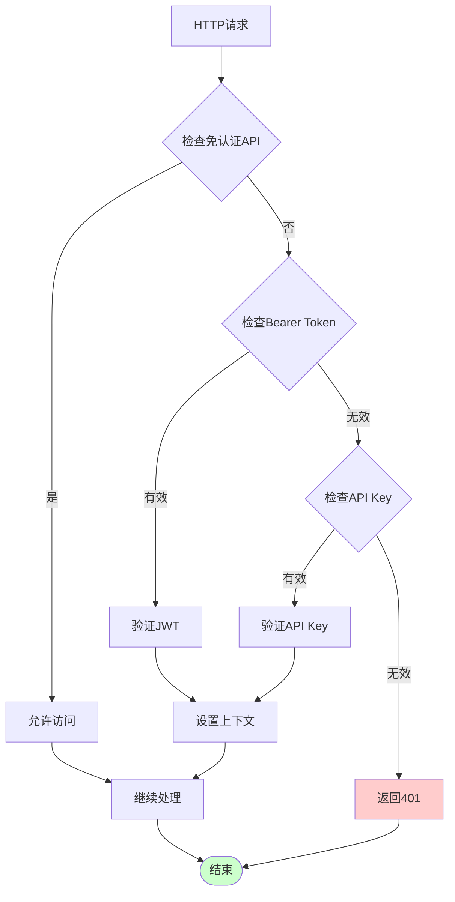
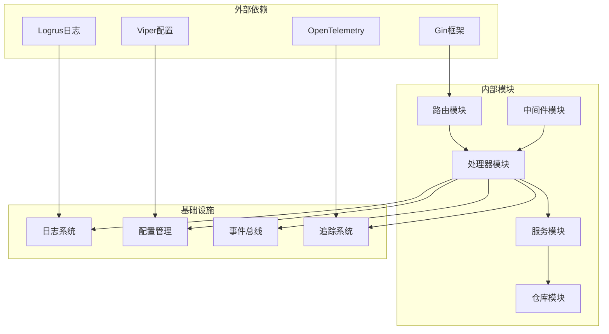

# 系统管理API

<cite>
**本文档引用的文件**
- [internal/router/router.go](file://internal/router/router.go)
- [internal/handler/system.go](file://internal/handler/system.go)
- [internal/handler/tenant.go](file://internal/handler/tenant.go)
- [internal/handler/tag.go](file://internal/handler/tag.go)
- [internal/middleware/auth.go](file://internal/middleware/auth.go)
- [internal/config/config.go](file://internal/config/config.go)
- [internal/logger/logger.go](file://internal/logger/logger.go)
- [internal/event/event.go](file://internal/event/event.go)
- [internal/tracing/init.go](file://internal/tracing/init.go)
- [cmd/server/main.go](file://cmd/server/main.go)
- [docs/swagger.json](file://docs/swagger.json)
- [client/tenant.go](file://client/tenant.go)
</cite>

## 目录
1. [简介](#简介)
2. [项目结构](#项目结构)
3. [核心组件](#核心组件)
4. [架构概览](#架构概览)
5. [详细组件分析](#详细组件分析)
6. [依赖关系分析](#依赖关系分析)
7. [性能考虑](#性能考虑)
8. [故障排除指南](#故障排除指南)
9. [结论](#结论)

## 简介

WiseDx的系统管理API提供了全面的企业级系统管理能力，涵盖标签管理、租户管理、系统配置、监控指标等多个维度。该系统采用多租户架构设计，实现了资源隔离、权限控制和资源共享的平衡。

系统管理API基于Go语言开发，使用Gin框架构建RESTful接口，集成了完整的认证授权机制、日志监控体系和事件驱动架构。支持动态配置更新、热重载和回滚机制，为企业级应用提供了可靠的基础设施管理能力。

## 项目结构

系统管理API采用分层架构设计，主要分为以下层次：

**图表来源**
- [internal/router/router.go](file://internal/router/router.go#L54-L118)
- [internal/handler/system.go](file://internal/handler/system.go#L18-L30)

**章节来源**
- [internal/router/router.go](file://internal/router/router.go#L54-L118)
- [cmd/server/main.go](file://cmd/server/main.go#L124-L188)

## 核心组件

### 系统管理API组件

系统管理API包含以下核心组件：

#### 1. 系统信息管理
- **系统信息查询**：获取版本、构建信息和引擎配置
- **MinIO存储桶管理**：列出和管理存储桶
- **健康检查**：提供系统健康状态检查

#### 2. 租户管理
- **租户生命周期管理**：创建、查询、更新、删除租户
- **跨租户访问控制**：基于配置的跨租户权限管理
- **租户配置管理**：KV配置的统一管理接口

#### 3. 标签管理
- **知识库标签管理**：标签的创建、更新、删除和查询
- **标签统计信息**：标签使用情况和统计信息
- **批量操作支持**：支持批量标签操作

#### 4. 权限认证系统
- **JWT令牌认证**：基于Bearer Token的认证机制
- **API密钥认证**：支持租户级API密钥认证
- **跨租户权限控制**：细粒度的权限管理

**章节来源**
- [internal/handler/system.go](file://internal/handler/system.go#L32-L92)
- [internal/handler/tenant.go](file://internal/handler/tenant.go#L19-L41)
- [internal/handler/tag.go](file://internal/handler/tag.go#L17-L32)

## 架构概览

系统采用事件驱动的微服务架构，实现了松耦合和高内聚的设计原则：

**图表来源**
- [internal/router/router.go](file://internal/router/router.go#L294-L442)
- [internal/middleware/auth.go](file://internal/middleware/auth.go#L59-L196)

## 详细组件分析

### 系统信息服务

系统信息服务提供系统级别的信息查询和管理功能：

#### 系统信息查询接口

**图表来源**
- [internal/handler/system.go](file://internal/handler/system.go#L52-L92)

#### MinIO存储桶管理

**图表来源**
- [internal/handler/system.go](file://internal/handler/system.go#L197-L280)

**章节来源**
- [internal/handler/system.go](file://internal/handler/system.go#L32-L92)
- [internal/handler/system.go](file://internal/handler/system.go#L185-L280)

### 租户管理系统

租户管理系统实现了完整的多租户架构，支持租户的全生命周期管理和配置管理。

#### 租户配置管理

**图表来源**
- [internal/handler/tenant.go](file://internal/handler/tenant.go#L19-L41)
- [internal/types/interfaces/tenant.go](file://internal/types/interfaces/tenant.go#L9-L31)

#### 跨租户访问控制

**图表来源**
- [internal/middleware/auth.go](file://internal/middleware/auth.go#L59-L196)

**章节来源**
- [internal/handler/tenant.go](file://internal/handler/tenant.go#L43-L271)
- [internal/middleware/auth.go](file://internal/middleware/auth.go#L41-L57)

### 标签管理系统

标签管理系统提供了灵活的知识库标签管理功能：

#### 标签操作流程

**图表来源**
- [internal/handler/tag.go](file://internal/handler/tag.go#L75-L99)

#### 标签删除策略

**图表来源**
- [internal/handler/tag.go](file://internal/handler/tag.go#L214-L256)

**章节来源**
- [internal/handler/tag.go](file://internal/handler/tag.go#L60-L260)

### 认证授权系统

系统采用双重认证机制，确保安全性和灵活性：

#### 认证流程

**图表来源**
- [internal/middleware/auth.go](file://internal/middleware/auth.go#L59-L196)

**章节来源**
- [internal/middleware/auth.go](file://internal/middleware/auth.go#L18-L196)

## 依赖关系分析

系统采用依赖注入和接口抽象的设计模式，实现了良好的模块解耦：

**图表来源**
- [cmd/server/main.go](file://cmd/server/main.go#L124-L188)
- [internal/router/router.go](file://internal/router/router.go#L21-L51)

**章节来源**
- [cmd/server/main.go](file://cmd/server/main.go#L124-L188)
- [internal/router/router.go](file://internal/router/router.go#L21-L51)

## 性能考虑

系统在设计时充分考虑了性能优化和可扩展性：

### 性能优化策略

1. **连接池管理**：数据库连接池和Redis连接池的合理配置
2. **缓存策略**：多级缓存架构，包括内存缓存和Redis缓存
3. **异步处理**：事件驱动架构，支持异步任务处理
4. **资源清理**：优雅关闭和资源清理机制

### 监控指标

系统内置了完善的监控和日志系统：

- **结构化日志**：统一的日志格式和字段
- **性能指标**：请求延迟、吞吐量、错误率等关键指标
- **追踪系统**：基于OpenTelemetry的分布式追踪
- **事件驱动**：基于事件总线的系统状态监控

## 故障排除指南

### 常见问题诊断

#### 认证相关问题

1. **401 Unauthorized错误**
   - 检查JWT令牌格式和有效期
   - 验证API密钥的有效性
   - 确认用户租户状态

2. **403 Forbidden错误**
   - 检查跨租户访问权限配置
   - 验证用户权限级别
   - 确认目标租户存在性

#### 系统配置问题

1. **MinIO连接失败**
   - 检查MinIO环境变量配置
   - 验证网络连通性
   - 确认存储桶权限设置

2. **数据库连接问题**
   - 检查数据库连接参数
   - 验证数据库服务状态
   - 确认迁移脚本执行情况

**章节来源**
- [internal/middleware/auth.go](file://internal/middleware/auth.go#L148-L196)
- [internal/handler/system.go](file://internal/handler/system.go#L207-L280)

## 结论

WiseDx的系统管理API提供了一个完整的企业级系统管理解决方案。通过多租户架构、完善的认证授权机制、灵活的配置管理以及强大的监控日志系统，为企业提供了可靠、安全、可扩展的基础设施管理能力。

系统的主要优势包括：

1. **多租户架构**：实现了资源隔离和权限控制的平衡
2. **灵活的认证机制**：支持多种认证方式，满足不同场景需求
3. **完善的监控体系**：提供了全面的系统监控和日志管理能力
4. **可扩展的设计**：模块化架构支持功能扩展和定制化需求

通过本文档的详细说明，开发者可以更好地理解和使用WiseDx的系统管理API，为企业级应用的开发和部署提供有力支持。