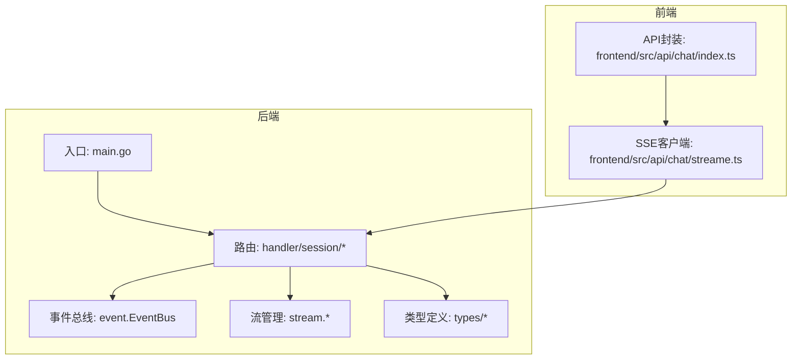
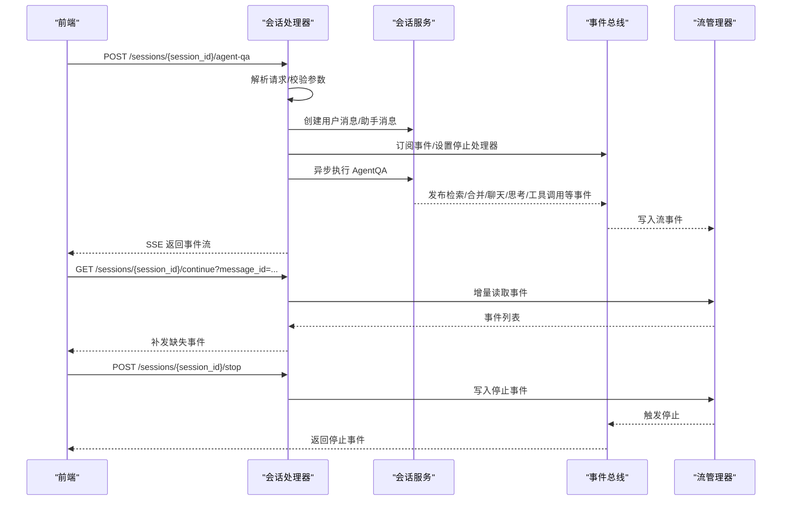
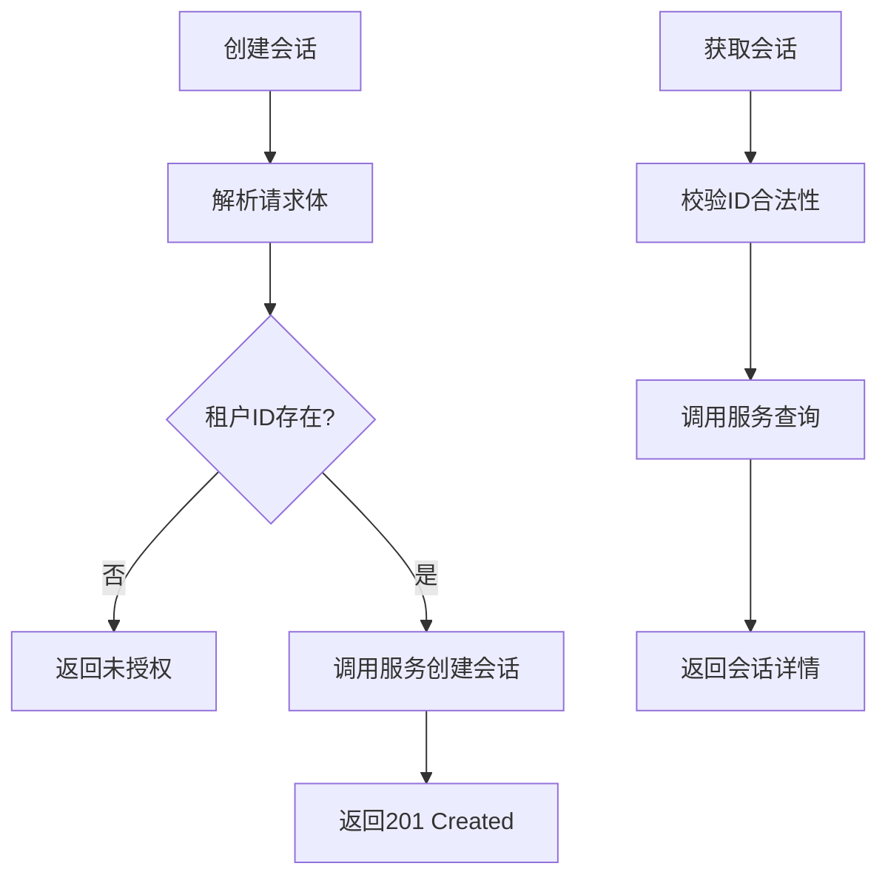
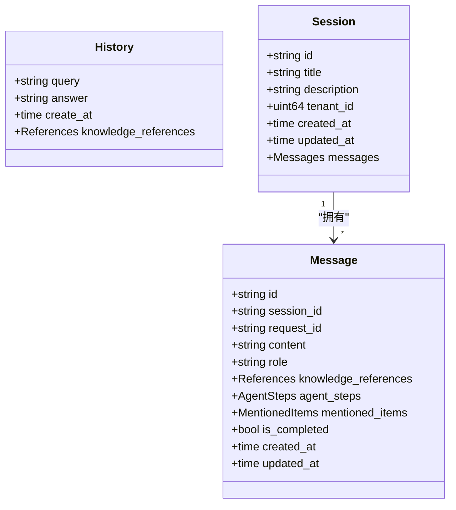
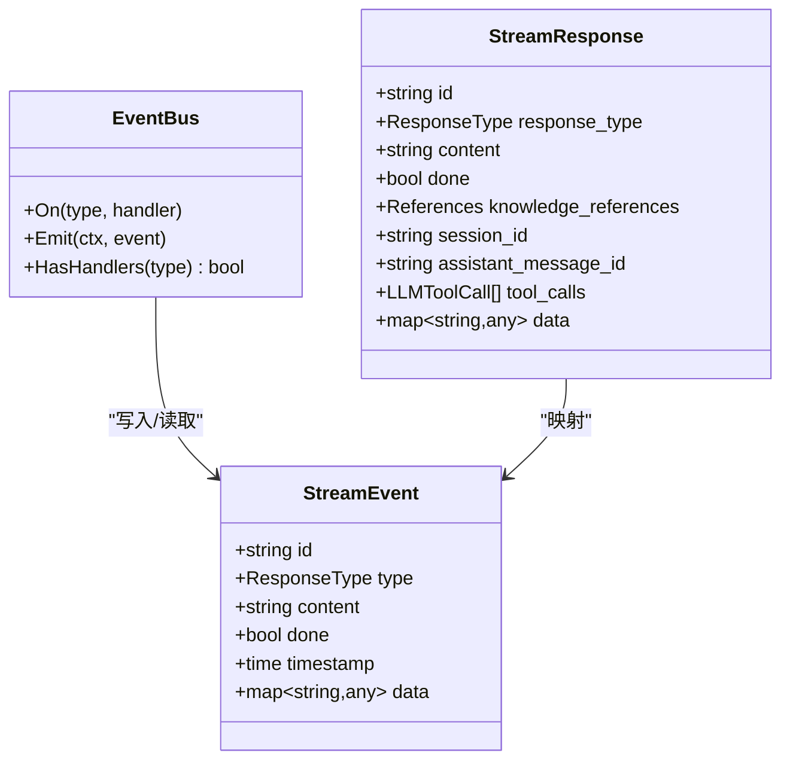
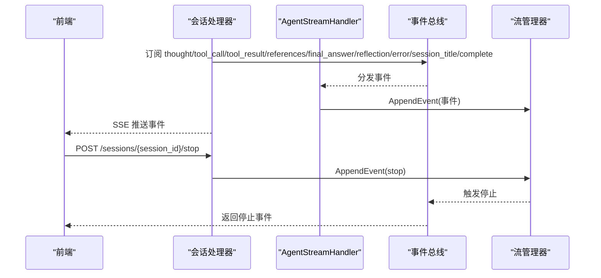
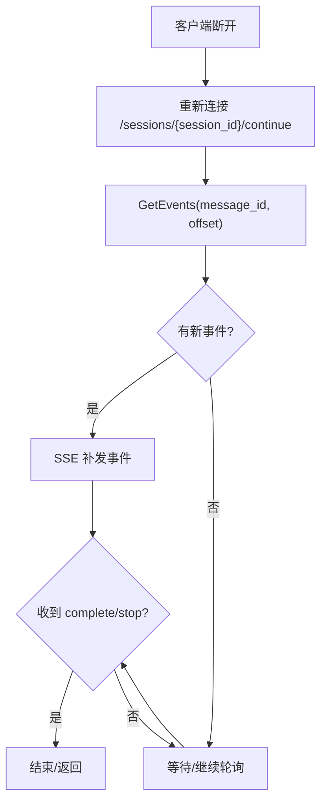
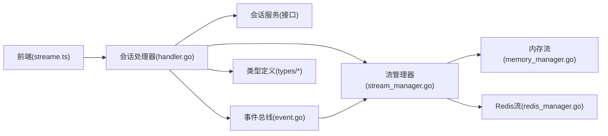

# 聊天会话API

<cite>
**本文档引用的文件**
- [main.go](file://cmd/server/main.go)
- [handler.go](file://internal/handler/session/handler.go)
- [stream.go](file://internal/handler/session/stream.go)
- [agent_stream_handler.go](file://internal/handler/session/agent_stream_handler.go)
- [qa.go](file://internal/handler/session/qa.go)
- [session.go](file://internal/types/session.go)
- [message.go](file://internal/types/message.go)
- [chat.go](file://internal/types/chat.go)
- [stream_manager.go](file://internal/types/interfaces/stream_manager.go)
- [event.go](file://internal/event/event.go)
- [index.ts](file://frontend/src/api/chat/index.ts)
- [streame.ts](file://frontend/src/api/chat/streame.ts)
- [memory_manager.go](file://internal/stream/memory_manager.go)
- [redis_manager.go](file://internal/stream/redis_manager.go)
</cite>

## 目录
1. [简介](#简介)
2. [项目结构](#项目结构)
3. [核心组件](#核心组件)
4. [架构总览](#架构总览)
5. [详细组件分析](#详细组件分析)
6. [依赖关系分析](#依赖关系分析)
7. [性能考虑](#性能考虑)
8. [故障排除指南](#故障排除指南)
9. [结论](#结论)
10. [附录](#附录)

## 简介
本文件为 WiseDx 的聊天会话 API 提供全面的技术文档，覆盖以下关键能力：
- 会话生命周期管理：创建、查询、更新、删除
- 消息交互：用户消息创建与助手消息生成
- 流式响应：基于 Server-Sent Events (SSE) 的增量推送
- 历史查询：按时间窗口加载历史消息
- 实时控制：停止生成、断线重连、事件恢复
- 对话历史管理与上下文窗口控制
- 多轮对话状态维护与智能代理模式
- 工具调用与思考过程展示
- 权限控制、租户隔离与数据安全

## 项目结构
后端采用 Go Gin 框架，通过依赖注入容器构建服务层；前端使用 Vue + fetch-event-source 实现 SSE 流式交互。

图表来源
- [main.go](file://cmd/server/main.go#L88-L192)
- [handler.go](file://internal/handler/session/handler.go#L15-L42)
- [event.go](file://internal/event/event.go#L84-L96)
- [memory_manager.go](file://internal/stream/memory_manager.go#L18-L30)
- [redis_manager.go](file://internal/stream/redis_manager.go#L13-L18)
- [index.ts](file://frontend/src/api/chat/index.ts#L1-L53)
- [streame.ts](file://frontend/src/api/chat/streame.ts#L1-L182)

章节来源
- [main.go](file://cmd/server/main.go#L88-L192)
- [handler.go](file://internal/handler/session/handler.go#L15-L42)

## 核心组件
- 会话处理器：负责会话 CRUD、问答请求解析、SSE 流式响应与停止控制
- 事件总线：统一发布/订阅各类处理阶段事件（检索、合并、聊天、Agent 思考、工具调用等）
- 流管理器：以 Redis 或内存实现的事件追加与增量读取，支撑 SSE 断点续传
- 类型系统：会话、消息、流响应、事件类型等核心数据结构
- 前端 API：封装 SSE 连接、断线重连、错误处理与事件渲染

章节来源
- [handler.go](file://internal/handler/session/handler.go#L15-L42)
- [event.go](file://internal/event/event.go#L11-L68)
- [stream_manager.go](file://internal/types/interfaces/stream_manager.go#L20-L32)
- [chat.go](file://internal/types/chat.go#L67-L87)
- [streame.ts](file://frontend/src/api/chat/streame.ts#L18-L182)

## 架构总览
整体交互流程：前端发起 SSE 请求，后端创建用户/助手消息，启动异步处理流程并通过事件总线驱动 Agent/检索/合并/聊天等步骤，事件被写入流管理器，前端通过 SSE 逐步接收增量事件，支持断线重连与停止控制。

图表来源
- [qa.go](file://internal/handler/session/qa.go#L251-L481)
- [stream.go](file://internal/handler/session/stream.go#L31-L176)
- [agent_stream_handler.go](file://internal/handler/session/agent_stream_handler.go#L56-L69)
- [event.go](file://internal/event/event.go#L14-L68)
- [stream_manager.go](file://internal/types/interfaces/stream_manager.go#L20-L32)

## 详细组件分析

### 会话管理
- 创建会话：携带租户标识，返回会话基本信息
- 获取会话：按 ID 查询
- 会话列表：分页查询当前租户下的会话
- 更新/删除会话：鉴权校验租户后操作

图表来源
- [handler.go](file://internal/handler/session/handler.go#L44-L105)
- [handler.go](file://internal/handler/session/handler.go#L107-L152)
- [handler.go](file://internal/handler/session/handler.go#L154-L194)

章节来源
- [handler.go](file://internal/handler/session/handler.go#L44-L194)

### 消息与历史
- 消息结构：包含角色、内容、知识引用、Agent 步骤、提及项、完成状态等
- 历史结构：查询-回答对及引用
- 历史加载：按时间窗口分页加载

图表来源
- [message.go](file://internal/types/message.go#L56-L87)
- [message.go](file://internal/types/message.go#L13-L21)
- [session.go](file://internal/types/session.go#L74-L108)

章节来源
- [message.go](file://internal/types/message.go#L56-L135)
- [session.go](file://internal/types/session.go#L74-L108)

### 流式响应与事件类型
- SSE 头部设置与事件推送
- 事件类型：思考、工具调用、工具结果、引用、最终答案、反思、会话标题、完成、停止、错误等
- 前端通过 fetch-event-source 接收事件，支持断线重连与错误处理

图表来源
- [chat.go](file://internal/types/chat.go#L67-L87)
- [stream_manager.go](file://internal/types/interfaces/stream_manager.go#L10-L18)
- [event.go](file://internal/event/event.go#L70-L78)

章节来源
- [stream.go](file://internal/handler/session/stream.go#L18-L176)
- [chat.go](file://internal/types/chat.go#L42-L65)
- [event.go](file://internal/event/event.go#L14-L68)

### 智能代理模式与工具调用
- Agent 模式：启用计划、步骤、工具调用、反思、引用与最终答案的完整链路
- 事件驱动：AgentStreamHandler 订阅各类事件并写入流管理器
- 前端渲染：支持思考过程、工具调用、工具结果、快速回复选项等

图表来源
- [agent_stream_handler.go](file://internal/handler/session/agent_stream_handler.go#L56-L69)
- [agent_stream_handler.go](file://internal/handler/session/agent_stream_handler.go#L119-L150)
- [agent_stream_handler.go](file://internal/handler/session/agent_stream_handler.go#L243-L306)
- [agent_stream_handler.go](file://internal/handler/session/agent_stream_handler.go#L308-L376)
- [agent_stream_handler.go](file://internal/handler/session/agent_stream_handler.go#L378-L404)
- [agent_stream_handler.go](file://internal/handler/session/agent_stream_handler.go#L406-L432)
- [agent_stream_handler.go](file://internal/handler/session/agent_stream_handler.go#L434-L484)

章节来源
- [qa.go](file://internal/handler/session/qa.go#L276-L301)
- [qa.go](file://internal/handler/session/qa.go#L400-L481)

### 断线重连与继续流
- 续传接口：根据 message_id 从流管理器增量读取事件并补发
- 轮询机制：定时拉取新事件，检测完成/停止事件后结束

图表来源
- [stream.go](file://internal/handler/session/stream.go#L31-L176)

章节来源
- [stream.go](file://internal/handler/session/stream.go#L31-L176)

### 权限控制、租户隔离与数据安全
- 认证方式：Bearer Token（JWT）与 X-API-Key（租户 API Key）
- 租户隔离：所有会话与消息均绑定 tenant_id，接口中进行租户校验
- 数据安全：敏感字段日志脱敏、请求头中传递租户标识、错误信息最小化暴露

章节来源
- [main.go](file://cmd/server/main.go#L14-L22)
- [handler.go](file://internal/handler/session/handler.go#L66-L72)
- [stream.go](file://internal/handler/session/stream.go#L54-L65)

## 依赖关系分析

图表来源
- [streame.ts](file://frontend/src/api/chat/streame.ts#L113-L148)
- [handler.go](file://internal/handler/session/handler.go#L15-L42)
- [event.go](file://internal/event/event.go#L84-L96)
- [stream_manager.go](file://internal/types/interfaces/stream_manager.go#L20-L32)
- [memory_manager.go](file://internal/stream/memory_manager.go#L18-L30)
- [redis_manager.go](file://internal/stream/redis_manager.go#L13-L18)
- [chat.go](file://internal/types/chat.go#L67-L87)

章节来源
- [handler.go](file://internal/handler/session/handler.go#L15-L42)
- [stream_manager.go](file://internal/types/interfaces/stream_manager.go#L20-L32)
- [memory_manager.go](file://internal/stream/memory_manager.go#L18-L119)
- [redis_manager.go](file://internal/stream/redis_manager.go#L13-L137)

## 性能考虑
- 流管理器采用 Redis 列表（RPush/LRange）实现 O(1) 追加与增量读取，适合高并发场景
- 内存流管理器适用于单实例部署与开发测试
- SSE 轮询间隔 100ms，平衡延迟与资源占用
- 事件按类型拆分推送，前端按需渲染，降低单次负载

## 故障排除指南
- 401 未授权：检查 Authorization 头与租户 API Key
- 404 会话/消息不存在：确认 session_id/message_id 合法性
- 连接中断：使用续传接口 /sessions/{session_id}/continue 恢复
- 停止生成：POST /sessions/{session_id}/stop，后端写入停止事件并广播
- 错误事件：事件类型 error，包含阶段与错误信息，前端显示并终止渲染

章节来源
- [stream.go](file://internal/handler/session/stream.go#L178-L294)
- [event.go](file://internal/event/event.go#L60-L61)

## 结论
WiseDx 的聊天会话 API 通过事件驱动与流式推送实现了完整的多轮对话体验，支持智能代理模式、工具调用与思考过程可视化，并具备完善的断线重连、权限控制与租户隔离能力。前后端协作清晰，扩展性强，适合在企业级知识增强问答场景中部署与演进。

## 附录

### API 接口清单（节选）
- 会话管理
  - POST /api/v1/sessions
  - GET /api/v1/sessions
  - GET /api/v1/sessions/{id}
  - PUT /api/v1/sessions/{id}
  - DELETE /api/v1/sessions/{id}
- 问答与流式
  - POST /api/v1/sessions/{session_id}/knowledge-qa
  - POST /api/v1/sessions/{session_id}/agent-qa
  - GET /api/v1/sessions/{session_id}/continue
  - POST /api/v1/sessions/{session_id}/stop
- 历史与消息
  - GET /api/v1/messages/{session_id}/load

章节来源
- [handler.go](file://internal/handler/session/handler.go#L44-L194)
- [qa.go](file://internal/handler/session/qa.go#L238-L301)
- [stream.go](file://internal/handler/session/stream.go#L18-L176)