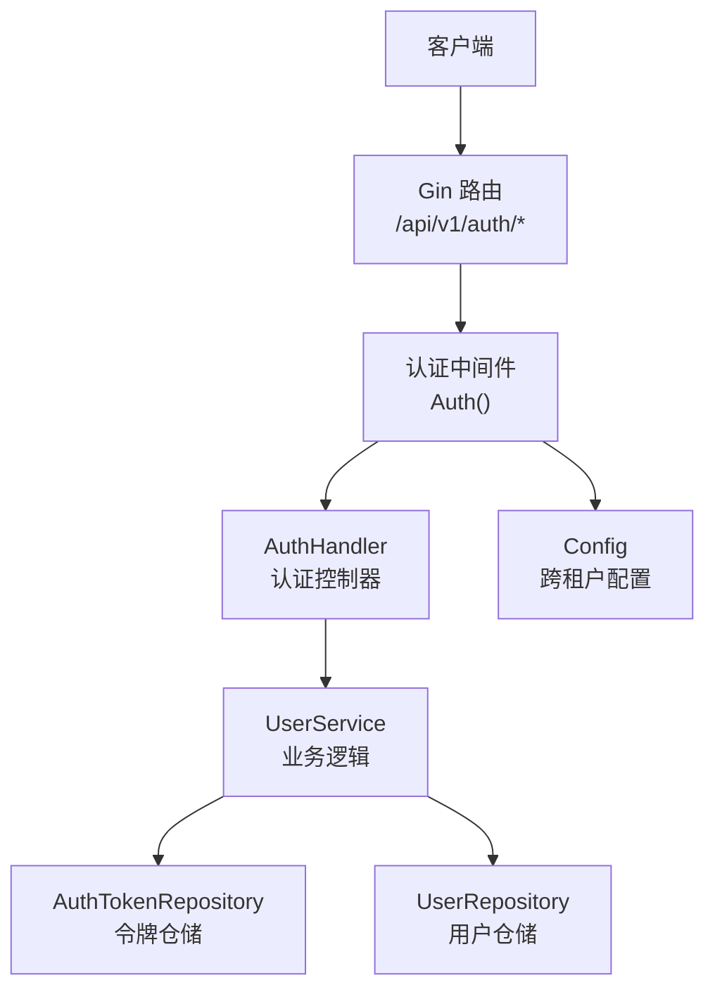
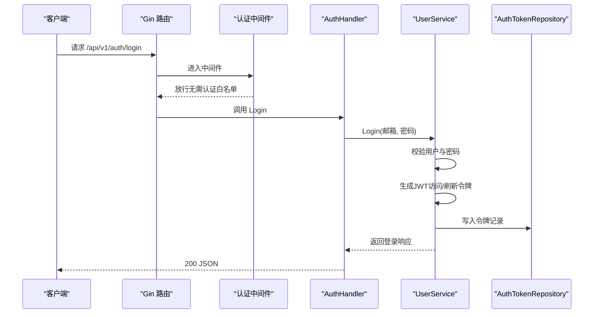
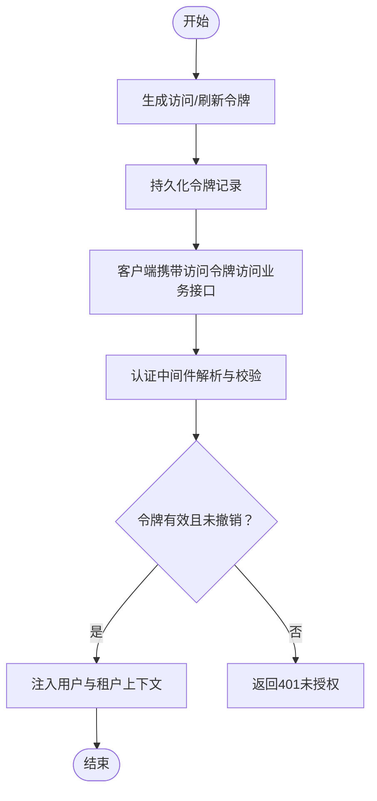
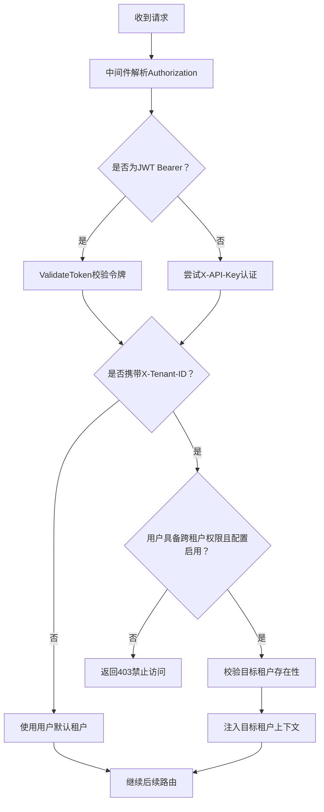
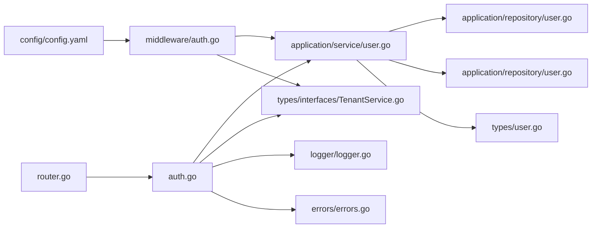

# 认证授权API

<cite>
**本文引用的文件**   
- [internal/handler/auth.go](file://internal/handler/auth.go)
- [internal/router/router.go](file://internal/router/router.go)
- [internal/middleware/auth.go](file://internal/middleware/auth.go)
- [internal/application/service/user.go](file://internal/application/service/user.go)
- [internal/application/repository/user.go](file://internal/application/repository/user.go)
- [internal/types/user.go](file://internal/types/user.go)
- [cmd/server/main.go](file://cmd/server/main.go)
- [internal/errors/errors.go](file://internal/errors/errors.go)
- [.env.example](file://.env.example)
- [config/config.yaml](file://config/config.yaml)
</cite>

## 目录
1. [简介](#简介)
2. [项目结构](#项目结构)
3. [核心组件](#核心组件)
4. [架构总览](#架构总览)
5. [详细组件分析](#详细组件分析)
6. [依赖分析](#依赖分析)
7. [性能考量](#性能考量)
8. [故障排查指南](#故障排查指南)
9. [结论](#结论)
10. [附录](#附录)

## 简介
本文件面向WiseDx系统的认证授权API，覆盖用户注册、登录、登出、令牌刷新、密码修改、令牌校验与获取当前用户等完整流程。文档详细说明各端点的HTTP方法、URL路径、请求参数、请求体格式、响应结构与状态码；阐述JWT令牌的生成、验证与刷新机制；说明认证中间件的使用与安全策略；提供每个API端点的成功与失败示例；记录参数验证规则、错误处理与异常情况；并包含跨租户访问控制与权限验证的实现细节。

## 项目结构
认证授权API位于后端服务的HTTP层与业务层之间，采用Gin框架路由、中间件统一鉴权、服务层处理业务逻辑、仓储层持久化令牌与用户信息。认证相关路由集中在“/api/v1/auth”路径下，统一受认证中间件保护。

图表来源
- [internal/router/router.go](file://internal/router/router.go#L90-L118)
- [internal/middleware/auth.go](file://internal/middleware/auth.go#L59-L196)
- [internal/handler/auth.go](file://internal/handler/auth.go#L18-L40)

章节来源
- [internal/router/router.go](file://internal/router/router.go#L90-L118)
- [internal/middleware/auth.go](file://internal/middleware/auth.go#L59-L196)
- [cmd/server/main.go](file://cmd/server/main.go#L14-L23)

## 核心组件
- 认证控制器（AuthHandler）：负责接收HTTP请求、参数绑定与校验、调用UserService执行业务逻辑、返回标准化响应。
- 认证中间件（Auth）：统一拦截除白名单外的请求，支持JWT Bearer与API Key两种认证方式，处理跨租户切换与上下文注入。
- 用户服务（UserService）：实现登录、注册、令牌生成与验证、刷新、撤销、密码修改、获取当前用户等核心业务。
- 令牌仓储（AuthTokenRepository）：负责令牌的创建、查询、更新与撤销。
- 用户类型与令牌类型：定义用户、令牌、登录/注册请求与响应的数据结构。
- 错误体系：统一的AppError错误类型，映射HTTP状态码与业务错误码。

章节来源
- [internal/handler/auth.go](file://internal/handler/auth.go#L18-L40)
- [internal/middleware/auth.go](file://internal/middleware/auth.go#L59-L196)
- [internal/application/service/user.go](file://internal/application/service/user.go#L47-L52)
- [internal/application/repository/user.go](file://internal/application/repository/user.go#L98-L152)
- [internal/types/user.go](file://internal/types/user.go#L9-L119)
- [internal/errors/errors.go](file://internal/errors/errors.go#L42-L125)

## 架构总览
认证API遵循“路由-中间件-控制器-服务-仓储”的分层架构，认证中间件在进入业务路由前统一鉴权，支持：
- JWT Bearer令牌：访问令牌用于业务请求，刷新令牌用于换取新访问令牌。
- API Key：租户级API Key认证，用于服务间或脚本调用。
- 跨租户访问：具备权限的用户可通过请求头切换目标租户，中间件校验并注入上下文。

图表来源
- [internal/router/router.go](file://internal/router/router.go#L344-L353)
- [internal/middleware/auth.go](file://internal/middleware/auth.go#L72-L76)
- [internal/handler/auth.go](file://internal/handler/auth.go#L106-L158)
- [internal/application/service/user.go](file://internal/application/service/user.go#L130-L168)
- [internal/application/repository/user.go](file://internal/application/repository/user.go#L108-L123)

## 详细组件分析

### 认证路由与端点清单
- 路由前缀：/api/v1
- 认证相关路由注册：RegisterAuthRoutes
- 白名单（无需认证）：/health、/api/v1/auth/register、/api/v1/auth/login、/api/v1/auth/refresh

章节来源
- [internal/router/router.go](file://internal/router/router.go#L344-L353)
- [internal/middleware/auth.go](file://internal/middleware/auth.go#L18-L39)

### JWT令牌生成与验证机制
- 生成：登录成功后生成访问令牌（24小时）与刷新令牌（7天），并持久化到令牌表。
- 验证：中间件与控制器均通过UserService.ValidateToken解析JWT，校验签名、有效期与撤销状态。
- 刷新：使用刷新令牌换取新的访问令牌与刷新令牌，旧刷新令牌撤销。

图表来源
- [internal/application/service/user.go](file://internal/application/service/user.go#L262-L322)
- [internal/application/service/user.go](file://internal/application/service/user.go#L324-L354)
- [internal/application/service/user.go](file://internal/application/service/user.go#L356-L405)

章节来源
- [internal/application/service/user.go](file://internal/application/service/user.go#L262-L322)
- [internal/application/service/user.go](file://internal/application/service/user.go#L324-L354)
- [internal/application/service/user.go](file://internal/application/service/user.go#L356-L405)

### 跨租户访问控制与权限验证
- 配置开关：config.tenant.enable_cross_tenant_access
- 权限判定：用户需具备CanAccessAllTenants=true且配置启用
- 切换机制：通过请求头X-Tenant-ID指定目标租户，中间件校验权限与租户有效性
- 上下文注入：将目标租户ID与租户信息注入Gin上下文

图表来源
- [internal/middleware/auth.go](file://internal/middleware/auth.go#L41-L57)
- [internal/middleware/auth.go](file://internal/middleware/auth.go#L85-L117)
- [config/config.yaml](file://config/config.yaml#L581-L585)

章节来源
- [internal/middleware/auth.go](file://internal/middleware/auth.go#L41-L57)
- [internal/middleware/auth.go](file://internal/middleware/auth.go#L85-L117)
- [config/config.yaml](file://config/config.yaml#L581-L585)

### API端点定义与示例

#### 1) 用户注册
- 方法与路径：POST /api/v1/auth/register
- 请求头：Content-Type: application/json
- 请求体字段：
  - username: string（必填，长度3~50）
  - email: string（必填，邮箱格式）
  - password: string（必填，最小长度6）
- 成功响应：201 Created，返回success、message、user、tenant
- 失败响应：
  - 400 Bad Request：参数校验失败
  - 403 Forbidden：注册被禁用（环境变量DISABLE_REGISTRATION=true）

请求示例（成功）
- 请求体
  {
    "username": "张三",
    "email": "zhangsan@example.com",
    "password": "Password123"
  }
- 响应体
  {
    "success": true,
    "message": "Registration successful",
    "user": {
      "id": "xxx",
      "username": "张三",
      "email": "zhangsan@example.com",
      "tenant_id": 1,
      "is_active": true,
      "can_access_all_tenants": false,
      "created_at": "2025-01-01T00:00:00Z",
      "updated_at": "2025-01-01T00:00:00Z"
    },
    "tenant": null
  }

请求示例（失败：参数缺失）
- 请求体
  {
    "username": "",
    "email": "invalid-email",
    "password": "123"
  }
- 响应体
  {
    "code": 1010,
    "message": "Invalid registration parameters",
    "details": "..."
  }

章节来源
- [internal/handler/auth.go](file://internal/handler/auth.go#L42-L104)
- [internal/types/user.go](file://internal/types/user.go#L67-L90)
- [internal/errors/errors.go](file://internal/errors/errors.go#L118-L125)
- [.env.example](file://.env.example#L14-L15)

#### 2) 用户登录
- 方法与路径：POST /api/v1/auth/login
- 请求体字段：
  - email: string（必填，邮箱格式）
  - password: string（必填，最小长度6）
- 成功响应：200 OK，返回success、message、user、tenant、token、refresh_token
- 失败响应：401 Unauthorized（凭据无效）

请求示例（成功）
- 响应体
  {
    "success": true,
    "message": "Login successful",
    "user": { "id": "...", "username": "...", "email": "...", "tenant_id": 1 },
    "tenant": null,
    "token": "eyJhbGciOiJIUzI1NiIs...",
    "refresh_token": "eyJhbGciOiJIUzI1NiIs..."
  }

请求示例（失败：凭据无效）
- 响应体
  {
    "success": false,
    "message": "Invalid email or password"
  }

章节来源
- [internal/handler/auth.go](file://internal/handler/auth.go#L106-L158)
- [internal/application/service/user.go](file://internal/application/service/user.go#L130-L168)
- [internal/types/user.go](file://internal/types/user.go#L74-L82)

#### 3) 登出
- 方法与路径：POST /api/v1/auth/logout
- 请求头：Authorization: Bearer {access_token}
- 成功响应：200 OK，{"success": true, "message": "Logout successful"}
- 失败响应：400 Bad Request（Authorization头缺失或格式错误）、500 InternalServerError（撤销失败）

请求示例（成功）
- 响应体
  {
    "success": true,
    "message": "Logout successful"
  }

章节来源
- [internal/handler/auth.go](file://internal/handler/auth.go#L160-L209)
- [internal/application/service/user.go](file://internal/application/service/user.go#L407-L418)

#### 4) 刷新令牌
- 方法与路径：POST /api/v1/auth/refresh
- 请求体字段：
  - refreshToken: string（必填）
- 成功响应：200 OK，返回success、message、access_token、refresh_token
- 失败响应：401 Unauthorized（刷新令牌无效或已撤销）

请求示例（成功）
- 响应体
  {
    "success": true,
    "message": "Token refreshed successfully",
    "access_token": "新的访问令牌",
    "refresh_token": "新的刷新令牌"
  }

章节来源
- [internal/handler/auth.go](file://internal/handler/auth.go#L211-L253)
- [internal/application/service/user.go](file://internal/application/service/user.go#L356-L405)

#### 5) 验证令牌
- 方法与路径：GET /api/v1/auth/validate
- 请求头：Authorization: Bearer {access_token}
- 成功响应：200 OK，返回success、message、user
- 失败响应：401 Unauthorized（令牌无效）

请求示例（成功）
- 响应体
  {
    "success": true,
    "message": "Token is valid",
    "user": { "id": "...", "username": "...", "email": "...", "tenant_id": 1, ... }
  }

章节来源
- [internal/handler/auth.go](file://internal/handler/auth.go#L350-L400)
- [internal/application/service/user.go](file://internal/application/service/user.go#L324-L354)

#### 6) 获取当前用户
- 方法与路径：GET /api/v1/auth/me
- 请求头：Authorization: Bearer {access_token}
- 成功响应：200 OK，返回success、data.user、data.tenant（当用户属于租户时）
- 失败响应：401 Unauthorized（未授权）

请求示例（成功）
- 响应体
  {
    "success": true,
    "data": {
      "user": { "id": "...", "username": "...", "email": "...", "tenant_id": 1, "can_access_all_tenants": true, ... },
      "tenant": null
    }
  }

章节来源
- [internal/handler/auth.go](file://internal/handler/auth.go#L255-L295)
- [internal/types/user.go](file://internal/types/user.go#L92-L119)

#### 7) 修改密码
- 方法与路径：POST /api/v1/auth/change-password
- 请求头：Authorization: Bearer {access_token}
- 请求体字段：
  - old_password: string（必填）
  - new_password: string（必填，最小长度6）
- 成功响应：200 OK，{"success": true, "message": "Password changed successfully"}
- 失败响应：400 Bad Request（参数或旧密码错误）

请求示例（成功）
- 响应体
  {
    "success": true,
    "message": "Password changed successfully"
  }

章节来源
- [internal/handler/auth.go](file://internal/handler/auth.go#L297-L348)
- [internal/application/service/user.go](file://internal/application/service/user.go#L126-L168)

### 参数验证规则与错误处理
- 参数绑定与校验：使用Gin的ShouldBindJSON与结构体tag（如required、min、max、email）进行基础校验。
- 自定义校验：对必填字段进行显式检查，必要时抛出ValidationError。
- 错误映射：统一转换为AppError，映射HTTP状态码（如400、401、403、500）。
- 日志记录：对参数解析失败、认证失败、业务异常等情况进行日志记录与错误上报。

章节来源
- [internal/handler/auth.go](file://internal/handler/auth.go#L66-L83)
- [internal/handler/auth.go](file://internal/handler/auth.go#L121-L136)
- [internal/handler/auth.go](file://internal/handler/auth.go#L313-L323)
- [internal/errors/errors.go](file://internal/errors/errors.go#L118-L125)
- [internal/errors/errors.go](file://internal/errors/errors.go#L106-L116)

## 依赖分析
认证相关模块的依赖关系如下：

图表来源
- [internal/router/router.go](file://internal/router/router.go#L344-L353)
- [internal/handler/auth.go](file://internal/handler/auth.go#L18-L40)
- [internal/middleware/auth.go](file://internal/middleware/auth.go#L59-L64)
- [internal/application/service/user.go](file://internal/application/service/user.go#L47-L52)
- [internal/application/repository/user.go](file://internal/application/repository/user.go#L98-L152)
- [internal/types/user.go](file://internal/types/user.go#L9-L119)
- [config/config.yaml](file://config/config.yaml#L581-L585)

章节来源
- [internal/router/router.go](file://internal/router/router.go#L344-L353)
- [internal/middleware/auth.go](file://internal/middleware/auth.go#L59-L64)
- [internal/application/service/user.go](file://internal/application/service/user.go#L47-L52)

## 性能考量
- JWT签名算法：HS256，密钥来自环境变量JWT_SECRET，建议在生产环境固定且安全存储。
- 令牌生命周期：访问令牌24小时，刷新令牌7天，减少频繁登录成本。
- 令牌撤销：支持即时撤销与数据库级校验，避免令牌泄露风险。
- 中间件开销：认证中间件仅在必要时解析与校验，跨租户切换按需校验，避免不必要的数据库查询。
- 配置缓存：JWT密钥通过once初始化，避免重复生成。

[本节为通用指导，不直接分析具体文件]

## 故障排查指南
- 401 未授权
  - 检查Authorization头格式是否为Bearer {token}
  - 确认令牌未过期且未被撤销
  - 核对JWT_SECRET配置是否一致
- 403 禁止访问
  - 跨租户访问需满足配置与权限条件
  - 确认X-Tenant-ID合法且目标租户存在
- 400 参数错误
  - 检查请求体字段类型与长度约束
  - 确认邮箱格式与密码长度
- 登录失败
  - 核对用户是否激活
  - 确认密码哈希匹配
- 注册被禁用
  - 环境变量DISABLE_REGISTRATION=true时禁止注册

章节来源
- [internal/handler/auth.go](file://internal/handler/auth.go#L175-L191)
- [internal/handler/auth.go](file://internal/handler/auth.go#L365-L381)
- [internal/application/service/user.go](file://internal/application/service/user.go#L130-L168)
- [internal/middleware/auth.go](file://internal/middleware/auth.go#L85-L117)
- [.env.example](file://.env.example#L14-L15)

## 结论
WiseDx的认证授权API采用JWT令牌与统一认证中间件相结合的设计，实现了从注册、登录、登出、令牌刷新到密码修改与令牌校验的完整闭环。通过跨租户访问控制与严格的参数校验、错误处理与日志记录，保障了系统的安全性与可用性。建议在生产环境中固定JWT_SECRET、启用HTTPS、限制注册并定期清理过期令牌。

[本节为总结性内容，不直接分析具体文件]

## 附录

### 环境变量与配置
- JWT_SECRET：JWT签名密钥（建议生产环境固定）
- DISABLE_REGISTRATION：是否禁用注册（生产环境建议true）
- GIN_MODE：运行模式（release禁用Swagger，debug启用Swagger）
- TENANT相关：跨租户访问开关

章节来源
- [.env.example](file://.env.example#L73-L74)
- [.env.example](file://.env.example#L14-L15)
- [.env.example](file://.env.example#L10-L12)
- [config/config.yaml](file://config/config.yaml#L581-L585)