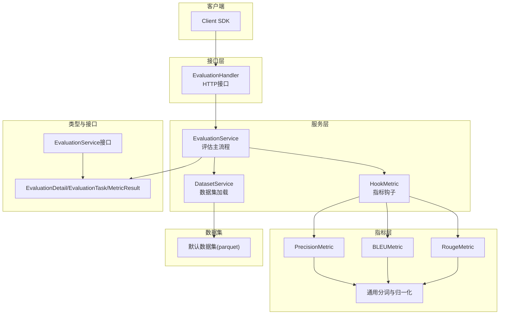
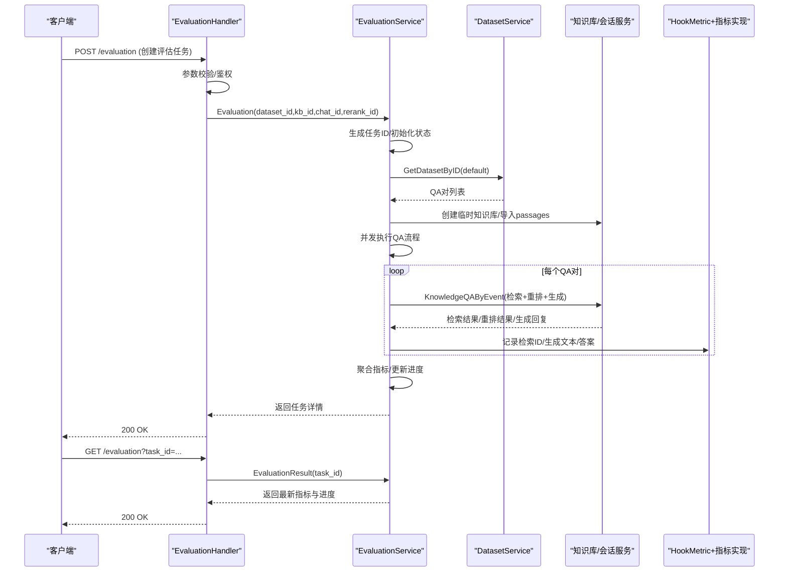
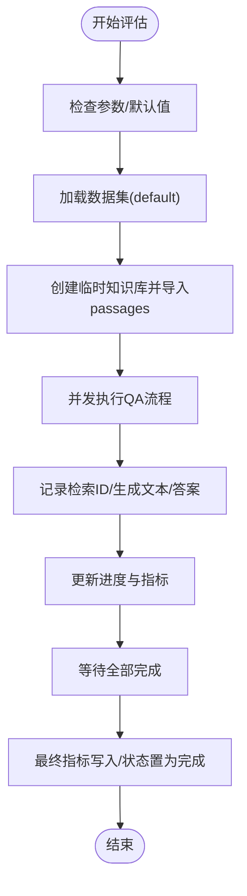
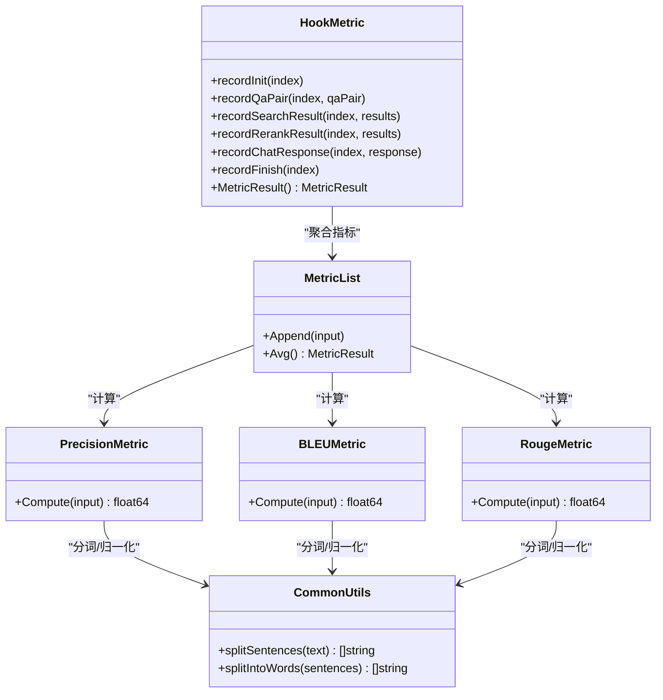
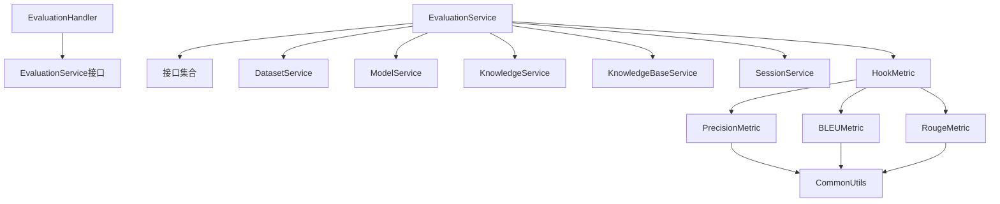

# 评估测试API

<cite>
**本文档引用的文件**
- [internal/handler/evaluation.go](file://internal/handler/evaluation.go)
- [internal/application/service/evaluation.go](file://internal/application/service/evaluation.go)
- [internal/application/service/metric_hook.go](file://internal/application/service/metric_hook.go)
- [internal/application/service/metric/precision.go](file://internal/application/service/metric/precision.go)
- [internal/application/service/metric/bleu.go](file://internal/application/service/metric/bleu.go)
- [internal/application/service/metric/rouge.go](file://internal/application/service/metric/rouge.go)
- [internal/application/service/metric/common.go](file://internal/application/service/metric/common.go)
- [internal/types/evaluation.go](file://internal/types/evaluation.go)
- [internal/types/interfaces/evaluation.go](file://internal/types/interfaces/evaluation.go)
- [internal/application/service/dataset.go](file://internal/application/service/dataset.go)
- [client/evaluation.go](file://client/evaluation.go)
- [docs/api/evaluation.md](file://docs/api/evaluation.md)
- [dataset/qa_dataset.py](file://dataset/qa_dataset.py)
- [dataset/README_zh.md](file://dataset/README_zh.md)
</cite>

## 目录
1. [简介](#简介)
2. [项目结构](#项目结构)
3. [核心组件](#核心组件)
4. [架构总览](#架构总览)
5. [详细组件分析](#详细组件分析)
6. [依赖关系分析](#依赖关系分析)
7. [性能考虑](#性能考虑)
8. [故障排查指南](#故障排查指南)
9. [结论](#结论)
10. [附录](#附录)

## 简介
本文件面向WiseDx平台的评估测试API，系统化梳理问答质量评估、模型性能测试与检索效果分析的接口设计与实现。文档覆盖以下关键能力：
- 评估任务的创建、查询与状态管理
- 评估数据集准备与加载（默认官方测试数据集）
- 评估指标计算（检索精度、召回、NDCG、MRR、MAP；生成质量BLEU、ROUGE）
- 结果统计与聚合
- 评估任务的调度、执行、并发控制与进度更新
- 评估数据的存储与版本化管理建议
- 评估结果的对比分析、趋势跟踪与优化建议

同时，文档明确区分自动评估与人工评估、A/B测试等不同评估模式的适用场景与扩展方向，并提供客户端SDK使用说明与常见问题排查指引。

## 项目结构
评估相关模块主要分布在以下层次：
- Handler层：HTTP接口定义与请求解析，负责鉴权、参数校验与响应封装
- Service层：评估业务逻辑，包括数据集加载、知识库构建、会话检索与重排、指标计算与聚合
- Metric层：各类评估指标的具体实现（精确率、召回、BLEU、ROUGE等）
- Types层：评估任务、指标、状态等数据结构定义
- Dataset层：默认数据集加载与统计
- Client层：评估API的客户端SDK封装
- Docs层：评估API的接口文档

图表来源
- [internal/handler/evaluation.go](file://internal/handler/evaluation.go#L1-L132)
- [internal/application/service/evaluation.go](file://internal/application/service/evaluation.go#L1-L475)
- [internal/application/service/metric_hook.go](file://internal/application/service/metric_hook.go#L1-L167)
- [internal/application/service/metric/precision.go](file://internal/application/service/metric/precision.go#L1-L34)
- [internal/application/service/metric/bleu.go](file://internal/application/service/metric/bleu.go#L1-L166)
- [internal/application/service/metric/rouge.go](file://internal/application/service/metric/rouge.go#L1-L73)
- [internal/application/service/metric/common.go](file://internal/application/service/metric/common.go#L1-L134)
- [internal/types/evaluation.go](file://internal/types/evaluation.go#L1-L100)
- [internal/types/interfaces/evaluation.go](file://internal/types/interfaces/evaluation.go#L1-L35)
- [internal/application/service/dataset.go](file://internal/application/service/dataset.go#L1-L244)
- [client/evaluation.go](file://client/evaluation.go#L1-L114)

章节来源
- [internal/handler/evaluation.go](file://internal/handler/evaluation.go#L1-L132)
- [internal/application/service/evaluation.go](file://internal/application/service/evaluation.go#L1-L475)
- [internal/application/service/metric_hook.go](file://internal/application/service/metric_hook.go#L1-L167)
- [internal/application/service/dataset.go](file://internal/application/service/dataset.go#L1-L244)
- [client/evaluation.go](file://client/evaluation.go#L1-L114)

## 核心组件
- 评估处理器（EvaluationHandler）：接收HTTP请求，绑定参数，调用服务层执行评估任务或查询结果
- 评估服务（EvaluationService）：创建评估任务、准备数据集、构建临时知识库、并发执行QA流程、计算并聚合指标
- 指标钩子（HookMetric）：按QA对收集检索结果、重排结果与生成回复，构造指标输入并计算平均指标
- 指标实现（Precision/BLEU/ROUGE）：基于通用分词与归一化函数，计算检索与生成质量指标
- 数据集服务（DatasetService）：默认加载parquet格式的queries、corpus、qrels、qas、answers
- 类型与接口（types/interfaces）：统一的数据结构与接口契约，保证多租户隔离与扩展性
- 客户端SDK（client/evaluation.go）：封装评估任务创建与结果查询的REST调用

章节来源
- [internal/handler/evaluation.go](file://internal/handler/evaluation.go#L1-L132)
- [internal/application/service/evaluation.go](file://internal/application/service/evaluation.go#L1-L475)
- [internal/application/service/metric_hook.go](file://internal/application/service/metric_hook.go#L1-L167)
- [internal/application/service/metric/precision.go](file://internal/application/service/metric/precision.go#L1-L34)
- [internal/application/service/metric/bleu.go](file://internal/application/service/metric/bleu.go#L1-L166)
- [internal/application/service/metric/rouge.go](file://internal/application/service/metric/rouge.go#L1-L73)
- [internal/application/service/metric/common.go](file://internal/application/service/metric/common.go#L1-L134)
- [internal/types/evaluation.go](file://internal/types/evaluation.go#L1-L100)
- [internal/types/interfaces/evaluation.go](file://internal/types/interfaces/evaluation.go#L1-L35)
- [internal/application/service/dataset.go](file://internal/application/service/dataset.go#L1-L244)
- [client/evaluation.go](file://client/evaluation.go#L1-L114)

## 架构总览
评估API采用“接口-服务-指标-数据集”的分层架构，结合并发与内存存储实现高效评估：

图表来源
- [internal/handler/evaluation.go](file://internal/handler/evaluation.go#L44-L131)
- [internal/application/service/evaluation.go](file://internal/application/service/evaluation.go#L128-L454)
- [internal/application/service/metric_hook.go](file://internal/application/service/metric_hook.go#L108-L166)
- [internal/application/service/dataset.go](file://internal/application/service/dataset.go#L40-L51)

章节来源
- [internal/handler/evaluation.go](file://internal/handler/evaluation.go#L1-L132)
- [internal/application/service/evaluation.go](file://internal/application/service/evaluation.go#L1-L475)
- [internal/application/service/metric_hook.go](file://internal/application/service/metric_hook.go#L1-L167)
- [internal/application/service/dataset.go](file://internal/application/service/dataset.go#L1-L244)

## 详细组件分析

### 评估接口与HTTP处理
- POST /evaluation：创建评估任务，支持指定数据集ID、知识库ID、对话模型ID、重排模型ID
- GET /evaluation：根据任务ID查询评估结果，返回任务状态、参数与指标

请求参数与响应结构详见接口文档。

章节来源
- [docs/api/evaluation.md](file://docs/api/evaluation.md#L1-L155)
- [internal/handler/evaluation.go](file://internal/handler/evaluation.go#L24-L131)

### 评估服务与任务生命周期
- 任务创建：生成唯一任务ID，初始化状态为“等待”，写入内存存储
- 默认参数：若未提供知识库ID则创建临时知识库；若未提供模型ID则使用默认模型
- 数据集加载：默认使用“default”数据集，读取queries、corpus、qrels、qas、answers
- 并发执行：基于errgroup限制并发worker数量，逐条QA对执行检索-重排-生成流程
- 进度与指标：每完成一条QA对，更新finished计数与指标平均值，持久化至内存存储

图表来源
- [internal/application/service/evaluation.go](file://internal/application/service/evaluation.go#L128-L454)
- [internal/application/service/dataset.go](file://internal/application/service/dataset.go#L40-L100)

章节来源
- [internal/application/service/evaluation.go](file://internal/application/service/evaluation.go#L128-L454)
- [internal/application/service/dataset.go](file://internal/application/service/dataset.go#L40-L100)

### 指标计算与聚合
- 检索指标：精确率、召回、NDCG@3、NDCG@10、MRR、MAP
- 生成指标：BLEU-1、BLEU-2、BLEU-4、ROUGE-1、ROUGE-2、ROUGE-L（F1）

指标实现依赖通用分词与句子切分函数，确保中英文混合文本的准确处理。

图表来源
- [internal/application/service/metric_hook.go](file://internal/application/service/metric_hook.go#L1-L167)
- [internal/application/service/metric/precision.go](file://internal/application/service/metric/precision.go#L1-L34)
- [internal/application/service/metric/bleu.go](file://internal/application/service/metric/bleu.go#L1-L166)
- [internal/application/service/metric/rouge.go](file://internal/application/service/metric/rouge.go#L1-L73)
- [internal/application/service/metric/common.go](file://internal/application/service/metric/common.go#L1-L134)

章节来源
- [internal/application/service/metric_hook.go](file://internal/application/service/metric_hook.go#L1-L167)
- [internal/application/service/metric/precision.go](file://internal/application/service/metric/precision.go#L1-L34)
- [internal/application/service/metric/bleu.go](file://internal/application/service/metric/bleu.go#L1-L166)
- [internal/application/service/metric/rouge.go](file://internal/application/service/metric/rouge.go#L1-L73)
- [internal/application/service/metric/common.go](file://internal/application/service/metric/common.go#L1-L134)

### 数据集准备与加载
- 默认数据集位于dataset/samples，包含queries.parquet、corpus.parquet、qrels.parquet、qas.parquet、answers.parquet
- DatasetService加载parquet文件，构建内存结构并迭代生成QAPair
- 提供采样与答案生成脚本，支持从大规模数据集（如MS MARCO）生成代表性样本与答案

章节来源
- [internal/application/service/dataset.go](file://internal/application/service/dataset.go#L40-L183)
- [dataset/qa_dataset.py](file://dataset/qa_dataset.py#L1-L382)
- [dataset/README_zh.md](file://dataset/README_zh.md#L1-L284)

### 客户端SDK使用
- StartEvaluation：创建评估任务，返回任务ID
- GetEvaluationResult：根据任务ID轮询获取评估结果，包含任务状态、进度、指标与统计数据

章节来源
- [client/evaluation.go](file://client/evaluation.go#L66-L113)
- [docs/api/evaluation.md](file://docs/api/evaluation.md#L1-L155)

## 依赖关系分析
评估模块内部依赖清晰，职责分离良好：
- Handler依赖EvaluationService接口，解耦具体实现
- EvaluationService依赖DatasetService、KnowledgeBaseService、KnowledgeService、SessionService、ModelService
- HookMetric依赖各指标实现与通用工具
- 类型与接口定义贯穿全链路，确保一致性与可扩展性

图表来源
- [internal/handler/evaluation.go](file://internal/handler/evaluation.go#L14-L22)
- [internal/application/service/evaluation.go](file://internal/application/service/evaluation.go#L27-L56)
- [internal/types/interfaces/evaluation.go](file://internal/types/interfaces/evaluation.go#L9-L35)
- [internal/application/service/metric_hook.go](file://internal/application/service/metric_hook.go#L18-L50)
- [internal/application/service/metric/common.go](file://internal/application/service/metric/common.go#L1-L134)

章节来源
- [internal/handler/evaluation.go](file://internal/handler/evaluation.go#L1-L132)
- [internal/application/service/evaluation.go](file://internal/application/service/evaluation.go#L1-L475)
- [internal/types/interfaces/evaluation.go](file://internal/types/interfaces/evaluation.go#L1-L35)
- [internal/application/service/metric_hook.go](file://internal/application/service/metric_hook.go#L1-L167)
- [internal/application/service/metric/common.go](file://internal/application/service/metric/common.go#L1-L134)

## 性能考虑
- 并发策略：使用errgroup限制worker数量，避免CPU与IO资源争用
- 内存存储：评估任务与中间指标暂存在内存，适合短期评估；长期需考虑持久化
- 指标计算：分词与归一化在指标计算前完成，减少重复开销
- 数据集规模：默认数据集为示例规模，实际评估应根据硬件资源调整并发与样本规模
- I/O优化：parquet文件读取已优化，建议保持数据文件压缩与分区策略

## 故障排查指南
- 请求参数错误：Handler在参数绑定失败时返回400，检查请求体字段与鉴权头
- 未授权访问：Handler从上下文提取租户ID失败时返回401
- 任务不存在：EvaluationResult查询不到任务返回错误
- 租户不匹配：跨租户查询被拒绝
- 模型缺失：未提供默认模型时创建评估任务失败
- 数据集加载异常：DatasetService读取parquet失败或字段不匹配
- 指标计算异常：指标实现依赖分词与归一化，确保文本编码与分词库可用

章节来源
- [internal/handler/evaluation.go](file://internal/handler/evaluation.go#L44-L131)
- [internal/application/service/evaluation.go](file://internal/application/service/evaluation.go#L102-L126)
- [internal/application/service/dataset.go](file://internal/application/service/dataset.go#L40-L51)

## 结论
WiseDx评估测试API提供了完整的自动评估能力，涵盖检索与生成质量的多维指标，支持并发执行与进度追踪。通过默认数据集与客户端SDK，用户可以快速开展模型性能测试与对比分析。建议在生产环境中引入持久化存储、版本化数据管理与隐私保护机制，并结合A/B测试框架进行持续优化与回归验证。

## 附录

### 评估模式与扩展建议
- 自动评估：通过默认数据集与API自动执行，适合批量模型对比与回归测试
- 人工评估：可扩展接口以支持人工标注与评分，结合自动化指标进行交叉验证
- A/B测试：在Handler与Service层增加实验组/对照组标识，记录差异显著性与置信区间

### 评估数据存储与版本管理
- 数据集版本：建议在dataset/samples下按日期/版本号维护目录，配合Git或对象存储进行版本追踪
- 评估结果归档：将每次评估的任务ID、参数、指标与日志归档至持久化存储，便于回溯与对比
- 隐私保护：对评估数据中的敏感信息进行脱敏处理，遵循最小化原则与合规要求

### 评估结果对比与趋势跟踪
- 指标面板：基于评估结果生成可视化图表，展示检索与生成指标随时间的变化趋势
- 回归检测：设定阈值与告警规则，当指标下降超过阈值时触发通知
- 优化建议：结合指标分布与错误案例，定位检索与生成环节的薄弱点，指导模型与参数优化