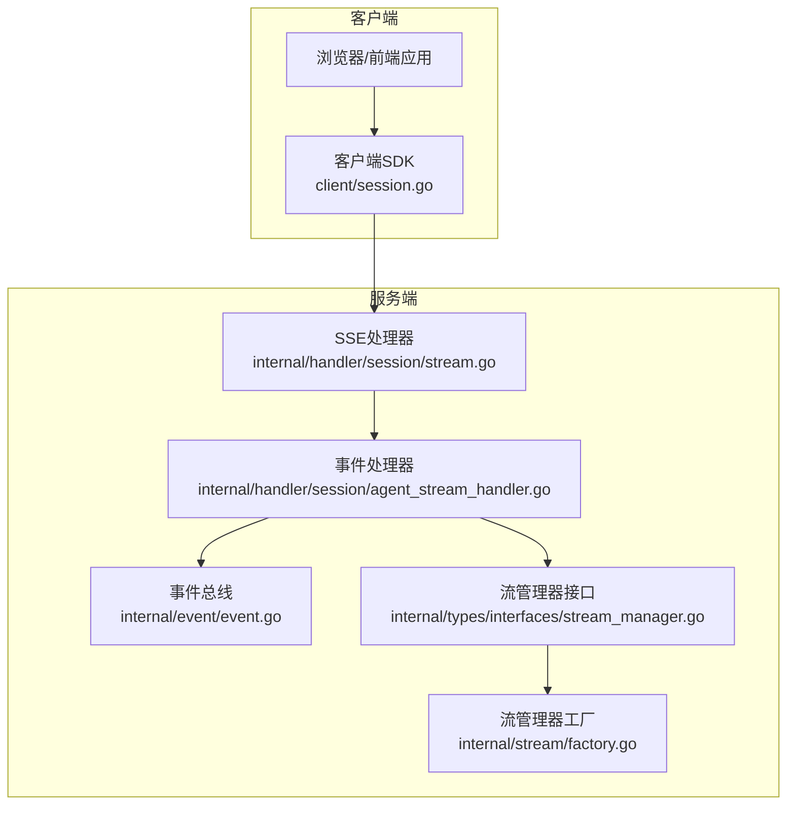
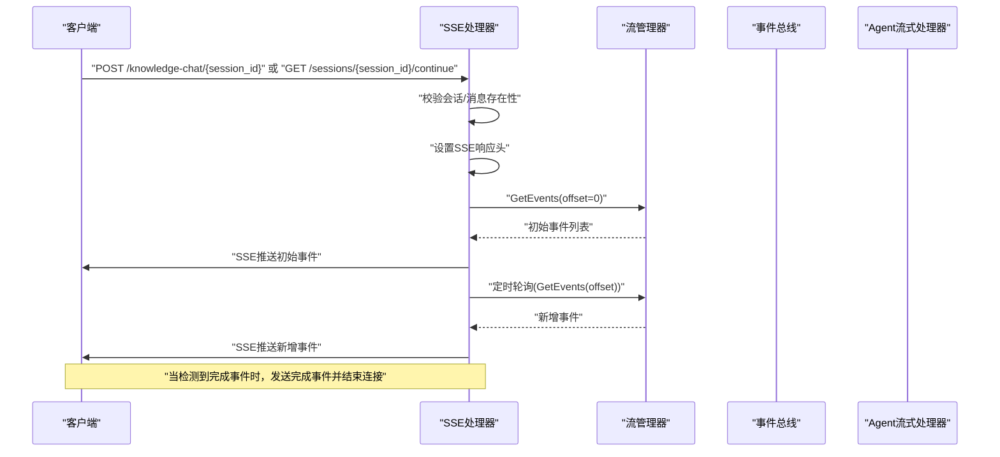
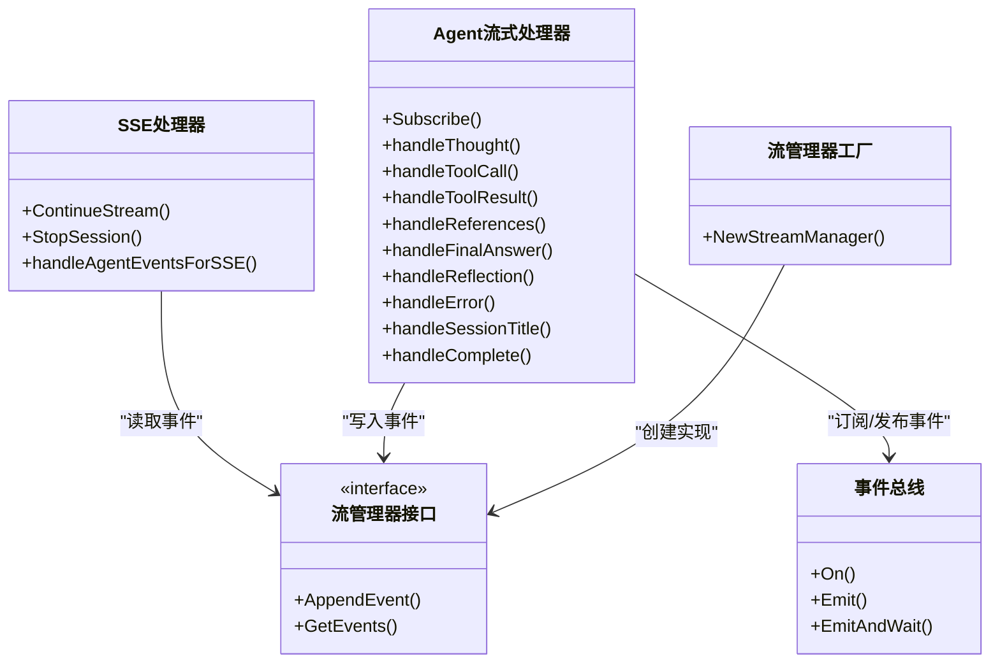

# WebSocket实时通信

<cite>
**本文档引用的文件**
- [internal/handler/session/stream.go](file://internal/handler/session/stream.go)
- [internal/handler/session/agent_stream_handler.go](file://internal/handler/session/agent_stream_handler.go)
- [internal/types/interfaces/stream_manager.go](file://internal/types/interfaces/stream_manager.go)
- [internal/stream/factory.go](file://internal/stream/factory.go)
- [internal/event/event.go](file://internal/event/event.go)
- [client/session.go](file://client/session.go)
- [client/client.go](file://client/client.go)
- [internal/application/service/chat_pipline/chat_completion_stream.go](file://internal/application/service/chat_pipline/chat_completion_stream.go)
- [internal/types/session.go](file://internal/types/session.go)
- [docs/api/README.md](file://docs/api/README.md)
</cite>

## 目录
1. [简介](#简介)
2. [项目结构](#项目结构)
3. [核心组件](#核心组件)
4. [架构总览](#架构总览)
5. [详细组件分析](#详细组件分析)
6. [依赖关系分析](#依赖关系分析)
7. [性能考虑](#性能考虑)
8. [故障排除指南](#故障排除指南)
9. [结论](#结论)

## 简介
本文件系统性梳理 WiseDx 的 WebSocket 实时通信接口，重点覆盖以下方面：
- 流式响应的连接建立流程（SSE 协议、认证机制）
- 消息格式与数据帧结构（文本流、JSON 事件、二进制数据）
- 会话管理与连接生命周期
- 客户端连接示例与消息处理代码路径
- 错误恢复与重连策略
- 性能监控指标与连接限制
- 调试工具与故障排除方法

注意：根据仓库代码分析，WiseDx 使用的是 Server-Sent Events（SSE）而非传统 WebSocket。SSE 是单向服务器推送的 HTTP 扩展，适合本项目“服务端持续推送流式事件”的场景。

## 项目结构
围绕 WebSocket/SSE 实时通信的关键目录与文件：
- 内部处理器：负责 SSE 连接建立、事件拉取与推送
- 事件总线：驱动 Agent 流式事件的产生与分发
- 流管理器：以事件为单位的增量存储与读取
- 客户端 SDK：封装 SSE 连接、解析与回调处理

图表来源
- [internal/handler/session/stream.go](file://internal/handler/session/stream.go#L31-L176)
- [internal/handler/session/agent_stream_handler.go](file://internal/handler/session/agent_stream_handler.go#L15-L54)
- [internal/types/interfaces/stream_manager.go](file://internal/types/interfaces/stream_manager.go#L20-L32)
- [internal/stream/factory.go](file://internal/stream/factory.go#L17-L36)
- [internal/event/event.go](file://internal/event/event.go#L83-L104)

章节来源
- [internal/handler/session/stream.go](file://internal/handler/session/stream.go#L1-L176)
- [internal/handler/session/agent_stream_handler.go](file://internal/handler/session/agent_stream_handler.go#L1-L54)
- [internal/types/interfaces/stream_manager.go](file://internal/types/interfaces/stream_manager.go#L1-L33)
- [internal/stream/factory.go](file://internal/stream/factory.go#L1-L37)
- [internal/event/event.go](file://internal/event/event.go#L1-L104)

## 核心组件
- SSE 处理器：负责建立 SSE 连接、设置响应头、拉取事件并推送
- Agent 流式处理器：订阅事件总线，将各类事件转换为流式事件并写入流管理器
- 事件总线：发布/订阅各类 Agent 流式事件（思考、工具调用、工具结果、最终答案等）
- 流管理器接口：抽象事件追加与增量读取能力，支持内存/Redis 实现
- 客户端 SDK：封装 SSE 连接、事件解析与回调处理

章节来源
- [internal/handler/session/stream.go](file://internal/handler/session/stream.go#L31-L176)
- [internal/handler/session/agent_stream_handler.go](file://internal/handler/session/agent_stream_handler.go#L15-L54)
- [internal/event/event.go](file://internal/event/event.go#L83-L104)
- [internal/types/interfaces/stream_manager.go](file://internal/types/interfaces/stream_manager.go#L20-L32)
- [internal/stream/factory.go](file://internal/stream/factory.go#L17-L36)

## 架构总览
SSE 实时通信的整体流程如下：

图表来源
- [internal/handler/session/stream.go](file://internal/handler/session/stream.go#L31-L176)
- [internal/handler/session/agent_stream_handler.go](file://internal/handler/session/agent_stream_handler.go#L296-L440)
- [internal/types/interfaces/stream_manager.go](file://internal/types/interfaces/stream_manager.go#L28-L31)

## 详细组件分析

### SSE 连接与握手
- 连接入口
  - 知识问答流式接口：POST /api/v1/knowledge-chat/{session_id}
  - 续传接口：GET /api/v1/sessions/{session_id}/continue?message_id={message_id}
- 握手与认证
  - SSE 处理器在处理请求前进行会话与消息存在性校验
  - 认证采用 Bearer Token 与 X-API-Key 双重安全头（Swagger 文档标注）
- 响应头设置
  - 设置 Content-Type 为 text/event-stream
  - 设置缓存控制与长连接相关头（由框架自动处理）

章节来源
- [internal/handler/session/stream.go](file://internal/handler/session/stream.go#L18-L30)
- [docs/api/README.md](file://docs/api/README.md#L21-L33)

### 事件模型与数据帧结构
- 事件类型
  - 思考过程：thinking
  - 工具调用：tool_call
  - 工具结果：tool_result
  - 引用列表：references
  - 反思：reflection
  - 最终答案：answer
  - 会话标题：session_title
  - 完成标记：complete
  - 停止信号：stop
- 数据帧字段
  - id：事件唯一标识
  - response_type：响应类型（answer/thinking/tool_call/tool_result/references/reflection/session_title/agent_query/complete/error）
  - content：当前片段内容
  - done：是否为该事件的最后一段
  - knowledge_references：知识引用列表（可选）
  - session_id/assistant_message_id：上下文关联（可选）
  - tool_calls：部分工具调用（可选）
  - data：附加元数据（如耗时、工具名、参数、错误信息等）

章节来源
- [client/session.go](file://client/session.go#L207-L233)
- [internal/event/event.go](file://internal/event/event.go#L14-L68)
- [internal/handler/session/agent_stream_handler.go](file://internal/handler/session/agent_stream_handler.go#L105-L114)

### 会话管理与连接生命周期
- 生命周期阶段
  - 初始化：创建会话、发起问答请求
  - 事件产生：Agent 执行过程中通过事件总线发布各类事件
  - 流式推送：SSE 处理器从流管理器拉取事件并推送
  - 完成：收到 complete 事件后，发送完成事件并关闭连接
  - 停止：用户可主动发送停止事件，触发停止逻辑
- 会话与消息
  - 会话（Session）：对话容器，包含租户归属、标题等
  - 消息（Message）：问答中的用户/助手消息，支持知识引用与步骤记录

章节来源
- [internal/types/session.go](file://internal/types/session.go#L74-L108)
- [internal/handler/session/stream.go](file://internal/handler/session/stream.go#L178-L294)
- [internal/handler/session/agent_stream_handler.go](file://internal/handler/session/agent_stream_handler.go#L434-L484)

### 流管理器与事件持久化
- 设计原则
  - 追加式设计：所有事件通过 AppendEvent 追加到流末尾
  - 增量读取：通过 GetEvents(fromOffset) 以偏移量增量拉取
  - 存储实现：内存/Redis 两种实现，可通过环境变量切换
- Redis 实现要点
  - 使用列表结构（RPush/LRange）保证 O(1) 追加与 O(k) 读取
  - 支持 TTL 控制，默认 1 小时，避免无限增长

章节来源
- [internal/types/interfaces/stream_manager.go](file://internal/types/interfaces/stream_manager.go#L20-L32)
- [internal/stream/factory.go](file://internal/stream/factory.go#L17-L36)

### 事件总线与 Agent 流式处理
- 事件总线
  - 支持同步/异步两种模式
  - 提供 On/Off/Emit/EmitAndWait 等核心方法
- Agent 流式处理器
  - 订阅思考、工具调用、工具结果、最终答案、反思、引用、完成、错误、会话标题等事件
  - 将事件转换为流式事件并写入流管理器
  - 对工具调用/结果计算耗时，对最终答案进行累积

章节来源
- [internal/event/event.go](file://internal/event/event.go#L83-L160)
- [internal/handler/session/agent_stream_handler.go](file://internal/handler/session/agent_stream_handler.go#L56-L69)

### 客户端连接示例与消息处理
- 客户端 SDK
  - KnowledgeQAStream：发起知识问答流式请求，解析 SSE 事件并回调处理
  - ContinueStream：续传已有会话的流式事件
  - StopSession：向服务端发送停止信号
- 消息处理流程
  - 建立 SSE 连接后，逐条读取 event 与 data 行
  - 解析为 StreamResponse 结构，按 response_type 分类处理
  - 当 done=true 且 response_type=complete 时，认为流结束

章节来源
- [client/session.go](file://client/session.go#L235-L313)
- [client/session.go](file://client/session.go#L315-L379)
- [client/session.go](file://client/session.go#L381-L404)

### 错误恢复与重连策略
- 连接中断
  - SSE 处理器内部使用 ticker 定期轮询，若客户端断开则优雅退出
  - 客户端侧应监听连接断开事件并触发重连
- 停止与异常
  - 用户可主动调用 StopSession 发送停止事件
  - 服务端在检测到 stop 事件时，通过事件总线触发上下文取消并返回停止通知
- 重连建议
  - 基于 message_id 调用续传接口继续接收事件
  - 建议指数退避策略与最大重试次数

章节来源
- [internal/handler/session/stream.go](file://internal/handler/session/stream.go#L138-L175)
- [internal/handler/session/stream.go](file://internal/handler/session/stream.go#L315-L363)
- [client/session.go](file://client/session.go#L381-L404)

### 性能监控指标与连接限制
- 指标建议
  - 事件延迟：从事件产生到 SSE 推送的时间
  - 事件吞吐：每秒事件数量
  - 连接存活时间：单次 SSE 连接的平均时长
  - 客户端断线率：连接中断频率
  - Redis 延迟：GetEvents 调用耗时
- 连接限制
  - SSE 为单向推送，无并发双向通道；可通过服务端限流与超时控制保护资源
  - Redis TTL 控制事件保留窗口，避免无限增长

章节来源
- [internal/stream/factory.go](file://internal/stream/factory.go#L25-L32)

## 依赖关系分析

图表来源
- [internal/handler/session/stream.go](file://internal/handler/session/stream.go#L31-L176)
- [internal/handler/session/agent_stream_handler.go](file://internal/handler/session/agent_stream_handler.go#L15-L54)
- [internal/event/event.go](file://internal/event/event.go#L83-L160)
- [internal/types/interfaces/stream_manager.go](file://internal/types/interfaces/stream_manager.go#L20-L32)
- [internal/stream/factory.go](file://internal/stream/factory.go#L17-L36)

## 性能考虑
- 事件粒度
  - 将长文本拆分为多个小片段推送，降低单次推送负载
- 轮询间隔
  - SSE 处理器使用 100ms ticker 轮询，平衡实时性与 CPU 占用
- 存储选择
  - 内存实现适合单实例部署；Redis 实现适合分布式与高可用
- 缓存与压缩
  - 对重复引用与元数据进行去重与压缩，减少传输体积

## 故障排除指南
- 常见问题
  - 401/403：检查 X-API-Key 与 Bearer Token 是否正确设置
  - 404：确认 session_id/message_id 是否有效
  - 连接过早断开：检查客户端网络与超时设置
  - 事件丢失：确认使用 message_id 续传接口
- 调试建议
  - 在请求头添加 X-Request-ID，便于服务端日志定位
  - 客户端打印 SSE 的 event 与 data 行，核对 response_type 与 done 字段
  - 观察 complete 事件是否到达，判断流是否正常结束

章节来源
- [docs/api/README.md](file://docs/api/README.md#L21-L33)
- [client/session.go](file://client/session.go#L261-L313)

## 结论
WiseDx 的实时通信基于 SSE 实现，通过事件总线与流管理器解耦事件产生与推送，具备良好的扩展性与可观测性。生产环境中建议结合 Redis 实现、合理的重连策略与监控指标，确保稳定性与性能。