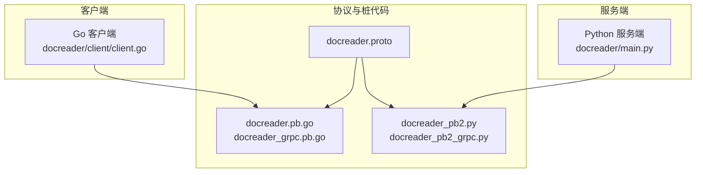
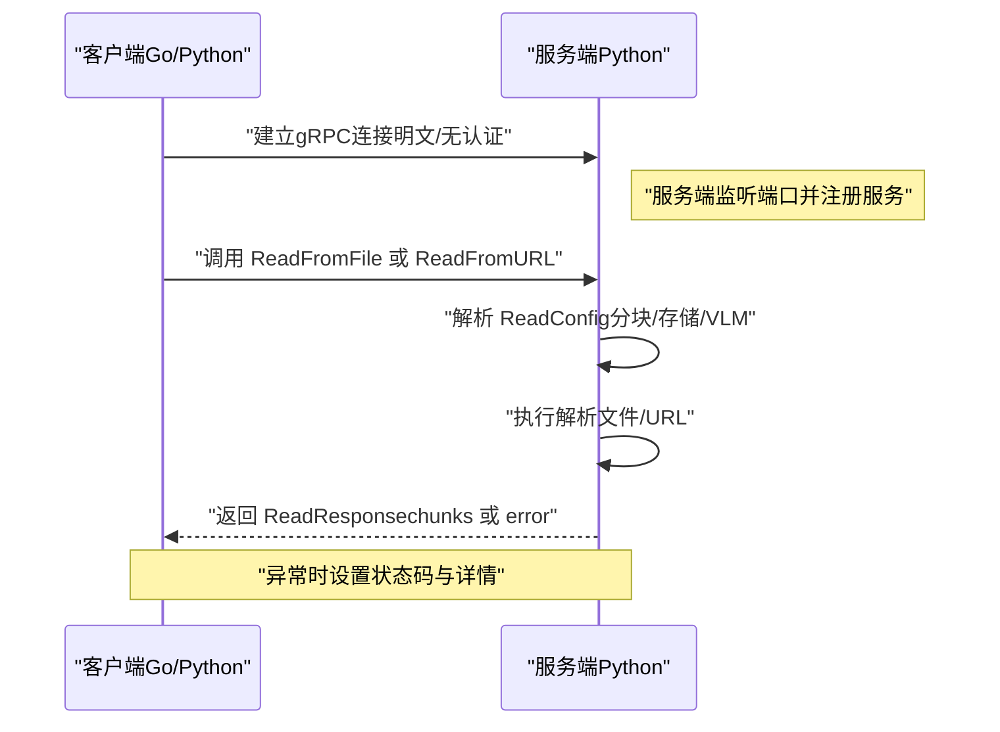
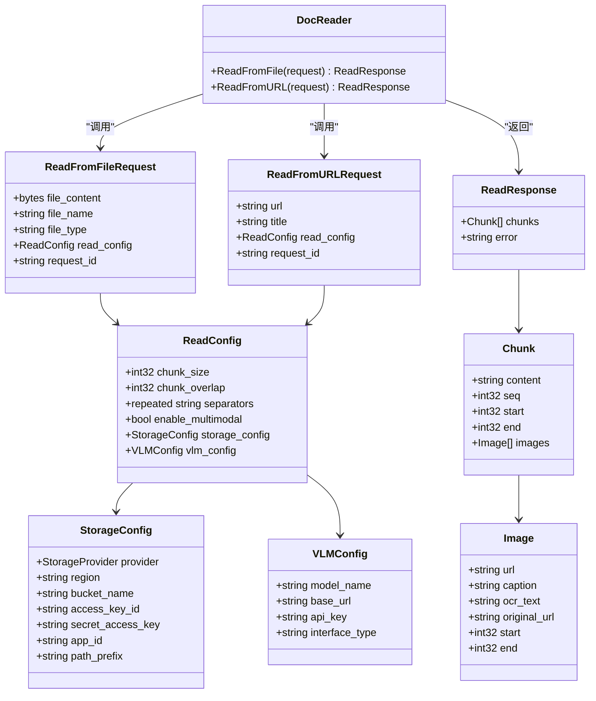
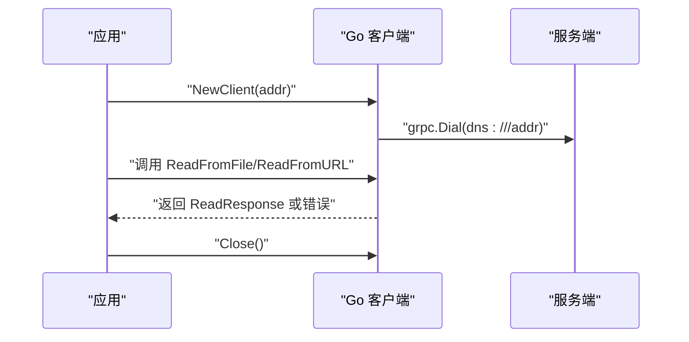
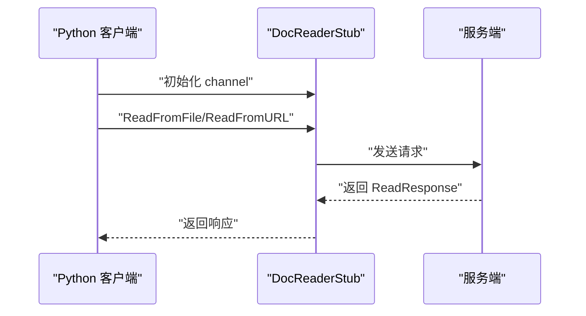
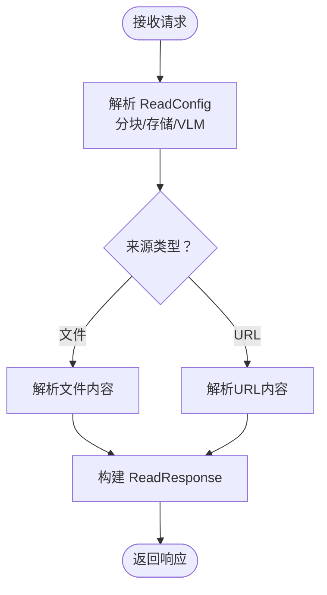
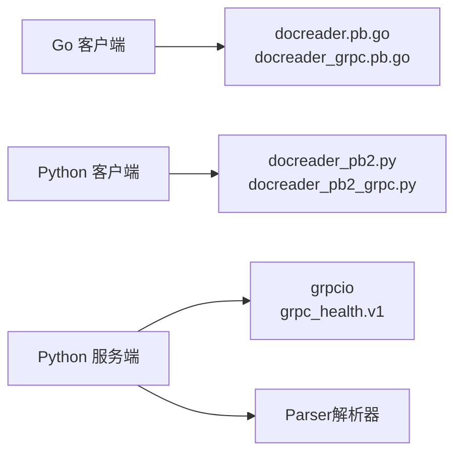

# gRPC接口

<cite>
**本文引用的文件**
- [docreader.proto](file://docreader/proto/docreader.proto)
- [docreader_grpc.pb.go](file://docreader/proto/docreader_grpc.pb.go)
- [docreader.pb.go](file://docreader/proto/docreader.pb.go)
- [docreader_pb2_grpc.py](file://docreader/proto/docreader_pb2_grpc.py)
- [docreader_pb2.py](file://docreader/proto/docreader_pb2.py)
- [client.go（Go）](file://docreader/client/client.go)
- [main.go（Python服务端）](file://docreader/main.py)
- [pyproject.toml](file://docreader/pyproject.toml)
- [README.md（docreader模块）](file://docreader/README.md)
- [go.mod](file://go.mod)
- [cmd/server/main.go](file://cmd/server/main.go)
</cite>

## 目录
1. [简介](#简介)
2. [项目结构](#项目结构)
3. [核心组件](#核心组件)
4. [架构总览](#架构总览)
5. [详细组件分析](#详细组件分析)
6. [依赖关系分析](#依赖关系分析)
7. [性能考量](#性能考量)
8. [故障排查指南](#故障排查指南)
9. [结论](#结论)
10. [附录](#附录)

## 简介
本文件面向WiseDx的文档解析服务（DocReader）gRPC接口，提供完整的协议定义、客户端使用方法、错误处理与状态码说明、性能优化建议以及版本与兼容性策略。当前仓库中，gRPC接口由Protocol Buffers定义，并分别生成了Go与Python的客户端与服务端桩代码。接口能力覆盖“从文件读取”和“从URL读取”，并支持多模态（图像/OCR/VLM）与对象存储配置。

## 项目结构
围绕gRPC接口的关键文件组织如下：
- 协议定义：docreader/proto/docreader.proto
- Go桩代码：docreader/proto/docreader_grpc.pb.go、docreader/proto/docreader.pb.go
- Python桩代码：docreader/proto/docreader_pb2_grpc.py、docreader/proto/docreader_pb2.py
- Go客户端：docreader/client/client.go
- Python服务端：docreader/main.py
- Python依赖与版本：docreader/pyproject.toml
- 文档与配置参考：docreader/README.md
- 服务入口与容器：cmd/server/main.go、go.mod

图表来源
- [docreader.proto](file://docreader/proto/docreader.proto#L1-L89)
- [docreader_grpc.pb.go](file://docreader/proto/docreader_grpc.pb.go#L102-L129)
- [docreader.pb.go](file://docreader/proto/docreader.pb.go#L741-L819)
- [docreader_pb2_grpc.py](file://docreader/proto/docreader_pb2_grpc.py#L28-L91)
- [docreader_pb2.py](file://docreader/proto/docreader_pb2.py#L1-L56)
- [client.go（Go）](file://docreader/client/client.go#L47-L76)
- [main.go（Python服务端）](file://docreader/main.py#L276-L315)

章节来源
- [docreader.proto](file://docreader/proto/docreader.proto#L1-L89)
- [docreader_grpc.pb.go](file://docreader/proto/docreader_grpc.pb.go#L102-L129)
- [docreader.pb.go](file://docreader/proto/docreader.pb.go#L741-L819)
- [docreader_pb2_grpc.py](file://docreader/proto/docreader_pb2_grpc.py#L28-L91)
- [docreader_pb2.py](file://docreader/proto/docreader_pb2.py#L1-L56)
- [client.go（Go）](file://docreader/client/client.go#L47-L76)
- [main.go（Python服务端）](file://docreader/main.py#L276-L315)

## 核心组件
- 服务接口：DocReader
  - 方法一：ReadFromFile（从文件读取）
  - 方法二：ReadFromURL（从URL读取）
- 请求消息：
  - ReadFromFileRequest：包含文件内容、文件名、文件类型、读取配置、请求ID
  - ReadFromURLRequest：包含URL、标题、读取配置、请求ID
- 读取配置：ReadConfig
  - 分块参数：chunk_size、chunk_overlap、separators
  - 多模态开关：enable_multimodal
  - 对象存储配置：StorageConfig（provider、region、bucket_name、access_key_id、secret_access_key、app_id、path_prefix）
  - VLM配置：VLMConfig（model_name、base_url、api_key、interface_type）
- 响应消息：ReadResponse
  - 字段：chunks（Chunk列表）、error（字符串）
- 数据模型：
  - Chunk：content、seq、start、end、images（Image列表）
  - Image：url、caption、ocr_text、original_url、start、end
  - StorageProvider：枚举值（UNSPECIFIED、COS、MINIO）

章节来源
- [docreader.proto](file://docreader/proto/docreader.proto#L7-L89)

## 架构总览
下图展示gRPC客户端与服务端的交互流程，涵盖连接建立、认证方式、调用过程与错误返回。

图表来源
- [client.go（Go）](file://docreader/client/client.go#L47-L76)
- [main.go（Python服务端）](file://docreader/main.py#L130-L241)
- [docreader_pb2_grpc.py](file://docreader/proto/docreader_pb2_grpc.py#L28-L91)

## 详细组件分析

### Protocol Buffers 定义与消息模型
- 服务与方法
  - DocReader 服务包含两个方法：ReadFromFile、ReadFromURL
- 关键消息
  - ReadConfig：分块策略、多模态开关、存储与VLM配置
  - StorageConfig：兼容COS与MinIO/S3
  - VLMConfig：模型名、基础URL、API Key、接口类型
  - ReadFromFileRequest/ReadFromURLRequest：携带请求ID便于追踪
  - ReadResponse：返回分块结果或错误信息
  - Chunk/Image：文档分块与其中的图片元数据

图表来源
- [docreader.proto](file://docreader/proto/docreader.proto#L7-L89)

章节来源
- [docreader.proto](file://docreader/proto/docreader.proto#L7-L89)

### Go 客户端使用
- 连接建立
  - 通过 NewClient(addr) 创建客户端，内部使用明文凭证与DNS解析方案
  - 默认启用轮询负载均衡策略，并根据环境变量设置最大消息大小
- 调用示例
  - 通过 proto 包中的 DocReaderClient 调用 ReadFromFile/ReadFromURL
  - 可通过 SetDebug 控制调试日志
- 资源管理
  - Close() 关闭底层连接

图表来源
- [client.go（Go）](file://docreader/client/client.go#L47-L76)
- [docreader_grpc.pb.go](file://docreader/proto/docreader_grpc.pb.go#L102-L129)

章节来源
- [client.go（Go）](file://docreader/client/client.go#L47-L76)

### Python 客户端使用
- 生成与导入
  - 使用 grpcio-tools 生成桩代码，Python侧通过 docreader_pb2_grpc.DocReaderStub 调用
- 调用方式
  - 通过 channel.unary_unary 调用 ReadFromFile/ReadFromURL
- 版本兼容
  - 生成代码与grpc运行时版本需满足最低要求，否则抛出版本不匹配错误

图表来源
- [docreader_pb2_grpc.py](file://docreader/proto/docreader_pb2_grpc.py#L28-L91)
- [docreader_pb2_grpc.py](file://docreader/proto/docreader_pb2_grpc.py#L18-L25)

章节来源
- [docreader_pb2_grpc.py](file://docreader/proto/docreader_pb2_grpc.py#L28-L91)
- [docreader_pb2_grpc.py](file://docreader/proto/docreader_pb2_grpc.py#L18-L25)

### 服务端实现要点
- 服务注册
  - 通过 add_DocReaderServicer_to_server 注册 DocReaderServicer
  - 同时注册健康检查服务
- 方法实现
  - ReadFromFile：解析文件内容，按 ReadConfig 生成分块，返回 ReadResponse
  - ReadFromURL：解析URL内容，按 ReadConfig 生成分块，返回 ReadResponse
- 错误处理
  - 异常时设置 grpc.StatusCode.INTERNAL 并返回错误详情
- 配置项
  - 最大并发线程、最大消息长度等通过配置注入

图表来源
- [main.go（Python服务端）](file://docreader/main.py#L130-L241)
- [docreader_pb2_grpc.py](file://docreader/proto/docreader_pb2_grpc.py#L28-L91)

章节来源
- [main.go（Python服务端）](file://docreader/main.py#L130-L241)

### 流式RPC说明
- 当前协议定义与服务实现未提供双向流或服务端推送流式RPC
- 若需流式能力，可在现有协议基础上扩展服务方法（如 ReadFromFileStream），并在客户端/服务端分别生成与实现对应的流式桩代码

[本节为概念性说明，不直接分析具体文件，故不附加章节来源]

## 依赖关系分析
- Go客户端依赖
  - google.golang.org/grpc（含凭证与负载均衡）
  - 本地生成的 proto 包（docreader/proto）
- Python客户端依赖
  - grpcio、grpcio-health-checking、protobuf
  - 本地生成的 Python桩代码
- 服务端依赖
  - grpc、grpc_health.v1、Parser（文档解析器）
  - 配置项控制并发与消息大小

图表来源
- [client.go（Go）](file://docreader/client/client.go#L3-L14)
- [docreader_pb2_grpc.py](file://docreader/proto/docreader_pb2_grpc.py#L3-L4)
- [pyproject.toml](file://docreader/pyproject.toml#L13-L38)
- [main.go（Python服务端）](file://docreader/main.py#L10-L28)

章节来源
- [client.go（Go）](file://docreader/client/client.go#L3-L14)
- [docreader_pb2_grpc.py](file://docreader/proto/docreader_pb2_grpc.py#L3-L4)
- [pyproject.toml](file://docreader/pyproject.toml#L13-L38)
- [main.go（Python服务端）](file://docreader/main.py#L10-L28)

## 性能考量
- 最大消息大小
  - Go客户端与Python服务端均支持通过环境变量/配置设置最大消息大小，避免超大文档导致传输失败
- 并发与线程池
  - Python服务端通过 ThreadPoolExecutor 控制并发，合理设置最大工作线程数
- 负载均衡
  - Go客户端默认启用轮询策略，便于多实例部署时分摊压力
- 日志与追踪
  - 服务端支持请求ID上下文，便于跨组件追踪；建议生产环境开启文件日志与采样

[本节提供通用建议，不直接分析具体文件，故不附加章节来源]

## 故障排查指南
- 常见错误与状态码
  - INTERNAL（5）：服务内部异常（如解析失败、未知异常），服务端会设置错误详情
- 客户端常见问题
  - 连接失败：确认服务端地址、端口与网络可达；Go客户端默认使用明文凭证
  - 版本不匹配：Python客户端生成代码与grpc运行时版本需满足最低要求
- 诊断步骤
  - 启用客户端/服务端调试日志
  - 核对请求ID，结合服务端日志定位问题
  - 检查最大消息大小配置，确保未超过限制

章节来源
- [main.go（Python服务端）](file://docreader/main.py#L167-L191)
- [docreader_pb2_grpc.py](file://docreader/proto/docreader_pb2_grpc.py#L18-L25)
- [client.go（Go）](file://docreader/client/client.go#L47-L76)

## 结论
WiseDx的DocReader gRPC接口以清晰的消息模型与简洁的服务方法支撑文档解析任务。当前实现为同步Unary RPC，具备良好的可扩展性。建议在生产环境中完善认证、TLS与限流策略，并按需引入流式RPC与健康检查。版本与兼容性方面，严格遵循生成代码与运行时版本约束，确保稳定演进。

[本节为总结性内容，不直接分析具体文件，故不附加章节来源]

## 附录

### 协议与桩代码版本与兼容性
- 生成工具与运行时版本
  - Python桩代码生成依赖 grpcio-tools，运行时依赖 grpcio
  - 版本不匹配将触发错误提示，需升级或降级至兼容范围
- Go桩代码
  - 由 protoc 生成，Go客户端直接依赖生成包

章节来源
- [docreader_pb2_grpc.py](file://docreader/proto/docreader_pb2_grpc.py#L18-L25)
- [pyproject.toml](file://docreader/pyproject.toml#L13-L38)
- [docreader_grpc.pb.go](file://docreader/proto/docreader_grpc.pb.go#L102-L129)

### 服务端启动与容器化入口
- 服务端通过 gRPC server 启动，注册 DocReader 与健康检查服务
- 服务监听端口由配置决定，支持优雅停机与资源清理

章节来源
- [main.go（Python服务端）](file://docreader/main.py#L276-L315)
- [cmd/server/main.go](file://cmd/server/main.go#L124-L193)
- [go.mod](file://go.mod#L1-L20)