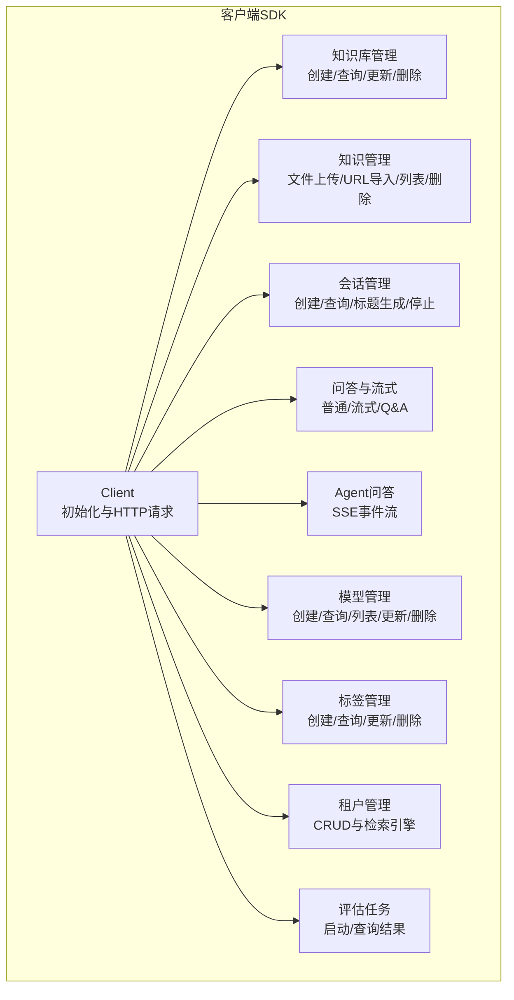
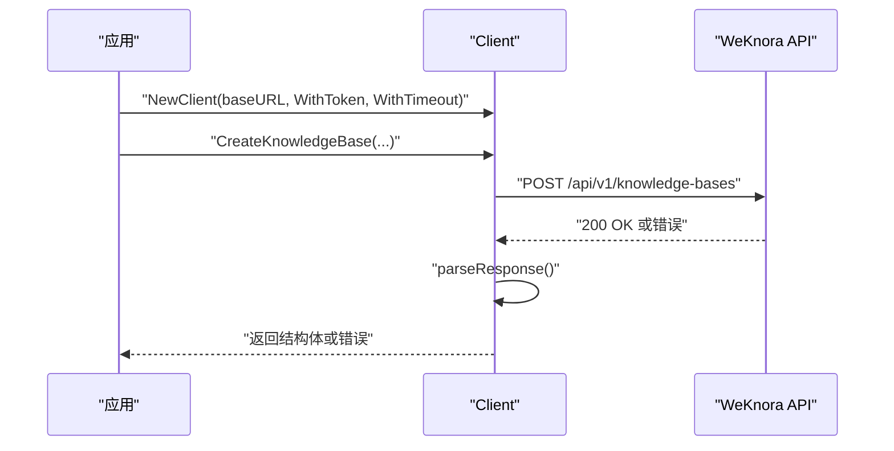
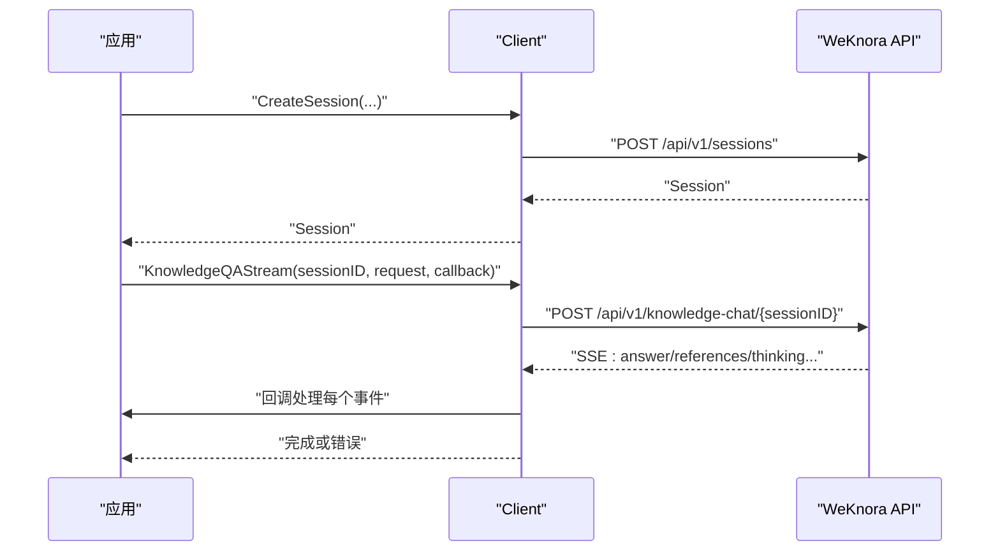
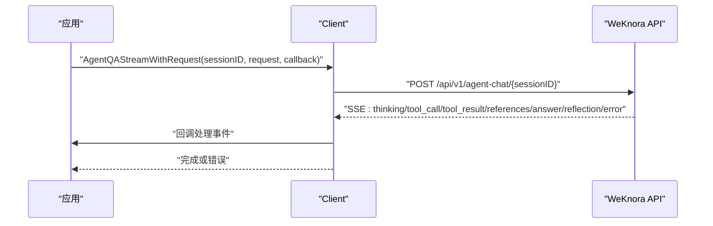
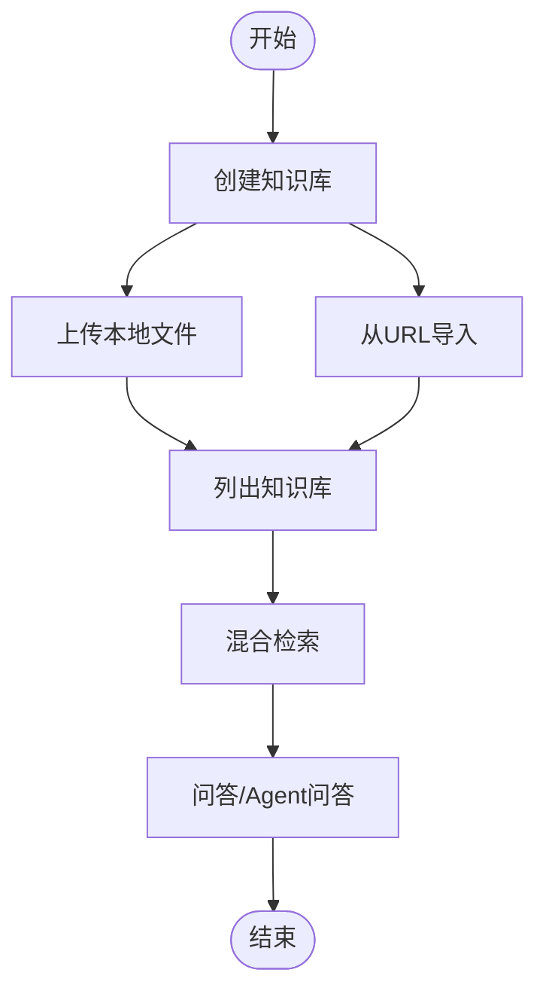
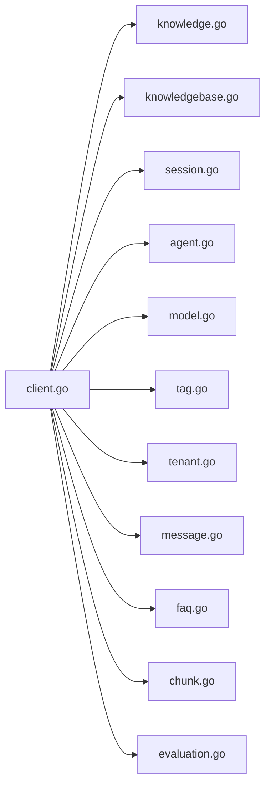

# 客户端SDK和集成

<cite>
**本文档引用的文件**
- [client.go](file://client/client.go)
- [example.go](file://client/example.go)
- [README.md](file://client/README.md)
- [knowledge.go](file://client/knowledge.go)
- [knowledgebase.go](file://client/knowledgebase.go)
- [session.go](file://client/session.go)
- [model.go](file://client/model.go)
- [message.go](file://client/message.go)
- [faq.go](file://client/faq.go)
- [chunk.go](file://client/chunk.go)
- [tag.go](file://client/tag.go)
- [tenant.go](file://client/tenant.go)
- [evaluation.go](file://client/evaluation.go)
- [agent.go](file://client/agent.go)
- [go.mod](file://client/go.mod)
</cite>

## 目录
1. [简介](#简介)
2. [项目结构](#项目结构)
3. [核心组件](#核心组件)
4. [架构总览](#架构总览)
5. [详细组件分析](#详细组件分析)
6. [依赖关系分析](#依赖关系分析)
7. [性能考量](#性能考量)
8. [故障排查指南](#故障排查指南)
9. [结论](#结论)
10. [附录](#附录)

## 简介
本文件为 WiseDx 客户端 SDK 的完整集成文档，面向 Go 语言使用者，覆盖安装配置、初始化与选项、认证、知识库与知识管理、问答与流式响应、Agent 智能问答、模型与标签管理、消息与会话管理、评估任务、错误处理与重试策略、常见使用场景与最佳实践，以及与其他语言客户端的对比与选择建议。SDK 提供了对 WeKnora 服务的 HTTP 接口封装，便于在应用中以声明式方式完成从知识入库到智能问答的全流程。

## 项目结构
客户端 SDK 位于 client 目录，采用按功能域划分的模块化组织方式，核心入口为 Client 类型及其方法族，围绕“知识库-知识-会话-问答-模型-标签-租户-评估”等维度提供统一的 Go 接口。

图表来源
- [client.go](file://client/client.go#L16-L54)
- [knowledgebase.go](file://client/knowledgebase.go#L170-L256)
- [knowledge.go](file://client/knowledge.go#L84-L385)
- [session.go](file://client/session.go#L69-L447)
- [model.go](file://client/model.go#L79-L155)
- [tag.go](file://client/tag.go#L76-L187)
- [tenant.go](file://client/tenant.go#L64-L140)
- [evaluation.go](file://client/evaluation.go#L66-L113)

章节来源
- [README.md](file://client/README.md#L1-L304)
- [go.mod](file://client/go.mod#L1-L4)

## 核心组件
- Client：SDK 的核心客户端，负责构造 HTTP 请求、设置认证头、超时、上下文请求 ID，并统一解析响应。
- 会话与问答：提供会话生命周期管理、普通问答与 SSE 流式问答、继续流、停止生成、知识检索等。
- 知识库与知识：支持知识库配置、混合检索、复制与进度查询；支持从本地文件或 URL 导入知识，批量查询、分页列出、删除与下载。
- Agent 问答：提供基于 SSE 的事件流，涵盖思考、工具调用、工具结果、引用、答案、反思与错误事件。
- 模型与标签：提供模型的增删改查与列表，标签的分页查询、创建、更新与删除。
- 租户与评估：租户的 CRUD 与检索引擎配置，评估任务的启动与结果查询。

章节来源
- [client.go](file://client/client.go#L16-L104)
- [session.go](file://client/session.go#L69-L447)
- [knowledgebase.go](file://client/knowledgebase.go#L170-L327)
- [knowledge.go](file://client/knowledge.go#L84-L385)
- [agent.go](file://client/agent.go#L64-L176)
- [model.go](file://client/model.go#L79-L155)
- [tag.go](file://client/tag.go#L76-L187)
- [tenant.go](file://client/tenant.go#L64-L140)
- [evaluation.go](file://client/evaluation.go#L66-L113)

## 架构总览
SDK 通过 Client 统一发起 HTTP 请求，内部封装 doRequest 与 parseResponse，支持：
- 认证：X-API-Key 头
- 超时：WithTimeout 选项
- 上下文：自动透传 RequestID
- 错误：非 2xx 状态码统一返回错误

图表来源
- [client.go](file://client/client.go#L40-L54)
- [client.go](file://client/client.go#L56-L88)
- [client.go](file://client/client.go#L90-L104)
- [knowledgebase.go](file://client/knowledgebase.go#L170-L182)

## 详细组件分析

### 初始化与配置
- 初始化：NewClient(baseURL, options...) 支持 WithToken 与 WithTimeout。
- 默认 HTTP 超时：30 秒。
- 认证头：X-API-Key。
- 请求 ID：若上下文携带 "RequestID"，自动写入 X-Request-ID。

章节来源
- [client.go](file://client/client.go#L26-L54)
- [client.go](file://client/client.go#L74-L87)

### 会话与问答
- 会话：创建、查询、更新、删除、分页查询、生成标题。
- 知识问答：普通问答与 SSE 流式问答，支持多 KB/知识过滤、Web 搜索开关、摘要模型覆盖、禁用自动生成标题。
- 继续流与停止：支持继续已有会话的流、按消息 ID 停止生成。
- 知识检索：不经过 LLM 的纯检索，返回匹配结果列表。

图表来源
- [session.go](file://client/session.go#L69-L82)
- [session.go](file://client/session.go#L235-L313)

章节来源
- [session.go](file://client/session.go#L69-L447)

### Agent 智能问答
- Agent 问答通过 SSE 返回多类事件：思考、工具调用、工具结果、引用、答案、反思、错误。
- 提供 AgentSession 包装器，简化会话内多次提问。
- 支持自定义 AgentQARequest，可指定 AgentID、知识库/知识集合、Web 搜索、摘要模型、@提及项等。

图表来源
- [agent.go](file://client/agent.go#L74-L99)
- [agent.go](file://client/agent.go#L101-L143)

章节来源
- [agent.go](file://client/agent.go#L23-L176)

### 知识库与知识
- 知识库：创建、查询、列表、更新、删除；支持混合检索、复制知识库与进度查询。
- 知识：从本地文件上传（multipart/form-data）、从 URL 导入、批量查询、分页列表、删除、下载文件；支持重复文件/URL检测返回特定错误。
- 图像信息更新：支持更新图片信息字段。

图表来源
- [knowledgebase.go](file://client/knowledgebase.go#L170-L327)
- [knowledge.go](file://client/knowledge.go#L84-L385)

章节来源
- [knowledgebase.go](file://client/knowledgebase.go#L14-L327)
- [knowledge.go](file://client/knowledge.go#L84-L385)

### 模型与标签
- 模型：创建、查询、列表、更新、删除，支持类型与来源枚举。
- 标签：分页查询、创建、更新（名称/颜色/排序）、删除（支持强制删除与仅删除内容），支持排除 ID。

章节来源
- [model.go](file://client/model.go#L79-L155)
- [tag.go](file://client/tag.go#L76-L187)

### 租户与评估
- 租户：创建、查询、更新、删除、列表，支持检索引擎配置。
- 评估：启动评估任务、查询评估结果，返回指标与统计。

章节来源
- [tenant.go](file://client/tenant.go#L64-L140)
- [evaluation.go](file://client/evaluation.go#L66-L113)

### 消息与会话管理
- 加载消息：支持限制数量与时间前筛选，支持“最近消息”与“某时刻之前”的查询。
- 删除消息：按会话与消息 ID 删除。

章节来源
- [message.go](file://client/message.go#L61-L119)

### FAQ 管理
- 支持分页列出、创建、更新、批量字段更新、批量标签更新、删除、混合检索、导出 CSV、异步导入进度查询与最后结果展示状态更新。

章节来源
- [faq.go](file://client/faq.go#L155-L468)

## 依赖关系分析
- 模块依赖：client 子包按功能拆分，彼此通过 Client 组合复用 doRequest/parseResponse。
- 外部依赖：标准库 net/http、bufio、encoding/json、time、context 等。
- 版本：go.mod 指定 Go 版本。

图表来源
- [client.go](file://client/client.go#L1-L14)
- [knowledge.go](file://client/knowledge.go#L1-L20)
- [knowledgebase.go](file://client/knowledgebase.go#L1-L12)
- [session.go](file://client/session.go#L1-L17)
- [agent.go](file://client/agent.go#L1-L13)
- [model.go](file://client/model.go#L1-L10)
- [tag.go](file://client/tag.go#L1-L10)
- [tenant.go](file://client/tenant.go#L1-L12)
- [message.go](file://client/message.go#L1-L13)
- [faq.go](file://client/faq.go#L1-L11)
- [chunk.go](file://client/chunk.go#L1-L12)
- [evaluation.go](file://client/evaluation.go#L1-L11)

章节来源
- [go.mod](file://client/go.mod#L1-L4)

## 性能考量
- 超时设置：通过 WithTimeout 控制全局 HTTP 超时，避免长时间阻塞。
- 流式处理：SSE 流式响应逐段解析，适合长文本与实时反馈。
- 并发与连接：SDK 内部使用标准 http.Client，默认连接池由 Go 运行时管理；如需定制连接池参数，可在应用层注入自定义 http.Client。
- 重试策略：SDK 未内置自动重试，建议在业务侧结合 context 超时与指数退避策略实现。

## 故障排查指南
- HTTP 错误：parseResponse 对非 2xx 状态码统一返回错误，包含响应体。
- 文件/URL 重复：上传知识时可能遇到重复文件或重复 URL 的冲突错误，需根据返回值区分处理。
- SSE 解析：流式回调中若 JSON 解析失败，会返回解析错误；检查事件格式与数据完整性。
- 超时与取消：确保上下文具备合理超时与取消信号，避免资源泄露。

章节来源
- [client.go](file://client/client.go#L90-L104)
- [knowledge.go](file://client/knowledge.go#L178-L188)
- [session.go](file://client/session.go#L267-L312)
- [agent.go](file://client/agent.go#L101-L143)

## 结论
WiseDx Go 客户端 SDK 提供了从知识库构建到智能问答的全链路封装，具备清晰的模块边界与一致的错误处理机制。通过合理的超时与流式处理，可满足生产环境的低延迟与高吞吐需求。建议在实际集成中结合业务场景完善重试与监控策略，并充分利用 Agent 问答的事件流能力提升用户体验。

## 附录

### 安装与配置
- 引入模块：在应用中引入 client 包。
- 初始化：使用 NewClient 设置 baseURL、WithToken 与 WithTimeout。
- 配置建议：根据网络环境调整 WithTimeout；在分布式系统中为每个请求设置唯一的 RequestID 上下文键值，便于后端追踪。

章节来源
- [README.md](file://client/README.md#L19-L36)
- [client.go](file://client/client.go#L26-L54)

### API 调用示例与最佳实践
- 完整示例：参见 example.go 中的 ExampleUsage，涵盖知识库创建、文件上传、会话创建、问答与流式问答、消息获取、分块管理与资源清理。
- 最佳实践：
  - 使用 context 控制超时与取消。
  - 在流式回调中尽早返回错误，避免阻塞。
  - 对重复导入进行幂等处理（识别 ErrDuplicateFile/ErrDuplicateURL）。
  - 合理分页与批量操作，避免单次请求过大。
  - 使用 Agent 事件类型进行可视化与日志记录。

章节来源
- [example.go](file://client/example.go#L11-L255)
- [README.md](file://client/README.md#L302-L304)

### 错误处理与重试机制
- 错误处理：统一通过 parseResponse 返回错误；SSE 场景中解析失败与 HTTP 错误均显式返回。
- 重试建议：在应用层实现指数退避与最大重试次数，针对 5xx 与网络瞬断进行重试，避免对 4xx 错误盲目重试。

章节来源
- [client.go](file://client/client.go#L90-L104)
- [session.go](file://client/session.go#L267-L312)

### 常见使用场景
- 快速问答：CreateSession -> KnowledgeQAStream -> 回调收集答案与引用。
- 智能 Agent：AgentQAStreamWithRequest -> 事件流处理思考/工具/引用/答案/反思。
- 知识入库：CreateKnowledgeBase -> CreateKnowledgeFromFile/URL -> HybridSearch -> KnowledgeQA。
- 管理与维护：ListModels/ListTags/UpdateTag/DeleteTag -> ListKnowledgeChunks/UpdateChunk/DeleteChunk。

章节来源
- [session.go](file://client/session.go#L235-L447)
- [agent.go](file://client/agent.go#L74-L176)
- [knowledgebase.go](file://client/knowledgebase.go#L170-L327)
- [knowledge.go](file://client/knowledge.go#L84-L385)
- [model.go](file://client/model.go#L79-L155)
- [tag.go](file://client/tag.go#L76-L187)
- [chunk.go](file://client/chunk.go#L71-L179)

### SDK 版本与迁移
- 版本信息：查看 go.mod 中的 Go 版本要求。
- 迁移建议：升级 Go 版本时先在本地验证编译与单元测试；如 API 路由或字段变更，优先对照各模块的 doRequest/parseResponse 调用点进行适配。

章节来源
- [go.mod](file://client/go.mod#L1-L4)

### 与其他语言客户端的对比与选择
- 选择建议：若团队已使用 Go 生态，优先采用本 SDK，获得与后端一致的类型与错误语义；若需要跨语言一致性，可参考各语言客户端的 README 与示例，关注认证头、SSE 事件类型、分页参数与错误码映射。

章节来源
- [README.md](file://client/README.md#L1-L304)