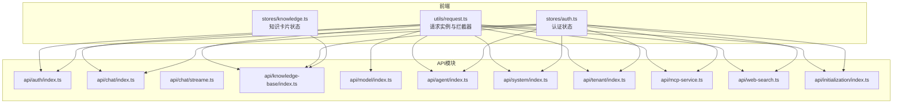
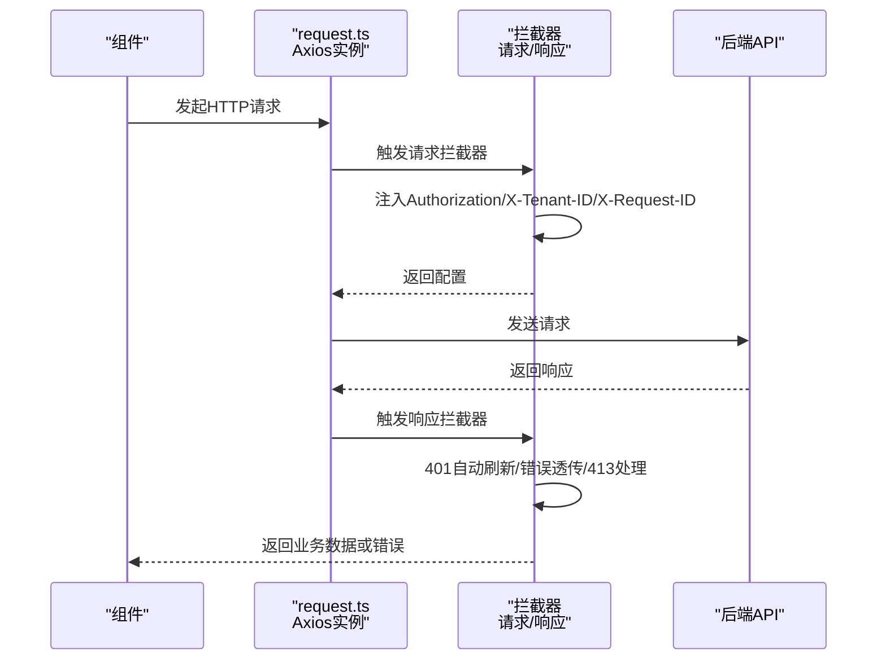
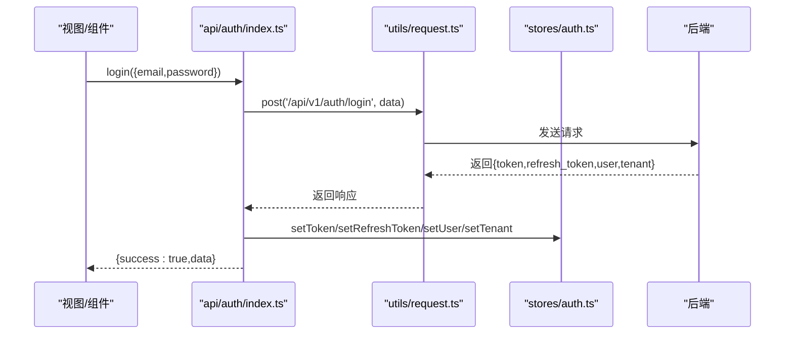
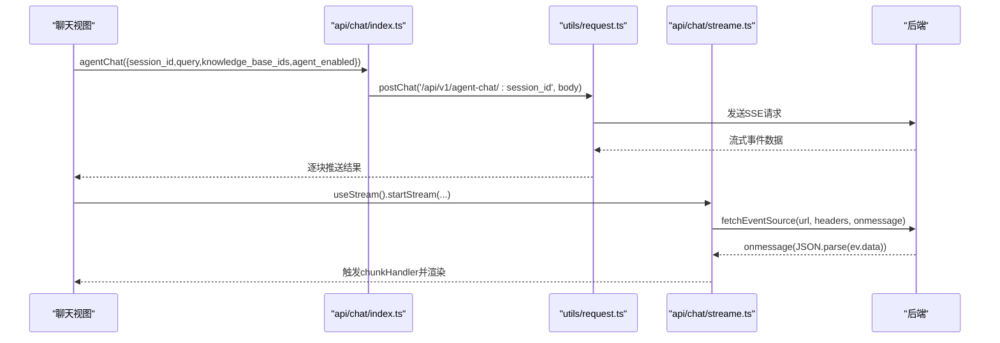
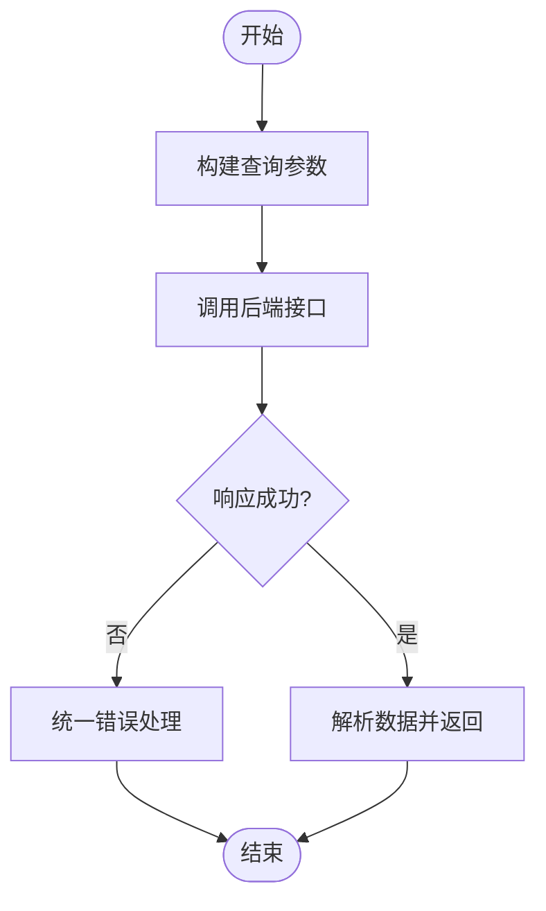
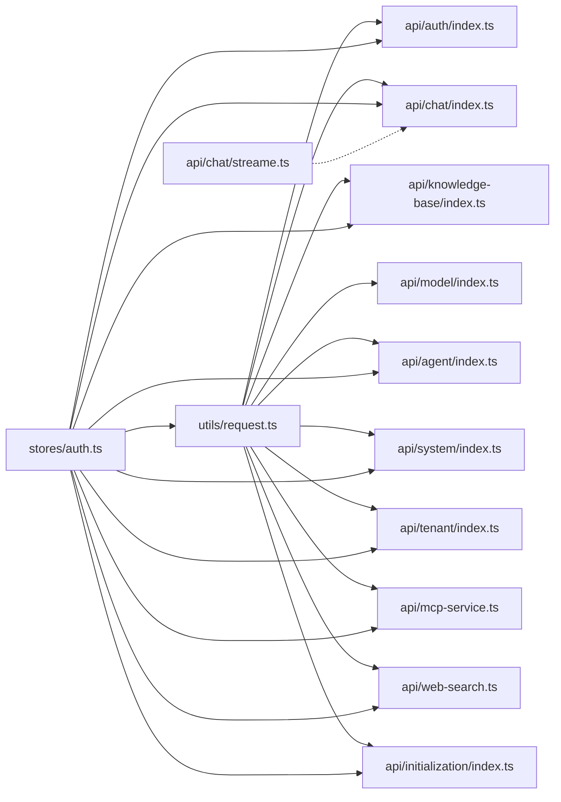

# API集成

<cite>
**本文档引用的文件**
- [frontend/src/utils/request.ts](file://frontend/src/utils/request.ts)
- [frontend/src/api/auth/index.ts](file://frontend/src/api/auth/index.ts)
- [frontend/src/api/chat/index.ts](file://frontend/src/api/chat/index.ts)
- [frontend/src/api/chat/streame.ts](file://frontend/src/api/chat/streame.ts)
- [frontend/src/api/knowledge-base/index.ts](file://frontend/src/api/knowledge-base/index.ts)
- [frontend/src/api/model/index.ts](file://frontend/src/api/model/index.ts)
- [frontend/src/api/agent/index.ts](file://frontend/src/api/agent/index.ts)
- [frontend/src/api/system/index.ts](file://frontend/src/api/system/index.ts)
- [frontend/src/api/tenant/index.ts](file://frontend/src/api/tenant/index.ts)
- [frontend/src/api/mcp-service.ts](file://frontend/src/api/mcp-service.ts)
- [frontend/src/api/web-search.ts](file://frontend/src/api/web-search.ts)
- [frontend/src/api/initialization/index.ts](file://frontend/src/api/initialization/index.ts)
- [frontend/src/stores/auth.ts](file://frontend/src/stores/auth.ts)
- [frontend/src/stores/knowledge.ts](file://frontend/src/stores/knowledge.ts)
</cite>

## 目录
1. [简介](#简介)
2. [项目结构](#项目结构)
3. [核心组件](#核心组件)
4. [架构总览](#架构总览)
5. [详细组件分析](#详细组件分析)
6. [依赖分析](#依赖分析)
7. [性能考虑](#性能考虑)
8. [故障排查指南](#故障排查指南)
9. [结论](#结论)
10. [附录](#附录)

## 简介
本文件面向前端工程师，系统化梳理 WiseDx 前端与后端 API 的集成方式，涵盖 HTTP 请求封装、API 接口定义、错误处理机制、认证令牌管理、请求/响应拦截器、跨租户访问头、WebSocket 与流式响应处理、以及最佳实践（请求缓存、并发控制、重试机制）。文档同时对认证、聊天、知识库、模型、智能体、系统配置、租户、MCP 服务、网络搜索、初始化配置等模块进行逐项解析，帮助开发者快速理解并正确使用各模块。

## 项目结构
前端 API 层采用按功能域划分的组织方式：
- 通用请求封装与拦截器：frontend/src/utils/request.ts
- 模块化 API 定义：frontend/src/api/{auth,chat,knowledge-base,model,agent,system,tenant,mcp-service,web-search,initialization}
- 状态管理：frontend/src/stores/{auth,knowledge}

图表来源
- [frontend/src/utils/request.ts](file://frontend/src/utils/request.ts#L1-L234)
- [frontend/src/api/auth/index.ts](file://frontend/src/api/auth/index.ts#L1-L242)
- [frontend/src/api/chat/index.ts](file://frontend/src/api/chat/index.ts#L1-L53)
- [frontend/src/api/chat/streame.ts](file://frontend/src/api/chat/streame.ts#L1-L182)
- [frontend/src/api/knowledge-base/index.ts](file://frontend/src/api/knowledge-base/index.ts#L1-L275)
- [frontend/src/api/model/index.ts](file://frontend/src/api/model/index.ts#L1-L125)
- [frontend/src/api/agent/index.ts](file://frontend/src/api/agent/index.ts#L1-L168)
- [frontend/src/api/system/index.ts](file://frontend/src/api/system/index.ts#L1-L113)
- [frontend/src/api/tenant/index.ts](file://frontend/src/api/tenant/index.ts#L1-L84)
- [frontend/src/api/mcp-service.ts](file://frontend/src/api/mcp-service.ts#L1-L104)
- [frontend/src/api/web-search.ts](file://frontend/src/api/web-search.ts#L1-L42)
- [frontend/src/api/initialization/index.ts](file://frontend/src/api/initialization/index.ts#L1-L529)
- [frontend/src/stores/auth.ts](file://frontend/src/stores/auth.ts#L1-L233)
- [frontend/src/stores/knowledge.ts](file://frontend/src/stores/knowledge.ts#L1-L12)

章节来源
- [frontend/src/utils/request.ts](file://frontend/src/utils/request.ts#L1-L234)
- [frontend/src/stores/auth.ts](file://frontend/src/stores/auth.ts#L1-L233)

## 核心组件
- 请求实例与拦截器：统一创建 Axios 实例，注入请求头（Authorization、X-Tenant-ID、X-Request-ID），实现 401 自动刷新令牌、网络错误提示、413 处理、统一业务错误透传。
- API 模块：按领域拆分，每个模块导出函数用于调用后端接口，返回 Promise 或流式事件源。
- 认证状态：Pinia Store 管理用户、租户、令牌、当前知识库、跨租户选择等状态，并持久化到 localStorage。
- 流式与 SSE：提供 postChat 与 @microsoft/fetch-event-source 两种流式方案，分别适配不同场景。

章节来源
- [frontend/src/utils/request.ts](file://frontend/src/utils/request.ts#L10-L234)
- [frontend/src/stores/auth.ts](file://frontend/src/stores/auth.ts#L1-L233)
- [frontend/src/api/chat/streame.ts](file://frontend/src/api/chat/streame.ts#L1-L182)

## 架构总览
前端通过统一的请求封装与拦截器与后端交互；认证状态驱动请求头注入与路由跳转；各业务模块以清晰的函数 API 对外暴露，便于组件层组合使用。

图表来源
- [frontend/src/utils/request.ts](file://frontend/src/utils/request.ts#L20-L191)

## 详细组件分析

### 认证API（Auth）
- 登录/注册/登出/校验：提供登录、注册、获取当前用户、获取当前租户、刷新令牌、登出、验证令牌等接口。
- 类型定义：LoginRequest/LoginResponse、RegisterRequest/RegisterResponse、UserInfo、TenantInfo、KnowledgeBaseInfo、ModelInfo。
- 错误处理：统一捕获异常并返回 {success, message} 结构，便于 UI 展示。
- 令牌管理：登录成功后写入 localStorage，后续请求由拦截器自动附加 Authorization 头；刷新令牌时动态导入刷新函数并更新本地存储。

图表来源
- [frontend/src/api/auth/index.ts](file://frontend/src/api/auth/index.ts#L118-L128)
- [frontend/src/utils/request.ts](file://frontend/src/utils/request.ts#L20-L50)
- [frontend/src/stores/auth.ts](file://frontend/src/stores/auth.ts#L58-L66)

章节来源
- [frontend/src/api/auth/index.ts](file://frontend/src/api/auth/index.ts#L1-L242)
- [frontend/src/stores/auth.ts](file://frontend/src/stores/auth.ts#L1-L233)

### 聊天API（Chat）
- 会话管理：创建会话、分页获取会话列表、生成标题、删除会话、获取会话详情、停止生成。
- 消息加载：按时间点分页加载历史消息。
- 知识问答：知识库问答接口。
- Agent 聊天：支持知识库选择、Agent 开关、流式输出。
- 流式处理：提供 postChat 与 @microsoft/fetch-event-source 两种方案；后者支持更灵活的参数与回调。

图表来源
- [frontend/src/api/chat/index.ts](file://frontend/src/api/chat/index.ts#L17-L33)
- [frontend/src/utils/request.ts](file://frontend/src/utils/request.ts#L214-L221)
- [frontend/src/api/chat/streame.ts](file://frontend/src/api/chat/streame.ts#L31-L148)

章节来源
- [frontend/src/api/chat/index.ts](file://frontend/src/api/chat/index.ts#L1-L53)
- [frontend/src/api/chat/streame.ts](file://frontend/src/api/chat/streame.ts#L1-L182)

### 知识库API（Knowledge Base）
- 知识库管理：列表、创建、获取、更新、删除、复制。
- 知识文件：上传（支持进度回调）、从 URL 创建、手工创建、分页列出、详情、更新、删除、下载、批量查询、分块列表、按 ID 查询分块、删除生成的问题。
- 标签管理：分页列出、创建、更新、删除（支持强制删除）、批量更新。
- FAQ：分页列出、增删改、批量字段更新、搜索、导出、导入进度查询、显示状态更新。
- 搜索：全局知识搜索，支持文件类型过滤。

图表来源
- [frontend/src/api/knowledge-base/index.ts](file://frontend/src/api/knowledge-base/index.ts#L154-L163)

章节来源
- [frontend/src/api/knowledge-base/index.ts](file://frontend/src/api/knowledge-base/index.ts#L1-L275)

### 模型API（Model）
- 模型配置类型定义：包含模型 ID、类型、来源、参数、默认标记、状态等。
- CRUD：创建、列表（可按类型过滤）、获取、更新、删除。
- 错误处理：Promise 化封装，统一 reject 并记录日志。

章节来源
- [frontend/src/api/model/index.ts](file://frontend/src/api/model/index.ts#L1-L125)

### 智能体API（Agent）
- 配置类型：运行模式、系统提示词、上下文模板、模型参数、工具、MCP 服务、知识库选择、文件类型限制、网络搜索、多轮对话、检索策略、高级设置等。
- 智能体管理：列表、详情、创建、更新、删除、复制。
- 占位符：获取占位符定义。

章节来源
- [frontend/src/api/agent/index.ts](file://frontend/src/api/agent/index.ts#L1-L168)

### 系统配置API（System）
- 系统信息：版本、引擎、MinIO 状态等。
- 租户 KV 配置：Agent 配置、对话配置、提示词模板。
- MinIO 桶列表。

章节来源
- [frontend/src/api/system/index.ts](file://frontend/src/api/system/index.ts#L1-L113)

### 租户API（Tenant）
- 列表（已弃用）与搜索：支持关键词、租户 ID、分页。
- 类型定义：TenantInfo、SearchTenantsParams、SearchTenantsResponse。

章节来源
- [frontend/src/api/tenant/index.ts](file://frontend/src/api/tenant/index.ts#L1-L84)

### MCP 服务API（MCP Service）
- 列表、详情、创建、更新、删除、测试连接、获取工具与资源。
- 类型定义：MCPService、MCPTool、MCPResource、MCPTestResult。

章节来源
- [frontend/src/api/mcp-service.ts](file://frontend/src/api/mcp-service.ts#L1-L104)

### 网络搜索API（Web Search）
- 提供商列表、租户配置读取与更新。
- 类型定义：WebSearchProviderConfig、WebSearchConfig。

章节来源
- [frontend/src/api/web-search.ts](file://frontend/src/api/web-search.ts#L1-L42)

### 初始化配置API（Initialization）
- 系统初始化配置：LLM、Embedding、Rerank、多模态、文档切分、节点抽取等。
- Ollama 状态检查、模型列表、模型可用性检查、下载任务、进度查询。
- 远程模型可用性检查、Embedding/Rerank 检查。
- 多模态测试：上传图片与配置，返回识别/OCR/处理时间等。
- 文本关系抽取、Fabri 文本/标签生成。
- 模型厂商列表。

章节来源
- [frontend/src/api/initialization/index.ts](file://frontend/src/api/initialization/index.ts#L1-L529)

## 依赖分析
- request.ts 作为唯一 HTTP 出口，被所有 API 模块依赖；拦截器集中处理认证、跨租户头、401 刷新、错误透传。
- stores/auth.ts 与 request.ts 双向协作：store 写入/读取 localStorage，拦截器读取并注入头；store 在 401 时清空状态并跳转登录。
- chat/streame.ts 与 chat/index.ts 并行存在：前者基于 fetch-event-source，后者基于 Axios 的 SSE 封装，二者互为补充。

图表来源
- [frontend/src/utils/request.ts](file://frontend/src/utils/request.ts#L1-L234)
- [frontend/src/api/chat/streame.ts](file://frontend/src/api/chat/streame.ts#L1-L182)
- [frontend/src/stores/auth.ts](file://frontend/src/stores/auth.ts#L1-L233)

章节来源
- [frontend/src/utils/request.ts](file://frontend/src/utils/request.ts#L1-L234)
- [frontend/src/stores/auth.ts](file://frontend/src/stores/auth.ts#L1-L233)

## 性能考虑
- 请求缓存
  - 对于只读列表/配置类接口，可在组件层引入轻量缓存（如 Map 缓存最近一次请求结果），避免重复请求。
  - 对于高频但低变的静态配置（如模型厂商列表），建议在 store 中做内存缓存并在应用启动时预拉取。
- 并发控制
  - 使用信号量或队列限制同时发起的请求数，避免过度占用带宽与后端资源。
  - 对于文件上传，结合 onUploadProgress 做节流，减少 UI 抖动。
- 重试机制
  - 对幂等 GET/下载类请求可做指数退避重试；对非幂等请求谨慎重试。
  - 401 自动刷新令牌已内置，避免重复刷新风暴，注意 isRefreshing 队列去重。
- 超时与取消
  - 为长耗时请求设置合理超时；对可取消操作（如搜索、上传）使用 AbortController。
- 流式渲染
  - SSE/流式响应采用缓冲+定时渲染策略，避免频繁重绘；必要时对首包延迟做骨架屏优化。

## 故障排查指南
- 401 未授权
  - 现象：出现“请重新登录”或自动跳转登录页。
  - 排查：确认 localStorage 中 weknora_token 是否存在；检查刷新队列是否阻塞；确认后端返回的 refresh_token 是否有效。
- 403 权限不足
  - 现象：跨租户访问被拒绝。
  - 排查：确认 X-Tenant-ID 请求头是否正确注入；检查 selectedTenantId 与默认租户是否一致。
- 413 请求实体过大
  - 现象：上传文件报错。
  - 处理：降低文件大小或分片上传；后端 Nginx 配置调整。
- 网络错误
  - 现象：提示“网络错误，请检查您的网络连接”。
  - 排查：检查网络连通性、代理设置、浏览器安全策略。
- SSE 连接失败
  - 现象：流式渲染中断。
  - 排查：确认后端 SSE 地址可达、CORS 配置、浏览器对 EventSource 支持；在 streame.ts 中查看 onerror 回调。

章节来源
- [frontend/src/utils/request.ts](file://frontend/src/utils/request.ts#L80-L191)
- [frontend/src/api/chat/streame.ts](file://frontend/src/api/chat/streame.ts#L141-L143)

## 结论
WiseDx 前端通过统一的请求封装与拦截器，实现了认证、跨租户、错误处理、流式响应的一致体验。各业务模块以清晰的函数 API 暴露能力，配合 Pinia 状态管理，满足复杂场景下的数据流转与交互需求。遵循本文档的最佳实践，可进一步提升稳定性与性能。

## 附录

### 请求拦截器与认证令牌管理要点
- 请求头注入
  - Authorization: Bearer <token>
  - X-Tenant-ID: 当选择跨租户时注入
  - X-Request-ID: 每次请求唯一标识
- 401 自动刷新
  - 队列化等待刷新完成，避免并发刷新
  - 刷新失败则清空本地存储并跳转登录
- 错误透传
  - 统一返回 {status,message,...}，便于 UI 分支处理

章节来源
- [frontend/src/utils/request.ts](file://frontend/src/utils/request.ts#L20-L191)
- [frontend/src/stores/auth.ts](file://frontend/src/stores/auth.ts#L106-L128)

### WebSocket 与流式响应
- SSE 封装
  - postChat：Axios 封装，适合简单场景
  - fetchEventSource：useStream：灵活参数、chunk 处理、错误/关闭回调
- 实时数据更新
  - 建议在组件卸载时主动 stopStream，避免内存泄漏
  - 对首包延迟与断流做降级处理（如提示用户重试）

章节来源
- [frontend/src/utils/request.ts](file://frontend/src/utils/request.ts#L214-L221)
- [frontend/src/api/chat/streame.ts](file://frontend/src/api/chat/streame.ts#L1-L182)