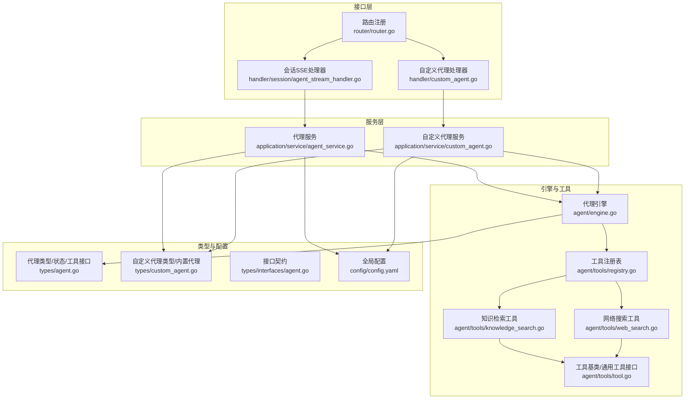
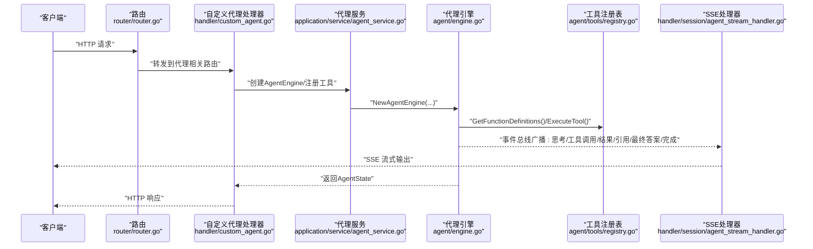
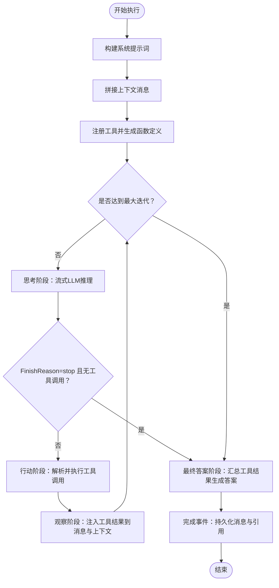
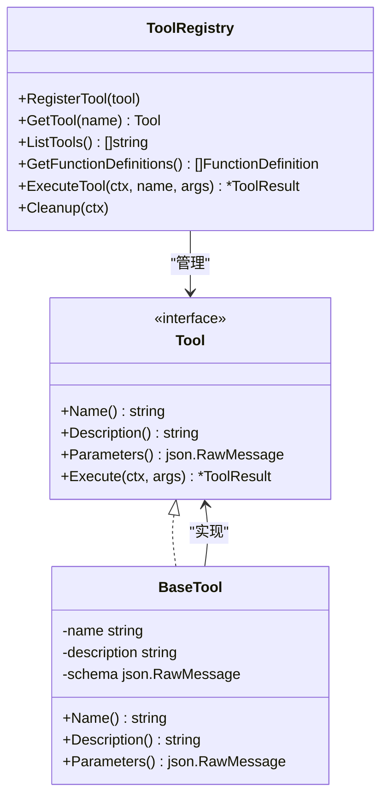
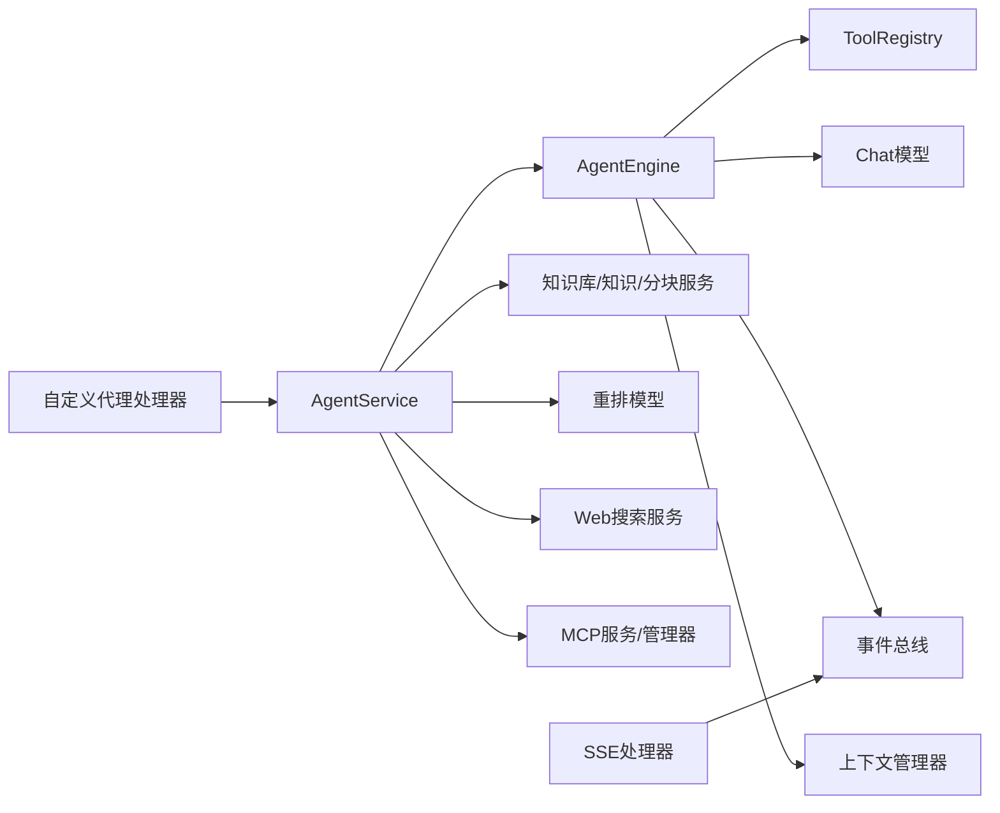

# 代理API

<cite>
**本文引用的文件**
- [internal/agent/engine.go](file://internal/agent/engine.go)
- [internal/agent/tools/registry.go](file://internal/agent/tools/registry.go)
- [internal/agent/tools/tool.go](file://internal/agent/tools/tool.go)
- [internal/agent/tools/knowledge_search.go](file://internal/agent/tools/knowledge_search.go)
- [internal/agent/tools/web_search.go](file://internal/agent/tools/web_search.go)
- [internal/application/service/agent_service.go](file://internal/application/service/agent_service.go)
- [internal/application/service/custom_agent.go](file://internal/application/service/custom_agent.go)
- [internal/handler/custom_agent.go](file://internal/handler/custom_agent.go)
- [internal/handler/session/agent_stream_handler.go](file://internal/handler/session/agent_stream_handler.go)
- [internal/types/agent.go](file://internal/types/agent.go)
- [internal/types/custom_agent.go](file://internal/types/custom_agent.go)
- [internal/types/interfaces/agent.go](file://internal/types/interfaces/agent.go)
- [internal/router/router.go](file://internal/router/router.go)
- [config/config.yaml](file://config/config.yaml)
</cite>

## 目录
1. [简介](#简介)
2. [项目结构](#项目结构)
3. [核心组件](#核心组件)
4. [架构总览](#架构总览)
5. [详细组件分析](#详细组件分析)
6. [依赖分析](#依赖分析)
7. [性能考量](#性能考量)
8. [故障排查指南](#故障排查指南)
9. [结论](#结论)
10. [附录](#附录)

## 简介
本文件系统化阐述代理API模块的设计与实现，涵盖智能代理的创建、配置、管理与执行；代理模板与自定义代理的创建流程；代理工具的配置与启用（知识检索、网络搜索、数据分析等）；代理执行状态监控（进度、工具调用记录、错误日志）；以及与聊天系统的集成与数据流。文档面向开发者与运维人员，兼顾可读性与技术深度。

## 项目结构
代理API位于后端服务内部，围绕“引擎-工具-服务-处理器”的层次化设计组织：
- 引擎层：负责ReAct执行循环、事件驱动与状态管理
- 工具层：封装知识检索、网络搜索、数据分析等可插拔能力
- 服务层：装配引擎、注册工具、解析配置、加载知识库与文档
- 处理器层：对外暴露REST接口，对接前端与SSE流
- 类型与接口：统一配置、状态、工具契约与事件模型
- 配置：全局运行参数、提示词模板、检索策略等

图表来源
- [internal/router/router.go](file://internal/router/router.go#L54-L118)
- [internal/handler/custom_agent.go](file://internal/handler/custom_agent.go#L15-L372)
- [internal/handler/session/agent_stream_handler.go](file://internal/handler/session/agent_stream_handler.go#L15-L485)
- [internal/application/service/agent_service.go](file://internal/application/service/agent_service.go#L24-L201)
- [internal/application/service/custom_agent.go](file://internal/application/service/custom_agent.go#L24-L578)
- [internal/agent/engine.go](file://internal/agent/engine.go#L25-L155)
- [internal/agent/tools/registry.go](file://internal/agent/tools/registry.go#L12-L114)
- [internal/agent/tools/knowledge_search.go](file://internal/agent/tools/knowledge_search.go#L120-L200)
- [internal/agent/tools/web_search.go](file://internal/agent/tools/web_search.go#L76-L200)
- [internal/types/agent.go](file://internal/types/agent.go#L10-L178)
- [internal/types/custom_agent.go](file://internal/types/custom_agent.go#L39-L404)
- [internal/types/interfaces/agent.go](file://internal/types/interfaces/agent.go#L21-L47)
- [config/config.yaml](file://config/config.yaml#L1-L120)

章节来源
- [internal/router/router.go](file://internal/router/router.go#L54-L118)
- [internal/handler/custom_agent.go](file://internal/handler/custom_agent.go#L15-L372)
- [internal/handler/session/agent_stream_handler.go](file://internal/handler/session/agent_stream_handler.go#L15-L485)
- [internal/application/service/agent_service.go](file://internal/application/service/agent_service.go#L24-L201)
- [internal/application/service/custom_agent.go](file://internal/application/service/custom_agent.go#L24-L578)
- [internal/agent/engine.go](file://internal/agent/engine.go#L25-L155)
- [internal/agent/tools/registry.go](file://internal/agent/tools/registry.go#L12-L114)
- [internal/agent/tools/knowledge_search.go](file://internal/agent/tools/knowledge_search.go#L120-L200)
- [internal/agent/tools/web_search.go](file://internal/agent/tools/web_search.go#L76-L200)
- [internal/types/agent.go](file://internal/types/agent.go#L10-L178)
- [internal/types/custom_agent.go](file://internal/types/custom_agent.go#L39-L404)
- [internal/types/interfaces/agent.go](file://internal/types/interfaces/agent.go#L21-L47)
- [config/config.yaml](file://config/config.yaml#L1-L120)

## 核心组件
- 代理引擎（AgentEngine）：实现ReAct循环，驱动思考（LLM推理）、行动（工具调用）、观察（结果注入上下文），并通过事件总线向外广播执行状态。
- 工具注册表（ToolRegistry）：集中注册与调度工具，提供函数定义、执行与清理能力。
- 代理服务（AgentService）：组装引擎、注册工具、解析配置、加载知识库与文档、桥接MCP工具。
- 自定义代理服务（CustomAgentService）：提供代理的增删改查、内置代理与用户配置的合并、默认值填充。
- 处理器（Handlers）：对外提供REST接口与SSE事件流，将事件写入流管理器，供前端渲染。
- 类型与接口：统一AgentConfig、AgentState、ToolResult、AgentEngine/AgentService接口契约。

章节来源
- [internal/agent/engine.go](file://internal/agent/engine.go#L25-L155)
- [internal/agent/tools/registry.go](file://internal/agent/tools/registry.go#L12-L114)
- [internal/application/service/agent_service.go](file://internal/application/service/agent_service.go#L71-L201)
- [internal/application/service/custom_agent.go](file://internal/application/service/custom_agent.go#L36-L131)
- [internal/handler/custom_agent.go](file://internal/handler/custom_agent.go#L43-L168)
- [internal/handler/session/agent_stream_handler.go](file://internal/handler/session/agent_stream_handler.go#L15-L69)
- [internal/types/agent.go](file://internal/types/agent.go#L10-L178)
- [internal/types/interfaces/agent.go](file://internal/types/interfaces/agent.go#L21-L47)

## 架构总览
代理API采用事件驱动与SSE流式输出，核心流程如下：
- 外部请求经路由进入处理器，构建AgentConfig与会话上下文
- 服务层创建AgentEngine并注册工具（含MCP工具）
- 引擎启动ReAct循环，通过事件总线广播思考、工具调用、结果、引用、最终答案、完成等事件
- SSE处理器订阅事件并写入流管理器，前端实时渲染
- 执行完成后持久化消息与引用，记录AgentSteps用于溯源

图表来源
- [internal/router/router.go](file://internal/router/router.go#L95-L115)
- [internal/handler/custom_agent.go](file://internal/handler/custom_agent.go#L55-L97)
- [internal/application/service/agent_service.go](file://internal/application/service/agent_service.go#L71-L201)
- [internal/agent/engine.go](file://internal/agent/engine.go#L75-L155)
- [internal/agent/tools/registry.go](file://internal/agent/tools/registry.go#L47-L103)
- [internal/handler/session/agent_stream_handler.go](file://internal/handler/session/agent_stream_handler.go#L56-L69)

## 详细组件分析

### 代理引擎（AgentEngine）
- 职责：构建系统提示词、拼接上下文消息、注册工具、执行ReAct循环、事件广播、状态聚合
- 关键流程：
  - 构建系统提示词与消息序列
  - 注册工具并生成函数定义
  - 思考阶段：调用LLM流式输出思维
  - 行动阶段：解析工具调用，执行工具，记录结果
  - 观察阶段：将工具结果注入消息并写入上下文
  - 循环终止条件：达到最大迭代次数或LLM指示停止
  - 最终答案阶段：汇总工具结果生成最终答案
- 事件：思考、工具调用、工具结果、引用、最终答案、反思、错误、会话标题、完成

图表来源
- [internal/agent/engine.go](file://internal/agent/engine.go#L75-L155)
- [internal/agent/engine.go](file://internal/agent/engine.go#L157-L521)
- [internal/agent/engine.go](file://internal/agent/engine.go#L523-L539)
- [internal/agent/engine.go](file://internal/agent/engine.go#L541-L620)
- [internal/agent/engine.go](file://internal/agent/engine.go#L622-L742)
- [internal/agent/engine.go](file://internal/agent/engine.go#L744-L800)

章节来源
- [internal/agent/engine.go](file://internal/agent/engine.go#L25-L155)
- [internal/agent/engine.go](file://internal/agent/engine.go#L157-L521)
- [internal/agent/engine.go](file://internal/agent/engine.go#L523-L539)
- [internal/agent/engine.go](file://internal/agent/engine.go#L541-L620)
- [internal/agent/engine.go](file://internal/agent/engine.go#L622-L742)
- [internal/agent/engine.go](file://internal/agent/engine.go#L744-L800)

### 工具注册表与工具基类
- 工具注册表：集中注册工具、导出函数定义、执行工具、清理资源（如数据分析工具）
- 工具基类：提供名称、描述、参数Schema的统一承载，以及通用格式化与匹配级别转换工具

图表来源
- [internal/agent/tools/registry.go](file://internal/agent/tools/registry.go#L12-L114)
- [internal/agent/tools/tool.go](file://internal/agent/tools/tool.go#L10-L86)

章节来源
- [internal/agent/tools/registry.go](file://internal/agent/tools/registry.go#L12-L114)
- [internal/agent/tools/tool.go](file://internal/agent/tools/tool.go#L10-L86)

### 知识检索工具（知识搜索）
- 输入：queries（1–5个语义查询）、可选知识库ID过滤
- 行为：按预计算的搜索目标（知识库/文档）执行向量/关键词混合检索，必要时二次重排
- 输出：按语义相关性排序的结果，包含来源、查询类型、知识库信息等元数据

章节来源
- [internal/agent/tools/knowledge_search.go](file://internal/agent/tools/knowledge_search.go#L105-L200)

### 网络搜索工具
- 输入：query（搜索字符串）
- 行为：校验租户配置，调用WebSearchService执行搜索；支持RAG压缩与会话级临时知识库缓存
- 输出：压缩后的网页结果，包含标题、URL、摘要与内容片段

章节来源
- [internal/agent/tools/web_search.go](file://internal/agent/tools/web_search.go#L71-L200)

### 代理服务（AgentService）
- 职责：校验配置、创建引擎、注册工具（含MCP工具）、加载知识库与文档详情、构建系统提示词模板
- 工具注册策略：
  - 根据AllowedTools或默认工具集合注册
  - 无知识库/文档时过滤掉知识相关工具
  - 启用WebSearch时追加网络搜索与抓取工具
  - 支持MCP服务按“全部/选择/关闭”三种模式注册

章节来源
- [internal/application/service/agent_service.go](file://internal/application/service/agent_service.go#L71-L201)
- [internal/application/service/agent_service.go](file://internal/application/service/agent_service.go#L203-L335)
- [internal/application/service/agent_service.go](file://internal/application/service/agent_service.go#L354-L458)
- [internal/application/service/agent_service.go](file://internal/application/service/agent_service.go#L460-L509)

### 自定义代理服务（CustomAgentService）
- 职责：创建/查询/更新/删除/复制自定义代理；内置代理与用户配置合并；默认值填充
- 内置代理：快速问答、智能推理、数据分析师、问诊助手、诊断报告生成助手等
- 权限与约束：禁止修改/删除内置代理基础信息；名称必填；租户隔离

章节来源
- [internal/application/service/custom_agent.go](file://internal/application/service/custom_agent.go#L36-L131)
- [internal/application/service/custom_agent.go](file://internal/application/service/custom_agent.go#L133-L302)
- [internal/application/service/custom_agent.go](file://internal/application/service/custom_agent.go#L304-L362)
- [internal/application/service/custom_agent.go](file://internal/application/service/custom_agent.go#L364-L483)
- [internal/application/service/custom_agent.go](file://internal/application/service/custom_agent.go#L485-L528)
- [internal/application/service/custom_agent.go](file://internal/application/service/custom_agent.go#L530-L577)
- [internal/types/custom_agent.go](file://internal/types/custom_agent.go#L11-L29)
- [internal/types/custom_agent.go](file://internal/types/custom_agent.go#L239-L394)
- [internal/types/custom_agent.go](file://internal/types/custom_agent.go#L396-L662)
- [internal/types/custom_agent.go](file://internal/types/custom_agent.go#L664-L800)

### 处理器与SSE流
- 自定义代理处理器：提供创建、查询、列表、更新、删除、复制、占位符定义等接口
- SSE处理器：订阅事件总线，按事件类型写入SSE流，支持思考、工具调用、工具结果、引用、最终答案、反思、错误、会话标题、完成等

章节来源
- [internal/handler/custom_agent.go](file://internal/handler/custom_agent.go#L43-L168)
- [internal/handler/session/agent_stream_handler.go](file://internal/handler/session/agent_stream_handler.go#L56-L485)

### 类型与接口
- AgentConfig：统一代理配置（迭代次数、温度、工具白名单、知识库范围、Web搜索开关、MCP模式等）
- AgentState/AgentStep/ToolCall/ToolResult：执行状态、步骤、工具调用与结果的数据结构
- AgentEngine/AgentService接口：抽象引擎与服务，便于替换实现

章节来源
- [internal/types/agent.go](file://internal/types/agent.go#L10-L178)
- [internal/types/interfaces/agent.go](file://internal/types/interfaces/agent.go#L21-L47)

## 依赖分析
- 组件耦合
  - AgentEngine依赖ToolRegistry、Chat模型、事件总线、上下文管理器
  - AgentService依赖知识库/知识/分块服务、重排模型、Web搜索服务、MCP服务与管理器
  - 处理器依赖服务层与流管理器
- 外部依赖
  - Web搜索提供商配置（来自租户配置）
  - MCP服务（可选，按模式启用）

图表来源
- [internal/agent/engine.go](file://internal/agent/engine.go#L25-L73)
- [internal/application/service/agent_service.go](file://internal/application/service/agent_service.go#L24-L69)
- [internal/handler/custom_agent.go](file://internal/handler/custom_agent.go#L15-L25)
- [internal/handler/session/agent_stream_handler.go](file://internal/handler/session/agent_stream_handler.go#L15-L33)

章节来源
- [internal/agent/engine.go](file://internal/agent/engine.go#L25-L73)
- [internal/application/service/agent_service.go](file://internal/application/service/agent_service.go#L24-L69)
- [internal/handler/custom_agent.go](file://internal/handler/custom_agent.go#L15-L25)
- [internal/handler/session/agent_stream_handler.go](file://internal/handler/session/agent_stream_handler.go#L15-L33)

## 性能考量
- 并发控制
  - 工具执行并发：工具注册表提供统一执行入口，建议在工具内部实现并发安全与限流
  - Web搜索：按租户配置的最大结果数限制，避免过载
- 资源限制
  - 最大迭代次数：默认上限与配置校验，防止无限循环
  - 历史轮数与上下文长度：多轮对话时控制历史轮数，避免上下文膨胀
- 超时处理
  - LLM流式调用具备超时与错误传播机制，事件总线记录错误阶段
- 检索优化
  - 向量/关键词TopK、阈值与重排TopK、阈值的合理配置可显著影响响应质量与延迟
- 缓存与压缩
  - Web搜索支持RAG压缩与会话级临时知识库缓存，减少重复检索成本

章节来源
- [internal/application/service/agent_service.go](file://internal/application/service/agent_service.go#L337-L352)
- [internal/agent/engine.go](file://internal/agent/engine.go#L157-L172)
- [internal/agent/tools/web_search.go](file://internal/agent/tools/web_search.go#L183-L200)
- [config/config.yaml](file://config/config.yaml#L1-L120)

## 故障排查指南
- 常见错误与定位
  - 工具执行失败：查看工具结果中的Success/Error字段，结合事件总线错误事件定位阶段
  - 配置无效：AgentService.ValidateConfig对最大迭代次数进行校验并设置默认值
  - Web搜索未配置：工具执行时校验租户WebSearchConfig，缺失时报错
  - 代理不存在/权限问题：自定义代理服务返回相应错误，检查ID与租户上下文
- 日志与事件
  - 引擎在关键节点打印详细日志与事件，SSE处理器将事件写入流，前端可据此定位问题
- 建议
  - 在开发环境开启Swagger便于调试接口
  - 使用事件总线的错误事件进行统一错误上报与追踪

章节来源
- [internal/agent/engine.go](file://internal/agent/engine.go#L129-L143)
- [internal/application/service/agent_service.go](file://internal/application/service/agent_service.go#L337-L352)
- [internal/agent/tools/web_search.go](file://internal/agent/tools/web_search.go#L151-L159)
- [internal/handler/session/agent_stream_handler.go](file://internal/handler/session/agent_stream_handler.go#L378-L404)
- [internal/handler/custom_agent.go](file://internal/handler/custom_agent.go#L112-L134)

## 结论
代理API模块通过清晰的分层设计与事件驱动机制，实现了可插拔工具、灵活配置与可观测的执行流程。自定义代理服务提供了强大的模板与配置能力，结合SSE流式输出，能够满足复杂业务场景下的智能代理需求。建议在生产环境中配合资源限制、缓存与压缩策略，持续优化性能与稳定性。

## 附录

### 代理模板与自定义代理创建流程
- 模板来源：内置代理（快速问答、智能推理、数据分析师、问诊助手、诊断报告生成助手等）
- 创建流程：
  - 通过自定义代理处理器提交创建请求（名称、描述、头像、配置）
  - 服务层校验并生成UUID、设置租户ID与时间戳
  - 默认填充AgentMode为快速问答，确保默认值
  - 持久化至数据库，返回创建成功的代理

章节来源
- [internal/handler/custom_agent.go](file://internal/handler/custom_agent.go#L43-L97)
- [internal/application/service/custom_agent.go](file://internal/application/service/custom_agent.go#L36-L83)
- [internal/types/custom_agent.go](file://internal/types/custom_agent.go#L239-L394)
- [internal/types/custom_agent.go](file://internal/types/custom_agent.go#L396-L662)
- [internal/types/custom_agent.go](file://internal/types/custom_agent.go#L664-L800)

### 代理工具配置与启用
- 工具白名单：AllowedTools或默认工具集合
- 知识库工具：在存在知识库或文档时启用；否则过滤掉知识相关工具
- 网络搜索：启用WebSearchEnabled时自动注册网络搜索与抓取工具
- MCP工具：按MCPSelectionMode（全部/选择/关闭）注册，支持动态启用/禁用

章节来源
- [internal/application/service/agent_service.go](file://internal/application/service/agent_service.go#L203-L335)
- [internal/application/service/agent_service.go](file://internal/application/service/agent_service.go#L103-L157)

### 代理执行状态监控
- 事件类型：思考、工具调用、工具结果、引用、最终答案、反思、错误、会话标题、完成
- SSE处理器将事件写入流管理器，前端按事件ID累积内容，支持快速回复、引用展示与错误提示
- 执行统计：事件携带持续时间、迭代次数、步骤总数等指标

章节来源
- [internal/handler/session/agent_stream_handler.go](file://internal/handler/session/agent_stream_handler.go#L56-L485)
- [internal/agent/engine.go](file://internal/agent/engine.go#L184-L220)

### 与聊天系统的集成与数据流
- 路由注册：统一挂载到/v1/api，包含认证中间件与追踪中间件
- 会话与消息：SSE处理器将事件写入会话消息，最终答案与引用持久化
- 数据流：请求→路由→处理器→服务→引擎→事件总线→SSE→前端

章节来源
- [internal/router/router.go](file://internal/router/router.go#L54-L118)
- [internal/handler/session/agent_stream_handler.go](file://internal/handler/session/agent_stream_handler.go#L434-L484)