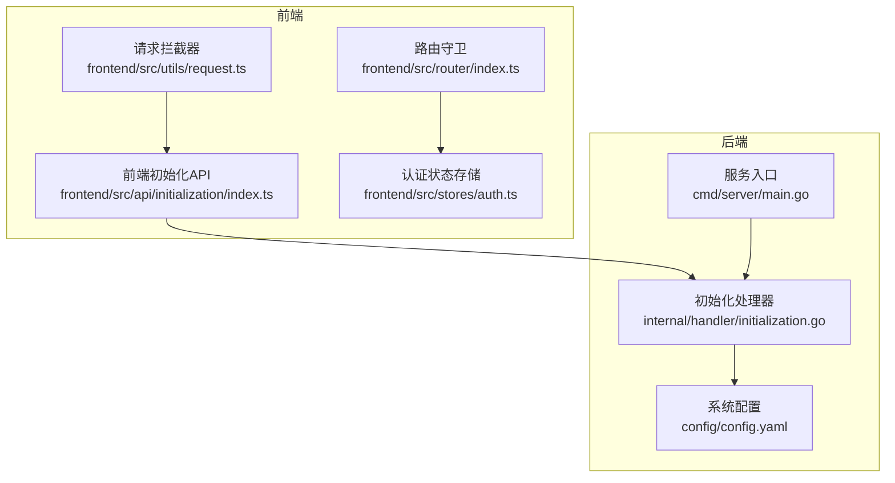
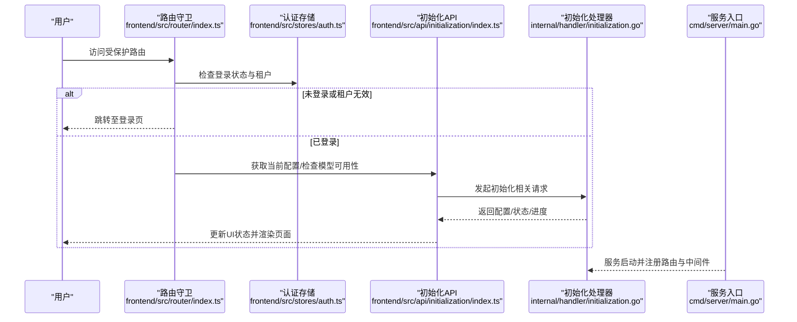
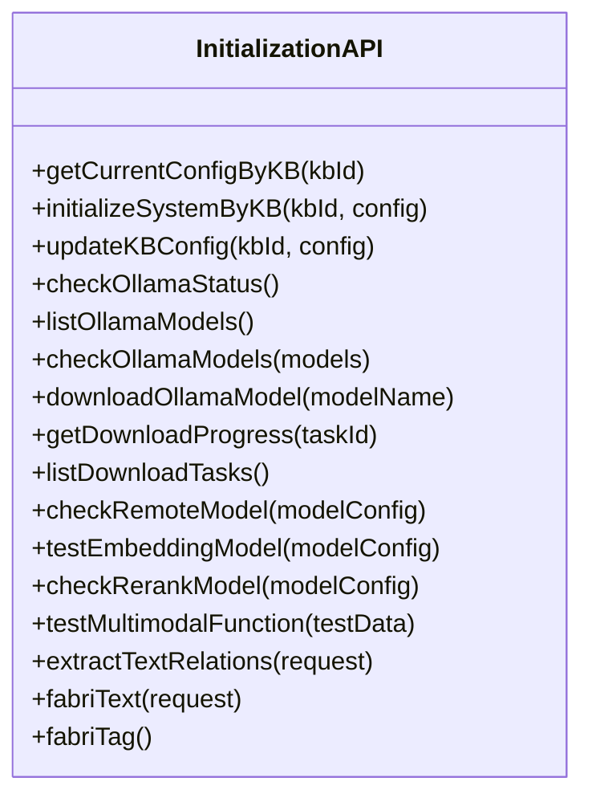
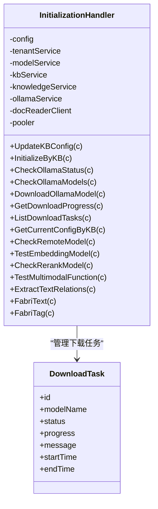
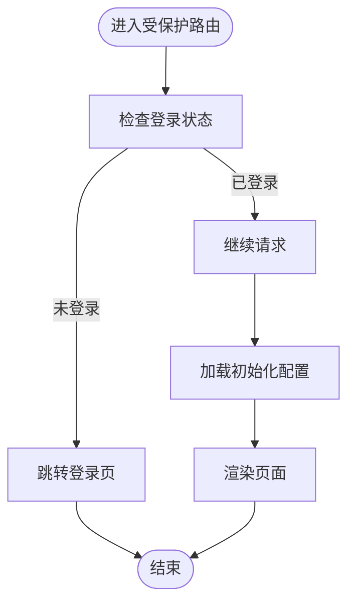
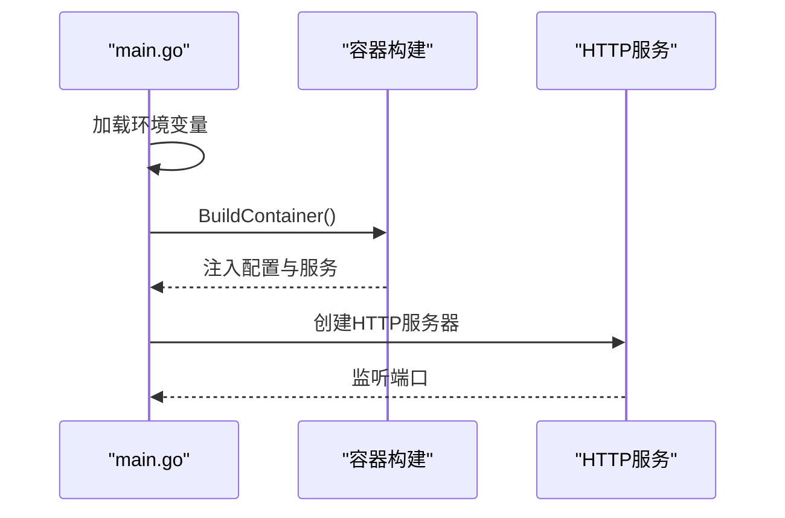
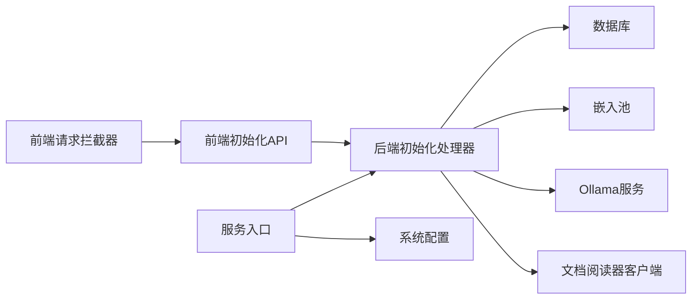

# 初始化API

<cite>
**本文引用的文件**
- [frontend/src/api/initialization/index.ts](file://frontend/src/api/initialization/index.ts)
- [internal/handler/initialization.go](file://internal/handler/initialization.go)
- [frontend/src/stores/auth.ts](file://frontend/src/stores/auth.ts)
- [frontend/src/router/index.ts](file://frontend/src/router/index.ts)
- [cmd/server/main.go](file://cmd/server/main.go)
- [frontend/src/utils/request.ts](file://frontend/src/utils/request.ts)
- [config/config.yaml](file://config/config.yaml)
</cite>

## 目录
1. [简介](#简介)
2. [项目结构](#项目结构)
3. [核心组件](#核心组件)
4. [架构总览](#架构总览)
5. [详细组件分析](#详细组件分析)
6. [依赖分析](#依赖分析)
7. [性能考量](#性能考量)
8. [故障排查指南](#故障排查指南)
9. [结论](#结论)
10. [附录](#附录)

## 简介
本文件系统化阐述初始化API模块的设计与实现，覆盖应用启动时的初始化流程（系统配置加载、用户状态检查、默认设置应用）、错误处理与降级策略（网络异常、配置缺失、权限不足等）、初始化状态管理（加载进度、错误信息、重试机制）、初始化完成后的应用启动流程（路由跳转、页面渲染、服务注册），以及离线模式与本地数据同步机制。文档面向开发者与运维人员，既提供代码级细节，也提供可操作的实践建议。

## 项目结构
初始化API模块横跨前端与后端：
- 前端负责初始化请求封装、状态管理、路由守卫与错误拦截。
- 后端负责配置校验、模型可用性检测、多模态测试、Ollama模型下载与进度跟踪、配置持久化与响应构建。
- 配置文件提供默认行为与阈值，容器与环境变量驱动运行时行为。

图表来源
- [frontend/src/api/initialization/index.ts](file://frontend/src/api/initialization/index.ts#L1-L529)
- [internal/handler/initialization.go](file://internal/handler/initialization.go#L1-L2248)
- [frontend/src/stores/auth.ts](file://frontend/src/stores/auth.ts#L1-L233)
- [frontend/src/router/index.ts](file://frontend/src/router/index.ts#L1-L127)
- [frontend/src/utils/request.ts](file://frontend/src/utils/request.ts#L1-L234)
- [cmd/server/main.go](file://cmd/server/main.go#L1-L193)
- [config/config.yaml](file://config/config.yaml#L1-L585)

章节来源
- [frontend/src/api/initialization/index.ts](file://frontend/src/api/initialization/index.ts#L1-L529)
- [internal/handler/initialization.go](file://internal/handler/initialization.go#L1-L2248)
- [frontend/src/stores/auth.ts](file://frontend/src/stores/auth.ts#L1-L233)
- [frontend/src/router/index.ts](file://frontend/src/router/index.ts#L1-L127)
- [frontend/src/utils/request.ts](file://frontend/src/utils/request.ts#L1-L234)
- [cmd/server/main.go](file://cmd/server/main.go#L1-L193)
- [config/config.yaml](file://config/config.yaml#L1-L585)

## 核心组件
- 前端初始化API：封装配置获取、模型可用性检测、多模态测试、Ollama模型下载与进度查询、知识库配置更新等接口。
- 后端初始化处理器：负责请求绑定与校验、模型与多模态配置验证、配置持久化、Ollama任务管理、远程模型连通性检测、文档关系抽取与示例文本生成。
- 认证与路由：通过Pinia状态管理用户与租户信息，通过路由守卫控制访问权限与初始化状态。
- 请求拦截器：统一注入认证头、跨租户头、错误处理与401自动刷新。
- 服务入口与配置：服务启动时加载环境变量与配置，容器构建依赖注入，迁移与清理资源。

章节来源
- [frontend/src/api/initialization/index.ts](file://frontend/src/api/initialization/index.ts#L1-L529)
- [internal/handler/initialization.go](file://internal/handler/initialization.go#L1-L2248)
- [frontend/src/stores/auth.ts](file://frontend/src/stores/auth.ts#L1-L233)
- [frontend/src/router/index.ts](file://frontend/src/router/index.ts#L1-L127)
- [frontend/src/utils/request.ts](file://frontend/src/utils/request.ts#L1-L234)
- [cmd/server/main.go](file://cmd/server/main.go#L1-L193)

## 架构总览
初始化流程自上而下分为三层：
- 表现层：前端通过API模块发起初始化请求，展示加载进度与错误信息，触发路由跳转与页面渲染。
- 业务层：后端处理器校验配置、检测模型可用性、执行多模态测试、管理Ollama下载任务、持久化配置并返回响应。
- 基础设施层：容器注入数据库、嵌入池、Ollama服务、文档阅读器客户端等，服务启动时加载环境变量与配置。

图表来源
- [frontend/src/router/index.ts](file://frontend/src/router/index.ts#L83-L124)
- [frontend/src/stores/auth.ts](file://frontend/src/stores/auth.ts#L1-L233)
- [frontend/src/api/initialization/index.ts](file://frontend/src/api/initialization/index.ts#L1-L529)
- [internal/handler/initialization.go](file://internal/handler/initialization.go#L1-L2248)
- [cmd/server/main.go](file://cmd/server/main.go#L124-L188)

## 详细组件分析

### 前端初始化API模块
- 配置数据类型与请求封装：定义初始化配置结构、下载任务状态、知识库配置更新请求等，提供统一的HTTP调用封装（get/post/put）。
- 模型可用性检测：远程模型检查、Embedding模型测试、Rerank模型检查。
- 多模态测试：支持上传图片进行VLM Caption与OCR测试，支持COS/MinIO存储配置。
- Ollama管理：状态检查、模型列表、模型下载（异步）、下载进度查询、任务列表。
- 文本关系抽取与示例生成：提供关系抽取与示例文本生成接口。
- 错误处理：统一捕获网络错误、401自动刷新、业务错误提示。

图表来源
- [frontend/src/api/initialization/index.ts](file://frontend/src/api/initialization/index.ts#L1-L529)

章节来源
- [frontend/src/api/initialization/index.ts](file://frontend/src/api/initialization/index.ts#L1-L529)

### 后端初始化处理器
- 初始化请求绑定与校验：绑定请求体、校验多模态配置、Rerank配置、节点抽取配置。
- 模型处理：根据请求构建模型描述符，查找现有模型或创建新模型，更新知识库配置。
- 配置响应构建：聚合模型与知识库配置，隐藏内置模型敏感信息，输出统一配置响应。
- Ollama任务管理：全局任务表、并发安全更新、异步下载与进度回调、任务状态持久化。
- 远程模型检测：远程模型连通性检测、Rerank模型功能测试。
- 多模态测试：调用文档阅读器服务进行图像Caption与OCR提取。
- 文本关系抽取与示例生成：基于模板与LLM生成示例文本与标签。

图表来源
- [internal/handler/initialization.go](file://internal/handler/initialization.go#L34-L87)
- [internal/handler/initialization.go](file://internal/handler/initialization.go#L1218-L1424)

章节来源
- [internal/handler/initialization.go](file://internal/handler/initialization.go#L1-L2248)

### 认证与路由
- 认证状态管理：通过Pinia存储用户、租户、Token、知识库列表与当前知识库，支持从localStorage恢复状态。
- 路由守卫：控制访问权限与初始化状态，未登录跳转登录页，已登录进入平台页面。
- 请求拦截器：自动注入Authorization与跨租户头，处理401刷新与网络错误。

图表来源
- [frontend/src/router/index.ts](file://frontend/src/router/index.ts#L83-L124)
- [frontend/src/stores/auth.ts](file://frontend/src/stores/auth.ts#L130-L198)
- [frontend/src/utils/request.ts](file://frontend/src/utils/request.ts#L20-L191)

章节来源
- [frontend/src/router/index.ts](file://frontend/src/router/index.ts#L1-L127)
- [frontend/src/stores/auth.ts](file://frontend/src/stores/auth.ts#L1-L233)
- [frontend/src/utils/request.ts](file://frontend/src/utils/request.ts#L1-L234)

### 服务启动与配置加载
- 环境变量加载：启动时加载.env并校验必需变量，打印数据库配置摘要。
- 依赖注入容器：构建数据库、Tracer、文件服务、Redis、协程池等，注册清理器。
- 服务器启动：创建HTTP服务，注册信号处理与优雅停机，输出启动日志。

图表来源
- [cmd/server/main.go](file://cmd/server/main.go#L47-L193)
- [config/config.yaml](file://config/config.yaml#L1-L585)

章节来源
- [cmd/server/main.go](file://cmd/server/main.go#L1-L193)
- [config/config.yaml](file://config/config.yaml#L1-L585)

## 依赖分析
- 前端依赖
  - Axios实例：统一请求与响应拦截，自动注入认证头与跨租户头，处理401刷新。
  - Pinia状态：持久化用户与租户信息，支持跨页面状态恢复。
  - Vue Router：路由守卫控制访问权限与初始化状态。
- 后端依赖
  - 容器注入：数据库、嵌入池、Ollama服务、文档阅读器客户端、Tracer与资源清理器。
  - 配置：系统默认配置与环境变量共同决定行为。
  - 中间件：认证、错误处理、日志、恢复与追踪。

图表来源
- [frontend/src/utils/request.ts](file://frontend/src/utils/request.ts#L1-L234)
- [frontend/src/api/initialization/index.ts](file://frontend/src/api/initialization/index.ts#L1-L529)
- [internal/handler/initialization.go](file://internal/handler/initialization.go#L1-L2248)
- [cmd/server/main.go](file://cmd/server/main.go#L124-L188)
- [config/config.yaml](file://config/config.yaml#L1-L585)

章节来源
- [frontend/src/utils/request.ts](file://frontend/src/utils/request.ts#L1-L234)
- [frontend/src/api/initialization/index.ts](file://frontend/src/api/initialization/index.ts#L1-L529)
- [internal/handler/initialization.go](file://internal/handler/initialization.go#L1-L2248)
- [cmd/server/main.go](file://cmd/server/main.go#L124-L188)
- [config/config.yaml](file://config/config.yaml#L1-L585)

## 性能考量
- 嵌入与检索：配置文件提供默认阈值与Top-K参数，建议结合业务规模调整以平衡召回与延迟。
- Ollama下载：异步任务与进度回调减少阻塞，建议设置合理的超时与重试策略。
- 多模态处理：图像上传大小限制与分块参数直接影响处理耗时，建议在前端进行预检与压缩。
- 服务启动：容器构建与迁移在启动阶段完成，建议监控启动时间并在生产环境启用自动迁移与健康检查。

[本节为通用指导，无需特定文件引用]

## 故障排查指南
- 网络异常
  - 前端：拦截器统一捕获无响应错误，提示“网络错误，请检查您的网络连接”。
  - 后端：Ollama与远程模型检测对超时、401、403、404进行分类提示。
- 配置缺失
  - 服务启动：必需环境变量缺失时直接终止并提示。
  - 初始化：多模态与Rerank配置不完整时返回参数错误。
- 权限不足
  - 远程模型检测：对401/403进行专门提示，指导检查API Key与权限。
- 401自动刷新
  - 前端：首次401时尝试刷新Token，失败则清空本地Token并跳转登录页。
- 下载任务异常
  - 后端：任务状态失败时记录错误信息，前端轮询进度并展示失败原因。

章节来源
- [frontend/src/utils/request.ts](file://frontend/src/utils/request.ts#L80-L191)
- [internal/handler/initialization.go](file://internal/handler/initialization.go#L1614-L1632)
- [cmd/server/main.go](file://cmd/server/main.go#L59-L86)

## 结论
初始化API模块通过前后端协同，实现了从系统配置加载、用户状态检查到默认设置应用的完整闭环。后端提供严格的配置校验与模型可用性检测，前端提供直观的状态反馈与错误处理。通过容器化与配置驱动，系统具备良好的可维护性与可扩展性。建议在生产环境中结合监控与告警，持续优化初始化性能与稳定性。

[本节为总结性内容，无需特定文件引用]

## 附录
- 初始化状态管理
  - 前端：通过Pinia状态与路由守卫控制初始化流程，支持从localStorage恢复状态。
  - 后端：Ollama任务采用全局表与互斥锁管理，支持任务状态查询与进度回调。
- 初始化完成后的启动流程
  - 前端：认证通过后进入平台页面，渲染知识库列表与聊天界面。
  - 后端：服务启动后注册路由与中间件，提供初始化相关API。
- 离线模式与本地数据同步
  - 前端：localStorage用于持久化用户、租户与Token，支持跨页面状态恢复。
  - 后端：容器构建与迁移在启动阶段完成，建议结合外部工具进行数据备份与恢复。

章节来源
- [frontend/src/stores/auth.ts](file://frontend/src/stores/auth.ts#L130-L198)
- [frontend/src/router/index.ts](file://frontend/src/router/index.ts#L83-L124)
- [cmd/server/main.go](file://cmd/server/main.go#L124-L188)
- [frontend/src/utils/request.ts](file://frontend/src/utils/request.ts#L20-L191)