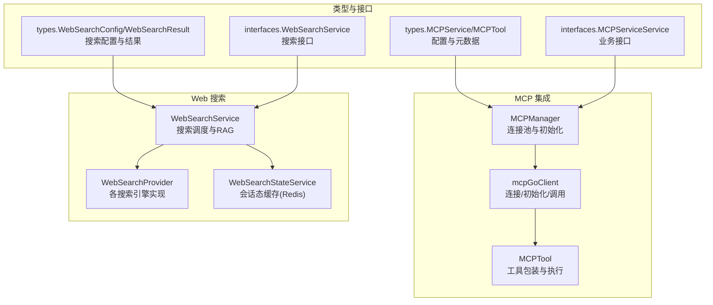
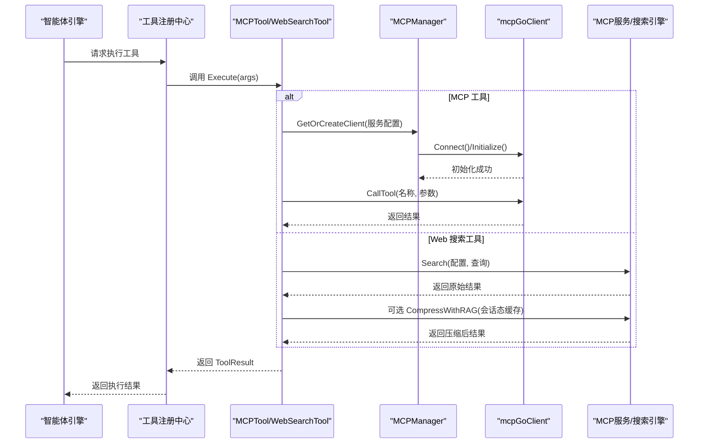
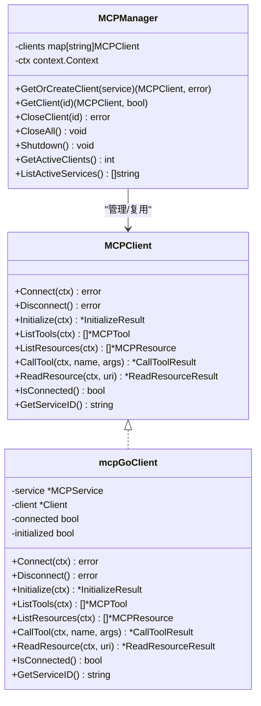
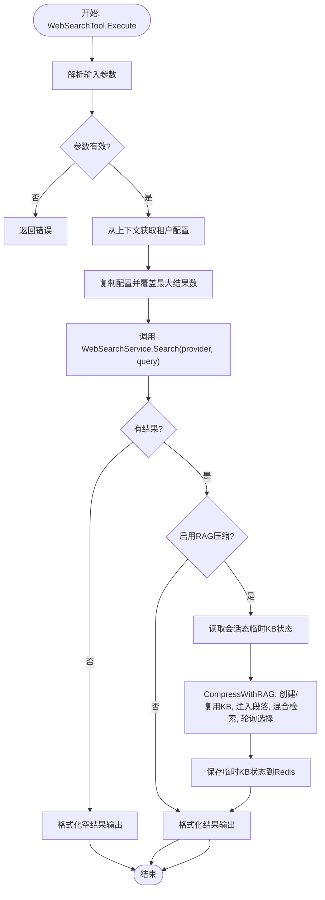
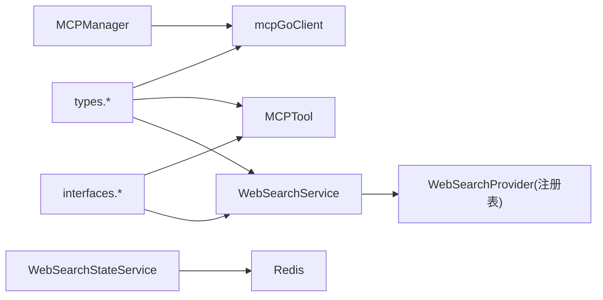

# 工具API

<cite>
**本文引用的文件**
- [internal/mcp/client.go](file://internal/mcp/client.go)
- [internal/mcp/manager.go](file://internal/mcp/manager.go)
- [internal/mcp/types.go](file://internal/mcp/types.go)
- [internal/mcp/errors.go](file://internal/mcp/errors.go)
- [internal/agent/tools/mcp_tool.go](file://internal/agent/tools/mcp_tool.go)
- [internal/agent/tools/web_search.go](file://internal/agent/tools/web_search.go)
- [internal/types/mcp.go](file://internal/types/mcp.go)
- [internal/types/web_search.go](file://internal/types/web_search.go)
- [internal/types/interfaces/mcp_service.go](file://internal/types/interfaces/mcp_service.go)
- [internal/application/service/web_search.go](file://internal/application/service/web_search.go)
- [internal/application/service/web_search_state.go](file://internal/application/service/web_search_state.go)
- [internal/handler/web_search.go](file://internal/handler/web_search.go)
</cite>

## 目录
1. [简介](#简介)
2. [项目结构](#项目结构)
3. [核心组件](#核心组件)
4. [架构总览](#架构总览)
5. [详细组件分析](#详细组件分析)
6. [依赖关系分析](#依赖关系分析)
7. [性能考量](#性能考量)
8. [故障排查指南](#故障排查指南)
9. [结论](#结论)
10. [附录](#附录)

## 简介
本文件系统性地文档化工具API模块，涵盖以下方面：
- MCP 服务集成API：服务发现、配置管理、连接建立与生命周期管理
- Web 搜索API：搜索引擎选择、搜索参数配置、结果处理与RAG压缩
- 通用错误处理：连接超时、服务不可用、结果格式错误等
- 最佳实践：并发控制、缓存策略、重试机制
- 监控与诊断：连接状态、响应时间、成功率
- 与主应用的集成方式与数据传递

## 项目结构
工具API模块主要由三部分组成：
- MCP 服务集成层：客户端封装、连接管理、工具注册与执行
- Web 搜索服务层：多搜索引擎注册与调用、RAG压缩、会话态缓存
- 类型与接口层：统一的数据结构、服务接口契约

图表来源
- [internal/mcp/manager.go](file://internal/mcp/manager.go#L13-L96)
- [internal/mcp/client.go](file://internal/mcp/client.go#L54-L135)
- [internal/agent/tools/mcp_tool.go](file://internal/agent/tools/mcp_tool.go#L17-L32)
- [internal/application/service/web_search.go](file://internal/application/service/web_search.go#L18-L309)
- [internal/types/mcp.go](file://internal/types/mcp.go#L21-L87)
- [internal/types/web_search.go](file://internal/types/web_search.go#L9-L60)
- [internal/types/interfaces/mcp_service.go](file://internal/types/interfaces/mcp_service.go#L9-L61)

章节来源
- [internal/mcp/manager.go](file://internal/mcp/manager.go#L1-L226)
- [internal/mcp/client.go](file://internal/mcp/client.go#L1-L373)
- [internal/agent/tools/mcp_tool.go](file://internal/agent/tools/mcp_tool.go#L1-L320)
- [internal/application/service/web_search.go](file://internal/application/service/web_search.go#L1-L372)
- [internal/types/mcp.go](file://internal/types/mcp.go#L1-L227)
- [internal/types/web_search.go](file://internal/types/web_search.go#L1-L60)
- [internal/types/interfaces/mcp_service.go](file://internal/types/interfaces/mcp_service.go#L1-L62)

## 核心组件
- MCP 客户端与管理器
  - MCPClient 接口与 mcpGoClient 实现，支持 SSE 与 HTTP Streamable 传输，禁用 stdio 以避免安全风险
  - MCPManager 负责连接复用、初始化超时控制、空闲清理、全局关闭
- MCP 工具包装与注册
  - MCPTool 将 MCP 服务工具包装为统一 Tool 接口，负责参数解析、执行、结果序列化
  - RegisterMCPTools 批量注册工具，GetMCPToolsInfo 获取可用工具清单
- Web 搜索服务
  - WebSearchService 统一调度各搜索引擎，支持黑名单过滤、RAG 压缩、会话态缓存
  - WebSearchStateService 基于 Redis 的临时知识库状态管理
- 类型与接口
  - types.MCPService/MCPTool/MCPResource 定义 MCP 配置与元数据
  - types.WebSearchConfig/WebSearchResult 定义搜索配置与结果
  - interfaces.MCPServiceService/WebSearchService 定义业务接口契约

章节来源
- [internal/mcp/client.go](file://internal/mcp/client.go#L19-L47)
- [internal/mcp/manager.go](file://internal/mcp/manager.go#L13-L35)
- [internal/agent/tools/mcp_tool.go](file://internal/agent/tools/mcp_tool.go#L17-L32)
- [internal/application/service/web_search.go](file://internal/application/service/web_search.go#L18-L309)
- [internal/types/mcp.go](file://internal/types/mcp.go#L21-L87)
- [internal/types/web_search.go](file://internal/types/web_search.go#L9-L60)
- [internal/types/interfaces/mcp_service.go](file://internal/types/interfaces/mcp_service.go#L9-L61)

## 架构总览
MCP 与 Web 搜索通过统一的工具接口集成到主应用的智能体引擎中，工具执行时按需建立连接、完成初始化握手，并在完成后进行必要的资源释放或缓存持久化。

图表来源
- [internal/agent/tools/mcp_tool.go](file://internal/agent/tools/mcp_tool.go#L64-L134)
- [internal/mcp/manager.go](file://internal/mcp/manager.go#L37-L96)
- [internal/mcp/client.go](file://internal/mcp/client.go#L157-L225)
- [internal/agent/tools/web_search.go](file://internal/agent/tools/web_search.go#L110-L284)
- [internal/application/service/web_search.go](file://internal/application/service/web_search.go#L245-L286)

## 详细组件分析

### MCP 服务集成API
- 服务发现与配置管理
  - 通过 types.MCPService 定义服务配置，支持 SSE、HTTP Streamable 与 stdio 三种传输类型；其中 stdio 明确禁用
  - 支持自定义 HTTP 头部、认证头（API Key、Bearer Token）、高级配置（超时、重试次数、重试间隔）
- 连接建立与生命周期
  - NewMCPClient 基于传输类型创建客户端，设置 HTTP 超时与认证头
  - Connect 启动客户端；Initialize 完成协议初始化握手；ListTools/ListResources 获取工具与资源清单
  - onConnectionLost 回调触发断连处理；checkErrorAndDisconnectIfNeeded 在特定错误下主动断开
  - MCPManager 缓存并复用连接，提供初始化超时控制、空闲清理、全局关闭
- 工具调用与结果处理
  - MCPTool.Execute 解析参数、获取/创建客户端、调用工具、提取文本内容、构建 ToolResult
  - 支持 stdio 一次性连接并在执行后断开，避免资源泄漏

图表来源
- [internal/mcp/client.go](file://internal/mcp/client.go#L19-L47)
- [internal/mcp/client.go](file://internal/mcp/client.go#L54-L135)
- [internal/mcp/manager.go](file://internal/mcp/manager.go#L13-L35)

章节来源
- [internal/mcp/client.go](file://internal/mcp/client.go#L50-L135)
- [internal/mcp/manager.go](file://internal/mcp/manager.go#L37-L120)
- [internal/mcp/types.go](file://internal/mcp/types.go#L3-L67)
- [internal/types/mcp.go](file://internal/types/mcp.go#L21-L87)
- [internal/agent/tools/mcp_tool.go](file://internal/agent/tools/mcp_tool.go#L64-L134)

### Web 搜索API
- 引擎选择与参数配置
  - types.WebSearchConfig 定义搜索引擎提供商、API Key、最大结果数、是否包含日期、压缩方法、黑名单、RAG 嵌入/重排模型等
  - WebSearchService.Search 根据配置选择具体 Provider，设置超时，执行搜索并应用黑名单过滤
- 结果处理与RAG压缩
  - WebSearchTool.Execute 调用 WebSearchService.Search，支持 RAG 压缩（基于会话态临时知识库），并格式化输出
  - WebSearchService.CompressWithRAG 创建/复用临时知识库，同步注入网页段落，混合检索并轮询选择参考，最终按来源URL合并压缩
- 会话态缓存与清理
  - WebSearchStateService 基于 Redis 存储每个会话的临时知识库ID、已见URL集合、知识项ID列表
  - 支持保存、读取、删除临时知识库及其关联数据，确保会话结束后的资源回收

图表来源
- [internal/agent/tools/web_search.go](file://internal/agent/tools/web_search.go#L110-L284)
- [internal/application/service/web_search.go](file://internal/application/service/web_search.go#L245-L286)
- [internal/application/service/web_search.go](file://internal/application/service/web_search.go#L24-L129)
- [internal/application/service/web_search_state.go](file://internal/application/service/web_search_state.go#L34-L81)

章节来源
- [internal/agent/tools/web_search.go](file://internal/agent/tools/web_search.go#L16-L108)
- [internal/application/service/web_search.go](file://internal/application/service/web_search.go#L18-L309)
- [internal/types/web_search.go](file://internal/types/web_search.go#L9-L60)
- [internal/application/service/web_search_state.go](file://internal/application/service/web_search_state.go#L14-L137)

### 工具调用最佳实践
- 并发控制
  - 使用 MCPManager 的连接池与复用机制，避免重复连接；对 SSE/HTTP 流式传输采用长生命周期上下文，超时由 HTTP 客户端控制
  - Web 搜索建议在工具层设置合理超时，避免阻塞；RAG 压缩过程同步注入，注意批量大小与匹配片段数
- 缓存策略
  - Web 搜索：基于 Redis 的会话态临时知识库，减少重复索引与检索成本；支持跨查询去重
  - MCP：对 SSE/HTTP 传输复用连接，定期清理断连客户端
- 重试机制
  - MCP 高级配置支持重试次数与延迟；对于网络瞬时抖动，可在上层调用侧增加指数退避重试
  - Web 搜索：对 Provider 调用设置超时，必要时在上层进行有限次重试
- 结果格式与序列化
  - MCP：统一提取文本内容，图像/资源类型作为占位符；Web 搜索：严格格式化输出字段，必要时截断过长内容
  - 提供序列化工具函数，便于前端渲染

章节来源
- [internal/mcp/manager.go](file://internal/mcp/manager.go#L171-L197)
- [internal/types/mcp.go](file://internal/types/mcp.go#L50-L55)
- [internal/agent/tools/web_search.go](file://internal/agent/tools/web_search.go#L183-L205)
- [internal/agent/tools/mcp_tool.go](file://internal/agent/tools/mcp_tool.go#L296-L320)

### 通用错误处理
- 连接与初始化
  - 不支持的传输类型、未连接、已连接状态下重复连接、初始化握手失败、无效响应、连接意外关闭
- 操作超时
  - MCP 初始化与工具调用均受各自超时限制；Web 搜索设置全局超时
- 结果格式错误
  - MCP：当服务器返回非预期内容结构时，转换失败或内容为空，记录警告并返回结构化错误
  - Web 搜索：黑名单规则非法时记录告警并跳过该规则

章节来源
- [internal/mcp/errors.go](file://internal/mcp/errors.go#L5-L32)
- [internal/mcp/client.go](file://internal/mcp/client.go#L143-L155)
- [internal/application/service/web_search.go](file://internal/application/service/web_search.go#L340-L363)

### 监控与诊断
- 连接状态
  - MCPManager 提供活动客户端计数与活跃服务ID列表；连接丢失回调日志记录
- 响应时间
  - Web 搜索设置超时并记录耗时；MCP 初始化超时可配置
- 成功率
  - 建议在上层埋点统计工具调用的成功/失败次数、平均耗时、错误类型分布
- 会话态指标
  - Web 搜索临时知识库创建/删除、注入条目数、检索命中数等

章节来源
- [internal/mcp/manager.go](file://internal/mcp/manager.go#L199-L225)
- [internal/application/service/web_search.go](file://internal/application/service/web_search.go#L261-L268)

### 与主应用的集成方式与数据传递
- 工具注册
  - RegisterMCPTools 扫描服务工具并注册到工具注册中心；GetMCPToolsInfo 获取工具清单
- 执行流程
  - 智能体引擎调用工具执行，工具内部通过 MCPManager 获取/创建客户端，完成初始化后调用工具
  - Web 搜索工具直接调用 WebSearchService，必要时调用 RAG 压缩与会话态缓存
- 数据结构
  - MCP：types.MCPService/MCPTool/MCPResource；Web：types.WebSearchConfig/WebSearchResult
  - 工具结果：types.ToolResult，包含 Success/Error/Data/Output

章节来源
- [internal/agent/tools/mcp_tool.go](file://internal/agent/tools/mcp_tool.go#L191-L256)
- [internal/agent/tools/web_search.go](file://internal/agent/tools/web_search.go#L110-L284)
- [internal/types/interfaces/mcp_service.go](file://internal/types/interfaces/mcp_service.go#L33-L61)
- [internal/types/mcp.go](file://internal/types/mcp.go#L21-L87)
- [internal/types/web_search.go](file://internal/types/web_search.go#L41-L60)

## 依赖关系分析
- MCP 层
  - MCPManager 依赖 mcpGoClient；mcpGoClient 依赖外部 mcp-go 客户端库
  - MCPTool 依赖 MCPManager 与 types.ToolResult
- Web 搜索层
  - WebSearchService 依赖 WebSearchProvider 注册表与配置；WebSearchStateService 依赖 Redis
  - WebSearchTool 依赖 WebSearchService、WebSearchStateService 与知识库/知识服务接口
- 类型与接口
  - types 包定义配置与结果结构；interfaces 定义业务接口契约

图表来源
- [internal/types/mcp.go](file://internal/types/mcp.go#L21-L87)
- [internal/types/web_search.go](file://internal/types/web_search.go#L9-L60)
- [internal/mcp/manager.go](file://internal/mcp/manager.go#L37-L96)
- [internal/mcp/client.go](file://internal/mcp/client.go#L54-L135)
- [internal/agent/tools/mcp_tool.go](file://internal/agent/tools/mcp_tool.go#L17-L32)
- [internal/application/service/web_search.go](file://internal/application/service/web_search.go#L18-L309)
- [internal/application/service/web_search_state.go](file://internal/application/service/web_search_state.go#L14-L32)

章节来源
- [internal/types/interfaces/mcp_service.go](file://internal/types/interfaces/mcp_service.go#L9-L61)
- [internal/handler/web_search.go](file://internal/handler/web_search.go#L11-L45)

## 性能考量
- 连接复用与空闲清理
  - MCPManager 对 SSE/HTTP 传输复用连接，定时清理断连客户端，降低握手与初始化开销
- 超时与背压
  - MCP 初始化超时上限保护；Web 搜索设置全局超时；RAG 压缩过程同步执行，建议限制匹配片段数与批量大小
- 缓存与去重
  - Web 搜索会话态临时知识库避免重复注入；按URL去重，提升检索效率
- 日志与可观测性
  - 关键路径记录连接状态、初始化耗时、搜索耗时与错误类型，便于定位性能瓶颈

[本节为通用指导，不直接分析具体文件]

## 故障排查指南
- MCP 连接问题
  - 检查传输类型与URL配置；确认认证头正确；查看连接丢失回调日志
  - 若出现“无效会话ID”错误，客户端会自动断开并重建连接
- 初始化失败
  - 检查初始化超时配置；确认服务端协议版本兼容；查看握手错误详情
- 工具调用失败
  - 校验工具名与参数Schema；检查工具返回的 IsError 标记；查看内容提取是否为空
- Web 搜索异常
  - 确认提供商ID存在且可用；检查 API Key 与超时设置；验证黑名单规则合法性
  - RAG 压缩失败时回退至原始结果；检查临时知识库创建与注入日志
- 会话态异常
  - 检查 Redis 连接与键值存储；确认清理流程是否成功删除临时知识库

章节来源
- [internal/mcp/errors.go](file://internal/mcp/errors.go#L5-L32)
- [internal/mcp/client.go](file://internal/mcp/client.go#L143-L155)
- [internal/application/service/web_search.go](file://internal/application/service/web_search.go#L340-L363)
- [internal/application/service/web_search_state.go](file://internal/application/service/web_search_state.go#L83-L136)

## 结论
工具API模块通过清晰的分层设计与严格的契约约束，实现了 MCP 服务集成与 Web 搜索能力的统一抽象。借助连接池、会话态缓存与超时控制，系统在保证稳定性的同时兼顾性能。建议在生产环境中结合监控指标持续优化超时与重试策略，并完善错误分类与告警体系。

[本节为总结性内容，不直接分析具体文件]

## 附录
- 常用配置要点
  - MCP：传输类型、URL/认证头、高级超时与重试
  - Web 搜索：提供商、API Key、最大结果数、压缩方法、RAG 模型、黑名单规则
- 接口与类型参考
  - MCP：MCPService、MCPTool、MCPResource、MCPTestResult
  - Web：WebSearchConfig、WebSearchResult、WebSearchProviderInfo

章节来源
- [internal/types/mcp.go](file://internal/types/mcp.go#L21-L87)
- [internal/types/web_search.go](file://internal/types/web_search.go#L9-L60)
- [internal/types/interfaces/mcp_service.go](file://internal/types/interfaces/mcp_service.go#L33-L61)