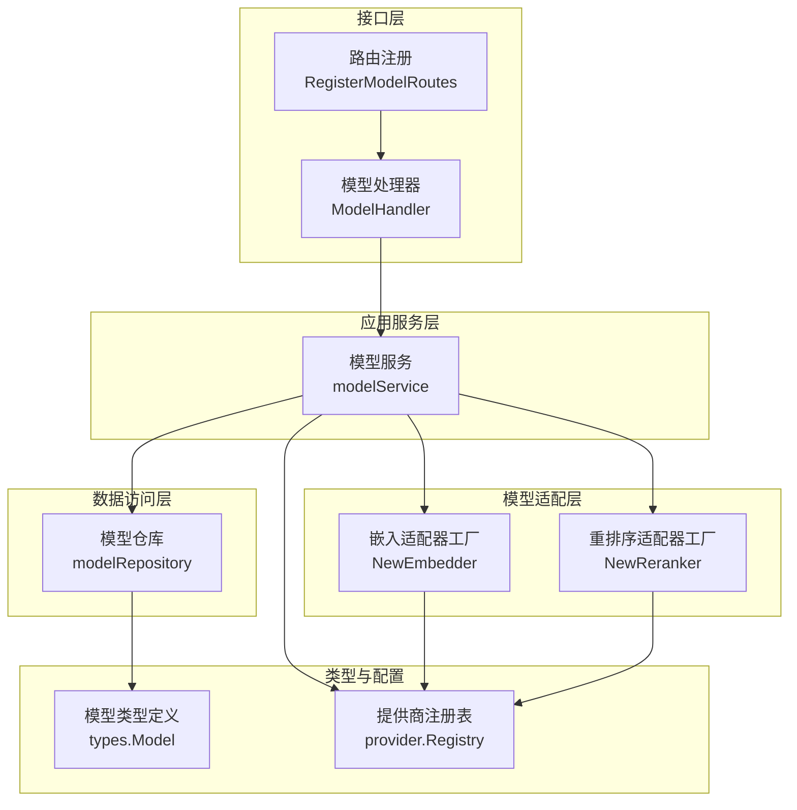
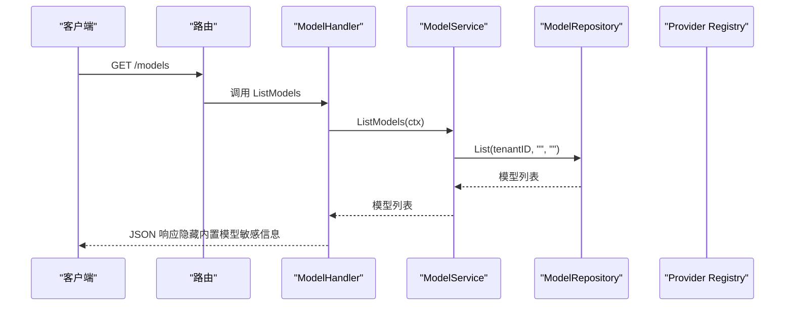
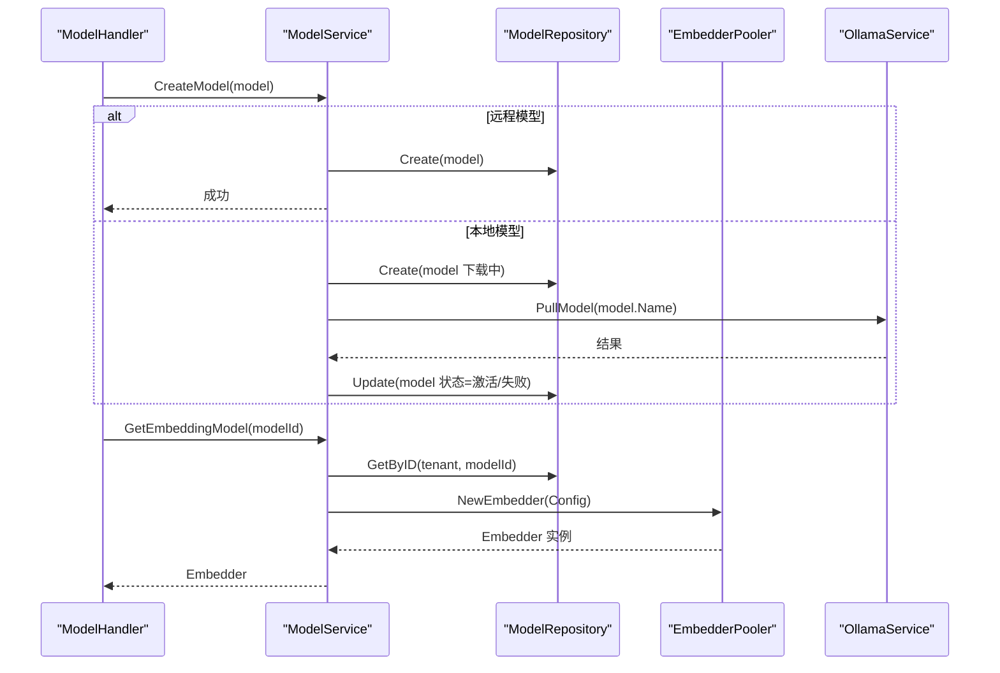
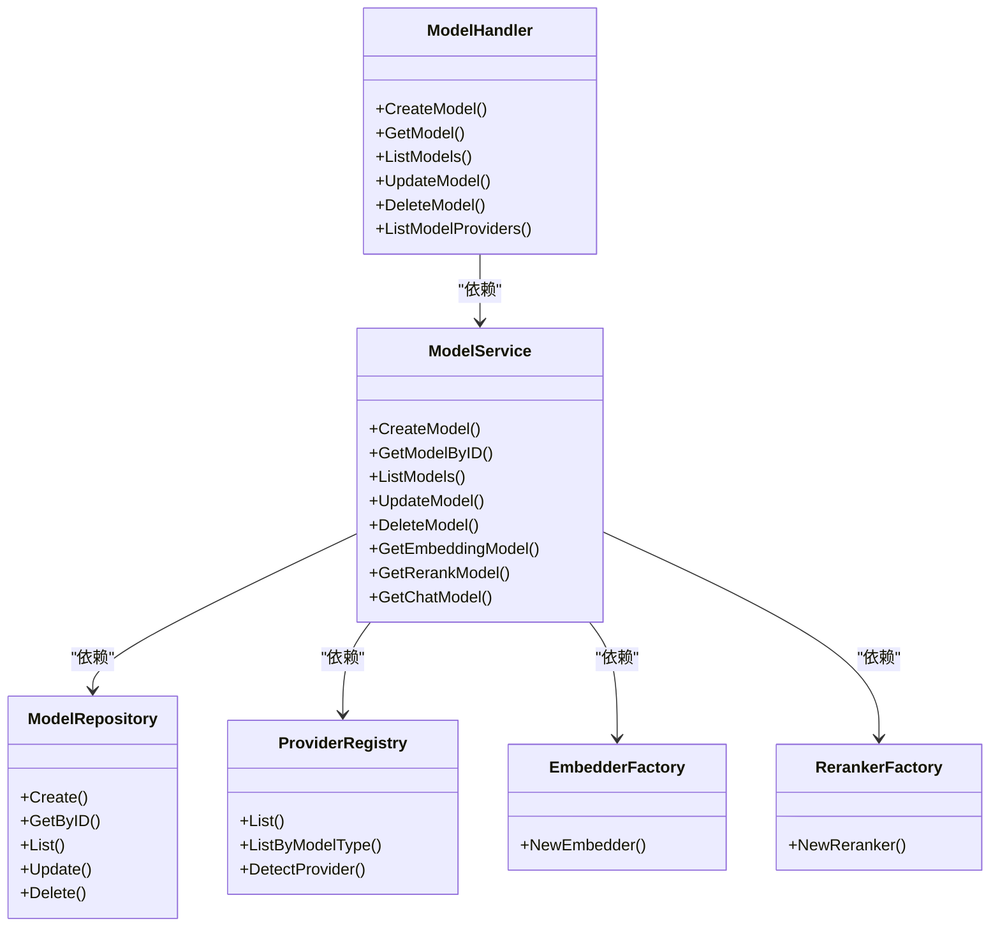

# 模型API

<cite>
**本文档引用的文件**
- [internal/handler/model.go](file://internal/handler/model.go)
- [internal/application/service/model.go](file://internal/application/service/model.go)
- [internal/application/repository/model.go](file://internal/application/repository/model.go)
- [internal/types/model.go](file://internal/types/model.go)
- [internal/models/provider/provider.go](file://internal/models/provider/provider.go)
- [internal/models/embedding/embedder.go](file://internal/models/embedding/embedder.go)
- [internal/models/rerank/reranker.go](file://internal/models/rerank/reranker.go)
- [internal/router/router.go](file://internal/router/router.go)
- [client/model.go](file://client/model.go)
- [docs/BUILTIN_MODELS.md](file://docs/BUILTIN_MODELS.md)
- [internal/application/service/metric_hook.go](file://internal/application/service/metric_hook.go)
- [internal/types/evaluation.go](file://internal/types/evaluation.go)
- [internal/application/service/session.go](file://internal/application/service/session.go)
</cite>

## 目录
1. [简介](#简介)
2. [项目结构](#项目结构)
3. [核心组件](#核心组件)
4. [架构总览](#架构总览)
5. [详细组件分析](#详细组件分析)
6. [依赖关系分析](#依赖关系分析)
7. [性能考虑](#性能考虑)
8. [故障排查指南](#故障排查指南)
9. [结论](#结论)
10. [附录](#附录)

## 简介
本文件系统化梳理模型API模块的设计与实现，覆盖以下关键主题：
- 可用模型列表获取、模型配置查询、模型切换与更新
- 不同类型模型（LLM、嵌入、重排序器）的API调用方式与参数配置
- 模型性能监控（响应时间、吞吐量、错误率等指标）
- 模型选择最佳实践（按任务类型选择模型、成本优化策略）
- 模型配置的动态更新与热切换机制
- 模型提供商的集成方式与认证配置

## 项目结构
模型API模块围绕“处理器-服务-仓库-类型-模型适配层”分层设计，配合路由注册与客户端封装，形成完整的REST接口体系。



图表来源
- [internal/router/router.go](file://internal/router/router.go#L316-L334)
- [internal/handler/model.go](file://internal/handler/model.go#L16-L30)
- [internal/application/service/model.go](file://internal/application/service/model.go#L19-L33)
- [internal/application/repository/model.go](file://internal/application/repository/model.go#L12-L20)
- [internal/types/model.go](file://internal/types/model.go#L67-L95)
- [internal/models/provider/provider.go](file://internal/models/provider/provider.go#L139-L183)
- [internal/models/embedding/embedder.go](file://internal/models/embedding/embedder.go#L52-L144)
- [internal/models/rerank/reranker.go](file://internal/models/rerank/reranker.go#L89-L108)

章节来源
- [internal/router/router.go](file://internal/router/router.go#L316-L334)
- [internal/handler/model.go](file://internal/handler/model.go#L16-L30)
- [internal/application/service/model.go](file://internal/application/service/model.go#L19-L33)
- [internal/application/repository/model.go](file://internal/application/repository/model.go#L12-L20)
- [internal/types/model.go](file://internal/types/model.go#L67-L95)
- [internal/models/provider/provider.go](file://internal/models/provider/provider.go#L139-L183)
- [internal/models/embedding/embedder.go](file://internal/models/embedding/embedder.go#L52-L144)
- [internal/models/rerank/reranker.go](file://internal/models/rerank/reranker.go#L89-L108)

## 核心组件
- 模型处理器（ModelHandler）：负责接收HTTP请求、参数校验、调用服务层、返回响应；内置敏感信息隐藏逻辑（对内置模型隐藏APIKey/BaseURL）。
- 模型服务（modelService）：封装业务逻辑，包括模型创建（本地/远程）、状态检查、查询与更新；提供嵌入、重排序、聊天模型实例化。
- 模型仓库（modelRepository）：基于GORM实现的持久化层，支持按租户与内置模型可见性查询、更新、删除。
- 类型与配置（types.Model）：统一的模型数据结构，包含类型、来源、状态、参数（含嵌入维度、截断策略、提供商等）。
- 提供商注册表（provider.Registry）：集中管理多家模型提供商（OpenAI、阿里云、智谱、Jina等），支持检测与默认URL映射。
- 模型适配层：嵌入适配器工厂（NewEmbedder）与重排序适配器工厂（NewReranker）根据提供商与来源路由到具体实现。

章节来源
- [internal/handler/model.go](file://internal/handler/model.go#L16-L30)
- [internal/application/service/model.go](file://internal/application/service/model.go#L19-L33)
- [internal/application/repository/model.go](file://internal/application/repository/model.go#L12-L20)
- [internal/types/model.go](file://internal/types/model.go#L67-L95)
- [internal/models/provider/provider.go](file://internal/models/provider/provider.go#L139-L183)
- [internal/models/embedding/embedder.go](file://internal/models/embedding/embedder.go#L52-L144)
- [internal/models/rerank/reranker.go](file://internal/models/rerank/reranker.go#L89-L108)

## 架构总览
模型API采用清晰的分层与职责分离：
- 接口层：路由注册模型相关端点，绑定处理器方法。
- 处理器层：参数解析、上下文注入、日志记录、错误处理、响应封装。
- 服务层：业务编排，状态校验，实例化模型适配器，调用外部提供商。
- 数据层：统一的模型实体与仓储接口，支持内置模型可见性规则。
- 适配层：按提供商与来源选择具体实现，屏蔽外部差异。



图表来源
- [internal/router/router.go](file://internal/router/router.go#L316-L334)
- [internal/handler/model.go](file://internal/handler/model.go#L187-L232)
- [internal/application/service/model.go](file://internal/application/service/model.go#L146-L164)
- [internal/application/repository/model.go](file://internal/application/repository/model.go#L41-L63)
- [internal/models/provider/provider.go](file://internal/models/provider/provider.go#L171-L183)

## 详细组件分析

### 模型处理器（ModelHandler）
- 职责：暴露REST端点，进行参数绑定与校验，调用服务层，返回标准化响应；对内置模型隐藏敏感信息。
- 关键端点：
  - GET /models：获取当前租户的模型列表（内置模型可见，敏感信息隐藏）
  - GET /models/{id}：按ID获取模型详情（内置模型敏感信息隐藏）
  - POST /models：创建模型（远程模型立即激活，本地模型进入下载状态）
  - PUT /models/{id}：更新模型（内置模型不可更新）
  - DELETE /models/{id}：删除模型（内置模型不可删除）
  - GET /models/providers：按模型类型获取支持的提供商列表（前端友好映射）

```mermaid
flowchart TD
Start(["请求进入"]) --> Bind["绑定与校验请求参数"]
Bind --> Route{"路由到哪个方法？"}
Route --> |GET /models| List["ListModels"]
Route --> |GET /models/{id}| Get["GetModel"]
Route --> |POST /models| Create["CreateModel"]
Route --> |PUT /models/{id}| Update["UpdateModel"]
Route --> |DELETE /models/{id}| Delete["DeleteModel"]
Route --> |GET /models/providers| Providers["ListModelProviders"]
List --> RepoList["仓库查询模型列表"]
Get --> RepoGet["仓库按ID查询"]
Create --> Save["保存模型"]
Update --> Upd["更新模型"]
Delete --> Del["删除模型"]
Providers --> ProvList["提供商注册表查询"]
RepoList --> Resp["返回JSON响应"]
RepoGet --> Resp
Save --> Resp
Upd --> Resp
Del --> Resp
ProvList --> Resp
```

图表来源
- [internal/handler/model.go](file://internal/handler/model.go#L187-L232)
- [internal/handler/model.go](file://internal/handler/model.go#L388-L462)
- [internal/application/repository/model.go](file://internal/application/repository/model.go#L41-L63)
- [internal/models/provider/provider.go](file://internal/models/provider/provider.go#L171-L183)

章节来源
- [internal/handler/model.go](file://internal/handler/model.go#L187-L232)
- [internal/handler/model.go](file://internal/handler/model.go#L388-L462)

### 模型服务（modelService）
- 职责：业务编排与状态管理；实例化嵌入、重排序、聊天模型；处理本地模型异步下载与状态更新。
- 关键流程：
  - CreateModel：远程模型直接激活；本地模型保存为下载中并启动后台拉取。
  - GetModelByID：校验ID与租户，检查状态（仅活跃模型可使用）。
  - GetEmbeddingModel/GetRerankModel/GetChatModel：根据模型配置构造具体适配器实例。
  - UpdateModel/DeleteModel：内置模型保护（不可更新/删除）。



图表来源
- [internal/application/service/model.go](file://internal/application/service/model.go#L35-L95)
- [internal/application/service/model.go](file://internal/application/service/model.go#L234-L269)
- [internal/application/service/model.go](file://internal/application/service/model.go#L271-L303)
- [internal/application/service/model.go](file://internal/application/service/model.go#L305-L350)

章节来源
- [internal/application/service/model.go](file://internal/application/service/model.go#L35-L95)
- [internal/application/service/model.go](file://internal/application/service/model.go#L234-L269)
- [internal/application/service/model.go](file://internal/application/service/model.go#L271-L303)
- [internal/application/service/model.go](file://internal/application/service/model.go#L305-L350)

### 模型仓库（modelRepository）
- 职责：统一的数据访问接口，支持按租户与内置模型可见性查询；提供批量清除默认标记等辅助操作。
- 关键点：内置模型对所有租户可见（where tenant_id=? OR is_builtin=true）。

章节来源
- [internal/application/repository/model.go](file://internal/application/repository/model.go#L27-L39)
- [internal/application/repository/model.go](file://internal/application/repository/model.go#L41-L63)

### 类型与配置（types.Model）
- 职责：统一的模型数据结构，包含类型（Embedding/Rerank/KnowledgeQA/VLLM）、来源（local/remote/各提供商）、状态（active/downloading/download_failed）、参数（BaseURL/APIKey/Provider/EmbeddingParameters等）。
- 特性：内置模型（IsBuiltin）不可编辑/删除；敏感信息在处理器层隐藏。

章节来源
- [internal/types/model.go](file://internal/types/model.go#L12-L29)
- [internal/types/model.go](file://internal/types/model.go#L57-L65)
- [internal/types/model.go](file://internal/types/model.go#L67-L95)

### 提供商注册与检测（provider.Registry）
- 职责：集中管理多家提供商，提供检测与默认URL映射；支持按模型类型筛选。
- 关键点：DetectProvider通过URL关键字识别提供商；NewConfigFromModel从模型生成配置。

章节来源
- [internal/models/provider/provider.go](file://internal/models/provider/provider.go#L139-L183)
- [internal/models/provider/provider.go](file://internal/models/provider/provider.go#L205-L249)
- [internal/models/provider/provider.go](file://internal/models/provider/provider.go#L260-L277)

### 模型适配层（嵌入/重排序）
- 嵌入适配器工厂（NewEmbedder）：根据来源（local/remote）与提供商（Aliyun/Jina/OpenAI等）路由到具体实现；支持多模态嵌入与兼容模式自动修正。
- 重排序适配器工厂（NewReranker）：根据提供商（Aliyun/Zhipu/Jina/OpenAI）选择实现。

章节来源
- [internal/models/embedding/embedder.go](file://internal/models/embedding/embedder.go#L52-L144)
- [internal/models/rerank/reranker.go](file://internal/models/rerank/reranker.go#L89-L108)

### 内置模型与安全
- 内置模型对所有租户可见，但敏感信息（APIKey/BaseURL）在处理器层隐藏；内置模型不可编辑/删除。
- 文档提供了内置模型的SQL插入示例与注意事项。

章节来源
- [internal/handler/model.go](file://internal/handler/model.go#L32-L60)
- [docs/BUILTIN_MODELS.md](file://docs/BUILTIN_MODELS.md#L1-L176)

### 模型切换与热更新
- 服务层提供按需实例化模型的能力，结合前端设置界面与会话服务，可在运行时切换模型ID并生效。
- 会话服务支持请求级覆盖模型ID优先于会话/知识库默认模型。

章节来源
- [internal/application/service/session.go](file://internal/application/service/session.go#L684-L717)

## 依赖关系分析
- 处理器依赖服务接口；服务依赖仓库接口、提供商注册表、嵌入池与Ollama服务。
- 适配器工厂依赖提供商注册表与URL检测逻辑。
- 路由层将HTTP端点与处理器方法绑定。



图表来源
- [internal/handler/model.go](file://internal/handler/model.go#L16-L30)
- [internal/application/service/model.go](file://internal/application/service/model.go#L19-L33)
- [internal/application/repository/model.go](file://internal/application/repository/model.go#L12-L20)
- [internal/models/provider/provider.go](file://internal/models/provider/provider.go#L139-L183)
- [internal/models/embedding/embedder.go](file://internal/models/embedding/embedder.go#L52-L144)
- [internal/models/rerank/reranker.go](file://internal/models/rerank/reranker.go#L89-L108)

章节来源
- [internal/handler/model.go](file://internal/handler/model.go#L16-L30)
- [internal/application/service/model.go](file://internal/application/service/model.go#L19-L33)
- [internal/application/repository/model.go](file://internal/application/repository/model.go#L12-L20)
- [internal/models/provider/provider.go](file://internal/models/provider/provider.go#L139-L183)
- [internal/models/embedding/embedder.go](file://internal/models/embedding/embedder.go#L52-L144)
- [internal/models/rerank/reranker.go](file://internal/models/rerank/reranker.go#L89-L108)

## 性能考虑
- 响应时间与吞吐量
  - 远程模型：受外部提供商延迟影响，建议在适配层增加超时与重试策略（如适用）。
  - 本地模型：首次拉取耗时较长，服务层已异步处理状态更新，前端应避免阻塞等待。
- 错误率与稳定性
  - 服务层对模型状态进行严格校验（仅活跃模型可用），减少无效调用导致的错误。
  - 处理器层对敏感信息隐藏，降低泄露风险。
- 成本优化
  - 嵌入适配器对多模态模型与文本模型采用不同端点/兼容模式，避免错误响应与无效调用。
  - 提供商默认URL与检测逻辑减少配置错误带来的失败。

[本节为通用指导，不直接分析具体文件]

## 故障排查指南
- 常见错误与定位
  - 请求参数错误：处理器在参数绑定失败时返回400。
  - 模型不存在：仓库查询不到模型或状态非活跃时返回相应错误。
  - 内置模型保护：尝试更新/删除内置模型将被拒绝。
- 日志与追踪
  - 处理器与服务层均记录关键操作日志与错误上下文，便于定位问题。
- 建议排查步骤
  - 确认模型状态为active后再调用。
  - 检查提供商URL与APIKey配置是否正确。
  - 对本地模型确认下载状态与后台任务执行情况。

章节来源
- [internal/handler/model.go](file://internal/handler/model.go#L84-L134)
- [internal/application/service/model.go](file://internal/application/service/model.go#L97-L144)
- [internal/application/repository/model.go](file://internal/application/repository/model.go#L27-L39)

## 结论
模型API模块通过清晰的分层设计与严格的模型状态管理，实现了对多种模型类型与提供商的统一接入。内置模型的安全保护、敏感信息隐藏与动态实例化能力，为实际生产环境提供了稳定与可控的模型管理方案。结合性能监控与最佳实践，可在保证质量的同时优化成本与响应表现。

[本节为总结性内容，不直接分析具体文件]

## 附录

### API端点一览（后端）
- GET /models：获取当前租户的模型列表（内置模型可见，敏感信息隐藏）
- GET /models/{id}：按ID获取模型详情（内置模型敏感信息隐藏）
- POST /models：创建模型（远程模型立即激活；本地模型进入下载状态）
- PUT /models/{id}：更新模型（内置模型不可更新）
- DELETE /models/{id}：删除模型（内置模型不可删除）
- GET /models/providers：按模型类型获取支持的提供商列表（前端友好映射）

章节来源
- [internal/router/router.go](file://internal/router/router.go#L316-L334)
- [internal/handler/model.go](file://internal/handler/model.go#L187-L232)
- [internal/handler/model.go](file://internal/handler/model.go#L388-L462)

### 客户端调用示例（Go）
- CreateModel/GetModel/ListModels/UpdateModel/DeleteModel：客户端封装了标准的REST调用与响应解析。

章节来源
- [client/model.go](file://client/model.go#L79-L155)

### 模型性能监控与评估
- 评估指标：检索精度、召回、NDCG、MRR、MAP以及生成BLEU、ROUGE等指标。
- 计算与聚合：HookMetric与MetricList负责收集与平均化指标结果。

章节来源
- [internal/application/service/metric_hook.go](file://internal/application/service/metric_hook.go#L18-L50)
- [internal/application/service/metric_hook.go](file://internal/application/service/metric_hook.go#L52-L82)
- [internal/types/evaluation.go](file://internal/types/evaluation.go#L50-L68)

### 模型选择最佳实践
- 任务类型与模型类型匹配：问答/推理使用KnowledgeQA/VLLM，向量化使用Embedding，排序使用Rerank。
- 成本优化：优先选择与业务规模匹配的提供商与模型尺寸；利用批处理与缓存降低调用次数。
- 动态切换：通过会话服务与前端设置实现运行时模型切换，确保一致性与可追溯性。

章节来源
- [internal/types/model.go](file://internal/types/model.go#L12-L20)
- [internal/application/service/session.go](file://internal/application/service/session.go#L684-L717)