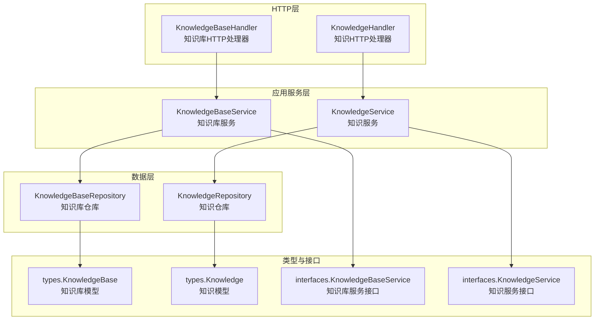
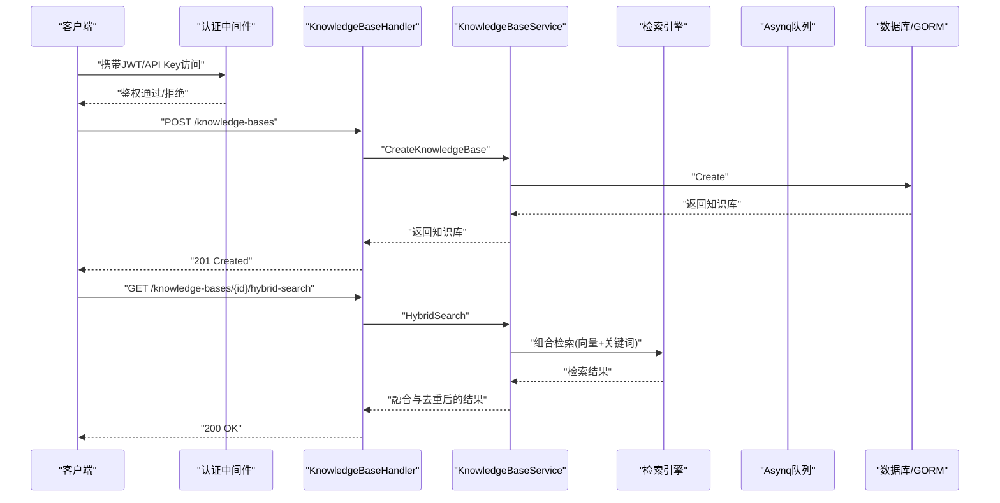
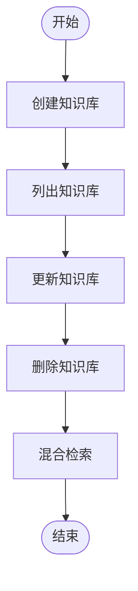
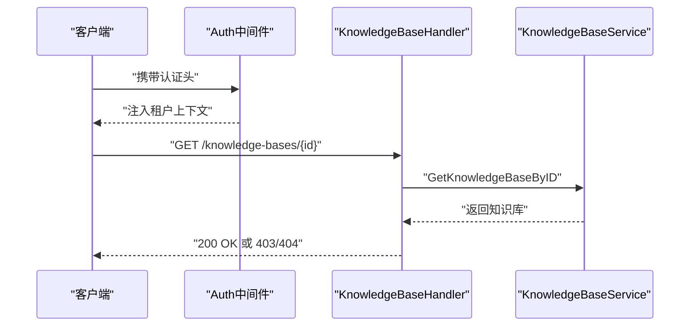
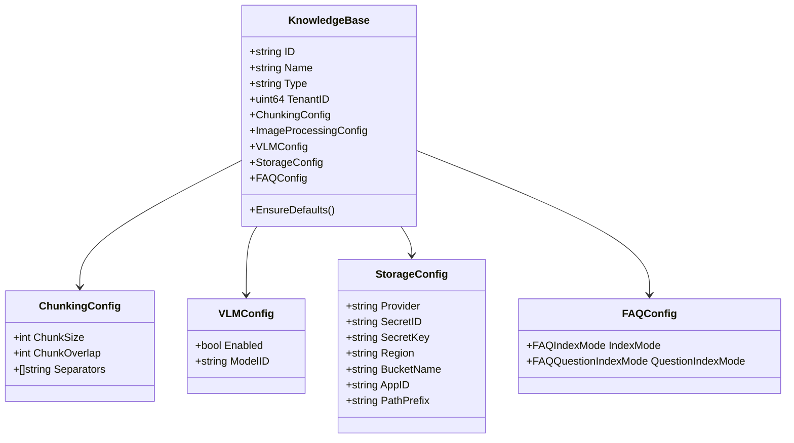
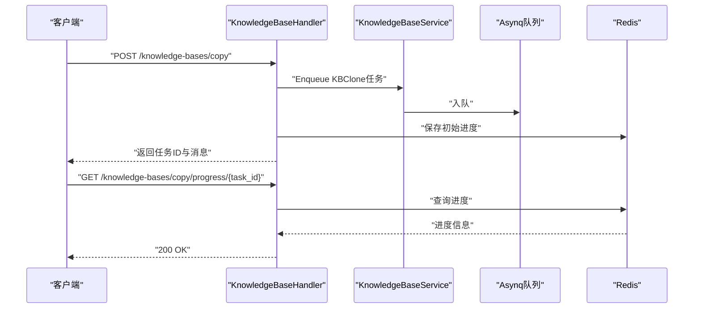
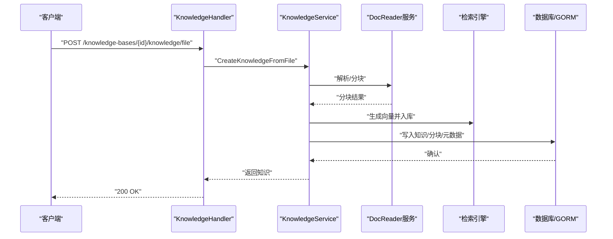
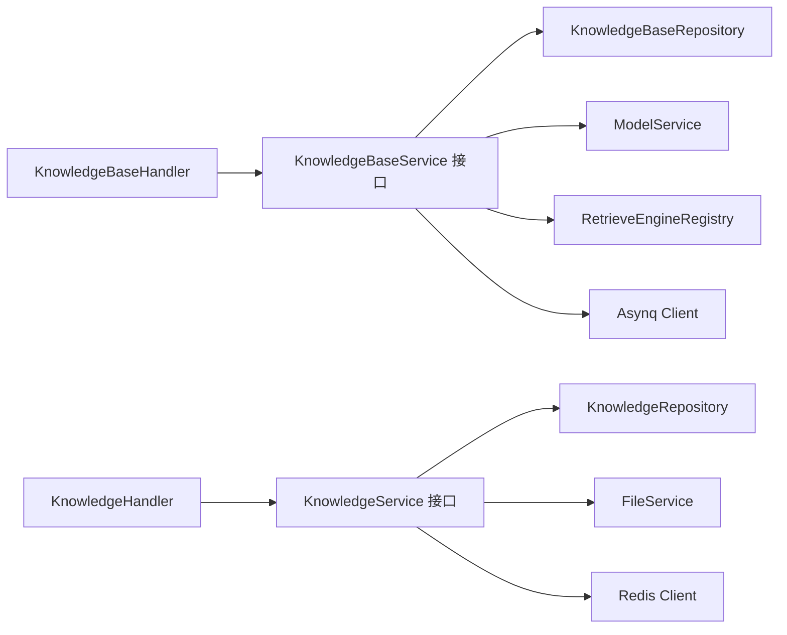

# 知识库API

<cite>
**本文引用的文件**
- [internal/handler/knowledgebase.go](file://internal/handler/knowledgebase.go)
- [internal/application/service/knowledgebase.go](file://internal/application/service/knowledgebase.go)
- [internal/application/repository/knowledgebase.go](file://internal/application/repository/knowledgebase.go)
- [internal/types/interfaces/knowledgebase.go](file://internal/types/interfaces/knowledgebase.go)
- [internal/types/knowledgebase.go](file://internal/types/knowledgebase.go)
- [client/knowledgebase.go](file://client/knowledgebase.go)
- [docs/api/knowledge-base.md](file://docs/api/knowledge-base.md)
- [docs/api/knowledge-search.md](file://docs/api/knowledge-search.md)
- [internal/middleware/auth.go](file://internal/middleware/auth.go)
- [internal/handler/knowledge.go](file://internal/handler/knowledge.go)
- [internal/application/service/knowledge.go](file://internal/application/service/knowledge.go)
- [internal/types/knowledge.go](file://internal/types/knowledge.go)
- [internal/types/retriever.go](file://internal/types/retriever.go)
- [internal/types/model.go](file://internal/types/model.go)
- [frontend/src/views/settings/ModelSettings.vue](file://frontend/src/views/settings/ModelSettings.vue)
- [frontend/src/components/ModelEditorDialog.vue](file://frontend/src/components/ModelEditorDialog.vue)
</cite>

## 目录
1. [简介](#简介)
2. [项目结构](#项目结构)
3. [核心组件](#核心组件)
4. [架构总览](#架构总览)
5. [详细组件分析](#详细组件分析)
6. [依赖关系分析](#依赖关系分析)
7. [性能考量](#性能考量)
8. [故障排查指南](#故障排查指南)
9. [结论](#结论)
10. [附录](#附录)

## 简介
本文件系统性梳理知识库API模块，覆盖知识库的CRUD操作、权限与访问控制、配置参数（分片策略、嵌入模型、检索参数）、列表管理与搜索过滤、状态监控与进度跟踪、以及与文档上传、解析、嵌入的完整流程集成。文档同时提供面向开发与非技术读者的双层说明，并通过图示展示关键调用链路。

## 项目结构
知识库API位于后端Go服务的HTTP层、应用服务层与数据持久层之间，采用清晰的分层设计：
- HTTP层：接收请求、参数校验、鉴权与错误处理
- 应用服务层：业务编排、检索引擎组合、异步任务调度
- 数据层：GORM仓库实现知识库与知识实体的持久化
- 类型与接口：统一的数据结构与服务契约
- 客户端SDK：提供与后端API交互的客户端封装
- 文档与前端：API使用示例与模型配置界面

图表来源
- [internal/handler/knowledgebase.go](file://internal/handler/knowledgebase.go#L1-L536)
- [internal/handler/knowledge.go](file://internal/handler/knowledge.go#L1-L200)
- [internal/application/service/knowledgebase.go](file://internal/application/service/knowledgebase.go#L1-L800)
- [internal/application/service/knowledge.go](file://internal/application/service/knowledge.go#L1-L200)
- [internal/application/repository/knowledgebase.go](file://internal/application/repository/knowledgebase.go#L1-L83)
- [internal/types/interfaces/knowledgebase.go](file://internal/types/interfaces/knowledgebase.go#L1-L165)
- [internal/types/knowledgebase.go](file://internal/types/knowledgebase.go#L1-L348)
- [internal/types/knowledge.go](file://internal/types/knowledge.go#L1-L200)

章节来源
- [internal/handler/knowledgebase.go](file://internal/handler/knowledgebase.go#L1-L536)
- [internal/application/service/knowledgebase.go](file://internal/application/service/knowledgebase.go#L1-L800)
- [internal/application/repository/knowledgebase.go](file://internal/application/repository/knowledgebase.go#L1-L83)
- [internal/types/interfaces/knowledgebase.go](file://internal/types/interfaces/knowledgebase.go#L1-L165)
- [internal/types/knowledgebase.go](file://internal/types/knowledgebase.go#L1-L348)

## 核心组件
- 知识库HTTP处理器：负责知识库CRUD、混合检索、复制与进度查询等接口
- 知识库服务：实现知识库生命周期管理、混合检索、异步删除与复制
- 知识HTTP处理器：负责文件上传、手工知识创建、列表与过滤
- 知识服务：编排文档解析、分块、嵌入、索引与检索
- 仓库层：基于GORM实现知识库与知识实体的增删改查
- 类型与接口：统一知识库、知识、检索参数与服务契约
- 客户端SDK：封装知识库与知识的API调用

章节来源
- [internal/handler/knowledgebase.go](file://internal/handler/knowledgebase.go#L1-L536)
- [internal/application/service/knowledgebase.go](file://internal/application/service/knowledgebase.go#L1-L800)
- [internal/handler/knowledge.go](file://internal/handler/knowledge.go#L1-L200)
- [internal/application/service/knowledge.go](file://internal/application/service/knowledge.go#L1-L200)
- [internal/types/interfaces/knowledgebase.go](file://internal/types/interfaces/knowledgebase.go#L1-L165)
- [client/knowledgebase.go](file://client/knowledgebase.go#L1-L328)

## 架构总览
下图展示了知识库API的端到端调用链：HTTP层接收请求，鉴权后进入服务层，服务层组合检索引擎与异步队列，最终由仓库层持久化。

图表来源
- [internal/handler/knowledgebase.go](file://internal/handler/knowledgebase.go#L39-L90)
- [internal/application/service/knowledgebase.go](file://internal/application/service/knowledgebase.go#L486-L748)
- [internal/middleware/auth.go](file://internal/middleware/auth.go#L59-L196)

## 详细组件分析

### 知识库CRUD与混合检索
- 创建知识库：校验请求体与抽取配置，生成默认值，写入数据库
- 查询知识库：按租户ID列出，补充知识/分块计数与处理状态
- 更新知识库：更新名称、描述与配置（分片、图像处理、FAQ配置）
- 删除知识库：标记删除并异步清理嵌入、分块、文件与图谱数据
- 混合检索：根据知识库类型与配置选择向量/关键词检索，支持阈值与TopK，FAQ场景使用负向问题过滤与迭代检索

图表来源
- [internal/handler/knowledgebase.go](file://internal/handler/knowledgebase.go#L92-L330)
- [internal/application/service/knowledgebase.go](file://internal/application/service/knowledgebase.go#L70-L269)
- [internal/application/service/knowledgebase.go](file://internal/application/service/knowledgebase.go#L486-L748)

章节来源
- [internal/handler/knowledgebase.go](file://internal/handler/knowledgebase.go#L92-L330)
- [internal/application/service/knowledgebase.go](file://internal/application/service/knowledgebase.go#L70-L269)
- [internal/application/service/knowledgebase.go](file://internal/application/service/knowledgebase.go#L486-L748)
- [docs/api/knowledge-base.md](file://docs/api/knowledge-base.md#L1-L371)

### 权限管理与访问控制
- 租户隔离：所有请求通过认证中间件注入租户上下文
- 知识库访问校验：读取知识库并比对租户ID，防止越权访问
- API鉴权：支持Bearer Token与X-API-Key两种方式
- 跨租户访问：在配置允许且用户具备权限时，可通过请求头切换目标租户

图表来源
- [internal/middleware/auth.go](file://internal/middleware/auth.go#L59-L196)
- [internal/handler/knowledgebase.go](file://internal/handler/knowledgebase.go#L139-L177)
- [internal/handler/knowledge.go](file://internal/handler/knowledge.go#L33-L65)

章节来源
- [internal/middleware/auth.go](file://internal/middleware/auth.go#L18-L57)
- [internal/middleware/auth.go](file://internal/middleware/auth.go#L59-L196)
- [internal/handler/knowledgebase.go](file://internal/handler/knowledgebase.go#L139-L177)
- [internal/handler/knowledge.go](file://internal/handler/knowledge.go#L33-L65)

### 配置参数与模型
- 分片策略：chunk_size、chunk_overlap、separators
- 嵌入模型：通过知识库配置绑定嵌入模型ID，检索时按模型维度生成向量
- 检索参数：向量阈值、关键词阈值、匹配数量、禁用开关
- FAQ配置：索引模式（仅问题/问题+答案）、问题索引模式（合并/分离）
- 多模态：VLM配置与对象存储配置，用于图片解析与上传

图表来源
- [internal/types/knowledgebase.go](file://internal/types/knowledgebase.go#L38-L84)
- [internal/types/knowledgebase.go](file://internal/types/knowledgebase.go#L96-L124)
- [internal/types/knowledgebase.go](file://internal/types/knowledgebase.go#L181-L195)
- [internal/types/knowledgebase.go](file://internal/types/knowledgebase.go#L108-L124)
- [internal/types/knowledgebase.go](file://internal/types/knowledgebase.go#L281-L285)

章节来源
- [internal/types/knowledgebase.go](file://internal/types/knowledgebase.go#L1-L348)
- [internal/types/retriever.go](file://internal/types/retriever.go#L25-L59)
- [internal/types/model.go](file://internal/types/model.go#L57-L65)
- [frontend/src/views/settings/ModelSettings.vue](file://frontend/src/views/settings/ModelSettings.vue#L76-L124)
- [frontend/src/components/ModelEditorDialog.vue](file://frontend/src/components/ModelEditorDialog.vue#L203-L234)

### 列表管理、搜索过滤与排序
- 列表：按租户ID列出知识库，支持按创建时间倒序
- 搜索：支持按标签、关键词、文件类型过滤，分页参数
- 排序：默认按创建时间倒序
- 多知识库搜索：支持传入知识库ID列表进行聚合检索

章节来源
- [internal/application/service/knowledgebase.go](file://internal/application/service/knowledgebase.go#L116-L170)
- [internal/handler/knowledge.go](file://internal/handler/knowledge.go#L389-L428)
- [docs/api/knowledge-search.md](file://docs/api/knowledge-search.md#L1-L75)

### 状态监控、导入进度跟踪与错误处理
- 导入进度：复制知识库异步任务通过Redis保存初始进度，前端轮询获取
- 错误处理：统一错误类型与状态码，记录日志并返回友好提示
- 异步任务：删除与复制使用Asynq队列，失败重试与幂等处理

图表来源
- [internal/handler/knowledgebase.go](file://internal/handler/knowledgebase.go#L358-L469)
- [internal/application/service/knowledgebase.go](file://internal/application/service/knowledgebase.go#L440-L484)

章节来源
- [internal/handler/knowledgebase.go](file://internal/handler/knowledgebase.go#L358-L469)
- [client/knowledgebase.go](file://client/knowledgebase.go#L155-L168)

### 与文档上传、解析、嵌入的完整流程集成
- 文件上传：支持多模态校验（图片需对象存储与VLM配置）
- 解析与分块：调用docreader服务，生成分块与元数据
- 嵌入与索引：按知识库嵌入模型生成向量并写入检索引擎
- 图谱与存储：可选图谱构建与对象存储文件管理

图表来源
- [internal/handler/knowledge.go](file://internal/handler/knowledge.go#L86-L200)
- [internal/application/service/knowledge.go](file://internal/application/service/knowledge.go#L143-L200)

章节来源
- [internal/handler/knowledge.go](file://internal/handler/knowledge.go#L86-L200)
- [internal/application/service/knowledge.go](file://internal/application/service/knowledge.go#L143-L200)
- [internal/types/knowledge.go](file://internal/types/knowledge.go#L54-L110)

## 依赖关系分析
- Handler依赖Service接口，解耦具体实现
- Service依赖Repository与外部服务（检索引擎、模型服务、文件服务、Asynq、Redis）
- 类型层提供统一的数据结构与默认值保证
- 客户端SDK封装请求与响应结构，便于前端与第三方集成

图表来源
- [internal/handler/knowledgebase.go](file://internal/handler/knowledgebase.go#L19-L37)
- [internal/handler/knowledge.go](file://internal/handler/knowledge.go#L19-L31)
- [internal/application/service/knowledgebase.go](file://internal/application/service/knowledgebase.go#L24-L57)
- [internal/application/service/knowledge.go](file://internal/application/service/knowledge.go#L55-L116)
- [internal/types/interfaces/knowledgebase.go](file://internal/types/interfaces/knowledgebase.go#L14-L100)

章节来源
- [internal/types/interfaces/knowledgebase.go](file://internal/types/interfaces/knowledgebase.go#L1-L165)
- [internal/application/repository/knowledgebase.go](file://internal/application/repository/knowledgebase.go#L1-L83)

## 性能考量
- 检索融合：FAQ场景使用负向问题过滤与迭代检索，避免召回不足
- 结果去重：按ChunkID去重，FAQ场景保留最高分数
- RRF融合：向量与关键词结果使用Reciprocal Rank Fusion融合，提升排序稳定性
- 异步处理：删除与复制走队列，避免阻塞主流程
- 缓存与预取：FAQ迭代检索中缓存分块数据，减少重复查询

章节来源
- [internal/application/service/knowledgebase.go](file://internal/application/service/knowledgebase.go#L642-L748)

## 故障排查指南
- 401/403：检查认证头与租户上下文，确认API Key或JWT有效
- 400：请求参数校验失败，检查请求体字段与必填项
- 404：知识库不存在或已删除
- 409：文件重复，返回现有知识对象
- 500：服务内部错误，查看日志定位具体环节

章节来源
- [internal/handler/knowledgebase.go](file://internal/handler/knowledgebase.go#L52-L82)
- [internal/handler/knowledge.go](file://internal/handler/knowledge.go#L67-L84)
- [internal/middleware/auth.go](file://internal/middleware/auth.go#L193-L196)

## 结论
知识库API模块通过清晰的分层设计与接口契约，实现了从创建、查询、更新、删除到混合检索与异步任务的完整能力。结合严格的权限控制与完善的配置体系，能够满足多租户场景下的知识管理需求。建议在生产环境关注异步任务监控、检索融合策略与多模态配置的完备性。

## 附录
- API使用示例参考：[知识库管理API](file://docs/api/knowledge-base.md#L1-L371)、[知识搜索API](file://docs/api/knowledge-search.md#L1-L75)
- 客户端SDK：[知识库客户端](file://client/knowledgebase.go#L1-L328)