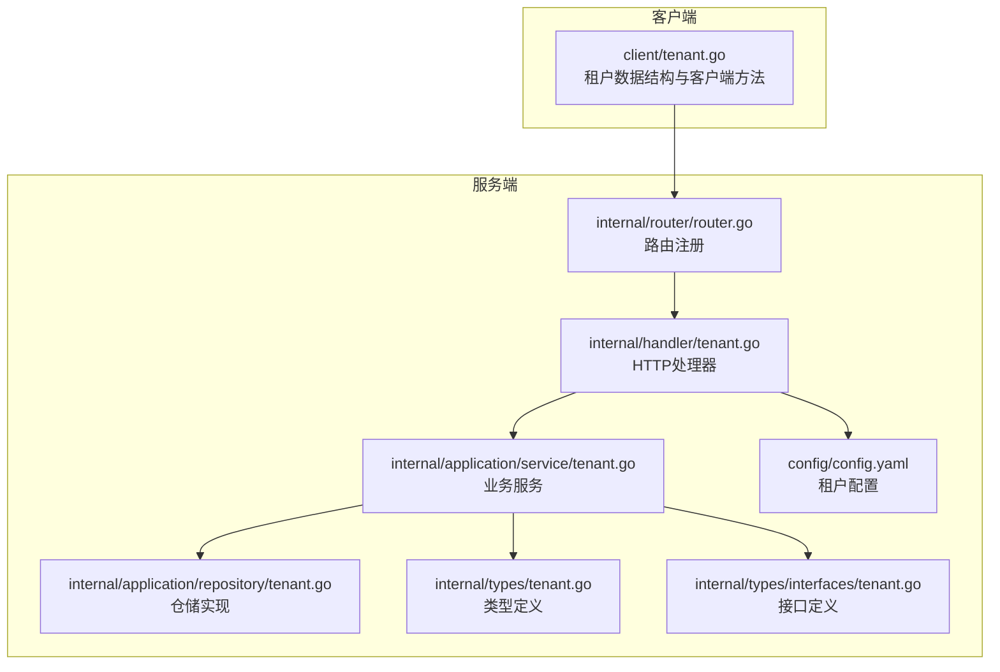
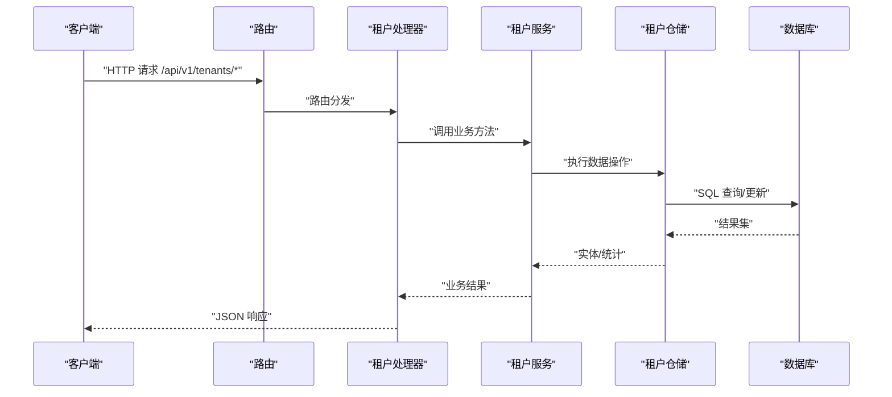
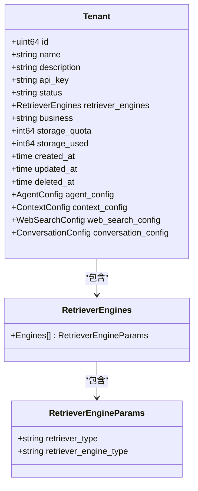
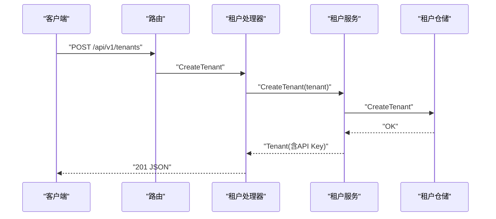
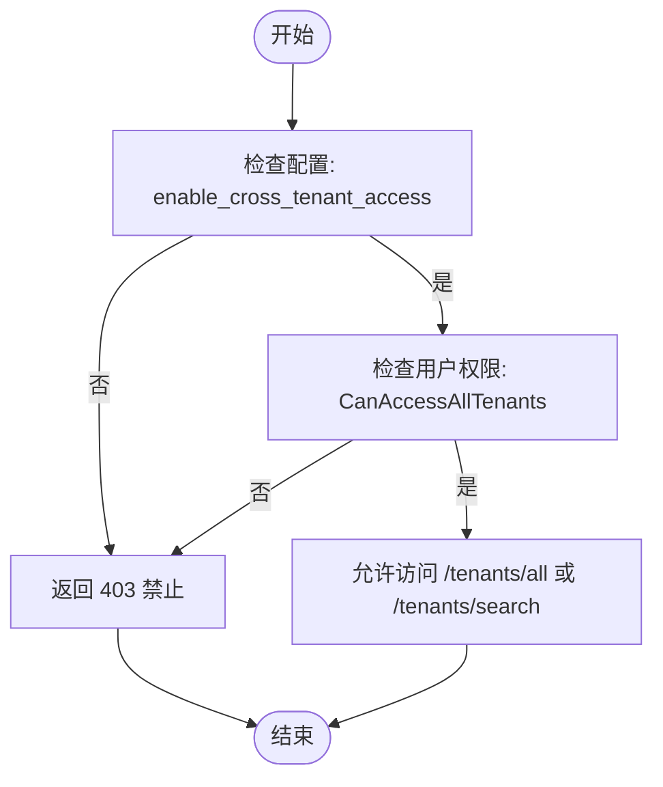
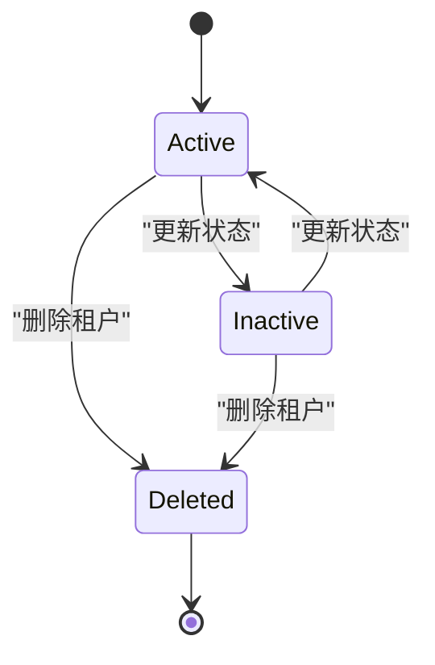
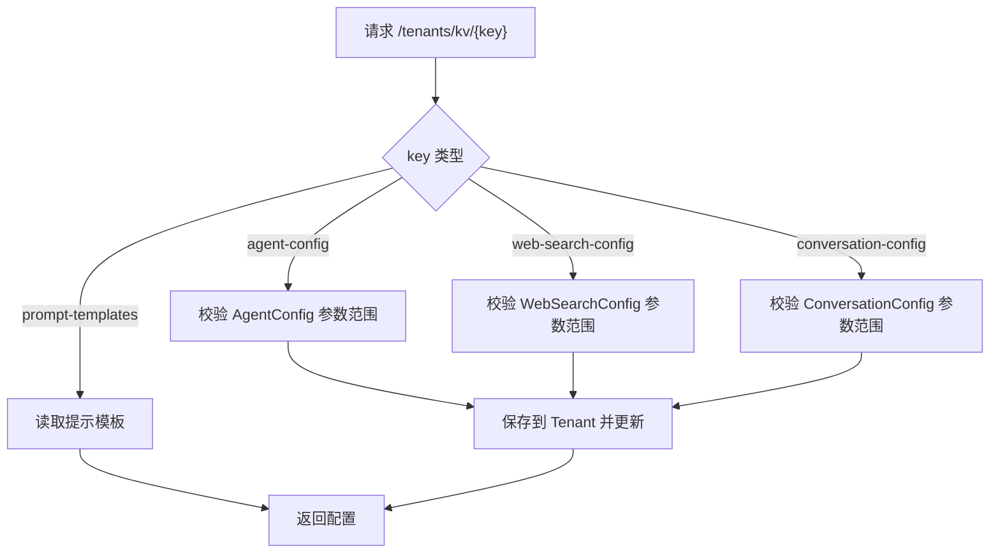
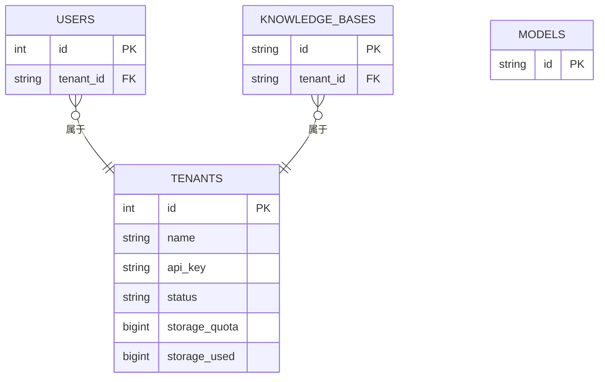
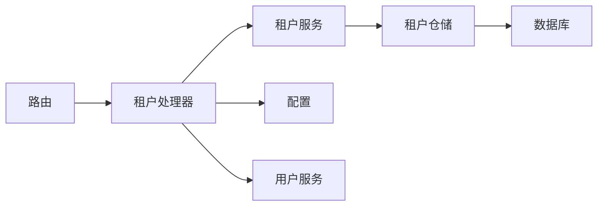

# 租户API

<cite>
**本文引用的文件**
- [client/tenant.go](file://client/tenant.go)
- [internal/handler/tenant.go](file://internal/handler/tenant.go)
- [internal/application/service/tenant.go](file://internal/application/service/tenant.go)
- [internal/application/repository/tenant.go](file://internal/application/repository/tenant.go)
- [internal/types/interfaces/tenant.go](file://internal/types/interfaces/tenant.go)
- [internal/types/tenant.go](file://internal/types/tenant.go)
- [internal/router/router.go](file://internal/router/router.go)
- [config/config.yaml](file://config/config.yaml)
- [docs/api/tenant.md](file://docs/api/tenant.md)
- [docs/notes/database.md](file://docs/notes/database.md)
- [migrations/versioned/000000_init.up.sql](file://migrations/versioned/000000_init.up.sql)
- [internal/utils/inject.go](file://internal/utils/inject.go)
- [frontend/src/views/settings/TenantInfo.vue](file://frontend/src/views/settings/TenantInfo.vue)
</cite>

## 目录
1. [简介](#简介)
2. [项目结构](#项目结构)
3. [核心组件](#核心组件)
4. [架构总览](#架构总览)
5. [详细组件分析](#详细组件分析)
6. [依赖关系分析](#依赖关系分析)
7. [性能考量](#性能考量)
8. [故障排查指南](#故障排查指南)
9. [结论](#结论)
10. [附录](#附录)

## 简介
本文件系统化梳理租户API模块，覆盖租户的创建、查询、更新、删除与列表检索能力；阐述租户配置参数（存储配额、并发限制、功能开关）、多租户隔离机制（数据隔离、资源限制、权限控制）、状态管理（激活状态、到期时间、续费提醒），以及租户与用户、知识库、模型的关联关系与权限继承规则。文档同时提供KV配置管理（Agent配置、网络搜索配置、对话配置）与跨租户访问能力说明。

## 项目结构
租户API模块采用典型的分层架构：客户端SDK、HTTP处理器、应用服务层、仓储层与类型定义，配合路由注册与配置文件，形成完整的租户生命周期管理闭环。

**图表来源**
- [internal/router/router.go](file://internal/router/router.go#L294-L314)
- [internal/handler/tenant.go](file://internal/handler/tenant.go#L19-L41)
- [internal/application/service/tenant.go](file://internal/application/service/tenant.go#L33-L41)
- [internal/application/repository/tenant.go](file://internal/application/repository/tenant.go#L19-L27)
- [internal/types/tenant.go](file://internal/types/tenant.go#L58-L94)
- [internal/types/interfaces/tenant.go](file://internal/types/interfaces/tenant.go#L9-L31)
- [config/config.yaml](file://config/config.yaml#L581-L585)

**章节来源**
- [internal/router/router.go](file://internal/router/router.go#L294-L314)
- [internal/handler/tenant.go](file://internal/handler/tenant.go#L19-L41)
- [internal/application/service/tenant.go](file://internal/application/service/tenant.go#L33-L41)
- [internal/application/repository/tenant.go](file://internal/application/repository/tenant.go#L19-L27)
- [internal/types/tenant.go](file://internal/types/tenant.go#L58-L94)
- [internal/types/interfaces/tenant.go](file://internal/types/interfaces/tenant.go#L9-L31)
- [config/config.yaml](file://config/config.yaml#L581-L585)

## 核心组件
- 客户端SDK（client/tenant.go）
  - 定义租户数据结构与KV配置结构
  - 提供创建、查询、更新、删除、列表等方法
- HTTP处理器（internal/handler/tenant.go）
  - 实现REST接口：创建、查询、更新、删除、列表、跨租户列表、搜索
  - 提供KV配置读取与更新接口（agent-config、web-search-config、conversation-config）
- 应用服务（internal/application/service/tenant.go）
  - 业务编排：创建租户、更新租户、删除租户、列表、搜索、API Key生成与解析
  - 存储用量调整（AdjustStorageUsed）与并发安全
- 仓储层（internal/application/repository/tenant.go）
  - 数据持久化：创建、查询、列表、搜索、更新、删除
  - 存储用量事务性调整
- 类型与接口（internal/types/tenant.go、internal/types/interfaces/tenant.go）
  - 租户模型、检索引擎配置、对话配置等
  - 服务与仓储接口契约
- 路由与配置（internal/router/router.go、config/config.yaml）
  - 路由注册与鉴权中间件
  - 跨租户访问开关配置

**章节来源**
- [client/tenant.go](file://client/tenant.go#L25-L140)
- [internal/handler/tenant.go](file://internal/handler/tenant.go#L43-L418)
- [internal/application/service/tenant.go](file://internal/application/service/tenant.go#L43-L328)
- [internal/application/repository/tenant.go](file://internal/application/repository/tenant.go#L29-L123)
- [internal/types/tenant.go](file://internal/types/tenant.go#L58-L187)
- [internal/types/interfaces/tenant.go](file://internal/types/interfaces/tenant.go#L9-L49)
- [internal/router/router.go](file://internal/router/router.go#L294-L314)
- [config/config.yaml](file://config/config.yaml#L581-L585)

## 架构总览
租户API遵循“控制器-服务-仓储-数据源”的分层设计，结合路由中间件实现认证与鉴权，仓储层通过GORM访问数据库，KV配置通过统一的租户级键值接口管理。

**图表来源**
- [internal/router/router.go](file://internal/router/router.go#L294-L314)
- [internal/handler/tenant.go](file://internal/handler/tenant.go#L54-L92)
- [internal/application/service/tenant.go](file://internal/application/service/tenant.go#L43-L80)
- [internal/application/repository/tenant.go](file://internal/application/repository/tenant.go#L29-L53)

**章节来源**
- [internal/router/router.go](file://internal/router/router.go#L294-L314)
- [internal/handler/tenant.go](file://internal/handler/tenant.go#L54-L92)
- [internal/application/service/tenant.go](file://internal/application/service/tenant.go#L43-L80)
- [internal/application/repository/tenant.go](file://internal/application/repository/tenant.go#L29-L53)

## 详细组件分析

### 租户数据模型与配置参数
- 核心字段
  - 标识与基本信息：ID、名称、描述、业务部门
  - 状态：active/inactive（默认active）
  - 认证：API Key（加密生成）
  - 存储：存储配额（默认10GB）与已用存储
  - 时间戳：创建、更新、删除
- 配置参数
  - 检索引擎配置（RetrieverEngines）：支持关键字与向量引擎组合
  - 全局Agent配置（AgentConfig，已标记弃用，保留兼容）
  - 全局Web搜索配置（WebSearchConfig）
  - 全局对话配置（ConversationConfig，已标记弃用，保留兼容）
- KV配置接口
  - GET /api/v1/tenants/kv/{key}：agent-config、web-search-config、conversation-config、prompt-templates
  - PUT /api/v1/tenants/kv/{key}：同上

**图表来源**
- [internal/types/tenant.go](file://internal/types/tenant.go#L58-L94)
- [internal/types/tenant.go](file://internal/types/tenant.go#L96-L107)

**章节来源**
- [internal/types/tenant.go](file://internal/types/tenant.go#L58-L94)
- [internal/types/tenant.go](file://internal/types/tenant.go#L134-L187)

### 租户API接口定义
- 创建租户
  - 方法：POST /api/v1/tenants
  - 请求体：Tenant（不含ID、API Key、时间戳）
  - 响应：Tenant（含自动生成的API Key）
- 获取租户
  - 方法：GET /api/v1/tenants/{id}
  - 认证：X-API-Key 或 Bearer Token
  - 响应：Tenant
- 更新租户
  - 方法：PUT /api/v1/tenants/{id}
  - 认证：X-API-Key 或 Bearer Token
  - 响应：Tenant（API Key可能变化）
- 删除租户
  - 方法：DELETE /api/v1/tenants/{id}
  - 认证：X-API-Key 或 Bearer Token
  - 响应：{ success, message }
- 列表租户
  - 方法：GET /api/v1/tenants
  - 认证：X-API-Key 或 Bearer Token
  - 响应：{ success, data: { items: Tenant[] } }
- 跨租户列表
  - 方法：GET /api/v1/tenants/all
  - 条件：config.tenant.enable_cross_tenant_access 为 true 且用户具备 CanAccessAllTenants 权限
- 搜索租户
  - 方法：GET /api/v1/tenants/search?keyword=&tenant_id=&page=&page_size=
  - 条件：同上
- KV配置
  - GET/PUT /api/v1/tenants/kv/{key}：agent-config、web-search-config、conversation-config、prompt-templates

**图表来源**
- [internal/router/router.go](file://internal/router/router.go#L294-L314)
- [internal/handler/tenant.go](file://internal/handler/tenant.go#L54-L92)
- [internal/application/service/tenant.go](file://internal/application/service/tenant.go#L43-L80)
- [internal/application/repository/tenant.go](file://internal/application/repository/tenant.go#L29-L32)

**章节来源**
- [docs/api/tenant.md](file://docs/api/tenant.md#L5-L12)
- [docs/api/tenant.md](file://docs/api/tenant.md#L13-L70)
- [docs/api/tenant.md](file://docs/api/tenant.md#L72-L113)
- [docs/api/tenant.md](file://docs/api/tenant.md#L115-L177)
- [docs/api/tenant.md](file://docs/api/tenant.md#L179-L196)
- [docs/api/tenant.md](file://docs/api/tenant.md#L198-L243)
- [internal/handler/tenant.go](file://internal/handler/tenant.go#L273-L343)

### 多租户隔离机制
- 数据隔离
  - 通过 WithTenantIsolation 在SQL校验器中自动注入 tenant_id 过滤条件，确保仅访问本租户数据
  - 默认受保护表包括：knowledge_bases、knowledges、chunks
- 资源限制
  - 存储配额与已用存储：仓储层提供 AdjustStorageUsed 的事务性调整，防止负值
  - API Key加密生成与解析：服务层提供 generateApiKey 与 ExtractTenantIDFromAPIKey
- 权限控制
  - 跨租户访问开关：config.tenant.enable_cross_tenant_access
  - 用户权限：用户需具备 CanAccessAllTenants 才能访问 /tenants/all 与 /tenants/search
  - 认证中间件：路由层统一挂载认证中间件，TenantHandler 内部再做权限校验

**图表来源**
- [config/config.yaml](file://config/config.yaml#L581-L585)
- [internal/handler/tenant.go](file://internal/handler/tenant.go#L294-L306)
- [internal/utils/inject.go](file://internal/utils/inject.go#L554-L575)

**章节来源**
- [internal/utils/inject.go](file://internal/utils/inject.go#L554-L590)
- [internal/application/repository/tenant.go](file://internal/application/repository/tenant.go#L106-L123)
- [internal/application/service/tenant.go](file://internal/application/service/tenant.go#L210-L282)
- [config/config.yaml](file://config/config.yaml#L581-L585)
- [internal/handler/tenant.go](file://internal/handler/tenant.go#L294-L306)

### 租户状态管理与生命周期
- 状态字段：status（active/inactive），默认 active
- 生命周期：创建时生成初始API Key，更新时若为空则重新生成
- 存储配额：默认10GB，仓储层提供 AdjustStorageUsed 并发安全调整
- 删除：仓储层删除租户记录（软删除列 deleted_at）

**图表来源**
- [internal/types/tenant.go](file://internal/types/tenant.go#L68-L70)
- [internal/application/service/tenant.go](file://internal/application/service/tenant.go#L54-L79)
- [internal/application/service/tenant.go](file://internal/application/service/tenant.go#L121-L125)
- [internal/application/repository/tenant.go](file://internal/application/repository/tenant.go#L102-L104)

**章节来源**
- [internal/types/tenant.go](file://internal/types/tenant.go#L68-L70)
- [internal/application/service/tenant.go](file://internal/application/service/tenant.go#L54-L79)
- [internal/application/service/tenant.go](file://internal/application/service/tenant.go#L121-L125)
- [internal/application/repository/tenant.go](file://internal/application/repository/tenant.go#L102-L104)

### KV配置管理（Agent/WebSearch/Conversation/Prompt）
- Agent配置（agent-config）
  - 支持 max_iterations、reflection_enabled、allowed_tools、temperature、system_prompt
  - 校验范围：max_iterations 1..30，temperature 0..2
- Web搜索配置（web-search-config）
  - 支持 max_results（1..50）
- 对话配置（conversation-config）
  - 支持 Prompt、ContextTemplate、Temperature、MaxCompletionTokens、MaxRounds、EmbeddingTopK、KeywordThreshold、VectorThreshold、RerankTopK、RerankThreshold、EnableRewrite、EnableQueryExpansion、Fallback策略与提示词等
  - 参数范围校验：如 MaxRounds、EmbeddingTopK、Temperature、MaxCompletionTokens、FallbackStrategy 等
- 提示模板（prompt-templates）
  - 支持统一读取与管理

**图表来源**
- [internal/handler/tenant.go](file://internal/handler/tenant.go#L575-L643)
- [internal/handler/tenant.go](file://internal/handler/tenant.go#L645-L687)
- [internal/handler/tenant.go](file://internal/handler/tenant.go#L740-L771)

**章节来源**
- [internal/handler/tenant.go](file://internal/handler/tenant.go#L575-L643)
- [internal/handler/tenant.go](file://internal/handler/tenant.go#L645-L687)
- [internal/handler/tenant.go](file://internal/handler/tenant.go#L740-L771)

### 租户与用户、知识库、模型的关联关系与权限继承
- 租户与用户
  - 用户表外键关联 tenants（tenant_id），用户所属租户由登录上下文携带
- 租户与知识库
  - 知识库表包含 tenant_id 字段，仓储按租户过滤列表
- 租户与模型
  - 模型服务与模型路由独立于租户维度，但会受租户配置影响（如检索引擎映射）
- 权限继承
  - 跨租户访问仅在管理员开启开关并具备 CanAccessAllTenants 权限时生效

**图表来源**
- [docs/notes/database.md](file://docs/notes/database.md#L10-L39)
- [internal/application/repository/knowledgebase.go](file://internal/application/repository/knowledgebase.go#L63-L72)

**章节来源**
- [docs/notes/database.md](file://docs/notes/database.md#L10-L39)
- [internal/application/repository/knowledgebase.go](file://internal/application/repository/knowledgebase.go#L63-L72)

### 租户迁移与备份恢复（概念性说明）
- 迁移
  - 租户表结构与索引在初始化迁移脚本中定义，包含 api_key 索引与状态索引
- 备份恢复
  - 建议通过数据库层面的逻辑导出/导入（如pg_dump/pg_restore）备份 tenants 表及其索引
  - 恢复后需确保序列起始值与索引存在（参考初始化迁移脚本）

**章节来源**
- [migrations/versioned/000000_init.up.sql](file://migrations/versioned/000000_init.up.sql#L27-L47)
- [docs/notes/database.md](file://docs/notes/database.md#L10-L39)

## 依赖关系分析
- 组件耦合
  - Handler 依赖 TenantService 与 UserService、Config
  - Service 依赖 TenantRepository 与 types
  - Repository 依赖 GORM DB
- 关键依赖链
  - 路由 -> 租户处理器 -> 租户服务 -> 租户仓储 -> 数据库
- 安全依赖
  - 认证中间件贯穿所有租户路由
  - 跨租户访问需满足配置与用户权限

**图表来源**
- [internal/router/router.go](file://internal/router/router.go#L294-L314)
- [internal/handler/tenant.go](file://internal/handler/tenant.go#L22-L41)

**章节来源**
- [internal/router/router.go](file://internal/router/router.go#L294-L314)
- [internal/handler/tenant.go](file://internal/handler/tenant.go#L22-L41)

## 性能考量
- 存储用量并发安全
  - AdjustStorageUsed 使用悲观锁（UPDATE）与事务，避免并发竞争导致的负值
- 查询性能
  - tenants 表建立 api_key 与 status 索引，加速认证与状态查询
- 分页与搜索
  - SearchTenants 支持分页与关键词/ID过滤，注意 page_size 上限（处理器侧限制为100）

**章节来源**
- [internal/application/repository/tenant.go](file://internal/application/repository/tenant.go#L106-L123)
- [migrations/versioned/000000_init.up.sql](file://migrations/versioned/000000_init.up.sql#L45-L47)
- [internal/handler/tenant.go](file://internal/handler/tenant.go#L388-L395)

## 故障排查指南
- 常见错误与定位
  - 跨租户访问被拒：确认 config.tenant.enable_cross_tenant_access 与用户 CanAccessAllTenants
  - 参数校验失败：AgentConfig/ConversationConfig/WebSearchConfig 参数范围不合法
  - 认证失败：API Key格式错误或解析异常
  - 存储用量异常：并发调整导致负值（仓储层已保护，仍需检查调用方逻辑）
- 日志与可观测性
  - Handler/Service/Repository 层均记录关键日志与错误字段，便于定位
- 前端租户信息展示
  - 前端 TenantInfo 页面从用户信息中读取当前租户详情，便于核对状态与配置

**章节来源**
- [internal/handler/tenant.go](file://internal/handler/tenant.go#L294-L306)
- [internal/handler/tenant.go](file://internal/handler/tenant.go#L521-L529)
- [internal/handler/tenant.go](file://internal/handler/tenant.go#L740-L771)
- [internal/application/service/tenant.go](file://internal/application/service/tenant.go#L242-L282)
- [frontend/src/views/settings/TenantInfo.vue](file://frontend/src/views/settings/TenantInfo.vue#L156-L173)

## 结论
租户API模块提供了完善的租户生命周期管理与配置能力，结合跨租户访问开关、KV配置接口与存储用量并发控制，实现了安全、可控、可扩展的多租户体系。建议在生产环境中：
- 明确启用跨租户访问的必要性与权限边界
- 严格校验KV配置参数范围，避免运行期异常
- 监控存储用量与并发调整，保障数据一致性
- 通过数据库迁移与索引策略保障查询性能

## 附录
- API示例与响应结构详见文档：[租户管理 API](file://docs/api/tenant.md#L1-L244)
- 数据库表结构与索引：[数据库说明](file://docs/notes/database.md#L10-L39)
- 初始化迁移脚本：[初始化迁移](file://migrations/versioned/000000_init.up.sql#L27-L47)