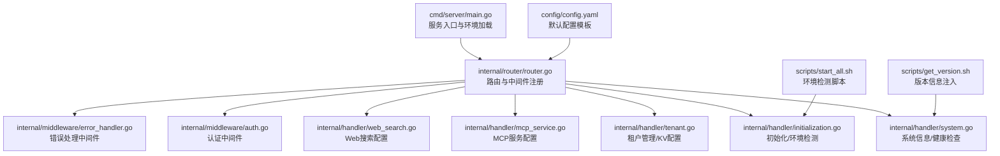
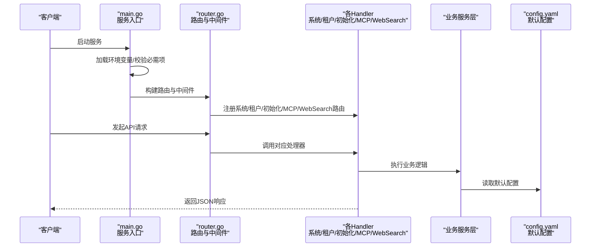
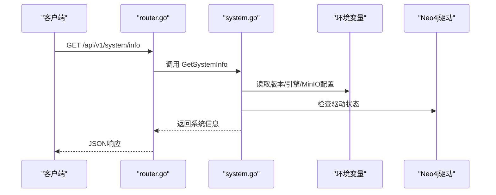
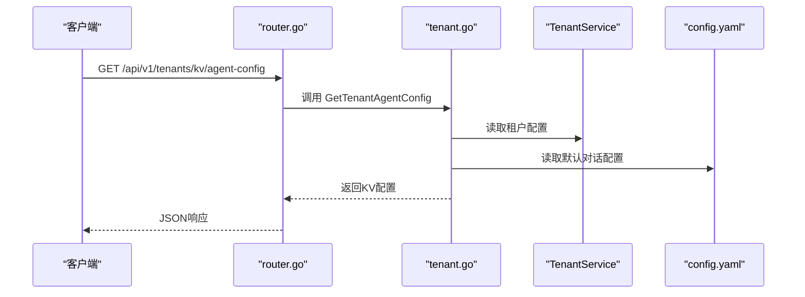
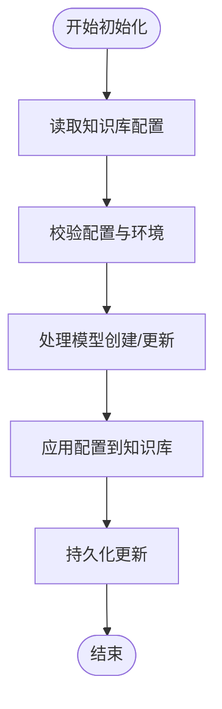
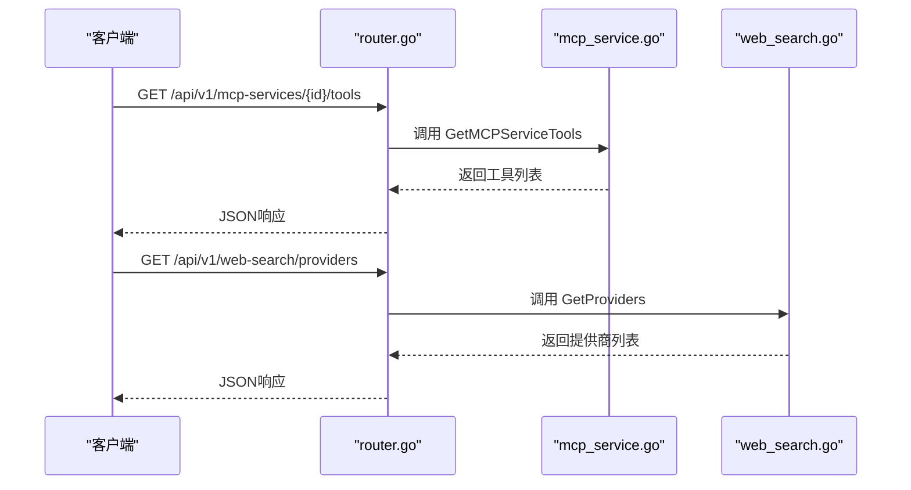
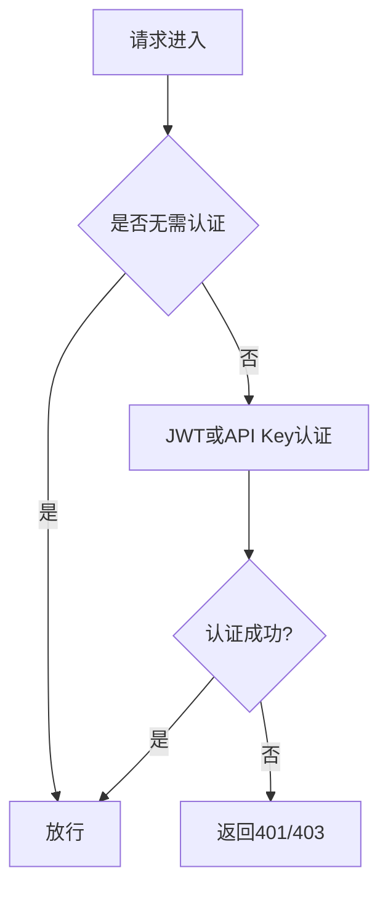
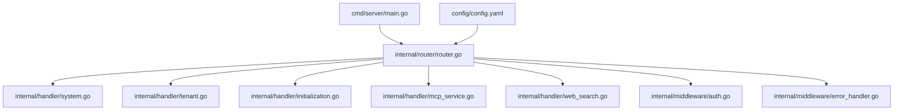

# 系统API

<cite>
**本文引用的文件**
- [cmd/server/main.go](file://cmd/server/main.go)
- [internal/router/router.go](file://internal/router/router.go)
- [internal/handler/system.go](file://internal/handler/system.go)
- [internal/handler/tenant.go](file://internal/handler/tenant.go)
- [internal/handler/initialization.go](file://internal/handler/initialization.go)
- [internal/handler/mcp_service.go](file://internal/handler/mcp_service.go)
- [internal/handler/web_search.go](file://internal/handler/web_search.go)
- [internal/middleware/auth.go](file://internal/middleware/auth.go)
- [internal/middleware/error_handler.go](file://internal/middleware/error_handler.go)
- [internal/types/const.go](file://internal/types/const.go)
- [config/config.yaml](file://config/config.yaml)
- [scripts/get_version.sh](file://scripts/get_version.sh)
- [scripts/start_all.sh](file://scripts/start_all.sh)
</cite>

## 目录
1. [简介](#简介)
2. [项目结构](#项目结构)
3. [核心组件](#核心组件)
4. [架构总览](#架构总览)
5. [详细组件分析](#详细组件分析)
6. [依赖分析](#依赖分析)
7. [性能考量](#性能考量)
8. [故障排查指南](#故障排查指南)
9. [结论](#结论)
10. [附录](#附录)

## 简介
本文件系统化梳理“系统API”模块，覆盖系统配置获取、版本信息查询、健康检查、租户信息管理（含配置、配额与计费）、系统状态监控（服务可用性、数据库与缓存）、系统初始化流程（首次启动配置、默认设置、环境检测）、以及系统维护模式与紧急停机、故障恢复的接口设计思路。同时，文档化系统与外部服务的集成，包括MCP服务与Web搜索服务的配置管理。

## 项目结构
系统API模块位于后端服务入口与路由层之间，采用Gin框架组织REST接口，结合中间件实现认证、日志、错误处理与追踪。系统API主要分布在以下文件：
- 服务入口与环境加载：cmd/server/main.go
- 路由注册与基础中间件：internal/router/router.go
- 系统信息与健康检查：internal/handler/system.go
- 租户管理与KV配置：internal/handler/tenant.go
- 初始化与环境检测：internal/handler/initialization.go
- MCP服务配置：internal/handler/mcp_service.go
- Web搜索服务配置：internal/handler/web_search.go
- 认证与错误处理中间件：internal/middleware/auth.go、internal/middleware/error_handler.go
- 上下文键常量：internal/types/const.go
- 默认配置模板：config/config.yaml
- 版本与构建信息：scripts/get_version.sh
- 环境检测脚本：scripts/start_all.sh

图表来源
- [cmd/server/main.go](file://cmd/server/main.go#L1-L193)
- [internal/router/router.go](file://internal/router/router.go#L1-L118)
- [internal/handler/system.go](file://internal/handler/system.go#L1-L92)
- [internal/handler/tenant.go](file://internal/handler/tenant.go#L1-L120)
- [internal/handler/initialization.go](file://internal/handler/initialization.go#L1-L120)
- [internal/handler/mcp_service.go](file://internal/handler/mcp_service.go#L1-L60)
- [internal/handler/web_search.go](file://internal/handler/web_search.go#L1-L45)
- [internal/middleware/auth.go](file://internal/middleware/auth.go#L1-L60)
- [internal/middleware/error_handler.go](file://internal/middleware/error_handler.go#L1-L47)
- [config/config.yaml](file://config/config.yaml#L1-L60)
- [scripts/get_version.sh](file://scripts/get_version.sh#L1-L87)
- [scripts/start_all.sh](file://scripts/start_all.sh#L496-L537)

章节来源
- [cmd/server/main.go](file://cmd/server/main.go#L1-L193)
- [internal/router/router.go](file://internal/router/router.go#L1-L118)

## 核心组件
- 系统信息与健康检查
  - GET /api/v1/system/info：获取系统版本、构建信息与引擎配置
  - GET /api/v1/system/minio/buckets：列出MinIO存储桶及其访问策略（需MinIO启用）
  - GET /health：服务健康检查（无需认证）
- 租户管理与KV配置
  - GET/POST/PUT/DELETE /api/v1/tenants：租户的增删改查
  - GET/PUT /api/v1/tenants/kv/{key}：租户级KV配置读取与更新（agent-config、web-search-config、conversation-config、prompt-templates）
  - GET/PUT /api/v1/tenants/kv/web-search-config：网络搜索配置读取与更新
  - GET/PUT /api/v1/tenants/kv/conversation-config：对话配置读取与更新
- 初始化与环境检测
  - GET /api/v1/initialization/config/{kbId}：按知识库ID获取当前配置
  - POST /api/v1/initialization/initialize/{kbId}：按知识库ID执行完整配置更新
  - PUT /api/v1/initialization/config/{kbId}：按知识库ID更新模型与分块配置
  - GET /api/v1/initialization/ollama/status：检查Ollama服务状态
  - GET /api/v1/initialization/ollama/models：列出已安装模型
  - POST /api/v1/initialization/ollama/models/check：检查模型是否存在
  - POST /api/v1/initialization/ollama/models/download：异步下载模型
  - GET /api/v1/initialization/ollama/download/{taskId}：查询下载进度
  - GET /api/v1/initialization/ollama/download/tasks：列出下载任务
  - POST /api/v1/initialization/remote/check：检查远程模型可用性
  - POST /api/v1/initialization/embedding/test：测试嵌入模型
  - POST /api/v1/initialization/rerank/check：检查重排序模型
  - POST /api/v1/initialization/multimodal/test：测试多模态函数
- MCP服务配置
  - POST /api/v1/mcp-services：创建MCP服务
  - GET /api/v1/mcp-services：获取当前租户的MCP服务列表
  - GET /api/v1/mcp-services/{id}：获取MCP服务详情
  - PUT /api/v1/mcp-services/{id}：更新MCP服务
  - DELETE /api/v1/mcp-services/{id}：删除MCP服务
  - POST /api/v1/mcp-services/{id}/test：测试MCP服务连接
  - GET /api/v1/mcp-services/{id}/tools：获取MCP服务工具列表
  - GET /api/v1/mcp-services/{id}/resources：获取MCP服务资源列表
- Web搜索配置
  - GET /api/v1/web-search/providers：获取可用的Web搜索提供商列表

章节来源
- [internal/router/router.go](file://internal/router/router.go#L74-L87)
- [internal/router/router.go](file://internal/router/router.go#L380-L387)
- [internal/router/router.go](file://internal/router/router.go#L355-L378)
- [internal/router/router.go](file://internal/router/router.go#L389-L410)
- [internal/router/router.go](file://internal/router/router.go#L412-L420)

## 架构总览
系统API采用“入口-容器-路由-处理器-服务”的分层架构。入口负责环境变量加载与HTTP服务启动；容器负责依赖注入；路由层注册各模块API并挂载中间件；处理器负责业务编排与响应；服务层封装业务逻辑与数据访问。

图表来源
- [cmd/server/main.go](file://cmd/server/main.go#L47-L86)
- [internal/router/router.go](file://internal/router/router.go#L54-L118)
- [config/config.yaml](file://config/config.yaml#L1-L60)

## 详细组件分析

### 系统信息与健康检查
- GET /api/v1/system/info
  - 返回字段：版本号、提交ID、构建时间、Go版本、关键词检索引擎、向量存储引擎、图数据库引擎、MinIO启用状态
  - 引擎探测逻辑：关键词检索引擎来自环境变量；向量存储引擎优先读取配置，其次回退到检索驱动；图数据库引擎通过Neo4j驱动状态判断；MinIO启用状态通过环境变量完整性判断
- GET /api/v1/system/minio/buckets
  - 依赖MinIO环境变量：端点、访问密钥、私有密钥；当MinIO未启用时返回错误
  - 返回字段：存储桶名称、策略（公开/私有/自定义）、创建时间
- GET /health
  - 无需认证，返回服务可用性状态

图表来源
- [internal/router/router.go](file://internal/router/router.go#L380-L387)
- [internal/handler/system.go](file://internal/handler/system.go#L52-L92)
- [internal/handler/system.go](file://internal/handler/system.go#L94-L183)

章节来源
- [internal/handler/system.go](file://internal/handler/system.go#L32-L92)
- [internal/router/router.go](file://internal/router/router.go#L74-L87)

### 租户信息管理与KV配置
- 租户管理
  - 支持创建、查询、更新、删除租户；支持跨租户访问（受配置与权限控制）
  - 跨租户访问需满足：启用跨租户访问、调用者具备全局访问权限、目标租户存在
- 租户级KV配置
  - agent-config：全局Agent配置（最大迭代次数、反思开关、允许工具、温度、统一系统提示）
  - web-search-config：网络搜索配置（最大结果数等）
  - conversation-config：对话配置（轮数、阈值、重排序、温度、最大补全token等）
  - prompt-templates：提示词模板集合
- 配额与计费
  - 代码中未发现显式配额与计费字段；可在租户配置结构中扩展相应字段并在处理器中实现读写逻辑

图表来源
- [internal/router/router.go](file://internal/router/router.go#L294-L314)
- [internal/handler/tenant.go](file://internal/handler/tenant.go#L429-L507)
- [internal/handler/tenant.go](file://internal/handler/tenant.go#L575-L643)
- [config/config.yaml](file://config/config.yaml#L6-L60)

章节来源
- [internal/handler/tenant.go](file://internal/handler/tenant.go#L19-L120)
- [internal/handler/tenant.go](file://internal/handler/tenant.go#L429-L507)
- [internal/handler/tenant.go](file://internal/handler/tenant.go#L575-L643)
- [internal/router/router.go](file://internal/router/router.go#L294-L314)
- [config/config.yaml](file://config/config.yaml#L581-L585)

### 系统初始化流程与环境检测
- 配置读取与更新
  - GetCurrentConfigByKB：按知识库ID获取当前配置
  - InitializeByKB：按知识库ID执行完整配置更新（模型、嵌入、重排序、VLM、分块、多模态、知识图谱抽取、问题生成）
  - UpdateKBConfig：简化版更新（仅模型ID与分块配置）
- 环境检测与Ollama集成
  - CheckOllamaStatus：检查Ollama服务可用性与版本
  - ListOllamaModels：列出已安装模型
  - CheckOllamaModels：批量检查模型是否存在
  - DownloadOllamaModel：异步下载模型，支持进度查询与任务列表
- 远程模型与能力测试
  - CheckRemoteModel、TestEmbeddingModel、CheckRerankModel、TestMultimodalFunction

图表来源
- [internal/router/router.go](file://internal/router/router.go#L355-L378)
- [internal/handler/initialization.go](file://internal/handler/initialization.go#L211-L391)
- [internal/handler/initialization.go](file://internal/handler/initialization.go#L393-L456)
- [internal/handler/initialization.go](file://internal/handler/initialization.go#L800-L845)

章节来源
- [internal/handler/initialization.go](file://internal/handler/initialization.go#L211-L391)
- [internal/handler/initialization.go](file://internal/handler/initialization.go#L393-L456)
- [internal/handler/initialization.go](file://internal/handler/initialization.go#L800-L1200)
- [internal/router/router.go](file://internal/router/router.go#L355-L378)

### MCP服务配置与Web搜索配置
- MCP服务
  - 支持创建、查询、更新、删除、测试连接、获取工具与资源
  - 传输类型限制：禁用STDIO（安全原因），推荐SSE或HTTP Streamable
- Web搜索
  - 提供可用提供商列表查询接口

图表来源
- [internal/router/router.go](file://internal/router/router.go#L389-L420)
- [internal/handler/mcp_service.go](file://internal/handler/mcp_service.go#L351-L385)
- [internal/handler/web_search.go](file://internal/handler/web_search.go#L23-L44)

章节来源
- [internal/handler/mcp_service.go](file://internal/handler/mcp_service.go#L14-L60)
- [internal/handler/mcp_service.go](file://internal/handler/mcp_service.go#L351-L385)
- [internal/handler/web_search.go](file://internal/handler/web_search.go#L11-L45)

### 认证与错误处理
- 认证中间件
  - 支持JWT Bearer与X-API-Key两种认证方式
  - 无需认证的API白名单：健康检查、登录、注册、刷新
  - 跨租户访问：需满足配置与权限条件
- 错误处理中间件
  - 将应用错误转换为统一JSON响应结构

图表来源
- [internal/middleware/auth.go](file://internal/middleware/auth.go#L18-L57)
- [internal/middleware/auth.go](file://internal/middleware/auth.go#L59-L197)
- [internal/middleware/error_handler.go](file://internal/middleware/error_handler.go#L11-L47)

章节来源
- [internal/middleware/auth.go](file://internal/middleware/auth.go#L18-L57)
- [internal/middleware/auth.go](file://internal/middleware/auth.go#L59-L197)
- [internal/middleware/error_handler.go](file://internal/middleware/error_handler.go#L11-L47)

## 依赖分析
- 入口依赖
  - 环境变量加载与必需项校验（数据库驱动、主机、端口、用户名、密码、库名）
  - 日志输出到stdout与可选文件
  - 优雅关闭与资源清理
- 路由依赖
  - CORS、请求ID、日志、恢复、错误处理、认证、追踪中间件
  - API分组与注册（系统、租户、初始化、MCP、Web搜索等）
- 处理器依赖
  - 系统处理器依赖配置与Neo4j驱动
  - 租户处理器依赖租户与用户服务接口
  - 初始化处理器依赖模型、知识库、Ollama服务、文档阅读器客户端
  - MCP与Web搜索处理器依赖各自服务接口

图表来源
- [cmd/server/main.go](file://cmd/server/main.go#L124-L188)
- [internal/router/router.go](file://internal/router/router.go#L53-L118)
- [config/config.yaml](file://config/config.yaml#L1-L60)

章节来源
- [cmd/server/main.go](file://cmd/server/main.go#L124-L188)
- [internal/router/router.go](file://internal/router/router.go#L53-L118)

## 性能考量
- 中间件链路
  - 请求ID、日志、恢复、错误处理、认证、追踪中间件按顺序执行，建议在生产环境启用追踪与限流
- 资源清理
  - 优雅关闭时清理追踪与资源，避免资源泄漏
- Ollama下载
  - 异步下载与进度回调，避免阻塞请求；建议限制并发下载任务数量

[本节为通用指导，无需特定文件引用]

## 故障排查指南
- 健康检查失败
  - 确认服务监听端口与主机配置；检查日志输出与环境变量
- 认证失败
  - 检查Authorization头或X-API-Key是否正确；确认租户存在且API Key有效
- MinIO相关错误
  - 确认MinIO环境变量完整；检查端点可达性与凭证
- 初始化失败
  - 检查Ollama服务状态与模型可用性；查看下载任务进度与错误信息
- 错误响应
  - 应用错误中间件会将错误转换为统一JSON结构，便于前端处理

章节来源
- [internal/router/router.go](file://internal/router/router.go#L74-L87)
- [internal/middleware/auth.go](file://internal/middleware/auth.go#L148-L197)
- [internal/middleware/error_handler.go](file://internal/middleware/error_handler.go#L22-L44)
- [internal/handler/system.go](file://internal/handler/system.go#L207-L280)
- [internal/handler/initialization.go](file://internal/handler/initialization.go#L800-L845)

## 结论
系统API模块提供了完整的系统管理与租户配置能力，涵盖版本信息、健康检查、租户管理、初始化流程、外部服务集成与错误处理。通过中间件与路由层的清晰分离，系统具备良好的可维护性与扩展性。建议在生产环境中启用追踪与限流，并完善配额与计费相关接口以满足企业级需求。

[本节为总结性内容，无需特定文件引用]

## 附录

### 版本信息注入与构建
- 版本脚本支持多种输出格式（环境变量、JSON、Docker构建参数、ldflags、信息）
- 通过ldflags将版本信息注入到处理器变量，供系统信息接口返回

章节来源
- [scripts/get_version.sh](file://scripts/get_version.sh#L40-L87)
- [internal/handler/system.go](file://internal/handler/system.go#L44-L50)

### 环境检测与启动
- 启动脚本包含操作系统、Docker、.env文件、Ollama服务（本地/远程）与磁盘空间检查
- 建议在首次部署时运行该脚本以快速定位环境问题

章节来源
- [scripts/start_all.sh](file://scripts/start_all.sh#L496-L537)