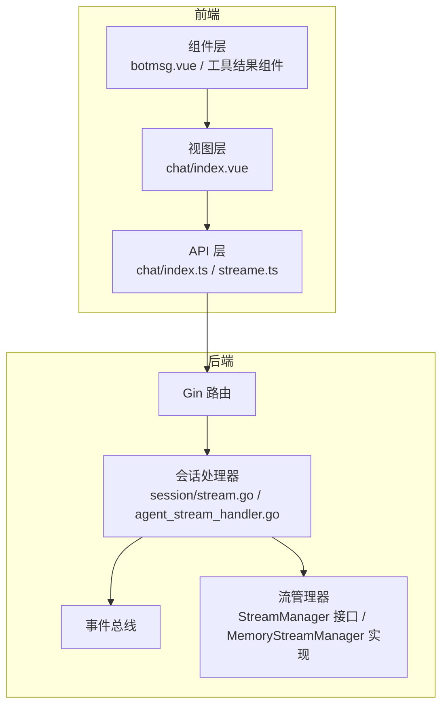
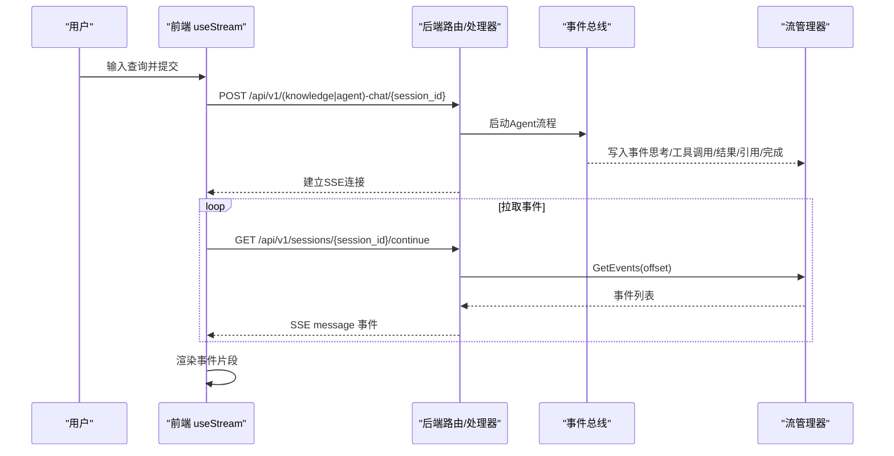
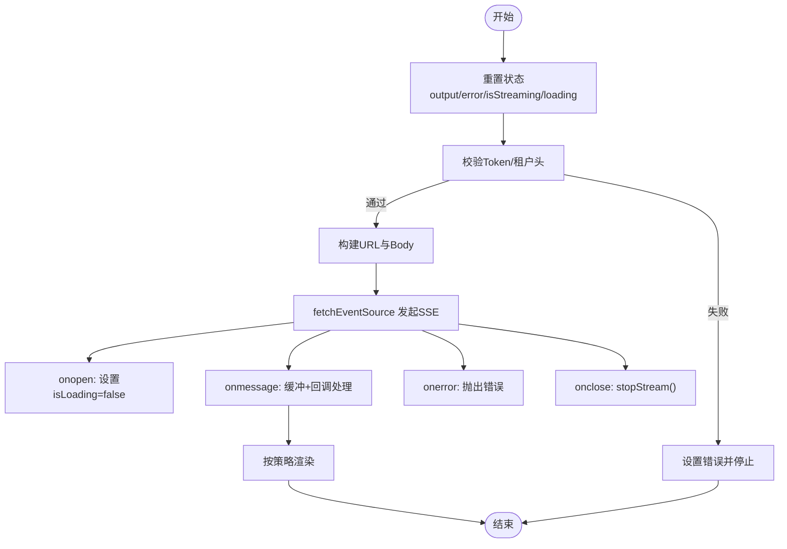
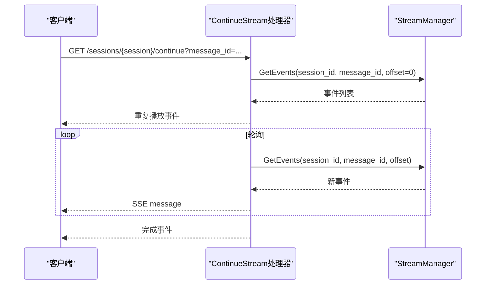
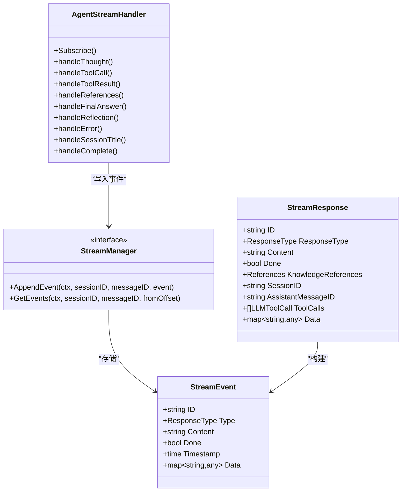
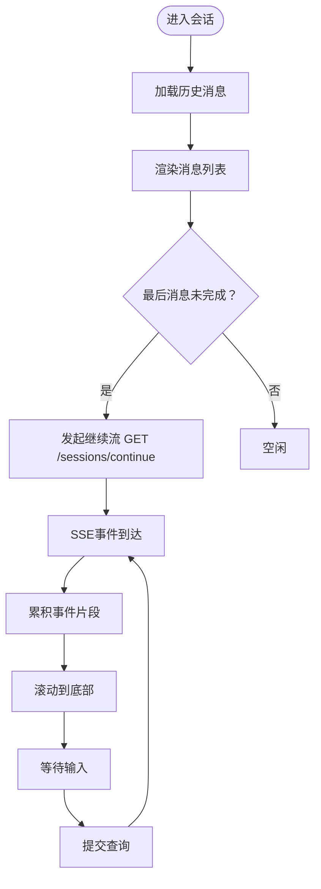
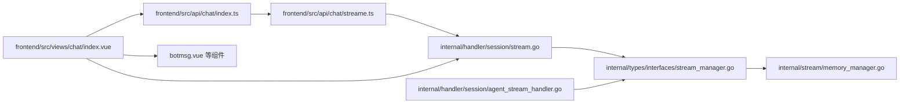

# 聊天API

<cite>
**本文档引用的文件**
- [frontend/src/api/chat/index.ts](file://frontend/src/api/chat/index.ts)
- [frontend/src/api/chat/streame.ts](file://frontend/src/api/chat/streame.ts)
- [internal/handler/session/stream.go](file://internal/handler/session/stream.go)
- [internal/handler/session/agent_stream_handler.go](file://internal/handler/session/agent_stream_handler.go)
- [internal/models/chat/sse_reader.go](file://internal/models/chat/sse_reader.go)
- [internal/types/chat.go](file://internal/types/chat.go)
- [internal/types/interfaces/stream_manager.go](file://internal/types/interfaces/stream_manager.go)
- [internal/stream/memory_manager.go](file://internal/stream/memory_manager.go)
- [frontend/src/views/chat/index.vue](file://frontend/src/views/chat/index.vue)
- [frontend/src/views/chat/components/botmsg.vue](file://frontend/src/views/chat/components/botmsg.vue)
- [frontend/src/types/tool-results.ts](file://frontend/src/types/tool-results.ts)
- [frontend/src/views/chat/components/tool-results/WebSearchResults.vue](file://frontend/src/views/chat/components/tool-results/WebSearchResults.vue)
- [frontend/src/views/chat/components/tool-results/DatabaseQuery.vue](file://frontend/src/views/chat/components/tool-results/DatabaseQuery.vue)
</cite>

## 目录
1. [简介](#简介)
2. [项目结构](#项目结构)
3. [核心组件](#核心组件)
4. [架构总览](#架构总览)
5. [详细组件分析](#详细组件分析)
6. [依赖关系分析](#依赖关系分析)
7. [性能考虑](#性能考虑)
8. [故障排查指南](#故障排查指南)
9. [结论](#结论)
10. [附录](#附录)

## 简介
本文件系统性梳理聊天API模块的设计与实现，覆盖以下关键能力：
- 对话创建与会话管理
- 消息发送与历史加载
- WebSocket/Server-Sent Events（SSE）流式响应处理（实时消息接收、连接管理、断线重连）
- 聊天状态管理（消息队列、输入状态、加载状态）
- 工具调用结果展示（知识检索、网络搜索、数据分析等）
- 聊天界面完整集成示例（消息渲染、滚动控制、输入框管理）

## 项目结构
前端通过API层封装HTTP请求，后端通过Gin路由与处理器对接事件总线与流管理器，最终以SSE推送事件流。

图表来源
- [frontend/src/api/chat/index.ts](file://frontend/src/api/chat/index.ts#L1-L53)
- [frontend/src/api/chat/streame.ts](file://frontend/src/api/chat/streame.ts#L1-L182)
- [frontend/src/views/chat/index.vue](file://frontend/src/views/chat/index.vue#L1-L800)
- [internal/handler/session/stream.go](file://internal/handler/session/stream.go#L1-L441)
- [internal/handler/session/agent_stream_handler.go](file://internal/handler/session/agent_stream_handler.go#L1-L485)
- [internal/types/interfaces/stream_manager.go](file://internal/types/interfaces/stream_manager.go#L1-L33)
- [internal/stream/memory_manager.go](file://internal/stream/memory_manager.go#L1-L119)

章节来源
- [frontend/src/api/chat/index.ts](file://frontend/src/api/chat/index.ts#L1-L53)
- [frontend/src/api/chat/streame.ts](file://frontend/src/api/chat/streame.ts#L1-L182)
- [frontend/src/views/chat/index.vue](file://frontend/src/views/chat/index.vue#L1-L800)
- [internal/handler/session/stream.go](file://internal/handler/session/stream.go#L1-L441)
- [internal/handler/session/agent_stream_handler.go](file://internal/handler/session/agent_stream_handler.go#L1-L485)
- [internal/types/interfaces/stream_manager.go](file://internal/types/interfaces/stream_manager.go#L1-L33)
- [internal/stream/memory_manager.go](file://internal/stream/memory_manager.go#L1-L119)

## 核心组件
- 前端API层：封装会话、消息、知识库对话、Agent对话等REST接口；提供useStream Hook统一处理SSE流式数据。
- 后端处理器：负责SSE连接、事件订阅、流继续（断线重连）、停止生成等。
- 事件总线：承载Agent推理过程中的思考、工具调用、结果、引用、最终答案、完成等事件。
- 流管理器：抽象的事件存储接口，内存实现基于数组追加与增量读取。

章节来源
- [frontend/src/api/chat/index.ts](file://frontend/src/api/chat/index.ts#L1-L53)
- [frontend/src/api/chat/streame.ts](file://frontend/src/api/chat/streame.ts#L1-L182)
- [internal/handler/session/stream.go](file://internal/handler/session/stream.go#L1-L441)
- [internal/handler/session/agent_stream_handler.go](file://internal/handler/session/agent_stream_handler.go#L1-L485)
- [internal/types/interfaces/stream_manager.go](file://internal/types/interfaces/stream_manager.go#L1-L33)
- [internal/stream/memory_manager.go](file://internal/stream/memory_manager.go#L1-L119)

## 架构总览
聊天API采用“事件驱动 + 流式推送”的架构：
- 用户通过前端输入触发POST请求（知识库对话或Agent对话）。
- 后端启动Agent流程，事件总线持续产生各类事件。
- AgentStreamHandler订阅事件并写入StreamManager。
- 前端通过SSE连接拉取事件，逐段渲染。

图表来源
- [frontend/src/api/chat/streame.ts](file://frontend/src/api/chat/streame.ts#L113-L148)
- [internal/handler/session/stream.go](file://internal/handler/session/stream.go#L31-L176)
- [internal/handler/session/agent_stream_handler.go](file://internal/handler/session/agent_stream_handler.go#L56-L69)
- [internal/types/interfaces/stream_manager.go](file://internal/types/interfaces/stream_manager.go#L22-L32)

## 详细组件分析

### 1) 前端API与Hook：useStream
- 功能要点
  - 统一发起SSE请求，支持GET/POST两种方式。
  - 自动注入认证头、租户头、请求ID。
  - 提供输出缓冲、定时渲染、错误处理、停止流等能力。
  - 支持断线重连：通过继续流接口恢复未完成消息的后续事件。
- 关键状态
  - output：累积的渲染文本
  - isStreaming：是否处于流式传输
  - isLoading：初始连接/加载
  - error：错误信息
- 参数与行为
  - 支持传入知识库ID、文件ID、Agent开关、Agent ID、Web搜索开关、摘要模型ID、MCP服务ID、@提及项等。
  - 根据URL区分知识库对话与Agent对话，自动组装请求体。

图表来源
- [frontend/src/api/chat/streame.ts](file://frontend/src/api/chat/streame.ts#L31-L181)

章节来源
- [frontend/src/api/chat/streame.ts](file://frontend/src/api/chat/streame.ts#L1-L182)

### 2) 后端SSE处理器：ContinueStream
- 功能要点
  - 为客户端提供继续流的能力，支持断线重连。
  - 从StreamManager按偏移增量读取事件，重复播放已有事件，再继续监听新事件。
  - 检测完成事件后发送完成通知。
- 关键流程
  - 校验会话与消息存在性
  - 读取事件并SSEEvent推送
  - 定时轮询（100ms）获取新事件
  - 检测到完成事件后发送完成事件

图表来源
- [internal/handler/session/stream.go](file://internal/handler/session/stream.go#L31-L176)

章节来源
- [internal/handler/session/stream.go](file://internal/handler/session/stream.go#L1-L441)

### 3) Agent事件订阅与流写入：AgentStreamHandler
- 功能要点
  - 订阅思考、工具调用、工具结果、引用、最终答案、反思、错误、会话标题、完成等事件。
  - 将事件写入StreamManager，供SSE拉取。
  - 支持快速回复事件（工具结果中携带emit_quick_reply标志时）。
- 数据结构
  - StreamEvent：包含事件ID、类型、内容片段、完成标记、时间戳、附加数据。
  - StreamResponse：SSE对外响应结构，包含响应类型、内容、完成标记、引用、会话/消息ID、工具调用、元数据等。

图表来源
- [internal/handler/session/agent_stream_handler.go](file://internal/handler/session/agent_stream_handler.go#L15-L485)
- [internal/types/interfaces/stream_manager.go](file://internal/types/interfaces/stream_manager.go#L10-L32)
- [internal/types/chat.go](file://internal/types/chat.go#L67-L87)

章节来源
- [internal/handler/session/agent_stream_handler.go](file://internal/handler/session/agent_stream_handler.go#L1-L485)
- [internal/types/chat.go](file://internal/types/chat.go#L1-L108)
- [internal/types/interfaces/stream_manager.go](file://internal/types/interfaces/stream_manager.go#L1-L33)

### 4) SSE读取器：SSEReader
- 功能要点
  - 读取服务端SSE流，解析data行，支持[DONE]结束标记。
  - 适用于后端SSE事件的客户端读取场景。

章节来源
- [internal/models/chat/sse_reader.go](file://internal/models/chat/sse_reader.go#L1-L60)

### 5) 流管理器实现：MemoryStreamManager
- 功能要点
  - 基于内存的事件存储，按会话ID与消息ID组织。
  - 追加事件O(1)，增量读取O(N)。
  - 适合单机部署或演示环境。

章节来源
- [internal/stream/memory_manager.go](file://internal/stream/memory_manager.go#L1-L119)

### 6) 前端聊天界面集成：消息渲染与滚动控制
- 功能要点
  - 消息列表渲染：用户消息与助手消息分别渲染。
  - Agent模式：通过AgentStreamDisplay渲染思考、工具调用、结果、引用、计划、快速回复等。
  - 非Agent模式：传统Markdown渲染，支持图片预览、复制、添加到知识库。
  - 滚动控制：自动滚动到底部，上滑加载历史。
  - 输入框管理：支持停止生成、@提及、知识库/文件选择、Agent开关、Web搜索开关等。
- 断线重连：若最后一条消息未完成，则自动发起继续流请求。

图表来源
- [frontend/src/views/chat/index.vue](file://frontend/src/views/chat/index.vue#L617-L686)

章节来源
- [frontend/src/views/chat/index.vue](file://frontend/src/views/chat/index.vue#L1-L800)
- [frontend/src/views/chat/components/botmsg.vue](file://frontend/src/views/chat/components/botmsg.vue#L1-L574)

### 7) 工具调用结果展示
- 类型定义：前端定义了工具结果的联合类型，涵盖搜索结果、块详情、相关块、知识库列表、文档信息、图查询结果、思维、计划、数据库查询、网络搜索、网页抓取、Grep结果等。
- 组件化展示：
  - WebSearchResults：按来源/域名分组展示网络搜索结果。
  - DatabaseQuery：展示SQL执行语句与表格结果。
- 渲染策略：根据事件中的display_type选择对应组件渲染，支持元数据透传（如工具名称、参数、耗时、错误等）。

章节来源
- [frontend/src/types/tool-results.ts](file://frontend/src/types/tool-results.ts#L1-L246)
- [frontend/src/views/chat/components/tool-results/WebSearchResults.vue](file://frontend/src/views/chat/components/tool-results/WebSearchResults.vue#L1-L315)
- [frontend/src/views/chat/components/tool-results/DatabaseQuery.vue](file://frontend/src/views/chat/components/tool-results/DatabaseQuery.vue#L1-L167)

## 依赖关系分析

图表来源
- [frontend/src/api/chat/index.ts](file://frontend/src/api/chat/index.ts#L1-L53)
- [frontend/src/api/chat/streame.ts](file://frontend/src/api/chat/streame.ts#L1-L182)
- [frontend/src/views/chat/index.vue](file://frontend/src/views/chat/index.vue#L1-L800)
- [internal/handler/session/stream.go](file://internal/handler/session/stream.go#L1-L441)
- [internal/handler/session/agent_stream_handler.go](file://internal/handler/session/agent_stream_handler.go#L1-L485)
- [internal/types/interfaces/stream_manager.go](file://internal/types/interfaces/stream_manager.go#L1-L33)
- [internal/stream/memory_manager.go](file://internal/stream/memory_manager.go#L1-L119)

章节来源
- [frontend/src/api/chat/index.ts](file://frontend/src/api/chat/index.ts#L1-L53)
- [frontend/src/api/chat/streame.ts](file://frontend/src/api/chat/streame.ts#L1-L182)
- [frontend/src/views/chat/index.vue](file://frontend/src/views/chat/index.vue#L1-L800)
- [internal/handler/session/stream.go](file://internal/handler/session/stream.go#L1-L441)
- [internal/handler/session/agent_stream_handler.go](file://internal/handler/session/agent_stream_handler.go#L1-L485)
- [internal/types/interfaces/stream_manager.go](file://internal/types/interfaces/stream_manager.go#L1-L33)
- [internal/stream/memory_manager.go](file://internal/stream/memory_manager.go#L1-L119)

## 性能考虑
- 流式传输
  - SSE基于事件推送，前端按片段渲染，降低首屏延迟。
  - 后端使用100ms轮询增量读取，平衡实时性与CPU占用。
- 存储与并发
  - MemoryStreamManager采用数组追加与读锁，适合小规模并发；生产环境建议替换为Redis等分布式存储。
- 渲染优化
  - 前端对Markdown进行分词渲染，避免大段内容频繁重排。
  - 图片懒加载与预览，减少首屏压力。

## 故障排查指南
- 常见问题
  - 未登录或Token失效：前端会在发起SSE前检查Token，失败时直接停止并提示。
  - 租户切换：若租户ID变化，会自动带上X-Tenant-ID头；若解析失败会记录错误。
  - 断线重连：若最后一条消息未完成，前端会自动发起继续流请求。
  - 停止生成：后端写入停止事件，前端收到stop事件后立即停止渲染。
- 错误处理
  - 前端onerror捕获SSE异常，统一设置error并停止流。
  - 后端ContinueStream在读取事件失败时返回内部错误。

章节来源
- [frontend/src/api/chat/streame.ts](file://frontend/src/api/chat/streame.ts#L141-L152)
- [internal/handler/session/stream.go](file://internal/handler/session/stream.go#L138-L175)

## 结论
该聊天API模块通过事件驱动与SSE流式推送实现了高性能、可扩展的对话体验。前端通过useStream统一处理流式数据与断线重连，后端通过AgentStreamHandler与StreamManager解耦事件生成与传输。工具调用结果以标准化数据结构与组件化渲染实现丰富展示。整体设计兼顾易用性与可维护性，适合在多租户、多Agent、多工具场景下演进。

## 附录

### A. 接口清单与行为
- 会话与消息
  - 创建会话：POST /api/v1/sessions
  - 获取会话列表：GET /api/v1/sessions
  - 生成会话标题：POST /api/v1/sessions/{id}/generate_title
  - 删除会话：DELETE /api/v1/sessions/{id}
  - 获取会话详情：GET /api/v1/sessions/{id}
  - 加载历史消息：GET /api/v1/messages/{session_id}/load?before_time=&limit=
  - 停止生成：POST /api/v1/sessions/{id}/stop
- 对话接口
  - 知识库对话：POST /api/v1/knowledge-chat/{session_id}
  - Agent对话：POST /api/v1/agent-chat/{session_id}
  - 继续流式：GET /api/v1/sessions/{session_id}/continue?message_id=

章节来源
- [frontend/src/api/chat/index.ts](file://frontend/src/api/chat/index.ts#L5-L49)
- [internal/handler/session/stream.go](file://internal/handler/session/stream.go#L18-L30)