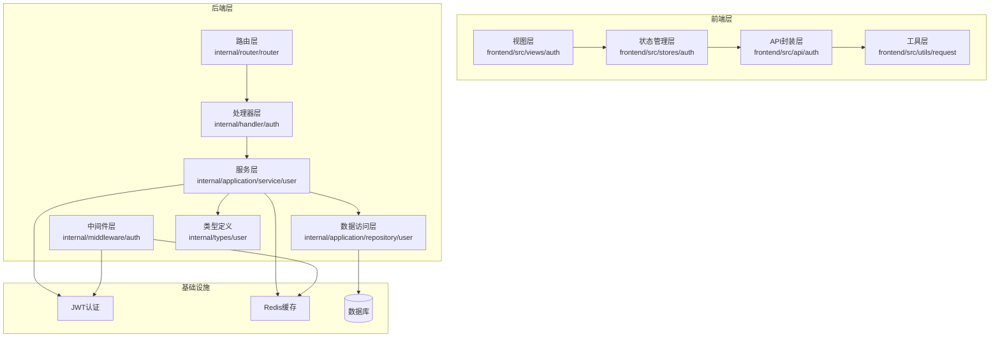
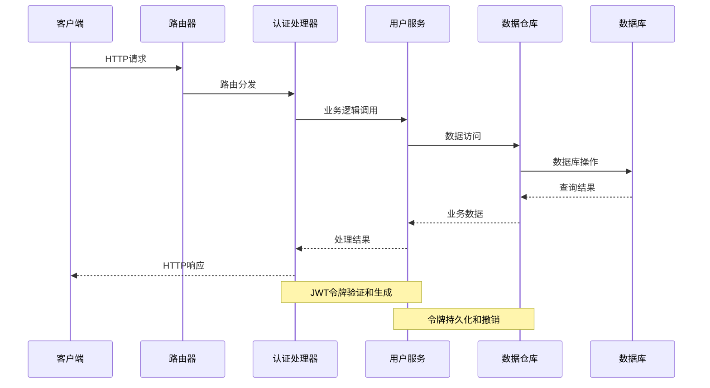
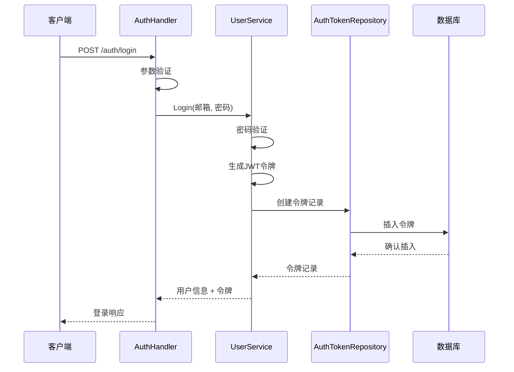
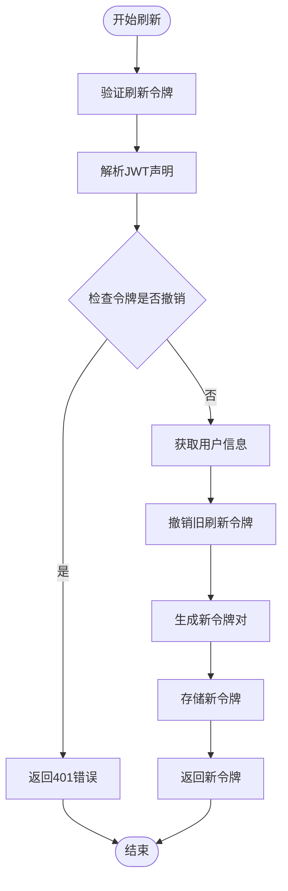
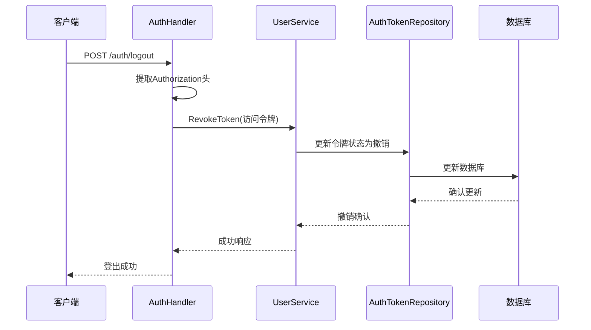
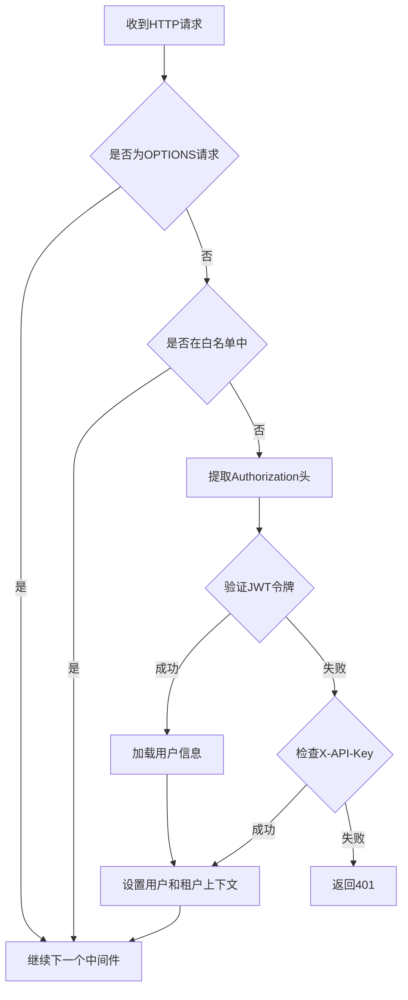
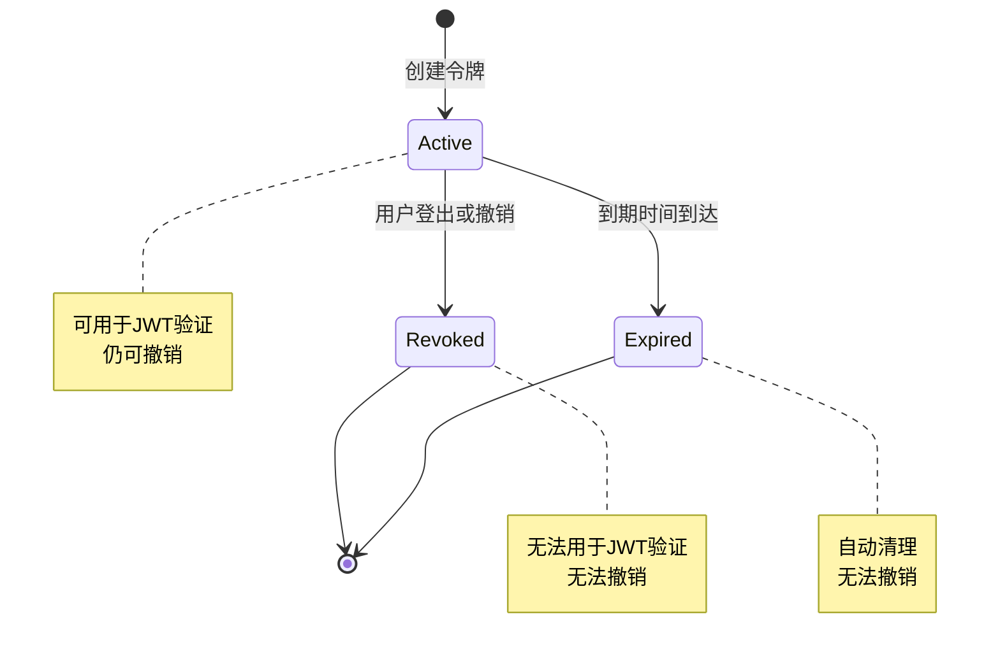
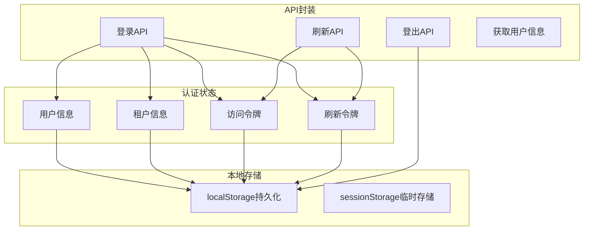
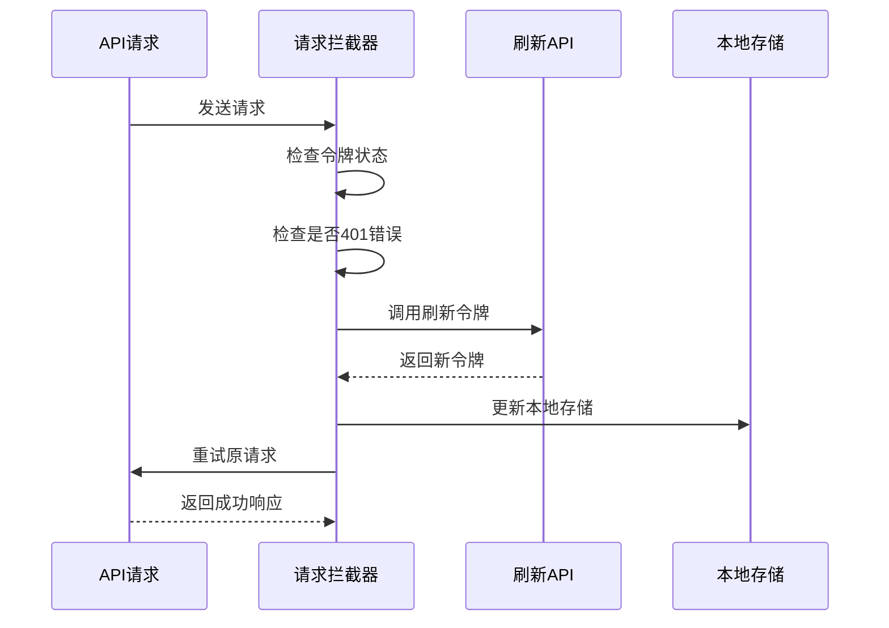
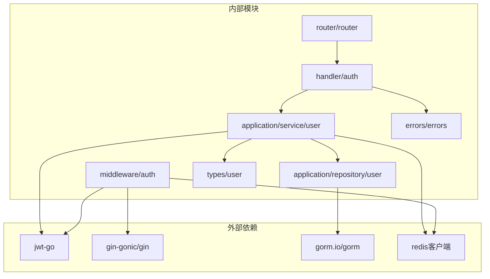

# 认证API

<cite>
**本文档引用的文件**
- [internal/handler/auth.go](file://internal/handler/auth.go)
- [internal/middleware/auth.go](file://internal/middleware/auth.go)
- [internal/application/service/user.go](file://internal/application/service/user.go)
- [internal/application/repository/user.go](file://internal/application/repository/user.go)
- [internal/router/router.go](file://internal/router/router.go)
- [internal/types/user.go](file://internal/types/user.go)
- [internal/errors/errors.go](file://internal/errors/errors.go)
- [frontend/src/api/auth/index.ts](file://frontend/src/api/auth/index.ts)
- [frontend/src/utils/request.ts](file://frontend/src/utils/request.ts)
- [frontend/src/stores/auth.ts](file://frontend/src/stores/auth.ts)
- [frontend/src/views/auth/Login.vue](file://frontend/src/views/auth/Login.vue)
- [docs/notes/接口分析.md](file://docs/notes/接口分析.md)
</cite>

## 目录
1. [简介](#简介)
2. [项目结构](#项目结构)
3. [核心组件](#核心组件)
4. [架构概览](#架构概览)
5. [详细组件分析](#详细组件分析)
6. [依赖关系分析](#依赖关系分析)
7. [性能考量](#性能考量)
8. [故障排除指南](#故障排除指南)
9. [结论](#结论)

## 简介
本文件详细文档化了WiseDx系统的认证API模块，涵盖用户登录、登出、令牌刷新等核心认证功能。系统采用JWT（JSON Web Token）实现无状态认证，结合Redis缓存提升性能，并通过Pinia状态管理实现前后端一致的认证状态。

## 项目结构
认证模块主要分布在以下层次：



**图表来源**
- [internal/router/router.go](file://internal/router/router.go#L344-L353)
- [internal/handler/auth.go](file://internal/handler/auth.go#L1-L40)
- [internal/middleware/auth.go](file://internal/middleware/auth.go#L1-L207)

**章节来源**
- [internal/router/router.go](file://internal/router/router.go#L344-L353)
- [docs/notes/接口分析.md](file://docs/notes/接口分析.md#L1-L81)

## 核心组件
认证系统由五个核心组件构成：

### 1. 认证处理器 (AuthHandler)
负责处理所有认证相关的HTTP请求，包括登录、注册、登出、令牌刷新等功能。

### 2. 认证中间件 (Auth Middleware)
实现JWT令牌验证和权限控制，支持跨租户访问。

### 3. 用户服务 (UserService)
提供用户认证、令牌生成、验证和刷新的核心业务逻辑。

### 4. 令牌仓库 (AuthTokenRepository)
管理JWT令牌的持久化存储，支持令牌撤销和过期清理。

### 5. 类型定义 (Types)
定义认证相关的数据结构，包括用户信息、令牌格式等。

**章节来源**
- [internal/handler/auth.go](file://internal/handler/auth.go#L18-L40)
- [internal/middleware/auth.go](file://internal/middleware/auth.go#L59-L196)
- [internal/application/service/user.go](file://internal/application/service/user.go#L47-L52)
- [internal/application/repository/user.go](file://internal/application/repository/user.go#L98-L152)
- [internal/types/user.go](file://internal/types/user.go#L9-L119)

## 架构概览
认证系统采用分层架构设计，确保关注点分离和代码可维护性：



**图表来源**
- [internal/router/router.go](file://internal/router/router.go#L344-L353)
- [internal/handler/auth.go](file://internal/handler/auth.go#L106-L158)
- [internal/application/service/user.go](file://internal/application/service/user.go#L262-L322)

## 详细组件分析

### 认证处理器 (AuthHandler)
认证处理器实现了完整的认证生命周期管理：

#### 登录流程


**图表来源**
- [internal/handler/auth.go](file://internal/handler/auth.go#L106-L158)
- [internal/application/service/user.go](file://internal/application/service/user.go#L262-L322)

#### 令牌刷新流程


**图表来源**
- [internal/handler/auth.go](file://internal/handler/auth.go#L211-L253)
- [internal/application/service/user.go](file://internal/application/service/user.go#L356-L405)

#### 登出流程


**图表来源**
- [internal/handler/auth.go](file://internal/handler/auth.go#L160-L209)
- [internal/application/service/user.go](file://internal/application/service/user.go#L356-L405)

**章节来源**
- [internal/handler/auth.go](file://internal/handler/auth.go#L106-L253)

### 认证中间件 (Auth Middleware)
认证中间件提供统一的请求认证和授权控制：

#### 白名单机制
系统预定义了无需认证即可访问的API端点：
- 健康检查：`/health` (GET)
- 用户注册：`/api/v1/auth/register` (POST)
- 用户登录：`/api/v1/auth/login` (POST)
- 令牌刷新：`/api/v1/auth/refresh` (POST)

#### JWT验证流程


**图表来源**
- [internal/middleware/auth.go](file://internal/middleware/auth.go#L59-L196)

**章节来源**
- [internal/middleware/auth.go](file://internal/middleware/auth.go#L18-L196)

### 用户服务 (UserService)
用户服务实现核心认证逻辑，包括JWT令牌管理和用户身份验证：

#### JWT密钥管理
服务使用线程安全的方式管理JWT密钥：
- 优先使用环境变量`JWT_SECRET`
- 若未设置，则自动生成32字节随机密钥
- 使用Base64编码存储密钥

#### 令牌生成策略
- **访问令牌**：有效期24小时，包含用户ID、邮箱、租户ID
- **刷新令牌**：有效期7天，仅包含用户ID和类型标识
- **令牌存储**：同时存储到数据库和Redis缓存

**章节来源**
- [internal/application/service/user.go](file://internal/application/service/user.go#L24-L45)
- [internal/application/service/user.go](file://internal/application/service/user.go#L262-L322)

### 令牌仓库 (AuthTokenRepository)
令牌仓库提供完整的令牌生命周期管理：

#### 令牌操作接口
- `CreateToken`: 创建新令牌记录
- `GetTokenByValue`: 根据值获取令牌
- `GetTokensByUserID`: 获取用户所有令牌
- `UpdateToken`: 更新令牌状态
- `DeleteToken`: 删除指定令牌
- `DeleteExpiredTokens`: 清理过期令牌
- `RevokeTokensByUserID`: 撤销用户所有令牌

#### 令牌状态管理


**图表来源**
- [internal/application/repository/user.go](file://internal/application/repository/user.go#L108-L152)

**章节来源**
- [internal/application/repository/user.go](file://internal/application/repository/user.go#L98-L152)

### 前端认证实现
前端使用Vue 3 + Pinia实现完整的认证状态管理：

#### 状态管理架构


**图表来源**
- [frontend/src/stores/auth.ts](file://frontend/src/stores/auth.ts#L7-L233)
- [frontend/src/api/auth/index.ts](file://frontend/src/api/auth/index.ts#L1-L242)

#### 自动令牌刷新机制
前端实现智能的令牌刷新策略：



**图表来源**
- [frontend/src/utils/request.ts](file://frontend/src/utils/request.ts#L70-L191)

**章节来源**
- [frontend/src/stores/auth.ts](file://frontend/src/stores/auth.ts#L1-L233)
- [frontend/src/api/auth/index.ts](file://frontend/src/api/auth/index.ts#L1-L242)
- [frontend/src/utils/request.ts](file://frontend/src/utils/request.ts#L52-L191)

## 依赖关系分析



**图表来源**
- [internal/router/router.go](file://internal/router/router.go#L1-L442)
- [internal/handler/auth.go](file://internal/handler/auth.go#L1-L40)
- [internal/middleware/auth.go](file://internal/middleware/auth.go#L1-L207)

**章节来源**
- [internal/router/router.go](file://internal/router/router.go#L1-L442)
- [internal/handler/auth.go](file://internal/handler/auth.go#L1-L40)
- [internal/middleware/auth.go](file://internal/middleware/auth.go#L1-L207)

## 性能考量
认证系统的性能优化策略：

### 缓存策略
- **Redis缓存**：JWT令牌验证结果缓存，减少数据库查询
- **本地缓存**：前端使用localStorage存储认证状态，提升用户体验
- **连接池**：数据库连接池配置，避免频繁建立连接

### 并发处理
- **令牌刷新队列**：防止多个并发请求同时刷新令牌
- **互斥锁**：使用`isRefreshing`标志防止重复刷新
- **请求排队**：401错误时将请求放入队列等待刷新完成

### 内存管理
- **JWT密钥缓存**：使用once.Do确保密钥只生成一次
- **对象复用**：避免频繁创建临时对象
- **及时释放**：错误处理后及时清理资源

## 故障排除指南

### 常见错误类型

#### 401 未授权错误
**原因分析**：
- 令牌过期或无效
- 令牌被撤销
- 请求头格式不正确

**解决方案**：
```javascript
// 前端自动处理401错误
if (error.response.status === 401) {
    // 检查是否为登录接口
    if (originalRequest.url.includes('/auth/login')) {
        // 登录接口的401直接返回错误
        return Promise.reject({ message: '用户名或密码错误' });
    }
    
    // 尝试刷新令牌
    await refreshToken();
}
```

#### 403 禁止访问错误
**原因分析**：
- 用户权限不足
- 跨租户访问权限缺失
- 租户状态异常

**解决方案**：
- 检查用户角色和权限配置
- 验证目标租户的访问权限
- 确认租户状态正常

#### 令牌刷新失败
**排查步骤**：
1. 检查刷新令牌是否有效
2. 验证JWT密钥配置
3. 确认数据库连接正常
4. 查看服务器日志获取详细错误信息

**章节来源**
- [internal/errors/errors.go](file://internal/errors/errors.go#L70-L86)
- [frontend/src/utils/request.ts](file://frontend/src/utils/request.ts#L87-L167)

### 调试技巧
1. **启用详细日志**：设置`GIN_MODE=debug`查看完整请求日志
2. **检查环境变量**：确认`JWT_SECRET`已正确配置
3. **验证数据库连接**：确保认证相关表结构完整
4. **测试令牌格式**：使用在线JWT解码工具验证令牌内容

## 结论
WiseDx的认证API模块采用了现代化的JWT认证架构，结合前后端协同的设计，提供了安全可靠的用户认证体验。系统的主要优势包括：

1. **安全性**：采用JWT无状态认证，支持令牌撤销和过期管理
2. **可靠性**：完善的错误处理和重试机制
3. **性能**：Redis缓存和智能令牌刷新策略
4. **可维护性**：清晰的分层架构和完整的文档

建议在生产环境中：
- 配置安全的JWT密钥
- 设置适当的令牌过期时间
- 监控认证相关指标
- 定期清理过期令牌
- 实施额外的安全措施如IP白名单、频率限制等