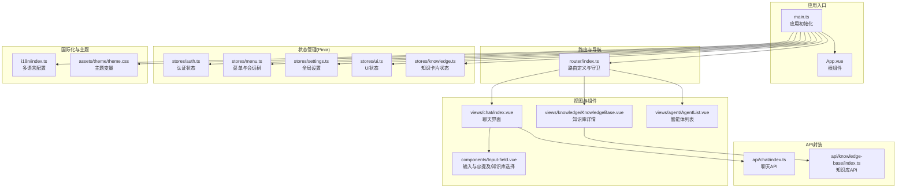
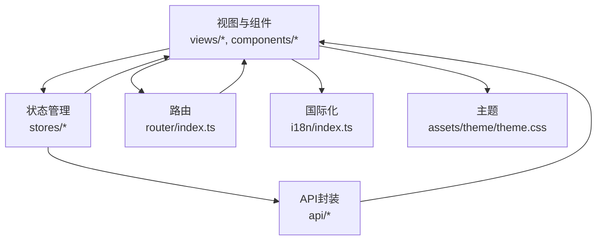
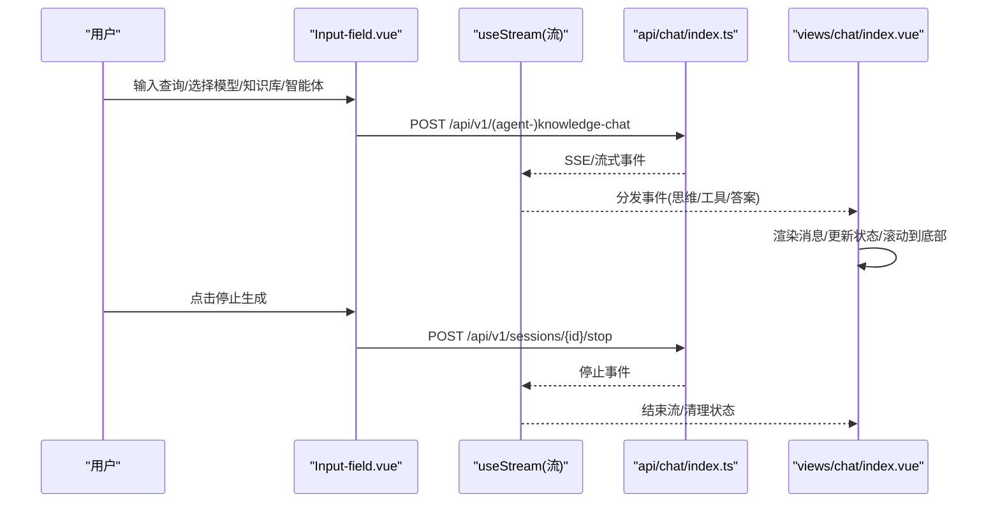
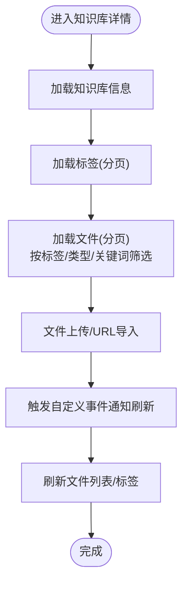
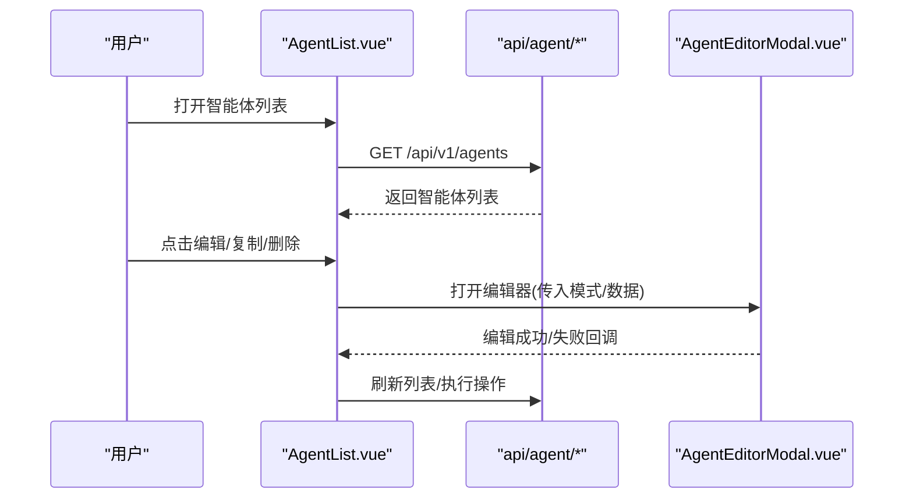
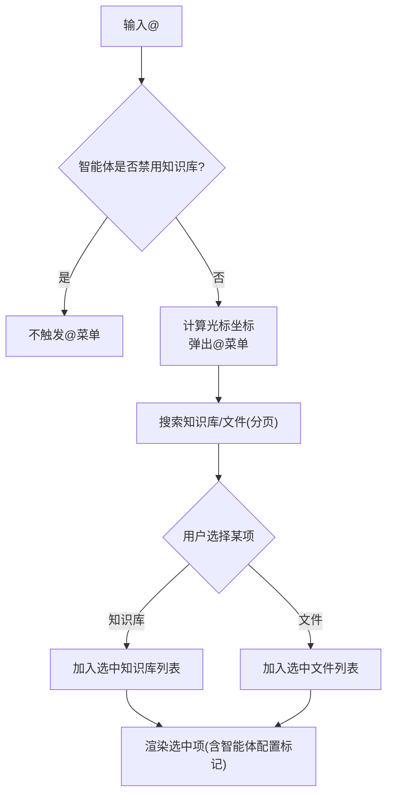
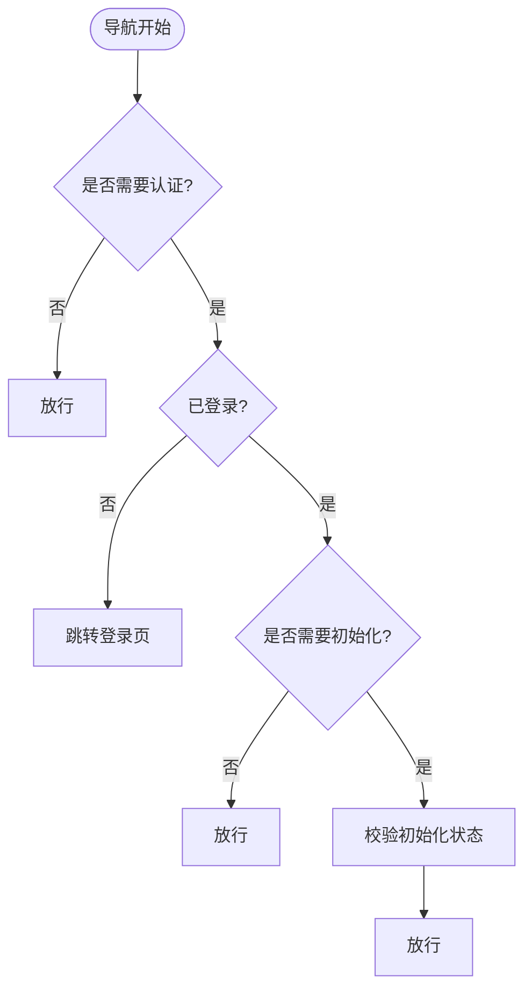
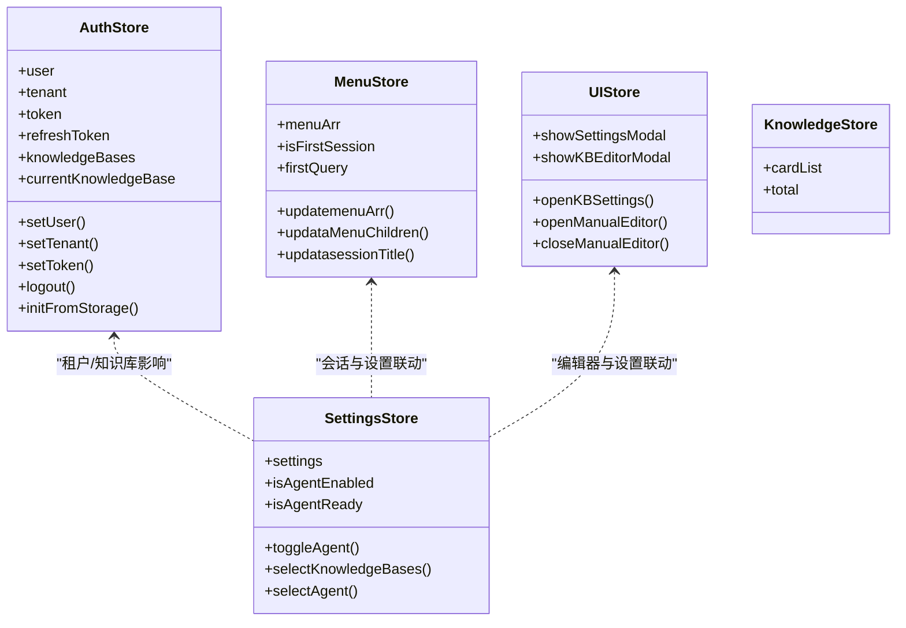
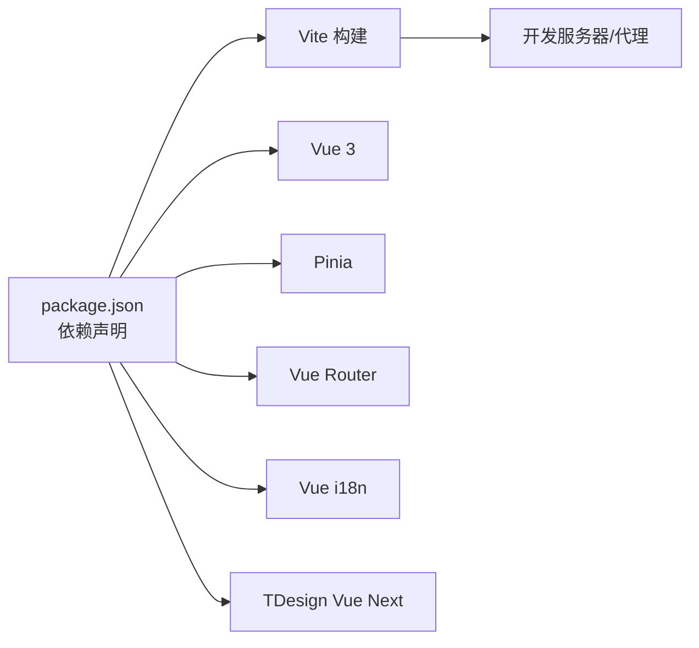

# 前端应用

<cite>
**本文引用的文件**
- [package.json](file://frontend/package.json)
- [main.ts](file://frontend/src/main.ts)
- [App.vue](file://frontend/src/App.vue)
- [router/index.ts](file://frontend/src/router/index.ts)
- [stores/auth.ts](file://frontend/src/stores/auth.ts)
- [stores/knowledge.ts](file://frontend/src/stores/knowledge.ts)
- [stores/menu.ts](file://frontend/src/stores/menu.ts)
- [stores/settings.ts](file://frontend/src/stores/settings.ts)
- [stores/ui.ts](file://frontend/src/stores/ui.ts)
- [i18n/index.ts](file://frontend/src/i18n/index.ts)
- [assets/theme/theme.css](file://frontend/src/assets/theme/theme.css)
- [vite.config.ts](file://frontend/vite.config.ts)
- [views/chat/index.vue](file://frontend/src/views/chat/index.vue)
- [views/knowledge/KnowledgeBase.vue](file://frontend/src/views/knowledge/KnowledgeBase.vue)
- [views/agent/AgentList.vue](file://frontend/src/views/agent/AgentList.vue)
- [components/Input-field.vue](file://frontend/src/components/Input-field.vue)
- [api/chat/index.ts](file://frontend/src/api/chat/index.ts)
- [api/knowledge-base/index.ts](file://frontend/src/api/knowledge-base/index.ts)
</cite>

## 目录
1. [简介](#简介)
2. [项目结构](#项目结构)
3. [核心组件](#核心组件)
4. [架构总览](#架构总览)
5. [详细组件分析](#详细组件分析)
6. [依赖关系分析](#依赖关系分析)
7. [性能考量](#性能考量)
8. [故障排查指南](#故障排查指南)
9. [结论](#结论)
10. [附录](#附录)

## 简介
本文件面向WiseDx前端应用，围绕Vue.js 3技术栈，系统化梳理应用架构、组件结构、状态管理、路由配置、国际化与主题系统、组件开发与样式定制、构建与部署流程，以及与后端API的集成与数据交互模式。目标是帮助开发者快速理解并高效扩展前端能力。

## 项目结构
前端位于frontend目录，采用Vite作为构建工具，使用Vue 3 + TypeScript + Pinia + Vue Router + TDesign组件库。项目遵循“按功能域划分”的组织方式，核心模块包括：
- 应用入口与全局注册：main.ts、App.vue
- 路由与导航：router/index.ts
- 状态管理：stores/*（认证、菜单、设置、UI、知识）
- 视图层：views/*
- 组件层：components/*
- API封装：api/*
- 国际化与主题：i18n/index.ts、assets/theme/theme.css
- 构建与开发：vite.config.ts、package.json

图表来源
- [main.ts](file://frontend/src/main.ts#L1-L20)
- [router/index.ts](file://frontend/src/router/index.ts#L1-L127)
- [stores/auth.ts](file://frontend/src/stores/auth.ts#L1-L233)
- [stores/menu.ts](file://frontend/src/stores/menu.ts#L1-L116)
- [stores/settings.ts](file://frontend/src/stores/settings.ts#L1-L342)
- [stores/ui.ts](file://frontend/src/stores/ui.ts#L1-L115)
- [stores/knowledge.ts](file://frontend/src/stores/knowledge.ts#L1-L12)
- [views/chat/index.vue](file://frontend/src/views/chat/index.vue#L1-L800)
- [views/knowledge/KnowledgeBase.vue](file://frontend/src/views/knowledge/KnowledgeBase.vue#L1-L800)
- [views/agent/AgentList.vue](file://frontend/src/views/agent/AgentList.vue#L1-L800)
- [components/Input-field.vue](file://frontend/src/components/Input-field.vue#L1-L800)
- [i18n/index.ts](file://frontend/src/i18n/index.ts#L1-L24)
- [assets/theme/theme.css](file://frontend/src/assets/theme/theme.css#L1-L95)
- [api/chat/index.ts](file://frontend/src/api/chat/index.ts#L1-L53)
- [api/knowledge-base/index.ts](file://frontend/src/api/knowledge-base/index.ts#L1-L275)

章节来源
- [main.ts](file://frontend/src/main.ts#L1-L20)
- [router/index.ts](file://frontend/src/router/index.ts#L1-L127)
- [package.json](file://frontend/package.json#L1-L58)

## 核心组件
- 应用入口与全局注册
  - 在main.ts中完成应用创建、插件注册（TDesign、Pinia、Router、i18n）、全局样式注入与挂载。
- 路由与导航
  - router/index.ts定义平台级路由、子路由与导航守卫，实现登录拦截、初始化校验与权限控制。
- 状态管理
  - stores/auth.ts：用户、租户、令牌、知识库、当前选中租户等认证相关状态与持久化。
  - stores/menu.ts：左侧菜单、会话列表、首次会话与首条消息缓存。
  - stores/settings.ts：全局设置（Agent开关、模型、知识库选择、网络搜索、智能体选择等）。
  - stores/ui.ts：弹窗与编辑器状态（知识库编辑器、设置面板、手动编辑器）。
  - stores/knowledge.ts：知识卡片列表与总数等状态。
- 视图与组件
  - views/chat/index.vue：聊天界面，支持流式输出、导出、侧边栏展示医疗问诊信息、@提及与知识库引用。
  - views/knowledge/KnowledgeBase.vue：知识库详情页，支持文件上传、URL导入、标签管理、FAQ管理、分块浏览。
  - views/agent/AgentList.vue：智能体列表，支持创建、编辑、复制、删除、特性徽章展示。
  - components/Input-field.vue：输入框组件，支持@提及（知识库/文件）、智能体模式切换、模型选择、知识库/文件选择。
- 国际化与主题
  - i18n/index.ts：多语言配置与本地存储语言偏好。
  - assets/theme/theme.css：主题变量（明/暗模式），字体、圆角、阴影等。

章节来源
- [main.ts](file://frontend/src/main.ts#L1-L20)
- [router/index.ts](file://frontend/src/router/index.ts#L1-L127)
- [stores/auth.ts](file://frontend/src/stores/auth.ts#L1-L233)
- [stores/menu.ts](file://frontend/src/stores/menu.ts#L1-L116)
- [stores/settings.ts](file://frontend/src/stores/settings.ts#L1-L342)
- [stores/ui.ts](file://frontend/src/stores/ui.ts#L1-L115)
- [stores/knowledge.ts](file://frontend/src/stores/knowledge.ts#L1-L12)
- [views/chat/index.vue](file://frontend/src/views/chat/index.vue#L1-L800)
- [views/knowledge/KnowledgeBase.vue](file://frontend/src/views/knowledge/KnowledgeBase.vue#L1-L800)
- [views/agent/AgentList.vue](file://frontend/src/views/agent/AgentList.vue#L1-L800)
- [components/Input-field.vue](file://frontend/src/components/Input-field.vue#L1-L800)
- [i18n/index.ts](file://frontend/src/i18n/index.ts#L1-L24)
- [assets/theme/theme.css](file://frontend/src/assets/theme/theme.css#L1-L95)

## 架构总览
WiseDx前端采用“视图-组件-状态-API”分层架构：
- 视图层：各页面负责业务编排与用户交互。
- 组件层：通用组件（如输入框、选择器、弹窗）复用性强。
- 状态层：Pinia Store集中管理跨组件共享状态，支持持久化与响应式。
- API层：统一封装HTTP请求，按领域拆分（聊天、知识库、智能体等）。
- 路由层：集中定义页面路由与导航守卫，保障安全与体验。
- 国际化与主题：i18n提供多语言，theme.css提供主题变量与明/暗模式。

图表来源
- [router/index.ts](file://frontend/src/router/index.ts#L1-L127)
- [stores/auth.ts](file://frontend/src/stores/auth.ts#L1-L233)
- [stores/menu.ts](file://frontend/src/stores/menu.ts#L1-L116)
- [stores/settings.ts](file://frontend/src/stores/settings.ts#L1-L342)
- [stores/ui.ts](file://frontend/src/stores/ui.ts#L1-L115)
- [stores/knowledge.ts](file://frontend/src/stores/knowledge.ts#L1-L12)
- [api/chat/index.ts](file://frontend/src/api/chat/index.ts#L1-L53)
- [api/knowledge-base/index.ts](file://frontend/src/api/knowledge-base/index.ts#L1-L275)
- [i18n/index.ts](file://frontend/src/i18n/index.ts#L1-L24)
- [assets/theme/theme.css](file://frontend/src/assets/theme/theme.css#L1-L95)

## 详细组件分析

### 聊天界面（views/chat/index.vue）
- 功能概览
  - 展示消息列表，支持滚动加载、流式输出、停止生成。
  - 支持导出为Markdown/PDF，格式化引用与提及。
  - 医疗问诊场景：聚合收集数据与计划步骤，右侧侧边栏展示。
  - 集成知识库编辑器弹窗，支持新建/编辑知识库。
- 数据流
  - 通过useStream消费流式事件，解析agent_event、tool_call、answer等事件类型。
  - 与API层的聊天接口协作，支持普通知识问答与Agent模式。
- 关键交互
  - 输入组件Input-field负责组装查询、模型、提及项、知识库/文件选择、智能体开关与网络搜索开关。
  - 会话标题生成、消息列表加载、滚动行为均在此组件内处理。

图表来源
- [views/chat/index.vue](file://frontend/src/views/chat/index.vue#L1-L800)
- [components/Input-field.vue](file://frontend/src/components/Input-field.vue#L1-L800)
- [api/chat/index.ts](file://frontend/src/api/chat/index.ts#L1-L53)

章节来源
- [views/chat/index.vue](file://frontend/src/views/chat/index.vue#L1-L800)
- [components/Input-field.vue](file://frontend/src/components/Input-field.vue#L1-L800)
- [api/chat/index.ts](file://frontend/src/api/chat/index.ts#L1-L53)

### 知识库管理（views/knowledge/KnowledgeBase.vue）
- 功能概览
  - 知识库详情页，支持文件上传、URL导入、批量标签管理、FAQ管理、分块浏览与详情查看。
  - 支持按标签、类型、关键词筛选，分页加载。
  - 与UI Store联动，打开知识库编辑器与手动编辑器。
- 数据流
  - 通过API封装的知识库与文件操作接口，结合本地状态与远程数据同步。
  - 上传完成后通过自定义事件通知刷新列表。
- 关键交互
  - 文件类型过滤、重复文件检测、批量状态轮询、URL导入校验与错误提示。

图表来源
- [views/knowledge/KnowledgeBase.vue](file://frontend/src/views/knowledge/KnowledgeBase.vue#L1-L800)
- [api/knowledge-base/index.ts](file://frontend/src/api/knowledge-base/index.ts#L1-L275)

章节来源
- [views/knowledge/KnowledgeBase.vue](file://frontend/src/views/knowledge/KnowledgeBase.vue#L1-L800)
- [api/knowledge-base/index.ts](file://frontend/src/api/knowledge-base/index.ts#L1-L275)

### 智能体编辑器（views/agent/AgentList.vue）
- 功能概览
  - 展示智能体卡片，内置/自定义区分，特性徽章（网络搜索、知识库、MCP、多轮对话）。
  - 支持创建、编辑、复制、删除智能体，编辑器弹窗联动。
- 数据流
  - 通过API封装的智能体列表与操作接口，结合本地状态与UI Store。
- 关键交互
  - URL参数触发编辑器打开；删除确认对话框；编辑成功后刷新列表。

图表来源
- [views/agent/AgentList.vue](file://frontend/src/views/agent/AgentList.vue#L1-L800)
- [api/knowledge-base/index.ts](file://frontend/src/api/knowledge-base/index.ts#L1-L275)

章节来源
- [views/agent/AgentList.vue](file://frontend/src/views/agent/AgentList.vue#L1-L800)

### 输入组件（components/Input-field.vue）
- 功能概览
  - @提及：支持知识库与文件两种类型，动态搜索、分页加载、上下键导航。
  - 智能体模式：内置快速问答/智能推理，或自定义智能体；根据智能体配置锁定/解锁知识库与网络搜索。
  - 模型选择：从会话配置与可用模型中选择，支持跳转到设置页。
  - 知识库/文件选择：支持多选，显示摘要信息，支持移除。
- 数据流
  - 与Settings Store交互，持久化用户选择；与API交互，加载知识库、文件、智能体、模型配置。
- 关键交互
  - 输入法组合中不触发@菜单；光标坐标计算决定@菜单上下弹出方向；智能体配置影响可选项与可见性。

图表来源
- [components/Input-field.vue](file://frontend/src/components/Input-field.vue#L1-L800)
- [stores/settings.ts](file://frontend/src/stores/settings.ts#L1-L342)

章节来源
- [components/Input-field.vue](file://frontend/src/components/Input-field.vue#L1-L800)
- [stores/settings.ts](file://frontend/src/stores/settings.ts#L1-L342)

### 路由与导航（router/index.ts）
- 路由定义
  - 登录页、平台首页、知识库列表、知识库详情、智能体列表、全局/知识库级会话创建、会话详情等。
- 导航守卫
  - 对requiresAuth/needsInit进行校验，未登录跳转登录页；已登录访问登录页重定向至知识库列表。
  - 可扩展Token有效性校验（当前注释掉，便于开发期调试）。

图表来源
- [router/index.ts](file://frontend/src/router/index.ts#L1-L127)

章节来源
- [router/index.ts](file://frontend/src/router/index.ts#L1-L127)

### 状态管理（Pinia Store）
- 认证状态（stores/auth.ts）
  - 用户、租户、令牌、知识库列表、当前知识库、选中租户等，均支持localStorage持久化与恢复。
- 菜单与会话（stores/menu.ts）
  - 菜单结构、会话列表、首次会话与首条消息缓存，支持国际化标题更新。
- 全局设置（stores/settings.ts）
  - Agent开关、模型配置、知识库/文件选择、网络搜索、智能体选择等，支持持久化。
- UI状态（stores/ui.ts）
  - 设置面板、知识库编辑器、手动编辑器等弹窗状态与初始参数。
- 知识卡片状态（stores/knowledge.ts）
  - 简化状态，承载卡片列表与总数。

图表来源
- [stores/auth.ts](file://frontend/src/stores/auth.ts#L1-L233)
- [stores/menu.ts](file://frontend/src/stores/menu.ts#L1-L116)
- [stores/settings.ts](file://frontend/src/stores/settings.ts#L1-L342)
- [stores/ui.ts](file://frontend/src/stores/ui.ts#L1-L115)
- [stores/knowledge.ts](file://frontend/src/stores/knowledge.ts#L1-L12)

章节来源
- [stores/auth.ts](file://frontend/src/stores/auth.ts#L1-L233)
- [stores/menu.ts](file://frontend/src/stores/menu.ts#L1-L116)
- [stores/settings.ts](file://frontend/src/stores/settings.ts#L1-L342)
- [stores/ui.ts](file://frontend/src/stores/ui.ts#L1-L115)
- [stores/knowledge.ts](file://frontend/src/stores/knowledge.ts#L1-L12)

### 国际化与主题系统
- 国际化（i18n/index.ts）
  - 支持zh-CN/en-US，从localStorage读取语言偏好，回退到中文。
- 主题系统（assets/theme/theme.css）
  - 提供明/暗两套主题变量，覆盖品牌色、灰阶、字体、圆角、阴影等。
  - 通过CSS变量与组件库样式变量协同，实现主题切换基础。

章节来源
- [i18n/index.ts](file://frontend/src/i18n/index.ts#L1-L24)
- [assets/theme/theme.css](file://frontend/src/assets/theme/theme.css#L1-L95)

## 依赖关系分析
- 依赖与版本
  - Vue 3、Pinia、Vue Router、Vue i18n、TDesign Vue Next、Swiper、highlight.js、marked、pagefind、xlsx等。
- 构建与开发
  - Vite插件：@vitejs/plugin-vue、@vitejs/plugin-vue-jsx。
  - 本地开发代理：/api -> http://localhost:8080。
- 运行时依赖
  - axios、@microsoft/fetch-event-source（SSE）、dompurify、papaparse等。

图表来源
- [package.json](file://frontend/package.json#L1-L58)
- [vite.config.ts](file://frontend/vite.config.ts#L1-L29)

章节来源
- [package.json](file://frontend/package.json#L1-L58)
- [vite.config.ts](file://frontend/vite.config.ts#L1-L29)

## 性能考量
- 聊天界面
  - 消息列表采用虚拟滚动与分页加载，滚动到顶部时增量加载，避免一次性渲染大量DOM。
  - 流式输出按事件粒度更新，减少重绘。
- 知识库详情
  - 标签与文件列表分页加载，关键词/类型筛选防抖，降低API压力。
  - 上传完成后通过事件驱动刷新，避免轮询。
- 输入组件
  - @提及搜索分页加载，避免一次性拉取过多数据；输入法组合期间不触发搜索。
- 状态管理
  - Pinia持久化仅保存必要字段，避免冗余数据；组件内computed与watch合理拆分，减少不必要的响应式开销。

## 故障排查指南
- 登录与权限
  - 若出现循环跳转或无法进入平台，检查路由守卫逻辑与认证状态；确认localStorage中token与用户信息是否正确。
- 聊天流式输出异常
  - 检查SSE连接与后端事件推送；确认useStream的onChunk监听是否正常；关注错误watch分支。
- 知识库上传失败
  - 检查文件类型与大小限制；查看重复文件提示；确认知识库初始化状态（嵌入/摘要模型ID）。
- @提及不可见
  - 确认智能体是否禁用知识库；检查输入法组合状态；核对光标坐标计算与@触发条件。
- 国际化与主题
  - 切换语言后需刷新页面生效；主题变量变更需确保组件库样式变量同步。

章节来源
- [router/index.ts](file://frontend/src/router/index.ts#L83-L124)
- [views/chat/index.vue](file://frontend/src/views/chat/index.vue#L748-L757)
- [views/knowledge/KnowledgeBase.vue](file://frontend/src/views/knowledge/KnowledgeBase.vue#L660-L760)
- [components/Input-field.vue](file://frontend/src/components/Input-field.vue#L743-L799)
- [i18n/index.ts](file://frontend/src/i18n/index.ts#L12-L14)
- [assets/theme/theme.css](file://frontend/src/assets/theme/theme.css#L1-L95)

## 结论
WiseDx前端应用以Vue 3为核心，结合Pinia实现清晰的状态管理，通过路由守卫保障安全与体验，配合TDesign组件库与国际化/主题系统，形成高可维护性的前端架构。聊天、知识库与智能体三大核心功能域边界清晰，API封装与组件复用提升开发效率。建议后续持续优化：
- 完善Token校验与自动刷新机制；
- 扩展主题切换与深色模式的自动化适配；
- 增强错误边界与加载态的用户体验；
- 对高频API调用增加缓存策略与去重逻辑。

## 附录
- 构建与运行
  - 开发：npm run dev（Vite开发服务器，端口5173，/api代理到后端8080）。
  - 预览：npm run preview。
  - 构建：npm run build。
- 部署建议
  - 生产环境建议将静态资源置于CDN；后端API域名与证书配置需与代理一致；国际化与主题文件随打包产物发布。

章节来源
- [vite.config.ts](file://frontend/vite.config.ts#L1-L29)
- [package.json](file://frontend/package.json#L6-L12)