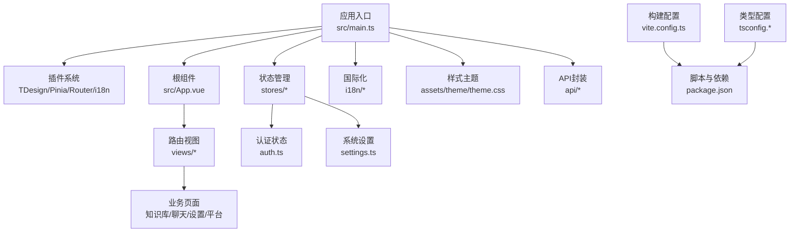
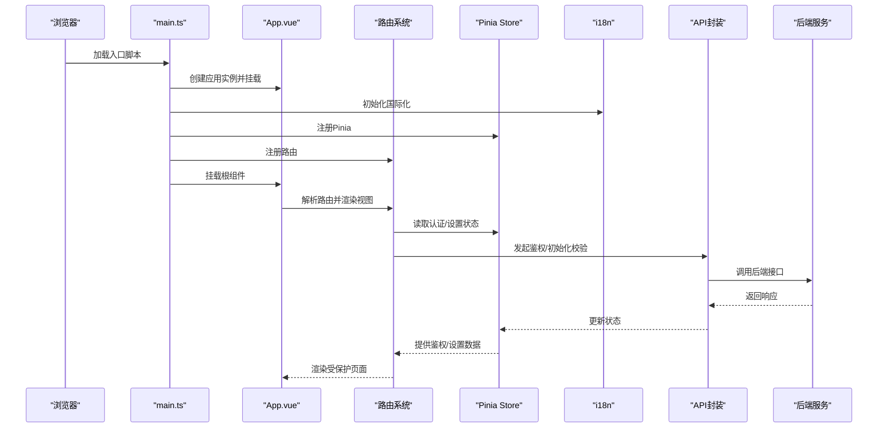
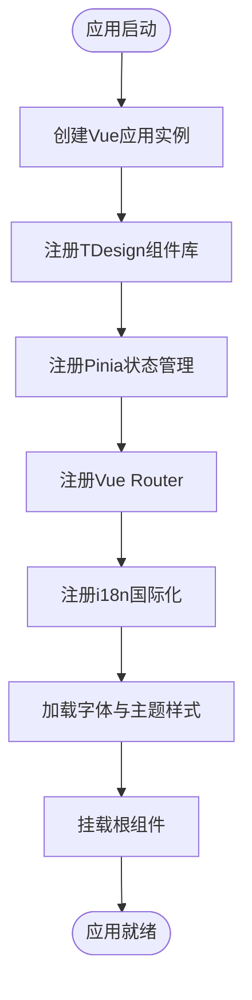
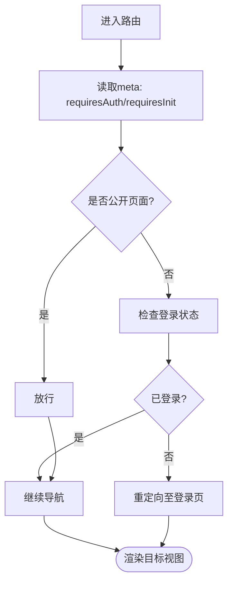
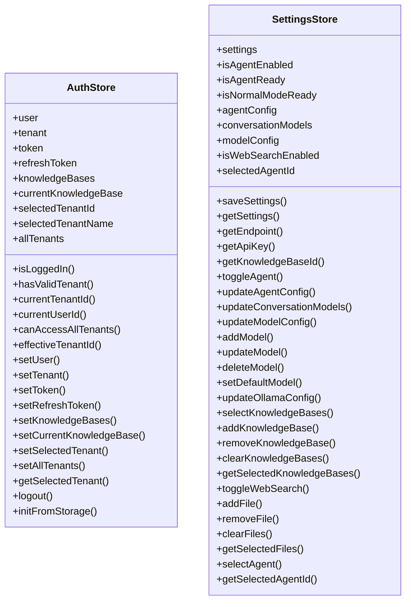
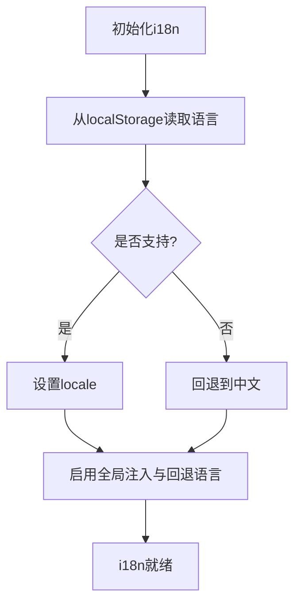
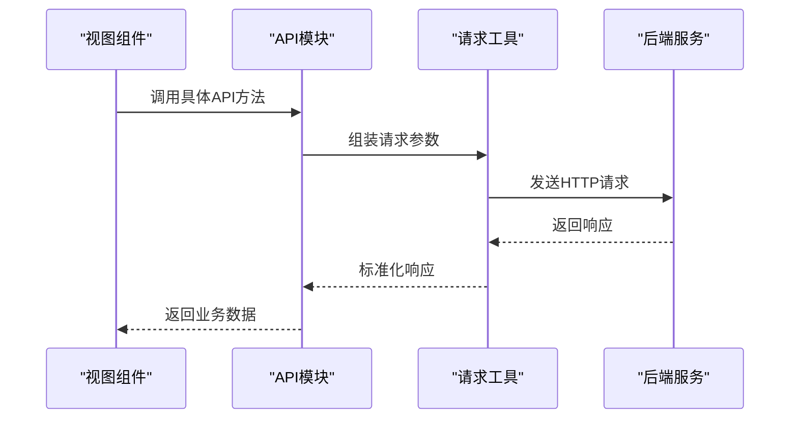
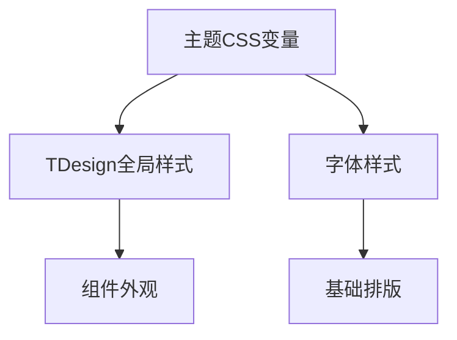
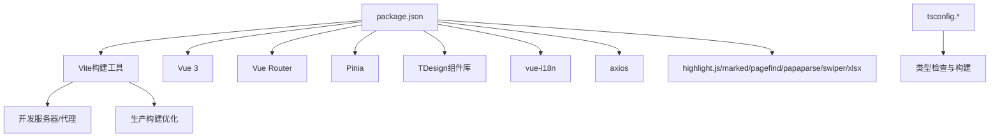

# 前端架构设计

<cite>
**本文档引用的文件**
- [frontend/package.json](file://frontend/package.json)
- [frontend/vite.config.ts](file://frontend/vite.config.ts)
- [frontend/src/main.ts](file://frontend/src/main.ts)
- [frontend/src/App.vue](file://frontend/src/App.vue)
- [frontend/tsconfig.json](file://frontend/tsconfig.json)
- [frontend/tsconfig.app.json](file://frontend/tsconfig.app.json)
- [frontend/tsconfig.node.json](file://frontend/tsconfig.node.json)
- [frontend/src/router/index.ts](file://frontend/src/router/index.ts)
- [frontend/src/i18n/index.ts](file://frontend/src/i18n/index.ts)
- [frontend/src/stores/auth.ts](file://frontend/src/stores/auth.ts)
- [frontend/src/stores/settings.ts](file://frontend/src/stores/settings.ts)
- [frontend/src/assets/theme/theme.css](file://frontend/src/assets/theme/theme.css)
- [frontend/src/api/auth/index.ts](file://frontend/src/api/auth/index.ts)
- [frontend/src/api/knowledge-base/index.ts](file://frontend/src/api/knowledge-base/index.ts)
- [frontend/src/i18n/locales/zh-CN.ts](file://frontend/src/i18n/locales/zh-CN.ts)
</cite>

## 目录
1. [简介](#简介)
2. [项目结构](#项目结构)
3. [核心组件](#核心组件)
4. [架构总览](#架构总览)
5. [详细组件分析](#详细组件分析)
6. [依赖分析](#依赖分析)
7. [性能考虑](#性能考虑)
8. [故障排查指南](#故障排查指南)
9. [结论](#结论)
10. [附录](#附录)

## 简介
本文件面向WiseDx前端团队与技术读者，系统性阐述基于Vue.js 3的前端架构设计。内容涵盖应用初始化流程、插件系统配置、构建工具设置、项目结构组织原则、TypeScript集成、组件库(TDesign)与样式系统、开发环境配置、热重载机制、生产构建优化、架构最佳实践与性能优化建议。目标是帮助开发者快速理解并高效扩展前端能力。

## 项目结构
WiseDx前端位于仓库的frontend目录，采用“功能域+模块化”的组织方式，结合TypeScript与Vite构建工具，形成清晰的层次结构：
- 应用入口与初始化：main.ts负责创建Vue实例、挂载插件（TDesign、Pinia、Router、i18n）、挂载根组件。
- 视图与路由：views按业务域划分（平台、知识库、聊天、设置等），router/index.ts集中定义路由与导航守卫。
- 状态管理：stores使用Pinia，拆分为认证(auth)、设置(settings)等独立store。
- API封装：api目录按领域拆分（auth、knowledge-base等），统一通过请求工具进行HTTP交互。
- 国际化：i18n目录提供多语言资源与初始化逻辑。
- 样式与主题：assets/theme/theme.css提供TDesign变量与品牌色系，配合字体与通用样式。
- 构建与类型：Vite作为构建工具，TypeScript通过多tsconfig实现应用与Node工具链分离。

图表来源
- [frontend/src/main.ts](file://frontend/src/main.ts#L1-L20)
- [frontend/src/App.vue](file://frontend/src/App.vue#L1-L26)
- [frontend/src/router/index.ts](file://frontend/src/router/index.ts#L1-L127)
- [frontend/src/stores/auth.ts](file://frontend/src/stores/auth.ts#L1-L233)
- [frontend/src/stores/settings.ts](file://frontend/src/stores/settings.ts#L1-L342)
- [frontend/src/i18n/index.ts](file://frontend/src/i18n/index.ts#L1-L24)
- [frontend/src/assets/theme/theme.css](file://frontend/src/assets/theme/theme.css#L1-L95)
- [frontend/src/api/auth/index.ts](file://frontend/src/api/auth/index.ts#L1-L242)
- [frontend/src/api/knowledge-base/index.ts](file://frontend/src/api/knowledge-base/index.ts#L1-L275)
- [frontend/vite.config.ts](file://frontend/vite.config.ts#L1-L29)
- [frontend/package.json](file://frontend/package.json#L1-L58)
- [frontend/tsconfig.json](file://frontend/tsconfig.json#L1-L12)

章节来源
- [frontend/src/main.ts](file://frontend/src/main.ts#L1-L20)
- [frontend/src/App.vue](file://frontend/src/App.vue#L1-L26)
- [frontend/src/router/index.ts](file://frontend/src/router/index.ts#L1-L127)
- [frontend/src/stores/auth.ts](file://frontend/src/stores/auth.ts#L1-L233)
- [frontend/src/stores/settings.ts](file://frontend/src/stores/settings.ts#L1-L342)
- [frontend/src/i18n/index.ts](file://frontend/src/i18n/index.ts#L1-L24)
- [frontend/src/assets/theme/theme.css](file://frontend/src/assets/theme/theme.css#L1-L95)
- [frontend/src/api/auth/index.ts](file://frontend/src/api/auth/index.ts#L1-L242)
- [frontend/src/api/knowledge-base/index.ts](file://frontend/src/api/knowledge-base/index.ts#L1-L275)
- [frontend/vite.config.ts](file://frontend/vite.config.ts#L1-L29)
- [frontend/package.json](file://frontend/package.json#L1-L58)
- [frontend/tsconfig.json](file://frontend/tsconfig.json#L1-L12)

## 核心组件
- 应用初始化与插件系统
  - 创建Vue应用实例，依次注册TDesign组件库、Pinia状态管理、Vue Router路由、i18n国际化。
  - 引入全局样式与主题变量，确保组件库样式与品牌风格一致。
- 路由与导航守卫
  - 定义平台、知识库、聊天、设置等路由，并通过meta字段控制鉴权与初始化要求。
  - 在前置守卫中判断登录状态与系统初始化状态，必要时重定向至登录页。
- 状态管理
  - 认证store：持久化用户、租户、令牌、知识库等信息，提供登录、登出、选择租户等方法。
  - 设置store：统一管理模型配置、Agent开关、网络搜索、知识库选择等，持久化到localStorage。
- API封装
  - 将后端接口按领域拆分，提供类型安全的请求方法，便于视图层调用。
- 国际化
  - 基于vue-i18n，支持中英文切换，从localStorage读取语言偏好并回退到中文。
- 主题与样式
  - 提供明暗两套CSS变量，覆盖TDesign基础变量，统一品牌色与字号体系。

章节来源
- [frontend/src/main.ts](file://frontend/src/main.ts#L1-L20)
- [frontend/src/router/index.ts](file://frontend/src/router/index.ts#L83-L124)
- [frontend/src/stores/auth.ts](file://frontend/src/stores/auth.ts#L1-L233)
- [frontend/src/stores/settings.ts](file://frontend/src/stores/settings.ts#L1-L342)
- [frontend/src/i18n/index.ts](file://frontend/src/i18n/index.ts#L1-L24)
- [frontend/src/assets/theme/theme.css](file://frontend/src/assets/theme/theme.css#L1-L95)
- [frontend/src/api/auth/index.ts](file://frontend/src/api/auth/index.ts#L1-L242)
- [frontend/src/api/knowledge-base/index.ts](file://frontend/src/api/knowledge-base/index.ts#L1-L275)

## 架构总览
下图展示了前端应用从启动到渲染的关键交互路径，以及与后端API、状态管理、国际化、主题系统的协作关系。

图表来源
- [frontend/src/main.ts](file://frontend/src/main.ts#L1-L20)
- [frontend/src/App.vue](file://frontend/src/App.vue#L1-L26)
- [frontend/src/router/index.ts](file://frontend/src/router/index.ts#L83-L124)
- [frontend/src/stores/auth.ts](file://frontend/src/stores/auth.ts#L1-L233)
- [frontend/src/stores/settings.ts](file://frontend/src/stores/settings.ts#L1-L342)
- [frontend/src/i18n/index.ts](file://frontend/src/i18n/index.ts#L1-L24)
- [frontend/src/api/auth/index.ts](file://frontend/src/api/auth/index.ts#L1-L242)
- [frontend/src/api/knowledge-base/index.ts](file://frontend/src/api/knowledge-base/index.ts#L1-L275)

## 详细组件分析

### 组件A：应用初始化与插件系统
- 初始化流程
  - 创建Vue应用实例，引入TDesign组件库与全局样式。
  - 注册Pinia、Router、i18n插件。
  - 引入字体与主题样式，保证UI一致性。
  - 挂载根组件到DOM。
- 关键点
  - 插件注册顺序影响生命周期钩子与全局行为。
  - 主题CSS变量需在组件库样式之后引入，避免被覆盖。

图表来源
- [frontend/src/main.ts](file://frontend/src/main.ts#L1-L20)
- [frontend/src/assets/theme/theme.css](file://frontend/src/assets/theme/theme.css#L1-L95)

章节来源
- [frontend/src/main.ts](file://frontend/src/main.ts#L1-L20)
- [frontend/src/assets/theme/theme.css](file://frontend/src/assets/theme/theme.css#L1-L95)

### 组件B：路由与导航守卫
- 路由设计
  - 平台级路由（/platform/*）包含设置、知识库列表、知识库详情、全局/KB级聊天等。
  - 登录页与重定向规则明确，避免未登录用户访问受保护页面。
- 导航守卫
  - 通过meta字段标记requiresAuth与requiresInit，前置守卫中进行鉴权与初始化检查。
  - 已登录用户访问登录页时自动重定向至知识库列表。

图表来源
- [frontend/src/router/index.ts](file://frontend/src/router/index.ts#L83-L124)

章节来源
- [frontend/src/router/index.ts](file://frontend/src/router/index.ts#L1-L127)

### 组件C：状态管理（Pinia）
- 认证store（auth）
  - 状态：用户、租户、令牌、知识库列表、当前知识库、选择的租户等。
  - 行为：设置用户/租户/令牌、选择租户、登出、从localStorage恢复状态。
  - 持久化：关键状态写入localStorage，应用重启后自动恢复。
- 设置store（settings）
  - 状态：模型配置（聊天/嵌入/重排序/VLM）、Agent配置、网络搜索开关、选中的知识库与文件、Ollama配置等。
  - 行为：保存设置、切换Agent、增删改模型、选择知识库/文件、启用/禁用网络搜索等。
  - 持久化：整体设置序列化后保存到localStorage。

图表来源
- [frontend/src/stores/auth.ts](file://frontend/src/stores/auth.ts#L1-L233)
- [frontend/src/stores/settings.ts](file://frontend/src/stores/settings.ts#L1-L342)

章节来源
- [frontend/src/stores/auth.ts](file://frontend/src/stores/auth.ts#L1-L233)
- [frontend/src/stores/settings.ts](file://frontend/src/stores/settings.ts#L1-L342)

### 组件D：国际化（i18n）
- 初始化逻辑
  - 从localStorage读取语言偏好，若不在支持列表则回退到中文。
  - 基于vue-i18n创建i18n实例，启用全局注入与回退语言。
- 多语言资源
  - 中文与英文词条分别维护，支持菜单、知识库、聊天、设置、初始化、认证、通用、智能体等模块。

图表来源
- [frontend/src/i18n/index.ts](file://frontend/src/i18n/index.ts#L1-L24)
- [frontend/src/i18n/locales/zh-CN.ts](file://frontend/src/i18n/locales/zh-CN.ts#L1-L800)

章节来源
- [frontend/src/i18n/index.ts](file://frontend/src/i18n/index.ts#L1-L24)
- [frontend/src/i18n/locales/zh-CN.ts](file://frontend/src/i18n/locales/zh-CN.ts#L1-L800)

### 组件E：API封装与后端交互
- 认证API
  - 登录、注册、获取当前用户/租户、刷新Token、登出、验证Token等。
- 知识库API
  - 列表、创建、更新、删除、复制；文件上传、URL创建、手工创建；标签管理、FAQ条目批量更新、搜索、导出等。
- 请求工具
  - 统一封装GET/POST/PUT/DELETE/上传下载等方法，视图层通过API模块调用，提升可维护性与类型安全。

图表来源
- [frontend/src/api/auth/index.ts](file://frontend/src/api/auth/index.ts#L1-L242)
- [frontend/src/api/knowledge-base/index.ts](file://frontend/src/api/knowledge-base/index.ts#L1-L275)

章节来源
- [frontend/src/api/auth/index.ts](file://frontend/src/api/auth/index.ts#L1-L242)
- [frontend/src/api/knowledge-base/index.ts](file://frontend/src/api/knowledge-base/index.ts#L1-L275)

### 组件F：样式系统与主题
- 主题变量
  - 提供明/暗两套CSS变量，覆盖品牌色、警告/错误/成功色、背景/边框/组件色、字体族与字号、圆角与阴影等。
- 组件库样式
  - 引入TDesign全局样式与主题变量，确保组件外观一致。
- 字体与全局样式
  - 引入字体文件与全局样式，统一页面基础样式。

图表来源
- [frontend/src/assets/theme/theme.css](file://frontend/src/assets/theme/theme.css#L1-L95)
- [frontend/src/main.ts](file://frontend/src/main.ts#L5-L10)

章节来源
- [frontend/src/assets/theme/theme.css](file://frontend/src/assets/theme/theme.css#L1-L95)
- [frontend/src/main.ts](file://frontend/src/main.ts#L5-L10)

## 依赖分析
- 构建工具与脚本
  - Vite作为开发服务器与打包工具，支持Vue与JSX插件、路径别名与代理配置。
  - npm脚本提供开发、构建、预览与类型检查。
- 依赖生态
  - Vue 3、Vue Router、Pinia、TDesign（组件库与图标）、vue-i18n（国际化）、axios（HTTP）、highlight.js/marked/pagefind/papaparse/swiper/xlsx等。
- 类型系统
  - tsconfig.app.json与tsconfig.node.json分离应用与工具链类型配置，@vue/tsconfig与@tsconfig/node22提供标准基线。

图表来源
- [frontend/package.json](file://frontend/package.json#L1-L58)
- [frontend/vite.config.ts](file://frontend/vite.config.ts#L1-L29)
- [frontend/tsconfig.json](file://frontend/tsconfig.json#L1-L12)
- [frontend/tsconfig.app.json](file://frontend/tsconfig.app.json#L1-L13)
- [frontend/tsconfig.node.json](file://frontend/tsconfig.node.json#L1-L20)

章节来源
- [frontend/package.json](file://frontend/package.json#L1-L58)
- [frontend/vite.config.ts](file://frontend/vite.config.ts#L1-L29)
- [frontend/tsconfig.json](file://frontend/tsconfig.json#L1-L12)
- [frontend/tsconfig.app.json](file://frontend/tsconfig.app.json#L1-L13)
- [frontend/tsconfig.node.json](file://frontend/tsconfig.node.json#L1-L20)

## 性能考虑
- 构建优化
  - 使用Vite的原生ES模块与按需编译，减少冷启动时间。
  - 合理拆分代码与懒加载路由组件，降低首屏体积。
- 运行时优化
  - Pinia状态持久化仅保留必要字段，避免localStorage膨胀。
  - 图片与富媒体资源按需加载，使用骨架屏与占位符提升感知性能。
- 网络与缓存
  - API请求统一拦截与错误处理，合理利用缓存与节流。
- 主题与样式
  - 主题变量集中管理，避免重复计算与样式抖动。
- TypeScript
  - 严格类型检查与模块路径别名，提升IDE体验与重构安全性。

## 故障排查指南
- 登录与鉴权
  - 若出现循环重定向或无法进入受保护页面，检查路由meta与认证store状态。
  - Token失效或异常时，确认刷新流程与后端返回的令牌结构。
- 国际化
  - 语言切换无效时，检查localStorage中的locale键与i18n初始化逻辑。
- 设置与模型
  - Agent未就绪或模型配置异常时，核对settings store中的allowedTools、summaryModelId、rerankModelId等字段。
- 样式与主题
  - 组件样式异常或主题变量未生效时，确认主题CSS引入顺序与变量覆盖关系。
- 构建与开发
  - 开发服务器无法访问或代理失败时，检查vite.config.ts中的server.host/port/proxy配置。
  - 生产构建产物异常时，核对Vite与TypeScript配置、路径别名与插件版本。

章节来源
- [frontend/src/router/index.ts](file://frontend/src/router/index.ts#L83-L124)
- [frontend/src/stores/auth.ts](file://frontend/src/stores/auth.ts#L130-L198)
- [frontend/src/stores/settings.ts](file://frontend/src/stores/settings.ts#L100-L140)
- [frontend/src/i18n/index.ts](file://frontend/src/i18n/index.ts#L12-L22)
- [frontend/src/assets/theme/theme.css](file://frontend/src/assets/theme/theme.css#L1-L95)
- [frontend/vite.config.ts](file://frontend/vite.config.ts#L16-L27)

## 结论
WiseDx前端采用Vue 3 + TypeScript + Vite的技术栈，结合TDesign组件库与Pinia状态管理，形成了清晰的模块化架构。通过路由守卫、状态持久化、API封装与国际化方案，实现了良好的用户体验与可维护性。建议在后续迭代中持续关注构建优化、运行时性能与类型安全，以支撑更复杂的业务场景。

## 附录
- 开发与构建命令
  - 开发：npm run dev
  - 预览：npm run preview
  - 构建：npm run build
  - 类型检查：npm run type-check
- 关键配置
  - Vite插件：@vitejs/plugin-vue、@vitejs/plugin-vue-jsx
  - 路径别名：@ -> src
  - 代理：/api -> http://localhost:8080
  - TypeScript：应用与Node工具链分离配置

章节来源
- [frontend/package.json](file://frontend/package.json#L6-L12)
- [frontend/vite.config.ts](file://frontend/vite.config.ts#L3-L15)
- [frontend/tsconfig.app.json](file://frontend/tsconfig.app.json#L8-L11)
- [frontend/tsconfig.node.json](file://frontend/tsconfig.node.json#L11-L18)