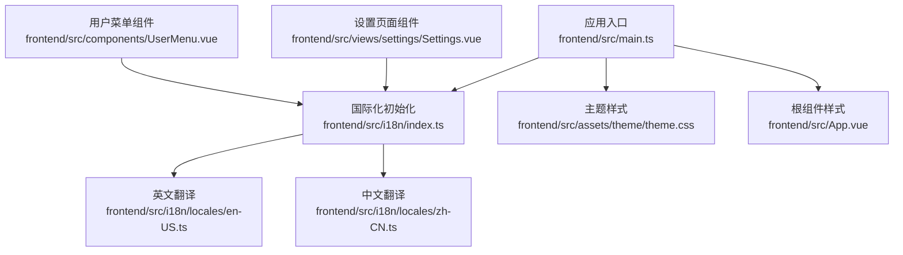
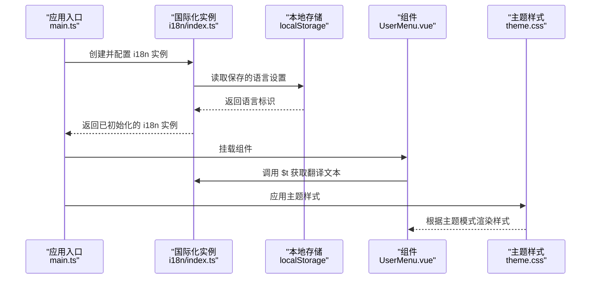
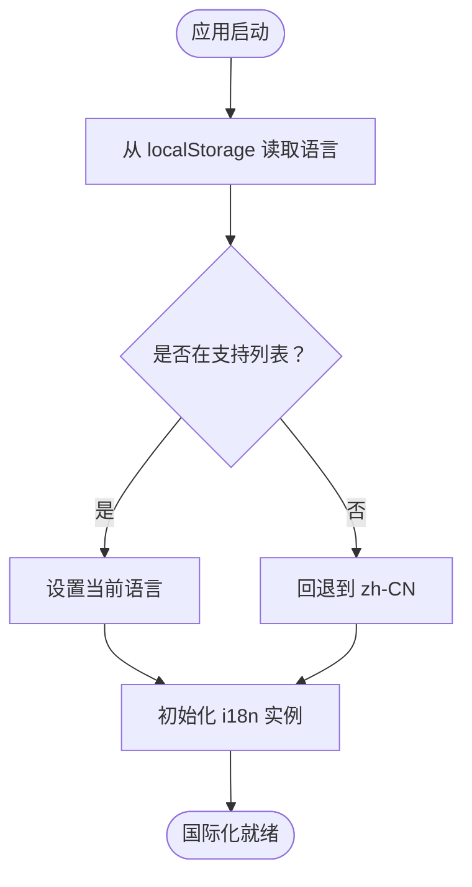
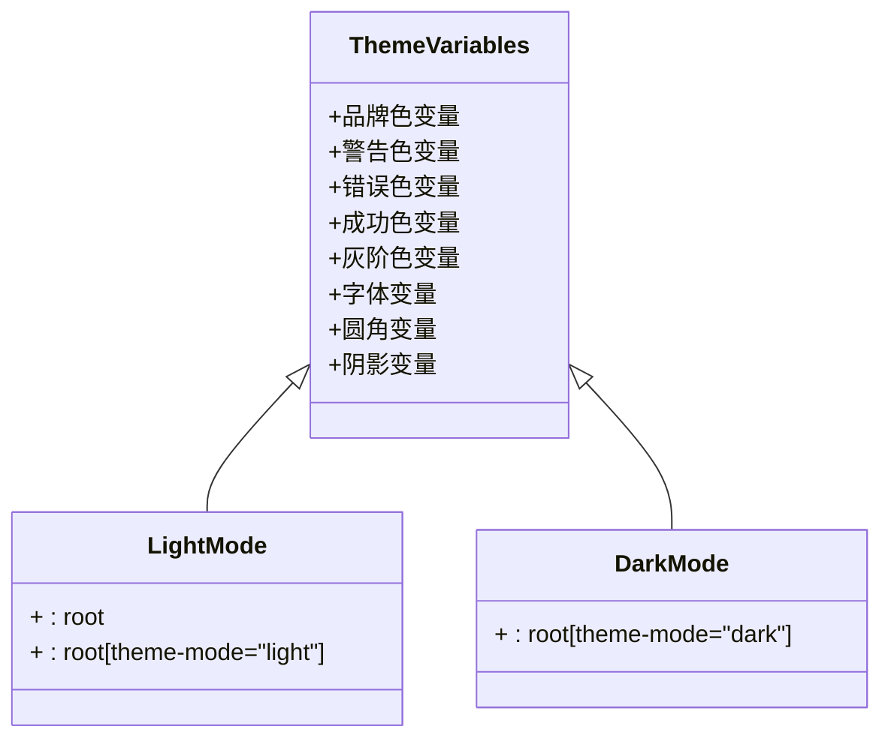
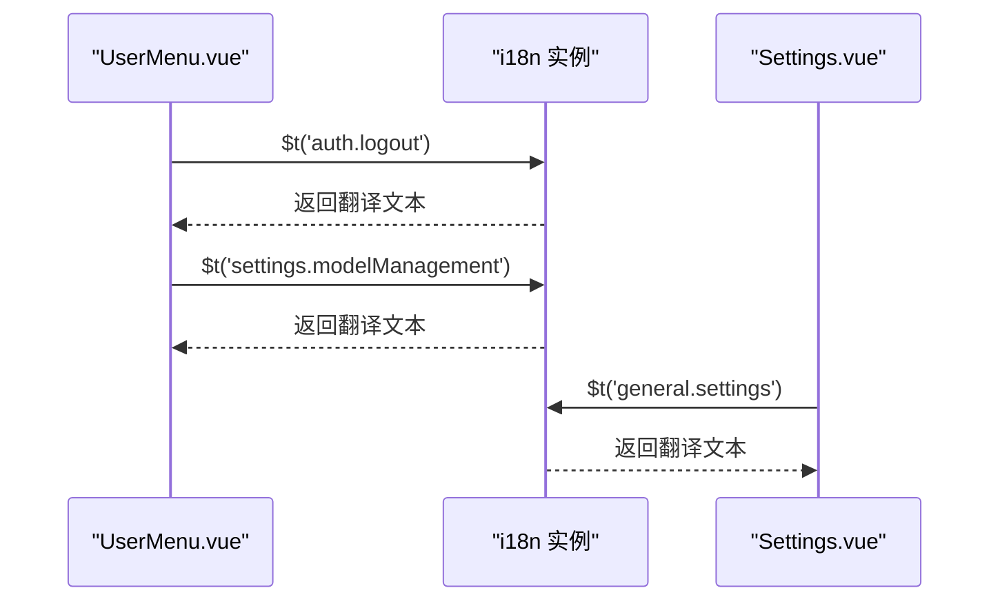
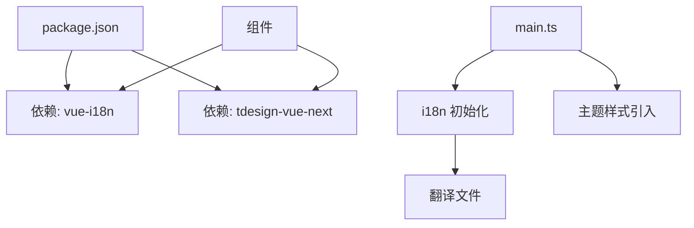

# 国际化与主题

<cite>
**本文档引用的文件**
- [frontend/src/i18n/index.ts](file://frontend/src/i18n/index.ts)
- [frontend/src/i18n/locales/en-US.ts](file://frontend/src/i18n/locales/en-US.ts)
- [frontend/src/i18n/locales/zh-CN.ts](file://frontend/src/i18n/locales/zh-CN.ts)
- [frontend/src/assets/theme/theme.css](file://frontend/src/assets/theme/theme.css)
- [frontend/src/main.ts](file://frontend/src/main.ts)
- [frontend/src/App.vue](file://frontend/src/App.vue)
- [frontend/src/components/UserMenu.vue](file://frontend/src/components/UserMenu.vue)
- [frontend/src/views/settings/Settings.vue](file://frontend/src/views/settings/Settings.vue)
- [frontend/package.json](file://frontend/package.json)
</cite>

## 目录
1. [简介](#简介)
2. [项目结构](#项目结构)
3. [核心组件](#核心组件)
4. [架构概览](#架构概览)
5. [详细组件分析](#详细组件分析)
6. [依赖分析](#依赖分析)
7. [性能考虑](#性能考虑)
8. [故障排除指南](#故障排除指南)
9. [结论](#结论)

## 简介
本文件详细介绍 WiseDx 前端的国际化（i18n）与主题系统实现。内容涵盖：
- 多语言配置与翻译文件管理
- 动态语言切换机制
- 主题系统架构与 CSS 变量定义
- 组件样式定制与主题切换
- 语言包结构、翻译键值管理与文本提取工具
- 国际化最佳实践（日期时间格式化、数字格式化、文本方向处理）
- 主题定制指南与样式覆盖方法

## 项目结构
前端国际化与主题系统主要位于以下目录与文件：
- 国际化：frontend/src/i18n（包含 i18n 初始化与多语言翻译文件）
- 主题：frontend/src/assets/theme/theme.css（CSS 变量与主题模式）
- 应用入口：frontend/src/main.ts（应用初始化与插件挂载）
- 根组件：frontend/src/App.vue（基础样式与全局字体）
- 典型使用：frontend/src/components/UserMenu.vue、frontend/src/views/settings/Settings.vue

**图表来源**
- [frontend/src/main.ts](file://frontend/src/main.ts#L1-L20)
- [frontend/src/i18n/index.ts](file://frontend/src/i18n/index.ts#L1-L24)
- [frontend/src/assets/theme/theme.css](file://frontend/src/assets/theme/theme.css#L1-L95)
- [frontend/src/App.vue](file://frontend/src/App.vue#L1-L26)
- [frontend/src/i18n/locales/en-US.ts](file://frontend/src/i18n/locales/en-US.ts#L1-L800)
- [frontend/src/i18n/locales/zh-CN.ts](file://frontend/src/i18n/locales/zh-CN.ts#L1-L800)
- [frontend/src/components/UserMenu.vue](file://frontend/src/components/UserMenu.vue#L1-L439)
- [frontend/src/views/settings/Settings.vue](file://frontend/src/views/settings/Settings.vue#L1-L547)

**章节来源**
- [frontend/src/main.ts](file://frontend/src/main.ts#L1-L20)
- [frontend/src/i18n/index.ts](file://frontend/src/i18n/index.ts#L1-L24)
- [frontend/src/assets/theme/theme.css](file://frontend/src/assets/theme/theme.css#L1-L95)
- [frontend/src/App.vue](file://frontend/src/App.vue#L1-L26)

## 核心组件
- 国际化初始化与配置：负责加载翻译、设置默认语言、回退语言与本地存储持久化。
- 翻译文件：按语言拆分的键值对集合，覆盖菜单、知识库、设置、聊天等模块。
- 主题系统：通过 CSS 变量定义品牌色、字体、圆角、阴影等，支持明暗两种主题模式。
- 组件集成：在 Vue 组件中通过 $t 函数使用翻译键值，主题样式通过 CSS 变量自动适配。

**章节来源**
- [frontend/src/i18n/index.ts](file://frontend/src/i18n/index.ts#L1-L24)
- [frontend/src/i18n/locales/en-US.ts](file://frontend/src/i18n/locales/en-US.ts#L1-L800)
- [frontend/src/i18n/locales/zh-CN.ts](file://frontend/src/i18n/locales/zh-CN.ts#L1-L800)
- [frontend/src/assets/theme/theme.css](file://frontend/src/assets/theme/theme.css#L1-L95)

## 架构概览
国际化与主题系统采用模块化设计：
- 国际化：基于 vue-i18n，集中管理多语言资源，支持动态切换与本地存储持久化。
- 主题：基于 CSS 变量与主题模式属性，实现明暗主题切换与组件级样式定制。
- 集成：在应用入口统一挂载国际化与主题，组件通过组合式 API 或模板语法使用。

**图表来源**
- [frontend/src/main.ts](file://frontend/src/main.ts#L1-L20)
- [frontend/src/i18n/index.ts](file://frontend/src/i18n/index.ts#L1-L24)
- [frontend/src/components/UserMenu.vue](file://frontend/src/components/UserMenu.vue#L1-L439)
- [frontend/src/assets/theme/theme.css](file://frontend/src/assets/theme/theme.css#L1-L95)

## 详细组件分析

### 国际化系统
- 初始化逻辑
  - 支持语言列表：['zh-CN', 'en-US']
  - 默认语言：从 localStorage 读取，若不在支持列表则回退到 'zh-CN'
  - 配置项：legacy=false、fallbackLocale='zh-CN'、globalInjection=true
- 翻译文件组织
  - 按模块划分键值（如 menu、knowledgeBase、settings、auth 等）
  - 支持占位符与复数形式（示例键值包含 {count} 等占位符）
- 在组件中使用
  - 通过 $t('模块.键') 获取翻译文本
  - 示例：$t('auth.logout')、$t('settings.modelManagement')

**图表来源**
- [frontend/src/i18n/index.ts](file://frontend/src/i18n/index.ts#L1-L24)

**章节来源**
- [frontend/src/i18n/index.ts](file://frontend/src/i18n/index.ts#L1-L24)
- [frontend/src/i18n/locales/en-US.ts](file://frontend/src/i18n/locales/en-US.ts#L1-L800)
- [frontend/src/i18n/locales/zh-CN.ts](file://frontend/src/i18n/locales/zh-CN.ts#L1-L800)
- [frontend/src/components/UserMenu.vue](file://frontend/src/components/UserMenu.vue#L1-L439)

### 主题系统
- CSS 变量定义
  - 品牌色、警告色、错误色、成功色、灰阶色等
  - 字体族、字号、行高、字体颜色
  - 圆角半径、阴影等视觉属性
- 主题模式
  - 明亮模式：:root、:root[theme-mode="light"]
  - 暗黑模式：:root[theme-mode="dark"]
- 组件样式定制
  - 使用 :deep(...) 作用域穿透，覆盖第三方组件库样式
  - 通过 CSS 变量实现主题切换与一致性

**图表来源**
- [frontend/src/assets/theme/theme.css](file://frontend/src/assets/theme/theme.css#L1-L95)

**章节来源**
- [frontend/src/assets/theme/theme.css](file://frontend/src/assets/theme/theme.css#L1-L95)
- [frontend/src/views/settings/Settings.vue](file://frontend/src/views/settings/Settings.vue#L1-L547)

### 组件集成与使用
- UserMenu 组件
  - 使用 $t 获取菜单项与操作文案
  - 示例：$t('auth.logout')、$t('settings.modelManagement')
- Settings 设置页面
  - 导航项与子菜单标签通过 $t 动态渲染
  - 支持快捷导航事件触发

**图表来源**
- [frontend/src/components/UserMenu.vue](file://frontend/src/components/UserMenu.vue#L1-L439)
- [frontend/src/views/settings/Settings.vue](file://frontend/src/views/settings/Settings.vue#L1-L547)
- [frontend/src/i18n/index.ts](file://frontend/src/i18n/index.ts#L1-L24)

**章节来源**
- [frontend/src/components/UserMenu.vue](file://frontend/src/components/UserMenu.vue#L1-L439)
- [frontend/src/views/settings/Settings.vue](file://frontend/src/views/settings/Settings.vue#L1-L547)

## 依赖分析
- 依赖关系
  - 应用入口 main.ts 依赖 i18n 初始化与主题样式
  - 组件通过 vue-i18n 提供的 $t 函数使用翻译
  - 主题样式通过 CSS 变量与第三方组件库样式结合
- 版本与脚本
  - 依赖 vue-i18n 实现国际化
  - 依赖 tdesign-vue-next 提供 UI 组件库
  - 包管理脚本支持开发与构建流程

**图表来源**
- [frontend/package.json](file://frontend/package.json#L1-L58)
- [frontend/src/main.ts](file://frontend/src/main.ts#L1-L20)
- [frontend/src/i18n/index.ts](file://frontend/src/i18n/index.ts#L1-L24)

**章节来源**
- [frontend/package.json](file://frontend/package.json#L1-L58)
- [frontend/src/main.ts](file://frontend/src/main.ts#L1-L20)

## 性能考虑
- 国际化
  - 使用 legacy:false 与 globalInjection:true，减少全局污染并提升性能
  - 通过本地存储缓存语言设置，避免每次刷新重新计算
- 主题
  - CSS 变量切换成本低，无需重绘整个界面
  - 避免在组件内频繁切换主题模式，建议集中控制
- 组件样式
  - 使用 :deep(...) 仅在必要时穿透作用域，减少样式冲突与重排

## 故障排除指南
- 语言切换无效
  - 检查 localStorage 中的 locale 是否在支持列表中
  - 确认 i18n 初始化时 fallbackLocale 配置正确
- 翻译缺失或键值错误
  - 核对翻译文件中是否存在对应键值
  - 检查组件中 $t 的键值拼写与层级
- 主题样式异常
  - 确认主题 CSS 文件已正确引入
  - 检查 :root[theme-mode="dark"] 与 :root[theme-mode="light"] 的选择器是否生效
  - 避免与第三方组件库样式冲突，必要时使用 :deep(...) 覆盖

**章节来源**
- [frontend/src/i18n/index.ts](file://frontend/src/i18n/index.ts#L1-L24)
- [frontend/src/assets/theme/theme.css](file://frontend/src/assets/theme/theme.css#L1-L95)

## 结论
WiseDx 前端国际化与主题系统通过清晰的模块化设计实现了良好的可维护性与扩展性：
- 国际化方面，基于 vue-i18n 的集中管理与本地存储持久化，支持多语言无缝切换
- 主题方面，通过 CSS 变量与主题模式属性，实现明暗主题统一切换与组件级样式定制
- 在实际开发中，遵循本文档的最佳实践与定制指南，可进一步提升用户体验与开发效率