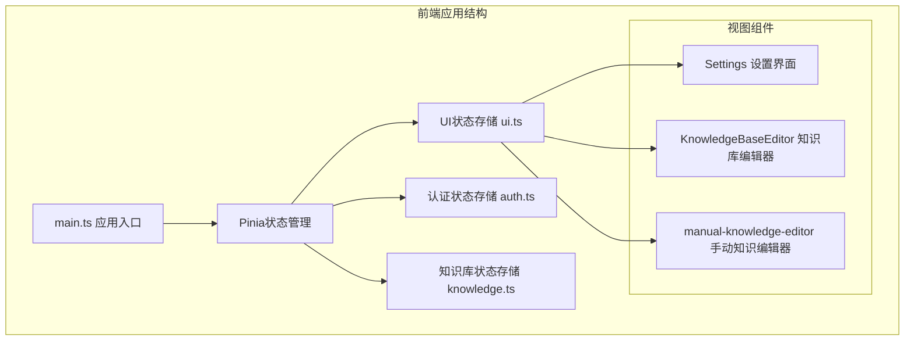
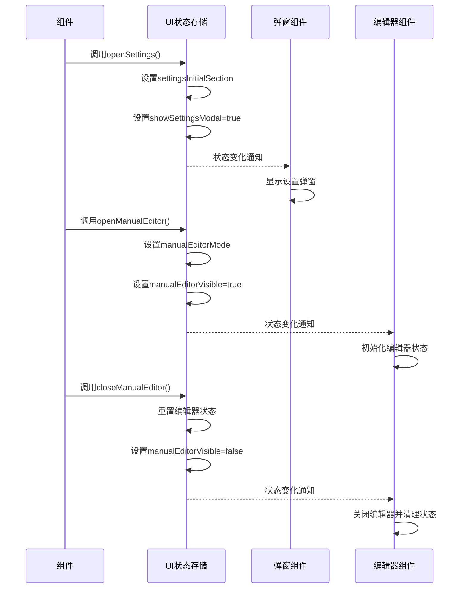
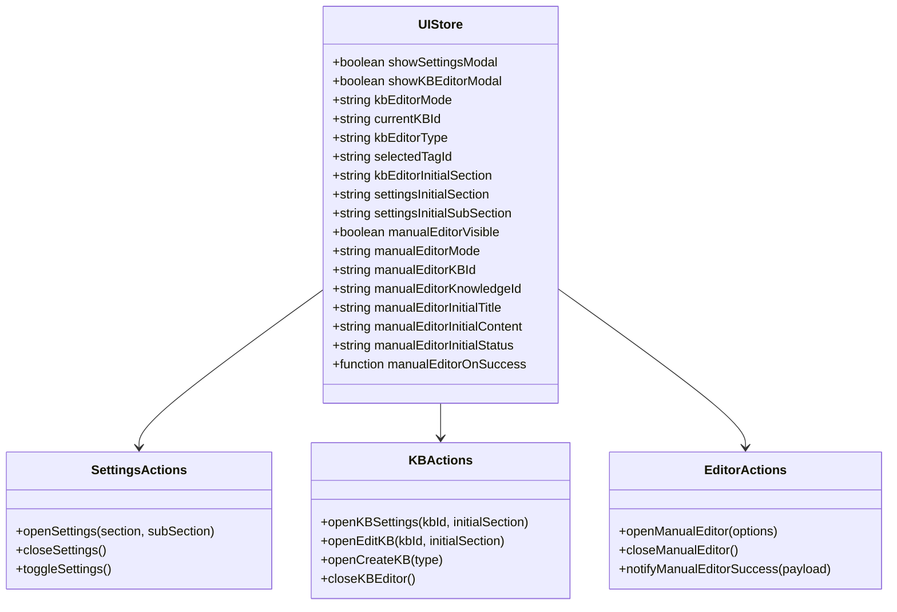
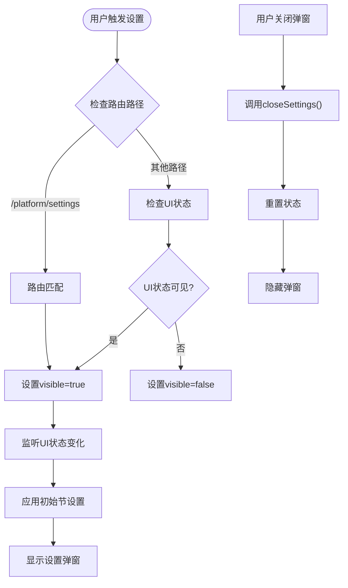
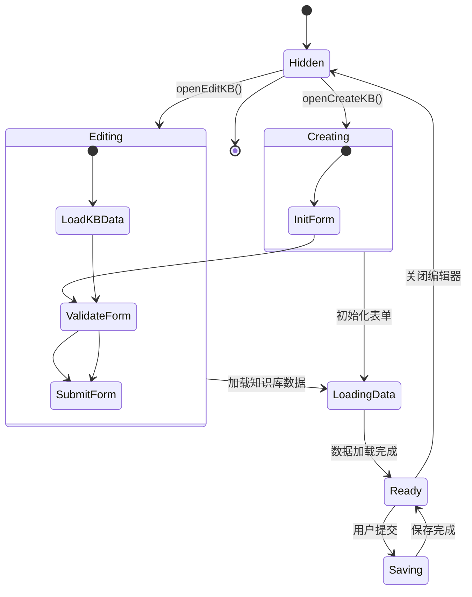
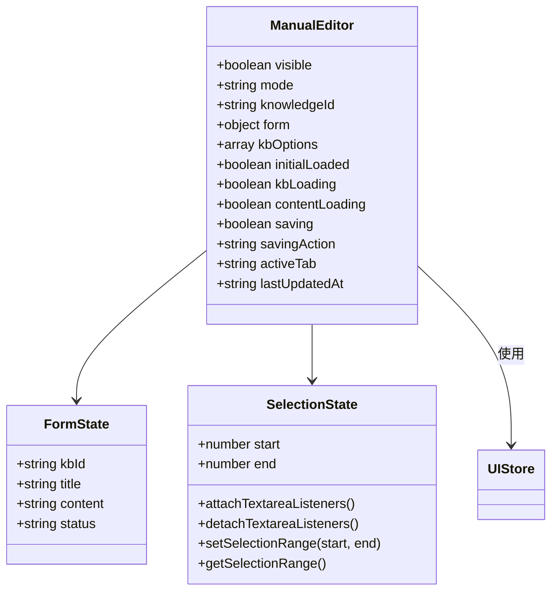
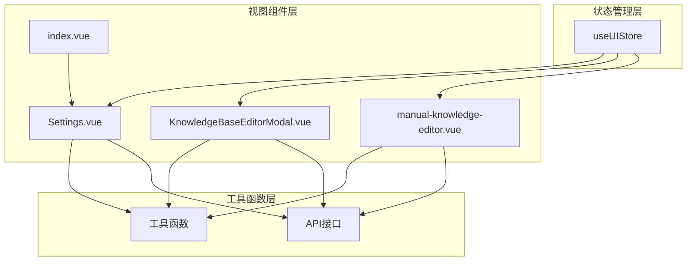

# UI状态管理

<cite>
**本文档引用的文件**
- [frontend/src/stores/ui.ts](file://frontend/src/stores/ui.ts)
- [frontend/src/components/manual-knowledge-editor.vue](file://frontend/src/components/manual-knowledge-editor.vue)
- [frontend/src/views/settings/Settings.vue](file://frontend/src/views/settings/Settings.vue)
- [frontend/src/views/knowledge/KnowledgeBaseEditorModal.vue](file://frontend/src/views/knowledge/KnowledgeBaseEditorModal.vue)
- [frontend/src/views/platform/index.vue](file://frontend/src/views/platform/index.vue)
- [frontend/src/main.ts](file://frontend/src/main.ts)
</cite>

## 目录
1. [简介](#简介)
2. [项目结构](#项目结构)
3. [核心组件](#核心组件)
4. [架构概览](#架构概览)
5. [详细组件分析](#详细组件分析)
6. [依赖关系分析](#依赖关系分析)
7. [性能考虑](#性能考虑)
8. [故障排除指南](#故障排除指南)
9. [结论](#结论)

## 简介

WiseDx的UI状态管理系统基于Pinia状态管理库构建，专门负责管理应用程序中的各种UI交互状态。该系统通过集中化的状态存储，实现了弹窗状态管理、加载状态控制、提示信息管理和对话框状态协调等功能。

系统的核心设计目标是提供一致的用户体验，确保UI状态在组件间正确同步，并支持复杂的多步骤操作流程。通过将UI状态与业务逻辑分离，系统实现了更好的可维护性和可扩展性。

## 项目结构

前端项目的UI状态管理主要集中在`frontend/src/stores/`目录下，其中`ui.ts`文件定义了核心的UI状态存储。

**图表来源**
- [frontend/src/main.ts](file://frontend/src/main.ts#L1-L20)
- [frontend/src/stores/ui.ts](file://frontend/src/stores/ui.ts#L1-L115)

**章节来源**
- [frontend/src/main.ts](file://frontend/src/main.ts#L1-L20)

## 核心组件

UI状态管理系统的核心是`useUIStore`，它提供了完整的UI状态管理能力：

### 主要状态字段

系统管理以下关键UI状态：

- **弹窗状态**: `showSettingsModal`、`showKBEditorModal`、`manualEditorVisible`
- **编辑器模式**: `kbEditorMode`、`manualEditorMode`（'create' | 'edit'）
- **知识库信息**: `currentKBId`、`kbEditorType`（'document' | 'faq'）
- **分类选择**: `selectedTagId`（用于文件上传时传递）
- **初始状态**: `kbEditorInitialSection`、`settingsInitialSection`、`settingsInitialSubSection`
- **回调机制**: `manualEditorOnSuccess`

### 动作方法

系统提供了丰富的动作方法来操作UI状态：

- **设置弹窗管理**: `openSettings()`、`closeSettings()`、`toggleSettings()`
- **知识库编辑器**: `openKBSettings()`、`openEditKB()`、`openCreateKB()`、`closeKBEditor()`
- **手动编辑器**: `openManualEditor()`、`closeManualEditor()`、`notifyManualEditorSuccess()`
- **分类管理**: `setSelectedTagId()`

**章节来源**
- [frontend/src/stores/ui.ts](file://frontend/src/stores/ui.ts#L1-L115)

## 架构概览

UI状态管理系统采用模块化设计，通过Pinia提供响应式状态管理：

**图表来源**
- [frontend/src/stores/ui.ts](file://frontend/src/stores/ui.ts#L25-L112)
- [frontend/src/components/manual-knowledge-editor.vue](file://frontend/src/components/manual-knowledge-editor.vue#L26-L632)

## 详细组件分析

### UI状态存储（useUIStore）

UI状态存储是整个系统的中枢，负责管理所有UI相关的状态和行为。

#### 状态结构设计

**图表来源**
- [frontend/src/stores/ui.ts](file://frontend/src/stores/ui.ts#L3-L23)
- [frontend/src/stores/ui.ts](file://frontend/src/stores/ui.ts#L25-L112)

#### 状态管理策略

系统采用了"状态最小化"原则，只存储必要的UI状态信息，避免冗余数据。每个状态字段都有明确的用途和生命周期管理。

**章节来源**
- [frontend/src/stores/ui.ts](file://frontend/src/stores/ui.ts#L1-L115)

### 设置弹窗组件（Settings）

设置弹窗是UI状态管理的重要组成部分，提供了完整的设置界面管理功能。

#### 弹窗状态控制

**图表来源**
- [frontend/src/views/settings/Settings.vue](file://frontend/src/views/settings/Settings.vue#L203-L214)
- [frontend/src/views/settings/Settings.vue](file://frontend/src/views/settings/Settings.vue#L217-L238)

#### 交互特性

设置弹窗支持多种交互方式：
- 键盘快捷键（ESC键关闭）
- 点击遮罩层关闭
- 路由集成
- 子菜单导航

**章节来源**
- [frontend/src/views/settings/Settings.vue](file://frontend/src/views/settings/Settings.vue#L1-L547)

### 知识库编辑器组件

知识库编辑器提供了复杂的知识库创建和编辑功能，是UI状态管理的典型应用场景。

#### 编辑器模式管理

**图表来源**
- [frontend/src/views/knowledge/KnowledgeBaseEditorModal.vue](file://frontend/src/views/knowledge/KnowledgeBaseEditorModal.vue#L664-L692)
- [frontend/src/views/knowledge/KnowledgeBaseEditorModal.vue](file://frontend/src/views/knowledge/KnowledgeBaseEditorModal.vue#L695-L702)

#### 状态同步机制

编辑器组件通过watch监听UI状态变化，实现了与全局状态的实时同步：

- 监听`visible`属性变化
- 监听`kbEditorInitialSection`变化
- 监听`showSettingsModal`变化

**章节来源**
- [frontend/src/views/knowledge/KnowledgeBaseEditorModal.vue](file://frontend/src/views/knowledge/KnowledgeBaseEditorModal.vue#L1-L982)

### 手动知识编辑器组件

手动知识编辑器是最复杂的UI组件之一，提供了完整的Markdown编辑功能。

#### 编辑器状态管理

**图表来源**
- [frontend/src/components/manual-knowledge-editor.vue](file://frontend/src/components/manual-knowledge-editor.vue#L26-L661)

#### 编辑功能实现

手动编辑器支持丰富的Markdown编辑功能：
- 文本格式化（粗体、斜体、删除线）
- 标题层级（H1-H3）
- 列表功能（有序、无序、任务列表）
- 引用和代码块
- 链接和图片插入
- 表格创建

**章节来源**
- [frontend/src/components/manual-knowledge-editor.vue](file://frontend/src/components/manual-knowledge-editor.vue#L1-L1059)

## 依赖关系分析

UI状态管理系统与其他组件的依赖关系如下：

**图表来源**
- [frontend/src/stores/ui.ts](file://frontend/src/stores/ui.ts#L1-L115)
- [frontend/src/views/settings/Settings.vue](file://frontend/src/views/settings/Settings.vue#L128-L142)
- [frontend/src/views/knowledge/KnowledgeBaseEditorModal.vue](file://frontend/src/views/knowledge/KnowledgeBaseEditorModal.vue#L185-L186)

**章节来源**
- [frontend/src/stores/ui.ts](file://frontend/src/stores/ui.ts#L1-L115)
- [frontend/src/views/platform/index.vue](file://frontend/src/views/platform/index.vue#L1-L158)

## 性能考虑

UI状态管理系统在设计时充分考虑了性能优化：

### 状态最小化策略
- 仅存储必要的UI状态信息
- 避免存储重复或可计算的状态
- 使用响应式计算属性减少不必要的重新渲染

### 组件懒加载
- 弹窗组件使用Teleport进行DOM分离
- 条件渲染确保只在需要时创建组件实例
- 动画过渡使用CSS实现，避免JavaScript动画阻塞

### 内存管理
- 组件卸载时自动清理事件监听器
- 编辑器关闭时重置所有临时状态
- 防止内存泄漏的资源清理机制

## 故障排除指南

### 常见问题及解决方案

#### 弹窗无法关闭
**问题症状**: 设置弹窗或编辑器弹窗无法正常关闭
**可能原因**:
- UI状态未正确重置
- 事件监听器未正确移除
- 组件生命周期钩子执行异常

**解决方案**:
1. 检查`closeSettings()`和`closeManualEditor()`方法的调用
2. 确认组件卸载时的清理逻辑
3. 验证状态重置的完整性

#### 状态不同步
**问题症状**: UI状态与组件显示不一致
**可能原因**:
- watch监听器配置错误
- 状态更新时机不当
- 组件响应式更新延迟

**解决方案**:
1. 检查watch监听器的依赖项配置
2. 确认状态更新的异步处理
3. 使用nextTick确保DOM更新完成

#### 性能问题
**问题症状**: 页面卡顿或响应缓慢
**可能原因**:
- 过多的响应式依赖
- 不必要的组件重渲染
- 内存泄漏

**解决方案**:
1. 优化watch监听器的触发频率
2. 减少不必要的响应式状态
3. 实施适当的组件缓存策略

**章节来源**
- [frontend/src/components/manual-knowledge-editor.vue](file://frontend/src/components/manual-knowledge-editor.vue#L658-L660)
- [frontend/src/views/knowledge/KnowledgeBaseEditorModal.vue](file://frontend/src/views/knowledge/KnowledgeBaseEditorModal.vue#L655-L661)

## 结论

WiseDx的UI状态管理系统通过精心设计的状态存储和组件集成，实现了复杂UI交互的有效管理。系统的主要优势包括：

1. **模块化设计**: 清晰的状态分离和职责划分
2. **响应式更新**: 基于Vue响应式的高效状态管理
3. **用户体验**: 一致的交互模式和流畅的动画效果
4. **可维护性**: 良好的代码组织和文档化

该系统为WiseDx提供了坚实的基础，支持从简单的设置弹窗到复杂的知识库编辑器等各种UI场景。通过持续的优化和改进，系统将继续为用户提供优秀的用户体验。