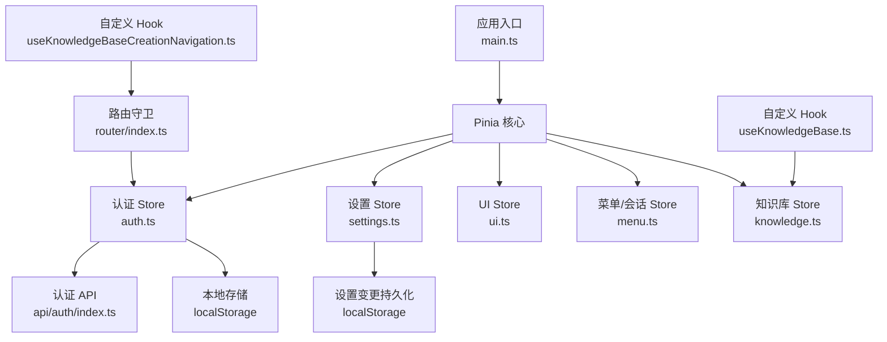
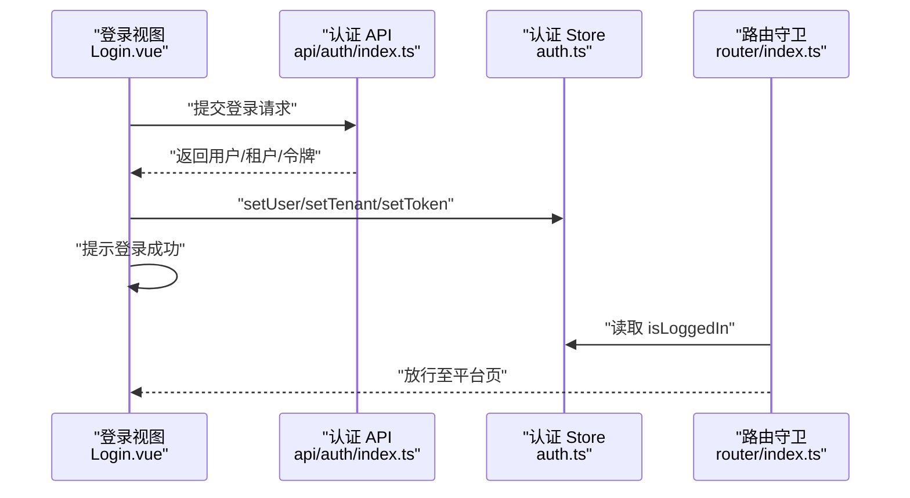
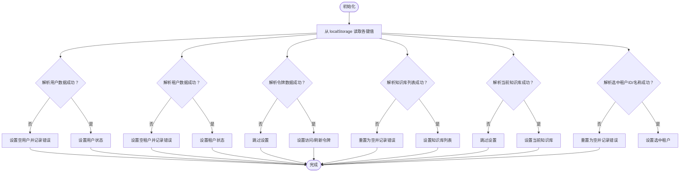
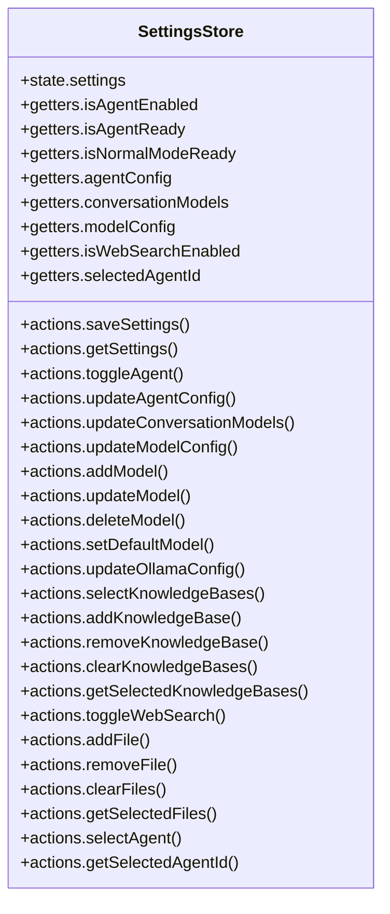
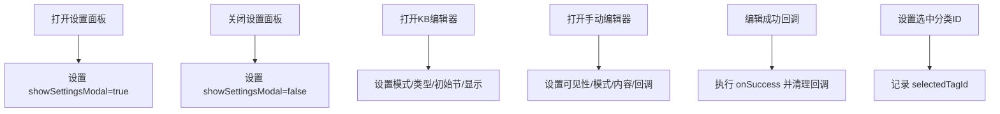
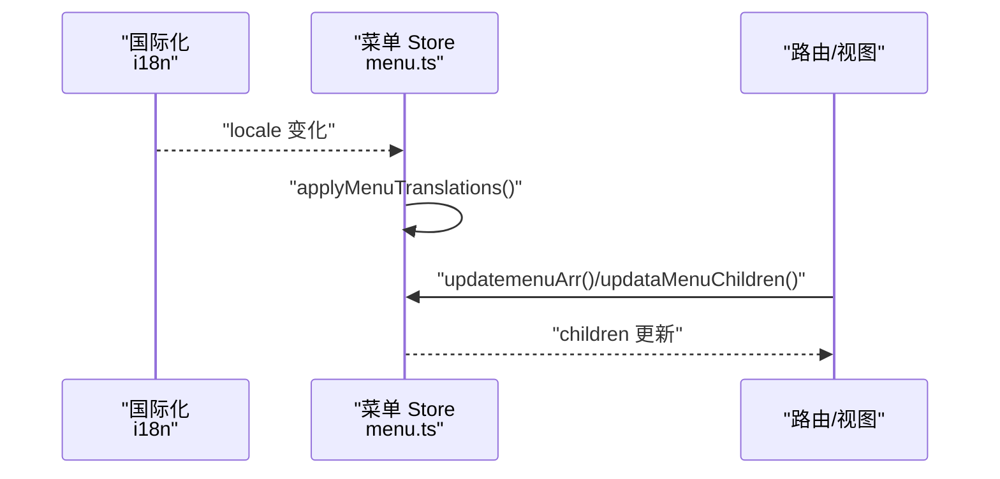
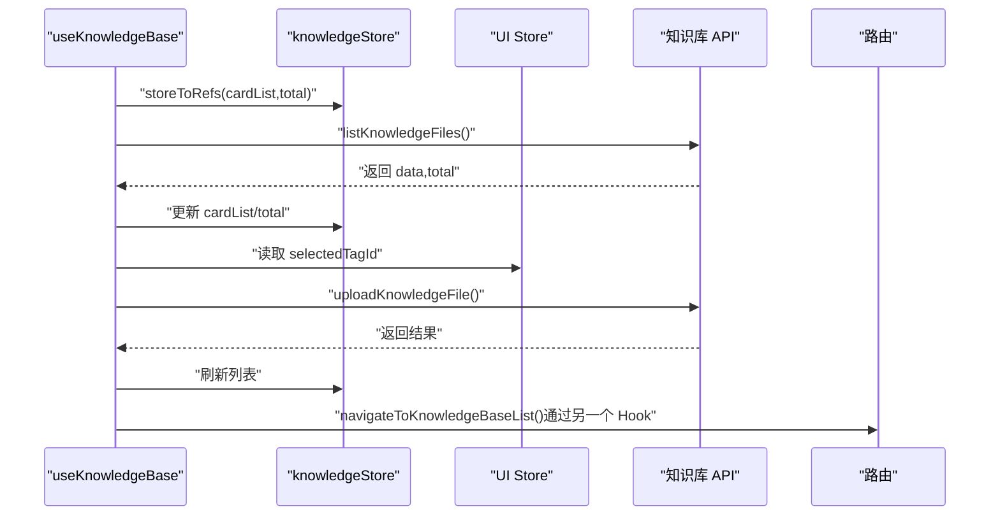
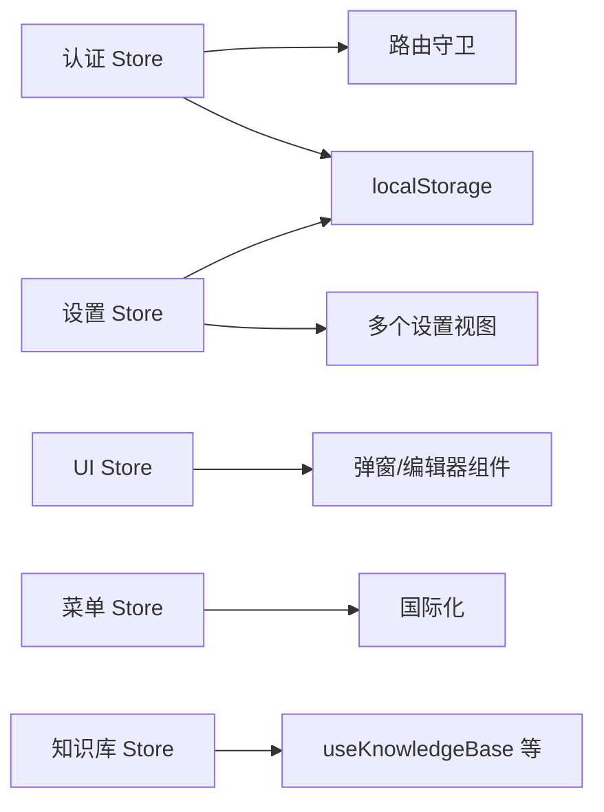

# 状态管理

<cite>
**本文引用的文件**
- [frontend/src/main.ts](file://frontend/src/main.ts)
- [frontend/src/stores/auth.ts](file://frontend/src/stores/auth.ts)
- [frontend/src/stores/settings.ts](file://frontend/src/stores/settings.ts)
- [frontend/src/stores/ui.ts](file://frontend/src/stores/ui.ts)
- [frontend/src/stores/menu.ts](file://frontend/src/stores/menu.ts)
- [frontend/src/stores/knowledge.ts](file://frontend/src/stores/knowledge.ts)
- [frontend/src/api/auth/index.ts](file://frontend/src/api/auth/index.ts)
- [frontend/src/hooks/useKnowledgeBase.ts](file://frontend/src/hooks/useKnowledgeBase.ts)
- [frontend/src/hooks/useKnowledgeBaseCreationNavigation.ts](file://frontend/src/hooks/useKnowledgeBaseCreationNavigation.ts)
- [frontend/src/router/index.ts](file://frontend/src/router/index.ts)
- [frontend/package.json](file://frontend/package.json)
</cite>

## 目录
1. [简介](#简介)
2. [项目结构](#项目结构)
3. [核心组件](#核心组件)
4. [架构总览](#架构总览)
5. [详细组件分析](#详细组件分析)
6. [依赖关系分析](#依赖关系分析)
7. [性能考量](#性能考量)
8. [故障排查指南](#故障排查指南)
9. [结论](#结论)
10. [附录](#附录)

## 简介
本文件系统性梳理 WiseDx 前端基于 Pinia 的状态管理方案，覆盖 store 设计模式、状态定义、action 操作与 getter 计算属性；详解认证、知识库、会话/菜单、设置与 UI 等模块；说明状态持久化与同步策略、异步状态处理方式，并给出最佳实践、性能优化建议与自定义 hooks 封装思路。

## 项目结构
- 状态管理入口与依赖
  - 在应用入口中安装 Pinia 并挂载到 Vue 实例，确保全局可用。
  - 各业务 store 通过 defineStore 定义，按功能域拆分，避免耦合。
- 主要 store 模块
  - 认证状态：用户、租户、令牌、知识库、选中租户等。
  - 设置状态：模型配置、Agent 配置、网络搜索开关、选中知识库/文件、智能体选择等。
  - UI 状态：模态框、编辑器可见性、当前 KB/知识条目、分类标签等。
  - 菜单/会话状态：导航菜单、会话列表、首次查询等。
  - 知识库卡片状态：知识卡片列表与总数。
- 路由与鉴权联动
  - 路由守卫结合认证 store 控制访问权限与初始化流程。
- API 层
  - 认证相关接口定义与实现，供 store/action 调用。

**图表来源**
- [frontend/src/main.ts](file://frontend/src/main.ts#L1-L20)
- [frontend/src/stores/auth.ts](file://frontend/src/stores/auth.ts#L1-L233)
- [frontend/src/stores/settings.ts](file://frontend/src/stores/settings.ts#L1-L342)
- [frontend/src/stores/ui.ts](file://frontend/src/stores/ui.ts#L1-L115)
- [frontend/src/stores/menu.ts](file://frontend/src/stores/menu.ts#L1-L116)
- [frontend/src/stores/knowledge.ts](file://frontend/src/stores/knowledge.ts#L1-L12)
- [frontend/src/api/auth/index.ts](file://frontend/src/api/auth/index.ts#L1-L242)
- [frontend/src/router/index.ts](file://frontend/src/router/index.ts#L1-L127)
- [frontend/src/hooks/useKnowledgeBase.ts](file://frontend/src/hooks/useKnowledgeBase.ts#L1-L199)
- [frontend/src/hooks/useKnowledgeBaseCreationNavigation.ts](file://frontend/src/hooks/useKnowledgeBaseCreationNavigation.ts#L1-L23)

**章节来源**
- [frontend/src/main.ts](file://frontend/src/main.ts#L1-L20)
- [frontend/package.json](file://frontend/package.json#L1-L58)

## 核心组件
- Pinia 安装与版本
  - 依赖中包含 pinia，应用入口通过 createPinia() 安装。
- Store 设计模式
  - 使用组合式 API 风格 defineStore，支持 ref/computed/reactive/state/actions/getters。
  - 认证与设置 store 提供完整的持久化与恢复逻辑。
- 数据流
  - 视图层通过 storeToRefs 或直接使用 store 实例响应式读取状态。
  - action 中进行 API 调用与状态更新，必要时写入 localStorage。

**章节来源**
- [frontend/package.json](file://frontend/package.json#L14-L34)
- [frontend/src/main.ts](file://frontend/src/main.ts#L14-L15)
- [frontend/src/stores/auth.ts](file://frontend/src/stores/auth.ts#L7-L233)
- [frontend/src/stores/settings.ts](file://frontend/src/stores/settings.ts#L94-L342)

## 架构总览
下图展示状态管理在登录与路由守卫中的交互流程，体现 store 的读取、持久化与鉴权控制。

**图表来源**
- [frontend/src/views/auth/Login.vue](file://frontend/src/views/auth/Login.vue#L435-L469)
- [frontend/src/api/auth/index.ts](file://frontend/src/api/auth/index.ts#L118-L128)
- [frontend/src/stores/auth.ts](file://frontend/src/stores/auth.ts#L46-L66)
- [frontend/src/router/index.ts](file://frontend/src/router/index.ts#L84-L124)

## 详细组件分析

### 认证状态模块（auth.ts）
- 状态定义
  - 用户信息、租户信息、访问令牌、刷新令牌、知识库列表、当前知识库、选中租户、全部租户等。
- 计算属性
  - 登录态判断、有效租户判断、当前租户/用户 ID、可访问全部租户、生效租户 ID。
- Action 操作
  - 设置用户/租户/令牌、设置知识库列表/当前知识库、设置选中租户、设置全部租户、获取选中租户、登出、从本地存储初始化。
- 持久化与恢复
  - 所有 setter 同步写入 localStorage；应用启动时 initFromStorage 从 localStorage 恢复。
- 错误处理
  - 解析本地存储数据时捕获异常并输出国际化错误信息。

**图表来源**
- [frontend/src/stores/auth.ts](file://frontend/src/stores/auth.ts#L130-L195)

**章节来源**
- [frontend/src/stores/auth.ts](file://frontend/src/stores/auth.ts#L7-L233)
- [frontend/src/api/auth/index.ts](file://frontend/src/api/auth/index.ts#L118-L221)

### 设置状态模块（settings.ts）
- 状态结构
  - 包含 endpoint、apiKey、knowledgeBaseId、Agent 开关与配置、模型配置（聊天/嵌入/重排/VLLM）、Ollama 配置、网络搜索开关、会话模型、选中智能体 ID 等。
- Getter
  - Agent 是否启用、Agent 是否就绪（工具/摘要/重排模型齐全）、普通模式是否就绪、Agent 配置、会话模型、模型配置、网络搜索开关、选中智能体 ID。
- Action
  - 保存/获取设置、更新 Endpoint/APIKey/知识库 ID、切换 Agent、更新 Agent 配置、更新会话模型、更新模型配置（增删改/设默认）、更新 Ollama 配置、知识库/文件选择（增删清空/获取）、切换智能体并重置 KB/文件选择、获取选中智能体 ID。
- 持久化
  - 所有更新均写入 localStorage，应用启动时从 localStorage 加载默认设置。

**图表来源**
- [frontend/src/stores/settings.ts](file://frontend/src/stores/settings.ts#L94-L342)

**章节来源**
- [frontend/src/stores/settings.ts](file://frontend/src/stores/settings.ts#L1-L342)

### UI 状态模块（ui.ts）
- 状态
  - 设置面板显示/隐藏、知识库编辑器显示/模式/类型/初始节、当前 KB ID、选中分类 ID、手动编辑器可见性与回调、成功回调等。
- Action
  - 打开/关闭设置面板、打开知识库编辑器（创建/编辑）、打开手动编辑器（创建/编辑）、关闭编辑器、通知编辑器成功并执行回调、设置选中分类 ID。

**图表来源**
- [frontend/src/stores/ui.ts](file://frontend/src/stores/ui.ts#L25-L112)

**章节来源**
- [frontend/src/stores/ui.ts](file://frontend/src/stores/ui.ts#L1-L115)

### 菜单/会话状态模块（menu.ts）
- 状态
  - 导航菜单数组、首次会话标记、首次查询、提及项、首次模型 ID。
- 功能
  - 应用国际化时动态翻译菜单标题；监听语言变化；维护“会话”子菜单的增删改与标题更新；提供清空会话列表的方法。

**图表来源**
- [frontend/src/stores/menu.ts](file://frontend/src/stores/menu.ts#L39-L114)

**章节来源**
- [frontend/src/stores/menu.ts](file://frontend/src/stores/menu.ts#L1-L116)

### 知识库卡片状态模块（knowledge.ts）
- 状态
  - 卡片列表、总数。
- 行为
  - 作为知识库卡片展示的轻量状态容器，配合自定义 hook 使用。

**章节来源**
- [frontend/src/stores/knowledge.ts](file://frontend/src/stores/knowledge.ts#L1-L12)

### 自定义 Hooks 分析
- useKnowledgeBase
  - 职责：封装知识库文件列表加载、详情获取、删除、上传、分页加载、UI 状态联动（如分类标签）。
  - 依赖：knowledgeStore（卡片列表/总数）、UI Store（选中分类）、路由参数（kbId）。
  - 交互：调用知识库 API，成功后刷新列表与详情，失败弹出消息。
- useKnowledgeBaseCreationNavigation
  - 职责：创建成功后导航到知识库列表并高亮新 KB。

**图表来源**
- [frontend/src/hooks/useKnowledgeBase.ts](file://frontend/src/hooks/useKnowledgeBase.ts#L16-L199)
- [frontend/src/hooks/useKnowledgeBaseCreationNavigation.ts](file://frontend/src/hooks/useKnowledgeBaseCreationNavigation.ts#L7-L21)
- [frontend/src/stores/knowledge.ts](file://frontend/src/stores/knowledge.ts#L5-L11)
- [frontend/src/stores/ui.ts](file://frontend/src/stores/ui.ts#L108-L112)

**章节来源**
- [frontend/src/hooks/useKnowledgeBase.ts](file://frontend/src/hooks/useKnowledgeBase.ts#L1-L199)
- [frontend/src/hooks/useKnowledgeBaseCreationNavigation.ts](file://frontend/src/hooks/useKnowledgeBaseCreationNavigation.ts#L1-L23)

## 依赖关系分析
- 组件耦合
  - 认证 store 与路由守卫耦合，用于鉴权控制。
  - 设置 store 与多个视图（Agent 设置、模型设置、系统信息等）耦合，负责统一配置与持久化。
  - UI store 与多处弹窗/编辑器组件耦合，统一控制可见性与初始状态。
  - 菜单 store 与国际化、路由联动，维护会话列表。
  - 知识库 store 与自定义 hook 耦合，承载卡片列表状态。
- 外部依赖
  - Pinia 版本与 Vue 生态兼容。
  - localStorage 作为轻量持久化介质，注意跨标签页一致性与容量限制。

**图表来源**
- [frontend/src/router/index.ts](file://frontend/src/router/index.ts#L84-L124)
- [frontend/src/stores/auth.ts](file://frontend/src/stores/auth.ts#L130-L195)
- [frontend/src/stores/settings.ts](file://frontend/src/stores/settings.ts#L143-L147)
- [frontend/src/stores/ui.ts](file://frontend/src/stores/ui.ts#L25-L112)
- [frontend/src/stores/menu.ts](file://frontend/src/stores/menu.ts#L39-L114)
- [frontend/src/stores/knowledge.ts](file://frontend/src/stores/knowledge.ts#L5-L11)

**章节来源**
- [frontend/src/router/index.ts](file://frontend/src/router/index.ts#L1-L127)
- [frontend/src/stores/auth.ts](file://frontend/src/stores/auth.ts#L1-L233)
- [frontend/src/stores/settings.ts](file://frontend/src/stores/settings.ts#L1-L342)
- [frontend/src/stores/ui.ts](file://frontend/src/stores/ui.ts#L1-L115)
- [frontend/src/stores/menu.ts](file://frontend/src/stores/menu.ts#L1-L116)
- [frontend/src/stores/knowledge.ts](file://frontend/src/stores/knowledge.ts#L1-L12)

## 性能考量
- 状态粒度
  - 将 UI 状态（弹窗、编辑器）与业务状态（认证、设置、知识库）分离，降低无关渲染。
- 持久化策略
  - 对大对象（如知识库列表）写入 localStorage 前应考虑序列化成本与体积，必要时分批或延迟写入。
- 计算属性与响应式
  - 使用 computed 缓存派生状态，避免重复计算；在复杂 getter 中尽量减少深层对象遍历。
- 异步处理
  - 在 action 中集中处理 API 调用与状态更新，避免在组件中分散更新导致的多次渲染。
- 路由守卫
  - 鉴权校验建议仅在必要时进行，避免频繁调用远端校验接口。

## 故障排查指南
- 登录后仍被重定向到登录页
  - 检查认证 store 是否正确设置 token 与用户信息；确认路由守卫逻辑与 meta.requiresAuth。
- 本地存储损坏导致状态异常
  - 认证 store 提供 initFromStorage，若解析失败会记录错误并回退为空；可在开发工具中清理对应 localStorage 键。
- 设置未持久化或丢失
  - 设置 store 的所有更新都会写入 localStorage；若出现异常，检查键名与 JSON 结构。
- 知识库列表不刷新
  - useKnowledgeBase 在上传/删除后会主动刷新列表；检查 API 返回与错误提示，确认回调是否执行。
- 国际化导致菜单标题不更新
  - 菜单 store 监听 i18n.locale 变化并重新翻译；确认国际化资源加载与监听生效。

**章节来源**
- [frontend/src/router/index.ts](file://frontend/src/router/index.ts#L84-L124)
- [frontend/src/stores/auth.ts](file://frontend/src/stores/auth.ts#L130-L195)
- [frontend/src/stores/settings.ts](file://frontend/src/stores/settings.ts#L143-L147)
- [frontend/src/hooks/useKnowledgeBase.ts](file://frontend/src/hooks/useKnowledgeBase.ts#L126-L140)
- [frontend/src/stores/menu.ts](file://frontend/src/stores/menu.ts#L39-L54)

## 结论
WiseDx 前端采用 Pinia 进行状态管理，遵循模块化与职责分离的设计原则。认证与设置 store 提供完善的持久化与恢复能力，UI 与菜单 store 保障界面交互体验，知识库 store 与自定义 hook 协作完成卡片列表与文件操作。整体架构清晰、扩展性强，建议在后续迭代中进一步完善大型对象的持久化策略与错误边界处理。

## 附录
- 最佳实践清单
  - 将 UI 状态与业务状态解耦，避免 UI 状态污染业务 store。
  - 对外暴露的 getter 仅做轻量计算，复杂逻辑下沉到 action。
  - 所有写操作均需持久化，保证刷新后状态一致。
  - 在组件中优先使用 storeToRefs 读取响应式状态，减少不必要的解构。
  - 对大体量数据的本地存储进行分页或懒加载策略。
  - 在 action 中集中处理错误与提示，保持 UI 与数据的一致性。