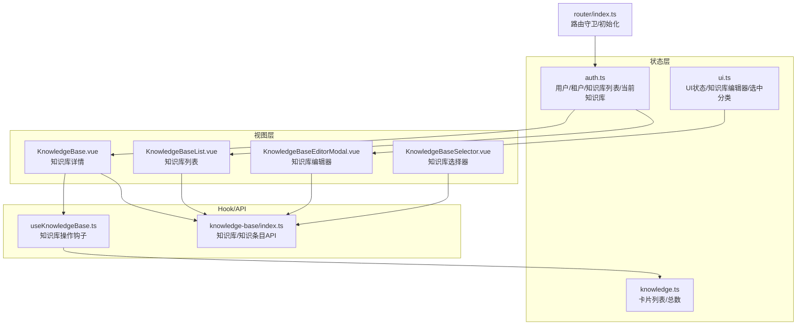
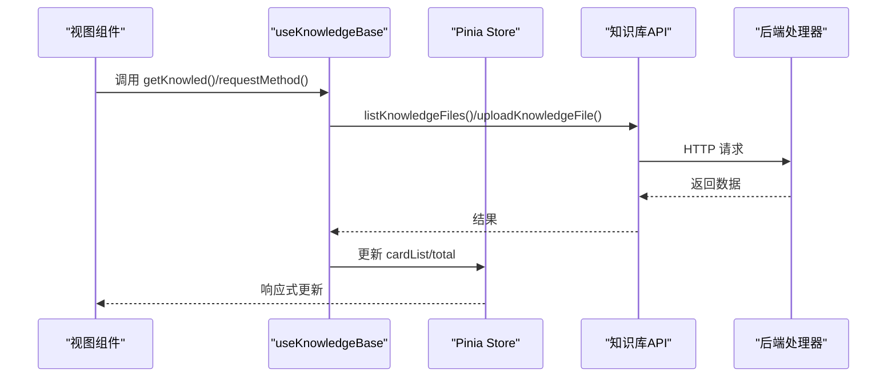
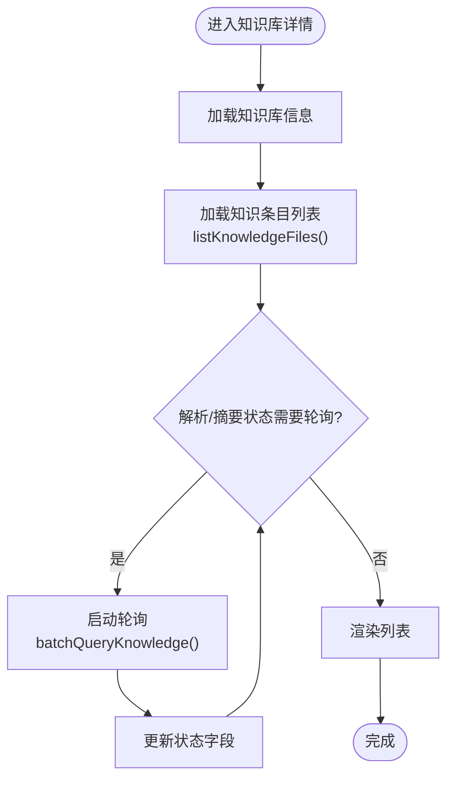
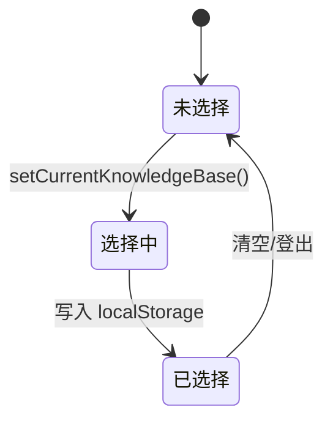
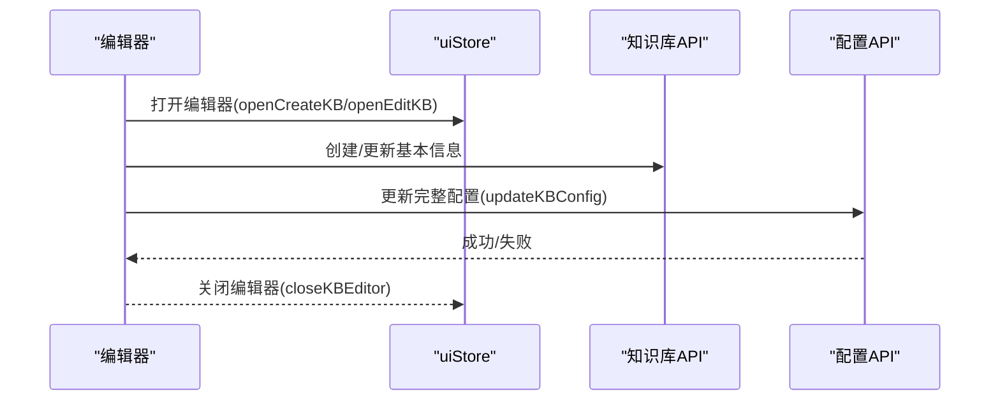
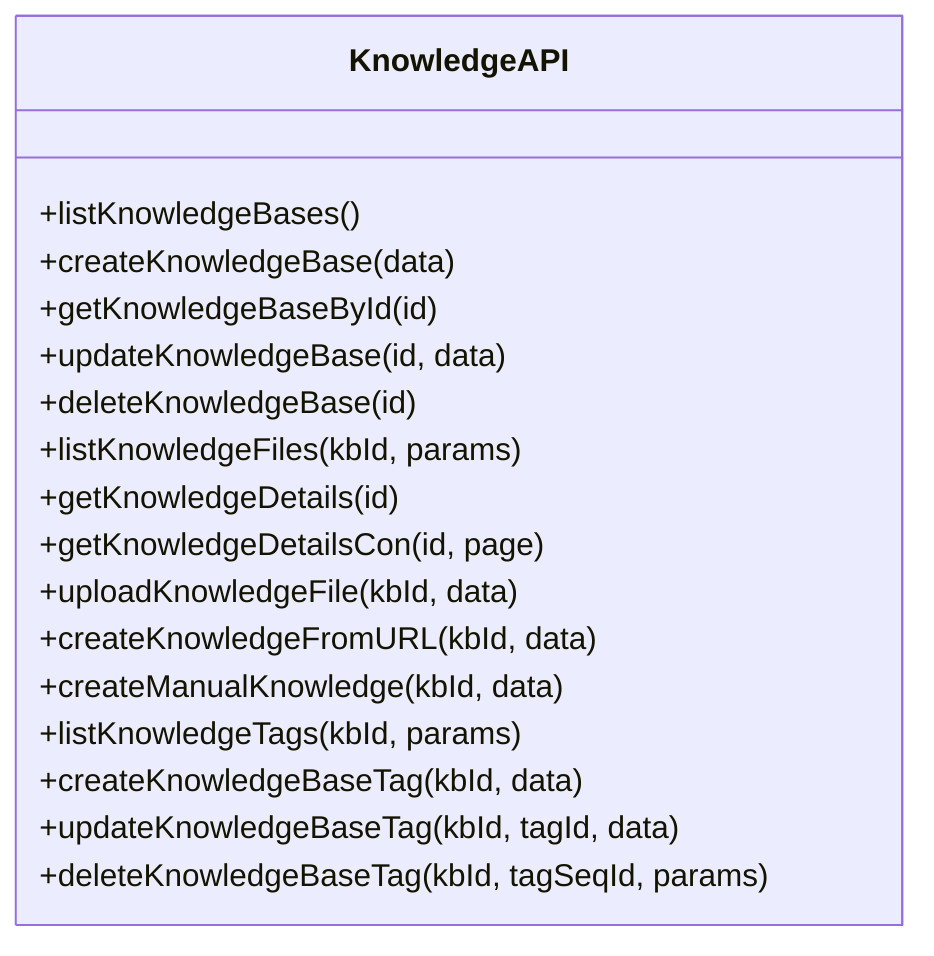
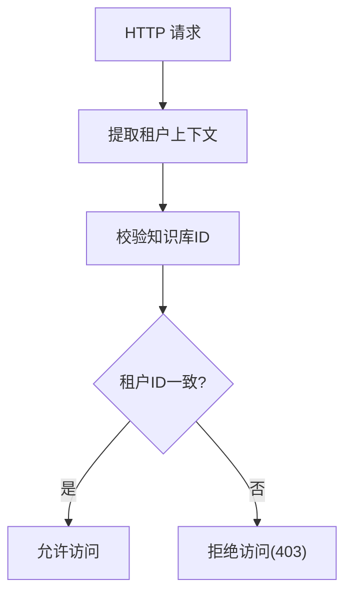
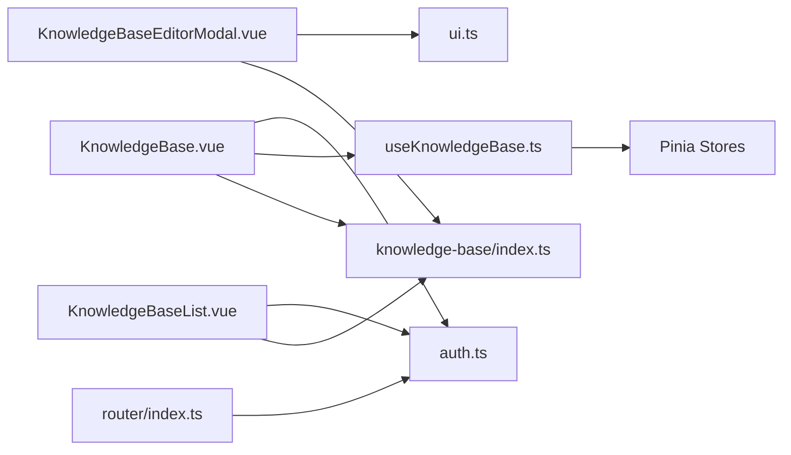

# 知识库状态管理

<cite>
**本文档引用的文件**
- [frontend/src/stores/knowledge.ts](file://frontend/src/stores/knowledge.ts)
- [frontend/src/stores/auth.ts](file://frontend/src/stores/auth.ts)
- [frontend/src/stores/ui.ts](file://frontend/src/stores/ui.ts)
- [frontend/src/hooks/useKnowledgeBase.ts](file://frontend/src/hooks/useKnowledgeBase.ts)
- [frontend/src/api/knowledge-base/index.ts](file://frontend/src/api/knowledge-base/index.ts)
- [frontend/src/views/knowledge/KnowledgeBase.vue](file://frontend/src/views/knowledge/KnowledgeBase.vue)
- [frontend/src/views/knowledge/KnowledgeBaseList.vue](file://frontend/src/views/knowledge/KnowledgeBaseList.vue)
- [frontend/src/views/knowledge/KnowledgeBaseEditorModal.vue](file://frontend/src/views/knowledge/KnowledgeBaseEditorModal.vue)
- [frontend/src/components/KnowledgeBaseSelector.vue](file://frontend/src/components/KnowledgeBaseSelector.vue)
- [frontend/src/router/index.ts](file://frontend/src/router/index.ts)
- [internal/handler/knowledgebase.go](file://internal/handler/knowledgebase.go)
- [internal/handler/knowledge.go](file://internal/handler/knowledge.go)
</cite>

## 目录
1. [简介](#简介)
2. [项目结构](#项目结构)
3. [核心组件](#核心组件)
4. [架构总览](#架构总览)
5. [详细组件分析](#详细组件分析)
6. [依赖关系分析](#依赖关系分析)
7. [性能考虑](#性能考虑)
8. [故障排除指南](#故障排除指南)
9. [结论](#结论)

## 简介
本文件系统性梳理 WiseDx 前端知识库状态管理的设计与实现，覆盖以下方面：
- 知识库列表管理：如何加载、展示、筛选与分页
- 当前选中知识库状态：如何在应用内持久化与跨组件共享
- 知识库配置状态：如何在编辑器中维护与更新配置
- 数据结构与 API 交互：请求/响应结构、缓存策略与实时更新机制
- 最佳实践：状态同步、性能优化与错误处理

## 项目结构
前端知识库状态管理主要分布在以下模块：
- Pinia Store：知识库状态（auth、ui、knowledge）
- API 层：知识库与知识条目相关接口封装
- 视图层：知识库列表、详情、编辑器等页面
- Hook：通用知识库操作逻辑封装
- 路由：初始化流程与权限校验

**图表来源**
- [frontend/src/stores/auth.ts](file://frontend/src/stores/auth.ts#L1-L233)
- [frontend/src/stores/ui.ts](file://frontend/src/stores/ui.ts#L1-L67)
- [frontend/src/stores/knowledge.ts](file://frontend/src/stores/knowledge.ts#L1-L12)
- [frontend/src/hooks/useKnowledgeBase.ts](file://frontend/src/hooks/useKnowledgeBase.ts#L1-L199)
- [frontend/src/api/knowledge-base/index.ts](file://frontend/src/api/knowledge-base/index.ts#L1-L275)
- [frontend/src/views/knowledge/KnowledgeBaseList.vue](file://frontend/src/views/knowledge/KnowledgeBaseList.vue#L180-L205)
- [frontend/src/views/knowledge/KnowledgeBase.vue](file://frontend/src/views/knowledge/KnowledgeBase.vue#L1-L800)
- [frontend/src/views/knowledge/KnowledgeBaseEditorModal.vue](file://frontend/src/views/knowledge/KnowledgeBaseEditorModal.vue#L1-L800)
- [frontend/src/components/KnowledgeBaseSelector.vue](file://frontend/src/components/KnowledgeBaseSelector.vue#L141-L171)
- [frontend/src/router/index.ts](file://frontend/src/router/index.ts#L1-L50)

**章节来源**
- [frontend/src/stores/knowledge.ts](file://frontend/src/stores/knowledge.ts#L1-L12)
- [frontend/src/stores/auth.ts](file://frontend/src/stores/auth.ts#L1-L233)
- [frontend/src/stores/ui.ts](file://frontend/src/stores/ui.ts#L1-L67)
- [frontend/src/hooks/useKnowledgeBase.ts](file://frontend/src/hooks/useKnowledgeBase.ts#L1-L199)
- [frontend/src/api/knowledge-base/index.ts](file://frontend/src/api/knowledge-base/index.ts#L1-L275)
- [frontend/src/views/knowledge/KnowledgeBase.vue](file://frontend/src/views/knowledge/KnowledgeBase.vue#L1-L800)
- [frontend/src/views/knowledge/KnowledgeBaseList.vue](file://frontend/src/views/knowledge/KnowledgeBaseList.vue#L180-L205)
- [frontend/src/views/knowledge/KnowledgeBaseEditorModal.vue](file://frontend/src/views/knowledge/KnowledgeBaseEditorModal.vue#L1-L800)
- [frontend/src/components/KnowledgeBaseSelector.vue](file://frontend/src/components/KnowledgeBaseSelector.vue#L141-L171)
- [frontend/src/router/index.ts](file://frontend/src/router/index.ts#L1-L50)

## 核心组件
- 知识库状态（Pinia Store）
  - knowledgeStore：卡片列表与总数
  - authStore：用户、租户、知识库列表、当前知识库
  - uiStore：编辑器可见性、当前知识库ID、选中分类ID等
- Hook：useKnowledgeBase 封装知识库卡片列表、详情、上传、删除等常用操作
- API：知识库与知识条目相关接口（列表、创建、更新、删除、标签、FAQ 等）

关键职责与边界：
- 状态持久化：authStore 与 uiStore 在初始化时从 localStorage 恢复状态，写入时同步持久化
- 数据流：视图通过 API 发起请求，Hook 统一处理响应与状态更新，Pinia Store 作为单一事实源
- 权限校验：后端在路由与处理器层面进行租户与知识库访问权限校验

**章节来源**
- [frontend/src/stores/knowledge.ts](file://frontend/src/stores/knowledge.ts#L1-L12)
- [frontend/src/stores/auth.ts](file://frontend/src/stores/auth.ts#L1-L233)
- [frontend/src/stores/ui.ts](file://frontend/src/stores/ui.ts#L1-L67)
- [frontend/src/hooks/useKnowledgeBase.ts](file://frontend/src/hooks/useKnowledgeBase.ts#L1-L199)
- [frontend/src/api/knowledge-base/index.ts](file://frontend/src/api/knowledge-base/index.ts#L1-L275)

## 架构总览
前端采用“视图-钩子-状态-API-后端”的分层架构：
- 视图层负责交互与渲染
- 钩子层封装业务逻辑与状态更新
- Pinia Store 管理全局可序列化状态
- API 层封装 HTTP 请求与参数构建
- 后端提供权限校验与数据服务

**图表来源**
- [frontend/src/hooks/useKnowledgeBase.ts](file://frontend/src/hooks/useKnowledgeBase.ts#L31-L141)
- [frontend/src/api/knowledge-base/index.ts](file://frontend/src/api/knowledge-base/index.ts#L64-L98)
- [frontend/src/stores/knowledge.ts](file://frontend/src/stores/knowledge.ts#L5-L11)

**章节来源**
- [frontend/src/views/knowledge/KnowledgeBase.vue](file://frontend/src/views/knowledge/KnowledgeBase.vue#L146-L158)
- [frontend/src/hooks/useKnowledgeBase.ts](file://frontend/src/hooks/useKnowledgeBase.ts#L31-L141)
- [frontend/src/api/knowledge-base/index.ts](file://frontend/src/api/knowledge-base/index.ts#L64-L98)
- [frontend/src/stores/knowledge.ts](file://frontend/src/stores/knowledge.ts#L5-L11)

## 详细组件分析

### 知识库列表管理
- 列表加载：通过 API 的 listKnowledgeBases 与 listKnowledgeFiles 获取知识库列表与条目
- 分页与筛选：支持按标签、关键词、文件类型筛选，分页参数由视图传入
- 实时状态轮询：对解析/摘要状态进行轮询更新，提升用户体验
- 事件驱动刷新：上传完成后通过自定义事件触发刷新

**图表来源**
- [frontend/src/views/knowledge/KnowledgeBase.vue](file://frontend/src/views/knowledge/KnowledgeBase.vue#L371-L407)
- [frontend/src/views/knowledge/KnowledgeBase.vue](file://frontend/src/views/knowledge/KnowledgeBase.vue#L590-L612)
- [frontend/src/api/knowledge-base/index.ts](file://frontend/src/api/knowledge-base/index.ts#L64-L82)

**章节来源**
- [frontend/src/views/knowledge/KnowledgeBase.vue](file://frontend/src/views/knowledge/KnowledgeBase.vue#L146-L158)
- [frontend/src/views/knowledge/KnowledgeBase.vue](file://frontend/src/views/knowledge/KnowledgeBase.vue#L371-L407)
- [frontend/src/views/knowledge/KnowledgeBase.vue](file://frontend/src/views/knowledge/KnowledgeBase.vue#L590-L612)
- [frontend/src/api/knowledge-base/index.ts](file://frontend/src/api/knowledge-base/index.ts#L64-L82)

### 当前选中知识库状态
- 状态来源：authStore.currentKnowledgeBase 与 uiStore.currentKBId
- 生命周期：登录后从 localStorage 恢复，切换知识库时更新
- 使用场景：编辑器、上传、详情页等根据当前 KB ID 进行操作

**图表来源**
- [frontend/src/stores/auth.ts](file://frontend/src/stores/auth.ts#L74-L81)
- [frontend/src/stores/ui.ts](file://frontend/src/stores/ui.ts#L8-L8)

**章节来源**
- [frontend/src/stores/auth.ts](file://frontend/src/stores/auth.ts#L74-L81)
- [frontend/src/stores/ui.ts](file://frontend/src/stores/ui.ts#L8-L8)

### 知识库配置状态
- 编辑器状态：uiStore 控制编辑器可见性、模式（创建/编辑）、初始类型
- 表单数据：KnowledgeBaseEditorModal 维护基础信息、模型配置、分块、图谱、高级设置等
- 提交流程：创建一次性提交，编辑分别更新基本信息与完整配置

**图表来源**
- [frontend/src/stores/ui.ts](file://frontend/src/stores/ui.ts#L54-L67)
- [frontend/src/views/knowledge/KnowledgeBaseEditorModal.vue](file://frontend/src/views/knowledge/KnowledgeBaseEditorModal.vue#L552-L644)
- [frontend/src/api/knowledge-base/index.ts](file://frontend/src/api/knowledge-base/index.ts#L30-L36)

**章节来源**
- [frontend/src/stores/ui.ts](file://frontend/src/stores/ui.ts#L54-L67)
- [frontend/src/views/knowledge/KnowledgeBaseEditorModal.vue](file://frontend/src/views/knowledge/KnowledgeBaseEditorModal.vue#L552-L644)
- [frontend/src/api/knowledge-base/index.ts](file://frontend/src/api/knowledge-base/index.ts#L30-L36)

### 知识库相关的数据结构与 API
- 知识库列表：listKnowledgeBases → 返回数组
- 知识条目列表：listKnowledgeFiles → 返回 data 与 total
- 知识详情：getKnowledgeDetails、getKnowledgeDetailsCon → 分页获取分块
- 标签管理：list/create/update/delete 知识库标签
- FAQ 管理：批量导入、搜索、导出、字段批量更新
- 上传与 URL 导入：uploadKnowledgeFile、createKnowledgeFromURL、createManualKnowledge

**图表来源**
- [frontend/src/api/knowledge-base/index.ts](file://frontend/src/api/knowledge-base/index.ts#L1-L275)

**章节来源**
- [frontend/src/api/knowledge-base/index.ts](file://frontend/src/api/knowledge-base/index.ts#L1-L275)

### Getter 计算属性与权限检查
- 计算属性：authStore 中包含 isLoggedIn、hasValidTenant、effectiveTenantId 等
- 权限检查：后端处理器在路由与知识库操作中校验租户与知识库访问权限

**图表来源**
- [internal/handler/knowledgebase.go](file://internal/handler/knowledgebase.go#L144-L177)
- [internal/handler/knowledge.go](file://internal/handler/knowledge.go#L33-L65)

**章节来源**
- [frontend/src/stores/auth.ts](file://frontend/src/stores/auth.ts#L19-L43)
- [internal/handler/knowledgebase.go](file://internal/handler/knowledgebase.go#L144-L177)
- [internal/handler/knowledge.go](file://internal/handler/knowledge.go#L33-L65)

### 状态与 API 的交互方式
- 状态同步：Hook 通过 API 获取数据后更新 Pinia Store；编辑器通过 API 更新后端配置
- 缓存策略：当前实现未见显式缓存层，建议在高频读取场景引入轻量缓存或条件请求
- 实时更新：解析/摘要状态通过轮询更新，避免阻塞主流程

**章节来源**
- [frontend/src/hooks/useKnowledgeBase.ts](file://frontend/src/hooks/useKnowledgeBase.ts#L31-L141)
- [frontend/src/views/knowledge/KnowledgeBase.vue](file://frontend/src/views/knowledge/KnowledgeBase.vue#L590-L612)

## 依赖关系分析
- 视图依赖 Hook 与 API
- Hook 依赖 API 与 Pinia Store
- 编辑器依赖 uiStore 与 API
- 路由依赖鉴权与初始化流程

**图表来源**
- [frontend/src/views/knowledge/KnowledgeBaseList.vue](file://frontend/src/views/knowledge/KnowledgeBaseList.vue#L180-L205)
- [frontend/src/views/knowledge/KnowledgeBase.vue](file://frontend/src/views/knowledge/KnowledgeBase.vue#L1-L800)
- [frontend/src/views/knowledge/KnowledgeBaseEditorModal.vue](file://frontend/src/views/knowledge/KnowledgeBaseEditorModal.vue#L1-L800)
- [frontend/src/hooks/useKnowledgeBase.ts](file://frontend/src/hooks/useKnowledgeBase.ts#L1-L199)
- [frontend/src/stores/knowledge.ts](file://frontend/src/stores/knowledge.ts#L1-L12)
- [frontend/src/stores/auth.ts](file://frontend/src/stores/auth.ts#L1-L233)
- [frontend/src/stores/ui.ts](file://frontend/src/stores/ui.ts#L1-L67)
- [frontend/src/router/index.ts](file://frontend/src/router/index.ts#L1-L50)

**章节来源**
- [frontend/src/views/knowledge/KnowledgeBaseList.vue](file://frontend/src/views/knowledge/KnowledgeBaseList.vue#L180-L205)
- [frontend/src/views/knowledge/KnowledgeBase.vue](file://frontend/src/views/knowledge/KnowledgeBase.vue#L1-L800)
- [frontend/src/views/knowledge/KnowledgeBaseEditorModal.vue](file://frontend/src/views/knowledge/KnowledgeBaseEditorModal.vue#L1-L800)
- [frontend/src/hooks/useKnowledgeBase.ts](file://frontend/src/hooks/useKnowledgeBase.ts#L1-L199)
- [frontend/src/stores/knowledge.ts](file://frontend/src/stores/knowledge.ts#L1-L12)
- [frontend/src/stores/auth.ts](file://frontend/src/stores/auth.ts#L1-L233)
- [frontend/src/stores/ui.ts](file://frontend/src/stores/ui.ts#L1-L67)
- [frontend/src/router/index.ts](file://frontend/src/router/index.ts#L1-L50)

## 性能考虑
- 列表分页与懒加载：使用分页参数减少一次性传输量
- 轮询节流：对解析/摘要状态轮询间隔合理设置，避免频繁请求
- 本地存储：利用 localStorage 恢复状态，减少重复请求
- 并发优化：编辑器加载时并发获取知识库信息、模型列表与文件概要

[本节为通用指导，无需列出具体文件来源]

## 故障排除指南
- 知识库列表为空
  - 检查 listKnowledgeBases 是否返回数据
  - 确认路由初始化与鉴权流程
- 上传失败
  - 检查 uploadKnowledgeFile 返回码（如 duplicate_file）
  - 确认当前 KB ID 与选中分类
- 状态未更新
  - 确认轮询是否启动与停止
  - 检查事件监听与触发（knowledgeFileUploaded）
- 权限错误
  - 后端返回 403 时检查租户上下文与知识库归属

**章节来源**
- [frontend/src/views/knowledge/KnowledgeBase.vue](file://frontend/src/views/knowledge/KnowledgeBase.vue#L706-L760)
- [frontend/src/views/knowledge/KnowledgeBase.vue](file://frontend/src/views/knowledge/KnowledgeBase.vue#L590-L612)
- [internal/handler/knowledgebase.go](file://internal/handler/knowledgebase.go#L144-L177)

## 结论
WiseDx 的知识库状态管理以 Pinia 为核心，结合 Hook 与 API，实现了清晰的状态流与良好的可维护性。通过路由与后端处理器的权限校验，保障了租户与知识库访问的安全性。建议在后续迭代中引入缓存策略与更细粒度的错误处理，进一步提升性能与稳定性。