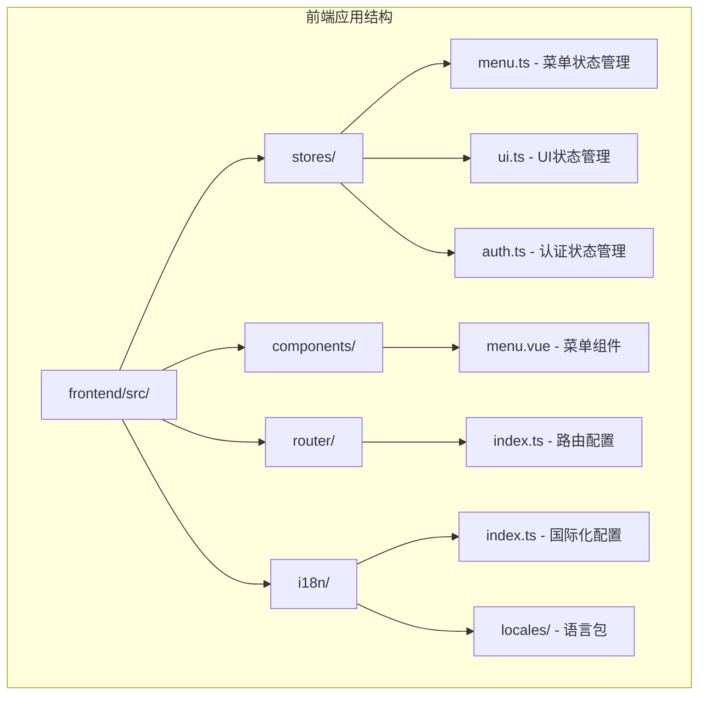
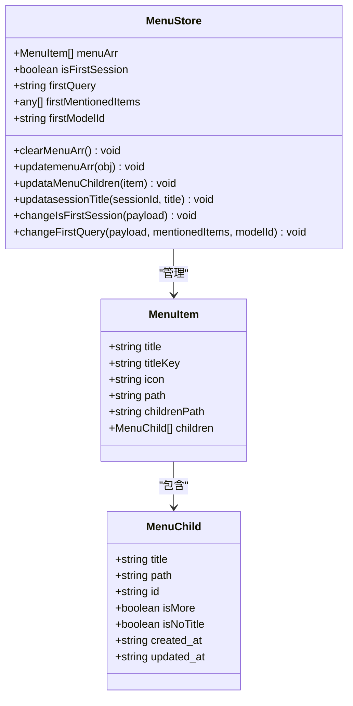
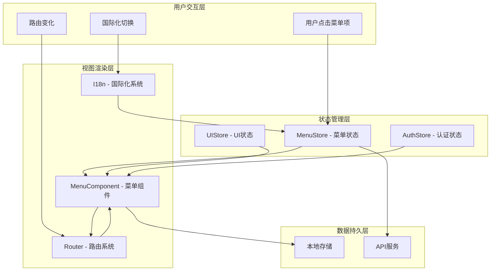
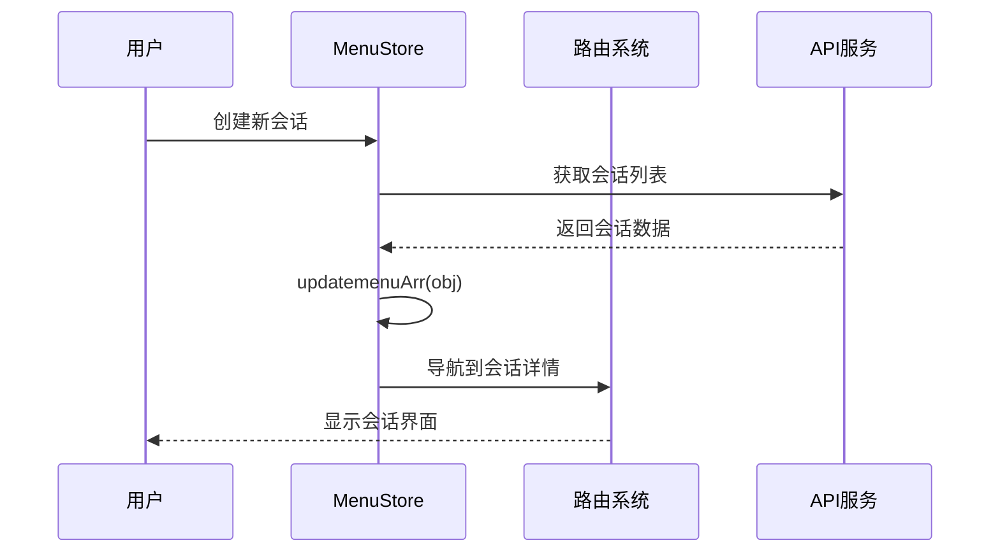
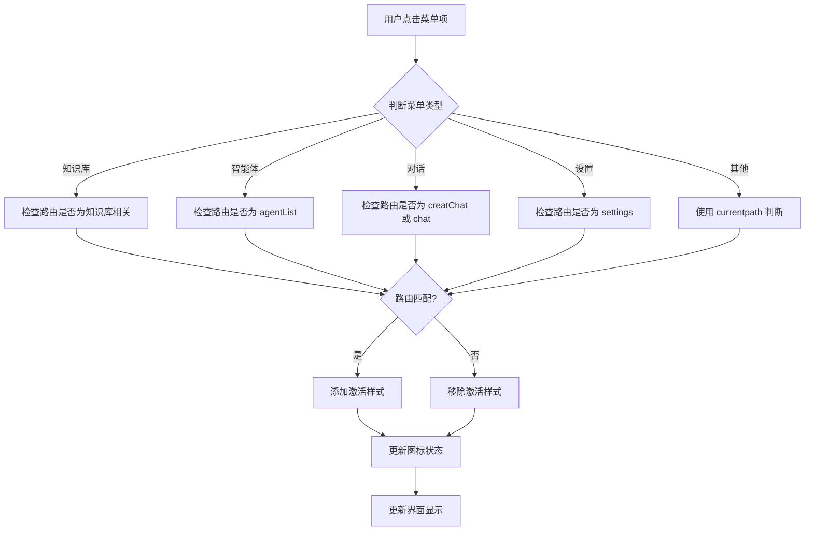
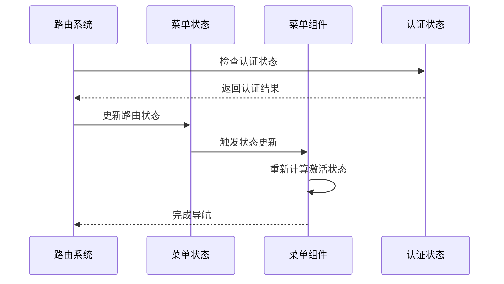
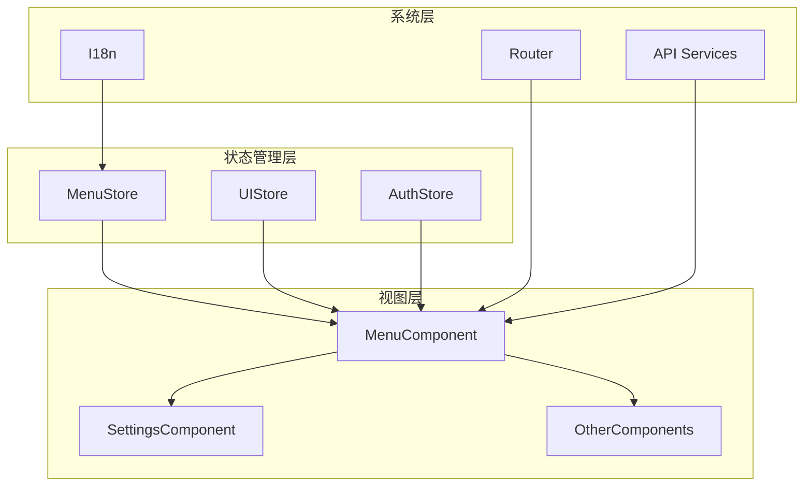

# 菜单状态管理

<cite>
**本文档引用的文件**
- [frontend/src/stores/menu.ts](file://frontend/src/stores/menu.ts)
- [frontend/src/components/menu.vue](file://frontend/src/components/menu.vue)
- [frontend/src/router/index.ts](file://frontend/src/router/index.ts)
- [frontend/src/stores/ui.ts](file://frontend/src/stores/ui.ts)
- [frontend/src/i18n/index.ts](file://frontend/src/i18n/index.ts)
- [frontend/src/i18n/locales/zh-CN.ts](file://frontend/src/i18n/locales/zh-CN.ts)
</cite>

## 目录
1. [简介](#简介)
2. [项目结构](#项目结构)
3. [核心组件](#核心组件)
4. [架构概览](#架构概览)
5. [详细组件分析](#详细组件分析)
6. [依赖关系分析](#依赖关系分析)
7. [性能考虑](#性能考虑)
8. [故障排除指南](#故障排除指南)
9. [结论](#结论)

## 简介

WiseDx 的菜单状态管理系统是一个基于 Pinia 和 Vue 3 Composition API 构建的现代化状态管理解决方案。该系统负责管理侧边栏菜单状态、面包屑导航状态以及页面布局状态，为用户提供流畅的导航体验。

系统采用模块化设计，将菜单状态管理拆分为独立的 store 模块，实现了状态与视图的清晰分离。通过 Pinia 的响应式机制，系统能够实时响应用户交互和路由变化，自动更新菜单状态和界面显示。

## 项目结构

菜单状态管理系统主要分布在以下文件中：



**图表来源**
- [frontend/src/stores/menu.ts](file://frontend/src/stores/menu.ts#L1-L116)
- [frontend/src/components/menu.vue](file://frontend/src/components/menu.vue#L1-L800)
- [frontend/src/router/index.ts](file://frontend/src/router/index.ts#L1-L127)

**章节来源**
- [frontend/src/stores/menu.ts](file://frontend/src/stores/menu.ts#L1-L116)
- [frontend/src/components/menu.vue](file://frontend/src/components/menu.vue#L1-L800)
- [frontend/src/router/index.ts](file://frontend/src/router/index.ts#L1-L127)

## 核心组件

### 菜单 Store 设计

菜单状态管理的核心是 `useMenuStore`，它提供了完整的菜单状态管理能力：



**图表来源**
- [frontend/src/stores/menu.ts](file://frontend/src/stores/menu.ts#L7-L14)
- [frontend/src/stores/menu.ts](file://frontend/src/stores/menu.ts#L18-L115)

### 数据结构定义

系统定义了清晰的数据结构来表示菜单项和子菜单项：

| 字段名 | 类型 | 描述 | 必填 |
|--------|------|------|------|
| title | string | 菜单项显示标题 | 否 |
| titleKey | string | 国际化键值 | 否 |
| icon | string | 图标标识符 | 是 |
| path | string | 路由路径 | 是 |
| childrenPath | string | 子菜单路径前缀 | 否 |
| children | MenuChild[] | 子菜单数组 | 否 |

**章节来源**
- [frontend/src/stores/menu.ts](file://frontend/src/stores/menu.ts#L7-L14)
- [frontend/src/stores/menu.ts](file://frontend/src/stores/menu.ts#L18-L32)

## 架构概览

菜单状态管理系统采用分层架构设计，实现了状态管理、视图渲染和路由控制的解耦：



**图表来源**
- [frontend/src/stores/menu.ts](file://frontend/src/stores/menu.ts#L1-L116)
- [frontend/src/components/menu.vue](file://frontend/src/components/menu.vue#L210-L242)
- [frontend/src/router/index.ts](file://frontend/src/router/index.ts#L84-L124)

## 详细组件分析

### 菜单状态管理器

#### Action 方法详解

菜单状态管理器提供了丰富的 action 方法来处理各种菜单操作：



**图表来源**
- [frontend/src/stores/menu.ts](file://frontend/src/stores/menu.ts#L63-L72)
- [frontend/src/components/menu.vue](file://frontend/src/components/menu.vue#L482-L515)

#### Getter 计算属性

系统通过计算属性实现智能的状态判断：

| 计算属性 | 功能描述 | 实现逻辑 |
|----------|----------|----------|
| topMenuItems | 顶部菜单项过滤 | 过滤 knowledge-bases、agents、creatChat |
| bottomMenuItems | 底部菜单项过滤 | 排除顶部菜单项 |
| groupedSessions | 会话分组 | 按时间维度分组显示 |
| isMenuItemActive | 菜单项激活判断 | 基于路由名称判断激活状态 |

**章节来源**
- [frontend/src/stores/menu.ts](file://frontend/src/stores/menu.ts#L102-L114)
- [frontend/src/components/menu.vue](file://frontend/src/components/menu.vue#L308-L321)
- [frontend/src/components/menu.vue](file://frontend/src/components/menu.vue#L272-L289)

### 菜单组件实现

#### 菜单项激活状态管理

菜单组件实现了复杂的激活状态判断逻辑：



**图表来源**
- [frontend/src/components/menu.vue](file://frontend/src/components/menu.vue#L272-L305)

#### 动态菜单生成机制

系统支持动态生成菜单项，特别是对话会话菜单：

| 功能特性 | 实现方式 | 性能考虑 |
|----------|----------|----------|
| 异步加载 | 使用 getSessionsList API | 支持分页加载 |
| 自动去重 | 检查是否存在相同 ID | 避免重复添加 |
| 时间分组 | 按今日、昨天、7天等分组 | 提升可读性 |
| 滚动加载 | 监听滚动触底事件 | 减少一次性加载数据量 |

**章节来源**
- [frontend/src/components/menu.vue](file://frontend/src/components/menu.vue#L482-L515)
- [frontend/src/components/menu.vue](file://frontend/src/components/menu.vue#L384-L416)

### 路由系统集成

#### 路由守卫与菜单同步

路由系统与菜单状态管理紧密集成：



**图表来源**
- [frontend/src/router/index.ts](file://frontend/src/router/index.ts#L84-L124)
- [frontend/src/components/menu.vue](file://frontend/src/components/menu.vue#L550-L596)

#### 权限控制集成

系统通过路由元信息实现权限控制：

| 元信息字段 | 类型 | 作用 | 默认值 |
|------------|------|------|--------|
| requiresAuth | boolean | 是否需要认证 | true |
| requiresInit | boolean | 是否需要初始化 | true |
| meta | object | 其他元信息 | {} |

**章节来源**
- [frontend/src/router/index.ts](file://frontend/src/router/index.ts#L8-L81)

### 国际化集成

#### 多语言支持机制

系统通过 i18n 系统实现菜单标题的国际化：

```mermaid
flowchart LR
A[菜单定义] --> B[titleKey 字段]
B --> C[i18n.global.t() 调用]
C --> D[翻译结果]
D --> E[菜单显示]
F[语言切换] --> G[watch 监听]
G --> H[重新应用翻译]
H --> I[界面更新]
```

**图表来源**
- [frontend/src/stores/menu.ts](file://frontend/src/stores/menu.ts#L39-L54)
- [frontend/src/i18n/index.ts](file://frontend/src/i18n/index.ts#L1-L24)

**章节来源**
- [frontend/src/stores/menu.ts](file://frontend/src/stores/menu.ts#L39-L54)
- [frontend/src/i18n/locales/zh-CN.ts](file://frontend/src/i18n/locales/zh-CN.ts#L2-L15)

## 依赖关系分析

### 组件间依赖关系



**图表来源**
- [frontend/src/stores/menu.ts](file://frontend/src/stores/menu.ts#L1-L116)
- [frontend/src/components/menu.vue](file://frontend/src/components/menu.vue#L210-L242)

### 外部依赖分析

系统依赖的关键外部库：

| 依赖库 | 版本 | 用途 | 重要性 |
|--------|------|------|--------|
| vue | ^3.4.0 | 响应式框架 | 核心 |
| pinia | ^2.1.0 | 状态管理 | 核心 |
| vue-router | ^4.2.0 | 路由系统 | 核心 |
| vue-i18n | ^9.5.0 | 国际化 | 重要 |
| tdesign-vue-next | ^1.9.0 | UI 组件库 | 重要 |

**章节来源**
- [frontend/src/components/menu.vue](file://frontend/src/components/menu.vue#L210-L225)

## 性能考虑

### 状态更新优化

系统采用了多种性能优化策略：

1. **响应式数据优化**
   - 使用 `reactive` 和 `ref` 的合理组合
   - 避免不必要的响应式转换
   - 使用 `storeToRefs` 减少解构开销

2. **计算属性缓存**
   - 利用 Vue 的计算属性缓存机制
   - 避免重复计算复杂逻辑
   - 合理使用 `computed` 和 `watch`

3. **异步加载优化**
   - 分页加载大量会话数据
   - 滚动触底加载机制
   - 防抖处理滚动事件

### 内存管理

系统注意内存使用的最佳实践：

- 及时清理事件监听器
- 合理使用 `onUnmounted` 生命周期
- 避免内存泄漏

## 故障排除指南

### 常见问题及解决方案

#### 菜单状态不同步问题

**问题描述**: 菜单项激活状态与实际路由不一致

**可能原因**:
1. 路由名称不匹配
2. 菜单项路径配置错误
3. 状态更新时机问题

**解决方案**:
1. 检查路由配置中的 `name` 字段
2. 验证菜单项的 `path` 字段
3. 确认 `isMenuItemActive` 函数的判断逻辑

#### 国际化显示问题

**问题描述**: 菜单标题显示为国际化键值而非实际文本

**可能原因**:
1. i18n 系统未正确初始化
2. 语言包缺失
3. watch 机制失效

**解决方案**:
1. 检查 i18n 初始化代码
2. 验证语言包文件完整性
3. 确认 watch 机制正常工作

#### 动态菜单加载问题

**问题描述**: 对话会话列表无法正确加载或显示

**可能原因**:
1. API 请求失败
2. 数据格式不匹配
3. 分页逻辑错误

**解决方案**:
1. 检查网络请求状态
2. 验证 API 响应格式
3. 调试分页加载逻辑

**章节来源**
- [frontend/src/components/menu.vue](file://frontend/src/components/menu.vue#L550-L596)
- [frontend/src/stores/menu.ts](file://frontend/src/stores/menu.ts#L39-L54)

## 结论

WiseDx 的菜单状态管理系统展现了现代前端应用的最佳实践。通过合理的架构设计、清晰的职责分离和完善的性能优化，系统为用户提供了流畅、直观的导航体验。

系统的主要优势包括：

1. **模块化设计**: 清晰的职责分离使得代码易于维护和扩展
2. **响应式更新**: 基于 Vue 3 的响应式系统提供了高效的 UI 更新
3. **国际化支持**: 完善的多语言支持提升了用户体验
4. **性能优化**: 多种优化策略确保了系统的高效运行
5. **错误处理**: 完善的错误处理机制提升了系统的稳定性

未来可以考虑的改进方向：
- 添加更多的键盘导航支持
- 实现菜单状态的持久化存储
- 增强菜单项的权限控制粒度
- 优化移动端的菜单显示效果