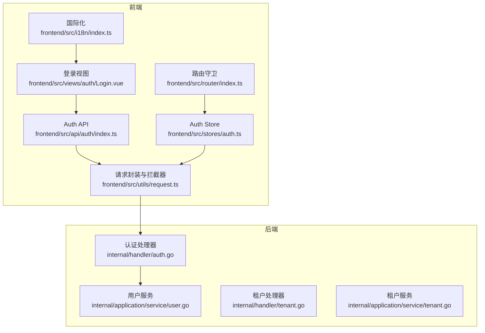
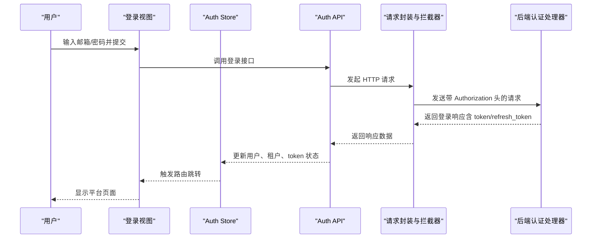
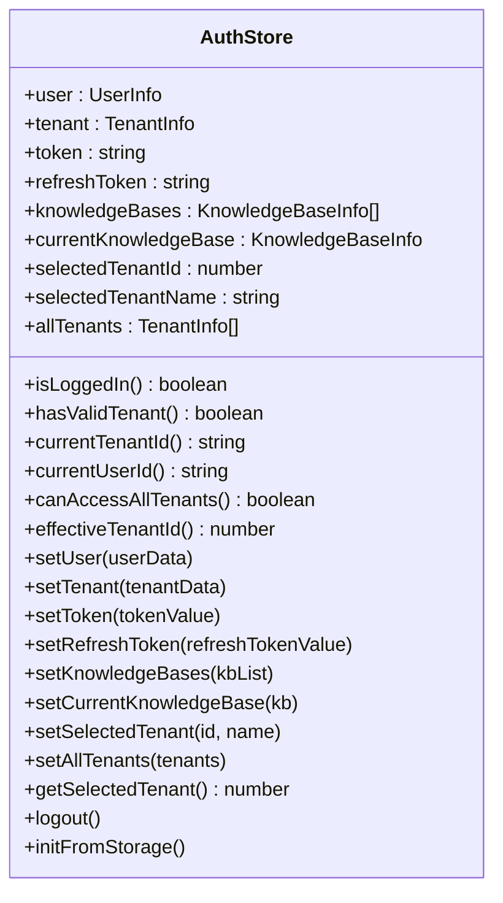
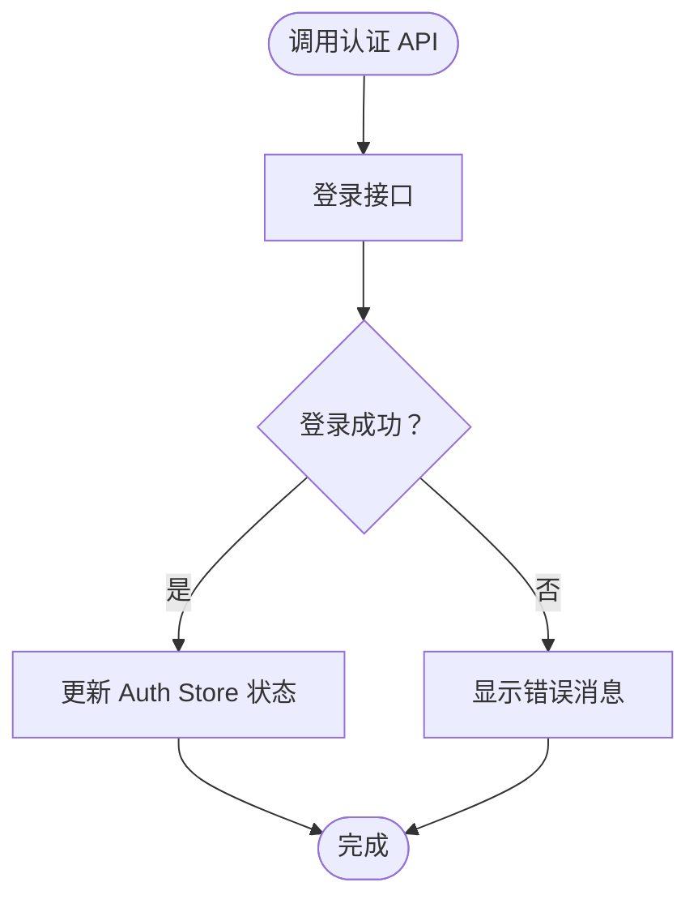
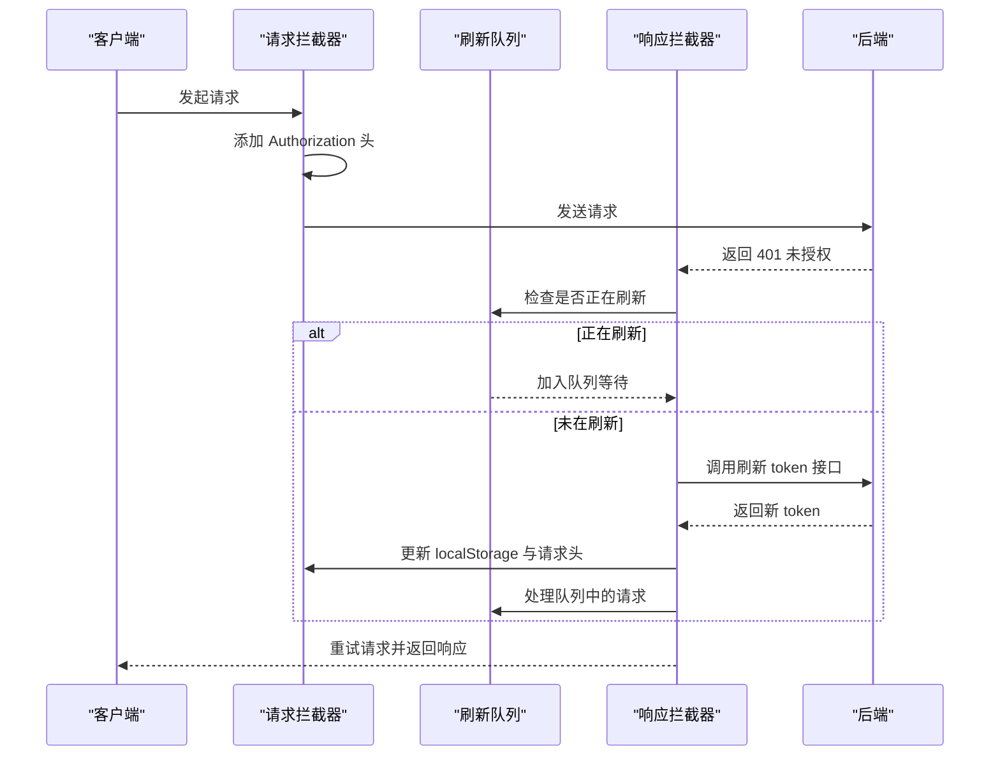
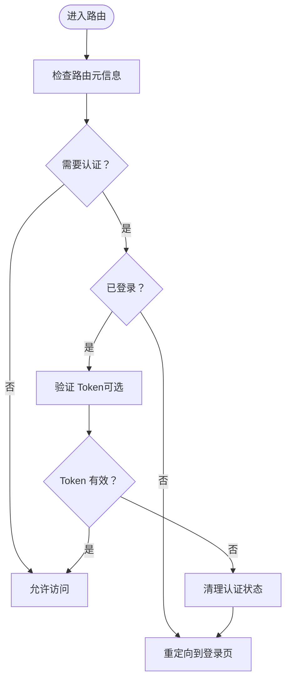
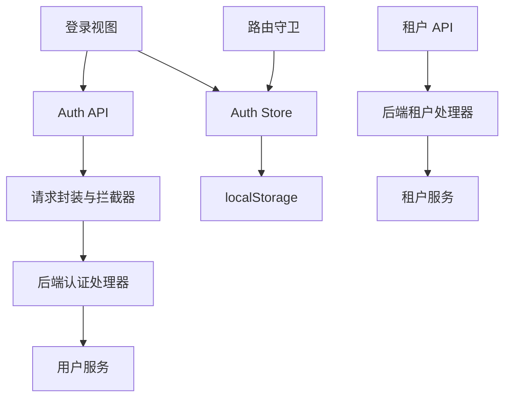

# 认证状态管理

<cite>
**本文档引用的文件**
- [frontend/src/stores/auth.ts](file://frontend/src/stores/auth.ts)
- [frontend/src/api/auth/index.ts](file://frontend/src/api/auth/index.ts)
- [frontend/src/utils/request.ts](file://frontend/src/utils/request.ts)
- [frontend/src/views/auth/Login.vue](file://frontend/src/views/auth/Login.vue)
- [frontend/src/router/index.ts](file://frontend/src/router/index.ts)
- [frontend/src/i18n/index.ts](file://frontend/src/i18n/index.ts)
- [frontend/src/api/tenant/index.ts](file://frontend/src/api/tenant/index.ts)
- [internal/handler/auth.go](file://internal/handler/auth.go)
- [internal/application/service/user.go](file://internal/application/service/user.go)
- [internal/handler/tenant.go](file://internal/handler/tenant.go)
- [internal/application/service/tenant.go](file://internal/application/service/tenant.go)
- [frontend/src/i18n/locales/zh-CN.ts](file://frontend/src/i18n/locales/zh-CN.ts)
</cite>

## 目录
1. [简介](#简介)
2. [项目结构](#项目结构)
3. [核心组件](#核心组件)
4. [架构概览](#架构概览)
5. [详细组件分析](#详细组件分析)
6. [依赖关系分析](#依赖关系分析)
7. [性能考量](#性能考量)
8. [故障排除指南](#故障排除指南)
9. [结论](#结论)

## 简介
本文件深入解析 WiseDx 前端的认证状态管理系统，涵盖 Pinia Store 的设计与实现、用户登录状态管理、token 存储与刷新机制、权限验证逻辑，以及认证状态与 API 请求的集成方式。文档还提供了最佳实践建议，包括安全考虑、状态持久化和错误处理策略。

## 项目结构
认证相关的核心文件分布如下：
- 前端认证 Store：`frontend/src/stores/auth.ts`
- 认证 API 接口：`frontend/src/api/auth/index.ts`
- Axios 请求封装与拦截器：`frontend/src/utils/request.ts`
- 登录视图与交互：`frontend/src/views/auth/Login.vue`
- 路由守卫与权限控制：`frontend/src/router/index.ts`
- 国际化与错误消息：`frontend/src/i18n/index.ts`、`frontend/src/i18n/locales/zh-CN.ts`
- 租户相关 API：`frontend/src/api/tenant/index.ts`
- 后端认证处理器与服务：`internal/handler/auth.go`、`internal/application/service/user.go`
- 后端租户处理器与服务：`internal/handler/tenant.go`、`internal/application/service/tenant.go`

**图表来源**
- [frontend/src/stores/auth.ts](file://frontend/src/stores/auth.ts#L1-L233)
- [frontend/src/api/auth/index.ts](file://frontend/src/api/auth/index.ts#L1-L242)
- [frontend/src/utils/request.ts](file://frontend/src/utils/request.ts#L1-L234)
- [frontend/src/views/auth/Login.vue](file://frontend/src/views/auth/Login.vue#L1-L1403)
- [frontend/src/router/index.ts](file://frontend/src/router/index.ts#L1-L127)
- [frontend/src/i18n/index.ts](file://frontend/src/i18n/index.ts#L1-L24)
- [internal/handler/auth.go](file://internal/handler/auth.go#L350-L400)
- [internal/application/service/user.go](file://internal/application/service/user.go#L324-L354)
- [internal/handler/tenant.go](file://internal/handler/tenant.go#L265-L345)
- [internal/application/service/tenant.go](file://internal/application/service/tenant.go#L284-L328)

**章节来源**
- [frontend/src/stores/auth.ts](file://frontend/src/stores/auth.ts#L1-L233)
- [frontend/src/api/auth/index.ts](file://frontend/src/api/auth/index.ts#L1-L242)
- [frontend/src/utils/request.ts](file://frontend/src/utils/request.ts#L1-L234)
- [frontend/src/views/auth/Login.vue](file://frontend/src/views/auth/Login.vue#L1-L1403)
- [frontend/src/router/index.ts](file://frontend/src/router/index.ts#L1-L127)
- [frontend/src/i18n/index.ts](file://frontend/src/i18n/index.ts#L1-L24)

## 核心组件
- Auth Store（Pinia）
  - 状态：用户信息、租户信息、访问 token、刷新 token、知识库列表、当前知识库、选中的租户 ID/名称、所有租户列表
  - 计算属性：登录状态、有效租户、当前租户 ID、当前用户 ID、跨租户访问权限、生效租户 ID
  - 方法：设置用户、设置租户、设置 token、设置刷新 token、设置知识库列表、设置当前知识库、设置选中租户、设置所有租户、获取选中租户、登出、从本地存储初始化
- 认证 API
  - 登录、注册、获取当前用户、获取当前租户、刷新 token、登出、验证 token
- 请求封装与拦截器
  - 自动添加 Authorization 头、跨租户访问头、401 错误处理与 token 刷新、网络错误处理
- 路由守卫
  - 控制访问权限、登录状态检查、初始化状态检查
- 国际化与错误消息
  - 错误消息本地化、用户提示

**章节来源**
- [frontend/src/stores/auth.ts](file://frontend/src/stores/auth.ts#L7-L233)
- [frontend/src/api/auth/index.ts](file://frontend/src/api/auth/index.ts#L115-L237)
- [frontend/src/utils/request.ts](file://frontend/src/utils/request.ts#L20-L191)
- [frontend/src/router/index.ts](file://frontend/src/router/index.ts#L83-L124)
- [frontend/src/i18n/locales/zh-CN.ts](file://frontend/src/i18n/locales/zh-CN.ts#L700-L750)

## 架构概览
认证状态管理采用前后端分离架构，前端通过 Pinia Store 维护认证状态，通过 Axios 拦截器统一处理认证与错误，后端提供认证与授权接口，并进行 JWT 校验与权限控制。

**图表来源**
- [frontend/src/views/auth/Login.vue](file://frontend/src/views/auth/Login.vue#L430-L483)
- [frontend/src/api/auth/index.ts](file://frontend/src/api/auth/index.ts#L115-L143)
- [frontend/src/utils/request.ts](file://frontend/src/utils/request.ts#L20-L50)
- [internal/handler/auth.go](file://internal/handler/auth.go#L350-L400)

## 详细组件分析

### Auth Store 设计与实现
- 数据结构
  - 用户信息：包含用户 ID、用户名、邮箱、头像、默认租户 ID、跨租户访问权限等
  - 租户信息：包含租户 ID、名称、API Key、状态、业务类型、存储配额与用量等
  - token：访问 token 与刷新 token
  - 知识库：知识库列表与当前选中知识库
  - 租户选择：支持跨租户访问时选择其他租户
- 计算属性
  - 登录状态：基于 token 与用户信息判断
  - 有效租户：基于租户 API Key 是否存在判断
  - 当前租户 ID/当前用户 ID：提供只读访问
  - 跨租户访问权限：基于用户字段判断
  - 生效租户 ID：优先使用选中的租户，否则使用用户默认租户
- 方法
  - 设置用户/租户/token/刷新 token：更新状态并持久化到 localStorage
  - 设置知识库列表/当前知识库：维护知识库上下文
  - 设置选中租户：支持跨租户访问
  - 设置所有租户：用于管理界面
  - 获取选中租户：读取当前选择
  - 登出：清空状态与 localStorage
  - 从本地存储初始化：应用启动时恢复状态

**图表来源**
- [frontend/src/stores/auth.ts](file://frontend/src/stores/auth.ts#L7-L233)

**章节来源**
- [frontend/src/stores/auth.ts](file://frontend/src/stores/auth.ts#L8-L233)

### 认证 API 接口
- 登录接口：接收邮箱与密码，返回用户信息、租户信息、访问 token 与刷新 token
- 注册接口：接收用户名、邮箱、密码，返回用户与租户信息
- 获取当前用户：返回用户与租户信息
- 获取当前租户：返回租户信息
- 刷新 token：使用刷新 token 获取新的访问 token 与刷新 token
- 登出：调用后端登出接口
- 验证 token：校验访问 token 有效性

**图表来源**
- [frontend/src/api/auth/index.ts](file://frontend/src/api/auth/index.ts#L115-L143)

**章节来源**
- [frontend/src/api/auth/index.ts](file://frontend/src/api/auth/index.ts#L115-L237)

### 请求封装与拦截器（Axios）
- 自动添加 Authorization 头：从 localStorage 读取 token 并添加到请求头
- 跨租户访问头：当选择其他租户时，添加 X-Tenant-ID 请求头
- 401 错误处理与 token 刷新：
  - 防止并发刷新：使用 isRefreshing 标志与队列处理
  - 动态导入刷新 API 并调用后端刷新接口
  - 成功刷新后更新 localStorage 与请求头，处理队列中的请求
  - 刷新失败或无刷新 token 时，清理认证信息并跳转到登录页
- 网络错误与业务错误处理：统一返回错误对象，包含状态码与消息

**图表来源**
- [frontend/src/utils/request.ts](file://frontend/src/utils/request.ts#L20-L191)

**章节来源**
- [frontend/src/utils/request.ts](file://frontend/src/utils/request.ts#L20-L191)

### 路由守卫与权限控制
- 路由元信息：requiresAuth、requiresInit 控制页面访问权限
- 登录状态检查：未登录用户访问受保护页面跳转至登录页
- 已登录用户访问登录页：重定向至知识库列表
- Token 有效性验证：注释掉的验证逻辑可按需启用

**图表来源**
- [frontend/src/router/index.ts](file://frontend/src/router/index.ts#L83-L124)

**章节来源**
- [frontend/src/router/index.ts](file://frontend/src/router/index.ts#L83-L124)

### 登录视图与交互
- 表单验证：邮箱、密码、确认密码等规则
- 登录流程：调用登录 API，成功后更新 Auth Store，提示成功并跳转
- 注册流程：调用注册 API，成功后切换到登录模式并提示
- 语言切换：通过国际化模块与本地存储实现

**章节来源**
- [frontend/src/views/auth/Login.vue](file://frontend/src/views/auth/Login.vue#L430-L520)
- [frontend/src/i18n/index.ts](file://frontend/src/i18n/index.ts#L1-L24)

### 租户与跨租户访问
- 租户 API：搜索租户、列出租户（需要跨租户访问权限）
- 前端租户选择：通过 Auth Store 的 setSelectedTenant 设置选中租户
- 后端权限控制：需要用户具备跨租户访问权限且配置开启

**章节来源**
- [frontend/src/api/tenant/index.ts](file://frontend/src/api/tenant/index.ts#L38-L82)
- [frontend/src/stores/auth.ts](file://frontend/src/stores/auth.ts#L83-L95)
- [internal/handler/tenant.go](file://internal/handler/tenant.go#L273-L345)
- [internal/application/service/tenant.go](file://internal/application/service/tenant.go#L284-L328)

## 依赖关系分析
- 前端依赖
  - Auth Store 依赖 localStorage 进行状态持久化
  - 认证 API 依赖请求封装与拦截器
  - 登录视图依赖 Auth Store 与认证 API
  - 路由守卫依赖 Auth Store
- 后端依赖
  - 认证处理器依赖用户服务进行 JWT 校验与权限检查
  - 租户处理器依赖租户服务与配置进行跨租户访问控制

**图表来源**
- [frontend/src/stores/auth.ts](file://frontend/src/stores/auth.ts#L130-L195)
- [frontend/src/api/auth/index.ts](file://frontend/src/api/auth/index.ts#L1-L242)
- [frontend/src/utils/request.ts](file://frontend/src/utils/request.ts#L1-L234)
- [frontend/src/views/auth/Login.vue](file://frontend/src/views/auth/Login.vue#L273-L284)
- [frontend/src/router/index.ts](file://frontend/src/router/index.ts#L1-L127)
- [internal/handler/auth.go](file://internal/handler/auth.go#L350-L400)
- [internal/application/service/user.go](file://internal/application/service/user.go#L324-L354)
- [internal/handler/tenant.go](file://internal/handler/tenant.go#L265-L345)
- [internal/application/service/tenant.go](file://internal/application/service/tenant.go#L284-L328)

**章节来源**
- [frontend/src/stores/auth.ts](file://frontend/src/stores/auth.ts#L130-L195)
- [frontend/src/api/auth/index.ts](file://frontend/src/api/auth/index.ts#L1-L242)
- [frontend/src/utils/request.ts](file://frontend/src/utils/request.ts#L1-L234)
- [frontend/src/views/auth/Login.vue](file://frontend/src/views/auth/Login.vue#L273-L284)
- [frontend/src/router/index.ts](file://frontend/src/router/index.ts#L1-L127)
- [internal/handler/auth.go](file://internal/handler/auth.go#L350-L400)
- [internal/application/service/user.go](file://internal/application/service/user.go#L324-L354)
- [internal/handler/tenant.go](file://internal/handler/tenant.go#L265-L345)
- [internal/application/service/tenant.go](file://internal/application/service/tenant.go#L284-L328)

## 性能考量
- Token 刷新防抖：通过 isRefreshing 标志与队列避免并发刷新请求
- 请求头缓存：跨租户访问头仅在选择不同租户时添加，减少不必要的头部设置
- 状态持久化：localStorage 读写在初始化与状态变更时进行，避免频繁 IO
- 错误处理：统一错误对象包含状态码与消息，便于前端快速判断与处理

## 故障排除指南
- 登录失败
  - 检查邮箱与密码格式与长度
  - 查看后端返回的错误消息，确认账号状态
- 401 未授权
  - 检查 token 是否过期或被撤销
  - 查看刷新 token 是否存在，确认刷新流程是否成功
  - 确认后端 JWT 校验与权限检查是否正常
- 跨租户访问失败
  - 确认用户具备跨租户访问权限
  - 检查后端配置是否开启跨租户访问
- 状态恢复异常
  - 检查 localStorage 中的认证数据格式
  - 查看国际化错误消息定位解析失败原因

**章节来源**
- [frontend/src/stores/auth.ts](file://frontend/src/stores/auth.ts#L144-L194)
- [frontend/src/utils/request.ts](file://frontend/src/utils/request.ts#L83-L167)
- [frontend/src/i18n/locales/zh-CN.ts](file://frontend/src/i18n/locales/zh-CN.ts#L700-L750)

## 结论
WiseDx 的认证状态管理通过 Pinia Store 实现了清晰的状态建模与持久化，结合 Axios 拦截器实现了自动 token 添加与 401 错误处理，配合后端 JWT 校验与权限控制，形成了完整的认证体系。建议在生产环境中启用 Token 有效性验证，并持续优化错误消息与用户体验。