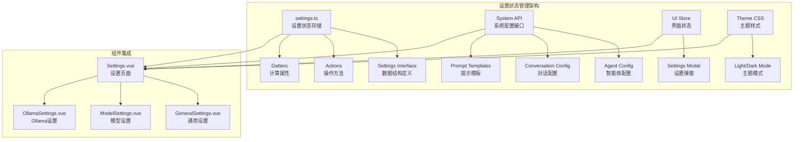
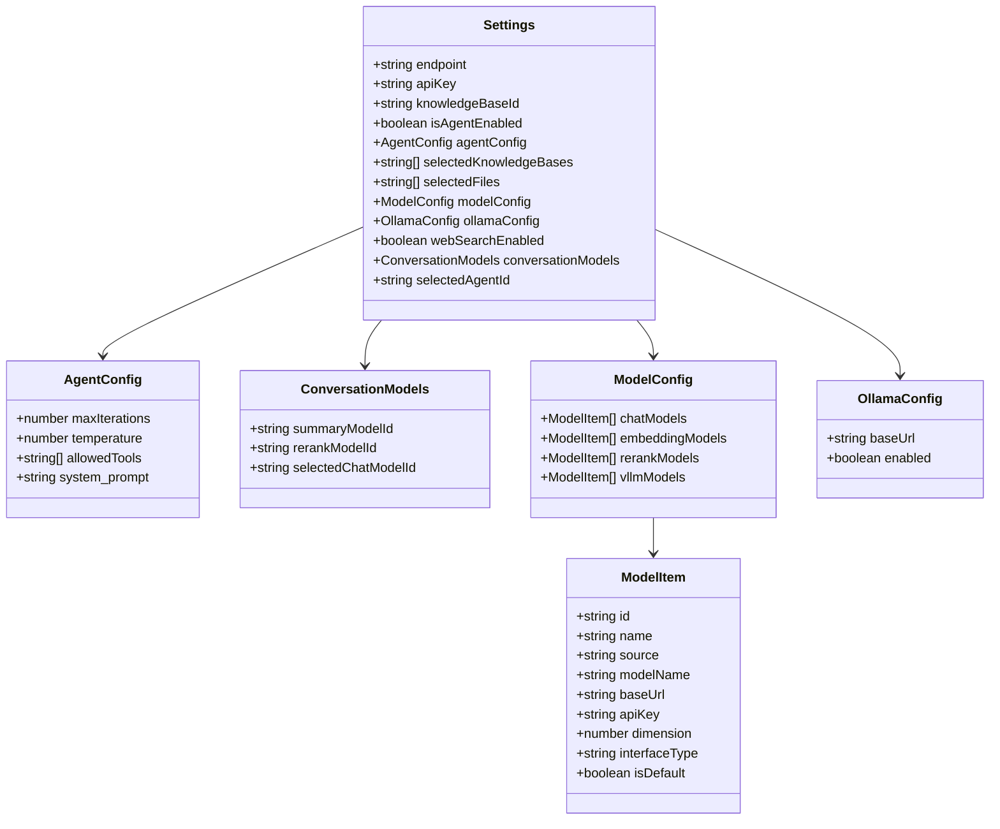
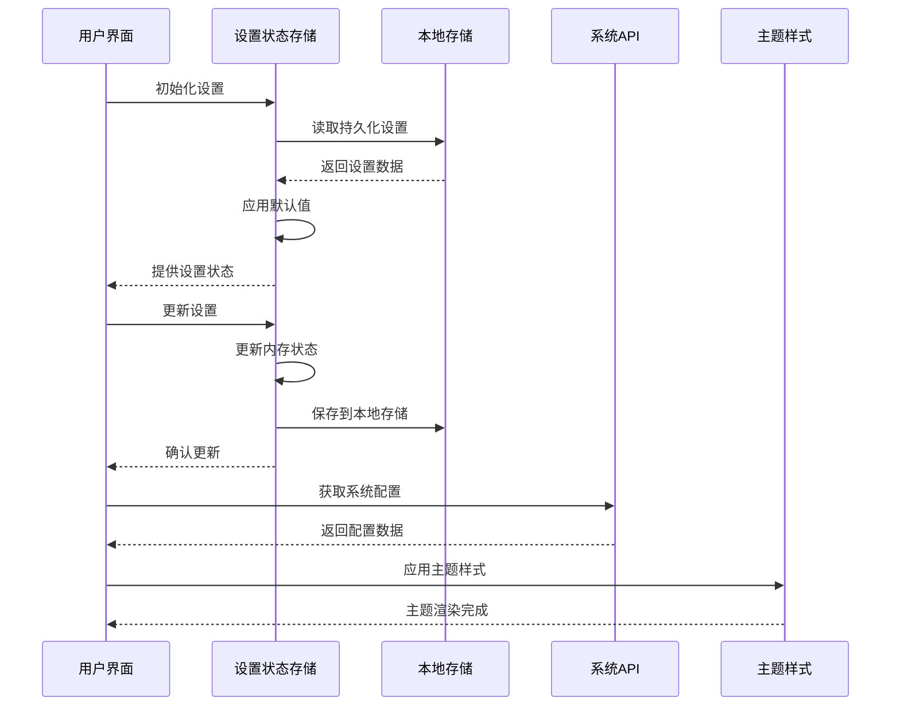
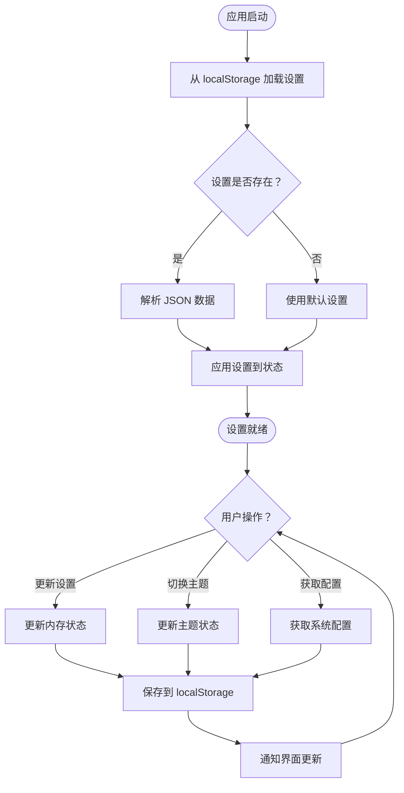
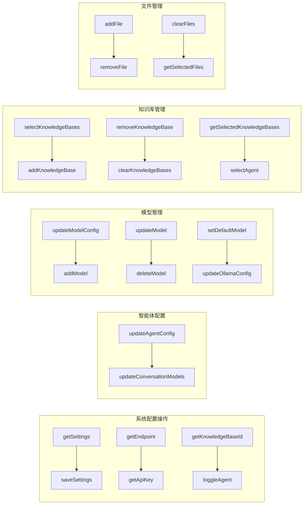
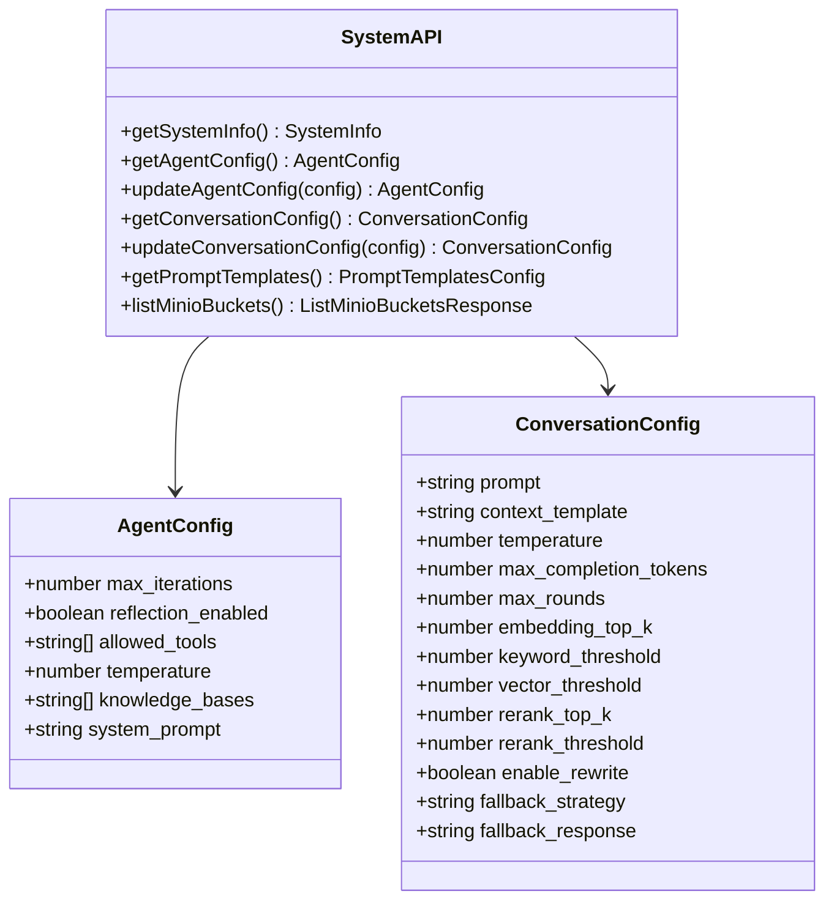
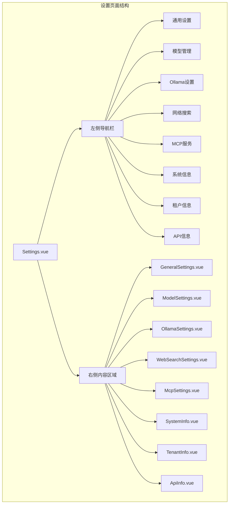
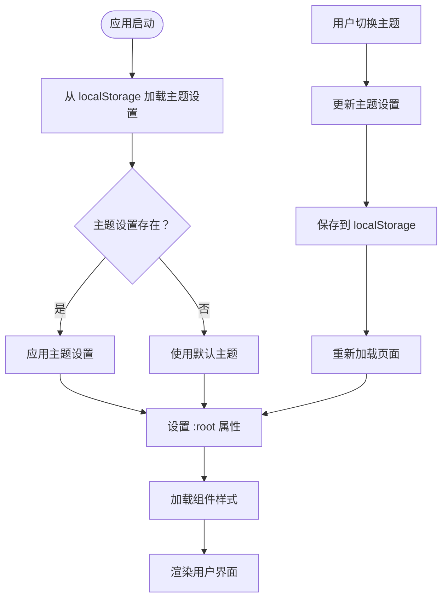
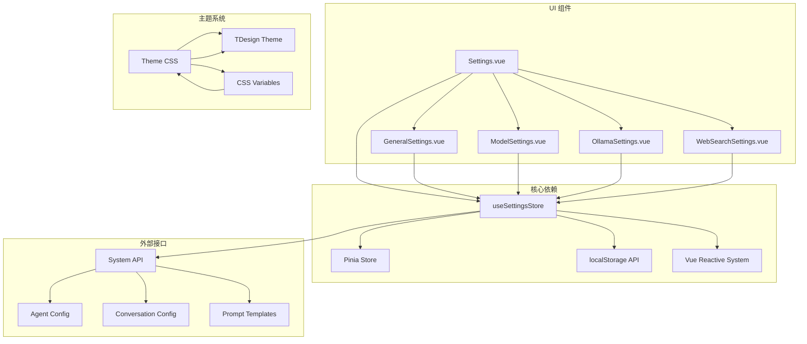

# 设置状态管理

<cite>
**本文档引用的文件**
- [frontend/src/stores/settings.ts](file://frontend/src/stores/settings.ts)
- [frontend/src/api/system/index.ts](file://frontend/src/api/system/index.ts)
- [frontend/src/views/settings/Settings.vue](file://frontend/src/views/settings/Settings.vue)
- [frontend/src/views/settings/GeneralSettings.vue](file://frontend/src/views/settings/GeneralSettings.vue)
- [frontend/src/stores/ui.ts](file://frontend/src/stores/ui.ts)
- [frontend/src/main.ts](file://frontend/src/main.ts)
- [frontend/src/App.vue](file://frontend/src/App.vue)
- [frontend/src/assets/theme/theme.css](file://frontend/src/assets/theme/theme.css)
- [frontend/node_modules/tdesign-vue-next/es/style/index.css](file://frontend/node_modules/tdesign-vue-next/es/style/index.css)
</cite>

## 目录
1. [简介](#简介)
2. [项目结构](#项目结构)
3. [核心组件](#核心组件)
4. [架构概览](#架构概览)
5. [详细组件分析](#详细组件分析)
6. [依赖关系分析](#依赖关系分析)
7. [性能考虑](#性能考虑)
8. [故障排除指南](#故障排除指南)
9. [结论](#结论)

## 简介

WiseDx 的设置状态管理系统是一个基于 Pinia 的状态管理解决方案，负责管理系统的配置状态、用户偏好设置和全局主题状态。该系统采用 localStorage 进行持久化存储，提供了完整的设置状态生命周期管理，包括数据结构定义、action 方法、getter 计算属性以及持久化机制。

系统设计的核心目标是提供一个可扩展、可维护且用户友好的设置管理框架，支持多种配置类型的管理，包括系统配置、用户偏好设置和主题配置。

## 项目结构

前端设置状态管理主要分布在以下关键文件中：

**图表来源**
- [frontend/src/stores/settings.ts](file://frontend/src/stores/settings.ts#L1-L342)
- [frontend/src/api/system/index.ts](file://frontend/src/api/system/index.ts#L1-L113)
- [frontend/src/views/settings/Settings.vue](file://frontend/src/views/settings/Settings.vue#L1-L547)

**章节来源**
- [frontend/src/stores/settings.ts](file://frontend/src/stores/settings.ts#L1-L342)
- [frontend/src/views/settings/Settings.vue](file://frontend/src/views/settings/Settings.vue#L1-L547)

## 核心组件

### 数据结构定义

设置状态管理系统定义了完整的数据结构层次：

**图表来源**
- [frontend/src/stores/settings.ts](file://frontend/src/stores/settings.ts#L4-L92)

### 默认设置配置

系统提供了完整的默认设置配置，确保在首次使用时的用户体验：

| 配置类别 | 默认值 | 描述 |
|---------|--------|------|
| endpoint | 空字符串 | API 端点地址 |
| apiKey | 空字符串 | API 认证密钥 |
| knowledgeBaseId | 空字符串 | 默认知识库 ID |
| isAgentEnabled | false | 智能体启用状态 |
| agentConfig.maxIterations | 5 | 最大迭代次数 |
| agentConfig.temperature | 0.7 | 生成温度参数 |
| agentConfig.allowedTools | 空数组 | 允许使用的工具列表 |
| ollamaConfig.baseUrl | "http://localhost:11434" | Ollama 服务地址 |
| ollamaConfig.enabled | true | Ollama 服务启用状态 |
| webSearchEnabled | false | 网络搜索功能状态 |

**章节来源**
- [frontend/src/stores/settings.ts](file://frontend/src/stores/settings.ts#L61-L92)

## 架构概览

设置状态管理系统的整体架构采用分层设计，确保各组件职责清晰分离：

**图表来源**
- [frontend/src/stores/settings.ts](file://frontend/src/stores/settings.ts#L94-L341)
- [frontend/src/api/system/index.ts](file://frontend/src/api/system/index.ts#L76-L112)

## 详细组件分析

### 设置状态存储 (useSettingsStore)

#### 状态管理

设置状态存储采用 Pinia 的 defineStore 模式，提供了完整的状态管理功能：

**图表来源**
- [frontend/src/stores/settings.ts](file://frontend/src/stores/settings.ts#L94-L147)

#### Getter 计算属性

系统提供了多个 getter 计算属性来简化状态访问：

| Getter 名称 | 功能描述 | 返回值类型 | 实现逻辑 |
|------------|----------|------------|----------|
| isAgentEnabled | 检查智能体是否启用 | boolean | 返回 settings.isAgentEnabled 或默认 false |
| isAgentReady | 检查智能体是否准备就绪 | boolean | 验证 allowedTools、summaryModelId、rerankModelId |
| isNormalModeReady | 检查普通模式是否就绪 | boolean | 验证 summaryModelId、rerankModelId |
| agentConfig | 获取智能体配置 | AgentConfig | 返回 settings.agentConfig 或默认配置 |
| conversationModels | 获取对话模型配置 | ConversationModels | 返回 settings.conversationModels 或默认配置 |
| modelConfig | 获取模型配置 | ModelConfig | 返回 settings.modelConfig 或默认配置 |
| isWebSearchEnabled | 检查网络搜索是否启用 | boolean | 返回 settings.webSearchEnabled 或默认 false |
| selectedAgentId | 获取选中的智能体ID | string | 返回 settings.selectedAgentId 或默认值 |

**章节来源**
- [frontend/src/stores/settings.ts](file://frontend/src/stores/settings.ts#L100-L139)

#### Action 方法

设置状态存储提供了丰富的 action 方法来处理各种设置操作：

##### 系统配置管理

**图表来源**
- [frontend/src/stores/settings.ts](file://frontend/src/stores/settings.ts#L141-L340)

##### 知识库选择管理

系统提供了完整的知识库选择管理功能：

| 方法名 | 参数 | 功能描述 | 实现细节 |
|-------|------|----------|----------|
| selectKnowledgeBases | kbIds: string[] | 替换整个知识库列表 | 直接赋值并保存 |
| addKnowledgeBase | kbId: string | 添加单个知识库 | 去重检查后添加 |
| removeKnowledgeBase | kbId: string | 移除单个知识库 | 过滤掉指定ID |
| clearKnowledgeBases | - | 清空知识库选择 | 设置为空数组 |
| getSelectedKnowledgeBases | - | 获取选中的知识库列表 | 返回当前选择或空数组 |

##### 文件选择管理

系统支持文件级别的选择管理：

| 方法名 | 参数 | 功能描述 | 实现细节 |
|-------|------|----------|----------|
| addFile | fileId: string | 添加文件 | 去重后添加到列表 |
| removeFile | fileId: string | 移除文件 | 过滤掉指定ID |
| clearFiles | - | 清空文件选择 | 设置为空数组 |
| getSelectedFiles | - | 获取选中的文件列表 | 返回当前选择或空数组 |

**章节来源**
- [frontend/src/stores/settings.ts](file://frontend/src/stores/settings.ts#L255-L315)

### 系统配置接口

系统提供了与后端交互的配置管理接口：

**图表来源**
- [frontend/src/api/system/index.ts](file://frontend/src/api/system/index.ts#L26-L94)

**章节来源**
- [frontend/src/api/system/index.ts](file://frontend/src/api/system/index.ts#L1-L113)

### 设置页面组件

设置页面采用了模块化的组件设计：

**图表来源**
- [frontend/src/views/settings/Settings.vue](file://frontend/src/views/settings/Settings.vue#L148-L167)

**章节来源**
- [frontend/src/views/settings/Settings.vue](file://frontend/src/views/settings/Settings.vue#L1-L547)

### 主题状态管理

系统实现了完整的主题状态管理机制：

**图表来源**
- [frontend/src/assets/theme/theme.css](file://frontend/src/assets/theme/theme.css#L1-L95)
- [frontend/src/views/settings/GeneralSettings.vue](file://frontend/src/views/settings/GeneralSettings.vue#L65-L73)

**章节来源**
- [frontend/src/assets/theme/theme.css](file://frontend/src/assets/theme/theme.css#L1-L95)
- [frontend/src/views/settings/GeneralSettings.vue](file://frontend/src/views/settings/GeneralSettings.vue#L36-L73)

## 依赖关系分析

设置状态管理系统与其他组件的依赖关系如下：

**图表来源**
- [frontend/src/stores/settings.ts](file://frontend/src/stores/settings.ts#L1-L3)
- [frontend/src/views/settings/Settings.vue](file://frontend/src/views/settings/Settings.vue#L125-L142)

**章节来源**
- [frontend/src/stores/settings.ts](file://frontend/src/stores/settings.ts#L1-L3)
- [frontend/src/views/settings/Settings.vue](file://frontend/src/views/settings/Settings.vue#L125-L142)

## 性能考虑

设置状态管理系统在性能方面采用了多项优化策略：

### 内存管理优化

1. **懒加载机制**：设置状态只在需要时才从 localStorage 加载
2. **状态分片**：将大型配置对象分割为独立的状态片段
3. **计算属性缓存**：利用 Vue 的响应式系统自动缓存 getter 结果

### 存储优化

1. **增量更新**：只更新发生变化的部分，避免全量重写
2. **批量操作**：支持多个设置的批量更新操作
3. **去重机制**：自动去除重复的设置项

### 渲染优化

1. **细粒度更新**：组件只监听必要的状态变化
2. **防抖处理**：对频繁的设置更新进行防抖处理
3. **虚拟滚动**：对于大量选项的设置界面使用虚拟滚动

## 故障排除指南

### 常见问题及解决方案

#### 设置无法持久化

**问题症状**：设置更改后刷新页面丢失

**可能原因**：
1. localStorage 权限问题
2. 浏览器隐私模式限制
3. 存储空间不足

**解决步骤**：
1. 检查浏览器控制台是否有存储相关错误
2. 验证 localStorage 是否可用
3. 清理浏览器缓存和存储数据

#### 设置加载失败

**问题症状**：应用启动时设置状态异常

**可能原因**：
1. localStorage 中的数据格式错误
2. 数据结构版本不兼容
3. 网络请求超时

**解决步骤**：
1. 检查 localStorage 中的设置数据格式
2. 验证数据结构的完整性
3. 重置设置到默认状态

#### 主题切换失效

**问题症状**：主题切换后样式未更新

**可能原因**：
1. CSS 变量未正确更新
2. 缓存的样式表未刷新
3. 主题模式属性未设置

**解决步骤**：
1. 检查 :root[theme-mode="..."] 属性是否正确设置
2. 验证 CSS 变量的继承关系
3. 强制刷新样式表缓存

**章节来源**
- [frontend/src/stores/settings.ts](file://frontend/src/stores/settings.ts#L94-L147)
- [frontend/src/assets/theme/theme.css](file://frontend/src/assets/theme/theme.css#L1-L95)

## 结论

WiseDx 的设置状态管理系统展现了现代前端应用状态管理的最佳实践。系统通过合理的架构设计、完善的错误处理机制和优秀的用户体验，为用户提供了强大而易用的设置管理功能。

### 主要优势

1. **模块化设计**：清晰的组件分离和职责划分
2. **持久化支持**：完整的本地存储机制
3. **类型安全**：严格的 TypeScript 类型定义
4. **扩展性**：易于添加新的设置类型和功能
5. **性能优化**：高效的内存管理和渲染优化

### 技术亮点

1. **响应式状态管理**：基于 Vue 3 和 Pinia 的现代化状态管理
2. **主题系统集成**：与 TDesign 主题系统的无缝集成
3. **异步配置管理**：支持与后端系统的配置同步
4. **用户友好界面**：直观的设置界面和操作流程

该系统为 WiseDx 平台提供了坚实的基础，支持未来的功能扩展和技术演进需求。