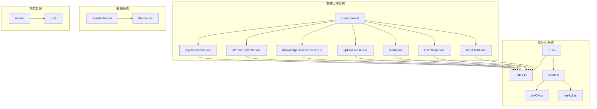
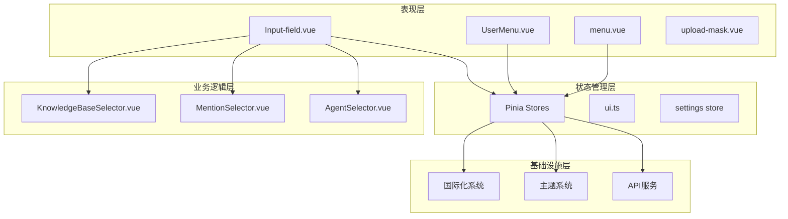
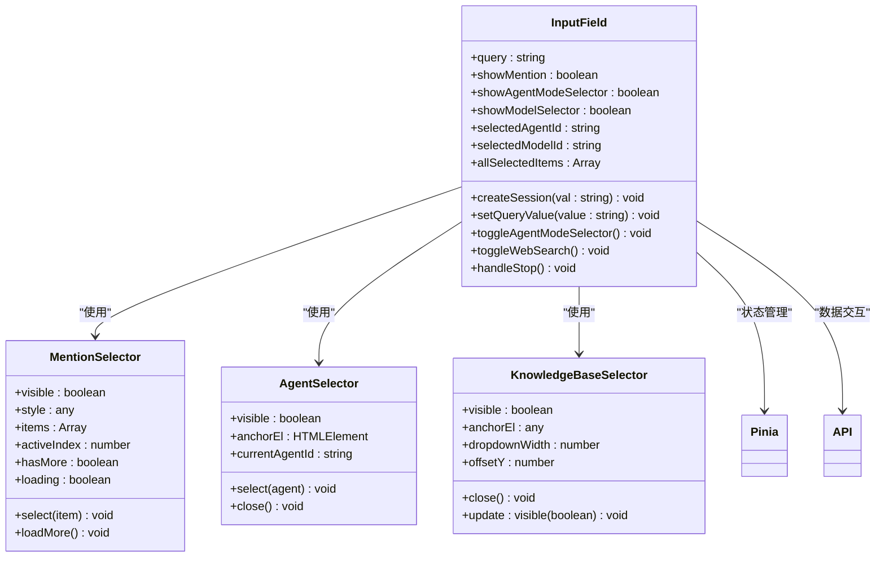
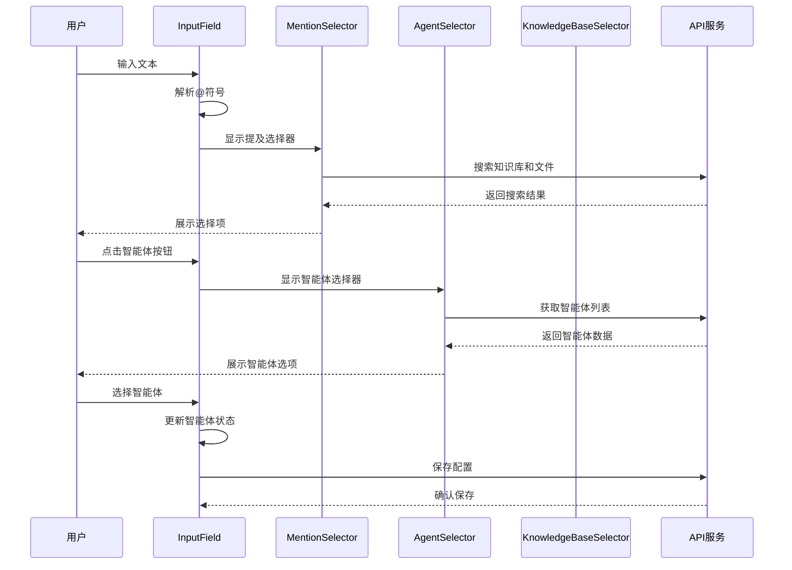
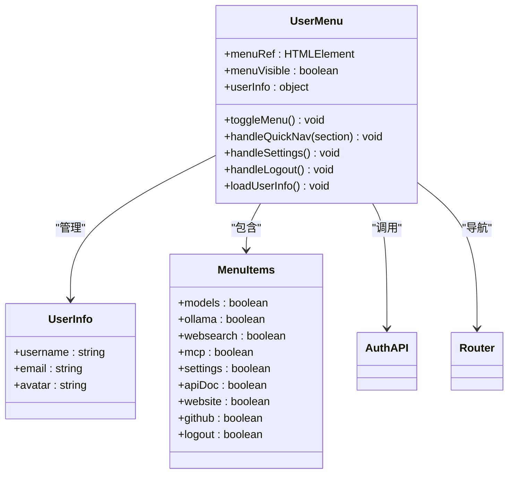
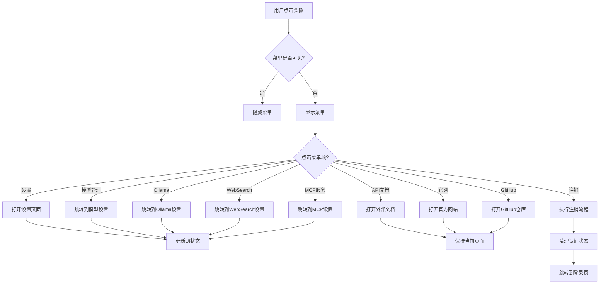
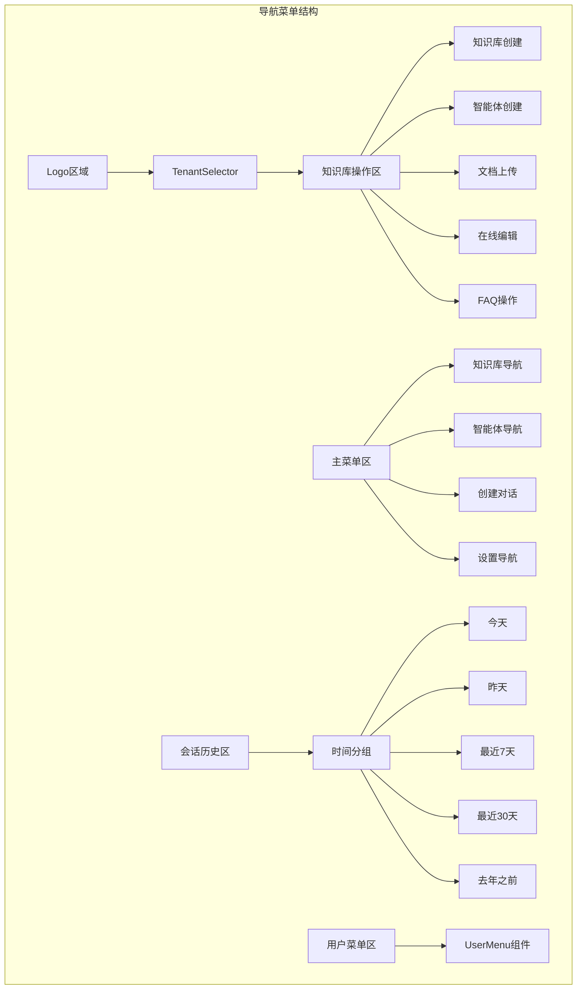
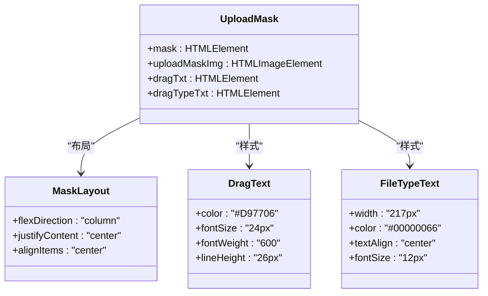
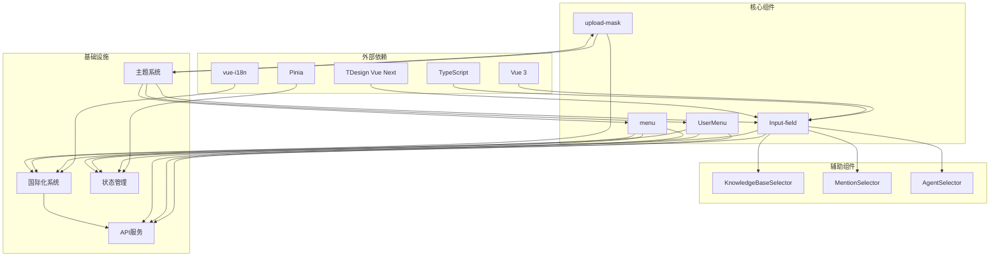

# UI基础组件

<cite>
**本文档引用的文件**
- [Input-field.vue](file://frontend/src/components/Input-field.vue)
- [UserMenu.vue](file://frontend/src/components/UserMenu.vue)
- [menu.vue](file://frontend/src/components/menu.vue)
- [upload-mask.vue](file://frontend/src/components/upload-mask.vue)
- [KnowledgeBaseSelector.vue](file://frontend/src/components/KnowledgeBaseSelector.vue)
- [MentionSelector.vue](file://frontend/src/components/MentionSelector.vue)
- [AgentSelector.vue](file://frontend/src/components/AgentSelector.vue)
- [index.ts](file://frontend/src/i18n/index.ts)
- [zh-CN.ts](file://frontend/src/i18n/locales/zh-CN.ts)
- [en-US.ts](file://frontend/src/i18n/locales/en-US.ts)
- [theme.css](file://frontend/src/assets/theme/theme.css)
- [ui.ts](file://frontend/src/stores/ui.ts)
- [main.ts](file://frontend/src/main.ts)
</cite>

## 目录
1. [简介](#简介)
2. [项目结构](#项目结构)
3. [核心组件](#核心组件)
4. [架构概览](#架构概览)
5. [详细组件分析](#详细组件分析)
6. [依赖关系分析](#依赖关系分析)
7. [性能考虑](#性能考虑)
8. [故障排除指南](#故障排除指南)
9. [结论](#结论)
10. [附录](#附录)

## 简介

WiseDx前端UI基础组件是一套专为医疗知识问答系统设计的Vue 3组件库，包含了输入框、用户菜单、导航菜单和上传遮罩等核心UI组件。这些组件采用现代化的开发理念，集成了国际化支持、主题定制、响应式设计和无障碍访问功能。

本组件库基于Vue 3 Composition API构建，使用TypeScript提供完整的类型安全，结合Pinia状态管理实现组件间的高效通信。所有组件都经过精心设计，确保在不同设备和浏览器环境下都能提供优秀的用户体验。

## 项目结构

前端项目采用模块化的组织方式，核心UI组件位于`frontend/src/components/`目录下，每个组件都是独立的功能单元，具有清晰的职责划分和接口定义。



**图表来源**
- [Input-field.vue](file://frontend/src/components/Input-field.vue#L1-L50)
- [UserMenu.vue](file://frontend/src/components/UserMenu.vue#L1-L50)
- [menu.vue](file://frontend/src/components/menu.vue#L1-L50)
- [upload-mask.vue](file://frontend/src/components/upload-mask.vue#L1-L20)
- [index.ts](file://frontend/src/i18n/index.ts#L1-L24)
- [theme.css](file://frontend/src/assets/theme/theme.css#L1-L30)
- [ui.ts](file://frontend/src/stores/ui.ts#L1-L30)

**章节来源**
- [main.ts](file://frontend/src/main.ts#L1-L20)

## 核心组件

### 输入框组件 (Input-field)

输入框组件是整个系统的交互核心，提供了丰富的AI对话功能。它集成了知识库选择、文件上传、智能体切换、网络搜索等多种高级功能。

**主要特性：**
- 智能@提及功能，支持知识库和文件选择
- 多种智能体模式切换（快速回答/智能推理）
- 网络搜索集成
- 文件上传和知识库关联
- 实时占位符动态更新

**关键属性：**
- `isReplying`: 是否处于回复模式
- `sessionId`: 会话ID
- `assistantMessageId`: 助手消息ID

**事件处理：**
- `send-msg`: 发送消息事件
- `stop-generation`: 停止生成事件

### 用户菜单组件 (UserMenu)

用户菜单组件提供用户信息展示和快捷操作功能，支持多语言切换和外部链接访问。

**主要功能：**
- 用户头像和基本信息显示
- 快捷导航到设置页面
- API文档和官网链接
- 注销功能

### 导航菜单组件 (menu)

导航菜单组件负责应用的整体导航结构，集成了知识库管理、智能体管理、会话历史等功能。

**核心功能：**
- 知识库快速操作
- 智能体管理入口
- 会话历史分组显示
- 用户菜单集成

### 上传遮罩组件 (upload-mask)

上传遮罩组件提供直观的文件上传指示器，支持多格式文件的拖拽上传。

**设计特点：**
- 清晰的视觉指示
- 支持多种文件格式
- 响应式布局

**章节来源**
- [Input-field.vue](file://frontend/src/components/Input-field.vue#L158-L171)
- [UserMenu.vue](file://frontend/src/components/UserMenu.vue#L1-L50)
- [menu.vue](file://frontend/src/components/menu.vue#L1-L50)
- [upload-mask.vue](file://frontend/src/components/upload-mask.vue#L1-L20)

## 架构概览

WiseDx UI组件库采用了分层架构设计，确保了组件间的松耦合和高内聚。



**图表来源**
- [Input-field.vue](file://frontend/src/components/Input-field.vue#L1-L50)
- [KnowledgeBaseSelector.vue](file://frontend/src/components/KnowledgeBaseSelector.vue#L65-L90)
- [MentionSelector.vue](file://frontend/src/components/MentionSelector.vue#L51-L63)
- [AgentSelector.vue](file://frontend/src/components/AgentSelector.vue#L164-L182)
- [ui.ts](file://frontend/src/stores/ui.ts#L1-L30)

## 详细组件分析

### 输入框组件深度分析

输入框组件是整个系统的核心交互组件，实现了复杂的AI对话功能。

#### 组件架构图



**图表来源**
- [Input-field.vue](file://frontend/src/components/Input-field.vue#L158-L171)
- [MentionSelector.vue](file://frontend/src/components/MentionSelector.vue#L54-L63)
- [AgentSelector.vue](file://frontend/src/components/AgentSelector.vue#L173-L177)
- [KnowledgeBaseSelector.vue](file://frontend/src/components/KnowledgeBaseSelector.vue#L83-L88)

#### 数据流分析



**图表来源**
- [Input-field.vue](file://frontend/src/components/Input-field.vue#L577-L864)
- [MentionSelector.vue](file://frontend/src/components/MentionSelector.vue#L70-L81)
- [AgentSelector.vue](file://frontend/src/components/AgentSelector.vue#L230-L243)

#### 核心功能实现

**智能@提及功能：**
- 支持知识库和文件的实时搜索
- 智能体配置的权限控制
- 无限滚动加载机制

**智能体管理系统：**
- 内置智能体和自定义智能体区分
- 智能体能力检测和提示
- 配置状态的智能同步

**文件上传集成：**
- 多格式文件支持
- 上传进度跟踪
- 错误处理和重试机制

**章节来源**
- [Input-field.vue](file://frontend/src/components/Input-field.vue#L577-L1599)

### 用户菜单组件分析

用户菜单组件提供了完整的用户管理和快捷操作功能。

#### 组件设计模式



**图表来源**
- [UserMenu.vue](file://frontend/src/components/UserMenu.vue#L100-L133)
- [UserMenu.vue](file://frontend/src/components/UserMenu.vue#L118-L132)

#### 交互流程



**图表来源**
- [UserMenu.vue](file://frontend/src/components/UserMenu.vue#L134-L197)
- [UserMenu.vue](file://frontend/src/components/UserMenu.vue#L238-L252)

**章节来源**
- [UserMenu.vue](file://frontend/src/components/UserMenu.vue#L1-L439)

### 导航菜单组件分析

导航菜单组件负责应用的主要导航结构，集成了知识库管理和智能体管理功能。

#### 菜单结构设计



**图表来源**
- [menu.vue](file://frontend/src/components/menu.vue#L1-L80)
- [menu.vue](file://frontend/src/components/menu.vue#L307-L352)

#### 状态管理集成

导航菜单组件与Pinia状态管理紧密集成，实现了复杂的状态同步机制。

**章节来源**
- [menu.vue](file://frontend/src/components/menu.vue#L1-L800)

### 上传遮罩组件分析

上传遮罩组件提供了直观的文件上传指示功能，支持多格式文件的拖拽上传。

#### 设计特点



**图表来源**
- [upload-mask.vue](file://frontend/src/components/upload-mask.vue#L13-L42)

**章节来源**
- [upload-mask.vue](file://frontend/src/components/upload-mask.vue#L1-L43)

## 依赖关系分析

WiseDx UI组件库的依赖关系体现了清晰的分层架构和模块化设计。



**图表来源**
- [main.ts](file://frontend/src/main.ts#L1-L20)
- [Input-field.vue](file://frontend/src/components/Input-field.vue#L1-L25)
- [UserMenu.vue](file://frontend/src/components/UserMenu.vue#L100-L107)

### 组件间通信机制

组件间的通信主要通过以下几种方式实现：

1. **Props传递**: 父组件向子组件传递配置和数据
2. **事件发射**: 子组件向父组件发送状态变更
3. **Pinia状态管理**: 全局状态共享和同步
4. **API服务调用**: 组件间的数据交换

**章节来源**
- [Input-field.vue](file://frontend/src/components/Input-field.vue#L1038-L1057)
- [KnowledgeBaseSelector.vue](file://frontend/src/components/KnowledgeBaseSelector.vue#L90-L90)
- [AgentSelector.vue](file://frontend/src/components/AgentSelector.vue#L179-L182)

## 性能考虑

WiseDx UI组件库在设计时充分考虑了性能优化，采用了多种策略来确保良好的用户体验。

### 性能优化策略

**1. 懒加载和延迟初始化**
- 组件按需加载，减少初始包体积
- 大型组件采用延迟初始化机制
- 图片和资源采用懒加载策略

**2. 内存管理**
- 合理的事件监听器清理
- 组件卸载时的资源释放
- 防止内存泄漏的机制

**3. 渲染优化**
- 虚拟滚动实现大数据集的高效渲染
- 组件缓存和重用机制
- 避免不必要的重新渲染

**4. 网络请求优化**
- 请求去重和缓存机制
- 批量请求合并
- 错误重试和降级策略

### 响应式设计

组件库采用移动优先的设计理念，确保在各种设备上都能提供优秀的用户体验。

**响应式断点：**
- 移动设备: < 768px
- 平板设备: 768px - 1024px
- 桌面设备: > 1024px

**自适应布局：**
- Flexbox和CSS Grid的灵活运用
- 流式布局和弹性网格
- 视口单位和相对单位的使用

## 故障排除指南

### 常见问题及解决方案

**1. 国际化显示问题**
- 检查语言包是否正确加载
- 验证本地存储的语言设置
- 确认翻译键值的正确性

**2. 主题样式异常**
- 检查CSS变量的定义和继承
- 验证主题模式的切换逻辑
- 确认样式作用域的正确性

**3. 组件状态同步问题**
- 检查Pinia store的定义和使用
- 验证组件间的props传递
- 确认事件发射和监听的完整性

**4. 性能问题排查**
- 使用浏览器开发者工具分析性能瓶颈
- 检查组件的重新渲染频率
- 优化大型列表的渲染策略

### 调试技巧

**1. 开发者工具使用**
- Vue DevTools进行组件状态检查
- Network面板分析API请求
- Performance面板分析渲染性能

**2. 日志和监控**
- 在关键路径添加日志输出
- 使用console.trace追踪调用栈
- 监控组件的生命周期钩子

**章节来源**
- [index.ts](file://frontend/src/i18n/index.ts#L12-L22)
- [theme.css](file://frontend/src/assets/theme/theme.css#L1-L30)
- [ui.ts](file://frontend/src/stores/ui.ts#L25-L40)

## 结论

WiseDx前端UI基础组件库展现了现代前端开发的最佳实践，通过精心设计的架构和丰富的功能特性，为医疗知识问答系统提供了强大的UI基础。

**核心优势：**
- **模块化设计**: 每个组件都有清晰的职责和接口
- **类型安全**: TypeScript提供完整的类型检查
- **国际化支持**: 完善的多语言解决方案
- **主题定制**: 灵活的主题系统和样式定制
- **性能优化**: 多层次的性能优化策略
- **无障碍访问**: 符合WCAG标准的无障碍设计

**技术亮点：**
- 基于Vue 3 Composition API的现代化开发
- 集成Pinia实现高效的全局状态管理
- 采用TDesign Vue Next组件库提升开发效率
- 完整的TypeScript类型定义和接口规范

这套组件库不仅满足了当前项目的需求，也为未来的功能扩展和技术演进奠定了坚实的基础。

## 附录

### 组件使用示例

**基本输入框使用：**
```vue
<InputField 
  :is-replying="false"
  session-id="session-123"
  assistant-message-id="msg-456"
  @send-msg="handleSendMessage"
/>
```

**用户菜单使用：**
```vue
<UserMenu />
```

**导航菜单使用：**
```vue
<menu />
```

**上传遮罩使用：**
```vue
<upload-mask />
```

### 最佳实践建议

**1. 组件设计原则**
- 单一职责原则：每个组件专注于特定功能
- 开闭原则：对扩展开放，对修改封闭
- 依赖倒置：依赖抽象而非具体实现

**2. 性能优化实践**
- 合理使用computed和watch
- 避免不必要的响应式数据
- 优化事件处理和DOM操作

**3. 代码质量保证**
- 编写单元测试和集成测试
- 使用ESLint和Prettier保持代码风格一致
- 定期进行代码审查和重构

**4. 用户体验优化**
- 提供清晰的错误提示和用户引导
- 实现优雅的加载状态和过渡效果
- 确保键盘导航和屏幕阅读器支持