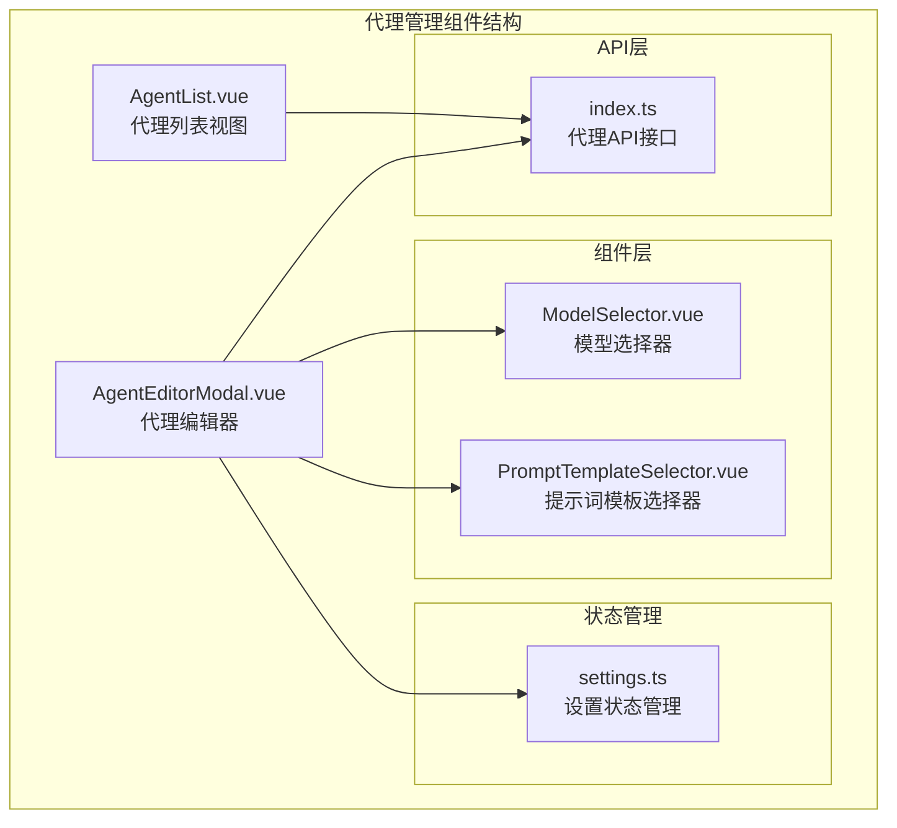
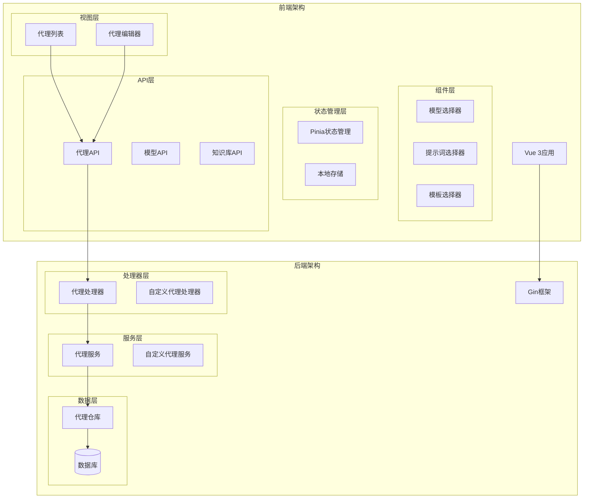
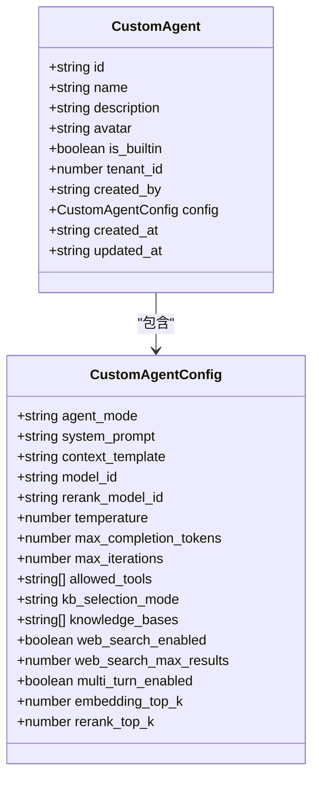
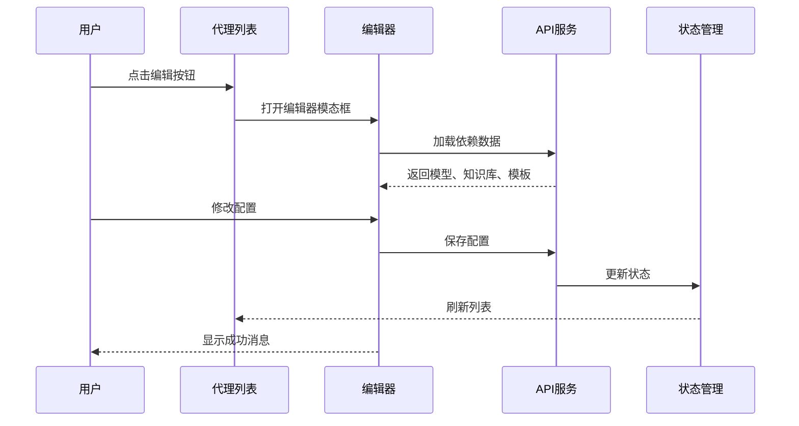
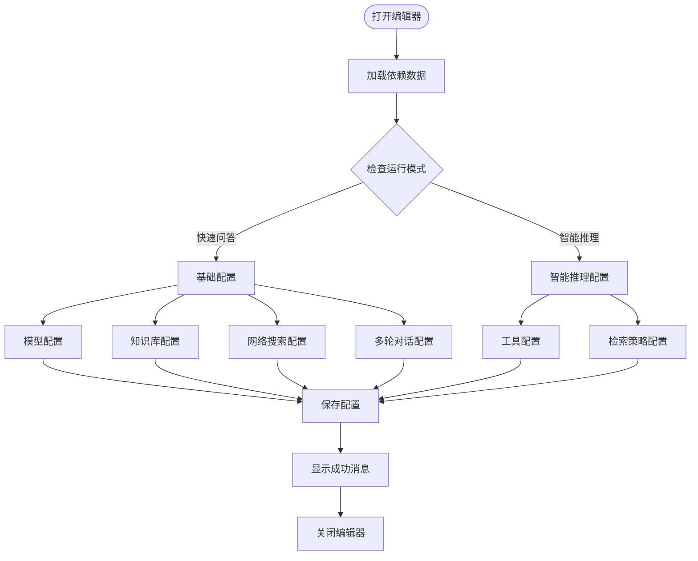
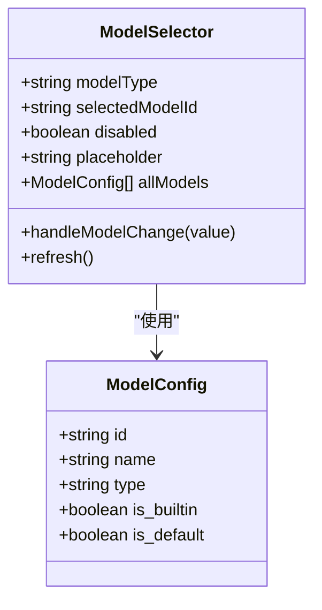
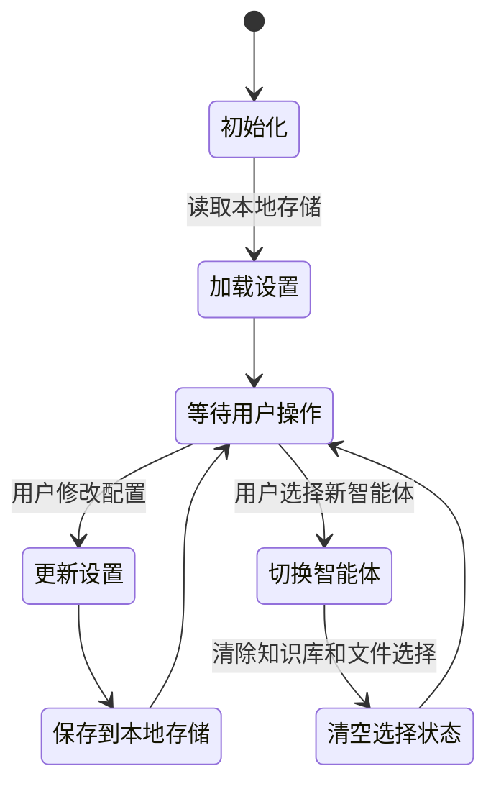
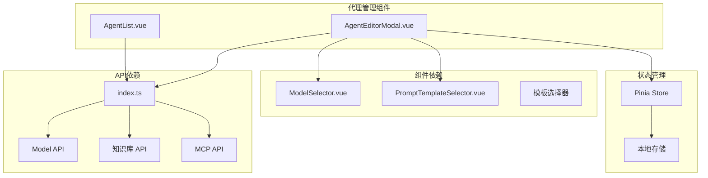
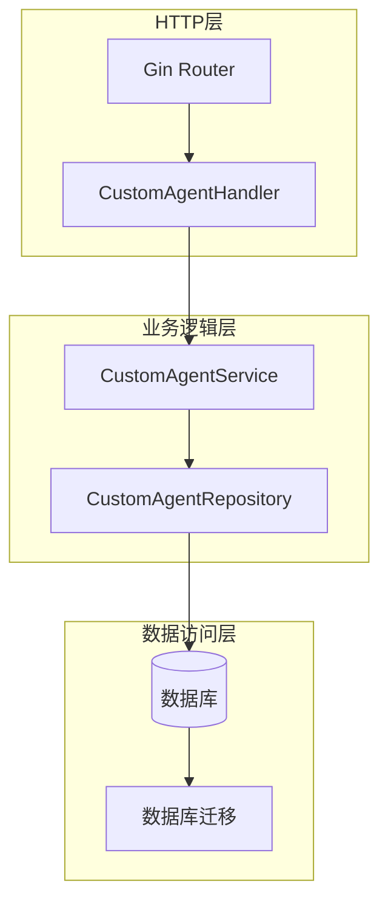

# 代理管理组件

<cite>
**本文档引用的文件**
- [AgentList.vue](file://frontend/src/views/agent/AgentList.vue)
- [AgentEditorModal.vue](file://frontend/src/views/agent/AgentEditorModal.vue)
- [index.ts](file://frontend/src/api/agent/index.ts)
- [ModelSelector.vue](file://frontend/src/components/ModelSelector.vue)
- [PromptTemplateSelector.vue](file://frontend/src/components/PromptTemplateSelector.vue)
- [settings.ts](file://frontend/src/stores/settings.ts)
- [router.go](file://internal/router/router.go)
- [custom_agent.go](file://internal/handler/custom_agent.go)
- [placeholder.go](file://internal/types/placeholder.go)
- [context_template.yaml](file://config/prompt_templates/context_template.yaml)
</cite>

## 目录
1. [简介](#简介)
2. [项目结构](#项目结构)
3. [核心组件](#核心组件)
4. [架构概览](#架构概览)
5. [详细组件分析](#详细组件分析)
6. [依赖关系分析](#依赖关系分析)
7. [性能考虑](#性能考虑)
8. [故障排除指南](#故障排除指南)
9. [结论](#结论)

## 简介

WiseDx前端代理管理组件是一个完整的智能体管理系统，提供了智能体的创建、编辑、管理和配置功能。该组件支持两种运行模式：快速问答模式（RAG模式）和智能推理模式（ReAct Agent模式），并集成了知识库、工具配置、网络搜索等多种功能。

该系统采用现代化的Vue 3 + TypeScript技术栈构建，具有良好的用户体验和强大的功能扩展性。组件设计遵循模块化原则，每个功能模块都有清晰的职责划分和接口定义。

## 项目结构

前端代理管理组件主要位于`frontend/src/views/agent/`目录下，包含以下核心文件：

**图表来源**
- [AgentList.vue](file://frontend/src/views/agent/AgentList.vue#L1-L895)
- [AgentEditorModal.vue](file://frontend/src/views/agent/AgentEditorModal.vue#L1-L3278)
- [index.ts](file://frontend/src/api/agent/index.ts#L1-L168)

**章节来源**
- [AgentList.vue](file://frontend/src/views/agent/AgentList.vue#L1-L895)
- [AgentEditorModal.vue](file://frontend/src/views/agent/AgentEditorModal.vue#L1-L3278)

## 核心组件

### 代理列表组件 (AgentList)

代理列表组件负责展示所有可用的智能体，包括内置智能体和自定义智能体。该组件提供了完整的CRUD操作功能：

- **列表展示**：网格布局显示智能体卡片，支持响应式设计
- **编辑功能**：点击卡片或使用更多菜单进行编辑
- **删除功能**：安全删除机制，包含确认对话框
- **复制功能**：一键复制现有智能体配置
- **状态管理**：实时显示智能体状态和更新时间

### 代理编辑器 (AgentEditorModal)

代理编辑器是一个功能丰富的模态对话框，支持智能体的完整配置：

- **多页配置**：基础信息、模型配置、知识库、工具、检索策略、网络搜索、多轮对话等
- **智能体模式**：支持快速问答和智能推理两种运行模式
- **占位符系统**：动态提示词和模板系统
- **实时验证**：配置变更时的实时验证和提示

**章节来源**
- [AgentList.vue](file://frontend/src/views/agent/AgentList.vue#L1-L895)
- [AgentEditorModal.vue](file://frontend/src/views/agent/AgentEditorModal.vue#L1-L3278)

## 架构概览

系统采用前后端分离架构，前端使用Vue 3 + TypeScript，后端使用Go语言构建RESTful API。

**图表来源**
- [router.go](file://internal/router/router.go#L422-L441)
- [custom_agent.go](file://internal/handler/custom_agent.go#L347-L371)

## 详细组件分析

### 代理列表组件详细分析

代理列表组件实现了完整的智能体管理界面，具有以下特性：

#### 数据结构设计

**图表来源**
- [index.ts](file://frontend/src/api/agent/index.ts#L4-L79)

#### 交互流程

**图表来源**
- [AgentList.vue](file://frontend/src/views/agent/AgentList.vue#L201-L312)
- [AgentEditorModal.vue](file://frontend/src/views/agent/AgentEditorModal.vue#L1526-L1618)

#### CRUD操作实现

代理列表组件支持完整的CRUD操作：

| 操作类型 | 方法名 | 功能描述 | 状态反馈 |
|---------|--------|----------|----------|
| 列表获取 | `fetchList()` | 获取智能体列表 | 加载状态指示器 |
| 创建 | `openCreateModal()` | 打开创建模态框 | 成功/失败消息 |
| 编辑 | `handleEdit()` | 打开编辑模态框 | 成功/失败消息 |
| 删除 | `confirmDelete()` | 确认并执行删除 | 成功/失败消息 |
| 复制 | `handleCopy()` | 复制智能体配置 | 成功/失败消息 |

**章节来源**
- [AgentList.vue](file://frontend/src/views/agent/AgentList.vue#L174-L329)

### 代理编辑器组件详细分析

代理编辑器是一个复杂的配置界面，支持多种配置选项：

#### 配置页面结构

**图表来源**
- [AgentEditorModal.vue](file://frontend/src/views/agent/AgentEditorModal.vue#L1159-L1181)

#### 模型配置管理

模型选择器组件提供了灵活的模型管理功能：

**图表来源**
- [ModelSelector.vue](file://frontend/src/components/ModelSelector.vue#L42-L169)

#### 占位符系统

系统实现了完整的占位符系统，支持动态提示词生成：

| 占位符类型 | 用途 | 示例 | 描述 |
|-----------|------|------|------|
| `{{contexts}}` | 检索到的上下文内容 | 医疗记录、诊断报告 | 知识库检索结果 |
| `{{query}}` | 用户原始问题 | "患者出现什么症状？" | 用户输入的问题 |
| `{{knowledge_bases}}` | 可用知识库列表 | "内科、外科、儿科" | 知识库信息 |
| `{{current_time}}` | 当前系统时间 | "2024-01-15 14:30:00" | 时间戳信息 |
| `{{conversation}}` | 历史对话内容 | "医生：你好，有什么症状？" | 多轮对话历史 |

**章节来源**
- [AgentEditorModal.vue](file://frontend/src/views/agent/AgentEditorModal.vue#L1085-L1118)
- [placeholder.go](file://internal/types/placeholder.go#L40-L82)

### 状态管理分析

系统使用Pinia进行状态管理，提供了全局状态共享和持久化存储：

**图表来源**
- [settings.ts](file://frontend/src/stores/settings.ts#L94-L342)

**章节来源**
- [settings.ts](file://frontend/src/stores/settings.ts#L1-L342)

## 依赖关系分析

### 前端依赖关系

**图表来源**
- [AgentList.vue](file://frontend/src/views/agent/AgentList.vue#L178-L182)
- [AgentEditorModal.vue](file://frontend/src/views/agent/AgentEditorModal.vue#L975-L983)

### 后端依赖关系

后端服务层采用了清晰的分层架构：

**图表来源**
- [router.go](file://internal/router/router.go#L422-L441)
- [custom_agent.go](file://internal/handler/custom_agent.go#L347-L371)

**章节来源**
- [router.go](file://internal/router/router.go#L422-L441)
- [custom_agent.go](file://internal/handler/custom_agent.go#L347-L371)

## 性能考虑

### 前端性能优化

1. **懒加载策略**：编辑器组件采用延迟加载，只在需要时加载依赖数据
2. **虚拟滚动**：列表组件支持大数据量的虚拟滚动渲染
3. **缓存机制**：常用配置和模板数据进行本地缓存
4. **防抖处理**：输入验证和占位符提示采用防抖优化

### 后端性能优化

1. **数据库索引**：为常用查询字段建立适当的数据库索引
2. **连接池管理**：合理配置数据库连接池参数
3. **缓存策略**：热点数据采用Redis缓存
4. **异步处理**：耗时操作采用异步队列处理

## 故障排除指南

### 常见问题及解决方案

#### 代理配置问题

| 问题描述 | 可能原因 | 解决方案 |
|----------|----------|----------|
| 代理保存失败 | 必填字段缺失 | 检查系统提示词和模型配置 |
| 知识库不可用 | 知识库权限配置错误 | 检查知识库选择模式和权限设置 |
| 工具调用失败 | MCP服务配置错误 | 验证MCP服务连接状态 |
| 模型加载失败 | 模型配置无效 | 检查模型ID和API密钥 |

#### 用户界面问题

| 问题描述 | 可能原因 | 解决方案 |
|----------|----------|----------|
| 编辑器无法打开 | 网络请求超时 | 检查API服务状态 |
| 占位符提示不显示 | 光标位置检测错误 | 重新聚焦文本框 |
| 模板选择器无响应 | DOM事件绑定问题 | 刷新页面或清除浏览器缓存 |

**章节来源**
- [AgentEditorModal.vue](file://frontend/src/views/agent/AgentEditorModal.vue#L2377-L2487)

### 调试技巧

1. **开发者工具**：使用浏览器开发者工具监控网络请求
2. **日志分析**：查看控制台错误信息和警告
3. **状态检查**：通过Vue DevTools检查组件状态
4. **API测试**：使用Postman测试后端API接口

## 结论

WiseDx前端代理管理组件是一个功能完整、架构清晰的智能体管理系统。该组件具有以下优势：

1. **功能完整性**：支持智能体的完整生命周期管理
2. **用户体验优秀**：直观的界面设计和流畅的交互体验
3. **扩展性强**：模块化设计便于功能扩展和定制
4. **技术先进**：采用现代前端技术和最佳实践

该组件为WiseDx平台提供了强大的智能体管理能力，支持医疗诊断、知识问答等多种应用场景。通过合理的架构设计和完善的错误处理机制，确保了系统的稳定性和可靠性。

未来可以考虑的功能改进包括：
- 增加智能体配置模板功能
- 优化大模型配置的用户体验
- 添加智能体性能监控和分析功能
- 实现智能体配置的版本管理和回滚功能