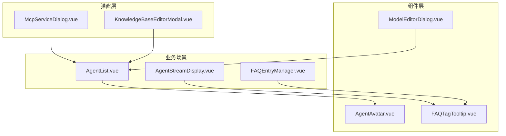
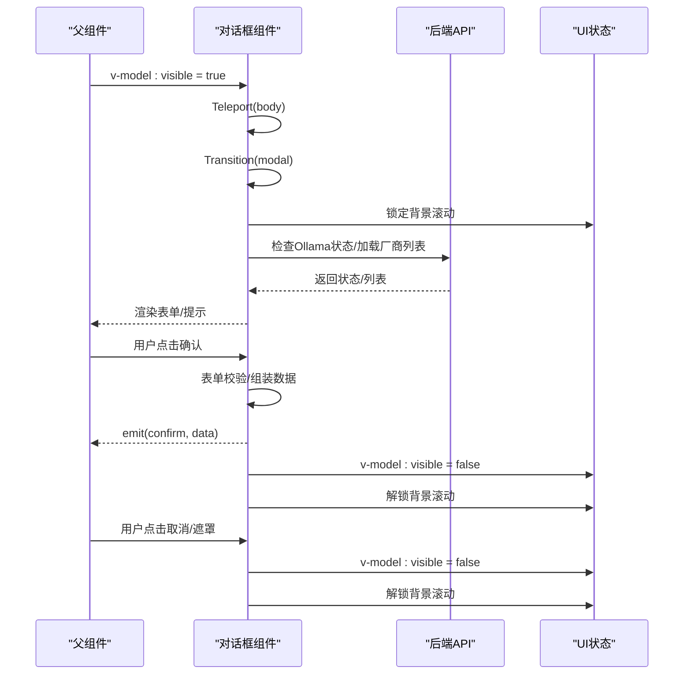
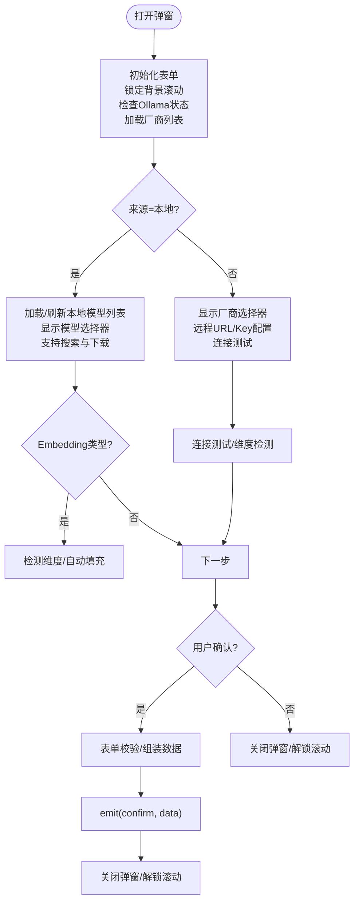
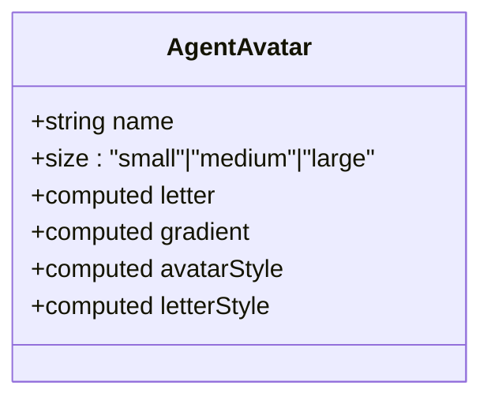
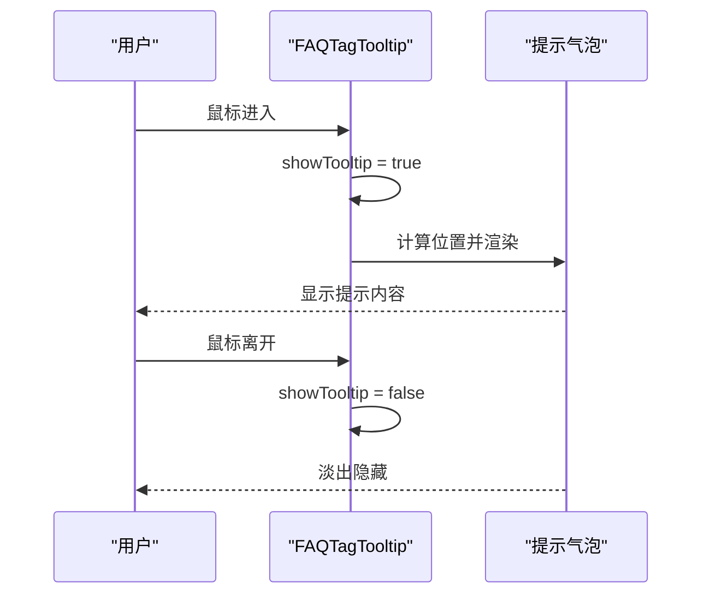
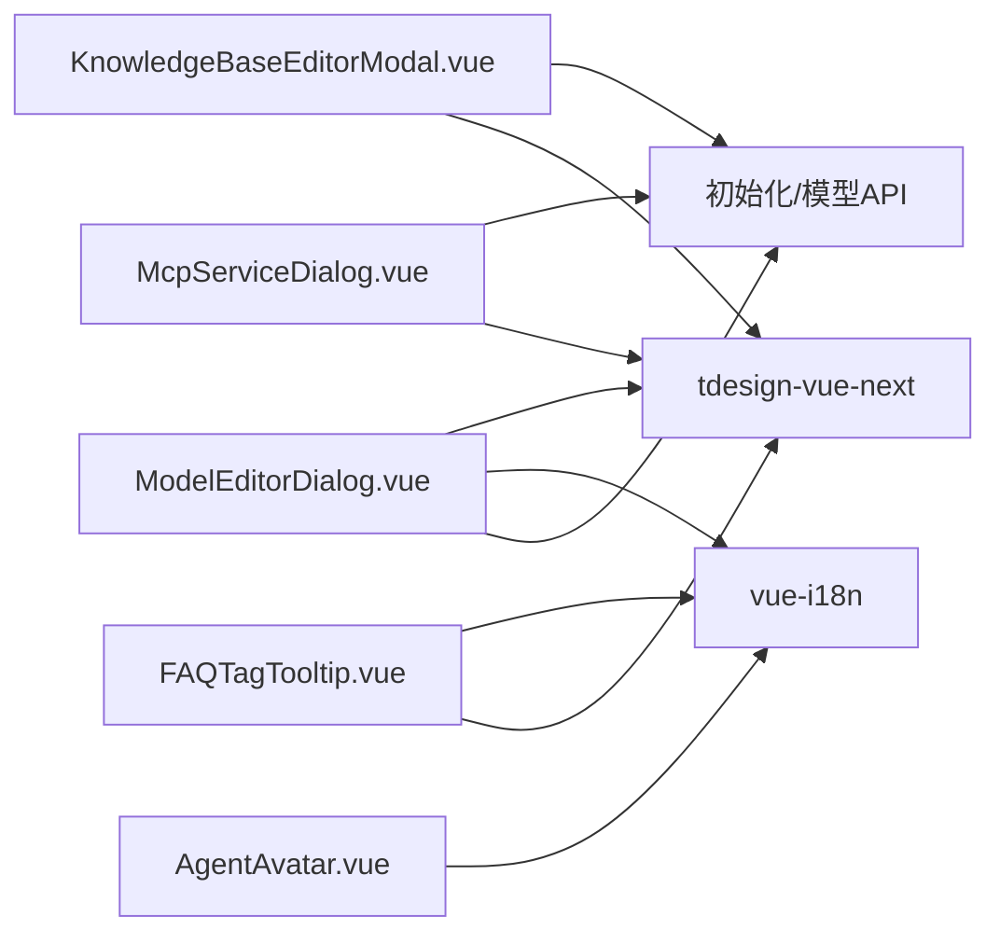

# 对话框组件

<cite>
**本文档引用的文件**
- [ModelEditorDialog.vue](file://frontend/src/components/ModelEditorDialog.vue)
- [AgentAvatar.vue](file://frontend/src/components/AgentAvatar.vue)
- [FAQTagTooltip.vue](file://frontend/src/components/FAQTagTooltip.vue)
- [McpServiceDialog.vue](file://frontend/src/views/settings/components/McpServiceDialog.vue)
- [KnowledgeBaseEditorModal.vue](file://frontend/src/views/knowledge/KnowledgeBaseEditorModal.vue)
- [AgentStreamDisplay.vue](file://frontend/src/views/chat/components/AgentStreamDisplay.vue)
- [AgentList.vue](file://frontend/src/views/agent/AgentList.vue)
- [FAQEntryManager.vue](file://frontend/src/views/knowledge/components/FAQEntryManager.vue)
</cite>

## 目录
1. [简介](#简介)
2. [项目结构](#项目结构)
3. [核心组件](#核心组件)
4. [架构总览](#架构总览)
5. [组件详细分析](#组件详细分析)
6. [依赖关系分析](#依赖关系分析)
7. [性能考虑](#性能考虑)
8. [故障排查指南](#故障排查指南)
9. [结论](#结论)
10. [附录](#附录)

## 简介
本文件聚焦 WiseDx 前端的对话框与弹出组件，系统性梳理以下能力：
- 模型编辑器对话框：支持本地 Ollama 与远程模型配置、厂商选择、连接测试、维度检测与下载流程。
- 代理头像组件：基于名称生成稳定渐变色头像，适配不同尺寸与装饰效果。
- FAQ 标签提示：悬浮提示，支持多种类型与方位，具备边界检测与自适应定位。

同时，文档覆盖组件的打开/关闭机制、数据传递、确认/取消流程、布局设计、动画效果、键盘交互以及可配置项与自定义方案，帮助开发者快速理解与扩展。

## 项目结构
围绕对话框与弹出组件的相关文件组织如下：
- 组件层：ModelEditorDialog.vue、AgentAvatar.vue、FAQTagTooltip.vue
- 设置与知识库相关弹窗：McpServiceDialog.vue、KnowledgeBaseEditorModal.vue
- 业务使用场景：AgentList.vue、AgentStreamDisplay.vue、FAQEntryManager.vue

**图表来源**
- [ModelEditorDialog.vue](file://frontend/src/components/ModelEditorDialog.vue#L1-L120)
- [AgentAvatar.vue](file://frontend/src/components/AgentAvatar.vue#L1-L160)
- [FAQTagTooltip.vue](file://frontend/src/components/FAQTagTooltip.vue#L1-L132)
- [McpServiceDialog.vue](file://frontend/src/views/settings/components/McpServiceDialog.vue#L1-L98)
- [KnowledgeBaseEditorModal.vue](file://frontend/src/views/knowledge/KnowledgeBaseEditorModal.vue#L655-L703)
- [AgentList.vue](file://frontend/src/views/agent/AgentList.vue#L174-L214)
- [AgentStreamDisplay.vue](file://frontend/src/views/chat/components/AgentStreamDisplay.vue#L283-L395)
- [FAQEntryManager.vue](file://frontend/src/views/knowledge/components/FAQEntryManager.vue#L414-L500)

**章节来源**
- [ModelEditorDialog.vue](file://frontend/src/components/ModelEditorDialog.vue#L1-L120)
- [AgentAvatar.vue](file://frontend/src/components/AgentAvatar.vue#L1-L160)
- [FAQTagTooltip.vue](file://frontend/src/components/FAQTagTooltip.vue#L1-L132)
- [McpServiceDialog.vue](file://frontend/src/views/settings/components/McpServiceDialog.vue#L1-L98)
- [KnowledgeBaseEditorModal.vue](file://frontend/src/views/knowledge/KnowledgeBaseEditorModal.vue#L655-L703)
- [AgentList.vue](file://frontend/src/views/agent/AgentList.vue#L174-L214)
- [AgentStreamDisplay.vue](file://frontend/src/views/chat/components/AgentStreamDisplay.vue#L283-L395)
- [FAQEntryManager.vue](file://frontend/src/views/knowledge/components/FAQEntryManager.vue#L414-L500)

## 核心组件
- 模型编辑器对话框：提供本地/远程模型配置、厂商选择、连接测试、维度检测、下载进度展示与 Ollama 服务状态提示。
- 代理头像组件：根据名称生成稳定渐变色头像，支持小/中/大三种尺寸，带装饰星点。
- FAQ 标签提示：包裹任意标签，鼠标悬停显示提示，支持四种方位与三种类型，具备边界检测与自适应定位。

**章节来源**
- [ModelEditorDialog.vue](file://frontend/src/components/ModelEditorDialog.vue#L1-L120)
- [AgentAvatar.vue](file://frontend/src/components/AgentAvatar.vue#L1-L160)
- [FAQTagTooltip.vue](file://frontend/src/components/FAQTagTooltip.vue#L1-L132)

## 架构总览
对话框与弹出组件采用统一的“传送门 + 过渡动画”模式：
- Teleport 将组件挂载至 body，避免层级与滚动影响。
- Transition 控制进入/离开动画，提升交互体验。
- 组件通过 v-model 或计算属性与父组件进行双向绑定，实现打开/关闭与数据回传。

**图表来源**
- [ModelEditorDialog.vue](file://frontend/src/components/ModelEditorDialog.vue#L395-L460)
- [ModelEditorDialog.vue](file://frontend/src/components/ModelEditorDialog.vue#L819-L866)
- [ModelEditorDialog.vue](file://frontend/src/components/ModelEditorDialog.vue#L991-L994)

**章节来源**
- [ModelEditorDialog.vue](file://frontend/src/components/ModelEditorDialog.vue#L395-L460)
- [ModelEditorDialog.vue](file://frontend/src/components/ModelEditorDialog.vue#L819-L866)
- [ModelEditorDialog.vue](file://frontend/src/components/ModelEditorDialog.vue#L991-L994)

## 组件详细分析

### 模型编辑器对话框（ModelEditorDialog）
- 功能概览
  - 支持本地 Ollama 与远程模型配置，动态切换来源。
  - 厂商选择器（OpenAI、阿里云、智谱、OpenRouter、SiliconFlow、Jina、Generic），按模型类型过滤。
  - 远程模型连接测试（对话/Embedding/Rerank/VLLM），维度自动检测与提示。
  - 本地模型列表加载、刷新、搜索与下载进度轮询。
  - Ollama 服务状态检查与跳转设置页。
- 打开/关闭机制
  - 通过 visible 属性控制显示；监听 visible 变化时锁定/解锁背景滚动，检查 Ollama 状态与加载厂商列表；编辑模式下复制传入数据，新增模式重置表单。
- 数据传递
  - confirm 事件回传完整表单数据；外部负责持久化与后续处理。
- 确认/取消
  - 确认前进行必填与格式校验；提交后触发 confirm 并关闭弹窗；取消直接关闭。
- 布局与动画
  - 遮罩层 + 弹窗主体 + 顶部关闭按钮 + 标题/描述 + 垂直表单 + 底部确认/取消按钮；过渡名为 modal，缩放+透明度变化。
- 键盘交互
  - 未发现显式键盘快捷键绑定；建议在业务侧结合全局 ESC 关闭策略。
- 配置选项与自定义
  - 支持模型类型（chat/embedding/rerank/vllm）、来源（local/remote）、厂商、URL、API Key、维度等。
  - 可通过国际化键值扩展文案；可通过样式覆盖自定义外观。

**图表来源**
- [ModelEditorDialog.vue](file://frontend/src/components/ModelEditorDialog.vue#L539-L565)
- [ModelEditorDialog.vue](file://frontend/src/components/ModelEditorDialog.vue#L638-L660)
- [ModelEditorDialog.vue](file://frontend/src/components/ModelEditorDialog.vue#L733-L817)
- [ModelEditorDialog.vue](file://frontend/src/components/ModelEditorDialog.vue#L819-L866)
- [ModelEditorDialog.vue](file://frontend/src/components/ModelEditorDialog.vue#L991-L994)

**章节来源**
- [ModelEditorDialog.vue](file://frontend/src/components/ModelEditorDialog.vue#L1-L120)
- [ModelEditorDialog.vue](file://frontend/src/components/ModelEditorDialog.vue#L395-L460)
- [ModelEditorDialog.vue](file://frontend/src/components/ModelEditorDialog.vue#L539-L565)
- [ModelEditorDialog.vue](file://frontend/src/components/ModelEditorDialog.vue#L638-L660)
- [ModelEditorDialog.vue](file://frontend/src/components/ModelEditorDialog.vue#L733-L817)
- [ModelEditorDialog.vue](file://frontend/src/components/ModelEditorDialog.vue#L819-L866)
- [ModelEditorDialog.vue](file://frontend/src/components/ModelEditorDialog.vue#L991-L994)

### 代理头像组件（AgentAvatar）
- 功能概览
  - 根据名称生成稳定哈希，选择预设渐变色方案，渲染首字母头像。
  - 支持 small/medium/large 三种尺寸，小尺寸无装饰星点。
- 布局与样式
  - 圆角背景 + 渐变色 + 文字阴影增强层次感；尺寸变化时调整字体与圆角。
- 自定义方案
  - 可替换渐变色数组；可扩展尺寸枚举；可自定义首字母规则（如拼音首字母）。

**图表来源**
- [AgentAvatar.vue](file://frontend/src/components/AgentAvatar.vue#L18-L96)

**章节来源**
- [AgentAvatar.vue](file://frontend/src/components/AgentAvatar.vue#L1-L160)

### FAQ 标签提示（FAQTagTooltip）
- 功能概览
  - 包裹任意标签元素，鼠标悬停显示提示气泡；支持 top/bottom/left/right 四种方位与 answer/similar/negative 三种类型。
  - 自动计算位置并做边界检测，必要时切换到对侧显示。
- 交互细节
  - 监听 scroll/resize 事件更新位置；mouseenter 显示，mouseleave 隐藏。
- 布局与动画
  - Teleport 至 body 的固定定位；淡入淡出过渡；带箭头边框与阴影。
- 自定义方案
  - 可通过 type 与 placement 定制样式；可扩展内容渲染（富文本/链接等）。

**图表来源**
- [FAQTagTooltip.vue](file://frontend/src/components/FAQTagTooltip.vue#L104-L113)
- [FAQTagTooltip.vue](file://frontend/src/components/FAQTagTooltip.vue#L46-L102)

**章节来源**
- [FAQTagTooltip.vue](file://frontend/src/components/FAQTagTooltip.vue#L1-L132)
- [FAQTagTooltip.vue](file://frontend/src/components/FAQTagTooltip.vue#L134-L296)

### 其他弹窗组件参考
- MCP 服务对话框（McpServiceDialog）
  - 使用 t-dialog 组件，包含表单校验、认证与高级配置项，支持添加/编辑两种模式。
- 知识库编辑弹窗（KnowledgeBaseEditorModal）
  - 监听 visible 变化进行状态重置与模型列表加载；关闭时延时重置，保证动画结束后清理。

**章节来源**
- [McpServiceDialog.vue](file://frontend/src/views/settings/components/McpServiceDialog.vue#L1-L98)
- [KnowledgeBaseEditorModal.vue](file://frontend/src/views/knowledge/KnowledgeBaseEditorModal.vue#L655-L703)

## 依赖关系分析
- 组件耦合
  - ModelEditorDialog 与 API 层强耦合（Ollama 状态、模型列表、下载进度、远程连接测试）。
  - FAQTagTooltip 与业务标签组件弱耦合，通过插槽与 Teleport 实现解耦。
  - AgentAvatar 与业务卡片弱耦合，仅依赖名称与尺寸属性。
- 外部依赖
  - tdesign-vue-next 的表单、按钮、对话框、消息提示等组件。
  - vue-i18n 国际化键值。
- 潜在循环依赖
  - 组件间无直接循环导入；通过父组件驱动子组件状态，避免循环。

**图表来源**
- [ModelEditorDialog.vue](file://frontend/src/components/ModelEditorDialog.vue#L251-L256)
- [FAQTagTooltip.vue](file://frontend/src/components/FAQTagTooltip.vue#L25-L26)
- [AgentAvatar.vue](file://frontend/src/components/AgentAvatar.vue#L18-L26)
- [McpServiceDialog.vue](file://frontend/src/views/settings/components/McpServiceDialog.vue#L102-L110)
- [KnowledgeBaseEditorModal.vue](file://frontend/src/views/knowledge/KnowledgeBaseEditorModal.vue#L655-L703)

**章节来源**
- [ModelEditorDialog.vue](file://frontend/src/components/ModelEditorDialog.vue#L251-L256)
- [FAQTagTooltip.vue](file://frontend/src/components/FAQTagTooltip.vue#L25-L26)
- [AgentAvatar.vue](file://frontend/src/components/AgentAvatar.vue#L18-L26)
- [McpServiceDialog.vue](file://frontend/src/views/settings/components/McpServiceDialog.vue#L102-L110)
- [KnowledgeBaseEditorModal.vue](file://frontend/src/views/knowledge/KnowledgeBaseEditorModal.vue#L655-L703)

## 性能考虑
- 渲染优化
  - 使用 Teleport 避免 DOM 层级过深导致的重绘；Transition 控制动画范围，减少无关节点重排。
- 状态管理
  - 在 visible 变化时进行必要的 API 调用与状态重置，避免重复请求；下载进度轮询需在组件卸载时清理定时器。
- 交互体验
  - 表单校验与远程测试使用 loading 状态反馈；滚动条锁定避免背景抖动。
- 建议
  - 对频繁触发的 resize/scroll 事件可加节流；对长列表的本地模型选择建议虚拟滚动或分页加载。

[本节为通用指导，无需特定文件来源]

## 故障排查指南
- 模型编辑器常见问题
  - Ollama 不可用：检查服务状态与网络；点击“前往设置”跳转到设置页修复。
  - 远程连接失败：核对 URL/Key/厂商配置；查看测试结果提示。
  - 下载卡住：确认任务 ID 与进度轮询；异常时清理定时器并提示错误。
- FAQ 提示定位异常
  - 检查包裹元素的尺寸与定位；确认 Teleport 目标存在；边界检测失败时尝试调整 placement。
- 头像显示异常
  - 名称为空时显示占位符；尺寸不生效时检查类名拼接与样式作用域。

**章节来源**
- [ModelEditorDialog.vue](file://frontend/src/components/ModelEditorDialog.vue#L504-L518)
- [ModelEditorDialog.vue](file://frontend/src/components/ModelEditorDialog.vue#L733-L817)
- [ModelEditorDialog.vue](file://frontend/src/components/ModelEditorDialog.vue#L895-L952)
- [FAQTagTooltip.vue](file://frontend/src/components/FAQTagTooltip.vue#L46-L102)
- [AgentAvatar.vue](file://frontend/src/components/AgentAvatar.vue#L60-L74)

## 结论
本文档系统梳理了 WiseDx 前端的对话框与弹出组件，重点覆盖模型编辑器对话框、代理头像与 FAQ 标签提示的实现细节与使用方式。通过统一的 Teleport + Transition 架构、清晰的打开/关闭与数据回传机制、完善的校验与提示体系，这些组件在复杂业务场景中提供了稳定可靠的用户体验。建议在扩展时遵循现有模式，保持组件职责单一与状态可控。

[本节为总结性内容，无需特定文件来源]

## 附录
- 使用场景示例
  - 代理卡片中展示头像：在 AgentList 中引入 AgentAvatar。
  - FAQ 编辑器中悬浮提示：在 FAQEntryManager 中包裹 t-tag。
  - 模型配置与知识库编辑：在各业务页面通过 v-model 控制弹窗显示。

**章节来源**
- [AgentList.vue](file://frontend/src/views/agent/AgentList.vue#L174-L214)
- [FAQEntryManager.vue](file://frontend/src/views/knowledge/components/FAQEntryManager.vue#L414-L500)
- [KnowledgeBaseEditorModal.vue](file://frontend/src/views/knowledge/KnowledgeBaseEditorModal.vue#L655-L703)