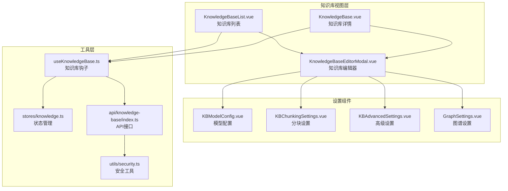
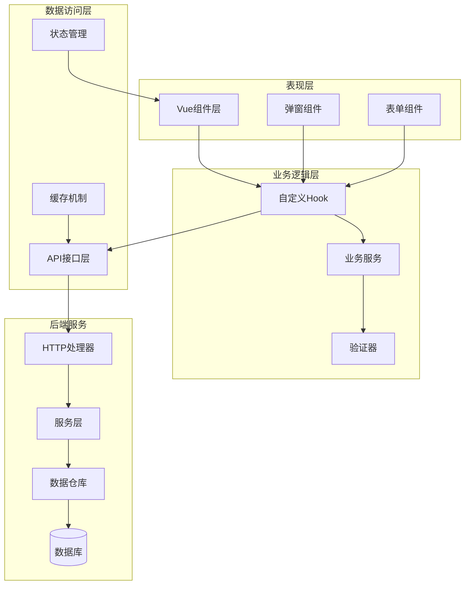
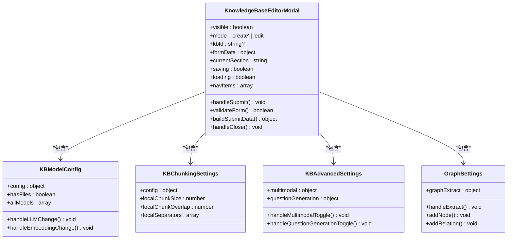
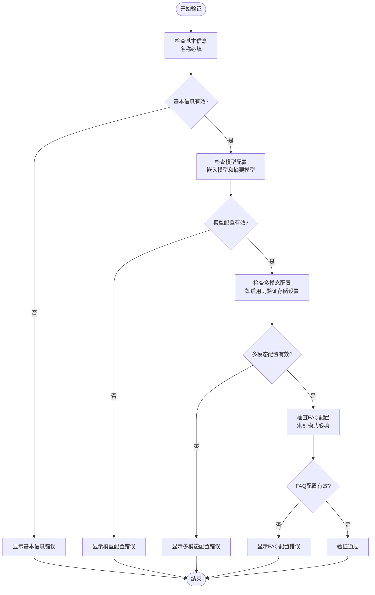
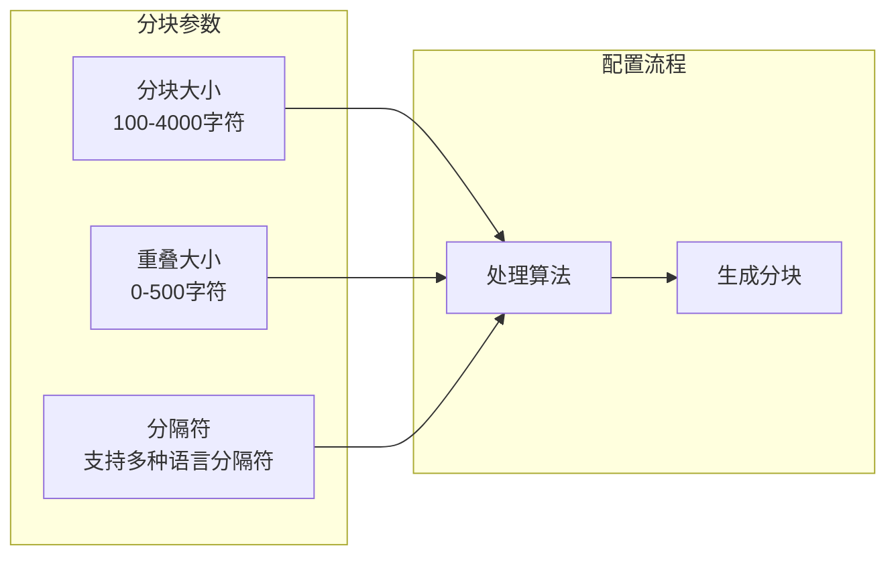
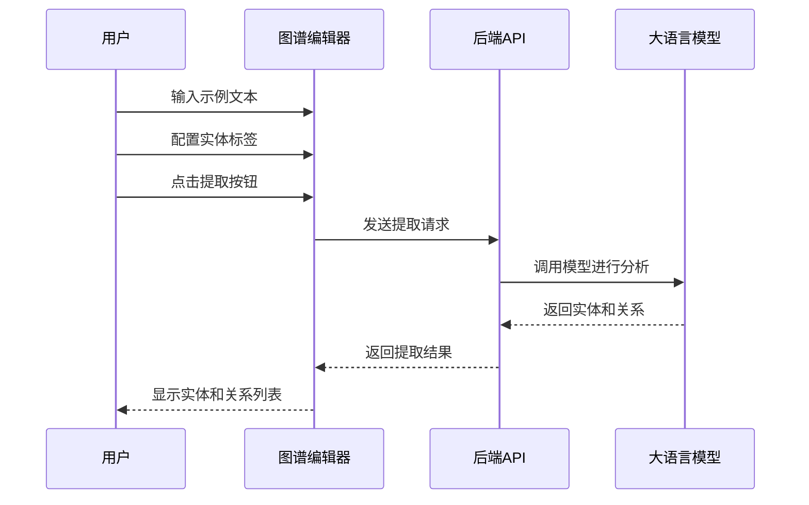
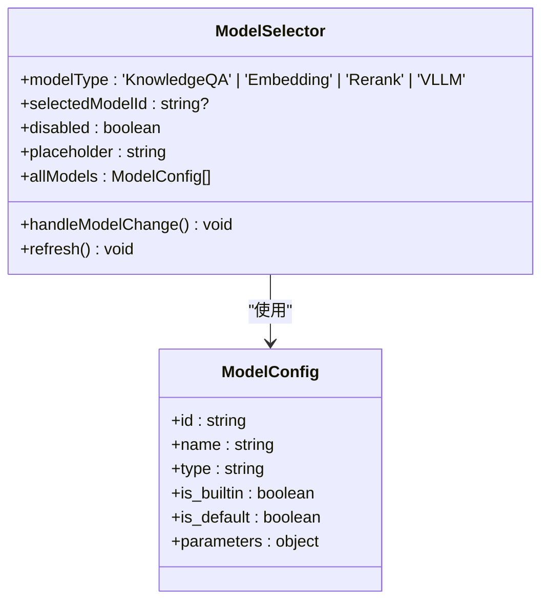
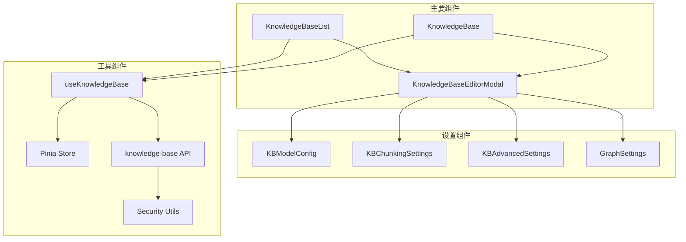
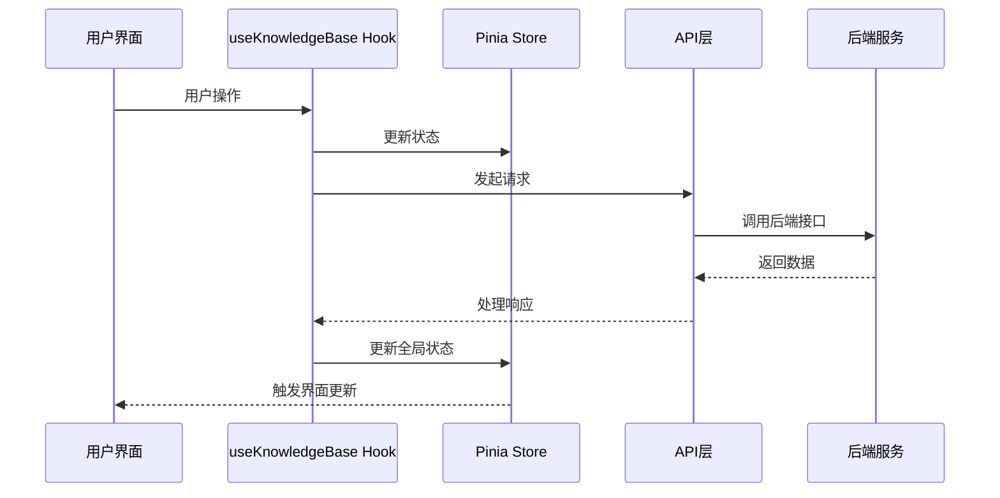

# 知识库管理组件

<cite>
**本文档引用的文件**
- [KnowledgeBase.vue](file://frontend/src/views/knowledge/KnowledgeBase.vue)
- [KnowledgeBaseEditorModal.vue](file://frontend/src/views/knowledge/KnowledgeBaseEditorModal.vue)
- [KnowledgeBaseList.vue](file://frontend/src/views/knowledge/KnowledgeBaseList.vue)
- [KBAdvancedSettings.vue](file://frontend/src/views/knowledge/settings/KBAdvancedSettings.vue)
- [KBChunkingSettings.vue](file://frontend/src/views/knowledge/settings/KBChunkingSettings.vue)
- [KBModelConfig.vue](file://frontend/src/views/knowledge/settings/KBModelConfig.vue)
- [GraphSettings.vue](file://frontend/src/views/knowledge/settings/GraphSettings.vue)
- [useKnowledgeBase.ts](file://frontend/src/hooks/useKnowledgeBase.ts)
- [knowledge.ts](file://frontend/src/stores/knowledge.ts)
- [index.ts](file://frontend/src/api/knowledge-base/index.ts)
- [security.ts](file://frontend/src/utils/security.ts)
- [ModelSelector.vue](file://frontend/src/components/ModelSelector.vue)
- [ui.ts](file://frontend/src/stores/ui.ts)
</cite>

## 目录
1. [简介](#简介)
2. [项目结构](#项目结构)
3. [核心组件](#核心组件)
4. [架构概览](#架构概览)
5. [详细组件分析](#详细组件分析)
6. [依赖关系分析](#依赖关系分析)
7. [性能考虑](#性能考虑)
8. [故障排除指南](#故障排除指南)
9. [结论](#结论)
10. [附录](#附录)

## 简介

WiseDx前端知识库管理组件是一个完整的知识库管理系统，提供了知识库列表管理、知识库编辑器、高级设置、分块设置等功能。该组件支持文档型知识库和FAQ型知识库两种类型，具备完善的CRUD操作、配置管理和权限控制功能。

系统采用Vue 3 + TypeScript技术栈，结合Pinia状态管理，实现了响应式的用户界面和高效的数据处理能力。组件支持多租户权限控制、文件上传管理、批量操作、实时状态更新等高级功能。

## 项目结构

前端知识库管理组件主要位于`frontend/src/views/knowledge/`目录下，包含以下核心文件：

**图表来源**
- [KnowledgeBaseList.vue](file://frontend/src/views/knowledge/KnowledgeBaseList.vue#L1-L1218)
- [KnowledgeBase.vue](file://frontend/src/views/knowledge/KnowledgeBase.vue#L1-L2530)
- [KnowledgeBaseEditorModal.vue](file://frontend/src/views/knowledge/KnowledgeBaseEditorModal.vue#L1-L982)

**章节来源**
- [KnowledgeBase.vue](file://frontend/src/views/knowledge/KnowledgeBase.vue#L1-L800)
- [KnowledgeBaseList.vue](file://frontend/src/views/knowledge/KnowledgeBaseList.vue#L1-L800)

## 核心组件

### 知识库列表组件 (KnowledgeBaseList.vue)

知识库列表组件提供知识库的集中管理界面，支持以下核心功能：

- **知识库卡片展示**：以卡片形式展示所有知识库，包括类型标识、描述、更新时间等信息
- **状态指示**：通过徽章显示知识库的处理状态、功能特性（知识图谱、多模态、问题生成等）
- **操作菜单**：每个知识库卡片右侧提供更多操作菜单，支持设置和删除操作
- **上传进度监控**：实时显示文件上传进度和状态
- **未初始化提醒**：当知识库未配置必要模型时显示警告提示

### 知识库详情组件 (KnowledgeBase.vue)

知识库详情组件负责单个知识库的详细管理，具备以下功能：

- **文件列表管理**：展示知识库内的所有文件，支持分页加载和搜索过滤
- **标签系统**：实现文件分类管理，支持标签的创建、编辑、删除和批量操作
- **文件上传**：支持多种文件格式的批量上传，包括PDF、DOCX、TXT、MD等
- **URL导入**：支持从网页URL直接导入内容
- **手动创建**：提供手动创建知识条目的功能
- **状态轮询**：自动轮询文件处理状态，实时更新UI

### 知识库编辑器 (KnowledgeBaseEditorModal.vue)

统一的知识库创建和编辑弹窗，支持完整的配置流程：

- **多步骤向导**：基础信息 → 模型配置 → 高级设置 → 分块设置 → 图谱设置
- **类型区分**：根据知识库类型动态显示不同的配置选项
- **实时验证**：表单字段的实时验证和错误提示
- **配置同步**：与后端API的双向数据同步

**章节来源**
- [KnowledgeBaseList.vue](file://frontend/src/views/knowledge/KnowledgeBaseList.vue#L1-L800)
- [KnowledgeBase.vue](file://frontend/src/views/knowledge/KnowledgeBase.vue#L1-L800)
- [KnowledgeBaseEditorModal.vue](file://frontend/src/views/knowledge/KnowledgeBaseEditorModal.vue#L1-L800)

## 架构概览

系统采用分层架构设计，确保各组件职责清晰、耦合度低：

**图表来源**
- [useKnowledgeBase.ts](file://frontend/src/hooks/useKnowledgeBase.ts#L1-L199)
- [knowledge.ts](file://frontend/src/stores/knowledge.ts#L1-L12)
- [index.ts](file://frontend/src/api/knowledge-base/index.ts#L1-L275)

**章节来源**
- [useKnowledgeBase.ts](file://frontend/src/hooks/useKnowledgeBase.ts#L1-L199)
- [knowledge.ts](file://frontend/src/stores/knowledge.ts#L1-L12)

## 详细组件分析

### 知识库编辑器组件

知识库编辑器是整个知识库管理的核心组件，采用模块化设计：

#### 组件结构

**图表来源**
- [KnowledgeBaseEditorModal.vue](file://frontend/src/views/knowledge/KnowledgeBaseEditorModal.vue#L172-L703)
- [KBModelConfig.vue](file://frontend/src/views/knowledge/settings/KBModelConfig.vue#L58-L112)
- [KBChunkingSettings.vue](file://frontend/src/views/knowledge/settings/KBChunkingSettings.vue#L76-L143)
- [KBAdvancedSettings.vue](file://frontend/src/views/knowledge/settings/KBAdvancedSettings.vue#L286-L461)
- [GraphSettings.vue](file://frontend/src/views/knowledge/settings/GraphSettings.vue#L295-L594)

#### 配置验证流程

**图表来源**
- [KnowledgeBaseEditorModal.vue](file://frontend/src/views/knowledge/KnowledgeBaseEditorModal.vue#L432-L472)

**章节来源**
- [KnowledgeBaseEditorModal.vue](file://frontend/src/views/knowledge/KnowledgeBaseEditorModal.vue#L1-L800)

### 高级设置组件

高级设置组件提供复杂的功能配置选项：

#### 多模态配置

多模态功能支持图像、文档等多种媒体类型的处理：

- **存储类型选择**：支持MinIO和COS两种对象存储
- **模型选择**：集成VLLM模型进行多模态处理
- **配置验证**：实时验证存储配置的有效性
- **状态监控**：显示系统中MinIO的启用状态

#### 问题生成配置

自动为知识内容生成相关问题的能力：

- **开关控制**：启用/禁用问题生成功能
- **数量设置**：配置生成问题的数量范围
- **智能生成**：基于内容自动生成相关问题

**章节来源**
- [KBAdvancedSettings.vue](file://frontend/src/views/knowledge/settings/KBAdvancedSettings.vue#L1-L650)

### 分块设置组件

分块设置组件专门处理文档分割策略：

#### 分块参数配置

**图表来源**
- [KBChunkingSettings.vue](file://frontend/src/views/knowledge/settings/KBChunkingSettings.vue#L101-L142)

#### 分隔符支持

系统支持多种语言和格式的分隔符：

- **中文标点**：句号、感叹号、问号、分号
- **英文标点**：换行符、分号、空格
- **自定义分隔符**：支持用户自定义分隔符

**章节来源**
- [KBChunkingSettings.vue](file://frontend/src/views/knowledge/settings/KBChunkingSettings.vue#L1-L232)

### 图谱设置组件

图谱设置组件提供知识图谱的配置和管理功能：

#### 实体关系提取

**图表来源**
- [GraphSettings.vue](file://frontend/src/views/knowledge/settings/GraphSettings.vue#L486-L515)

#### 实体管理

- **实体列表**：动态管理提取的实体
- **属性配置**：为实体添加属性和特征
- **关系建立**：建立实体间的关联关系
- **批量操作**：支持实体和关系的批量管理

**章节来源**
- [GraphSettings.vue](file://frontend/src/views/knowledge/settings/GraphSettings.vue#L1-L791)

### 模型配置组件

模型配置组件提供统一的模型选择和管理界面：

#### 模型选择器

**图表来源**
- [ModelSelector.vue](file://frontend/src/components/ModelSelector.vue#L42-L133)

#### 模型状态管理

- **类型过滤**：根据模型类型自动筛选可用模型
- **状态显示**：显示内置模型和默认模型标识
- **实时刷新**：支持手动刷新模型列表
- **添加模型**：提供便捷的模型添加入口

**章节来源**
- [KBModelConfig.vue](file://frontend/src/views/knowledge/settings/KBModelConfig.vue#L1-L190)
- [ModelSelector.vue](file://frontend/src/components/ModelSelector.vue#L1-L169)

## 依赖关系分析

### 组件间依赖

**图表来源**
- [KnowledgeBaseList.vue](file://frontend/src/views/knowledge/KnowledgeBaseList.vue#L180-L189)
- [KnowledgeBase.vue](file://frontend/src/views/knowledge/KnowledgeBase.vue#L11-L40)
- [KnowledgeBaseEditorModal.vue](file://frontend/src/views/knowledge/KnowledgeBaseEditorModal.vue#L179-L182)

### 数据流分析

**图表来源**
- [useKnowledgeBase.ts](file://frontend/src/hooks/useKnowledgeBase.ts#L31-L65)
- [knowledge.ts](file://frontend/src/stores/knowledge.ts#L5-L11)

**章节来源**
- [useKnowledgeBase.ts](file://frontend/src/hooks/useKnowledgeBase.ts#L1-L199)
- [index.ts](file://frontend/src/api/knowledge-base/index.ts#L1-L275)

## 性能考虑

### 前端性能优化

1. **虚拟滚动**：知识库文件列表采用虚拟滚动技术，支持大量数据的高效渲染
2. **懒加载**：设置组件按需加载，减少初始加载时间
3. **状态缓存**：Pinia状态管理提供高效的响应式状态更新
4. **防抖处理**：搜索和过滤操作使用防抖机制，避免频繁请求

### 后端性能优化

1. **分页查询**：所有列表查询都支持分页，避免一次性加载大量数据
2. **批量操作**：支持批量标签更新和批量删除操作
3. **状态轮询**：采用定时轮询机制，避免长连接占用资源
4. **文件上传**：支持断点续传和进度跟踪

### 缓存策略

- **模型列表缓存**：模型配置信息缓存30分钟
- **知识库状态缓存**：知识库基本信息缓存10秒
- **文件列表缓存**：文件列表缓存5秒，支持手动刷新

## 故障排除指南

### 常见问题及解决方案

#### 知识库创建失败

**问题现象**：创建知识库时出现错误提示

**可能原因**：
1. 模型配置缺失
2. 网络连接异常
3. 权限不足

**解决步骤**：
1. 检查模型配置是否完整
2. 确认网络连接正常
3. 验证用户权限

#### 文件上传失败

**问题现象**：文件上传过程中断或失败

**可能原因**：
1. 文件格式不支持
2. 文件大小超限
3. 存储空间不足

**解决步骤**：
1. 检查文件格式是否在支持列表内
2. 确认文件大小符合要求
3. 验证存储配置正确性

#### 知识库编辑器无法打开

**问题现象**：点击设置按钮无响应

**可能原因**：
1. 弹窗组件冲突
2. 状态管理异常
3. 权限问题

**解决步骤**：
1. 检查弹窗组件状态
2. 重置UI状态管理
3. 验证用户权限

**章节来源**
- [KnowledgeBaseEditorModal.vue](file://frontend/src/views/knowledge/KnowledgeBaseEditorModal.vue#L638-L644)
- [KnowledgeBase.vue](file://frontend/src/views/knowledge/KnowledgeBase.vue#L672-L760)

## 结论

WiseDx前端知识库管理组件是一个功能完整、架构清晰的知识库管理系统。组件设计充分考虑了用户体验和性能优化，提供了丰富的配置选项和灵活的操作方式。

系统的主要优势包括：
- **模块化设计**：各组件职责明确，易于维护和扩展
- **响应式架构**：Vue 3 + TypeScript提供良好的开发体验
- **完善的安全机制**：包含XSS防护和输入验证
- **强大的配置能力**：支持复杂的知识库配置和管理

建议在实际使用中重点关注配置验证、性能优化和安全性方面的问题，确保系统的稳定运行。

## 附录

### API接口规范

系统提供完整的RESTful API接口，支持知识库的完整生命周期管理：

- **知识库管理**：列表查询、创建、更新、删除
- **文件管理**：文件上传、下载、删除、批量操作
- **标签管理**：标签创建、更新、删除、批量更新
- **配置管理**：模型配置、分块配置、高级配置

### 安全最佳实践

1. **输入验证**：所有用户输入都经过严格验证和清理
2. **权限控制**：基于租户的权限控制机制
3. **XSS防护**：使用DOMPurify进行HTML内容清理
4. **文件安全**：文件类型验证和恶意文件检测

### 扩展指南

系统设计支持功能扩展，可以通过以下方式添加新功能：
1. 新增Vue组件并注册到路由
2. 扩展API接口定义
3. 添加新的配置选项
4. 实现相应的业务逻辑