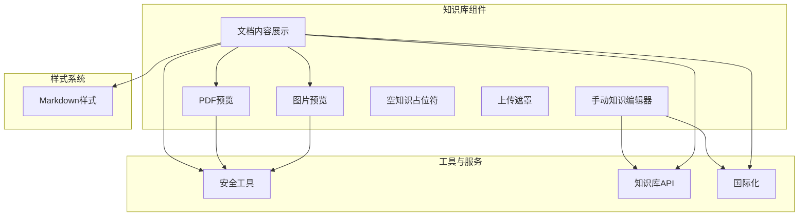
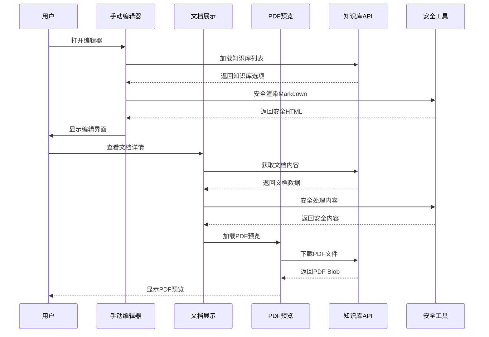
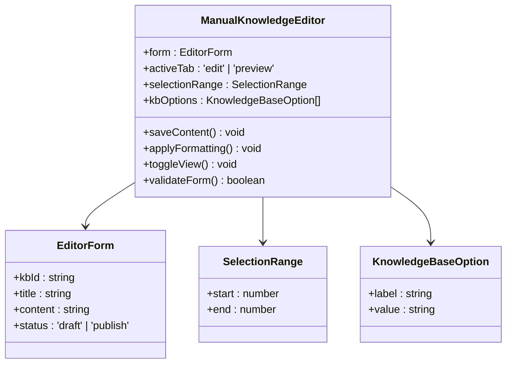
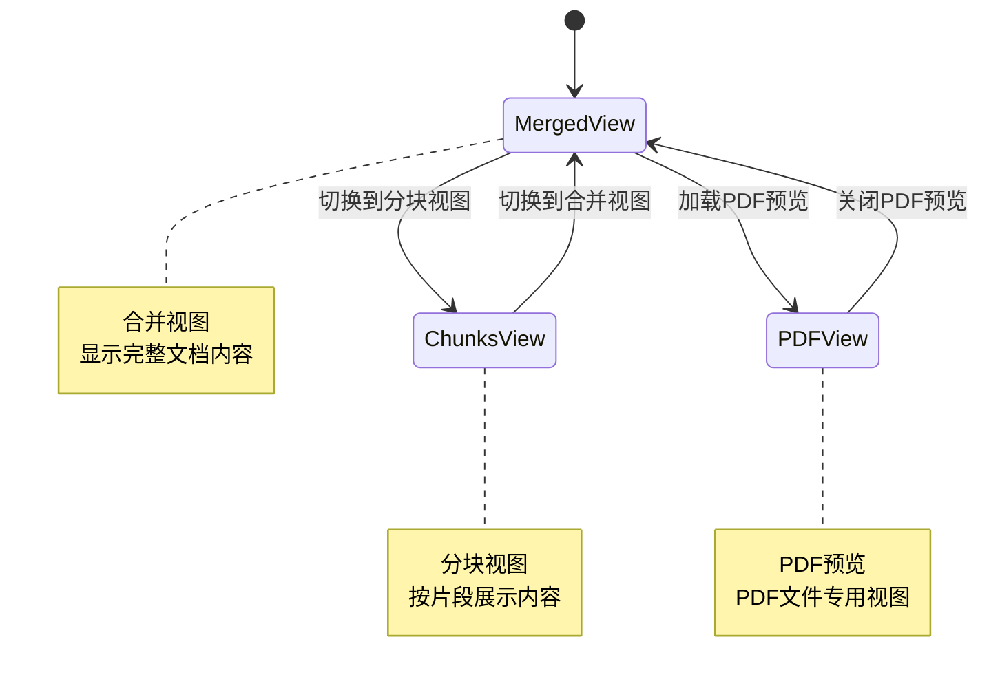
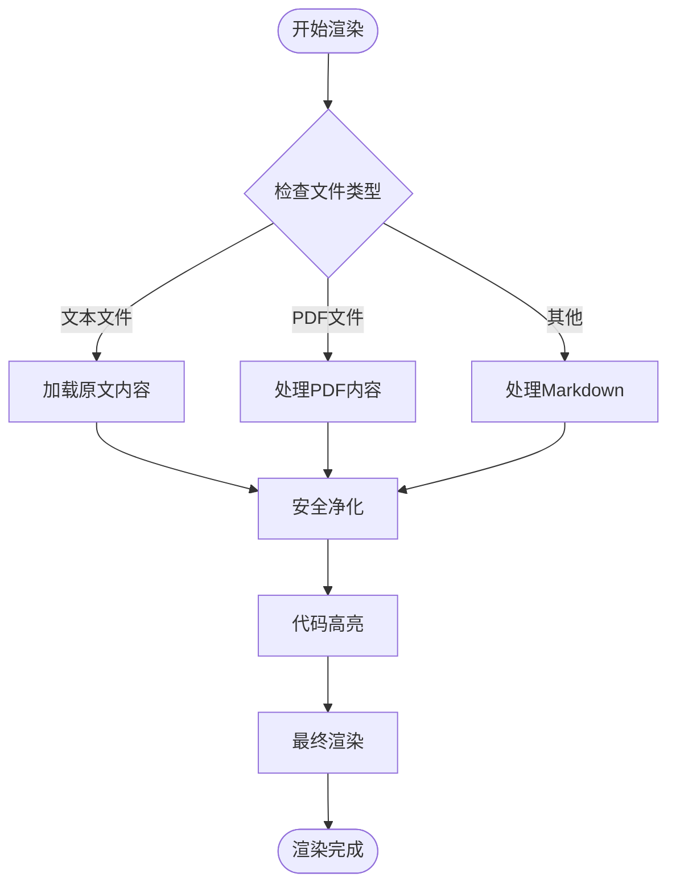
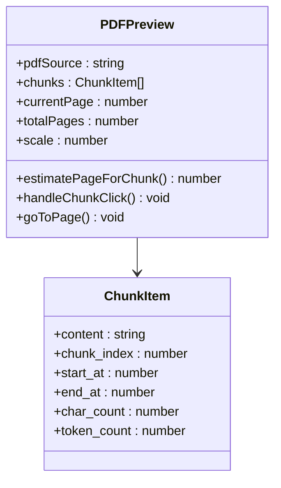
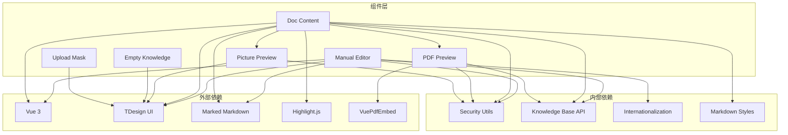

# 知识库组件

<cite>
**本文档引用的文件**
- [manual-knowledge-editor.vue](file://frontend/src/components/manual-knowledge-editor.vue)
- [doc-content.vue](file://frontend/src/components/doc-content.vue)
- [pdf-preview.vue](file://frontend/src/components/pdf-preview.vue)
- [picture-preview.vue](file://frontend/src/components/picture-preview.vue)
- [empty-knowledge.vue](file://frontend/src/components/empty-knowledge.vue)
- [upload-mask.vue](file://frontend/src/components/upload-mask.vue)
- [markdown.less](file://frontend/src/components/css/markdown.less)
- [security.ts](file://frontend/src/utils/security.ts)
- [knowledge-base/index.ts](file://frontend/src/api/knowledge-base/index.ts)
- [en-US.ts](file://frontend/src/i18n/locales/en-US.ts)
</cite>

## 目录
1. [简介](#简介)
2. [项目结构](#项目结构)
3. [核心组件](#核心组件)
4. [架构概览](#架构概览)
5. [详细组件分析](#详细组件分析)
6. [依赖关系分析](#依赖关系分析)
7. [性能考虑](#性能考虑)
8. [故障排除指南](#故障排除指南)
9. [结论](#结论)
10. [附录](#附录)

## 简介
本文档详细介绍了WiseDx前端知识库相关组件，包括手动知识编辑器、空知识占位符、文档内容展示、PDF预览、图片预览等核心组件。这些组件共同构成了知识库的完整内容管理生态系统，提供了从内容创建、编辑、预览到展示的全流程支持。

## 项目结构
WiseDx前端知识库组件主要位于`frontend/src/components/`目录下，采用模块化设计，每个组件职责明确，相互协作完成知识库内容的管理任务。

**图表来源**
- [manual-knowledge-editor.vue](file://frontend/src/components/manual-knowledge-editor.vue#L1-L1059)
- [doc-content.vue](file://frontend/src/components/doc-content.vue#L1-L1162)

## 核心组件
本节概述所有知识库相关组件的功能定位和协作关系。

### 手动知识编辑器
- **功能**：提供Markdown格式的手工知识内容编辑能力
- **特性**：实时预览、语法高亮、安全渲染、多视图切换
- **集成点**：知识库选择、内容保存、状态管理

### 文档内容展示
- **功能**：展示知识库内容的综合界面
- **特性**：多种视图模式、分块管理、PDF预览、问题生成
- **集成点**：内容渲染、文件下载、视图切换

### PDF预览组件
- **功能**：提供PDF文件的在线预览能力
- **特性**：分页浏览、缩放控制、分块导航、错误处理
- **集成点**：文档内容展示、分块映射

### 图片预览组件
- **功能**：提供图片的弹窗预览功能
- **特性**：全屏预览、关闭控制、安全验证
- **集成点**：文档内容展示、图片点击

### 空知识占位符
- **功能**：展示空知识库的状态提示
- **特性**：友好提示、格式说明、视觉引导
- **集成点**：知识库列表、内容区域

### 上传遮罩
- **功能**：文件上传的视觉反馈
- **特性**：拖拽指示、格式说明、上传状态
- **集成点**：文件上传、知识库创建

**章节来源**
- [manual-knowledge-editor.vue](file://frontend/src/components/manual-knowledge-editor.vue#L1-L1059)
- [doc-content.vue](file://frontend/src/components/doc-content.vue#L1-L1162)
- [pdf-preview.vue](file://frontend/src/components/pdf-preview.vue#L1-L382)
- [picture-preview.vue](file://frontend/src/components/picture-preview.vue#L1-L19)
- [empty-knowledge.vue](file://frontend/src/components/empty-knowledge.vue#L1-L45)
- [upload-mask.vue](file://frontend/src/components/upload-mask.vue#L1-L43)

## 架构概览
知识库组件采用分层架构设计，从底层的数据处理到上层的用户交互形成完整的处理链路。

**图表来源**
- [manual-knowledge-editor.vue](file://frontend/src/components/manual-knowledge-editor.vue#L404-L449)
- [doc-content.vue](file://frontend/src/components/doc-content.vue#L43-L63)
- [pdf-preview.vue](file://frontend/src/components/pdf-preview.vue#L19-L66)

## 详细组件分析

### 手动知识编辑器组件分析

手动知识编辑器是知识库的核心编辑组件，提供了完整的Markdown编辑体验。

#### 功能特性
- **实时预览**：编辑器支持实时Markdown到HTML的转换
- **语法高亮**：内置丰富的Markdown语法支持
- **安全渲染**：采用多层安全防护机制
- **多视图模式**：编辑模式与预览模式自由切换

#### 编辑器架构

**图表来源**
- [manual-knowledge-editor.vue](file://frontend/src/components/manual-knowledge-editor.vue#L41-L60)

#### Markdown语法支持
编辑器支持以下Markdown语法：
- **基础格式**：粗体、斜体、删除线、行内代码
- **标题层级**：H1-H3标题
- **列表格式**：无序列表、有序列表、任务列表
- **引用格式**：块级引用
- **代码块**：支持语法高亮
- **链接插入**：支持URL和文本链接
- **图片插入**：支持图片链接和描述

#### 安全渲染机制
编辑器采用三层安全防护：
1. **输入过滤**：移除潜在的恶意脚本代码
2. **HTML净化**：使用DOMPurify进行最终清理
3. **内容验证**：验证图片URL的有效性

**章节来源**
- [manual-knowledge-editor.vue](file://frontend/src/components/manual-knowledge-editor.vue#L206-L347)
- [manual-knowledge-editor.vue](file://frontend/src/components/manual-knowledge-editor.vue#L385-L392)

### 文档内容展示组件分析

文档内容展示组件提供了知识库内容的综合展示界面，支持多种视图模式和交互功能。

#### 视图模式系统

**图表来源**
- [doc-content.vue](file://frontend/src/components/doc-content.vue#L28-L28)
- [doc-content.vue](file://frontend/src/components/doc-content.vue#L647-L709)

#### 内容渲染流程

**图表来源**
- [doc-content.vue](file://frontend/src/components/doc-content.vue#L296-L331)

#### 分块合并算法
文档内容展示组件实现了智能的分块合并算法，确保内容的连续性和完整性：

1. **排序处理**：按起始位置对分块进行排序
2. **重叠检测**：识别相邻分块的重叠区域
3. **内容拼接**：合并重叠部分，避免重复内容
4. **字符计数**：维护准确的字符统计信息

**章节来源**
- [doc-content.vue](file://frontend/src/components/doc-content.vue#L84-L142)

### PDF预览组件分析

PDF预览组件提供了专业的PDF文件在线预览功能，支持分页浏览、缩放控制和分块导航。

#### PDF预览架构

**图表来源**
- [pdf-preview.vue](file://pdf-preview.vue#L9-L23)

#### 分块导航机制
PDF预览组件实现了智能的分块导航功能：

1. **字符位置映射**：根据分块的字符位置估算PDF页码
2. **动态跳转**：点击分块时自动跳转到对应页面
3. **高亮显示**：突出显示当前选中的分块
4. **页码计算**：支持基于总字符数的精确页码估算

#### 缩放控制系统
组件提供灵活的缩放控制：
- **预设比例**：50%、75%、100%、125%、150%、200%
- **实时调整**：支持鼠标滚轮和按钮控制
- **边界保护**：防止超出有效缩放范围

**章节来源**
- [pdf-preview.vue](file://frontend/src/components/pdf-preview.vue#L100-L117)
- [pdf-preview.vue](file://frontend/src/components/pdf-preview.vue#L42-L49)

### 图片预览组件分析

图片预览组件提供了简洁高效的图片弹窗预览功能。

#### 图片预览功能
- **全屏显示**：支持图片的全屏预览
- **关闭控制**：提供便捷的关闭方式
- **安全验证**：确保图片URL的安全性
- **响应式设计**：适配不同屏幕尺寸

**章节来源**
- [picture-preview.vue](file://frontend/src/components/picture-preview.vue#L1-L19)

### 空知识占位符组件分析

空知识占位符组件用于展示空知识库的状态，提供友好的用户体验。

#### 占位符设计
- **视觉引导**：使用上传图标和文字提示
- **格式说明**：明确支持的文件格式
- **状态反馈**：清晰表达当前状态
- **响应式布局**：适配不同容器尺寸

**章节来源**
- [empty-knowledge.vue](file://frontend/src/components/empty-knowledge.vue#L1-L45)

### 上传遮罩组件分析

上传遮罩组件为文件上传提供直观的视觉反馈。

#### 遮罩特性
- **拖拽指示**：明确的拖拽上传提示
- **格式说明**：清晰的文件格式要求
- **视觉层次**：合理的视觉层级设计
- **交互反馈**：及时的用户操作反馈

**章节来源**
- [upload-mask.vue](file://frontend/src/components/upload-mask.vue#L1-L43)

## 依赖关系分析

知识库组件之间的依赖关系形成了清晰的层次结构：

**图表来源**
- [manual-knowledge-editor.vue](file://frontend/src/components/manual-knowledge-editor.vue#L1-L10)
- [doc-content.vue](file://frontend/src/components/doc-content.vue#L1-L13)

**章节来源**
- [manual-knowledge-editor.vue](file://frontend/src/components/manual-knowledge-editor.vue#L1-L10)
- [doc-content.vue](file://frontend/src/components/doc-content.vue#L1-L13)

## 性能考虑

### 渲染优化策略
1. **虚拟滚动**：对于大量分块内容，考虑实现虚拟滚动以提升性能
2. **懒加载**：PDF内容采用懒加载策略，减少初始加载时间
3. **缓存机制**：对已渲染的内容实施缓存，避免重复计算
4. **防抖处理**：对频繁的用户操作实施防抖，减少不必要的重渲染

### 内存管理
1. **资源释放**：及时释放PDF Blob URL和事件监听器
2. **组件卸载**：确保组件销毁时清理所有绑定的事件
3. **图片优化**：对大图片实施压缩和懒加载策略

### 网络优化
1. **分页加载**：文档内容采用分页加载，避免一次性传输大量数据
2. **CDN加速**：静态资源通过CDN进行加速
3. **缓存策略**：合理设置HTTP缓存头，提升重复访问速度

## 故障排除指南

### 常见问题及解决方案

#### 编辑器无法加载
**症状**：手动编辑器打开后空白或加载失败
**排查步骤**：
1. 检查网络连接状态
2. 验证知识库API接口可用性
3. 查看浏览器控制台错误信息
4. 确认用户权限配置

#### 内容渲染异常
**症状**：Markdown内容显示异常或丢失
**排查步骤**：
1. 检查Markdown语法格式
2. 验证安全过滤规则
3. 确认DOMPurify配置
4. 查看渲染日志

#### PDF预览失败
**症状**：PDF文件无法正常预览
**排查步骤**：
1. 检查PDF文件格式有效性
2. 验证文件大小限制
3. 确认浏览器兼容性
4. 查看PDF渲染错误日志

#### 图片显示问题
**症状**：图片无法显示或加载失败
**排查步骤**：
1. 检查图片URL有效性
2. 验证跨域访问权限
3. 确认图片格式支持
4. 查看网络请求状态

**章节来源**
- [manual-knowledge-editor.vue](file://frontend/src/components/manual-knowledge-editor.vue#L575-L628)
- [doc-content.vue](file://frontend/src/components/doc-content.vue#L43-L63)
- [pdf-preview.vue](file://frontend/src/components/pdf-preview.vue#L62-L66)

## 结论
WiseDx知识库组件系统展现了现代前端应用的设计理念，通过模块化架构、安全优先的设计原则和优秀的用户体验，构建了一个功能完善的知识库管理系统。各组件之间协作紧密，形成了完整的知识内容生命周期管理体系。

组件系统的主要优势包括：
- **安全性**：多层安全防护确保内容安全
- **易用性**：直观的用户界面和流畅的操作体验
- **扩展性**：模块化设计便于功能扩展和维护
- **性能**：优化的渲染策略和资源管理

## 附录

### 组件使用场景

#### 手动知识编辑器适用场景
- 创建新的手工知识条目
- 编辑现有的Markdown内容
- 快速预览和发布知识内容
- 多知识库内容管理

#### 文档内容展示适用场景
- 查看知识库详细内容
- 分析文档结构和分块信息
- 预览PDF和其他文件格式
- 管理生成的问题和元数据

#### PDF预览适用场景
- 在线查看PDF文档
- 导航到特定页面
- 与文档内容关联查看
- 分块内容定位

### 集成示例

#### 基本集成步骤
1. **安装依赖**：确保所有必要的npm包已安装
2. **导入组件**：在需要的页面中导入目标组件
3. **配置API**：设置知识库API的访问权限
4. **初始化状态**：配置组件的初始状态和参数
5. **事件绑定**：绑定必要的事件处理器

#### 最佳实践
- **错误处理**：为所有异步操作添加适当的错误处理
- **状态管理**：合理使用Pinia进行全局状态管理
- **国际化**：确保所有文本都支持多语言
- **性能监控**：实施性能监控和优化策略

**章节来源**
- [knowledge-base/index.ts](file://frontend/src/api/knowledge-base/index.ts#L84-L98)
- [en-US.ts](file://frontend/src/i18n/locales/en-US.ts#L879-L898)