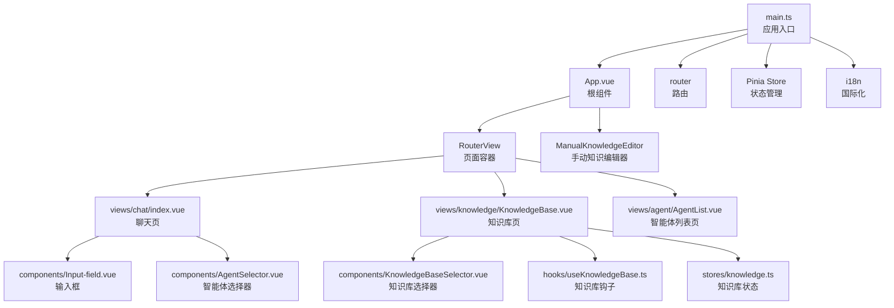
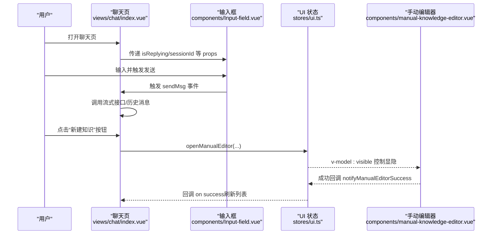
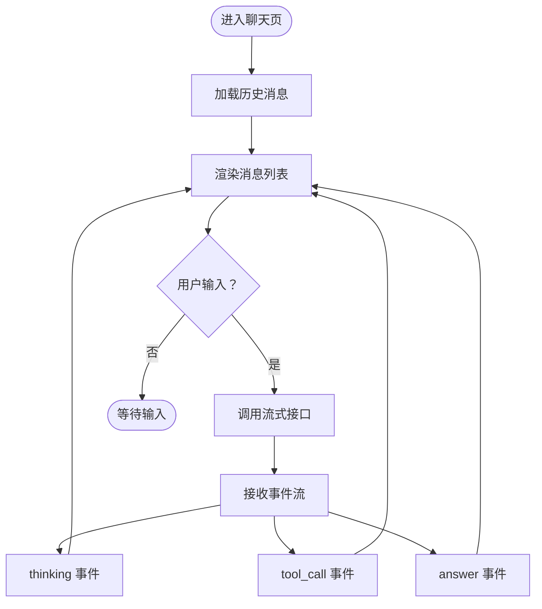
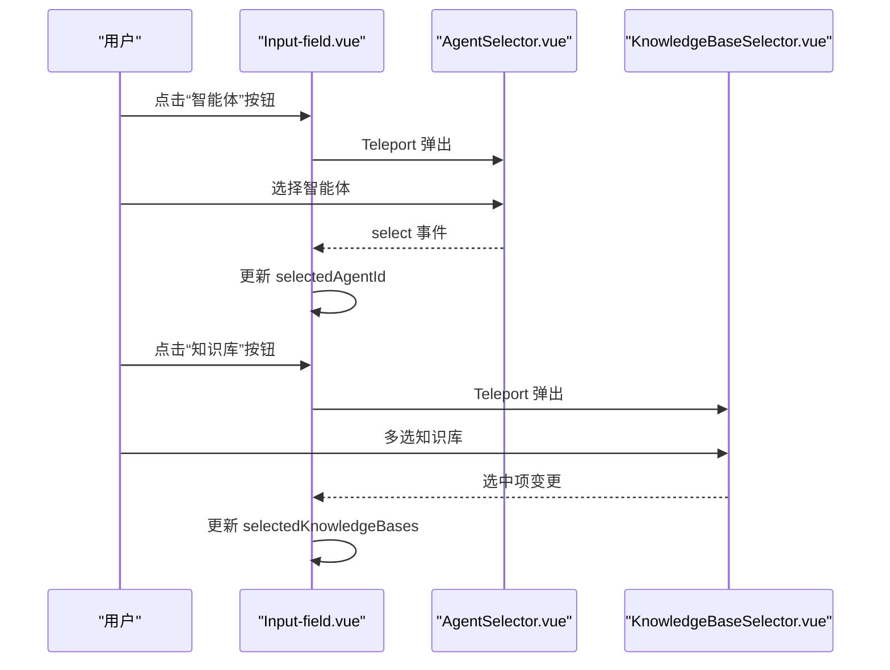
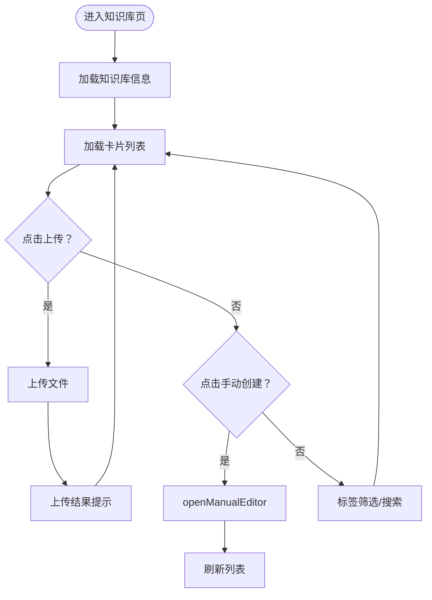
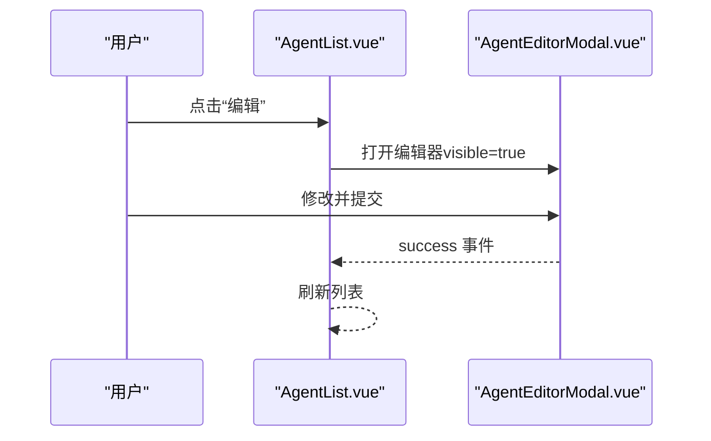
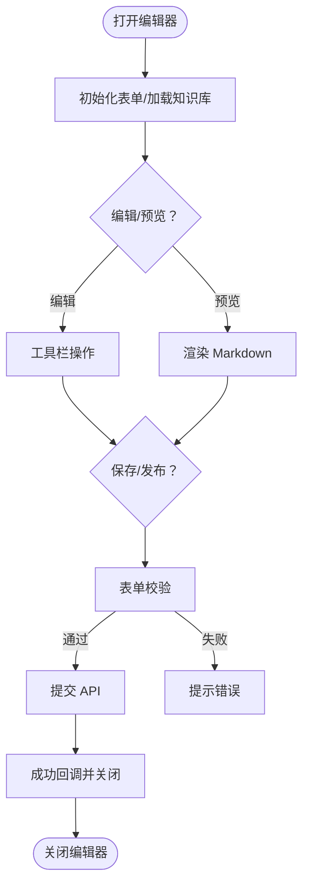
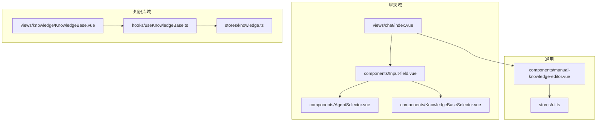

# 组件系统

<cite>
**本文档引用的文件**
- [frontend/src/App.vue](file://frontend/src/App.vue)
- [frontend/src/main.ts](file://frontend/src/main.ts)
- [frontend/package.json](file://frontend/package.json)
- [frontend/src/components/manual-knowledge-editor.vue](file://frontend/src/components/manual-knowledge-editor.vue)
- [frontend/src/views/chat/index.vue](file://frontend/src/views/chat/index.vue)
- [frontend/src/views/knowledge/KnowledgeBase.vue](file://frontend/src/views/knowledge/KnowledgeBase.vue)
- [frontend/src/views/agent/AgentList.vue](file://frontend/src/views/agent/AgentList.vue)
- [frontend/src/stores/ui.ts](file://frontend/src/stores/ui.ts)
- [frontend/src/components/Input-field.vue](file://frontend/src/components/Input-field.vue)
- [frontend/src/components/AgentSelector.vue](file://frontend/src/components/AgentSelector.vue)
- [frontend/src/components/KnowledgeBaseSelector.vue](file://frontend/src/components/KnowledgeBaseSelector.vue)
- [frontend/src/stores/knowledge.ts](file://frontend/src/stores/knowledge.ts)
- [frontend/src/hooks/useKnowledgeBase.ts](file://frontend/src/hooks/useKnowledgeBase.ts)
</cite>

## 目录
1. [简介](#简介)
2. [项目结构](#项目结构)
3. [核心组件](#核心组件)
4. [架构总览](#架构总览)
5. [详细组件分析](#详细组件分析)
6. [依赖关系分析](#依赖关系分析)
7. [性能考量](#性能考量)
8. [故障排查指南](#故障排查指南)
9. [结论](#结论)
10. [附录](#附录)

## 简介
本文件系统性梳理 WiseDx 前端组件体系，聚焦聊天界面、知识库管理、代理编辑等核心 UI 组件，阐述其功能职责、属性与事件、插槽使用、组件间通信与状态共享机制，并提供组件开发指南、样式定制与主题适配建议。

## 项目结构
前端基于 Vue 3 + Pinia + TDesign 构建，入口在 main.ts 注册应用、路由、状态管理与国际化；App.vue 作为根组件挂载 RouterView 与通用编辑器。组件按功能域划分在 src/components 与 src/views 下，配合 src/stores 提供跨组件状态共享。

图表来源
- [frontend/src/main.ts](file://frontend/src/main.ts#L1-L20)
- [frontend/src/App.vue](file://frontend/src/App.vue#L1-L26)
- [frontend/src/views/chat/index.vue](file://frontend/src/views/chat/index.vue#L1-L120)
- [frontend/src/views/knowledge/KnowledgeBase.vue](file://frontend/src/views/knowledge/KnowledgeBase.vue#L1-L60)
- [frontend/src/views/agent/AgentList.vue](file://frontend/src/views/agent/AgentList.vue#L1-L40)
- [frontend/src/components/Input-field.vue](file://frontend/src/components/Input-field.vue#L1-L60)
- [frontend/src/components/AgentSelector.vue](file://frontend/src/components/AgentSelector.vue#L1-L40)
- [frontend/src/components/KnowledgeBaseSelector.vue](file://frontend/src/components/KnowledgeBaseSelector.vue#L1-L40)
- [frontend/src/stores/knowledge.ts](file://frontend/src/stores/knowledge.ts#L1-L12)
- [frontend/src/hooks/useKnowledgeBase.ts](file://frontend/src/hooks/useKnowledgeBase.ts#L1-L40)

章节来源
- [frontend/src/main.ts](file://frontend/src/main.ts#L1-L20)
- [frontend/src/App.vue](file://frontend/src/App.vue#L1-L26)

## 核心组件
- 聊天界面组件
  - 聊天容器与消息流：views/chat/index.vue
  - 输入与上下文选择：components/Input-field.vue
  - 智能体选择器：components/AgentSelector.vue
- 知识库管理组件
  - 知识库卡片与文件列表：views/knowledge/KnowledgeBase.vue
  - 知识库选择器：components/KnowledgeBaseSelector.vue
  - 知识库钩子：hooks/useKnowledgeBase.ts
  - 知识库状态：stores/knowledge.ts
- 代理编辑组件
  - 智能体列表页：views/agent/AgentList.vue
- 手动知识编辑器
  - 手动知识编辑器：components/manual-knowledge-editor.vue
  - UI 状态：stores/ui.ts

章节来源
- [frontend/src/views/chat/index.vue](file://frontend/src/views/chat/index.vue#L1-L120)
- [frontend/src/components/Input-field.vue](file://frontend/src/components/Input-field.vue#L1-L120)
- [frontend/src/components/AgentSelector.vue](file://frontend/src/components/AgentSelector.vue#L1-L120)
- [frontend/src/views/knowledge/KnowledgeBase.vue](file://frontend/src/views/knowledge/KnowledgeBase.vue#L1-L120)
- [frontend/src/components/KnowledgeBaseSelector.vue](file://frontend/src/components/KnowledgeBaseSelector.vue#L1-L120)
- [frontend/src/hooks/useKnowledgeBase.ts](file://frontend/src/hooks/useKnowledgeBase.ts#L1-L60)
- [frontend/src/stores/knowledge.ts](file://frontend/src/stores/knowledge.ts#L1-L12)
- [frontend/src/views/agent/AgentList.vue](file://frontend/src/views/agent/AgentList.vue#L1-L120)
- [frontend/src/components/manual-knowledge-editor.vue](file://frontend/src/components/manual-knowledge-editor.vue#L1-L120)
- [frontend/src/stores/ui.ts](file://frontend/src/stores/ui.ts#L1-L115)

## 架构总览
组件间通过以下机制协作：
- 状态共享：Pinia Store（ui、settings、menu、knowledge 等）
- 事件总线：自定义事件（如 knowledgeFileUploaded、openURLImportDialog、openAgentEditor）
- 组件通信：props 与 emits、Teleport 弹层、TDesign 组件库
- 数据流：API 层封装在 api/*，组件通过 store 与 hooks 调用

图表来源
- [frontend/src/views/chat/index.vue](file://frontend/src/views/chat/index.vue#L70-L120)
- [frontend/src/components/Input-field.vue](file://frontend/src/components/Input-field.vue#L158-L200)
- [frontend/src/stores/ui.ts](file://frontend/src/stores/ui.ts#L69-L112)
- [frontend/src/components/manual-knowledge-editor.vue](file://frontend/src/components/manual-knowledge-editor.vue#L628-L632)

## 详细组件分析

### 聊天界面组件（views/chat/index.vue）
- 功能要点
  - 消息列表渲染：区分用户与助手消息，支持加载历史与滚动加载
  - 流式输出：集成 useStream，接收 agent 事件（thinking/tool_call/answer 等）
  - 侧边栏：医疗问诊场景下的患者信息与计划展示
  - 导出：支持导出 Markdown/PDF
- 关键 props/事件/插槽
  - props：isReplying、sessionId、assistantMessageId
  - emits：send-msg、stop-generation、scroll-bottom、quick-reply-select
  - 插槽：无（通过子组件组合）
- 状态与通信
  - 通过 Pinia store（menu、settings、ui）读取/写入选项
  - 通过自定义事件与知识库编辑器交互
- 复杂流程示意

图表来源
- [frontend/src/views/chat/index.vue](file://frontend/src/views/chat/index.vue#L540-L686)

章节来源
- [frontend/src/views/chat/index.vue](file://frontend/src/views/chat/index.vue#L1-L200)
- [frontend/src/views/chat/index.vue](file://frontend/src/views/chat/index.vue#L540-L800)

### 输入组件（components/Input-field.vue）
- 功能要点
  - 智能体选择：内置/自定义智能体，支持 tooltip 展示能力
  - 知识库选择：多选知识库，支持搜索与键盘导航
  - @ 提及：动态搜索知识库与文件，支持分页加载
  - 模型选择：读取会话配置，支持弹出位置自适应
- 关键 props/事件/插槽
  - props：isReplying、sessionId、assistantMessageId
  - emits：send-msg、stop-generation
  - 插槽：无
- 状态与通信
  - 通过 Pinia store（settings、ui）读取/写入选项
  - 与 AgentSelector、KnowledgeBaseSelector 通过 Teleport 弹层交互
- 交互流程示意

图表来源
- [frontend/src/components/Input-field.vue](file://frontend/src/components/Input-field.vue#L158-L200)
- [frontend/src/components/AgentSelector.vue](file://frontend/src/components/AgentSelector.vue#L173-L182)
- [frontend/src/components/KnowledgeBaseSelector.vue](file://frontend/src/components/KnowledgeBaseSelector.vue#L83-L90)

章节来源
- [frontend/src/components/Input-field.vue](file://frontend/src/components/Input-field.vue#L1-L200)
- [frontend/src/components/AgentSelector.vue](file://frontend/src/components/AgentSelector.vue#L1-L120)
- [frontend/src/components/KnowledgeBaseSelector.vue](file://frontend/src/components/KnowledgeBaseSelector.vue#L1-L120)

### 知识库管理组件（views/knowledge/KnowledgeBase.vue）
- 功能要点
  - 知识库卡片列表：支持分页、标签筛选、文件类型筛选
  - 文件上传：支持批量上传、重复检测、上传结果提示
  - 手动创建：通过 UI store 打开手动知识编辑器
  - URL 导入：触发弹窗并校验 URL
  - 标签管理：增删改查、分页加载、搜索
- 关键 props/事件/插槽
  - props：无
  - emits：无
  - 插槽：无
- 状态与通信
  - 通过 hooks/useKnowledgeBase.ts 管理卡片列表与详情
  - 通过自定义事件（knowledgeFileUploaded/openURLImportDialog）响应上传与导入
  - 通过 UI store 打开手动编辑器
- 流程示意

图表来源
- [frontend/src/views/knowledge/KnowledgeBase.vue](file://frontend/src/views/knowledge/KnowledgeBase.vue#L660-L800)
- [frontend/src/hooks/useKnowledgeBase.ts](file://frontend/src/hooks/useKnowledgeBase.ts#L31-L120)
- [frontend/src/stores/ui.ts](file://frontend/src/stores/ui.ts#L69-L95)

章节来源
- [frontend/src/views/knowledge/KnowledgeBase.vue](file://frontend/src/views/knowledge/KnowledgeBase.vue#L1-L200)
- [frontend/src/hooks/useKnowledgeBase.ts](file://frontend/src/hooks/useKnowledgeBase.ts#L1-L120)
- [frontend/src/stores/ui.ts](file://frontend/src/stores/ui.ts#L69-L112)

### 智能体列表组件（views/agent/AgentList.vue）
- 功能要点
  - 智能体卡片：内置/自定义，支持特性徽章（网络搜索、知识库、MCP、多轮）
  - 编辑/复制/删除：右上角更多菜单
  - 打开编辑器：支持从 URL 参数触发
- 关键 props/事件/插槽
  - props：无
  - emits：无
  - 插槽：无
- 状态与通信
  - 通过自定义事件（openAgentEditor）打开编辑器
  - 通过 API 列表/删除/复制智能体
- 流程示意

图表来源
- [frontend/src/views/agent/AgentList.vue](file://frontend/src/views/agent/AgentList.vue#L162-L171)

章节来源
- [frontend/src/views/agent/AgentList.vue](file://frontend/src/views/agent/AgentList.vue#L1-L120)

### 手动知识编辑器（components/manual-knowledge-editor.vue）
- 功能要点
  - 编辑器：支持 Markdown 工具栏、编辑/预览切换、安全渲染
  - 状态：草稿/发布，自动保存与成功回调
  - 知识库选择：仅显示文档型知识库
  - 表单校验：必填项与内容长度约束
- 关键 props/事件/插槽
  - props：无（通过 UI store 控制可见与初始状态）
  - emits：无
  - 插槽：无
- 状态与通信
  - 通过 UI store（manualEditorVisible/Mode/KbId/OnSuccess）控制
  - 成功后通过 notifyManualEditorSuccess 回调通知父组件
- 流程示意

图表来源
- [frontend/src/components/manual-knowledge-editor.vue](file://frontend/src/components/manual-knowledge-editor.vue#L575-L632)
- [frontend/src/stores/ui.ts](file://frontend/src/stores/ui.ts#L69-L112)

章节来源
- [frontend/src/components/manual-knowledge-editor.vue](file://frontend/src/components/manual-knowledge-editor.vue#L1-L200)
- [frontend/src/stores/ui.ts](file://frontend/src/stores/ui.ts#L69-L112)

## 依赖关系分析
- 技术栈
  - Vue 3、Pinia、Vue Router、TDesign
  - marked、DOMPurify、highlight.js、pagefind、xlsx 等
- 组件耦合
  - Input-field 与 AgentSelector/KnowledgeBaseSelector 强耦合（Teleport 弹层）
  - chat/index 与 knowledge/KnowledgeBase.vue 通过自定义事件解耦
  - manual-knowledge-editor 与 ui store 弱耦合（通过 store 控制可见与回调）

图表来源
- [frontend/src/views/chat/index.vue](file://frontend/src/views/chat/index.vue#L1-L120)
- [frontend/src/components/Input-field.vue](file://frontend/src/components/Input-field.vue#L1-L120)
- [frontend/src/components/AgentSelector.vue](file://frontend/src/components/AgentSelector.vue#L1-L120)
- [frontend/src/components/KnowledgeBaseSelector.vue](file://frontend/src/components/KnowledgeBaseSelector.vue#L1-L120)
- [frontend/src/views/knowledge/KnowledgeBase.vue](file://frontend/src/views/knowledge/KnowledgeBase.vue#L1-L120)
- [frontend/src/hooks/useKnowledgeBase.ts](file://frontend/src/hooks/useKnowledgeBase.ts#L1-L60)
- [frontend/src/stores/knowledge.ts](file://frontend/src/stores/knowledge.ts#L1-L12)
- [frontend/src/stores/ui.ts](file://frontend/src/stores/ui.ts#L1-L115)
- [frontend/src/components/manual-knowledge-editor.vue](file://frontend/src/components/manual-knowledge-editor.vue#L1-L120)

章节来源
- [frontend/package.json](file://frontend/package.json#L14-L34)

## 性能考量
- 列表懒加载与分页：知识库卡片与文件详情采用分页加载，减少首屏压力
- 事件节流/防抖：聊天页滚动加载使用防抖，降低请求频率
- DOM 操作最小化：输入框 @ 提及菜单使用 Teleport，避免层级过深
- 安全渲染：Markdown 输出使用 DOMPurify + marked，避免 XSS
- 状态粒度：UI 状态集中于 ui store，避免多处重复状态

## 故障排查指南
- 编辑器无法打开
  - 检查 ui.store 的 manualEditorVisible 是否被正确设置
  - 确认 App.vue 中是否挂载了 ManualKnowledgeEditor
- 知识库上传失败
  - 检查知识库是否初始化（embedding_model_id/summary_model_id）
  - 查看上传返回码（duplicate_file）并提示重复
- @ 提及无结果
  - 检查智能体的 kb_selection_mode 与 supported_file_types
  - 确认 searchKnowledge 分页参数与过滤条件
- 流式输出异常
  - 检查 useStream 的 onChunk 与 error 监听
  - 确认后端事件类型（thinking/tool_call/answer）是否完整

章节来源
- [frontend/src/stores/ui.ts](file://frontend/src/stores/ui.ts#L69-L112)
- [frontend/src/views/knowledge/KnowledgeBase.vue](file://frontend/src/views/knowledge/KnowledgeBase.vue#L660-L800)
- [frontend/src/components/Input-field.vue](file://frontend/src/components/Input-field.vue#L577-L800)
- [frontend/src/views/chat/index.vue](file://frontend/src/views/chat/index.vue#L748-L758)

## 结论
WiseDx 前端组件系统以模块化与状态集中为核心，通过 Pinia 实现跨组件状态共享，借助 Teleport 与自定义事件实现松耦合交互。聊天、知识库与智能体三大域边界清晰，具备良好的扩展性与可维护性。建议在新增组件时遵循现有通信模式与状态管理规范，确保一致性与可测试性。

## 附录

### 组件开发指南
- 设计原则
  - 单一职责：每个组件专注单一功能
  - 可复用：尽量通过 props/emit 解耦
  - 可测试：暴露关键行为（如 open/close、submit）便于单元测试
- 复用策略
  - 选择器类组件（AgentSelector、KnowledgeBaseSelector）统一使用 Teleport 弹层
  - 列表类组件（KnowledgeBase）统一分页与筛选逻辑
- 测试方法
  - 单元测试：针对复杂逻辑（@ 提及、Markdown 渲染）编写测试
  - 集成测试：模拟聊天流式事件与知识库上传流程
- 样式与主题
  - 使用 TDesign 全局样式变量，避免硬编码颜色
  - 主题适配：通过 CSS 变量与 less 变量统一管理主题色与间距

### 组件属性与事件参考（摘要）
- Input-field
  - props：isReplying、sessionId、assistantMessageId
  - emits：send-msg、stop-generation
- AgentSelector
  - props：visible、anchorEl、currentAgentId
  - emits：close、select
- KnowledgeBaseSelector
  - props：visible、anchorEl、dropdownWidth、offsetY
  - emits：close、update:visible
- manual-knowledge-editor
  - 通过 ui.store 控制可见与回调（openManualEditor/closeManualEditor/notifyManualEditorSuccess）

章节来源
- [frontend/src/components/Input-field.vue](file://frontend/src/components/Input-field.vue#L158-L200)
- [frontend/src/components/AgentSelector.vue](file://frontend/src/components/AgentSelector.vue#L173-L182)
- [frontend/src/components/KnowledgeBaseSelector.vue](file://frontend/src/components/KnowledgeBaseSelector.vue#L83-L90)
- [frontend/src/stores/ui.ts](file://frontend/src/stores/ui.ts#L69-L112)