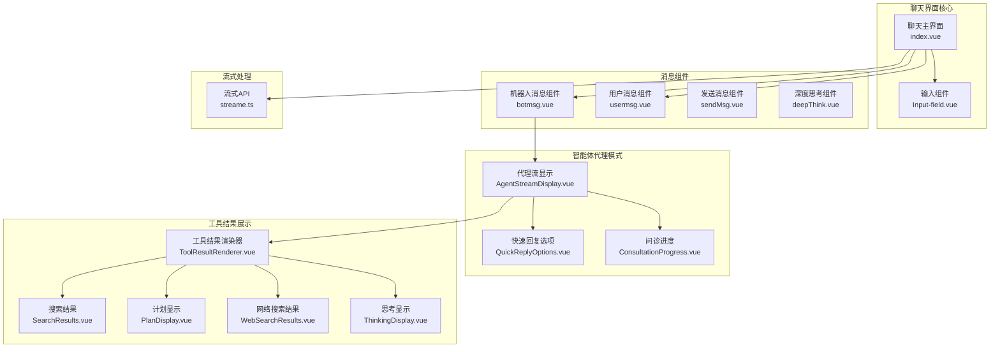
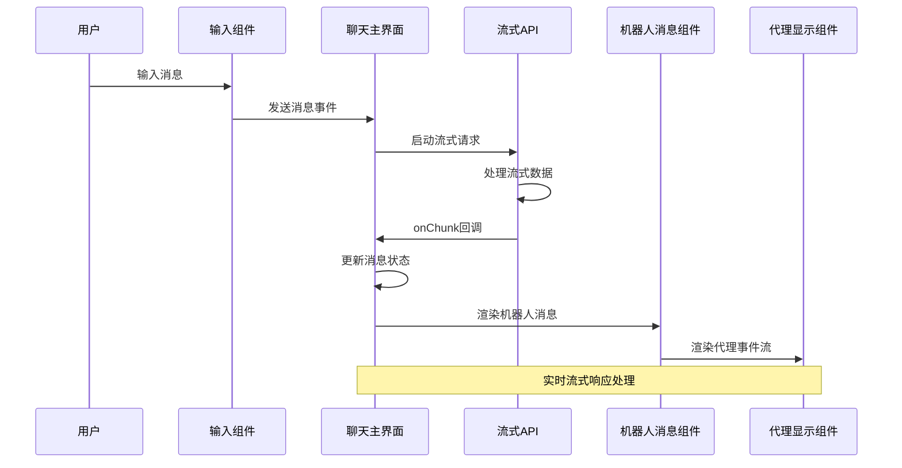
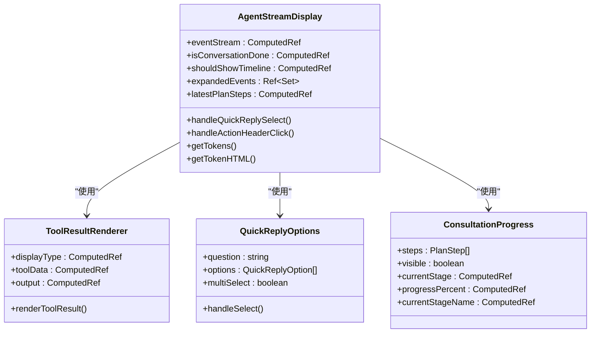
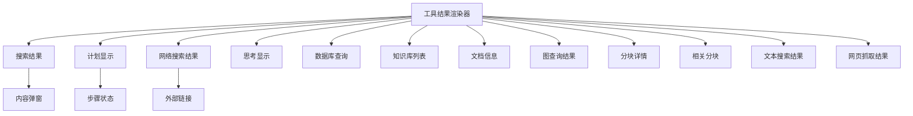
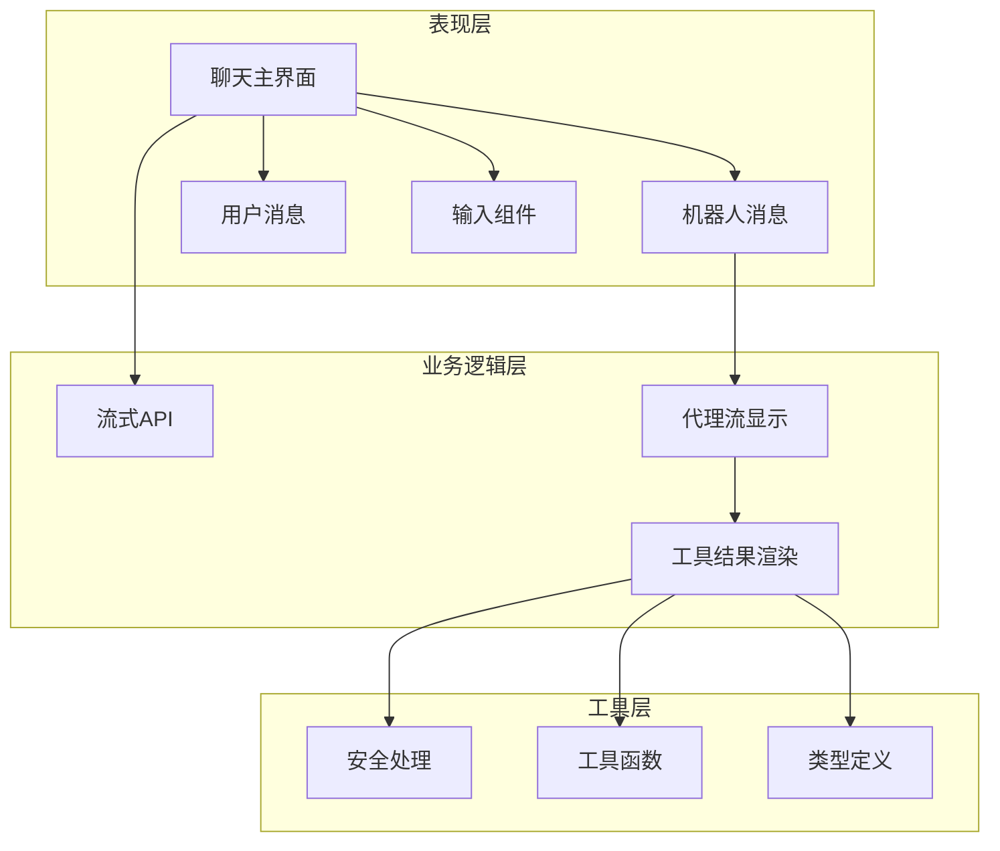

# 聊天界面组件

<cite>
**本文档引用的文件**
- [frontend/src/views/chat/index.vue](file://frontend/src/views/chat/index.vue)
- [frontend/src/views/chat/components/botmsg.vue](file://frontend/src/views/chat/components/botmsg.vue)
- [frontend/src/views/chat/components/usermsg.vue](file://frontend/src/views/chat/components/usermsg.vue)
- [frontend/src/views/chat/components/sendMsg.vue](file://frontend/src/views/chat/components/sendMsg.vue)
- [frontend/src/views/chat/components/deepThink.vue](file://frontend/src/views/chat/components/deepThink.vue)
- [frontend/src/views/chat/components/AgentStreamDisplay.vue](file://frontend/src/views/chat/components/AgentStreamDisplay.vue)
- [frontend/src/views/chat/components/ToolResultRenderer.vue](file://frontend/src/views/chat/components/ToolResultRenderer.vue)
- [frontend/src/views/chat/components/QuickReplyOptions.vue](file://frontend/src/views/chat/components/QuickReplyOptions.vue)
- [frontend/src/views/chat/components/ConsultationProgress.vue](file://frontend/src/views/chat/components/ConsultationProgress.vue)
- [frontend/src/views/chat/components/tool-results/SearchResults.vue](file://frontend/src/views/chat/components/tool-results/SearchResults.vue)
- [frontend/src/views/chat/components/tool-results/PlanDisplay.vue](file://frontend/src/views/chat/components/tool-results/PlanDisplay.vue)
- [frontend/src/views/chat/components/tool-results/WebSearchResults.vue](file://frontend/src/views/chat/components/tool-results/WebSearchResults.vue)
- [frontend/src/views/chat/components/tool-results/ThinkingDisplay.vue](file://frontend/src/views/chat/components/tool-results/ThinkingDisplay.vue)
- [frontend/src/api/chat/streame.ts](file://frontend/src/api/chat/streame.ts)
- [frontend/src/components/Input-field.vue](file://frontend/src/components/Input-field.vue)
- [frontend/src/types/tool-results.ts](file://frontend/src/types/tool-results.ts)
</cite>

## 目录
1. [简介](#简介)
2. [项目结构](#项目结构)
3. [核心组件](#核心组件)
4. [架构概览](#架构概览)
5. [详细组件分析](#详细组件分析)
6. [依赖关系分析](#依赖关系分析)
7. [性能考虑](#性能考虑)
8. [故障排除指南](#故障排除指南)
9. [结论](#结论)

## 简介

WiseDx前端聊天界面组件是一个基于Vue 3构建的现代化聊天系统，专为医疗诊断场景设计。该系统提供了完整的AI聊天体验，包括传统Markdown消息渲染、智能体代理模式、深度思考过程可视化、工具结果展示等功能。

系统的核心特性包括：
- 实时流式响应处理
- 智能体代理模式与传统知识库问答模式
- 深度思考过程的可视化展示
- 多种工具结果的丰富展示组件
- 医疗问诊流程的状态跟踪
- 支持@提及知识库和文件的上下文增强

## 项目结构

聊天界面组件位于前端项目的`src/views/chat`目录下，采用模块化设计，每个组件都有明确的职责分工：

**图表来源**
- [frontend/src/views/chat/index.vue](file://frontend/src/views/chat/index.vue#L1-L800)
- [frontend/src/components/Input-field.vue](file://frontend/src/components/Input-field.vue#L1-L800)
- [frontend/src/views/chat/components/botmsg.vue](file://frontend/src/views/chat/components/botmsg.vue#L1-L574)

**章节来源**
- [frontend/src/views/chat/index.vue](file://frontend/src/views/chat/index.vue#L1-L800)
- [frontend/src/components/Input-field.vue](file://frontend/src/components/Input-field.vue#L1-L800)

## 核心组件

### 聊天主界面组件

聊天主界面是整个聊天系统的入口点，负责管理消息列表、流式响应处理、状态管理和用户交互。

**主要功能特性：**
- 消息列表渲染和滚动管理
- 流式响应的实时更新
- 会话历史加载和分页
- 导出功能（Markdown/PDF）
- 医疗问诊侧边栏集成

**状态管理：**
- `messagesList`: 存储所有聊天消息
- `isReplying`: 标记是否正在等待响应
- `loading`: 控制加载指示器
- `currentAssistantMessageId`: 当前正在生成的消息ID
- `isFirstEnter`: 首次进入标记

**章节来源**
- [frontend/src/views/chat/index.vue](file://frontend/src/views/chat/index.vue#L117-L126)
- [frontend/src/views/chat/index.vue](file://frontend/src/views/chat/index.vue#L617-L686)

### 机器人消息组件

机器人消息组件负责渲染来自AI助手的消息，支持两种模式：传统Markdown模式和智能体代理模式。

**核心功能：**
- Markdown内容渲染和安全处理
- @提及知识库和文件的显示
- 深度思考过程的可视化
- 答案工具栏（复制、添加到知识库）
- 图片预览功能

**安全机制：**
- 使用DOMPurify进行HTML清理
- 安全的Markdown渲染
- 图片URL验证

**章节来源**
- [frontend/src/views/chat/components/botmsg.vue](file://frontend/src/views/chat/components/botmsg.vue#L1-L574)

### 用户消息组件

用户消息组件专门处理用户发送的消息显示，提供清晰的视觉区分和@提及信息展示。

**设计特点：**
- 黄色背景突出用户消息
- @提及标签的分类显示（知识库、FAQ、文件）
- 响应式布局适配不同屏幕尺寸

**章节来源**
- [frontend/src/views/chat/components/usermsg.vue](file://frontend/src/views/chat/components/usermsg.vue#L1-L140)

### 输入组件

输入组件是聊天界面的核心交互组件，提供丰富的上下文选择和智能体配置功能。

**主要功能：**
- @提及知识库和文件的智能提示
- 智能体模式切换
- 网络搜索配置
- 模型选择和知识库选择
- 快捷回复和快速操作

**智能体集成：**
- 支持内置和自定义智能体
- 智能体配置的知识库自动同步
- 网络搜索能力的动态启用/禁用

**章节来源**
- [frontend/src/components/Input-field.vue](file://frontend/src/components/Input-field.vue#L1-L800)

## 架构概览

系统采用分层架构设计，确保各组件间的松耦合和高内聚：

**图表来源**
- [frontend/src/views/chat/index.vue](file://frontend/src/views/chat/index.vue#L760-L800)
- [frontend/src/api/chat/streame.ts](file://frontend/src/api/chat/streame.ts#L155-L182)

**章节来源**
- [frontend/src/api/chat/streame.ts](file://frontend/src/api/chat/streame.ts#L1-L182)

## 详细组件分析

### 智能体代理模式组件

智能体代理模式是WiseDx的核心特色，提供了完整的AI代理思考过程可视化。

**图表来源**
- [frontend/src/views/chat/components/AgentStreamDisplay.vue](file://frontend/src/views/chat/components/AgentStreamDisplay.vue#L411-L420)
- [frontend/src/views/chat/components/ToolResultRenderer.vue](file://frontend/src/views/chat/components/ToolResultRenderer.vue#L88-L132)
- [frontend/src/views/chat/components/QuickReplyOptions.vue](file://frontend/src/views/chat/components/QuickReplyOptions.vue#L22-L41)

**智能体事件流处理：**

智能体代理模式通过事件流机制处理复杂的AI思考过程：

1. **思维事件（thinking）**: AI的内部思考过程
2. **工具调用事件（tool_call）**: AI执行的各种工具操作
3. **答案事件（answer）**: 最终的结论或回答
4. **快速回复事件（quick_reply）**: 等待用户选择的选项

**章节来源**
- [frontend/src/views/chat/components/AgentStreamDisplay.vue](file://frontend/src/views/chat/components/AgentStreamDisplay.vue#L1-L800)

### 工具结果展示组件

系统提供了多种专用的工具结果展示组件，每种都针对特定的数据类型进行了优化：

**图表来源**
- [frontend/src/views/chat/components/ToolResultRenderer.vue](file://frontend/src/views/chat/components/ToolResultRenderer.vue#L1-L205)
- [frontend/src/types/tool-results.ts](file://frontend/src/types/tool-results.ts#L1-L246)

**工具结果类型定义：**

系统定义了完整的工具结果类型体系，确保类型安全和开发体验：

- **搜索结果**: `SearchResultsData` - 知识库搜索结果的结构化展示
- **计划步骤**: `PlanData` - 医疗问诊流程的步骤管理
- **网络搜索**: `WebSearchResultsData` - 网络搜索结果的分组展示
- **思考过程**: `ThinkingData` - AI内部思考内容的纯文本展示
- **数据库查询**: `DatabaseQueryData` - 结构化查询结果的表格展示
- **知识库信息**: `KnowledgeBaseListData` - 知识库列表的元数据展示

**章节来源**
- [frontend/src/types/tool-results.ts](file://frontend/src/types/tool-results.ts#L1-L246)

### 深度思考组件

深度思考组件专门用于可视化AI的内部思考过程，提供用户友好的交互体验。

**核心特性：**
- 可折叠/展开的思考内容
- 实时滚动到最新内容
- 思考状态指示（进行中/已完成）
- 安全的内容处理防止XSS攻击

**交互逻辑：**
- 自动折叠：当思考完成后自动折叠内容
- 手动控制：用户可以手动展开/折叠思考内容
- 实时更新：思考过程的实时流式更新

**章节来源**
- [frontend/src/views/chat/components/deepThink.vue](file://frontend/src/views/chat/components/deepThink.vue#L1-L195)

### 快速回复组件

快速回复组件为用户提供了一键选择的便捷交互方式，特别适用于需要用户决策的场景。

**设计特点：**
- 按钮式快速选择界面
- 支持单选和多选模式
- 响应式布局适配移动设备
- 深色模式兼容性

**使用场景：**
- 智能体需要用户选择下一步操作
- 提供预设的标准化回复选项
- 减少用户的输入负担

**章节来源**
- [frontend/src/views/chat/components/QuickReplyOptions.vue](file://frontend/src/views/chat/components/QuickReplyOptions.vue#L1-L107)

## 依赖关系分析

系统组件间的依赖关系体现了清晰的分层架构：

**图表来源**
- [frontend/src/views/chat/index.vue](file://frontend/src/views/chat/index.vue#L80-L100)
- [frontend/src/views/chat/components/botmsg.vue](file://frontend/src/views/chat/components/botmsg.vue#L55-L65)

**依赖注入和状态管理：**
- Pinia状态管理用于全局状态共享
- Vue 3 Composition API提供响应式数据绑定
- 组件间通过props和emits进行通信

**章节来源**
- [frontend/src/views/chat/index.vue](file://frontend/src/views/chat/index.vue#L80-L100)

## 性能考虑

### 流式响应优化

系统采用了多项优化策略来确保流式响应的高性能：

1. **增量渲染**: 使用`marked.lexer`将Markdown内容分词处理，避免整段重新渲染
2. **虚拟滚动**: 对长消息列表使用虚拟滚动技术
3. **防抖处理**: 滚动事件使用防抖减少重绘频率
4. **内存管理**: 及时清理事件监听器和定时器

### 安全性保障

- **DOMPurify**: 所有HTML内容经过安全清理
- **CSP策略**: 内联脚本和危险标签被严格过滤
- **图片验证**: 外链图片URL进行安全验证
- **XSS防护**: 深度思考内容的XSS攻击防护

### 用户体验优化

- **即时反馈**: 消息发送后立即显示加载状态
- **断线重连**: 流式连接异常时的自动重试机制
- **进度指示**: 清晰的加载状态和错误提示
- **无障碍支持**: 键盘导航和屏幕阅读器支持

## 故障排除指南

### 常见问题及解决方案

**流式响应中断**
- 检查网络连接状态
- 验证JWT令牌有效性
- 查看浏览器控制台错误信息
- 确认服务器端流式处理正常

**消息渲染异常**
- 检查Markdown语法正确性
- 验证HTML内容安全性
- 确认DOMPurify版本兼容性
- 检查marked渲染器配置

**工具结果显示问题**
- 验证工具结果数据格式
- 检查display_type匹配
- 确认组件注册完整性
- 查看控制台JavaScript错误

**章节来源**
- [frontend/src/api/chat/streame.ts](file://frontend/src/api/chat/streame.ts#L141-L153)
- [frontend/src/views/chat/components/botmsg.vue](file://frontend/src/views/chat/components/botmsg.vue#L165-L169)

## 结论

WiseDx聊天界面组件系统展现了现代前端架构的最佳实践，通过模块化设计、清晰的组件职责分离和完善的工具链支持，实现了功能丰富且用户体验优秀的聊天系统。

**核心优势：**
- **灵活性**: 支持传统问答和智能体代理两种模式
- **可扩展性**: 模块化的组件设计便于功能扩展
- **安全性**: 全面的安全防护机制保护用户数据
- **性能**: 优化的渲染策略确保流畅的用户体验

**未来发展建议：**
- 增加更多的工具结果展示组件
- 优化移动端的触摸交互体验
- 扩展多语言支持和本地化
- 集成更多AI推理能力

该系统为医疗AI应用提供了坚实的技术基础，能够满足复杂场景下的聊天交互需求。