# 设置管理组件

<cite>
**本文档引用的文件**
- [Settings.vue](file://frontend/src/views/settings/Settings.vue)
- [settings.ts](file://frontend/src/stores/settings.ts)
- [GeneralSettings.vue](file://frontend/src/views/settings/GeneralSettings.vue)
- [ModelSettings.vue](file://frontend/src/views/settings/ModelSettings.vue)
- [OllamaSettings.vue](file://frontend/src/views/settings/OllamaSettings.vue)
- [WebSearchSettings.vue](file://frontend/src/views/settings/WebSearchSettings.vue)
- [SystemInfo.vue](file://frontend/src/views/settings/SystemInfo.vue)
- [TenantInfo.vue](file://frontend/src/views/settings/TenantInfo.vue)
- [ApiInfo.vue](file://frontend/src/views/settings/ApiInfo.vue)
- [McpSettings.vue](file://frontend/src/views/settings/McpSettings.vue)
- [system/index.ts](file://frontend/src/api/system/index.ts)
- [web-search.ts](file://frontend/src/api/web-search.ts)
- [zh-CN.ts](file://frontend/src/i18n/locales/zh-CN.ts)
- [en-US.ts](file://frontend/src/i18n/locales/en-US.ts)
</cite>

## 目录
1. [简介](#简介)
2. [项目结构](#项目结构)
3. [核心组件](#核心组件)
4. [架构概览](#架构概览)
5. [详细组件分析](#详细组件分析)
6. [依赖关系分析](#依赖关系分析)
7. [性能考虑](#性能考虑)
8. [故障排除指南](#故障排除指南)
9. [结论](#结论)

## 简介

WiseDx前端设置管理组件是一个完整的系统配置管理解决方案，提供了全面的设置管理功能。该组件采用模块化设计，支持系统设置、通用设置、模型设置、Ollama设置、网络搜索设置、系统信息等多个功能模块。

该组件的核心特点包括：
- **模块化架构**：每个设置模块独立管理，便于维护和扩展
- **实时配置**：支持即时保存和验证，提供良好的用户体验
- **权限控制**：基于角色的访问控制，确保配置安全
- **配置持久化**：使用localStorage实现配置的持久化存储
- **国际化支持**：完整的中英文双语支持

## 项目结构

设置管理组件位于前端项目的views/settings目录下，采用Vue 3 Composition API和TypeScript实现：

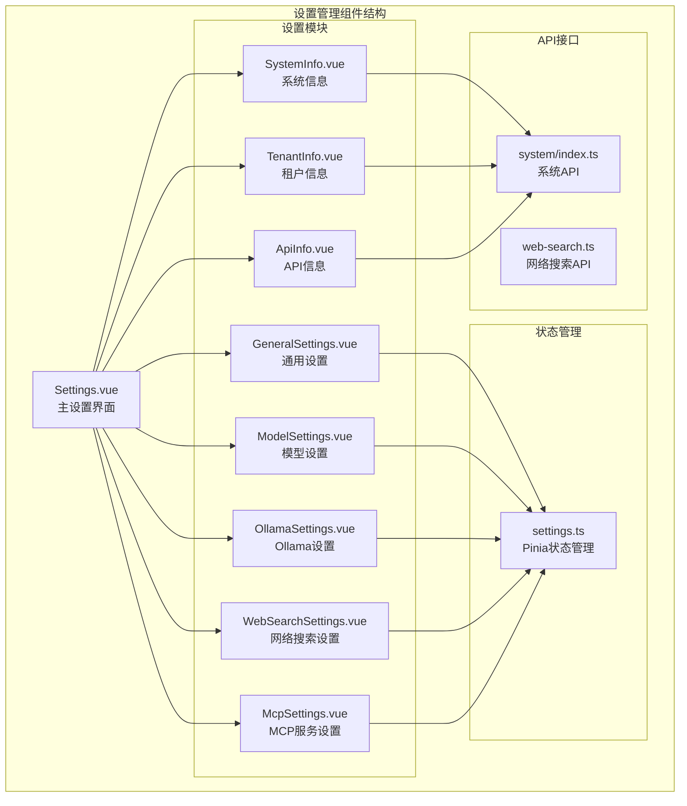

**图表来源**
- [Settings.vue](file://frontend/src/views/settings/Settings.vue#L1-L547)
- [settings.ts](file://frontend/src/stores/settings.ts#L1-L342)

**章节来源**
- [Settings.vue](file://frontend/src/views/settings/Settings.vue#L1-L547)
- [settings.ts](file://frontend/src/stores/settings.ts#L1-L342)

## 核心组件

### 设置存储管理

设置存储使用Pinia状态管理库，提供集中化的配置管理：

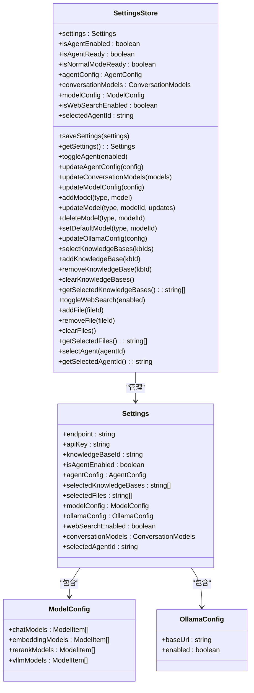

**图表来源**
- [settings.ts](file://frontend/src/stores/settings.ts#L4-L92)

设置存储提供了以下核心功能：
- **配置持久化**：自动保存到localStorage
- **配置验证**：提供配置完整性检查
- **配置更新**：支持增量更新和批量更新
- **配置查询**：提供便捷的配置访问接口

**章节来源**
- [settings.ts](file://frontend/src/stores/settings.ts#L94-L342)

### 主设置界面

主设置界面采用模态框设计，提供导航式布局：

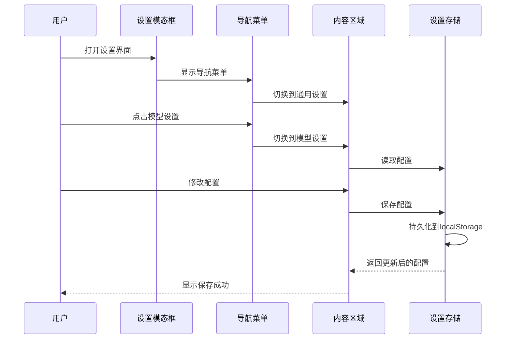

**图表来源**
- [Settings.vue](file://frontend/src/views/settings/Settings.vue#L125-L273)

**章节来源**
- [Settings.vue](file://frontend/src/views/settings/Settings.vue#L125-L273)

## 架构概览

设置管理组件采用分层架构设计，确保各模块间的松耦合和高内聚：

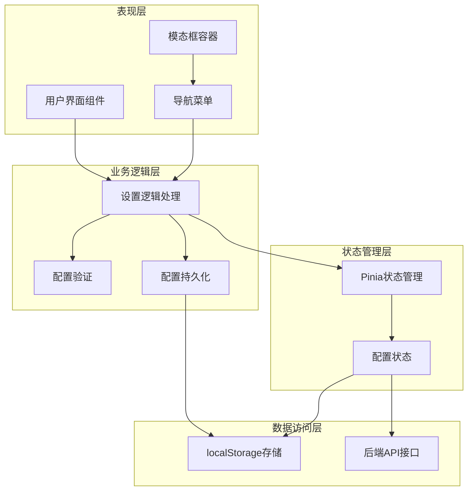

**图表来源**
- [Settings.vue](file://frontend/src/views/settings/Settings.vue#L1-L547)
- [settings.ts](file://frontend/src/stores/settings.ts#L1-L342)

## 详细组件分析

### 通用设置组件

通用设置组件负责管理应用的基本配置：

#### 功能特性
- **语言切换**：支持中英文切换
- **主题管理**：基础主题配置
- **配置持久化**：自动保存到localStorage

#### 配置项管理
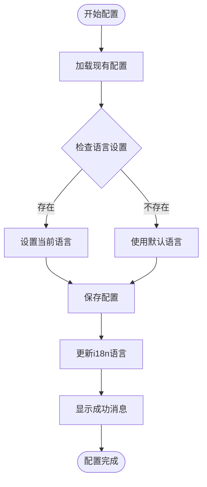

**图表来源**
- [GeneralSettings.vue](file://frontend/src/views/settings/GeneralSettings.vue#L31-L74)

**章节来源**
- [GeneralSettings.vue](file://frontend/src/views/settings/GeneralSettings.vue#L1-L147)

### 模型设置组件

模型设置组件提供完整的模型管理功能：

#### 模型类型分类
- **对话模型**：用于聊天对话的LLM模型
- **嵌入模型**：用于文本向量化处理
- **重排序模型**：用于搜索结果重排序
- **VLLM模型**：用于视觉语言模型

#### 模型管理功能
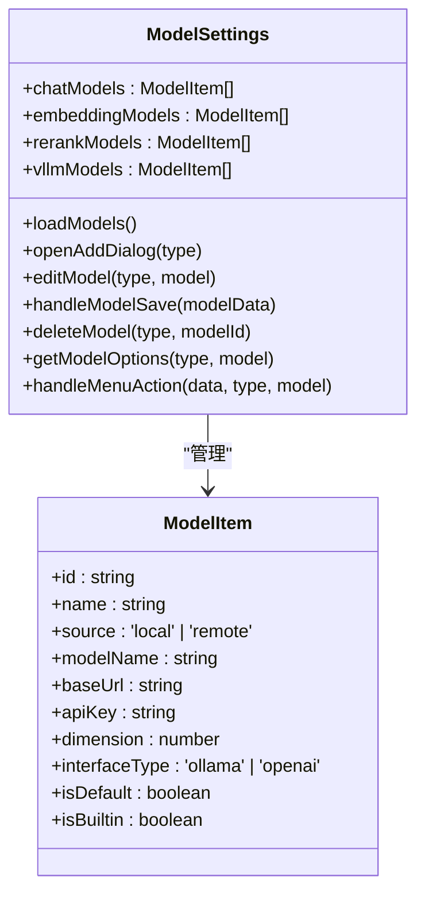

**图表来源**
- [ModelSettings.vue](file://frontend/src/views/settings/ModelSettings.vue#L234-L506)

#### 验证规则
- **模型名称**：必填，长度限制
- **远程模型**：必须提供base_url
- **嵌入模型**：必须提供维度信息（128-4096范围）

**章节来源**
- [ModelSettings.vue](file://frontend/src/views/settings/ModelSettings.vue#L1-L889)

### Ollama设置组件

Ollama设置组件专门管理本地AI模型服务：

#### 连接管理
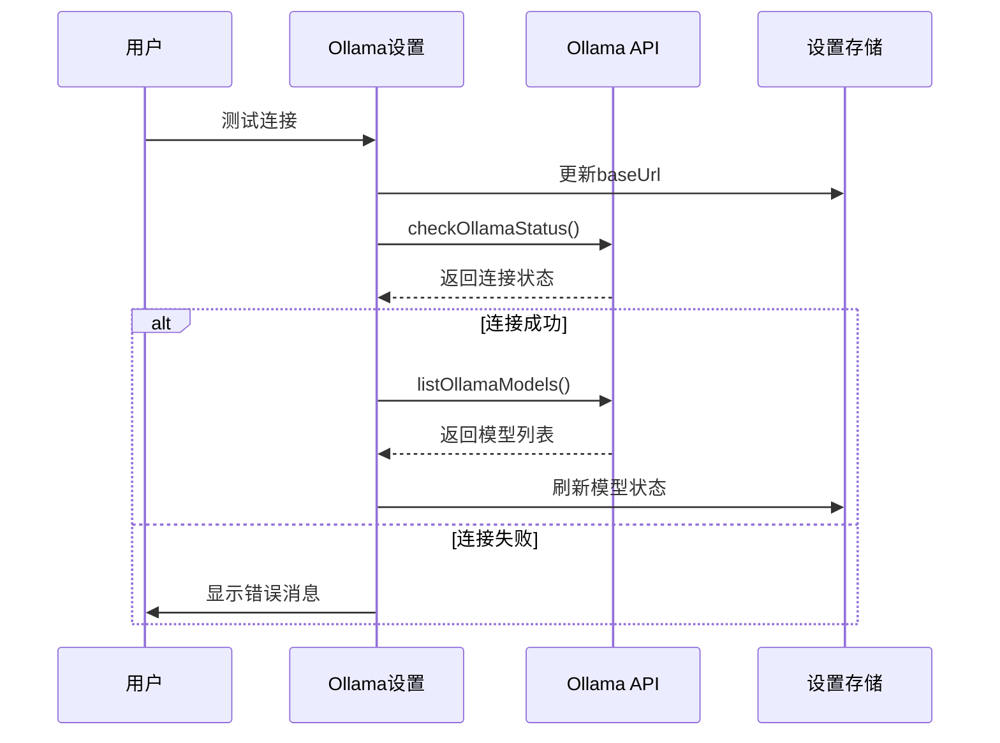

**图表来源**
- [OllamaSettings.vue](file://frontend/src/views/settings/OllamaSettings.vue#L175-L366)

#### 模型下载流程
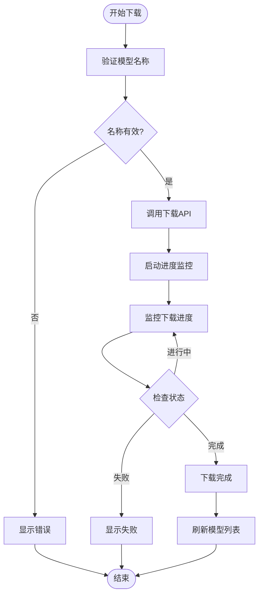

**图表来源**
- [OllamaSettings.vue](file://frontend/src/views/settings/OllamaSettings.vue#L273-L326)

**章节来源**
- [OllamaSettings.vue](file://frontend/src/views/settings/OllamaSettings.vue#L1-L619)

### 网络搜索设置组件

网络搜索设置组件管理搜索引擎配置：

#### 配置项管理
- **搜索引擎提供商**：支持多种搜索引擎
- **API密钥管理**：安全的API密钥存储
- **搜索结果数量**：可配置的最大结果数
- **压缩方法**：支持不同的内容压缩策略
- **黑名单管理**：域名级别的内容过滤

#### 防抖保存机制
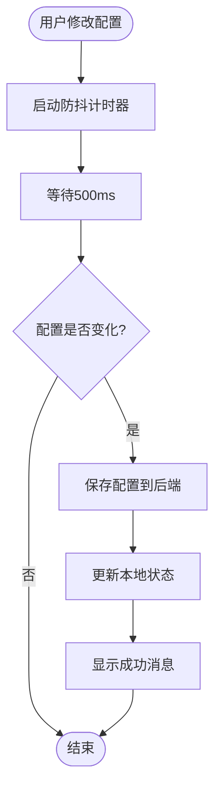

**图表来源**
- [WebSearchSettings.vue](file://frontend/src/views/settings/WebSearchSettings.vue#L334-L374)

**章节来源**
- [WebSearchSettings.vue](file://frontend/src/views/settings/WebSearchSettings.vue#L1-L547)

### 系统信息组件

系统信息组件提供系统运行状态的实时监控：

#### 信息获取流程
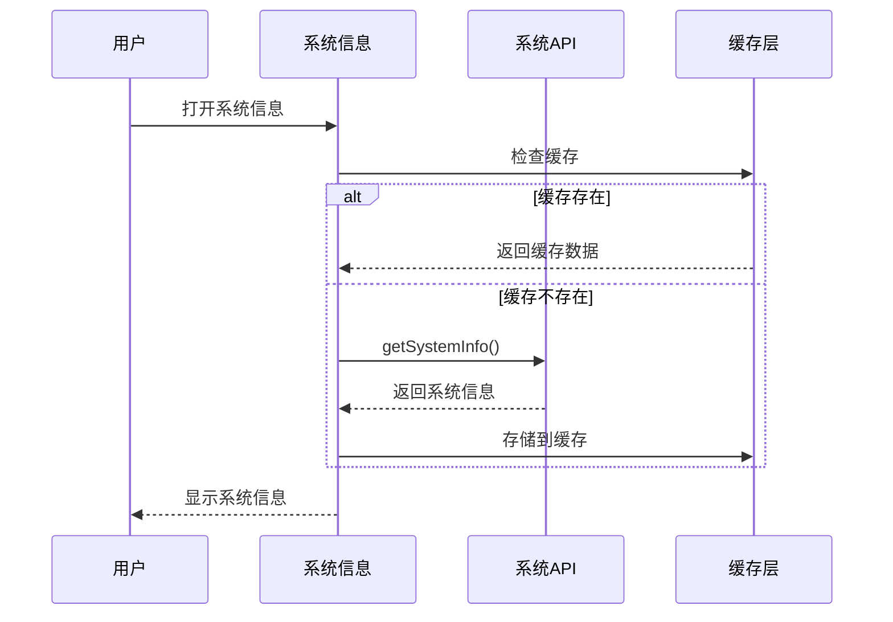

**图表来源**
- [SystemInfo.vue](file://frontend/src/views/settings/SystemInfo.vue#L100-L136)

**章节来源**
- [SystemInfo.vue](file://frontend/src/views/settings/SystemInfo.vue#L1-L235)

### 租户信息组件

租户信息组件显示当前用户的租户详细信息：

#### 存储配额管理
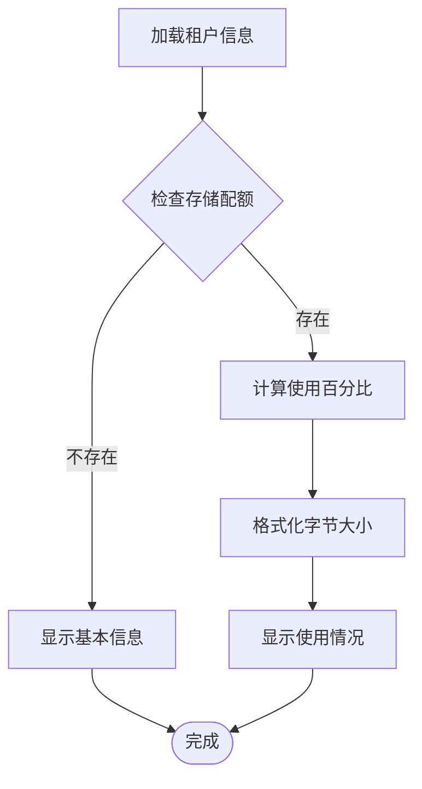

**图表来源**
- [TenantInfo.vue](file://frontend/src/views/settings/TenantInfo.vue#L229-L237)

**章节来源**
- [TenantInfo.vue](file://frontend/src/views/settings/TenantInfo.vue#L1-L352)

### API信息组件

API信息组件管理API密钥和文档访问：

#### API密钥安全处理
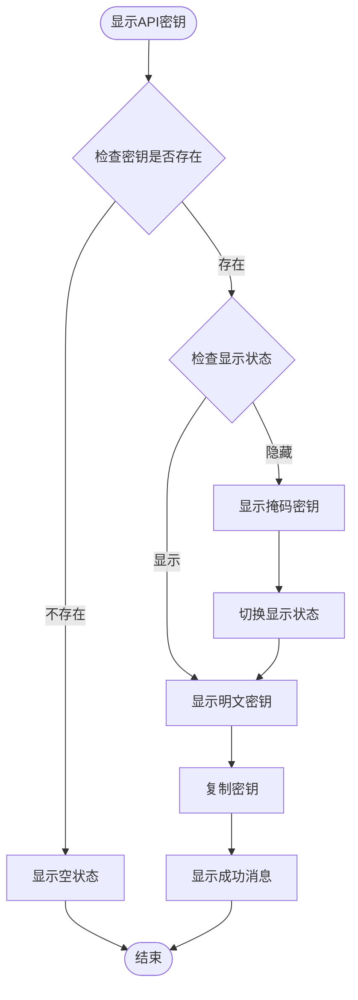

**图表来源**
- [ApiInfo.vue](file://frontend/src/views/settings/ApiInfo.vue#L138-L211)

**章节来源**
- [ApiInfo.vue](file://frontend/src/views/settings/ApiInfo.vue#L1-L345)

### MCP设置组件

MCP设置组件管理MCP服务配置：

#### 服务生命周期管理
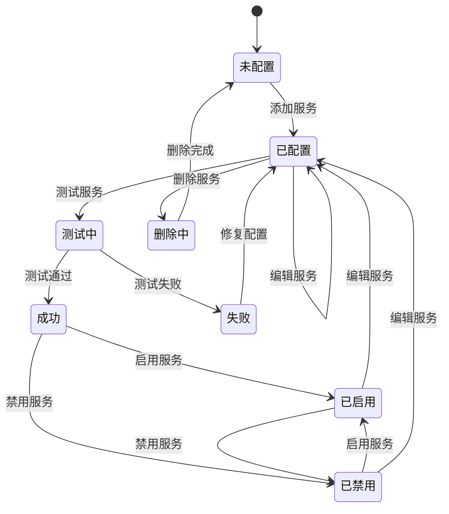

**图表来源**
- [McpSettings.vue](file://frontend/src/views/settings/McpSettings.vue#L116-L246)

**章节来源**
- [McpSettings.vue](file://frontend/src/views/settings/McpSettings.vue#L1-L471)

## 依赖关系分析

设置管理组件的依赖关系呈现清晰的层次结构：

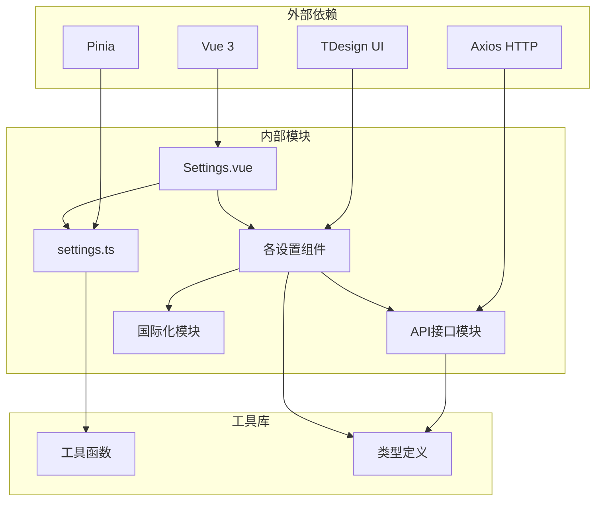

**图表来源**
- [Settings.vue](file://frontend/src/views/settings/Settings.vue#L125-L137)
- [settings.ts](file://frontend/src/stores/settings.ts#L1-L3)

### 核心依赖关系

| 模块 | 主要依赖 | 用途 |
|------|----------|------|
| Settings.vue | Vue Router, Pinia, TDesign | 主界面容器和导航 |
| settings.ts | Pinia, localStorage | 状态管理和持久化 |
| ModelSettings.vue | API/model, ModelEditorDialog | 模型管理功能 |
| OllamaSettings.vue | API/initialization | Ollama服务管理 |
| WebSearchSettings.vue | API/web-search | 网络搜索配置 |
| SystemInfo.vue | API/system | 系统信息获取 |
| TenantInfo.vue | API/auth | 租户信息管理 |
| ApiInfo.vue | API/auth | API密钥管理 |

**章节来源**
- [Settings.vue](file://frontend/src/views/settings/Settings.vue#L125-L137)
- [settings.ts](file://frontend/src/stores/settings.ts#L1-L3)

## 性能考虑

设置管理组件在设计时充分考虑了性能优化：

### 1. 懒加载策略
- **按需加载**：只有在用户访问特定设置模块时才加载对应组件
- **动态导入**：使用Vue的动态导入实现代码分割
- **路由懒加载**：通过路由配置实现组件懒加载

### 2. 状态管理优化
- **局部状态**：每个设置组件维护自己的局部状态
- **状态缓存**：使用localStorage缓存配置，减少API调用
- **防抖机制**：网络搜索设置使用防抖保存，避免频繁请求

### 3. 渲染优化
- **虚拟滚动**：大量模型列表使用虚拟滚动提升性能
- **条件渲染**：使用v-if实现条件渲染，减少DOM节点
- **计算属性**：使用computed属性缓存计算结果

### 4. 网络请求优化
- **请求合并**：多个设置项的变更合并为一次请求
- **缓存策略**：系统信息和提供商列表使用缓存
- **错误重试**：网络异常时提供自动重试机制

## 故障排除指南

### 常见问题及解决方案

#### 1. 设置无法保存
**症状**：修改设置后刷新页面发现配置丢失
**原因**：localStorage访问权限问题或浏览器兼容性问题
**解决方案**：
- 检查浏览器是否支持localStorage
- 确认浏览器未处于隐私模式
- 清除浏览器缓存后重试

#### 2. 模型配置验证失败
**症状**：添加或编辑模型时报验证错误
**原因**：配置项不符合验证规则
**解决方案**：
- 检查模型名称是否为空且长度合理
- 确认远程模型的base_url格式正确
- 验证嵌入模型的维度值在允许范围内

#### 3. Ollama连接失败
**症状**：测试Ollama连接显示失败
**原因**：网络连接或服务配置问题
**解决方案**：
- 检查Ollama服务是否正常运行
- 验证base_url配置是否正确
- 确认防火墙设置允许连接

#### 4. 网络搜索配置异常
**症状**：网络搜索功能无法正常工作
**原因**：API密钥配置或提供商选择问题
**解决方案**：
- 确认API密钥是否正确配置
- 检查提供商是否支持所需的API功能
- 验证网络连接是否正常

#### 5. 系统信息加载失败
**症状**：系统信息页面显示加载错误
**原因**：后端API不可用或网络问题
**解决方案**：
- 检查后端服务状态
- 确认网络连接稳定
- 尝试刷新页面重新加载

### 调试技巧

#### 1. 开发者工具使用
- **Vue DevTools**：检查组件状态和props传递
- **Network面板**：监控API请求和响应
- **Console面板**：查看错误日志和警告信息

#### 2. 日志记录
- **配置变更日志**：记录重要的配置变更操作
- **错误追踪**：捕获并记录异常信息
- **性能监控**：监控组件渲染和API调用性能

#### 3. 状态检查
- **Pinia状态检查**：验证store中的配置状态
- **localStorage检查**：确认配置是否正确保存
- **组件状态同步**：确保UI状态与数据状态一致

**章节来源**
- [settings.ts](file://frontend/src/stores/settings.ts#L141-L342)
- [ModelSettings.vue](file://frontend/src/views/settings/ModelSettings.vue#L357-L430)
- [OllamaSettings.vue](file://frontend/src/views/settings/OllamaSettings.vue#L195-L227)

## 结论

WiseDx设置管理组件是一个功能完整、架构清晰的配置管理解决方案。该组件具有以下优势：

### 技术优势
- **模块化设计**：每个设置模块独立管理，便于维护和扩展
- **状态管理**：使用Pinia实现集中化的状态管理
- **类型安全**：完整的TypeScript类型定义确保代码质量
- **异步处理**：合理的异步操作处理提升用户体验

### 用户体验
- **直观界面**：清晰的导航和布局设计
- **实时反馈**：即时的配置变更反馈
- **错误处理**：完善的错误提示和恢复机制
- **国际化支持**：完整的中英文双语支持

### 最佳实践建议

#### 1. 配置管理最佳实践
- **配置验证**：在保存前进行完整的配置验证
- **版本控制**：对重要配置变更进行版本跟踪
- **备份策略**：定期备份关键配置信息
- **权限控制**：基于角色的配置访问控制

#### 2. 性能优化建议
- **懒加载**：继续优化组件的懒加载策略
- **缓存机制**：增强数据缓存和状态缓存
- **资源管理**：优化大型列表的渲染性能
- **网络优化**：减少不必要的API调用

#### 3. 安全考虑
- **敏感信息保护**：API密钥等敏感信息的安全存储
- **输入验证**：严格的输入验证和清理
- **权限检查**：配置变更的权限验证
- **审计日志**：重要的配置变更记录

该设置管理组件为WiseDx平台提供了强大的配置管理能力，为用户提供了良好的使用体验，同时也为系统的扩展和维护奠定了坚实的基础。