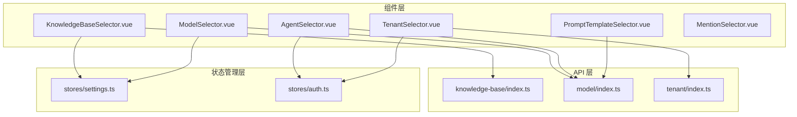
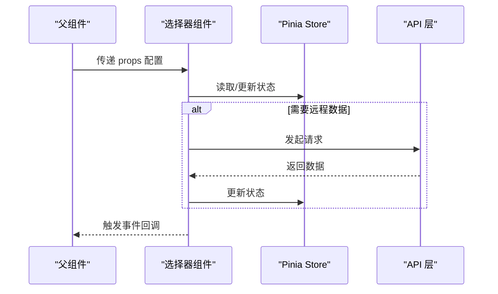
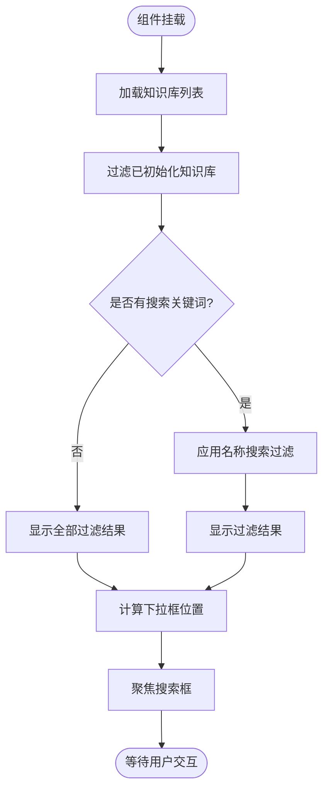
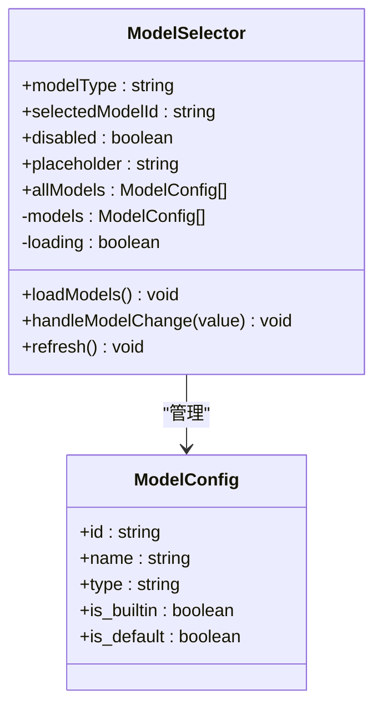
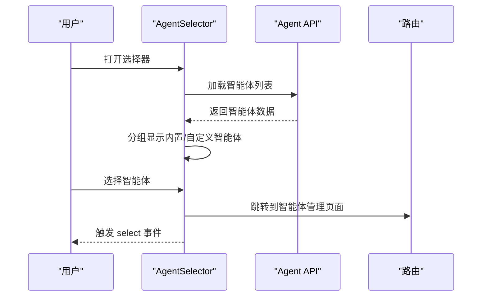
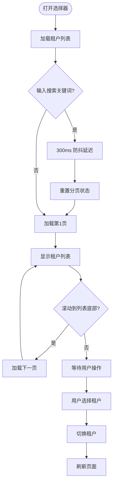
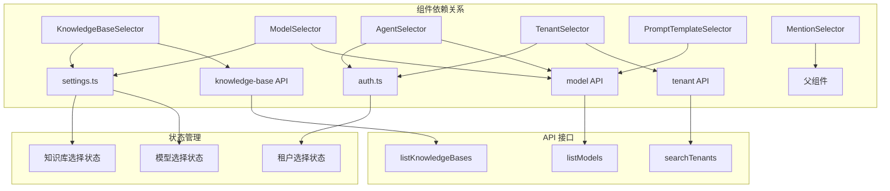

# 选择器组件

<cite>
**本文档引用的文件**
- [KnowledgeBaseSelector.vue](file://frontend/src/components/KnowledgeBaseSelector.vue)
- [ModelSelector.vue](file://frontend/src/components/ModelSelector.vue)
- [AgentSelector.vue](file://frontend/src/components/AgentSelector.vue)
- [TenantSelector.vue](file://frontend/src/components/TenantSelector.vue)
- [PromptTemplateSelector.vue](file://frontend/src/components/PromptTemplateSelector.vue)
- [MentionSelector.vue](file://frontend/src/components/MentionSelector.vue)
- [index.ts](file://frontend/src/api/knowledge-base/index.ts)
- [index.ts](file://frontend/src/api/model/index.ts)
- [index.ts](file://frontend/src/api/tenant/index.ts)
- [settings.ts](file://frontend/src/stores/settings.ts)
- [auth.ts](file://frontend/src/stores/auth.ts)
- [AgentEditorModal.vue](file://frontend/src/views/agent/AgentEditorModal.vue)
- [index.vue](file://frontend/src/views/platform/index.vue)
- [index.vue](file://frontend/src/views/chat/index.vue)
</cite>

## 目录
1. [简介](#简介)
2. [项目结构](#项目结构)
3. [核心组件](#核心组件)
4. [架构概览](#架构概览)
5. [详细组件分析](#详细组件分析)
6. [依赖关系分析](#依赖关系分析)
7. [性能考量](#性能考量)
8. [故障排除指南](#故障排除指南)
9. [结论](#结论)

## 简介
本文件详细介绍了 WiseDx 前端的选择器组件体系，包括知识库选择器、模型选择器、代理选择器、租户选择器、提示模板选择器和提及选择器。文档涵盖各组件的功能特性、数据绑定方式、选项过滤机制、远程加载流程、搜索功能实现、多选支持以及禁用状态处理，并提供实际集成示例和错误处理方案。

## 项目结构
选择器组件位于前端项目的组件目录中，每个组件都采用独立的 Vue 单文件组件格式，配合相应的 API 接口和 Pinia Store 实现数据流管理。

**图表来源**
- [KnowledgeBaseSelector.vue](file://frontend/src/components/KnowledgeBaseSelector.vue#L1-L501)
- [ModelSelector.vue](file://frontend/src/components/ModelSelector.vue#L1-L169)
- [AgentSelector.vue](file://frontend/src/components/AgentSelector.vue#L1-L594)
- [TenantSelector.vue](file://frontend/src/components/TenantSelector.vue#L1-L536)
- [PromptTemplateSelector.vue](file://frontend/src/components/PromptTemplateSelector.vue#L1-L262)
- [MentionSelector.vue](file://frontend/src/components/MentionSelector.vue#L1-L244)
- [index.ts](file://frontend/src/api/knowledge-base/index.ts#L1-L275)
- [index.ts](file://frontend/src/api/model/index.ts#L1-L125)
- [index.ts](file://frontend/src/api/tenant/index.ts#L1-L84)
- [settings.ts](file://frontend/src/stores/settings.ts#L1-L342)
- [auth.ts](file://frontend/src/stores/auth.ts#L1-L233)

**章节来源**
- [KnowledgeBaseSelector.vue](file://frontend/src/components/KnowledgeBaseSelector.vue#L1-L501)
- [ModelSelector.vue](file://frontend/src/components/ModelSelector.vue#L1-L169)
- [AgentSelector.vue](file://frontend/src/components/AgentSelector.vue#L1-L594)
- [TenantSelector.vue](file://frontend/src/components/TenantSelector.vue#L1-L536)
- [PromptTemplateSelector.vue](file://frontend/src/components/PromptTemplateSelector.vue#L1-L262)
- [MentionSelector.vue](file://frontend/src/components/MentionSelector.vue#L1-L244)

## 核心组件
本节概述六个选择器组件的核心职责和通用特性：

- **知识库选择器**：提供多选知识库的能力，支持搜索过滤、键盘导航、远程加载和位置自适应定位。
- **模型选择器**：基于 TDesign Select 组件封装，支持按类型过滤、远程加载、添加模型入口和禁用状态。
- **代理选择器**：展示内置和自定义智能体，提供分组显示、工具提示、能力标签和快速切换。
- **租户选择器**：实现租户搜索、分页加载、选中状态管理和切换后的页面刷新。
- **提示模板选择器**：弹出式模板选择器，支持按模板类型分类、标签显示和内容选择回调。
- **提及选择器**：聊天输入场景下的提及菜单，支持分组显示、滚动加载更多和键盘导航。

**章节来源**
- [KnowledgeBaseSelector.vue](file://frontend/src/components/KnowledgeBaseSelector.vue#L106-L114)
- [ModelSelector.vue](file://frontend/src/components/ModelSelector.vue#L48-L80)
- [AgentSelector.vue](file://frontend/src/components/AgentSelector.vue#L187-L210)
- [TenantSelector.vue](file://frontend/src/components/TenantSelector.vue#L123-L125)
- [PromptTemplateSelector.vue](file://frontend/src/components/PromptTemplateSelector.vue#L95-L113)
- [MentionSelector.vue](file://frontend/src/components/MentionSelector.vue#L67-L68)

## 架构概览
选择器组件遵循统一的数据流模式：组件通过 props 接收配置，使用 Pinia Store 管理全局状态，通过 API 层进行远程数据交互，并通过 emits 与父组件通信。

**图表来源**
- [settings.ts](file://frontend/src/stores/settings.ts#L255-L280)
- [auth.ts](file://frontend/src/stores/auth.ts#L83-L95)
- [index.ts](file://frontend/src/api/knowledge-base/index.ts#L4-L6)
- [index.ts](file://frontend/src/api/model/index.ts#L50-L69)
- [index.ts](file://frontend/src/api/tenant/index.ts#L56-L82)

## 详细组件分析

### 知识库选择器 (KnowledgeBaseSelector)
知识库选择器是一个下拉式选择器，支持多选、搜索过滤和键盘导航。

#### 数据绑定与状态管理
- 通过 `useSettingsStore` 管理选中的知识库 ID 列表
- `selectedKnowledgeBases` 计算属性提供当前选中状态
- `filteredKnowledgeBases` 计算属性实现搜索过滤

#### 远程加载机制
- 使用 `listKnowledgeBases()` API 获取知识库列表
- 仅显示已初始化（具备 embedding 和 summary 模型）的知识库
- 错误处理：捕获异常并记录国际化错误消息

#### 搜索与过滤
- 支持名称关键字搜索（不区分大小写）
- 过滤逻辑：先过滤已初始化状态，再应用搜索条件
- 空状态处理：显示"无匹配"或"无知识库"

#### 位置自适应定位
- 支持多种锚点类型：DOM 节点、Vue ref、组件实例
- 动态计算下拉框位置，优先向下弹出，空间不足时向上弹出
- 视口边界处理：确保不超出屏幕范围

**图表来源**
- [KnowledgeBaseSelector.vue](file://frontend/src/components/KnowledgeBaseSelector.vue#L164-L171)
- [KnowledgeBaseSelector.vue](file://frontend/src/components/KnowledgeBaseSelector.vue#L106-L114)
- [KnowledgeBaseSelector.vue](file://frontend/src/components/KnowledgeBaseSelector.vue#L173-L302)

**章节来源**
- [KnowledgeBaseSelector.vue](file://frontend/src/components/KnowledgeBaseSelector.vue#L65-L345)
- [index.ts](file://frontend/src/api/knowledge-base/index.ts#L4-L6)
- [settings.ts](file://frontend/src/stores/settings.ts#L255-L280)

### 模型选择器 (ModelSelector)
模型选择器基于 TDesign Select 组件，提供模型选择和添加入口。

#### 数据绑定与过滤
- `modelType` 属性限定模型类型（KnowledgeQA/Embedding/Rerank/VLLM）
- `allModels` 属性支持外部传入完整模型列表
- 内部通过 `type === props.modelType` 进行过滤

#### 远程加载与错误处理
- 未提供 `allModels` 时自动调用 `listModels()` API
- 加载状态通过 `loading` 属性控制
- 错误时显示消息提示并清空模型列表

#### 多选与禁用状态
- 支持 `disabled` 属性禁用选择器
- 提供 `placeholder` 自定义占位符
- 添加模型选项：通过特殊值 `__add_model__` 触发添加事件

**图表来源**
- [ModelSelector.vue](file://frontend/src/components/ModelSelector.vue#L42-L133)
- [index.ts](file://frontend/src/api/model/index.ts#L4-L29)

**章节来源**
- [ModelSelector.vue](file://frontend/src/components/ModelSelector.vue#L42-L133)
- [index.ts](file://frontend/src/api/model/index.ts#L49-L105)

### 代理选择器 (AgentSelector)
代理选择器用于选择智能体，支持内置和自定义智能体的分组显示。

#### 分组与能力展示
- 内置智能体：快速问答、智能推理等
- 自定义智能体：从 API 获取的用户创建智能体
- 工具提示：显示智能体的详细能力和配置信息

#### 位置定位与交互
- 支持 `anchorEl` 锚点定位
- 自动计算上下弹出方向
- 提供"管理智能体"链接跳转

**图表来源**
- [AgentSelector.vue](file://frontend/src/components/AgentSelector.vue#L230-L243)
- [AgentSelector.vue](file://frontend/src/components/AgentSelector.vue#L245-L301)

**章节来源**
- [AgentSelector.vue](file://frontend/src/components/AgentSelector.vue#L164-L318)

### 租户选择器 (TenantSelector)
租户选择器实现租户的搜索、分页和切换功能。

#### 搜索与分页
- 支持关键词搜索和租户 ID 精确匹配
- 分页加载：滚动到底部自动加载下一页
- 搜索防抖：300ms 延迟优化性能

#### 选中状态与切换
- 当前租户高亮显示
- 支持切换到默认租户（传入 null）
- 切换成功后自动刷新页面

**图表来源**
- [TenantSelector.vue](file://frontend/src/components/TenantSelector.vue#L177-L215)
- [TenantSelector.vue](file://frontend/src/components/TenantSelector.vue#L230-L240)

**章节来源**
- [TenantSelector.vue](file://frontend/src/components/TenantSelector.vue#L79-L252)
- [index.ts](file://frontend/src/api/tenant/index.ts#L56-L82)
- [auth.ts](file://frontend/src/stores/auth.ts#L83-L95)

### 提示模板选择器 (PromptTemplateSelector)
提示模板选择器提供弹出式模板选择功能。

#### 模板分类与显示
- 支持多种模板类型：systemPrompt、contextTemplate、rewriteSystem、rewriteUser、fallback
- 按类型映射到对应的模板配置
- 标签显示：知识库关联、网络搜索支持

#### 弹出式交互
- 点击触发弹出窗口
- 首次打开时懒加载模板数据
- 选择后通过事件回调返回模板内容

**章节来源**
- [PromptTemplateSelector.vue](file://frontend/src/components/PromptTemplateSelector.vue#L56-L125)

### 提及选择器 (MentionSelector)
提及选择器用于聊天输入场景，提供知识库和文件的提及功能。

#### 分组显示与滚动
- 知识库分组：FAQ 和文档类型分别显示
- 文件分组：显示文件名和所属知识库
- 滚动加载：接近底部时触发加载更多事件

#### 键盘导航与激活
- 支持 `activeIndex` 属性控制激活项
- 自动滚动到激活项位置
- 鼠标悬停同步激活状态

**章节来源**
- [MentionSelector.vue](file://frontend/src/components/MentionSelector.vue#L51-L117)

## 依赖关系分析

**图表来源**
- [settings.ts](file://frontend/src/stores/settings.ts#L255-L280)
- [auth.ts](file://frontend/src/stores/auth.ts#L83-L95)
- [index.ts](file://frontend/src/api/knowledge-base/index.ts#L4-L6)
- [index.ts](file://frontend/src/api/model/index.ts#L50-L69)
- [index.ts](file://frontend/src/api/tenant/index.ts#L56-L82)

**章节来源**
- [settings.ts](file://frontend/src/stores/settings.ts#L1-L342)
- [auth.ts](file://frontend/src/stores/auth.ts#L1-L233)

## 性能考量
- **防抖优化**：租户搜索使用 300ms 防抖，减少 API 调用频率
- **懒加载**：提示模板选择器首次打开时才加载模板数据
- **虚拟滚动**：长列表组件建议实现虚拟滚动以提升性能
- **内存管理**：组件卸载时清理事件监听器和定时器
- **缓存策略**：Pinia Store 自动缓存用户选择状态

## 故障排除指南

### 常见问题与解决方案

#### 知识库选择器无法加载
- 检查网络连接和 API 可达性
- 确认知识库已正确初始化（具备 embedding 和 summary 模型）
- 查看浏览器控制台错误日志

#### 模型选择器无数据
- 验证 `modelType` 参数是否正确
- 检查 `allModels` 属性是否正确传入
- 确认 API 返回数据格式符合预期

#### 租户选择器搜索无效
- 确认搜索关键词长度和格式
- 检查防抖定时器是否正常工作
- 验证分页参数是否正确传递

#### 代理选择器显示异常
- 检查锚点元素是否存在
- 确认定位计算函数返回有效坐标
- 验证工具提示组件样式是否正确加载

**章节来源**
- [KnowledgeBaseSelector.vue](file://frontend/src/components/KnowledgeBaseSelector.vue#L164-L171)
- [ModelSelector.vue](file://frontend/src/components/ModelSelector.vue#L87-L110)
- [TenantSelector.vue](file://frontend/src/components/TenantSelector.vue#L217-L228)
- [AgentSelector.vue](file://frontend/src/components/AgentSelector.vue#L245-L301)

## 结论
WiseDx 的选择器组件体系提供了完整的数据选择和交互体验，具有以下特点：
- 统一的状态管理模式，便于组件间协作
- 完善的远程数据加载机制，支持搜索、过滤和分页
- 丰富的交互功能，包括键盘导航、工具提示和弹出式界面
- 良好的错误处理和用户体验设计
- 可扩展的架构，支持自定义配置和第三方集成

这些组件为 WiseDx 的知识库管理、模型配置、智能体选择和租户切换等功能提供了坚实的基础。