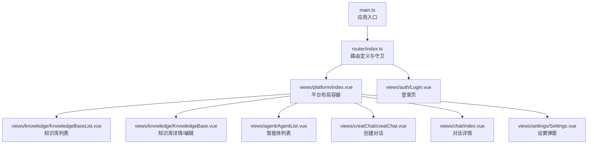
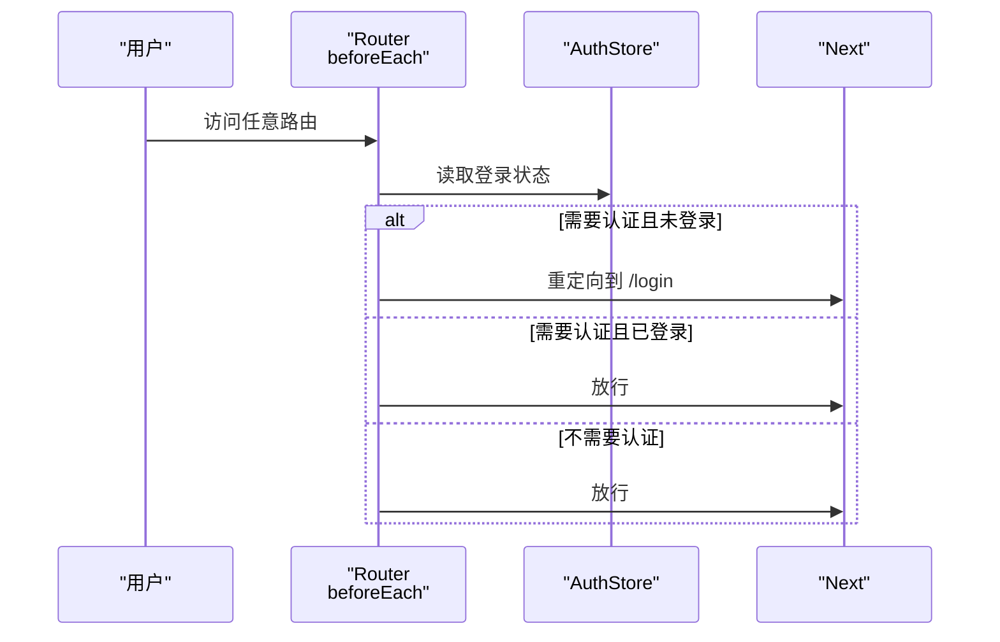
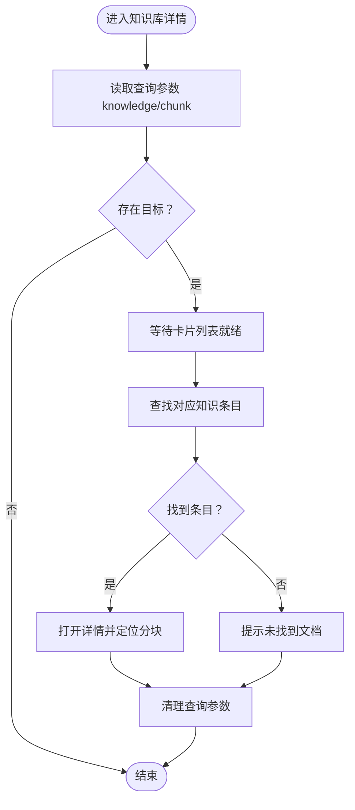
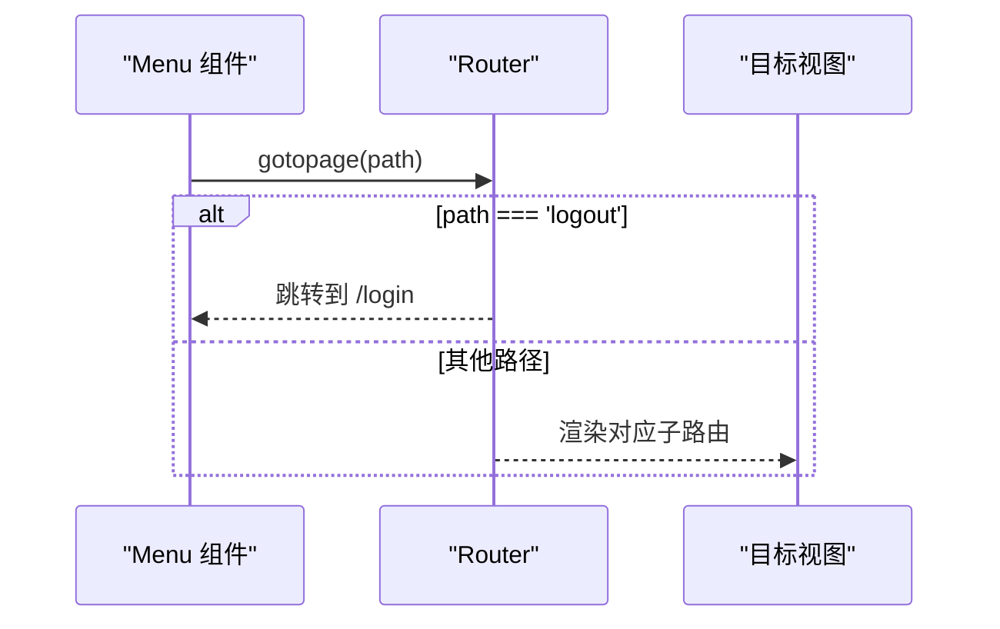
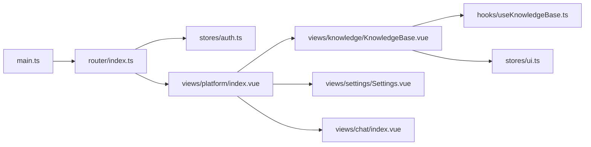

# 路由配置

<cite>
**本文引用的文件**
- [frontend/src/router/index.ts](file://frontend/src/router/index.ts)
- [frontend/src/main.ts](file://frontend/src/main.ts)
- [frontend/src/stores/auth.ts](file://frontend/src/stores/auth.ts)
- [frontend/src/views/platform/index.vue](file://frontend/src/views/platform/index.vue)
- [frontend/src/views/knowledge/KnowledgeBase.vue](file://frontend/src/views/knowledge/KnowledgeBase.vue)
- [frontend/src/views/settings/Settings.vue](file://frontend/src/views/settings/Settings.vue)
- [frontend/src/views/chat/index.vue](file://frontend/src/views/chat/index.vue)
- [frontend/src/hooks/useKnowledgeBase.ts](file://frontend/src/hooks/useKnowledgeBase.ts)
- [frontend/src/stores/ui.ts](file://frontend/src/stores/ui.ts)
- [frontend/src/components/menu.vue](file://frontend/src/components/menu.vue)
- [frontend/package.json](file://frontend/package.json)
- [docs/notes/接口分析.md](file://docs/notes/接口分析.md)
</cite>

## 目录
1. [简介](#简介)
2. [项目结构](#项目结构)
3. [核心组件](#核心组件)
4. [架构总览](#架构总览)
5. [详细组件分析](#详细组件分析)
6. [依赖关系分析](#依赖关系分析)
7. [性能考虑](#性能考虑)
8. [故障排查指南](#故障排查指南)
9. [结论](#结论)
10. [附录](#附录)

## 简介
本文件系统性梳理 WiseDx 前端的 Vue Router 路由配置与使用，覆盖以下主题：
- 路由定义与嵌套路由结构
- 导航守卫与路由元信息
- 路由懒加载与模块化组织
- 主页面、知识库、设置、认证等路由的职责边界
- 路由参数传递、查询字符串处理、路由元信息使用
- 路由导航最佳实践（权限控制、面包屑、路由缓存）
- 路由调试与性能优化方法

## 项目结构
WiseDx 前端基于 Vue 3 + Vue Router 4 + Pinia 构建，路由集中于 router/index.ts，配合平台级布局组件 views/platform/index.vue 提供统一的侧边菜单与子路由渲染。

图表来源
- [frontend/src/router/index.ts](file://frontend/src/router/index.ts#L1-L127)
- [frontend/src/views/platform/index.vue](file://frontend/src/views/platform/index.vue#L1-L158)

章节来源
- [frontend/src/router/index.ts](file://frontend/src/router/index.ts#L1-L127)
- [frontend/src/views/platform/index.vue](file://frontend/src/views/platform/index.vue#L1-L158)
- [frontend/src/main.ts](file://frontend/src/main.ts#L1-L20)

## 核心组件
- 路由器实例与守卫
  - 使用 createWebHistory 与 createRouter 创建路由器
  - 定义根路径重定向、登录页、平台主框架及其子路由
  - beforeEach 导航守卫基于 meta 字段进行权限与初始化校验
- 平台布局容器
  - RouterView 渲染当前子路由
  - 统一菜单、设置弹窗、全局拖拽上传遮罩
- 知识库视图
  - 支持路由参数 :kbId
  - 查询字符串处理（如定位到特定知识条目/分块）
- 设置视图
  - 作为弹窗在 /platform/settings 展示，内部含多级导航
- 聊天视图
  - 路由参数 :chatid，支持会话切换与历史消息加载
- 钩子与状态
  - useKnowledgeBase 钩子在多处读取路由参数并驱动数据加载
  - useUIStore 用于跨组件共享设置弹窗状态与当前选中标签

章节来源
- [frontend/src/router/index.ts](file://frontend/src/router/index.ts#L1-L127)
- [frontend/src/views/platform/index.vue](file://frontend/src/views/platform/index.vue#L1-L158)
- [frontend/src/views/knowledge/KnowledgeBase.vue](file://frontend/src/views/knowledge/KnowledgeBase.vue#L1-L800)
- [frontend/src/views/settings/Settings.vue](file://frontend/src/views/settings/Settings.vue#L1-L547)
- [frontend/src/views/chat/index.vue](file://frontend/src/views/chat/index.vue#L1-L800)
- [frontend/src/hooks/useKnowledgeBase.ts](file://frontend/src/hooks/useKnowledgeBase.ts#L1-L199)
- [frontend/src/stores/ui.ts](file://frontend/src/stores/ui.ts#L1-L115)

## 架构总览
路由架构围绕“平台主框架 + 子路由”的模式组织，平台容器负责菜单与全局行为，子路由按功能域划分（知识库、智能体、对话、设置）。导航守卫通过 meta 字段实现“是否需要认证/初始化”的统一策略。

图表来源
- [frontend/src/router/index.ts](file://frontend/src/router/index.ts#L83-L124)
- [frontend/src/stores/auth.ts](file://frontend/src/stores/auth.ts#L1-L233)

章节来源
- [frontend/src/router/index.ts](file://frontend/src/router/index.ts#L83-L124)
- [frontend/src/stores/auth.ts](file://frontend/src/stores/auth.ts#L1-L233)

## 详细组件分析

### 路由定义与嵌套路由
- 根路径与登录页
  - "/" 重定向至 "/platform/knowledge-bases"
  - "/login" 为公开路由，requiresAuth: false
- 平台主框架
  - "/platform" 作为父路由，包含知识库列表、知识库详情、智能体列表、创建对话、对话详情、设置等子路由
  - 子路由均声明 requiresAuth: true，确保受保护
- 知识库详情路由
  - "/platform/knowledge-bases/:kbId" 与 "/knowledgeBase" 均指向知识库详情视图，后者为旧路径别名
- 对话路由
  - "/platform/chat/:chatid" 为对话详情路由，支持会话切换与历史消息加载
- 设置路由
  - "/platform/settings" 为设置弹窗入口，平台容器内渲染

章节来源
- [frontend/src/router/index.ts](file://frontend/src/router/index.ts#L8-L81)

### 导航守卫与路由元信息
- 元信息字段
  - requiresAuth: 是否需要登录
  - requiresInit: 是否需要系统初始化（当前守卫主要检查 requiresAuth）
- 登录页特殊处理
  - 已登录用户访问 /login 将被重定向到知识库列表
- Token 校验
  - 守卫中预留 validateToken 调用，当前被注释；如启用可增强安全性

章节来源
- [frontend/src/router/index.ts](file://frontend/src/router/index.ts#L83-L124)
- [docs/notes/接口分析.md](file://docs/notes/接口分析.md#L22-L25)

### 路由懒加载与模块化
- 所有子路由组件均通过动态 import 实现懒加载，减少首屏体积
- 平台布局容器统一承载子路由，避免重复渲染

章节来源
- [frontend/src/router/index.ts](file://frontend/src/router/index.ts#L14-L76)
- [frontend/src/views/platform/index.vue](file://frontend/src/views/platform/index.vue#L1-L12)

### 路由参数传递与查询字符串处理
- 路由参数 :kbId
  - 知识库详情与创建对话路由均使用 :kbId
  - 多处组件通过 useRoute 读取参数并驱动数据加载
- 查询字符串处理
  - 知识库详情视图支持查询参数 knowledge 与 chunk，用于定位到指定知识条目与分块
  - 定位完成后会清理查询参数，避免重复触发

图表来源
- [frontend/src/views/knowledge/KnowledgeBase.vue](file://frontend/src/views/knowledge/KnowledgeBase.vue#L495-L538)

章节来源
- [frontend/src/views/knowledge/KnowledgeBase.vue](file://frontend/src/views/knowledge/KnowledgeBase.vue#L31-L33)
- [frontend/src/views/knowledge/KnowledgeBase.vue](file://frontend/src/views/knowledge/KnowledgeBase.vue#L495-L538)
- [frontend/src/hooks/useKnowledgeBase.ts](file://frontend/src/hooks/useKnowledgeBase.ts#L107-L125)

### 权限控制与面包屑导航
- 权限控制
  - 守卫基于 requiresAuth 与登录状态统一拦截未登录访问
  - 登录页对已登录用户进行重定向，避免重复登录
- 面包屑导航
  - 平台容器内的菜单组件根据当前路由名称与参数动态高亮与更新知识库信息
  - 菜单组件提供统一的导航方法，支持跳转到不同子路由与登出流程

图表来源
- [frontend/src/components/menu.vue](file://frontend/src/components/menu.vue#L662-L692)

章节来源
- [frontend/src/router/index.ts](file://frontend/src/router/index.ts#L88-L96)
- [frontend/src/components/menu.vue](file://frontend/src/components/menu.vue#L265-L289)
- [frontend/src/components/menu.vue](file://frontend/src/components/menu.vue#L517-L544)
- [frontend/src/components/menu.vue](file://frontend/src/components/menu.vue#L662-L692)

### 路由缓存与状态管理
- 路由缓存
  - 当前路由结构未显式配置 keep-alive 缓存策略，建议在 RouterView 上结合组件生命周期进行缓存控制
- 状态管理
  - useUIStore 统一管理设置弹窗、知识库编辑弹窗、当前选中标签等跨组件状态
  - useKnowledgeBase 钩子在多处读取路由参数并驱动数据加载，避免重复请求

章节来源
- [frontend/src/stores/ui.ts](file://frontend/src/stores/ui.ts#L1-L115)
- [frontend/src/hooks/useKnowledgeBase.ts](file://frontend/src/hooks/useKnowledgeBase.ts#L17-L199)

### 设置路由与多级导航
- 设置路由
  - "/platform/settings" 作为设置弹窗入口，内部包含常规设置、模型配置、Ollama、网络搜索、系统信息、租户信息、API 信息、MCP 服务等子导航
- 快捷导航
  - 支持通过事件触发快速跳转到指定设置分组与子项

章节来源
- [frontend/src/views/settings/Settings.vue](file://frontend/src/views/settings/Settings.vue#L125-L273)

### 聊天路由与会话管理
- 路由参数 :chatid
  - 对话详情视图通过参数切换会话，支持滚动加载历史消息
- 会话标题与导出
  - 根据菜单数据动态计算标题
  - 支持导出为 Markdown 或 PDF

章节来源
- [frontend/src/views/chat/index.vue](file://frontend/src/views/chat/index.vue#L111-L132)
- [frontend/src/views/chat/index.vue](file://frontend/src/views/chat/index.vue#L380-L468)

## 依赖关系分析
- 路由器依赖
  - main.ts 注册 router 插件
  - router/index.ts 定义路由与守卫
- 状态依赖
  - 守卫依赖 Pinia 的 AuthStore
  - 设置弹窗依赖 UI Store
- 组件依赖
  - 平台容器依赖菜单组件与设置弹窗
  - 知识库视图依赖 useKnowledgeBase 钩子与 UI Store

图表来源
- [frontend/src/main.ts](file://frontend/src/main.ts#L1-L20)
- [frontend/src/router/index.ts](file://frontend/src/router/index.ts#L1-L127)
- [frontend/src/stores/auth.ts](file://frontend/src/stores/auth.ts#L1-L233)
- [frontend/src/views/platform/index.vue](file://frontend/src/views/platform/index.vue#L1-L158)
- [frontend/src/views/knowledge/KnowledgeBase.vue](file://frontend/src/views/knowledge/KnowledgeBase.vue#L1-L800)
- [frontend/src/views/settings/Settings.vue](file://frontend/src/views/settings/Settings.vue#L1-L547)
- [frontend/src/views/chat/index.vue](file://frontend/src/views/chat/index.vue#L1-L800)
- [frontend/src/hooks/useKnowledgeBase.ts](file://frontend/src/hooks/useKnowledgeBase.ts#L1-L199)
- [frontend/src/stores/ui.ts](file://frontend/src/stores/ui.ts#L1-L115)

章节来源
- [frontend/package.json](file://frontend/package.json#L14-L33)

## 性能考虑
- 路由懒加载
  - 所有子路由组件均采用动态 import，降低首屏资源占用
- 请求去抖与节流
  - 设置页对配置变更采用防抖保存，减少频繁写入
  - 聊天页对滚动事件进行防抖处理，避免高频请求
- 数据加载优化
  - 知识库视图对标签与文件列表采用分页加载，结合防抖搜索
- Token 刷新与并发控制
  - Axios 响应拦截器对 401 场景进行刷新队列处理，避免并发刷新

章节来源
- [frontend/src/router/index.ts](file://frontend/src/router/index.ts#L14-L76)
- [frontend/src/views/settings/WebSearchSettings.vue](file://frontend/src/views/settings/WebSearchSettings.vue#L334-L375)
- [frontend/src/views/chat/index.vue](file://frontend/src/views/chat/index.vue#L510-L530)
- [frontend/src/views/knowledge/KnowledgeBase.vue](file://frontend/src/views/knowledge/KnowledgeBase.vue#L160-L212)
- [frontend/src/utils/request.ts](file://frontend/src/utils/request.ts#L52-L159)

## 故障排查指南
- 登录后仍被重定向到登录页
  - 检查守卫逻辑与登录状态，确认已正确设置 token 与用户信息
- Token 失效导致频繁跳转
  - 若启用 validateToken 校验，确保刷新流程正确；否则检查 Axios 刷新队列逻辑
- 知识库详情无法定位到指定分块
  - 确认查询参数 knowledge 与 chunk 是否存在，卡片列表是否已就绪
- 设置弹窗无法关闭或定位异常
  - 检查 UI Store 的 showSettingsModal 与 settingsInitialSection/ SubSection 状态
- 聊天页滚动加载异常
  - 检查防抖函数与滚动容器高度计算，确认 isScrollType 与 scrollHeight 传参

章节来源
- [frontend/src/router/index.ts](file://frontend/src/router/index.ts#L88-L96)
- [frontend/src/stores/auth.ts](file://frontend/src/stores/auth.ts#L106-L128)
- [frontend/src/views/knowledge/KnowledgeBase.vue](file://frontend/src/views/knowledge/KnowledgeBase.vue#L495-L538)
- [frontend/src/stores/ui.ts](file://frontend/src/stores/ui.ts#L25-L40)
- [frontend/src/views/chat/index.vue](file://frontend/src/views/chat/index.vue#L510-L530)

## 结论
WiseDx 的路由体系以平台主框架为核心，通过元信息与导航守卫实现了统一的权限控制与用户体验。路由懒加载与状态管理配合良好，满足知识库、智能体、对话、设置等多域场景需求。建议后续完善 Token 校验、增加 keep-alive 缓存策略与更细粒度的面包屑实现，进一步提升安全性和性能。

## 附录
- 路由表概览（文字版）
  - 根路径 "/"
    - 重定向 "/platform/knowledge-bases"
  - 登录页 "/login"
    - requiresAuth: false
  - 平台 "/platform"
    - 子路由：tenant、settings、knowledge-bases、knowledge-bases/:kbId、agents、creatChat、knowledge-bases/:kbId/creatChat、chat/:chatid
    - requiresAuth: true
  - 知识库 "/knowledgeBase"
    - 重定向到知识库详情视图

章节来源
- [frontend/src/router/index.ts](file://frontend/src/router/index.ts#L8-L81)