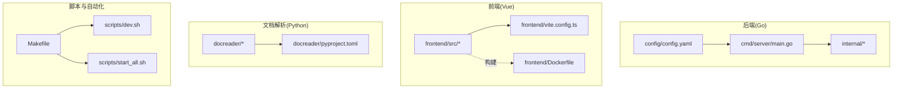
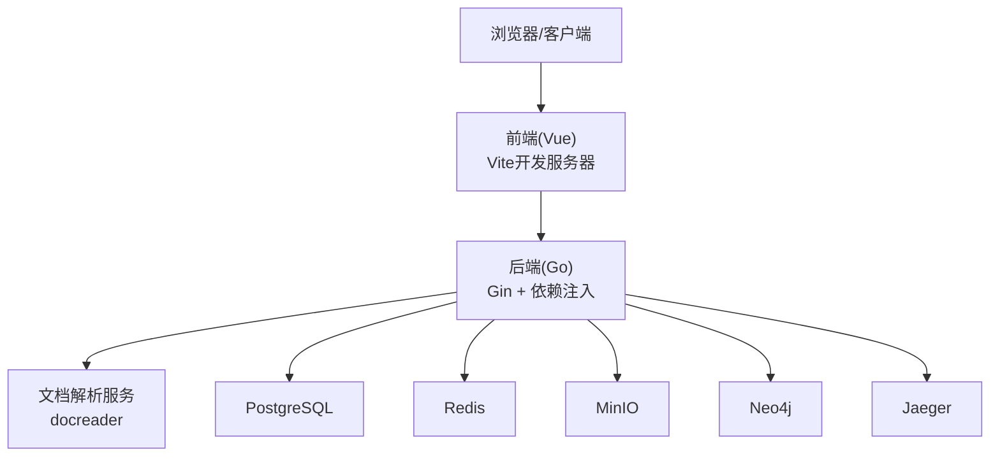
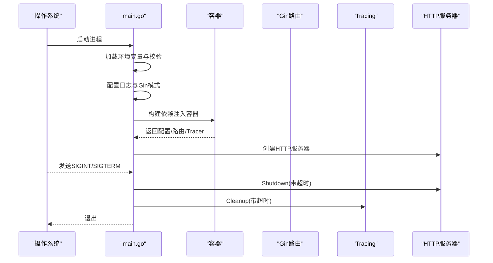
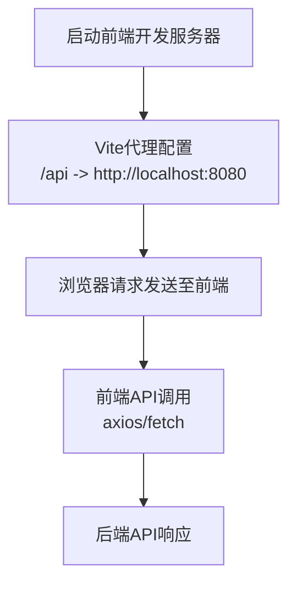
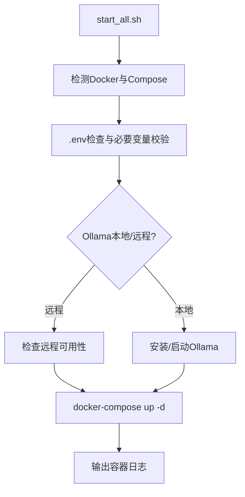
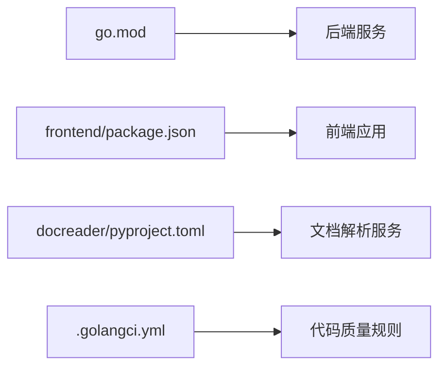

# 开发指南

<cite>
**本文引用的文件**
- [README.md](file://README.md)
- [go.mod](file://go.mod)
- [frontend/package.json](file://frontend/package.json)
- [docreader/pyproject.toml](file://docreader/pyproject.toml)
- [.github/pull_request_template.md](file://.github/pull_request_template.md)
- [.golangci.yml](file://.golangci.yml)
- [config/config.yaml](file://config/config.yaml)
- [cmd/server/main.go](file://cmd/server/main.go)
- [frontend/vite.config.ts](file://frontend/vite.config.ts)
- [Makefile](file://Makefile)
- [docs/开发指南.md](file://docs/开发指南.md)
- [scripts/dev.sh](file://scripts/dev.sh)
- [scripts/start_all.sh](file://scripts/start_all.sh)
- [frontend/Dockerfile](file://frontend/Dockerfile)
- [internal/application/service/chat_pipline/chat_pipline_test.go](file://internal/application/service/chat_pipline/chat_pipline_test.go)
</cite>

## 目录
1. [简介](#简介)
2. [项目结构](#项目结构)
3. [核心组件](#核心组件)
4. [架构总览](#架构总览)
5. [详细组件分析](#详细组件分析)
6. [依赖分析](#依赖分析)
7. [性能考量](#性能考量)
8. [故障排查指南](#故障排查指南)
9. [结论](#结论)
10. [附录](#附录)

## 简介
本开发指南面向 WiseDx 项目的贡献者与维护者，提供统一的代码规范、测试策略、贡献流程、开发环境搭建与调试技巧、模块依赖关系说明、依赖管理与版本控制策略，以及常见问题与性能优化建议。WiseDx 是一个面向医疗领域的 LLM 驱动检索增强生成（RAG）框架，具备医学 Agent、多模态解析、证据链增强、混合检索引擎与安全私有化部署能力。

## 项目结构
仓库采用多模块分层组织：
- 后端服务：Go 语言实现，入口位于 cmd/server/main.go，核心业务逻辑分布在 internal 下各子包（应用层、领域模型、中间件、路由、处理器等）。
- 前端界面：Vue 3 + TypeScript，使用 Vite 开发，构建产物由 Nginx 提供静态服务。
- 文档解析服务：Python 实现的 docreader，提供多格式文档解析与 OCR 能力。
- 配置与模板：config 目录包含运行时配置与提示词模板；docs 提供 API 文档与开发指南。
- 脚本与自动化：Makefile、scripts 目录提供一键构建、启动、测试、迁移与环境检查。
- Helm 与 Docker：提供容器化部署与编排能力。

图表来源
- [cmd/server/main.go](file://cmd/server/main.go#L1-L193)
- [frontend/vite.config.ts](file://frontend/vite.config.ts#L1-L29)
- [frontend/Dockerfile](file://frontend/Dockerfile#L1-L43)
- [docreader/pyproject.toml](file://docreader/pyproject.toml#L1-L39)
- [Makefile](file://Makefile#L1-L285)
- [scripts/dev.sh](file://scripts/dev.sh#L1-L347)
- [scripts/start_all.sh](file://scripts/start_all.sh#L1-L729)
- [config/config.yaml](file://config/config.yaml#L1-L585)

章节来源
- [README.md](file://README.md#L1-L98)
- [docs/开发指南.md](file://docs/开发指南.md#L1-L284)

## 核心组件
- 服务入口与生命周期：后端通过 main.go 初始化环境变量、日志、依赖注入容器、HTTP 服务器与优雅关停流程。
- 配置体系：config.yaml 提供服务端口、对话策略、提示词模板、知识库切分策略、租户策略等。
- 前端开发与代理：Vite 配置代理到后端 API，支持热重载与开发调试。
- 文档解析：docreader 使用多种解析器与 OCR 引擎，支持多格式文档抽取。
- 开发脚本：Makefile 提供构建、测试、迁移、镜像构建与环境检查；dev.sh/start_all.sh 提供开发与生产环境启动。

章节来源
- [cmd/server/main.go](file://cmd/server/main.go#L47-L193)
- [config/config.yaml](file://config/config.yaml#L1-L585)
- [frontend/vite.config.ts](file://frontend/vite.config.ts#L16-L28)
- [docreader/pyproject.toml](file://docreader/pyproject.toml#L1-L39)
- [Makefile](file://Makefile#L87-L285)
- [scripts/dev.sh](file://scripts/dev.sh#L103-L347)
- [scripts/start_all.sh](file://scripts/start_all.sh#L313-L729)

## 架构总览
WiseDx 采用“后端 API + 前端 UI + 文档解析服务 + 多数据库/中间件”的分布式架构。后端通过依赖注入容器装配路由、中间件、处理器与服务层；前端通过 Vite 开发服务器与后端 API 交互；docreader 作为 gRPC/HTTP 服务被后端调用；数据库与缓存（PostgreSQL、Redis）、对象存储（MinIO）、图数据库（Neo4j）与链路追踪（Jaeger）通过 Docker Compose 编排。

图表来源
- [cmd/server/main.go](file://cmd/server/main.go#L124-L188)
- [frontend/vite.config.ts](file://frontend/vite.config.ts#L16-L28)
- [scripts/start_all.sh](file://scripts/start_all.sh#L313-L384)

## 详细组件分析

### 后端服务入口与生命周期
- 环境变量加载：优先加载 .env，校验必要变量（数据库驱动、主机、端口、用户、密码、库名）。
- 日志配置：支持 stdout 与可选文件输出；根据 GIN_MODE 设置 Debug/Release。
- 依赖注入：通过容器构建路由与 Tracer，并注册资源清理钩子。
- 优雅关停：监听系统信号，创建超时上下文，关闭 HTTP 服务器并清理资源。

图表来源
- [cmd/server/main.go](file://cmd/server/main.go#L47-L193)

章节来源
- [cmd/server/main.go](file://cmd/server/main.go#L47-L193)

### 前端开发与代理配置
- Vite 开发服务器默认端口 5173，代理 /api 到后端 8080。
- 前端使用 Vue 3 + TypeScript，Pinia 状态管理，Vue Router 路由，组件化开发。
- 构建阶段使用 pnpm，生产镜像基于 Nginx。

图表来源
- [frontend/vite.config.ts](file://frontend/vite.config.ts#L16-L28)
- [frontend/Dockerfile](file://frontend/Dockerfile#L1-L43)

章节来源
- [frontend/vite.config.ts](file://frontend/vite.config.ts#L16-L28)
- [frontend/Dockerfile](file://frontend/Dockerfile#L1-L43)

### 文档解析服务
- Python 项目，声明多种解析与 OCR 依赖（如 pdfplumber、paddleocr、playwright、openai、ollama 等）。
- 通过 gRPC/HTTP 提供文档解析能力，供后端调用。

章节来源
- [docreader/pyproject.toml](file://docreader/pyproject.toml#L1-L39)

### 配置体系
- 服务器端口与主机、对话轮数与阈值、重排策略、回退策略与提示词模板、知识库切分策略、实体抽取与关系抽取提示词、租户策略等集中于 config.yaml。
- 建议新增配置项时同步更新默认模板与相关处理器。

章节来源
- [config/config.yaml](file://config/config.yaml#L1-L585)

### 开发脚本与自动化
- Makefile：提供构建、测试、迁移、镜像构建、环境检查、开发模式快捷命令。
- scripts/dev.sh：开发环境脚本，支持启动/停止基础设施、本地启动后端/前端、查看日志与状态。
- scripts/start_all.sh：生产/集成环境启动脚本，支持 Ollama 本地/远程、Docker Compose、镜像拉取与重启。

图表来源
- [scripts/start_all.sh](file://scripts/start_all.sh#L61-L384)

章节来源
- [Makefile](file://Makefile#L1-L285)
- [scripts/dev.sh](file://scripts/dev.sh#L103-L347)
- [scripts/start_all.sh](file://scripts/start_all.sh#L61-L729)

## 依赖分析
- 后端依赖管理：go.mod 声明核心库（Web 框架、ORM、缓存、搜索引擎、向量库、OpenTelemetry、mcp-go 等），并包含大量间接依赖。
- 前端依赖管理：frontend/package.json 声明 Vue 3、TypeScript、Axios、Pinia、Vue Router、第三方 UI 与工具库，使用 pnpm。
- 文档解析依赖：docreader/pyproject.toml 声明解析与 OCR 相关依赖。
- 代码质量：.golangci.yml 启用 lll、govet、revive、gofmt/gofumpt 等规则。

图表来源
- [go.mod](file://go.mod#L1-L181)
- [frontend/package.json](file://frontend/package.json#L1-L58)
- [docreader/pyproject.toml](file://docreader/pyproject.toml#L1-L39)
- [.golangci.yml](file://.golangci.yml#L1-L15)

章节来源
- [go.mod](file://go.mod#L1-L181)
- [frontend/package.json](file://frontend/package.json#L1-L58)
- [docreader/pyproject.toml](file://docreader/pyproject.toml#L1-L39)
- [.golangci.yml](file://.golangci.yml#L1-L15)

## 性能考量
- 后端性能
  - 使用并发与异步任务框架（如 asynq）处理后台任务，避免阻塞主请求路径。
  - 合理设置数据库连接池大小与查询超时，避免长事务。
  - 对大对象存储与向量检索进行分页与 TopK 限制，减少内存峰值。
- 前端性能
  - 使用懒加载与路由分割，减少首屏体积。
  - 图片与 PDF 预览采用分页与缩略图策略，避免一次性加载过多资源。
- 文档解析性能
  - OCR 与解析任务异步化，结合队列与重试机制。
  - 对大文件进行分块处理与进度上报。
- 监控与追踪
  - OpenTelemetry 集成链路追踪，定位慢请求与热点路径。

## 故障排查指南
- 启动失败
  - 确认 .env 文件存在且包含 DB_DRIVER、DB_HOST、DB_PORT、DB_USER、DB_PASSWORD、DB_NAME 等关键变量。
  - 使用脚本检查环境：make check-env 或 ./scripts/start_all.sh --check。
- CORS 问题
  - 前端代理配置需指向后端 8080 端口；确认 vite.config.ts 代理规则生效。
- 数据库迁移
  - 使用 make migrate-up/down 进行迁移；如需创建新迁移，使用 make migrate-create name=xxx。
- DocReader 服务
  - 若修改 docreader，需重新构建镜像并重启相应容器。
- 开发模式
  - 使用 make dev-start 启动基础设施，再分别在新终端运行 make dev-app 与 make dev-frontend。
  - 如需热重载后端，安装 air 并在项目根目录运行 air。

章节来源
- [scripts/start_all.sh](file://scripts/start_all.sh#L86-L111)
- [frontend/vite.config.ts](file://frontend/vite.config.ts#L16-L28)
- [Makefile](file://Makefile#L164-L197)
- [docs/开发指南.md](file://docs/开发指南.md#L259-L277)

## 结论
本开发指南提供了 WiseDx 的统一开发规范与最佳实践，涵盖代码规范、测试策略、贡献流程、开发环境与调试技巧、模块依赖与版本控制策略，以及常见问题与性能优化建议。建议在提交 PR 前完成自测与代码审查，并遵循 Pull Request 模板与检查清单。

## 附录

### 代码规范与最佳实践

- Go 语言编码标准
  - 使用 gofmt/gofumpt 统一格式化；行宽限制 120；启用 vet 与 revive 规则。
  - 命名规范：包名小写、短命名；接口以 -er 结尾；错误类型以 Error 结尾；常量全大写。
  - 错误处理：显式处理错误，避免空判断；使用结构化错误包装；在边界处记录日志。
  - 并发安全：共享状态使用互斥锁或原子操作；避免 goroutine 泄漏。
  - 依赖注入：通过容器装配路由、服务与中间件，便于测试与替换。
  - 配置分离：敏感配置放入环境变量，非敏感配置放入 config.yaml。
  - 文档与注释：公共接口与复杂逻辑需提供清晰注释；README 与 API 文档保持同步。

- Vue.js 前端开发规范
  - 组件化设计：单一职责、可复用；Props 类型约束；事件命名与状态管理清晰。
  - 状态管理：Pinia Store 按模块划分；避免在组件中直接操作全局状态。
  - API 调用：统一 axios 封装；错误处理与重试策略；Loading 与空态处理。
  - 资源优化：图片懒加载、PDF 预览分页、路由懒加载。
  - 类型安全：TypeScript 严格模式；接口定义与枚举使用。

- 依赖管理与版本控制
  - Go：go.mod 管理依赖；使用 go mod tidy；升级前跑测试。
  - 前端：pnpm 管理依赖；锁定版本；定期更新安全补丁。
  - Python：docreader/pyproject.toml 管理解析与 OCR 依赖；使用虚拟环境隔离。
  - Docker：多阶段构建；镜像标签与版本号一致；构建平台与架构适配。

章节来源
- [.golangci.yml](file://.golangci.yml#L1-L15)
- [frontend/package.json](file://frontend/package.json#L1-L58)
- [docreader/pyproject.toml](file://docreader/pyproject.toml#L1-L39)
- [Makefile](file://Makefile#L218-L229)

### 测试策略与覆盖率要求
- 单元测试
  - Go：按包编写测试，mock 外部依赖；覆盖核心算法与边界条件。
  - 前端：组件与工具函数测试；模拟 API 返回；快照与行为测试结合。
  - 文档解析：对解析器与 OCR 进行单元测试，覆盖多格式与异常路径。
- 集成测试
  - 后端：集成数据库、缓存、对象存储与外部服务；验证端到端流程。
  - 前端：与后端联调，验证 API 交互与 UI 行为。
- 端到端测试
  - 使用浏览器自动化工具（如 Playwright/Cypress）覆盖关键用户路径。
- 覆盖率
  - Go：目标行覆盖率 ≥ 70%，关键路径 ≥ 80%。
  - 前端：目标行覆盖率 ≥ 60%，关键交互 ≥ 70%。
- 测试执行
  - 使用 Makefile 的 test 命令运行后端测试；前端使用 npm run test（如存在）。

章节来源
- [internal/application/service/chat_pipline/chat_pipline_test.go](file://internal/application/service/chat_pipline/chat_pipline_test.go#L1-L126)
- [Makefile](file://Makefile#L87-L90)

### 贡献流程与 Pull Request 规范
- 提交前准备
  - 本地运行 go fmt、golangci-lint、go test；前端运行类型检查与构建。
  - 更新相关文档与 API 文档。
- 提交 PR
  - 使用 .github/pull_request_template.md 填写描述、变更类型、影响范围、测试步骤与检查清单。
  - 包含截图/录屏（UI 变更时）；数据库迁移与配置变更需单独说明。
- 代码审查
  - 至少一名维护者审查；关注安全性、性能与可维护性。
- 合并流程
  - 通过 CI 与审查后合并；避免直接推送主分支。

章节来源
- [.github/pull_request_template.md](file://.github/pull_request_template.md#L1-L73)

### 开发环境搭建与调试技巧
- 快速开发模式
  - 使用 make dev-start 启动基础设施；make dev-app 与 make dev-frontend 分别启动后端与前端。
  - 前端代理到后端 8080；后端支持 air 热重载（可选）。
- 生产部署
  - 使用 scripts/build_images.sh 构建镜像；scripts/start_all.sh 启动服务。
- 调试
  - 后端：VS Code/GoLand 配置本地调试；设置环境变量与断点。
  - 前端：浏览器开发者工具；Vite Source Map 支持断点调试。
  - 日志：后端支持文件输出；Docker 日志查看与过滤。

章节来源
- [docs/开发指南.md](file://docs/开发指南.md#L1-L284)
- [scripts/dev.sh](file://scripts/dev.sh#L231-L309)
- [scripts/start_all.sh](file://scripts/start_all.sh#L313-L384)