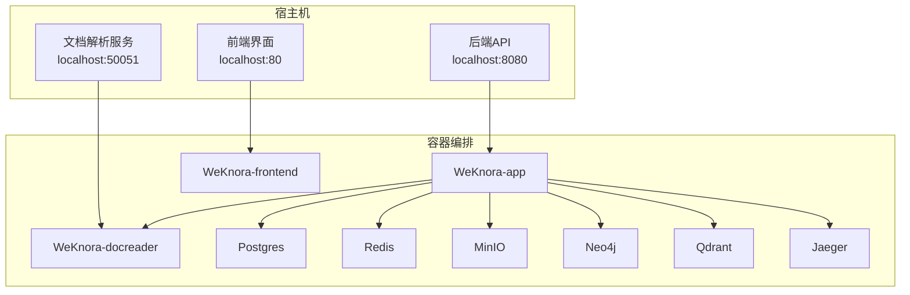
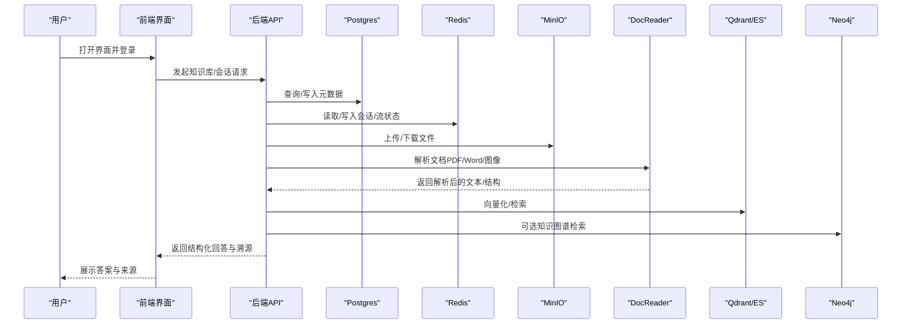
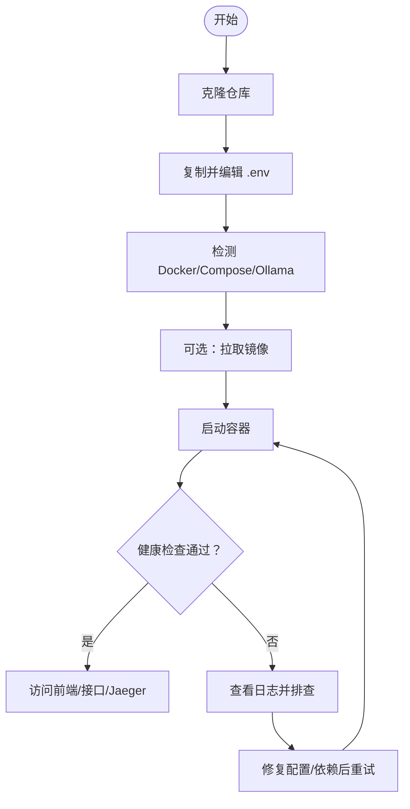
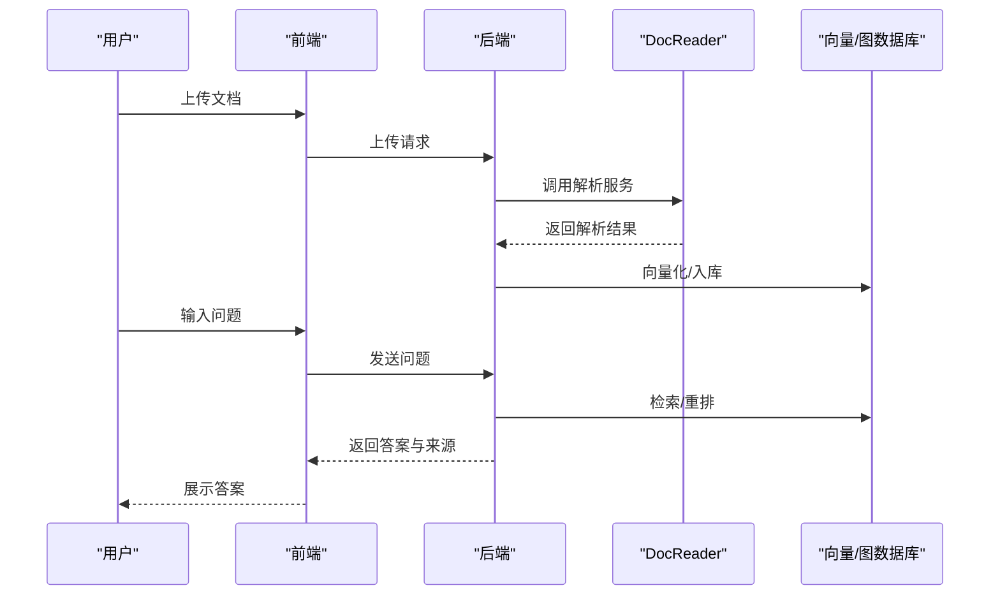
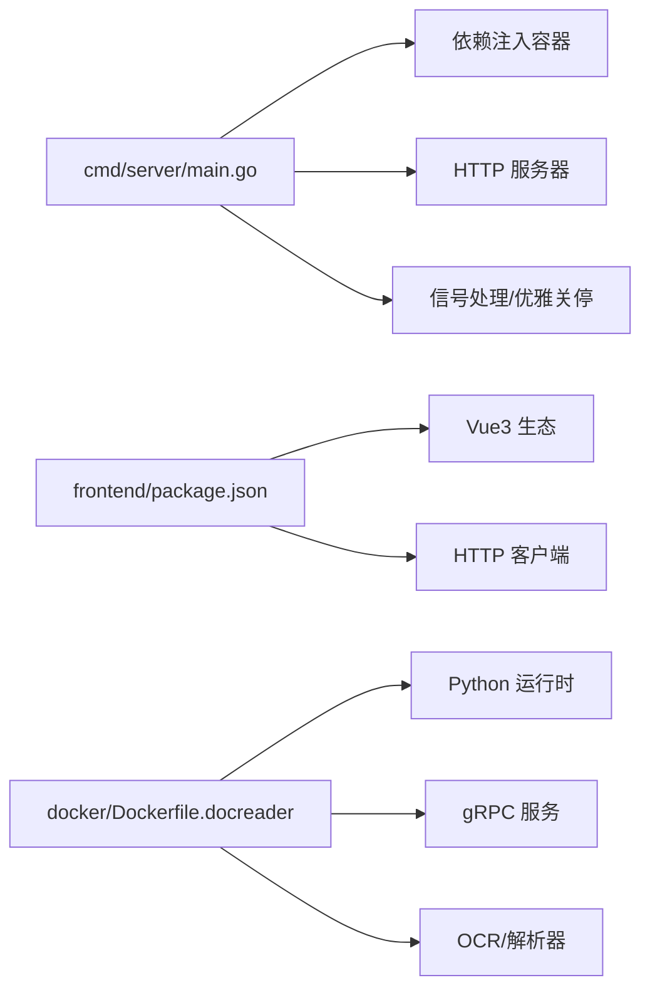

# 快速开始

<cite>
**本文引用的文件**
- [README.md](file://README.md)
- [README_CN.md](file://README_CN.md)
- [docker-compose.yml](file://docker-compose.yml)
- [.env.example](file://.env.example)
- [config/config.yaml](file://config/config.yaml)
- [scripts/start_all.sh](file://scripts/start_all.sh)
- [scripts/dev.sh](file://scripts/dev.sh)
- [scripts/check-env.sh](file://scripts/check-env.sh)
- [cmd/server/main.go](file://cmd/server/main.go)
- [frontend/package.json](file://frontend/package.json)
- [docker/Dockerfile.docreader](file://docker/Dockerfile.docreader)
- [docs/开发指南.md](file://docs/开发指南.md)
</cite>

## 目录
1. [简介](#简介)
2. [项目结构](#项目结构)
3. [核心组件](#核心组件)
4. [架构总览](#架构总览)
5. [详细组件分析](#详细组件分析)
6. [依赖分析](#依赖分析)
7. [性能注意事项](#性能注意事项)
8. [故障排除指南](#故障排除指南)
9. [结论](#结论)
10. [附录](#附录)

## 简介
WiseDx 是一款面向医疗健康领域的 LLM 驱动的知识理解与检索增强生成（RAG）框架，具备医学 Agent 推理、多模态文档解析、循证医学增强、混合检索引擎与私有化部署能力。本“快速开始”旨在帮助新用户在最短时间内完成环境准备、安装与启动，并掌握基本使用流程。

## 项目结构
- 后端服务（Go）：位于 cmd/server/main.go，负责 API 服务、路由与业务编排。
- 前端（Vue3 + Vite）：位于 frontend/，提供知识库管理、聊天与可视化界面。
- 文档解析服务（Python + gRPC）：位于 docreader/，提供 PDF、Word、图像等多模态解析。
- 容器编排：使用 docker-compose.yml 管理多服务编排，含 Postgres、Redis、MinIO、Neo4j、Qdrant、Jaeger 等。
- 配置：.env.example 提供环境变量模板；config/config.yaml 提供对话与知识库策略配置。
- 启动脚本：scripts/start_all.sh 提供一键启动/停止与环境检查；scripts/dev.sh 提供开发模式快捷入口。

**图表来源**
- [docker-compose.yml](file://docker-compose.yml#L1-L271)
- [scripts/start_all.sh](file://scripts/start_all.sh#L314-L359)

**章节来源**
- [docker-compose.yml](file://docker-compose.yml#L1-L271)
- [README_CN.md](file://README_CN.md#L64-L87)

## 核心组件
- 后端应用（WeKnora-app）
  - 通过 docker-compose.yml 启动，监听 8080 端口，依赖 Postgres、Redis、MinIO、DocReader、Qdrant、Neo4j、Jaeger 等。
  - 环境变量通过 .env.example 配置，如 DB_DRIVER、DB_HOST、DB_PORT、STORAGE_TYPE、OLLAMA_BASE_URL 等。
- 前端界面（WeKnora-frontend）
  - 通过 docker-compose.yml 启动，监听 80 端口，依赖后端 API。
- 文档解析服务（WeKnora-docreader）
  - 通过 docker-compose.yml 启动，监听 50051 端口，使用 Python 与 gRPC，内置 OCR 模型与解析器。
- 基础设施
  - Postgres/ParadeDB：主数据库。
  - Redis：缓存与流管理。
  - MinIO：对象存储（可选）。
  - Neo4j/Qdrant：图/向量数据库（可选）。
  - Jaeger：链路追踪（可选）。

**章节来源**
- [docker-compose.yml](file://docker-compose.yml#L1-L271)
- [.env.example](file://.env.example#L1-L175)

## 架构总览
WiseDx 采用“容器化微服务 + 多模态解析 + 医学语义检索”的架构。前端通过 API 与后端交互，后端统一调度数据库、缓存、对象存储、向量/图数据库与文档解析服务，实现从“知识入库 -> 检索 -> 推理 -> 回答”的闭环。

**图表来源**
- [docker-compose.yml](file://docker-compose.yml#L1-L271)
- [cmd/server/main.go](file://cmd/server/main.go#L124-L188)

## 详细组件分析

### 环境要求与前置条件
- 必需工具
  - Docker 与 Docker Compose（支持 docker compose 插件或 docker-compose v1）
  - Git
- 可选工具
  - Ollama（本地或远程，用于本地推理）
  - Air（后端热重载，开发时可选）

**章节来源**
- [README_CN.md](file://README_CN.md#L66-L72)
- [scripts/start_all.sh](file://scripts/start_all.sh#L268-L297)

### 安装步骤（从零到运行）
- 步骤 1：克隆仓库并进入目录
  - git clone https://github.com/UniverseHappiness/WiseDx.git
  - cd WiseDx
- 步骤 2：准备环境变量
  - cp .env.example .env
  - 编辑 .env，至少配置数据库与存储相关变量（如 DB_DRIVER、DB_HOST、DB_PORT、DB_USER、DB_PASSWORD、DB_NAME、STORAGE_TYPE 等）
- 步骤 3：启动所有服务
  - ./scripts/start_all.sh
  - 脚本会自动检查 Docker、Compose、Ollama（本地或远程），并启动容器
- 步骤 4：访问服务
  - 前端界面：http://localhost
  - API 接口：http://localhost:8080
  - Jaeger 链路追踪：http://localhost:16686

**图表来源**
- [scripts/start_all.sh](file://scripts/start_all.sh#L314-L359)
- [scripts/start_all.sh](file://scripts/start_all.sh#L695-L726)

**章节来源**
- [README_CN.md](file://README_CN.md#L73-L85)
- [scripts/start_all.sh](file://scripts/start_all.sh#L86-L111)

### 环境变量配置说明（关键项）
- 应用与运行
  - GIN_MODE：debug/release
  - DISABLE_REGISTRATION：是否禁止新用户注册
  - APP_PORT、FRONTEND_PORT、DOCREADER_PORT：服务端口
  - WEKNORA_VERSION：镜像版本标签
- 数据库与检索
  - DB_DRIVER：postgres/mysql
  - DB_HOST、DB_PORT、DB_USER、DB_PASSWORD、DB_NAME：数据库连接
  - RETRIEVE_DRIVER：postgres/elasticsearch_v7/elasticsearch_v8/qdrant
  - QDRANT_HOST、QDRANT_PORT、QDRANT_COLLECTION、QDRANT_API_KEY、QDRANT_USE_TLS：Qdrant 配置（可选）
  - ELASTICSEARCH_ADDR、ELASTICSEARCH_USERNAME、ELASTICSEARCH_PASSWORD、ELASTICSEARCH_INDEX：Elasticsearch 配置（可选）
- 存储与对象
  - STORAGE_TYPE：local/minio/cos
  - LOCAL_STORAGE_BASE_DIR：本地存储基础目录
  - MINIO_*：MinIO 连接参数（可选）
  - COS_*：COS 连接参数（可选）
- 流与并发
  - STREAM_MANAGER_TYPE：memory/redis
  - REDIS_*：Redis 连接参数
  - CONCURRENCY_POOL_SIZE：Embedding 并发数
- 大模型与推理
  - OLLAMA_BASE_URL：Ollama 基础地址（本地或远程）
  - INIT_LLM_MODEL_*、INIT_EMBEDDING_MODEL_*、INIT_RERANK_MODEL_*：初始化模型参数（可选）
- 其他
  - MAX_FILE_SIZE_MB：统一文件大小限制
  - ENABLE_GRAPH_RAG：是否开启知识图谱
  - JWT_SECRET、TENANT_AES_KEY：鉴权与租户密钥
  - APK_MIRROR_ARG：镜像源设置（可选）

**章节来源**
- [.env.example](file://.env.example#L1-L175)

### 基本使用示例（创建知识库、上传文档、问答）
- 登录与进入知识库页面
  - 使用默认管理员账户登录前端界面
- 创建知识库
  - 在“知识库”页面新建 KB，设置分片参数（chunk_size、chunk_overlap、split_markers）与图像处理开关
- 上传文档
  - 支持 PDF、Word、Markdown、图片等格式；上传后由 DocReader 解析并入库
- 进行问答
  - 在聊天页输入问题，系统将进行检索、重写、重排与总结，返回带溯源的答案

**图表来源**
- [docker-compose.yml](file://docker-compose.yml#L121-L144)
- [config/config.yaml](file://config/config.yaml#L507-L513)

**章节来源**
- [config/config.yaml](file://config/config.yaml#L1-L100)

### 开发模式（可选）
- 使用脚本快速启动基础设施与本地前后端
  - ./scripts/dev.sh start
  - ./scripts/dev.sh app（本地运行后端）
  - ./scripts/dev.sh frontend（本地运行前端）
- 或使用 Make 命令（详见开发指南）
  - make dev-start / dev-app / dev-frontend / dev-stop

**章节来源**
- [scripts/dev.sh](file://scripts/dev.sh#L103-L189)
- [docs/开发指南.md](file://docs/开发指南.md#L1-L111)

## 依赖分析
- 后端依赖注入容器在 main.go 中构建，随后启动 HTTP 服务器并注册信号处理与资源清理。
- 前端依赖通过 frontend/package.json 管理，使用 Vue3、Pinia、Vue Router、Axios 等生态。
- 文档解析服务使用 Python 与 gRPC，包含 OCR 模型与多种解析器，Dockerfile 中预装 Playwright 与依赖。

**图表来源**
- [cmd/server/main.go](file://cmd/server/main.go#L124-L188)
- [frontend/package.json](file://frontend/package.json#L1-L58)
- [docker/Dockerfile.docreader](file://docker/Dockerfile.docreader#L1-L161)

**章节来源**
- [cmd/server/main.go](file://cmd/server/main.go#L1-L193)
- [frontend/package.json](file://frontend/package.json#L1-L58)
- [docker/Dockerfile.docreader](file://docker/Dockerfile.docreader#L1-L161)

## 性能注意事项
- 并发与资源
  - CONCURRENCY_POOL_SIZE：Embedding 并发数，遇到 429 错误时适当下调
  - DocReader 并发任务数（IMAGE_MAX_CONCURRENT）：默认 1，高并发场景下谨慎设置
- 存储与检索
  - 选择合适的 RETRIEVE_DRIVER（postgres/ES/Qdrant），根据数据规模与查询复杂度权衡
  - 启用/禁用知识图谱（ENABLE_GRAPH_RAG）以平衡性能与召回
- 文件大小
  - MAX_FILE_SIZE_MB：统一限制上传与 gRPC 请求体大小，避免内存压力

**章节来源**
- [.env.example](file://.env.example#L82-L111)
- [docker-compose.yml](file://docker-compose.yml#L106-L107)

## 故障排除指南
- Docker/Compose 未安装或未运行
  - 使用脚本自动检测并报错；请安装 Docker 与 Compose，并确保服务运行
- Ollama 无法连接
  - 若配置为本地服务，脚本会尝试安装并启动；若为远程服务，请确认 OLLAMA_BASE_URL 可达
- 端口冲突
  - 修改 APP_PORT/FRONTEND_PORT/DOCREADER_PORT 或释放占用端口
- 数据库连接失败
  - 检查 .env 中 DB_DRIVER/DB_HOST/DB_PORT/DB_USER/DB_PASSWORD/DB_NAME 是否正确
- 前端跨域（CORS）
  - 检查前端代理配置（vite.config.ts），确保指向后端 API
- DocReader 需要重建
  - 如需修改解析逻辑，使用脚本构建镜像并重启相应容器
- 环境检查
  - 使用 ./scripts/check-env.sh 快速检查 .env、Docker、Go、Node、Air 等依赖

**章节来源**
- [scripts/start_all.sh](file://scripts/start_all.sh#L268-L297)
- [scripts/start_all.sh](file://scripts/start_all.sh#L568-L566)
- [scripts/check-env.sh](file://scripts/check-env.sh#L144-L172)
- [docs/开发指南.md](file://docs/开发指南.md#L259-L277)

## 结论
通过本快速开始指南，您已完成环境准备、安装与启动，并了解了关键配置与基本使用流程。建议在正式环境中进一步细化数据库与向量/图数据库配置，并结合业务场景调整并发与检索策略，以获得更优的性能与稳定性。

## 附录
- 常用命令
  - 启动：./scripts/start_all.sh
  - 停止：./scripts/start_all.sh -s
  - 检查：./scripts/start_all.sh -c
  - 拉取镜像：./scripts/start_all.sh -p
  - 仅启动 Docker：./scripts/start_all.sh -d
  - 仅启动 Ollama：./scripts/start_all.sh -o
- 开发模式
  - ./scripts/dev.sh start / app / frontend / logs / stop
  - 或使用 Make 命令（参见开发指南）

**章节来源**
- [scripts/start_all.sh](file://scripts/start_all.sh#L20-L61)
- [docs/开发指南.md](file://docs/开发指南.md#L1-L111)