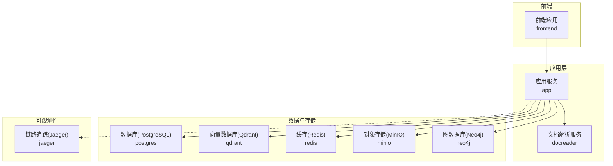
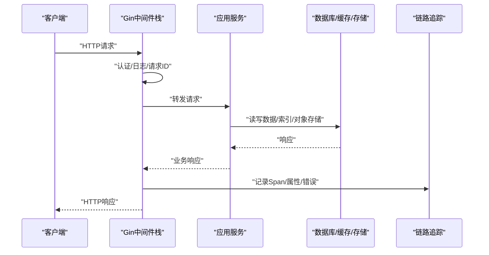
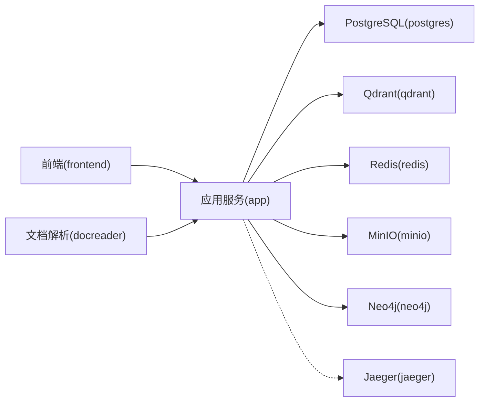
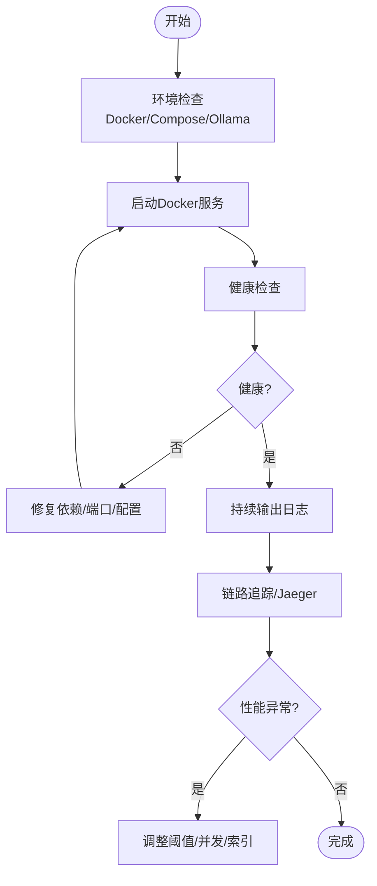

# 故障排除与FAQ

<cite>
**本文引用的文件**
- [cmd/server/main.go](file://cmd/server/main.go)
- [internal/config/config.go](file://internal/config/config.go)
- [config/config.yaml](file://config/config.yaml)
- [internal/logger/logger.go](file://internal/logger/logger.go)
- [internal/middleware/error_handler.go](file://internal/middleware/error_handler.go)
- [internal/middleware/recovery.go](file://internal/middleware/recovery.go)
- [internal/middleware/auth.go](file://internal/middleware/auth.go)
- [internal/middleware/logger.go](file://internal/middleware/logger.go)
- [internal/middleware/trace.go](file://internal/middleware/trace.go)
- [internal/errors/errors.go](file://internal/errors/errors.go)
- [internal/types/errors.go](file://internal/types/errors.go)
- [internal/utils/debug.go](file://internal/utils/debug.go)
- [scripts/start_all.sh](file://scripts/start_all.sh)
- [docker-compose.yml](file://docker-compose.yml)
- [client/faq.go](file://client/faq.go)
</cite>

## 目录
1. [简介](#简介)
2. [项目结构](#项目结构)
3. [核心组件](#核心组件)
4. [架构总览](#架构总览)
5. [详细组件分析](#详细组件分析)
6. [依赖分析](#依赖分析)
7. [性能考量](#性能考量)
8. [故障排除指南](#故障排除指南)
9. [结论](#结论)
10. [附录](#附录)

## 简介
本指南面向WiseDx（基于WeKnora）的运维与开发者，提供系统化的故障排除与常见问题解答。内容涵盖安装部署问题、配置错误、性能问题、日志与调试方法、错误代码与异常处理、性能优化与资源调优、系统监控与告警配置、故障诊断工具与排查流程，以及社区支持与问题反馈渠道。

## 项目结构
WiseDx采用多服务容器编排，核心服务包括应用服务、文档解析服务、数据库、缓存、对象存储、链路追踪与可视化等。启动脚本负责环境检查、Ollama与Docker服务的启停、日志输出与健康检查。

图表来源
- [docker-compose.yml](file://docker-compose.yml#L1-L271)

章节来源
- [docker-compose.yml](file://docker-compose.yml#L1-L271)
- [scripts/start_all.sh](file://scripts/start_all.sh#L1-L729)

## 核心组件
- 应用入口与生命周期：负责环境变量加载、日志初始化、容器构建、HTTP服务启动与优雅关停。
- 配置系统：支持YAML配置与环境变量注入，含服务器、对话、知识库、流管理、抽取、Web搜索、提示词模板等。
- 中间件体系：认证、日志、错误处理、恢复、链路追踪。
- 错误与异常：统一错误码与AppError封装，便于前端与客户端识别。
- 调试与运维：启动脚本内置环境检查、容器状态查看、镜像拉取、服务启停与日志跟踪；提供Redis任务清理与状态检查工具。

章节来源
- [cmd/server/main.go](file://cmd/server/main.go#L1-L193)
- [internal/config/config.go](file://internal/config/config.go#L1-L284)
- [config/config.yaml](file://config/config.yaml#L1-L585)
- [internal/middleware/auth.go](file://internal/middleware/auth.go#L1-L207)
- [internal/middleware/logger.go](file://internal/middleware/logger.go#L1-L221)
- [internal/middleware/error_handler.go](file://internal/middleware/error_handler.go#L1-L47)
- [internal/middleware/recovery.go](file://internal/middleware/recovery.go#L1-L35)
- [internal/middleware/trace.go](file://internal/middleware/trace.go#L1-L119)
- [internal/errors/errors.go](file://internal/errors/errors.go#L1-L192)
- [internal/types/errors.go](file://internal/types/errors.go#L1-L47)
- [internal/utils/debug.go](file://internal/utils/debug.go#L1-L90)

## 架构总览
应用通过Gin框架提供REST API，中间件负责认证、日志、错误处理与链路追踪。应用服务依赖PostgreSQL、Qdrant、Redis、MinIO、Neo4j等外部组件，Jaeger采集链路数据。启动脚本统一管理Ollama与Docker服务，提供健康检查与日志输出。

图表来源
- [internal/middleware/auth.go](file://internal/middleware/auth.go#L59-L196)
- [internal/middleware/logger.go](file://internal/middleware/logger.go#L132-L221)
- [internal/middleware/trace.go](file://internal/middleware/trace.go#L28-L119)
- [docker-compose.yml](file://docker-compose.yml#L20-L117)

章节来源
- [docker-compose.yml](file://docker-compose.yml#L20-L117)

## 详细组件分析

### 启动与生命周期管理
- 环境变量加载：优先加载.env，校验必要变量（数据库驱动、主机、端口、用户、密码、库名等），打印配置摘要。
- 日志配置：支持stdout与文件输出，可配置LOG_FILE；Gin模式由GIN_MODE决定。
- 优雅关停：监听系统信号，创建关闭上下文，触发资源清理器，关闭HTTP服务。
- 容器构建：通过依赖注入容器构建路由与追踪器，注册清理钩子。

章节来源
- [cmd/server/main.go](file://cmd/server/main.go#L47-L193)

### 配置系统
- 配置来源：YAML文件与环境变量，支持环境变量替换与模板目录加载。
- 关键配置项：服务器端口与主机、对话阈值与重排策略、知识库分片参数、流管理（内存/Redis）、抽取与图谱、Web搜索超时、提示词模板等。
- 配置加载：Viper读取配置，替换${ENV_VAR}，解析为结构体，加载模板目录。

章节来源
- [internal/config/config.go](file://internal/config/config.go#L170-L230)
- [config/config.yaml](file://config/config.yaml#L1-L585)

### 中间件体系
- 认证中间件：支持JWT与X-API-Key两种认证方式；支持跨租户访问开关；将租户与用户信息注入上下文。
- 请求ID与日志：生成X-Request-ID，清洗敏感字段，记录请求/响应体（限制大小），输出结构化日志。
- 错误处理：捕获应用错误并返回统一格式；其他错误返回500。
- 恢复中间件：panic恢复，记录堆栈，返回500。
- 链路追踪：基于OpenTelemetry，记录请求/响应属性，错误标记。

章节来源
- [internal/middleware/auth.go](file://internal/middleware/auth.go#L59-L196)
- [internal/middleware/logger.go](file://internal/middleware/logger.go#L100-L221)
- [internal/middleware/error_handler.go](file://internal/middleware/error_handler.go#L11-L46)
- [internal/middleware/recovery.go](file://internal/middleware/recovery.go#L11-L34)
- [internal/middleware/trace.go](file://internal/middleware/trace.go#L28-L119)

### 错误与异常
- 统一错误码：覆盖通用、租户、Agent等错误域，便于前端识别。
- AppError封装：包含业务码、HTTP码与详情。
- 类型错误：存储配额超限、重复知识等类型化错误。

章节来源
- [internal/errors/errors.go](file://internal/errors/errors.go#L8-L192)
- [internal/types/errors.go](file://internal/types/errors.go#L5-L47)

### 调试与运维工具
- 启动脚本：检查Docker与Ollama、拉取镜像、启动/停止服务、列出容器、检查环境、持续输出日志。
- Redis任务调试：清理过期或异常running任务键，检查running/progress键状态与TTL。

章节来源
- [scripts/start_all.sh](file://scripts/start_all.sh#L496-L729)
- [internal/utils/debug.go](file://internal/utils/debug.go#L11-L90)

## 依赖分析
应用服务依赖PostgreSQL、Qdrant、Redis、MinIO、Neo4j等外部组件；链路追踪通过OTLP导出至Jaeger；前端依赖应用服务提供API。

图表来源
- [docker-compose.yml](file://docker-compose.yml#L20-L243)

章节来源
- [docker-compose.yml](file://docker-compose.yml#L20-L243)

## 性能考量
- 配置层面
  - 对话阈值与TopK：合理设置keyword_threshold、embedding_top_k、vector_threshold、rerank_top_k，平衡召回与质量。
  - 重排与改写：启用重排与查询改写可提升相关性，但会增加延迟，需结合并发与资源评估。
  - 流管理：Redis流管理适合高并发场景，注意TTL与清理超时配置。
- 存储与索引
  - PostgreSQL与Qdrant：确保连接池与索引配置合理；关注查询计划与慢查询。
  - MinIO：对象存储容量与带宽影响上传/下载性能。
- 并发与资源
  - CONCURRENCY_POOL_SIZE：根据CPU与内存调优。
  - GIN_MODE：生产环境建议release模式。
- 链路追踪
  - Jaeger采集OTLP，可用于定位慢端点与错误根因。

章节来源
- [config/config.yaml](file://config/config.yaml#L6-L30)
- [docker-compose.yml](file://docker-compose.yml#L48-L107)

## 故障排除指南

### 1. 安装与部署问题
- 症状：启动失败、容器无法健康启动、端口占用
  - 步骤
    - 使用启动脚本检查环境：确认Docker与Compose可用、.env存在且关键变量已设置。
    - 查看容器健康状态与日志：列出容器、查看应用/文档解析/数据库健康检查。
    - 检查端口占用：确认APP_PORT、FRONTEND_PORT、MINIO_PORT等未被占用。
    - 拉取镜像或禁用拉取：根据需求选择拉取最新镜像或使用本地镜像。
  - 相关文件
    - [scripts/start_all.sh](file://scripts/start_all.sh#L268-L359)
    - [docker-compose.yml](file://docker-compose.yml#L34-L39)
    - [docker-compose.yml](file://docker-compose.yml#L134-L139)
    - [docker-compose.yml](file://docker-compose.yml#L158-L166)

章节来源
- [scripts/start_all.sh](file://scripts/start_all.sh#L268-L359)
- [docker-compose.yml](file://docker-compose.yml#L34-L39)
- [docker-compose.yml](file://docker-compose.yml#L134-L139)
- [docker-compose.yml](file://docker-compose.yml#L158-L166)

### 2. 配置错误
- 症状：应用启动报错、数据库连接失败、模型初始化失败
  - 步骤
    - 检查环境变量：DB_DRIVER、DB_HOST、DB_PORT、DB_USER、DB_PASSWORD、DB_NAME等是否齐全。
    - 检查配置文件：config.yaml中服务器、对话、知识库、流管理、抽取、Web搜索等配置是否合理。
    - 检查外部服务可达性：PostgreSQL、Qdrant、Redis、MinIO、Neo4j、Ollama等。
  - 相关文件
    - [cmd/server/main.go](file://cmd/server/main.go#L59-L85)
    - [config/config.yaml](file://config/config.yaml#L1-L585)
    - [docker-compose.yml](file://docker-compose.yml#L50-L107)

章节来源
- [cmd/server/main.go](file://cmd/server/main.go#L59-L85)
- [config/config.yaml](file://config/config.yaml#L1-L585)
- [docker-compose.yml](file://docker-compose.yml#L50-L107)

### 3. 认证与授权问题
- 症状：401未认证、403禁止访问、跨租户访问失败
  - 步骤
    - 确认请求头携带Authorization或X-API-Key。
    - 检查JWT有效性与租户绑定；如需跨租户访问，确认租户配置与用户权限。
    - 查看中间件日志中的请求ID与路径，定位失败原因。
  - 相关文件
    - [internal/middleware/auth.go](file://internal/middleware/auth.go#L59-L196)
    - [internal/middleware/logger.go](file://internal/middleware/logger.go#L132-L221)

章节来源
- [internal/middleware/auth.go](file://internal/middleware/auth.go#L59-L196)
- [internal/middleware/logger.go](file://internal/middleware/logger.go#L132-L221)

### 4. 日志与调试
- 日志输出
  - 控制台与文件：通过LOG_FILE配置输出到文件；Gin模式由GIN_MODE控制。
  - 请求ID与敏感信息清洗：中间件自动添加X-Request-ID并清洗敏感字段。
- 调试步骤
  - 使用启动脚本持续输出日志：查看应用、文档解析、数据库日志。
  - 在中间件日志中定位请求ID，结合错误处理与恢复中间件定位异常。
- 相关文件
  - [cmd/server/main.go](file://cmd/server/main.go#L96-L122)
  - [internal/logger/logger.go](file://internal/logger/logger.go#L137-L173)
  - [internal/middleware/logger.go](file://internal/middleware/logger.go#L100-L221)
  - [internal/middleware/recovery.go](file://internal/middleware/recovery.go#L11-L34)
  - [scripts/start_all.sh](file://scripts/start_all.sh#L709-L726)

章节来源
- [cmd/server/main.go](file://cmd/server/main.go#L96-L122)
- [internal/logger/logger.go](file://internal/logger/logger.go#L137-L173)
- [internal/middleware/logger.go](file://internal/middleware/logger.go#L100-L221)
- [internal/middleware/recovery.go](file://internal/middleware/recovery.go#L11-L34)
- [scripts/start_all.sh](file://scripts/start_all.sh#L709-L726)

### 5. 错误代码与异常处理
- 常见错误码
  - 通用：400、401、403、404、405、409、429、500、503、408、422。
  - 租户：租户不存在、已存在、停用、状态无效等。
  - Agent：缺少思考模型、缺少允许工具、最大迭代次数/温度参数非法等。
- 处理方式
  - 应用错误：统一返回error.code与message，前端据此提示。
  - 内部错误：返回500与统一错误码。
  - 类型化错误：存储配额超限、重复知识等，结合业务处理。
- 相关文件
  - [internal/errors/errors.go](file://internal/errors/errors.go#L12-L192)
  - [internal/types/errors.go](file://internal/types/errors.go#L5-L47)
  - [internal/middleware/error_handler.go](file://internal/middleware/error_handler.go#L11-L46)

章节来源
- [internal/errors/errors.go](file://internal/errors/errors.go#L12-L192)
- [internal/types/errors.go](file://internal/types/errors.go#L5-L47)
- [internal/middleware/error_handler.go](file://internal/middleware/error_handler.go#L11-L46)

### 6. FAQ导入与检索问题
- 症状：FAQ导入失败、进度查询异常、检索结果不符合预期
  - 步骤
    - 使用异步导入接口提交批量数据，获取任务ID。
    - 通过任务ID查询导入进度，查看失败条目与原因。
    - 检查FAQ搜索请求参数（阈值、匹配数量、优先标签等）。
    - 导出FAQ数据核对格式与字段。
  - 相关文件
    - [client/faq.go](file://client/faq.go#L198-L468)

章节来源
- [client/faq.go](file://client/faq.go#L198-L468)

### 7. Redis任务清理与状态检查
- 症状：任务长时间处于running状态、进度键异常
- 步骤
  - 使用调试工具清理过期或异常running键。
  - 检查running键与progress键是否存在、TTL与内容。
- 相关文件
  - [internal/utils/debug.go](file://internal/utils/debug.go#L11-L90)

章节来源
- [internal/utils/debug.go](file://internal/utils/debug.go#L11-L90)

### 8. 性能优化与资源调优
- 配置优化
  - 对话阈值与TopK：根据召回与质量权衡调整。
  - 重排与改写：启用时关注延迟，结合并发池大小。
  - 流管理：Redis模式下合理设置TTL与清理超时。
- 资源与并发
  - CONCURRENCY_POOL_SIZE：根据CPU与内存调优。
  - GIN_MODE：生产环境使用release模式。
- 存储与索引
  - PostgreSQL与Qdrant：关注连接池、索引与慢查询。
  - MinIO：关注带宽与容量。
- 相关文件
  - [config/config.yaml](file://config/config.yaml#L6-L30)
  - [docker-compose.yml](file://docker-compose.yml#L48-L107)

章节来源
- [config/config.yaml](file://config/config.yaml#L6-L30)
- [docker-compose.yml](file://docker-compose.yml#L48-L107)

### 9. 系统监控与告警
- 链路追踪
  - Jaeger通过OTLP接收器采集Trace，可在UI中查看依赖、错误与耗时。
- 健康检查
  - 应用、文档解析、数据库、MinIO均配置健康检查，启动脚本可查看状态。
- 建议
  - 结合日志与链路追踪定位慢端点与错误根因；设置容器日志轮转与容量限制。
- 相关文件
  - [docker-compose.yml](file://docker-compose.yml#L34-L39)
  - [docker-compose.yml](file://docker-compose.yml#L134-L139)
  - [docker-compose.yml](file://docker-compose.yml#L158-L166)
  - [docker-compose.yml](file://docker-compose.yml#L200-L222)

章节来源
- [docker-compose.yml](file://docker-compose.yml#L34-L39)
- [docker-compose.yml](file://docker-compose.yml#L134-L139)
- [docker-compose.yml](file://docker-compose.yml#L158-L166)
- [docker-compose.yml](file://docker-compose.yml#L200-L222)

### 10. 社区支持与问题反馈
- 仓库与许可证：项目位于GitHub，遵循MIT许可证。
- 参考资料：README与开发者指南提供快速开始与开发指导。
- 建议
  - 提交问题前先查阅FAQ与日志，附带请求ID与错误码。
  - 提供环境信息（Docker版本、Compose版本、平台、配置片段）。

章节来源
- [README.md](file://README.md#L1-L98)

## 结论
通过本指南，您可以在安装、配置、运行与维护WiseDx时快速定位与解决问题。建议在生产环境中启用release模式、合理配置阈值与并发、开启链路追踪与健康检查，并建立完善的日志与告警机制，以保障系统稳定与性能。

## 附录

### 常见问题与解决方案速查
- 环境变量缺失：检查.env与关键变量，确保数据库与存储配置正确。
- 容器健康失败：查看健康检查日志，确认依赖服务可用。
- 认证失败：确认Authorization或X-API-Key格式与租户权限。
- 导入失败：查看异步任务进度与失败原因，修正数据格式。
- 性能下降：调整阈值与TopK、优化并发池、检查慢查询与索引。

### 调试流程图

图表来源
- [scripts/start_all.sh](file://scripts/start_all.sh#L496-L729)
- [docker-compose.yml](file://docker-compose.yml#L34-L39)
- [docker-compose.yml](file://docker-compose.yml#L134-L139)
- [docker-compose.yml](file://docker-compose.yml#L200-L222)