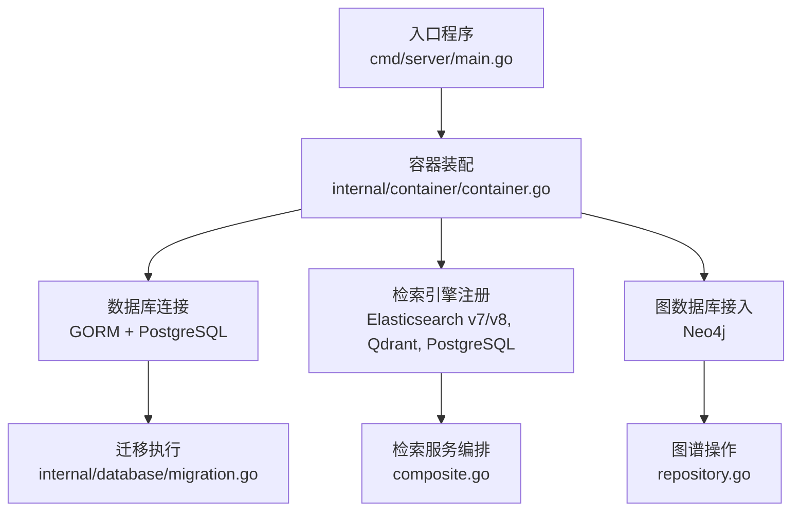
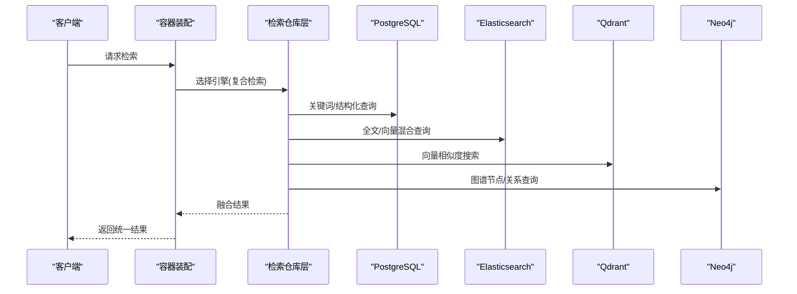
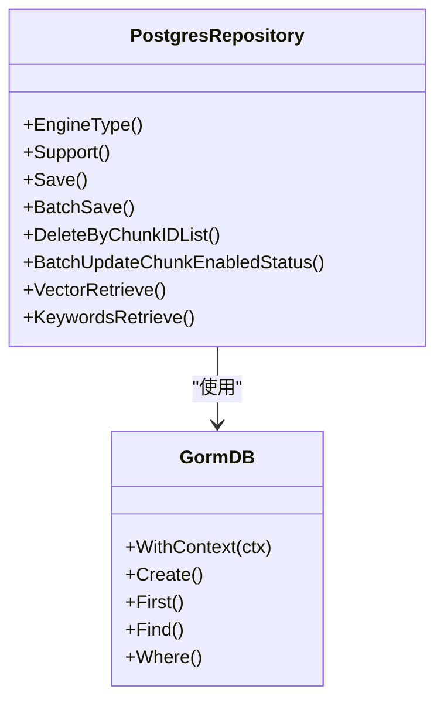
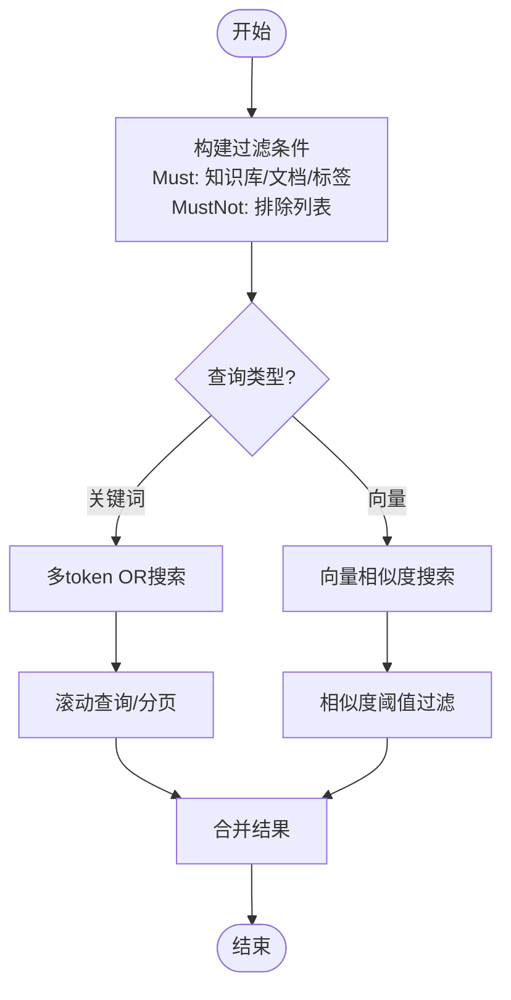
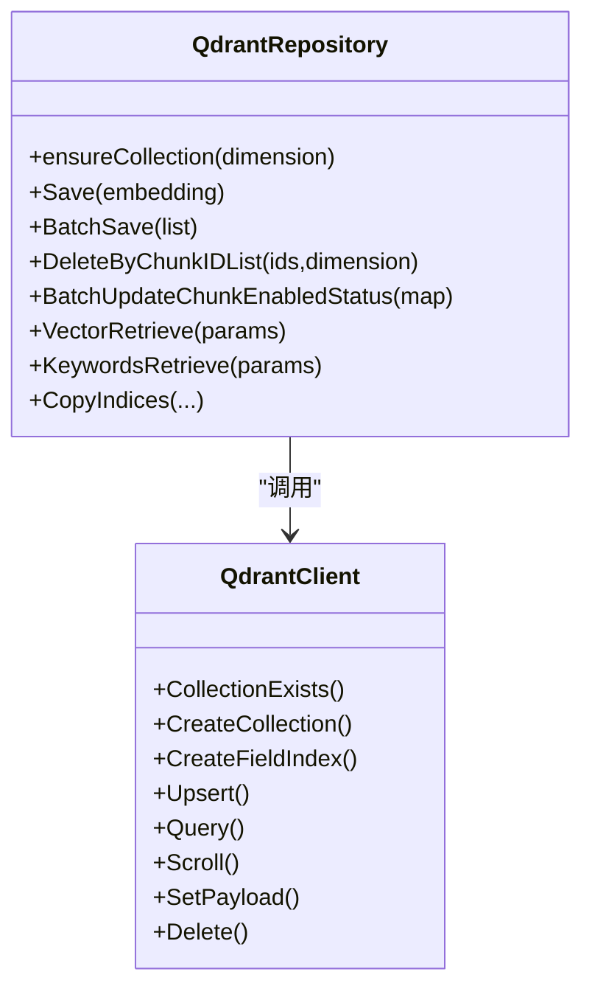
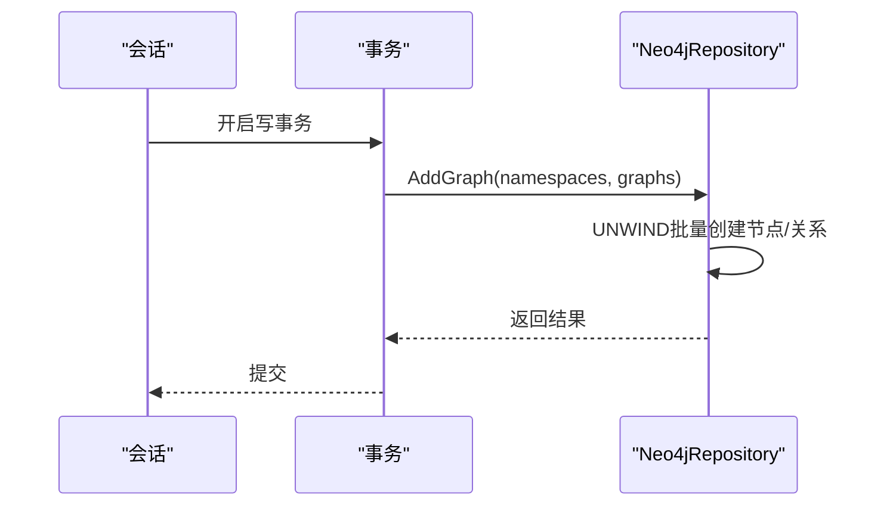
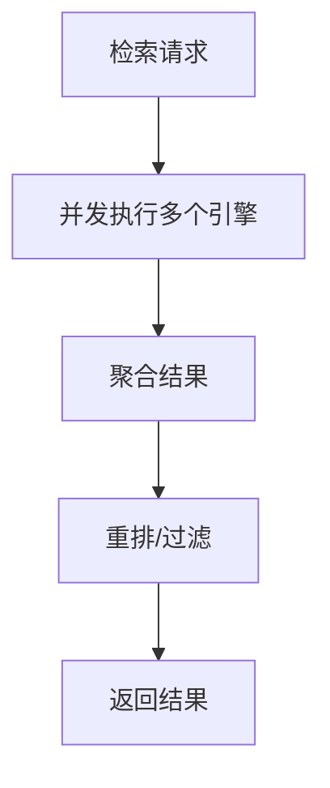
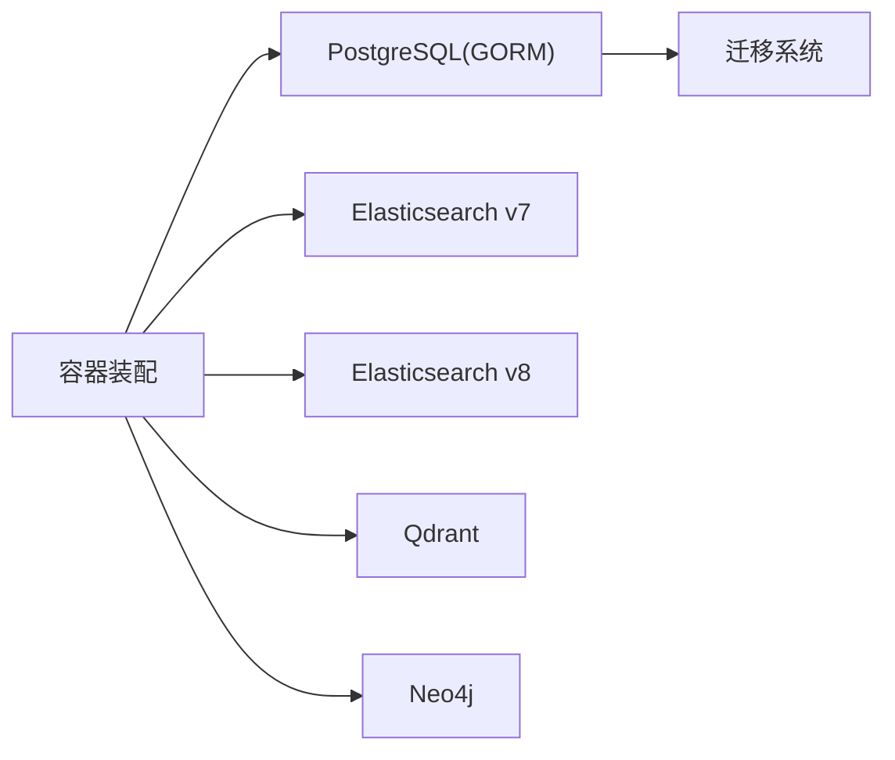

# 数据库集成

<cite>
**本文引用的文件**
- [cmd/server/main.go](file://cmd/server/main.go)
- [internal/config/config.go](file://internal/config/config.go)
- [internal/container/container.go](file://internal/container/container.go)
- [internal/database/migration.go](file://internal/database/migration.go)
- [internal/application/repository/retriever/postgres/repository.go](file://internal/application/repository/retriever/postgres/repository.go)
- [internal/application/repository/retriever/elasticsearch/v7/repository.go](file://internal/application/repository/retriever/elasticsearch/v7/repository.go)
- [internal/application/repository/retriever/elasticsearch/v8/repository.go](file://internal/application/repository/retriever/elasticsearch/v8/repository.go)
- [internal/application/repository/retriever/qdrant/repository.go](file://internal/application/repository/retriever/qdrant/repository.go)
- [internal/application/repository/retriever/neo4j/repository.go](file://internal/application/repository/retriever/neo4j/repository.go)
- [internal/application/repository/session.go](file://internal/application/repository/session.go)
- [.env.example](file://.env.example)
- [config/config.yaml](file://config/config.yaml)
- [internal/agent/tools/database_query.go](file://internal/agent/tools/database_query.go)
- [internal/utils/inject.go](file://internal/utils/inject.go)
- [internal/application/service/retriever/composite.go](file://internal/application/service/retriever/composite.go)
- [internal/stream/memory_manager.go](file://internal/stream/memory_manager.go)
</cite>

## 目录
1. [简介](#简介)
2. [项目结构](#项目结构)
3. [核心组件](#核心组件)
4. [架构总览](#架构总览)
5. [详细组件分析](#详细组件分析)
6. [依赖分析](#依赖分析)
7. [性能考量](#性能考量)
8. [故障排查指南](#故障排查指南)
9. [结论](#结论)
10. [附录](#附录)

## 简介
本文件面向WiseDx多数据库集成系统，系统通过统一容器注入机制，将关系型数据库(PostgreSQL)、全文搜索引擎(Elasticsearch v7/v8)、向量数据库(Qdrant)与图数据库(Neo4j)整合为统一的知识检索与推理平台。文档聚焦以下目标：
- PostgreSQL关系型数据库：ORM映射、事务管理、连接池配置与迁移机制
- Elasticsearch全文搜索引擎：索引策略、查询优化与分片配置
- Qdrant向量数据库：向量相似度搜索实现与集合管理
- Neo4j图数据库：知识图谱的导入、删除与查询
- 数据库间协调机制与数据一致性保障
- 性能调优与监控方案
- 配置示例与最佳实践

## 项目结构
WiseDx采用“入口程序 -> 容器装配 -> 服务层 -> 仓库层”的分层架构。入口程序负责环境变量加载与HTTP服务启动；容器负责数据库连接、检索引擎注册与资源清理；服务层负责业务编排；仓库层对接各类数据库。

图表来源
- [cmd/server/main.go](file://cmd/server/main.go#L88-L192)
- [internal/container/container.go](file://internal/container/container.go#L262-L362)
- [internal/database/migration.go](file://internal/database/migration.go#L14-L152)

章节来源
- [cmd/server/main.go](file://cmd/server/main.go#L88-L192)
- [internal/container/container.go](file://internal/container/container.go#L262-L362)
- [internal/database/migration.go](file://internal/database/migration.go#L14-L152)

## 核心组件
- 配置系统：集中定义服务器、对话、知识库、向量数据库驱动、流管理等配置项
- 容器装配：初始化数据库连接、检索引擎、图数据库、文件存储等
- 迁移系统：基于golang-migrate的版本化迁移，支持脏状态自动恢复
- 仓库层：面向不同后端的检索与图谱操作实现
- 工具与安全：数据库查询工具与SQL注入防护

章节来源
- [internal/config/config.go](file://internal/config/config.go#L18-L30)
- [internal/container/container.go](file://internal/container/container.go#L262-L362)
- [internal/database/migration.go](file://internal/database/migration.go#L14-L152)
- [internal/agent/tools/database_query.go](file://internal/agent/tools/database_query.go#L120-L160)
- [internal/utils/inject.go](file://internal/utils/inject.go#L1-L52)

## 架构总览
系统通过容器装配统一初始化各数据库与检索引擎，并在服务层进行并发检索与结果融合。下图展示了检索链路与数据库协作：

图表来源
- [internal/container/container.go](file://internal/container/container.go#L415-L500)
- [internal/application/service/retriever/composite.go](file://internal/application/service/retriever/composite.go#L143-L197)

章节来源
- [internal/container/container.go](file://internal/container/container.go#L415-L500)
- [internal/application/service/retriever/composite.go](file://internal/application/service/retriever/composite.go#L143-L197)

## 详细组件分析

### PostgreSQL关系型数据库
- ORM映射与事务管理
  - 使用GORM进行模型映射与事务封装，仓库层通过WithContext传递上下文，确保超时与取消传播
  - 事务边界在服务层定义，仓库层提供只读/写入会话接口
- 连接池配置
  - 初始化时设置最大空闲连接数与连接最大生命周期，避免连接泄漏与资源浪费
- 迁移机制
  - 启动时自动执行版本化迁移，支持脏状态自动恢复，确保数据库结构演进可控

图表来源
- [internal/application/repository/retriever/postgres/repository.go](file://internal/application/repository/retriever/postgres/repository.go#L1-L200)
- [internal/application/repository/session.go](file://internal/application/repository/session.go#L12-L41)

章节来源
- [internal/application/repository/retriever/postgres/repository.go](file://internal/application/repository/retriever/postgres/repository.go#L1-L200)
- [internal/application/repository/session.go](file://internal/application/repository/session.go#L12-L41)
- [internal/container/container.go](file://internal/container/container.go#L357-L361)
- [internal/database/migration.go](file://internal/database/migration.go#L14-L152)

### Elasticsearch全文搜索引擎
- 索引策略
  - 支持v7/v8客户端，按知识库ID/文档ID/分块ID建立过滤条件，启用is_enabled开关控制可见性
  - 批量写入采用Bulk API，分页滚动复制索引，支持增量更新
- 查询优化
  - 关键词检索采用多token OR组合，提升中文与多词查询召回
  - 向量检索结合过滤器(Must/MustNot)，限制检索范围
- 分片配置
  - 通过环境变量配置地址、凭据与索引名称，便于多实例部署与隔离

图表来源
- [internal/application/repository/retriever/elasticsearch/v7/repository.go](file://internal/application/repository/retriever/elasticsearch/v7/repository.go#L905-L1237)
- [internal/application/repository/retriever/elasticsearch/v8/repository.go](file://internal/application/repository/retriever/elasticsearch/v8/repository.go#L467-L662)

章节来源
- [internal/application/repository/retriever/elasticsearch/v7/repository.go](file://internal/application/repository/retriever/elasticsearch/v7/repository.go#L1-L200)
- [internal/application/repository/retriever/elasticsearch/v7/repository.go](file://internal/application/repository/retriever/elasticsearch/v7/repository.go#L905-L1237)
- [internal/application/repository/retriever/elasticsearch/v8/repository.go](file://internal/application/repository/retriever/elasticsearch/v8/repository.go#L467-L662)

### Qdrant向量数据库
- 向量相似度搜索
  - 按嵌入维度动态创建集合，使用余弦距离；支持按chunk/knowledge/knowledge_base/tag过滤
  - 支持关键词检索（多集合扫描，文本字段使用多语言分词器）
- 集合管理
  - 自动检测集合存在性，缺失时按维度创建；为常用字段建立keyword/bool/text索引
- 批量操作
  - 批量插入按维度分组，批量删除/更新payload按过滤条件执行

图表来源
- [internal/application/repository/retriever/qdrant/repository.go](file://internal/application/repository/retriever/qdrant/repository.go#L58-L140)
- [internal/application/repository/retriever/qdrant/repository.go](file://internal/application/repository/retriever/qdrant/repository.go#L539-L706)

章节来源
- [internal/application/repository/retriever/qdrant/repository.go](file://internal/application/repository/retriever/qdrant/repository.go#L58-L140)
- [internal/application/repository/retriever/qdrant/repository.go](file://internal/application/repository/retriever/qdrant/repository.go#L539-L706)

### Neo4j图数据库
- 知识图谱导入/删除/查询
  - 导入：通过UNWIND批量创建节点与关系，使用apoc.merge保证幂等
  - 删除：按命名空间批量删除节点与关系，支持周期性迭代避免锁阻塞
  - 查询：按节点名模糊匹配，返回节点与关系集合

图表来源
- [internal/application/repository/retriever/neo4j/repository.go](file://internal/application/repository/retriever/neo4j/repository.go#L59-L115)

章节来源
- [internal/application/repository/retriever/neo4j/repository.go](file://internal/application/repository/retriever/neo4j/repository.go#L45-L161)

### 数据库间协调与一致性
- 复合检索与并发执行
  - 通过并发执行不同引擎的检索任务，汇总后统一排序与重排，提升召回与效率
- 事务与隔离
  - PostgreSQL提供ACID事务，配合租户ID与序列ID实现强一致的数据访问
- 安全与审计
  - 数据库查询工具对SQL进行解析与白名单校验，防止注入与越权

图表来源
- [internal/application/service/retriever/composite.go](file://internal/application/service/retriever/composite.go#L143-L197)
- [internal/agent/tools/database_query.go](file://internal/agent/tools/database_query.go#L120-L160)
- [internal/utils/inject.go](file://internal/utils/inject.go#L1-L52)

章节来源
- [internal/application/service/retriever/composite.go](file://internal/application/service/retriever/composite.go#L143-L197)
- [internal/agent/tools/database_query.go](file://internal/agent/tools/database_query.go#L120-L160)
- [internal/utils/inject.go](file://internal/utils/inject.go#L1-L52)

## 依赖分析
- 容器装配依赖
  - initDatabase根据DB_DRIVER选择后端，初始化GORM连接并执行迁移
  - initRetrieveEngineRegistry根据RETRIEVE_DRIVER注册多种检索引擎
  - initNeo4jRepository根据NEO4J_*环境变量初始化图数据库连接
- 外部依赖
  - Elasticsearch v7/v8、Qdrant、Neo4j官方客户端
  - gorm.io/driver/postgres、golang-migrate

图表来源
- [internal/container/container.go](file://internal/container/container.go#L262-L500)
- [internal/database/migration.go](file://internal/database/migration.go#L14-L152)

章节来源
- [internal/container/container.go](file://internal/container/container.go#L262-L500)
- [internal/database/migration.go](file://internal/database/migration.go#L14-L152)

## 性能考量
- 连接池与并发
  - PostgreSQL连接池：最大空闲连接与最长生命周期已配置，建议结合负载调优
  - 并发检索：复合检索通过goroutine并发执行，注意外部服务限流与背压
- 索引与查询
  - Elasticsearch：合理设置分词器与索引字段类型，关键词检索采用多token OR提升召回
  - Qdrant：按维度创建集合，为常用过滤字段建立索引，向量查询设置合适阈值
- 缓存与流管理
  - 内存/Redis流管理器用于事件流的追加与拉取，建议根据会话规模选择后端

章节来源
- [internal/container/container.go](file://internal/container/container.go#L357-L361)
- [internal/application/repository/retriever/elasticsearch/v7/repository.go](file://internal/application/repository/retriever/elasticsearch/v7/repository.go#L905-L1237)
- [internal/application/repository/retriever/qdrant/repository.go](file://internal/application/repository/retriever/qdrant/repository.go#L58-L140)
- [internal/stream/memory_manager.go](file://internal/stream/memory_manager.go#L56-L118)

## 故障排查指南
- 数据库迁移失败
  - 若出现脏状态，启用AUTO_RECOVER_DIRTY自动恢复或手动强制版本
- Elasticsearch连接/权限
  - 检查ELASTICSEARCH_ADDR、用户名/密码与索引名称
- Qdrant集合不存在
  - 首次写入会自动创建集合，确认维度与集合命名规则
- Neo4j图谱导入失败
  - 检查NEO4J_URI/用户名/密码，确认apoc插件可用
- SQL注入防护
  - 数据库查询工具对SQL进行解析与白名单校验，确保仅允许安全操作

章节来源
- [internal/database/migration.go](file://internal/database/migration.go#L154-L193)
- [.env.example](file://.env.example#L92-L117)
- [internal/agent/tools/database_query.go](file://internal/agent/tools/database_query.go#L120-L160)
- [internal/utils/inject.go](file://internal/utils/inject.go#L1-L52)

## 结论
WiseDx通过容器化装配与版本化迁移，实现了关系型、全文、向量与图数据库的统一集成。系统在检索层面采用复合引擎与并发执行，在数据层面强调安全与一致性。建议在生产环境中结合业务负载调优连接池、索引与查询阈值，并持续监控外部服务健康状况。

## 附录

### 配置示例与最佳实践
- 环境变量
  - 数据库：DB_DRIVER、DB_HOST、DB_PORT、DB_USER、DB_PASSWORD、DB_NAME
  - 检索引擎：RETRIEVE_DRIVER（postgres/elasticsearch_v7/elasticsearch_v8/qdrant）、ELASTICSEARCH_ADDR/USERNAME/PASSWORD/INDEX、QDRANT_HOST/PORT/API_KEY/COLLECTION、NEO4J_URI/USERNAME/PASSWORD
  - 其他：GIN_MODE、STORAGE_TYPE、STREAM_MANAGER_TYPE、AUTO_RECOVER_DIRTY、CONCURRENCY_POOL_SIZE
- 配置文件
  - config/config.yaml定义对话、知识库、提示词模板等运行参数
- 最佳实践
  - PostgreSQL：使用租户ID与序列ID进行强一致访问；合理设置连接池参数
  - Elasticsearch：为高频过滤字段建立索引；关键词检索采用多token OR
  - Qdrant：按维度创建集合；为常用过滤字段建立索引；设置合适的相似度阈值
  - Neo4j：使用apoc.merge保证幂等；删除操作采用周期性迭代避免锁阻塞
  - 安全：数据库查询工具启用SQL注入防护与白名单校验

章节来源
- [.env.example](file://.env.example#L20-L175)
- [config/config.yaml](file://config/config.yaml#L1-L585)
- [internal/agent/tools/database_query.go](file://internal/agent/tools/database_query.go#L120-L160)
- [internal/utils/inject.go](file://internal/utils/inject.go#L1-L52)