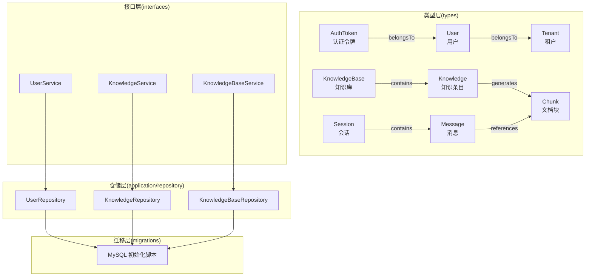
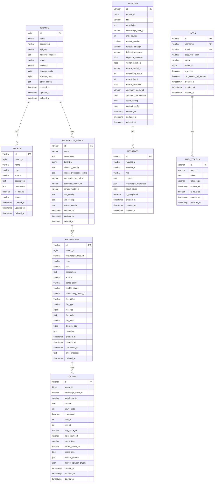
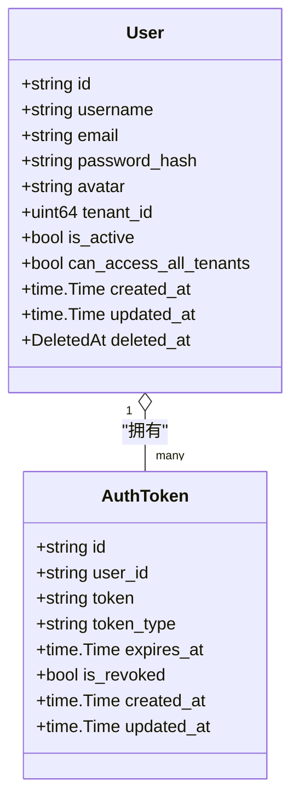
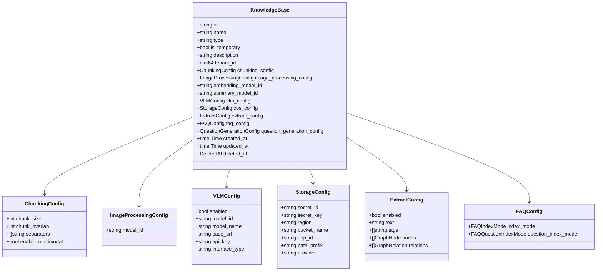
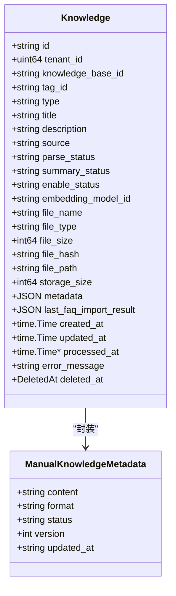
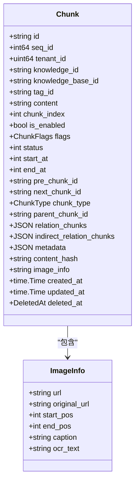
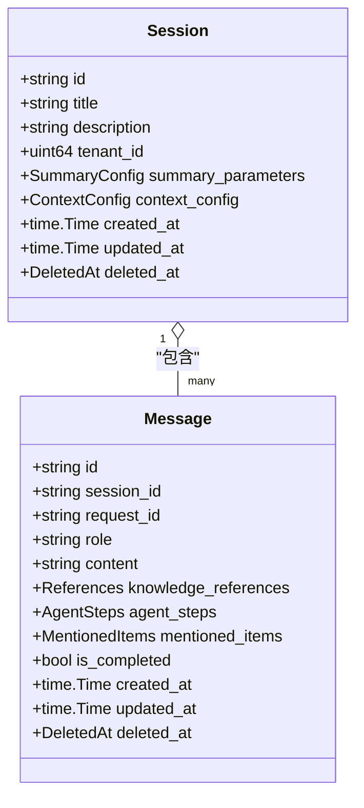
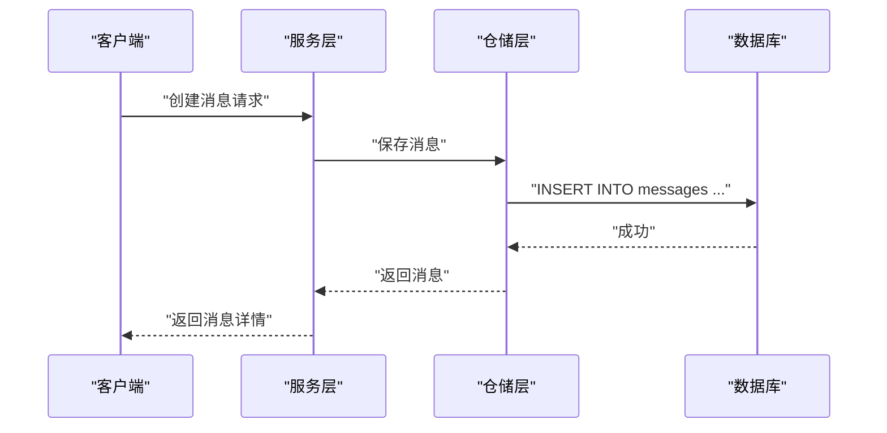
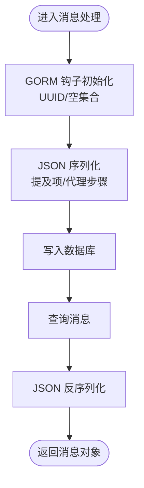
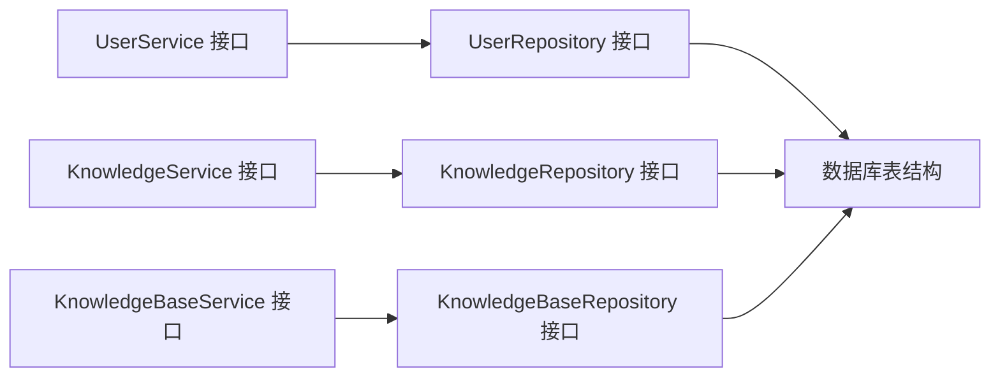

# 数据模型设计

<cite>
**本文引用的文件**
- [internal/types/user.go](file://internal/types/user.go)
- [internal/types/knowledgebase.go](file://internal/types/knowledgebase.go)
- [internal/types/knowledge.go](file://internal/types/knowledge.go)
- [internal/types/chunk.go](file://internal/types/chunk.go)
- [internal/types/message.go](file://internal/types/message.go)
- [internal/types/session.go](file://internal/types/session.go)
- [migrations/mysql/00-init-db.sql](file://migrations/mysql/00-init-db.sql)
- [internal/types/interfaces/user.go](file://internal/types/interfaces/user.go)
- [internal/types/interfaces/knowledge.go](file://internal/types/interfaces/knowledge.go)
- [internal/types/interfaces/knowledgebase.go](file://internal/types/interfaces/knowledgebase.go)
</cite>

## 目录
1. [简介](#简介)
2. [项目结构](#项目结构)
3. [核心组件](#核心组件)
4. [架构总览](#架构总览)
5. [详细组件分析](#详细组件分析)
6. [依赖分析](#依赖分析)
7. [性能考虑](#性能考虑)
8. [故障排查指南](#故障排查指南)
9. [结论](#结论)
10. [附录](#附录)

## 简介
本文件系统性梳理 WiseDx 的核心数据模型，覆盖知识库、文档块、消息、会话、用户等实体的设计理念、字段定义、关系映射、索引策略、数据类型选择原因、业务规则、序列化/反序列化机制、约束与默认值，并提供完整的 ER 图与数据模型图表。同时给出典型数据示例与使用场景，帮助开发者与运维人员快速理解与落地。

## 项目结构
WiseDx 的数据模型主要由以下层次构成：
- 类型层（types）：定义核心实体结构、枚举、常量、序列化接口以及 GORM 钩子
- 接口层（interfaces）：定义服务与仓储接口契约
- 迁移层（migrations）：定义数据库表结构、索引与约束
- 仓储与服务层：通过接口与类型层协作完成业务逻辑

**图表来源**
- [internal/types/user.go](file://internal/types/user.go#L10-L36)
- [internal/types/knowledgebase.go](file://internal/types/knowledgebase.go#L39-L84)
- [internal/types/knowledge.go](file://internal/types/knowledge.go#L57-L110)
- [internal/types/chunk.go](file://internal/types/chunk.go#L102-L155)
- [internal/types/session.go](file://internal/types/session.go#L75-L108)
- [internal/types/message.go](file://internal/types/message.go#L59-L87)
- [migrations/mysql/00-init-db.sql](file://migrations/mysql/00-init-db.sql#L9-L157)

**章节来源**
- [internal/types/user.go](file://internal/types/user.go#L10-L36)
- [internal/types/knowledgebase.go](file://internal/types/knowledgebase.go#L39-L84)
- [internal/types/knowledge.go](file://internal/types/knowledge.go#L57-L110)
- [internal/types/chunk.go](file://internal/types/chunk.go#L102-L155)
- [internal/types/session.go](file://internal/types/session.go#L75-L108)
- [internal/types/message.go](file://internal/types/message.go#L59-L87)
- [migrations/mysql/00-init-db.sql](file://migrations/mysql/00-init-db.sql#L9-L157)

## 核心组件
本节对五大核心实体进行逐项解析，包括设计理念、字段语义、数据类型、默认值、索引与约束、序列化/反序列化机制及业务规则。

- 用户（User）
  - 设计理念：支持多租户隔离与跨租户访问能力；密码以哈希形式存储；软删除支持审计与恢复
  - 关键字段与约束
    - 主键：字符串型 UUID
    - 唯一索引：用户名、邮箱
    - 索引：租户 ID、软删除时间
    - 默认值：活跃状态、跨租户访问权限
  - 关联关系：与租户为多对一；与认证令牌为一对多
  - 序列化：敏感字段不参与 JSON 输出（如密码哈希）

- 认证令牌（AuthToken）
  - 设计理念：支持访问/刷新令牌生命周期管理；支持撤销；与用户建立一对多关系
  - 关键字段与约束
    - 主键：UUID
    - 索引：用户 ID
    - 默认值：非撤销
  - 关联关系：与用户为多对一

- 知识库（KnowledgeBase）
  - 设计理念：统一管理分块策略、嵌入模型、图像处理、FAQ 索引策略、抽取配置等；支持多模态能力开关
  - 关键字段与约束
    - 主键：UUID
    - 默认值：类型为“文档”；FAQ 配置默认值
    - JSON 字段：分块配置、图像处理配置、嵌入/摘要模型 ID、抽取配置、FAQ 配置、问题生成配置
  - 序列化：自定义 JSON 编解码器（Value/Scan），确保配置持久化与读取一致性

- 知识条目（Knowledge）
  - 设计理念：抽象知识来源与元数据；支持手动 Markdown 与文件/URL/文本片段导入；异步摘要生成
  - 关键字段与约束
    - 主键：UUID
    - 索引：标签 ID、软删除时间
    - 默认值：摘要状态为“无任务”
    - JSON 字段：元数据、最后 FAQ 导入结果
  - 序列化：GORM 钩子自动填充 UUID；元数据封装为 JSON 类型
  - 业务规则：手动知识默认类型、来源、文件类型；支持草稿/发布状态

- 文档块（Chunk）
  - 设计理念：最小检索单元；支持文本、图片 OCR、图片标题、摘要、实体、关系、FAQ、表格等多类型；支持父子块与关系链
  - 关键字段与约束
    - 主键：UUID
    - 唯一索引：外部 API 使用的自增序号
    - 索引：标签 ID、父块 ID、内容哈希、软删除时间
    - 默认值：启用、类型为“text”、推荐标志位开启
    - JSON 字段：关系块、间接关系块、元数据
  - 序列化：图片信息、关系列表等以 JSON 存储；标志位采用位运算组合

- 会话（Session）
  - 设计理念：承载对话上下文与策略配置；支持滑动窗口与智能压缩策略；支持固定/模型兜底响应
  - 关键字段与约束
    - 主键：UUID
    - 索引：租户 ID
    - JSON 字段：摘要配置、上下文配置
  - 序列化：自定义 JSON 编解码器（Value/Scan），支持复杂配置结构

- 消息（Message）
  - 设计理念：记录用户与系统交互；支持知识引用、代理执行步骤、提及项；自动初始化与软删除
  - 关键字段与约束
    - 主键：UUID
    - 索引：会话 ID、角色
    - JSON 字段：知识引用、代理步骤、提及项
    - 默认值：完成标记为否
  - 序列化：自定义 JSON 编解码器；GORM 钩子在创建前生成 UUID 并初始化空集合

**章节来源**
- [internal/types/user.go](file://internal/types/user.go#L10-L36)
- [internal/types/knowledgebase.go](file://internal/types/knowledgebase.go#L39-L84)
- [internal/types/knowledge.go](file://internal/types/knowledge.go#L57-L110)
- [internal/types/chunk.go](file://internal/types/chunk.go#L102-L155)
- [internal/types/session.go](file://internal/types/session.go#L75-L108)
- [internal/types/message.go](file://internal/types/message.go#L59-L87)

## 架构总览
下图展示核心实体之间的关系映射与外键约束，结合数据库迁移脚本中的索引策略，形成清晰的 ER 关系：

**图表来源**
- [migrations/mysql/00-init-db.sql](file://migrations/mysql/00-init-db.sql#L9-L157)

**章节来源**
- [migrations/mysql/00-init-db.sql](file://migrations/mysql/00-init-db.sql#L9-L157)

## 详细组件分析

### 用户与认证令牌
- 设计要点
  - 用户实体支持多租户隔离与跨租户访问控制；密码以哈希存储，不参与 JSON 输出
  - 认证令牌支持访问/刷新令牌类型、过期时间与撤销状态；与用户建立一对多关系
- 关键约束与默认值
  - 用户：用户名与邮箱唯一；默认活跃；默认不可跨租户访问
  - 令牌：默认未撤销
- 序列化/反序列化
  - 用户：敏感字段不输出；对外返回精简信息
  - 令牌：按需输出，避免泄露敏感值

**图表来源**
- [internal/types/user.go](file://internal/types/user.go#L10-L36)

**章节来源**
- [internal/types/user.go](file://internal/types/user.go#L10-L36)

### 知识库
- 设计要点
  - 统一配置分块策略、嵌入/摘要模型、图像处理、抽取与 FAQ 索引策略
  - 支持多模态能力开关（VLM 配置优先，兼容旧版 enable_multimodal）
- 关键约束与默认值
  - 主键：UUID
  - 默认类型：文档；FAQ 配置默认值
  - JSON 字段：分块、图像处理、抽取、FAQ、问题生成配置
- 序列化/反序列化
  - 自定义 JSON 编解码器（Value/Scan），保证配置结构稳定持久化

**图表来源**
- [internal/types/knowledgebase.go](file://internal/types/knowledgebase.go#L39-L84)
- [internal/types/knowledgebase.go](file://internal/types/knowledgebase.go#L96-L106)
- [internal/types/knowledgebase.go](file://internal/types/knowledgebase.go#L141-L145)
- [internal/types/knowledgebase.go](file://internal/types/knowledgebase.go#L181-L195)
- [internal/types/knowledgebase.go](file://internal/types/knowledgebase.go#L108-L124)
- [internal/types/knowledgebase.go](file://internal/types/knowledgebase.go#L255-L262)
- [internal/types/knowledgebase.go](file://internal/types/knowledgebase.go#L281-L285)

**章节来源**
- [internal/types/knowledgebase.go](file://internal/types/knowledgebase.go#L39-L84)
- [internal/types/knowledgebase.go](file://internal/types/knowledgebase.go#L96-L106)
- [internal/types/knowledgebase.go](file://internal/types/knowledgebase.go#L141-L145)
- [internal/types/knowledgebase.go](file://internal/types/knowledgebase.go#L181-L195)
- [internal/types/knowledgebase.go](file://internal/types/knowledgebase.go#L108-L124)
- [internal/types/knowledgebase.go](file://internal/types/knowledgebase.go#L255-L262)
- [internal/types/knowledgebase.go](file://internal/types/knowledgebase.go#L281-L285)

### 知识条目
- 设计要点
  - 抽象知识来源与元数据；支持手动 Markdown 与文件/URL/文本导入；异步摘要生成
  - 手动知识默认类型、来源、文件类型；元数据封装为 JSON
- 关键约束与默认值
  - 主键：UUID；索引：标签 ID、软删除时间；默认摘要状态为“无任务”
- 序列化/反序列化
  - GORM 钩子自动填充 UUID；元数据封装为 JSON；FAQ 导入结果独立 JSON 字段

**图表来源**
- [internal/types/knowledge.go](file://internal/types/knowledge.go#L57-L110)
- [internal/types/knowledge.go](file://internal/types/knowledge.go#L133-L140)

**章节来源**
- [internal/types/knowledge.go](file://internal/types/knowledge.go#L57-L110)
- [internal/types/knowledge.go](file://internal/types/knowledge.go#L133-L140)

### 文档块
- 设计要点
  - 最小检索单元；支持多种类型（文本、图片 OCR、图片标题、摘要、实体、关系、FAQ、表格等）
  - 支持父子块与关系链；内容哈希用于快速匹配；标志位组合管理多布尔状态
- 关键约束与默认值
  - 主键：UUID；唯一索引：外部 API 使用的自增序号；索引：标签 ID、父块 ID、内容哈希、软删除时间
  - 默认值：启用、类型为“text”、推荐标志位开启
- 序列化/反序列化
  - 图片信息、关系列表等以 JSON 存储；标志位采用位运算组合

**图表来源**
- [internal/types/chunk.go](file://internal/types/chunk.go#L102-L155)
- [internal/types/chunk.go](file://internal/types/chunk.go#L80-L94)

**章节来源**
- [internal/types/chunk.go](file://internal/types/chunk.go#L102-L155)
- [internal/types/chunk.go](file://internal/types/chunk.go#L80-L94)

### 会话与消息
- 设计要点
  - 会话承载对话上下文与策略配置；支持滑动窗口与智能压缩策略；支持固定/模型兜底响应
  - 消息记录用户与系统交互；支持知识引用、代理执行步骤、提及项；自动初始化与软删除
- 关键约束与默认值
  - 会话：主键 UUID；索引租户 ID；JSON 字段摘要与上下文配置
  - 消息：主键 UUID；索引会话 ID、角色；默认完成标记为否
- 序列化/反序列化
  - 会话：自定义 JSON 编解码器；消息：GORM 钩子在创建前生成 UUID 并初始化空集合

**图表来源**
- [internal/types/session.go](file://internal/types/session.go#L75-L108)
- [internal/types/message.go](file://internal/types/message.go#L59-L87)

**章节来源**
- [internal/types/session.go](file://internal/types/session.go#L75-L108)
- [internal/types/message.go](file://internal/types/message.go#L59-L87)

### 数据流程与序列化机制
- 创建流程（以消息为例）
  - GORM 钩子在创建前生成 UUID，并初始化空集合（知识引用、代理步骤、提及项）
  - JSON 字段通过自定义 Value/Scan 实现数据库与 Go 结构体之间的编解码

**图表来源**
- [internal/types/message.go](file://internal/types/message.go#L115-L134)
- [migrations/mysql/00-init-db.sql](file://migrations/mysql/00-init-db.sql#L116-L128)

**章节来源**
- [internal/types/message.go](file://internal/types/message.go#L115-L134)
- [migrations/mysql/00-init-db.sql](file://migrations/mysql/00-init-db.sql#L116-L128)

### 复杂逻辑流程（消息提及项与代理步骤）
- 提及项与代理步骤均以 JSON 存储，支持自定义 Value/Scan 实现序列化与反序列化
- 流程图展示从入库到查询的关键节点

**图表来源**
- [internal/types/message.go](file://internal/types/message.go#L34-L54)
- [internal/types/message.go](file://internal/types/message.go#L93-L113)
- [internal/types/message.go](file://internal/types/message.go#L115-L134)

**章节来源**
- [internal/types/message.go](file://internal/types/message.go#L34-L54)
- [internal/types/message.go](file://internal/types/message.go#L93-L113)
- [internal/types/message.go](file://internal/types/message.go#L115-L134)

## 依赖分析
- 接口契约
  - 用户服务与仓储：定义注册、登录、令牌管理、用户查询与更新等接口
  - 知识服务与仓储：定义文件/URL/文本导入、手动知识、FAQ 管理、搜索与异步任务处理等接口
  - 知识库服务与仓储：定义知识库 CRUD、复制、混合检索与异步删除等接口
- 依赖关系
  - 服务层依赖仓储接口；仓储层依赖数据库迁移脚本定义的表结构
  - 类型层通过 GORM 注解与数据库字段映射，确保一致性

**图表来源**
- [internal/types/interfaces/user.go](file://internal/types/interfaces/user.go#L9-L39)
- [internal/types/interfaces/knowledge.go](file://internal/types/interfaces/knowledge.go#L12-L145)
- [internal/types/interfaces/knowledgebase.go](file://internal/types/interfaces/knowledgebase.go#L14-L100)

**章节来源**
- [internal/types/interfaces/user.go](file://internal/types/interfaces/user.go#L9-L39)
- [internal/types/interfaces/knowledge.go](file://internal/types/interfaces/knowledge.go#L12-L145)
- [internal/types/interfaces/knowledgebase.go](file://internal/types/interfaces/knowledgebase.go#L14-L100)

## 性能考虑
- 索引策略
  - 用户：用户名、邮箱唯一索引；租户 ID、软删除时间索引
  - 知识库：租户 ID+名称复合索引
  - 知识：租户 ID+知识库 ID 复合索引
  - 会话：租户 ID 索引
  - 消息：会话 ID+角色复合索引
  - 文档块：租户 ID+知识 ID 复合索引；父块 ID、类型、内容哈希索引
- JSON 字段
  - 通过自定义 Value/Scan 减少序列化开销；合理拆分字段以提升查询效率
- 默认值与布尔位
  - 合理设置默认值与标志位，减少空值判断与分支逻辑

[本节为通用指导，无需具体文件分析]

## 故障排查指南
- 常见问题
  - 重复用户名/邮箱：检查唯一索引冲突
  - 令牌无效或过期：检查令牌类型、过期时间与撤销状态
  - 知识导入失败：检查解析状态、错误信息字段与处理时间
  - 消息缺失：确认软删除时间与会话 ID 索引
- 排查建议
  - 核对数据库迁移脚本与当前表结构一致性
  - 检查 GORM 钩子是否正确执行（UUID 生成、空集合初始化）
  - 验证 JSON 字段编解码是否异常

**章节来源**
- [migrations/mysql/00-init-db.sql](file://migrations/mysql/00-init-db.sql#L9-L157)
- [internal/types/message.go](file://internal/types/message.go#L115-L134)
- [internal/types/knowledge.go](file://internal/types/knowledge.go#L103-L107)

## 结论
WiseDx 的数据模型围绕“知识库—知识条目—文档块”的层级结构展开，配合“会话—消息”的对话流，形成完整的检索增强问答数据通路。通过合理的索引策略、默认值与 JSON 字段编解码，兼顾了灵活性与性能。接口层与类型层的清晰划分，使得业务逻辑与数据结构解耦，便于扩展与维护。

[本节为总结性内容，无需具体文件分析]

## 附录
- 数据示例与使用场景
  - 用户登录：输入邮箱与密码，系统校验哈希后颁发访问/刷新令牌
  - 创建知识库：配置分块策略、嵌入模型、图像处理与抽取配置
  - 导入知识：支持文件、URL、文本片段与手动 Markdown；异步生成摘要
  - 问答流程：会话中发送消息，系统检索知识块并生成答案，记录知识引用与代理步骤
- 关键字段参考
  - 用户：ID、用户名、邮箱、租户 ID、是否活跃、跨租户访问权限
  - 知识库：ID、名称、类型、租户 ID、配置 JSON、FAQ 配置
  - 知识：ID、类型、标题、来源、解析状态、摘要状态、元数据、文件信息
  - 文档块：ID、内容、索引位置、类型、父块 ID、关系链、内容哈希
  - 会话：ID、标题、描述、租户 ID、摘要配置、上下文配置
  - 消息：ID、会话 ID、角色、内容、知识引用、代理步骤、提及项

[本节为概览性内容，无需具体文件分析]