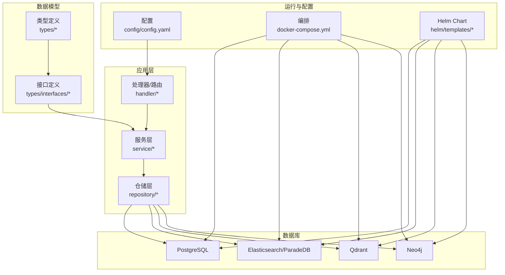
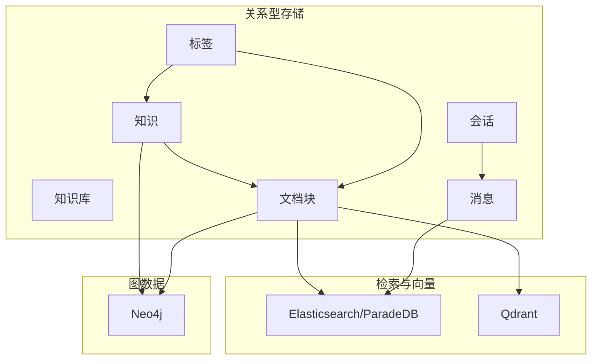
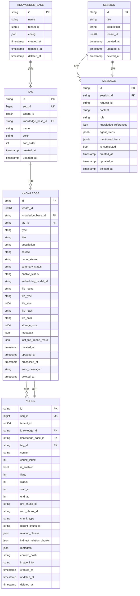
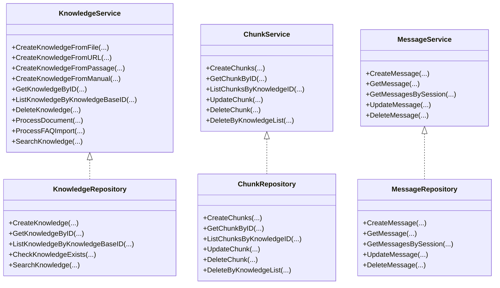
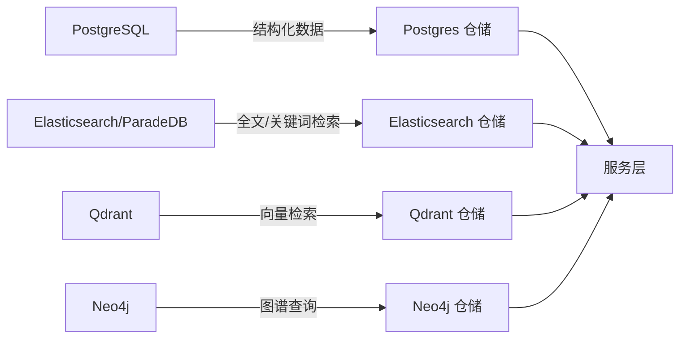
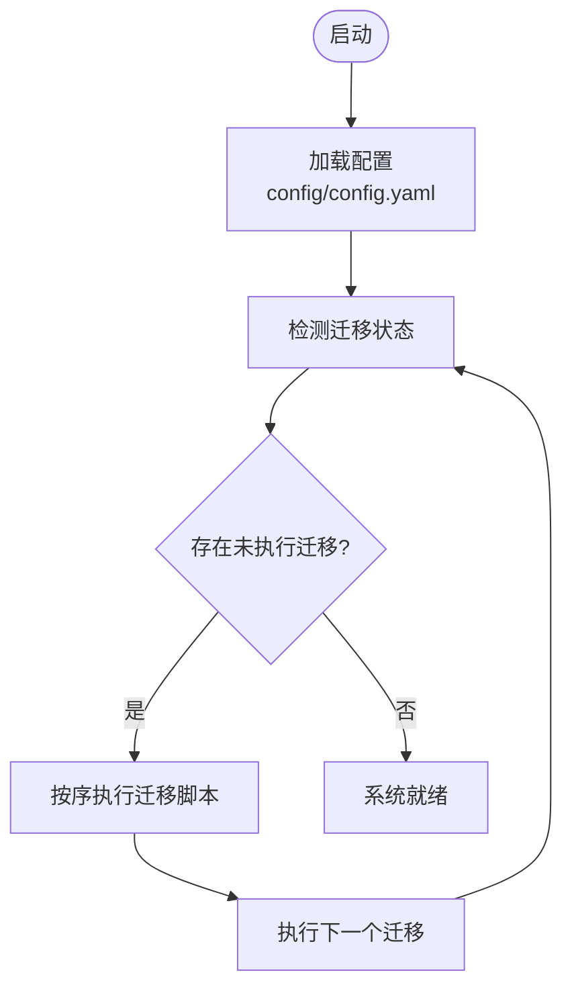
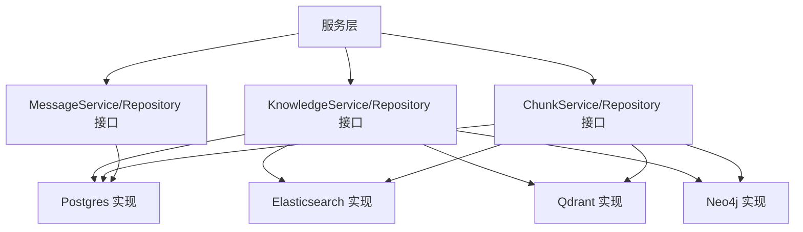

# 数据管理

<cite>
**本文引用的文件**
- [internal/types/chunk.go](file://internal/types/chunk.go)
- [internal/types/message.go](file://internal/types/message.go)
- [internal/types/session.go](file://internal/types/session.go)
- [internal/types/knowledge.go](file://internal/types/knowledge.go)
- [internal/types/tag.go](file://internal/types/tag.go)
- [internal/types/interfaces/knowledge.go](file://internal/types/interfaces/knowledge.go)
- [internal/types/interfaces/chunk.go](file://internal/types/interfaces/chunk.go)
- [internal/types/interfaces/message.go](file://internal/types/interfaces/message.go)
- [internal/application/repository/postgres/repository.go](file://internal/application/repository/postgres/repository.go)
- [internal/application/repository/retriever/elasticsearch/v7/repository.go](file://internal/application/repository/retriever/elasticsearch/v7/repository.go)
- [internal/application/repository/retriever/elasticsearch/v8/repository.go](file://internal/application/repository/retriever/elasticsearch/v8/repository.go)
- [internal/application/repository/qdrant/repository.go](file://internal/application/repository/qdrant/repository.go)
- [internal/application/repository/neo4j/repository.go](file://internal/application/repository/neo4j/repository.go)
- [internal/database/migration.go](file://internal/database/migration.go)
- [migrations/versioned/000000_init.up.sql](file://migrations/versioned/000000_init.up.sql)
- [migrations/versioned/000001_agent.up.sql](file://migrations/versioned/000001_agent.up.sql)
- [migrations/versioned/000002_embeddings.up.sql](file://migrations/versioned/000002_embeddings.up.sql)
- [migrations/versioned/000003_chunk_flags.up.sql](file://migrations/versioned/000003_chunk_flags.up.sql)
- [migrations/versioned/000004_drop_vlm_model_id.up.sql](file://migrations/versioned/000004_drop_vlm_model_id.up.sql)
- [migrations/versioned/000005_mentioned_items.up.sql](file://migrations/versioned/000005_mentioned_items.up.sql)
- [migrations/versioned/000006_custom_agents.up.sql](file://migrations/versioned/000006_custom_agents.up.sql)
- [migrations/versioned/000007_embeddings_tag_id.up.sql](file://migrations/versioned/000007_embeddings_tag_id.up.sql)
- [migrations/versioned/000008_migrate_untagged_faq.up.sql](file://migrations/versioned/000008_migrate_untagged_faq.up.sql)
- [migrations/versioned/000009_add_last_faq_import_result.up.sql](file://migrations/versioned/000009_add_last_faq_import_result.up.sql)
- [migrations/versioned/000010_add_seq_id.up.sql](file://migrations/versioned/000010_add_seq_id.up.sql)
- [migrations/versioned/000011_pg_search_update.up.sql](file://migrations/versioned/000011_pg_search_update.up.sql)
- [migrations/versioned/000012_knowledge_base_permissions.up.sql](file://migrations/versioned/000012_knowledge_base_permissions.up.sql)
- [cmd/server/main.go](file://cmd/server/main.go)
- [config/config.yaml](file://config/config.yaml)
- [docker-compose.yml](file://docker-compose.yml)
- [helm/templates/app.yaml](file://helm/templates/app.yaml)
- [helm/templates/postgres.yaml](file://helm/templates/postgres.yaml)
- [helm/templates/redis.yaml](file://helm/templates/redis.yaml)
- [helm/templates/neo4j.yaml](file://helm/templates/neo4j.yaml)
- [docs/notes/database.md](file://docs/notes/database.md)
- [docs/使用其他向量数据库.md](file://docs/使用其他向量数据库.md)
</cite>

## 目录
1. [简介](#简介)
2. [项目结构](#项目结构)
3. [核心组件](#核心组件)
4. [架构总览](#架构总览)
5. [详细组件分析](#详细组件分析)
6. [依赖分析](#依赖分析)
7. [性能考虑](#性能考虑)
8. [故障排查指南](#故障排查指南)
9. [结论](#结论)
10. [附录](#附录)

## 简介
本文件面向 WiseDx 数据管理系统，系统围绕“知识库(Knowledge Base) -> 知识条目(Knowledge) -> 文档块(Chunk) -> 会话(Session) -> 消息(Message)”这一核心数据链路构建，辅以标签(Tag)进行分类与统计。系统通过统一的数据模型与接口抽象，实现对 PostgreSQL 关系型数据、Elasticsearch/ParadeDB 搜索与检索、Qdrant 向量数据库以及 Neo4j 图数据库的多数据库协同。

本文件重点涵盖：
- 核心数据模型设计与实体关系
- 数据库迁移管理（版本控制、迁移脚本、数据同步）
- 多数据库支持（PostgreSQL、Elasticsearch、Qdrant、Neo4j）的集成方式
- 数据访问模式与性能优化策略
- 数据验证规则与业务规则
- 数据架构图与 ER 图
- 数据备份与恢复最佳实践

## 项目结构
WiseDx 采用分层与接口驱动的组织方式：types 定义数据模型与接口；application 层包含 service 与 repository；handler/router 提供对外接口；internal/database/migration.go 负责迁移；migrations/versioned 下存放版本化迁移脚本；config 与 docker-compose/helm 提供运行时配置与部署。

图表来源
- [internal/types/chunk.go](file://internal/types/chunk.go#L96-L155)
- [internal/types/knowledge.go](file://internal/types/knowledge.go#L54-L110)
- [internal/types/message.go](file://internal/types/message.go#L56-L87)
- [internal/types/session.go](file://internal/types/session.go#L74-L108)
- [internal/types/tag.go](file://internal/types/tag.go#L5-L27)
- [internal/application/repository/postgres/repository.go](file://internal/application/repository/postgres/repository.go)
- [internal/application/repository/retriever/elasticsearch/v7/repository.go](file://internal/application/repository/retriever/elasticsearch/v7/repository.go)
- [internal/application/repository/qdrant/repository.go](file://internal/application/repository/qdrant/repository.go)
- [internal/application/repository/neo4j/repository.go](file://internal/application/repository/neo4j/repository.go)
- [config/config.yaml](file://config/config.yaml)
- [docker-compose.yml](file://docker-compose.yml)
- [helm/templates/app.yaml](file://helm/templates/app.yaml)
- [helm/templates/postgres.yaml](file://helm/templates/postgres.yaml)
- [helm/templates/neo4j.yaml](file://helm/templates/neo4j.yaml)

章节来源
- [cmd/server/main.go](file://cmd/server/main.go)
- [config/config.yaml](file://config/config.yaml)
- [docker-compose.yml](file://docker-compose.yml)
- [helm/templates/app.yaml](file://helm/templates/app.yaml)

## 核心组件
本节聚焦于核心数据模型与接口，阐明各实体的字段语义、约束与关联关系。

- 知识库(KnowledgeBase)：系统中知识的容器，支持权限与配置。
- 知识(Knowledge)：来源于文件或手动内容，记录解析状态、元数据、文件信息等。
- 文档块(Chunk)：从知识中切分的片段，支持多种类型（文本、图像OCR、FAQ、实体、关系等），具备索引状态、标志位、前后块指针、类型与元数据。
- 标签(Tag)：按知识库维度进行分类，支持统计计数。
- 会话(Session)：一次对话的上下文容器，包含标题、描述、租户隔离与软删除。
- 消息(Message)：会话中的问答单元，支持知识引用、代理步骤、提及项等。

章节来源
- [internal/types/knowledge.go](file://internal/types/knowledge.go#L54-L110)
- [internal/types/chunk.go](file://internal/types/chunk.go#L96-L155)
- [internal/types/tag.go](file://internal/types/tag.go#L5-L27)
- [internal/types/session.go](file://internal/types/session.go#L74-L108)
- [internal/types/message.go](file://internal/types/message.go#L56-L87)

## 架构总览
系统通过统一的接口与数据模型，将关系型数据（PostgreSQL）、全文/向量检索（Elasticsearch/ParadeDB/Qdrant）与图数据（Neo4j）整合，形成“结构化存储 + 搜索检索 + 向量检索 + 图谱推理”的一体化数据平台。

图表来源
- [internal/types/knowledge.go](file://internal/types/knowledge.go#L54-L110)
- [internal/types/chunk.go](file://internal/types/chunk.go#L96-L155)
- [internal/types/tag.go](file://internal/types/tag.go#L5-L27)
- [internal/types/session.go](file://internal/types/session.go#L74-L108)
- [internal/types/message.go](file://internal/types/message.go#L56-L87)
- [internal/application/repository/retriever/elasticsearch/v7/repository.go](file://internal/application/repository/retriever/elasticsearch/v7/repository.go)
- [internal/application/repository/qdrant/repository.go](file://internal/application/repository/qdrant/repository.go)
- [internal/application/repository/neo4j/repository.go](file://internal/application/repository/neo4j/repository.go)

## 详细组件分析

### 数据模型与实体关系
以下 ER 图展示核心实体及其主外键关系与典型基数：

图表来源
- [internal/types/knowledge.go](file://internal/types/knowledge.go#L54-L110)
- [internal/types/chunk.go](file://internal/types/chunk.go#L96-L155)
- [internal/types/tag.go](file://internal/types/tag.go#L5-L27)
- [internal/types/session.go](file://internal/types/session.go#L74-L108)
- [internal/types/message.go](file://internal/types/message.go#L56-L87)

章节来源
- [internal/types/knowledge.go](file://internal/types/knowledge.go#L54-L110)
- [internal/types/chunk.go](file://internal/types/chunk.go#L96-L155)
- [internal/types/tag.go](file://internal/types/tag.go#L5-L27)
- [internal/types/session.go](file://internal/types/session.go#L74-L108)
- [internal/types/message.go](file://internal/types/message.go#L56-L87)

### 数据访问模式与接口
系统通过 types/interfaces 下的接口定义，将服务层与仓储层解耦，便于替换底层存储实现。

图表来源
- [internal/types/interfaces/knowledge.go](file://internal/types/interfaces/knowledge.go#L12-L145)
- [internal/types/interfaces/chunk.go](file://internal/types/interfaces/chunk.go#L9-L81)
- [internal/types/interfaces/message.go](file://internal/types/interfaces/message.go#L10-L41)

章节来源
- [internal/types/interfaces/knowledge.go](file://internal/types/interfaces/knowledge.go#L12-L145)
- [internal/types/interfaces/chunk.go](file://internal/types/interfaces/chunk.go#L9-L81)
- [internal/types/interfaces/message.go](file://internal/types/interfaces/message.go#L10-L41)

### 多数据库支持与集成方式
- PostgreSQL：作为关系型主存储，承载知识、块、会话、消息、标签等结构化数据，配合 GORM 进行 ORM 映射与事务处理。
- Elasticsearch/ParadeDB：用于全文检索与关键词搜索，结合向量检索实现混合召回。
- Qdrant：用于向量嵌入的高效相似度检索。
- Neo4j：用于知识图谱的实体与关系建模与查询。

图表来源
- [internal/application/repository/postgres/repository.go](file://internal/application/repository/postgres/repository.go)
- [internal/application/repository/retriever/elasticsearch/v7/repository.go](file://internal/application/repository/retriever/elasticsearch/v7/repository.go)
- [internal/application/repository/retriever/elasticsearch/v8/repository.go](file://internal/application/repository/retriever/elasticsearch/v8/repository.go)
- [internal/application/repository/qdrant/repository.go](file://internal/application/repository/qdrant/repository.go)
- [internal/application/repository/neo4j/repository.go](file://internal/application/repository/neo4j/repository.go)

章节来源
- [internal/application/repository/postgres/repository.go](file://internal/application/repository/postgres/repository.go)
- [internal/application/repository/retriever/elasticsearch/v7/repository.go](file://internal/application/repository/retriever/elasticsearch/v7/repository.go)
- [internal/application/repository/retriever/elasticsearch/v8/repository.go](file://internal/application/repository/retriever/elasticsearch/v8/repository.go)
- [internal/application/repository/qdrant/repository.go](file://internal/application/repository/qdrant/repository.go)
- [internal/application/repository/neo4j/repository.go](file://internal/application/repository/neo4j/repository.go)
- [docs/使用其他向量数据库.md](file://docs/使用其他向量数据库.md)

### 数据库迁移管理
系统采用版本化迁移策略，迁移脚本位于 migrations/versioned，由 internal/database/migration.go 统一管理执行顺序与状态。

图表来源
- [internal/database/migration.go](file://internal/database/migration.go)
- [migrations/versioned/000000_init.up.sql](file://migrations/versioned/000000_init.up.sql)
- [migrations/versioned/000001_agent.up.sql](file://migrations/versioned/000001_agent.up.sql)
- [migrations/versioned/000002_embeddings.up.sql](file://migrations/versioned/000002_embeddings.up.sql)
- [migrations/versioned/000003_chunk_flags.up.sql](file://migrations/versioned/000003_chunk_flags.up.sql)
- [migrations/versioned/000004_drop_vlm_model_id.up.sql](file://migrations/versioned/000004_drop_vlm_model_id.up.sql)
- [migrations/versioned/000005_mentioned_items.up.sql](file://migrations/versioned/000005_mentioned_items.up.sql)
- [migrations/versioned/000006_custom_agents.up.sql](file://migrations/versioned/000006_custom_agents.up.sql)
- [migrations/versioned/000007_embeddings_tag_id.up.sql](file://migrations/versioned/000007_embeddings_tag_id.up.sql)
- [migrations/versioned/000008_migrate_untagged_faq.up.sql](file://migrations/versioned/000008_migrate_untagged_faq.up.sql)
- [migrations/versioned/000009_add_last_faq_import_result.up.sql](file://migrations/versioned/000009_add_last_faq_import_result.up.sql)
- [migrations/versioned/000010_add_seq_id.up.sql](file://migrations/versioned/000010_add_seq_id.up.sql)
- [migrations/versioned/000011_pg_search_update.up.sql](file://migrations/versioned/000011_pg_search_update.up.sql)
- [migrations/versioned/000012_knowledge_base_permissions.up.sql](file://migrations/versioned/000012_knowledge_base_permissions.up.sql)

章节来源
- [internal/database/migration.go](file://internal/database/migration.go)
- [migrations/versioned/000000_init.up.sql](file://migrations/versioned/000000_init.up.sql)
- [migrations/versioned/000001_agent.up.sql](file://migrations/versioned/000001_agent.up.sql)
- [migrations/versioned/000002_embeddings.up.sql](file://migrations/versioned/000002_embeddings.up.sql)
- [migrations/versioned/000003_chunk_flags.up.sql](file://migrations/versioned/000003_chunk_flags.up.sql)
- [migrations/versioned/000004_drop_vlm_model_id.up.sql](file://migrations/versioned/000004_drop_vlm_model_id.up.sql)
- [migrations/versioned/000005_mentioned_items.up.sql](file://migrations/versioned/000005_mentioned_items.up.sql)
- [migrations/versioned/000006_custom_agents.up.sql](file://migrations/versioned/000006_custom_agents.up.sql)
- [migrations/versioned/000007_embeddings_tag_id.up.sql](file://migrations/versioned/000007_embeddings_tag_id.up.sql)
- [migrations/versioned/000008_migrate_untagged_faq.up.sql](file://migrations/versioned/000008_migrate_untagged_faq.up.sql)
- [migrations/versioned/000009_add_last_faq_import_result.up.sql](file://migrations/versioned/000009_add_last_faq_import_result.up.sql)
- [migrations/versioned/000010_add_seq_id.up.sql](file://migrations/versioned/000010_add_seq_id.up.sql)
- [migrations/versioned/000011_pg_search_update.up.sql](file://migrations/versioned/000011_pg_search_update.up.sql)
- [migrations/versioned/000012_knowledge_base_permissions.up.sql](file://migrations/versioned/000012_knowledge_base_permissions.up.sql)

### 数据验证规则与业务规则
- 唯一性与索引
  - 知识块的 seq_id 为唯一自增索引，便于外部 API 使用。
  - 知识块的 content_hash 字段建立索引，用于 FAQ 去重与快速匹配。
  - 标签在知识库维度下的名称唯一。
- 状态机
  - 知识的解析状态与摘要生成状态采用有限状态机，确保异步任务的幂等与一致性。
- 软删除
  - 所有核心实体均支持 DeletedAt 软删除，便于审计与恢复。
- 关联完整性
  - 文档块与知识、会话与消息、标签与知识/块之间通过外键关联，保证引用一致性。
- JSON 字段
  - 知识块与消息中的 JSON 字段（如 metadata、knowledge_references、agent_steps、mentioned_items）通过自定义序列化/反序列化实现数据库持久化。

章节来源
- [internal/types/chunk.go](file://internal/types/chunk.go#L104-L155)
- [internal/types/knowledge.go](file://internal/types/knowledge.go#L57-L110)
- [internal/types/tag.go](file://internal/types/tag.go#L8-L27)
- [internal/types/message.go](file://internal/types/message.go#L56-L87)

### 数据备份与恢复最佳实践
- 关系型数据（PostgreSQL）
  - 使用逻辑备份工具导出 schema 与数据，定期归档并校验恢复路径。
  - 对高频变更表（如消息、会话）建议增量备份策略。
- 搜索与向量数据
  - Elasticsearch/ParadeDB：基于快照与仓库机制进行备份；定期验证快照可用性。
  - Qdrant：导出向量集合与点元数据，结合对象存储进行归档。
- 图数据（Neo4j）
  - 基于数据库快照与 WAL 日志进行备份与恢复演练。
- 运维与配置
  - 通过 docker-compose 或 Helm Chart 统一管理实例与持久卷，确保备份介质与生产环境一致。
  - 在配置文件中明确备份策略、保留周期与恢复流程。

章节来源
- [docs/notes/database.md](file://docs/notes/database.md)
- [docker-compose.yml](file://docker-compose.yml)
- [helm/templates/postgres.yaml](file://helm/templates/postgres.yaml)
- [helm/templates/neo4j.yaml](file://helm/templates/neo4j.yaml)

## 依赖分析
系统通过接口与仓储层实现对底层数据库的解耦，服务层不直接依赖具体实现，便于替换与扩展。

图表来源
- [internal/types/interfaces/knowledge.go](file://internal/types/interfaces/knowledge.go#L12-L145)
- [internal/types/interfaces/chunk.go](file://internal/types/interfaces/chunk.go#L9-L81)
- [internal/types/interfaces/message.go](file://internal/types/interfaces/message.go#L10-L41)
- [internal/application/repository/postgres/repository.go](file://internal/application/repository/postgres/repository.go)
- [internal/application/repository/retriever/elasticsearch/v7/repository.go](file://internal/application/repository/retriever/elasticsearch/v7/repository.go)
- [internal/application/repository/qdrant/repository.go](file://internal/application/repository/qdrant/repository.go)
- [internal/application/repository/neo4j/repository.go](file://internal/application/repository/neo4j/repository.go)

章节来源
- [internal/types/interfaces/knowledge.go](file://internal/types/interfaces/knowledge.go#L12-L145)
- [internal/types/interfaces/chunk.go](file://internal/types/interfaces/chunk.go#L9-L81)
- [internal/types/interfaces/message.go](file://internal/types/interfaces/message.go#L10-L41)

## 性能考虑
- 索引与查询优化
  - 为 content_hash、seq_id、tag_id、tenant_id 等高频过滤字段建立索引。
  - 对知识与块的分页查询采用复合索引与覆盖索引，减少回表。
- 缓存与流控
  - 对热点会话与消息采用内存或 Redis 缓存，降低数据库压力。
  - 控制并发与批量操作大小，避免瞬时峰值。
- 异步任务
  - 解析、FAQ 导入、摘要生成等耗时任务通过异步队列执行，提升吞吐。
- 检索策略
  - 结合关键词与向量检索，先粗排后精排，控制 TopK 与阈值，平衡准确率与延迟。
- 存储与归档
  - 对历史会话与消息进行冷热分层存储，降低热数据 IO 压力。

## 故障排查指南
- 迁移失败
  - 检查迁移脚本的依赖顺序与语法；确认数据库连接与权限；查看迁移日志定位错误行。
- 数据不一致
  - 核对软删除标记与业务状态字段；检查索引缺失导致的慢查询；核对 JSON 字段序列化异常。
- 检索异常
  - 校验向量维度与索引配置；检查倒排索引重建与刷新策略；确认查询参数与阈值设置。
- 图谱异常
  - 校验节点与关系约束；检查图算法执行计划；核对图数据导入批次与事务边界。

章节来源
- [internal/database/migration.go](file://internal/database/migration.go)
- [internal/types/chunk.go](file://internal/types/chunk.go#L104-L155)
- [internal/types/message.go](file://internal/types/message.go#L56-L87)

## 结论
WiseDx 通过清晰的数据模型与接口抽象，实现了关系型、全文/向量检索与图数据的统一管理。版本化迁移与多数据库协同为系统提供了良好的扩展性与稳定性。建议在生产环境中完善监控与告警、定期演练备份与恢复，并持续优化索引与查询策略以满足高并发场景。

## 附录
- 配置与部署
  - 通过 config/config.yaml 与 docker-compose.yml/Helm Chart 管理数据库与外部服务连接。
- 参考文档
  - 数据库注意事项与最佳实践参见 docs/notes/database.md。
  - 其他向量数据库使用说明参见 docs/使用其他向量数据库.md。

章节来源
- [config/config.yaml](file://config/config.yaml)
- [docker-compose.yml](file://docker-compose.yml)
- [helm/templates/app.yaml](file://helm/templates/app.yaml)
- [docs/notes/database.md](file://docs/notes/database.md)
- [docs/使用其他向量数据库.md](file://docs/使用其他向量数据库.md)